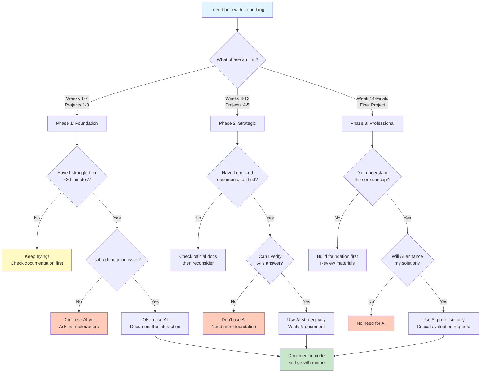

**Living Document Notice:** Given the rapid evolution of AI in education, this policy is essentially a pedagogical experiment. We're exploring together how to best integrate these powerful tools while maintaining deep learning. Your feedback and experiences will help refine these guidelines. Open communication is essential – if something isn't working or you discover better approaches, please share during Student Hacking Hours or class discussions. We're all learning how to navigate this new landscape together.

```{important} AI as a Socratic Tutor for Conceptual Learning - ALWAYS ENCOURAGED
:class: dropdown

Using AI to understand astrophysical concepts, mathematical derivations, statistical methods, programming paradigms, or any theoretical material is always permitted, but maximize your learning by using it as a **Socratic tutor**, not an answer machine.

### Universal Socratic Tutor Prompt (Copy & Paste This!)

Start your AI conversation with:

> "Act as a Socratic tutor for computational astrophysics. Don't give me direct answers. Instead, guide me to discover concepts myself through questions. When I'm stuck, give me hints, not solutions. Help me build intuition by asking what I think should happen physically/mathematically. If I ask for an explanation, first ask me what I already understand and what specifically confuses me. Make me work for the understanding - that's where learning happens."

**Built-in Learning Modes in Popular AI Tools:**
- **ChatGPT**: Use "Study and Learn" mode for interactive learning
- **Gemini**: Select "Guided Learning" for step-by-step understanding
- **Claude**: Create a "Study Project" or select "Learning" style for pedagogical responses

These modes are specifically designed to teach rather than just answer!

### Our Custom Tool

**Virtual Tutor:** [✨ASTR 596: Modeling the Universe Tutor✨ *(Custom GPT)*](https://chatgpt.com/g/g-68aabb9278d08191926feb3f5512686c-astr-596-modeling-the-universe-tutor) - Pre-programmed to teach through questions rather than give direct answers.

### The Learning Hierarchy (Try in Order)

1. **Course materials first** - Your docs, readings, lecture notes
2. **Think and struggle** - This is where learning happens (5-10 min)
3. **Formulate a specific question** - What exactly confuses you?
4. **Then engage AI as a tutor** - Not for answers, but for guided discovery

### Topics Always OK for AI Tutoring

**Physics & Astrophysics:**
- Stellar structure, radiative transfer, hydrostatic equilibrium
- Gravitational dynamics, conservation laws, virial theorem
- Optical depth, extinction, scattering processes

**Mathematics:**
- Taylor series, differential equations, linear algebra
- Jacobians, eigenvalues, matrix operations
- Gradient descent, optimization, loss functions

**Statistics & Probability:**
- Bayesian inference, MCMC convergence, priors/posteriors
- Central Limit Theorem, sampling distributions
- Gaussian processes, kernel methods, covariance functions

**Computational Concepts:**
- Big-O notation, algorithmic complexity, numerical stability
- Vectorization, parallelization, memory management
- Object-oriented design, functional programming paradigms

### How to Prompt for Socratic Learning

**Instead of:** "Explain the Central Limit Theorem"
**Try:** "I see that averages become Gaussian, but WHY does this happen regardless of the original distribution? Guide me to understand."

**Instead of:** "What's a Jacobian?"
**Try:** "I know Jacobians relate to coordinate transformations, but can you help me build intuition for what they represent geometrically?"

**Instead of:** "How does gradient descent work?"
**Try:** "I understand we're minimizing a function, but why do we move opposite the gradient? Can you guide me through the reasoning?"

### Why AI Should Be Your Last Resort (Not First)

The struggle before AI is where neural pathways form. Quick answers bypass the confusion that makes concepts stick. Think of AI like a spotter at the gym - essential for safety when you're stuck, but if they lift the weight for you, you don't get stronger.

**Good learning sequence:**
1. Read course material (5 min)
2. Get confused (normal!)
3. Re-read, try to identify the specific confusion (5 min)
4. Still stuck? NOW ask AI to guide (not tell) you

### NotebookLM for Grounded Learning

**NotebookLM excels here**: Upload course materials for grounded, accurate content. Unlike ChatGPT which might confidently explain incorrect physics or math, NotebookLM uses ONLY your sources. Perfect for generating practice problems and study guides from YOUR notes.

Examples of Socratic prompts for various topics:
- "Can you help me discover why Monte Carlo converges as 1/√N by asking me guiding questions?"
- "I'm confused about symplectic integrators. Can you be a tutor who helps me figure out why they conserve energy?"
- "Walk me through debugging my understanding of backpropagation - what questions should I be asking?"

Remember: Every minute you struggle before using AI is a minute of actual learning. Use AI to enhance understanding, not to avoid the productive struggle that builds expertise.
```

## Core Philosophy: AI as Performance Amplifier, Not Replacement

**The Reality**: AI tools are transforming scientific computing. You'll work in an AI-integrated environment throughout your career. But here's the critical insight: **AI makes human expertise MORE valuable, not less.** When everyone has access to the same AI tools, the differentiator becomes who can verify outputs, catch errors, ask better questions, and push beyond what AI already knows.

**The Challenge**: Research reveals both risks and opportunities. Over-reliance impairs learning (Bastani et al., 2024), while strategic use accelerates understanding (Kasneci et al., 2023; Bitzenbauer, 2023; Ting & O'Briain, 2025). **HOW you engage matters** – passive consumption atrophies skills, active collaboration enhances capability.

**Our Approach**: Develop core competencies through productive struggle, then use AI strategically to amplify performance. Critical thinking and deep understanding are no longer optional – they're mandatory for doing anything meaningful in computational science.

**Research Foundation**:

- **Ting & O'Briain (2025)**: Astronomy students using structured AI with documentation requirements showed decreased dependence over time and accelerated learning.
- **Kasneci et al. (2023)**: Scaffolded AI use enhances STEM learning when properly integrated.
- **Bitzenbauer (2023)**: AI chatbots effective when students engage critically with outputs.
- **Dahlkemper et al. (2023)**: Students often fail to identify AI errors without proper training.
- **Bastani et al. (2024)**: Students who rely on AI without understanding fundamentals show significantly worse learning outcomes.

These studies confirm that scaffolded AI use with reflection enhances rather than replaces learning.

## TL;DR Quick Reference (AI Policy)

| Phase | Weeks | Projects | Coding with AI | Learning with AI | Key Rule |
|------|-------|----------|----------------|------------------|----------|
| **1: Foundation** | 1-7 | Projects 1-3 | ❌ No first-draft code. ✅ Debugging **after 30 min** documented effort. | ✅ Always allowed, **docs-first**; use AI to clarify after reading | Struggle → Docs → AI (debug only) |
| **2: Strategic** | 8-13 | Projects 4-5 | ✅ After a working baseline; AI for refactors/tests/perf with verification | ✅ Always allowed (summaries, extensions) | Verify & cite source; explain why kept/rejected |
| **3: Professional** | 14-Finals | Final Project | ✅ Acceleration/boilerplate; ❌ Not for logic you can't explain | ✅ Research exploration; career prep | **Explain every algorithmic choice** |

**Universal Rules:**

- 📚 **Conceptual learning**: AI always encouraged for understanding (astro)physics, math, and how code works.
- 📖 **Documentation first**: Official docs are your primary source. Use AI to clarify, not replace them.
- 💻 **Code implementation**: Follow phase rules for writing actual code.
- 📝 **Attribution**: Every AI-assisted code change must include the in-code 3-line note (*AI* / *Verified* / *Because*).
- 🧠 **Ownership**: Can't explain it = Can't submit it

## Why This Three-Phase Scaffolding?

**Phase 1 builds your BS detector.** When you've debugged array indexing errors manually, you'll spot when AI suggests nonsensical indices. When you've implemented gradient descent from scratch, you'll recognize when AI's optimization is mathematically wrong.

**Phase 2 teaches verification.** You'll learn AI is confidently wrong surprisingly often. You'll develop the habit of checking everything against documentation, running tests, and understanding WHY suggestions work (or don't).

**Phase 3 shows professional integration.** With strong foundations, AI becomes a genuine accelerator. You'll automate the boring parts while focusing on novel problems. This is how AI is actually used at Google, NASA, and research institutions.

## Should I Use AI for This? Decision Flowchart



## How to Cite AI Usage - Template

### In-Code Documentation Template

```python
# AI: [Tool] suggested [very short what]
# Verified: [doc/source or quick check: limit test / unit / plot]
# Because: [1 short reason you kept it]
def your_function():
    # Implementation here
    pass
```

Place the 3-line note directly above the edited function or block.

### Growth Memo AI Section Template

Include a brief reflection on your AI usage:

```markdown
## AI Usage Reflection

**Most Significant AI Interaction This Project:**
When was AI most helpful and why?

**Critical Thinking Check:**
Did AI give you any incorrect/misleading information? How did you verify its suggestions? 
(This helps us all learn what to watch for!)

**Key Learning:**
What did this interaction teach you about the problem, concept, or about using AI effectively? 

**Evolution of My AI Use:**
How has your approach to using AI changed since the last project? 

**Next Steps:**
One specific way you plan to improve your AI usage next project
```

Write this however works for you – paragraphs, bullets, diagrams. Emojis encouraged! Just help me understand your learning journey.

## Scaffolded AI Integration Framework

### Phase 1: Foundation Building (Weeks 1-7, Projects 1-3)

**Dates: Aug 25 - Oct 13** | **Rule: Struggle First, AI Second**

- **Primary**: Documentation and manual code implementation
- **30-Minute Rule**: Minimum struggle before AI
- **AI Usage**: Debugging only after genuine effort
- **Document**: All interactions with verification
- **Friday Labs**: Try solving with your partner first – two brains often beat ChatGPT
- **Covers**: Projects 1 (Stellar Populations), 2 (N-Body), and 3 (MCRT)

**Using AI for Conceptual Understanding (Always OK):**

- ✅ **OK**: Open NumPy docs → confused by broadcasting → "Can you explain NumPy broadcasting with examples?"
- ✅ **OK**: "Why does matplotlib need both Figure and Axes objects?"
- ❌ **NOT OK**: "Write a function to calculate stellar luminosity" (that's implementation)
- **The Rule**: Docs open first, identify confusion, then ask AI to clarify

**What counts as genuine effort:**

Document struggle by showing **ANY TWO** of:

- Link to relevant documentation section you consulted
- Minimal reproducible example (≤20 lines) showing the issue
- Description of one failed approach and why it didn't work
- Screenshot of error with timestamp
- Links to 2+ Stack Overflow/forum searches attempted
- Photo of whiteboard/paper where you worked through logic
- Slack/Discord message asking peers for help

**Good Example:**

```python
# Spent 30 min on matplotlib subplots
# Checked docs, AI clarified Figure vs Axes
# Verified: matplotlib.org/stable/api/figure_api.html
fig, axes = plt.subplots(2, 2, figsize=(10, 8))
```

### Phase 2: Strategic Integration (Weeks 8-13, Projects 4-5)

**Dates: Oct 14 - Nov 24** | **Rule: Documentation-First**

- **Primary**: Continue documentation-first
- **AI Enhancement**: For efficiency after understanding
- **Verify**: Cross-reference all suggestions
- **Evaluate**: Explain why suggestions work
- **Covers**: Project 4 (Bayesian/MCMC) and Project 5 (Gaussian Processes)
- **Note**: Project 5 due Monday Nov 24 (first day of Week 14)

**Now you can use AI for:**

- Optimizing working code
- Generating test cases
- Exploring alternative implementations
- Understanding advanced features
- BUT: Must have baseline working first

**How to Verify AI Suggestions:**

1. **Physics checks**: Does energy conserve? Are units dimensional correct?
2. **Limit tests**: Does N=2 match analytical? Does v→0 give classical limit?
3. **Benchmark**: Compare with known solutions or simpler cases
4. **Performance**: Actually time it – is it faster or just more complex?
5. **Readability**: Is AI's "clever" solution maintainable by you?

### Phase 3: Professional Practice (Week 14-Finals, Final Project)

**Dates: Nov 24 - Dec 18** | **Rule: AI as Productivity Tool**

- **Starts**: Week 14 (Nov 24) after Project 5 submission
- **Assumption**: Foundation enables evaluation
- **Usage**: Acceleration and complex problems
- **Standard**: Must be able to explain every algorithmic choice and non-standard implementation (not every line of boilerplate)
- **Continue**: Cite all usage
- **Context**: Neural Networks with JAX implementation

**Now AI can handle tedious tasks:**

- Generate docstrings from your working code
- Create unit tests for your functions
- Refactor repetitive code into clean functions
- Generate boilerplate code (argparse, logging setup)
- Convert your plots into publication-quality figures
- Write regex patterns for data parsing

**Note:** Tool availability subject to change. If access issues occur, document and discuss in class.

## 🤔 When in Doubt

**Build judgment through community:**

1. **Come to Student Hacking Hours** (Wednesdays 1-2 PM)
2. **Ask during class**
3. **Discuss with classmates**
4. **Email if urgent**: <alrosen@sdsu.edu>

Your questions help everyone develop better intuition!

## Special Circumstances

**English as Second Language**: If English is not your first language, using AI for translation and clarification of instructions is always permitted beyond phase restrictions.

**Stuck Outside Office Hours**: If it's late and you're genuinely blocked after 45+ minutes of documented effort, use AI minimally to get unstuck, then discuss with me in the next class.

**Disability Accommodations**: Individual accommodations through Student Ability Success Center supersede general policy. Please discuss your needs with me early in the semester.

## Specific Examples: Good vs Bad AI Usage

### Debugging (All Phases - After Struggle)

✅ **GOOD**: "I'm getting IndexError on line 45. I've checked array dimensions, confirmed indices are within bounds, and added print statements. The error happens when i=n. Why might this occur in a loop?"

❌ **BAD**: "Fix this error: [paste entire code and error]"

### Concept Understanding (All Phases)

✅ **GOOD**: "I understand Euler integration accumulates error. Can you explain why RK4 has O(h^4) error while Euler has O(h)? I've read that it's related to Taylor series but don't see the connection."

❌ **BAD**: "Explain RK4 integration"

### Optimization (Phase 2-3)

✅ **GOOD**: "My N-body simulation works but takes 5 minutes for 1000 particles. I'm using nested loops for force calculation. Here's my approach [show code]. What optimization strategies should I consider?"

❌ **BAD**: "Make this code faster"

## The Cognitive Ownership Principle

After consulting AI, **close the tab and re-implement from memory**. Do not paste generated code. If you can't write it yourself, you don't understand it yet. You may be asked for a 1–2 minute walkthrough of a function during lab to demonstrate understanding; this is supportive, not punitive.

## AI as Learning Companion vs. Code Generator

### The Critical Distinction

**AI for Learning (ALWAYS ENCOURAGED):**

- Understanding astrophysical and mathematical concepts
- Exploring theoretical foundations
- Connecting ideas across domains
- Going beyond assignment requirements
- Generating study materials
- Clarifying mathematical derivations
- See the dropdown above for detailed examples and prompting strategies

**AI for Coding (PHASE-DEPENDENT):**

- Follow the three-phase scaffold
- Document all code assistance
- Verify against documentation
- Must explain every line

## Recommended Learning Tools

### NotebookLM (For grounded study aids)

*Use with an institutional/SSO account when possible; availability can change.*

**Why it's ideal:** Uses ONLY the sources you provide, dramatically reducing hallucination risk compared to general-purpose LLMs.

**Perfect uses:**

- Upload course readings → Generate study guide
- Upload your notes → Create practice questions
- Upload project specs → Generate clarifying questions
- Upload papers → Create literature summary
- Use podcast feature → Audio review while commuting

### ChatGPT (For Conceptual Exploration)

*Note: SDSU provides enterprise access to all students*<br\>
**Privacy Protection:** The SDSU enterprise account ensures "OpenAI doesn't use San Diego State University workspace data to train its models." Your conversations are private.

**Best for:**

- Interactive concept exploration
- Socratic dialogue about astrophysics
- *"What if?"* scenarios
- Connecting course material to research literature
- Practice problems (not homework!)

## AI Usage Log (Optional but Recommended)

### Building Your Technical Growth Portfolio

Keep a simple log of significant AI interactions for your final portfolio:

```markdown
Date | Project | What AI Helped With | Key Insight
9/15 | N-body | Debugging array indexing | Check bounds BEFORE loop
10/2 | MCRT | Understanding optical depth | It's cumulative, not local
```

**Final Portfolio:** Select 3-5 best examples showing Phase 1→3 evolution.

## Assessment Standards for AI-Assisted Work

### Quality Expectations

Work demonstrating deep understanding through:

- **Iterative development** evidenced by Git history (minimum 5 meaningful commits per project showing progression, not just initial/final)
- **Verification practices** shown in documentation
- **Conceptual mastery** demonstrated in explanations
- **Professional integration** with critical evaluation

**Git Commit Standards**: Single-commit or few-commit submissions suggest potential policy violation. Commits should show your thinking evolving, bugs being fixed, features being added incrementally.

### When Work Doesn't Meet Standards

If submitted work lacks evidence of understanding:

1. **Learning Intervention**: One-on-one discussion to identify gaps
2. **Revision Opportunity**: Resubmit with enhanced documentation (one time)
3. **Adjusted Assessment**: Work evaluated based on demonstrated independent understanding

### Clear Violations

Extensive undocumented AI use or inability to explain submitted code:

- Referred to academic integrity process per university policy
- Project receives assessment based solely on demonstrated understanding

## Critical Thinking: Recognizing AI Limitations

You'll learn to:

- **Recognize when AI is confidently wrong** (it often is!)
- **Fact-check mathematical derivations** (AI invents plausible-looking math)
- **Spot nonsensical code that "looks right"** (compiles but produces wrong results)
- **Debug AI-generated algorithms** that almost-but-don't-quite work
- **Ask better questions** that get better answers

Remember: The difference between someone who asks "write me an MCMC sampler" and someone who says "help me optimize my Metropolis-Hastings acceptance ratio for this specific posterior geometry" is the difference between a tool-user and a tool-builder.

## Bottom Line

AI amplifies capability – it doesn't replace understanding. When everyone can generate code with AI, the scarce resource becomes people who know if that code is correct, why it works, and how to extend it to solve new problems. This course makes you one of those people.

Master fundamentals AND strategic AI usage to thrive. The struggle is where learning happens; AI should enhance your learning journey, not bypass it.

**Questions?** Come to Student Hacking Hours or ask in class. Open communication helps everyone!

## Quick Reference Card

**Phase 1 (Weeks 1–6):** Struggle 30 min → Check docs → Debug with AI only
**Phase 2 (Weeks 7–12):** Working baseline → Enhance with AI → Verify everything  
**Phase 3 (Final Project):** Core understanding → Accelerate with AI → Explain every line
**Always:** Can't explain = Can't submit | Docs first | Document all AI use

---

## References

- Bastani, H., Bastani, O., Sungu, A., Ge, H., Kabakcı, O., & Mariman, R. (2024). [*Generative AI can harm learning*](http://dx.doi.org/10.2139/ssrn.4895486)

- Bitzenbauer, P. (2023), [*ChatGPT in physics education: A pilot study on easy-to-implement activities*](https://doi.org/10.30935/cedtech/13176), Contemporary Educational Technology

- Dahlkemper, M. N., Lahme, S. Z., & Klein, P. (2023). [*How do physics students evaluate artificial intelligence responses on comprehension questions? A study on the perceived scientific accuracy and linguistic quality of ChatGPT*](https://doi.org/10.1103/PhysRevPhysEducRes.19.010142), Physical Review Physics Education Research

- Kasneci, E., Sessler, K., Küchemann, S., Bannert, M., Dementieva, D., Fischer, F., ... & Kasneci, G. (2023). [*ChatGPT for good? On opportunities and challenges of large language models for education*](https://doi-org.libproxy.sdsu.edu/10.1016/j.lindif.2023.102274), Learning and Individual Differences

- Ting, Y. S., & O'Briain, D. (2025). [*Teaching machine learning in the era of large language models: Lessons learned from a graduate astronomy course*](https://arxiv.org/abs/2506.06921) (arXiv preprint)
