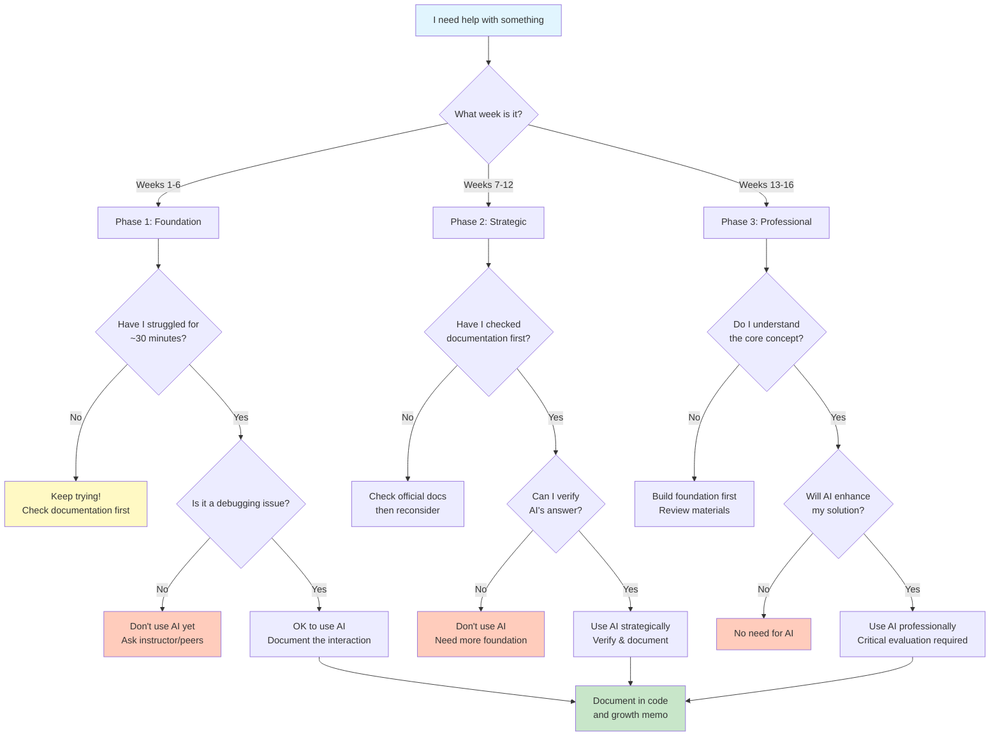

---
jupytext:
  formats: md:myst
  text_representation:
    extension: .md
    format_name: myst
kernelspec:
  display_name: Python 3
  language: python
  name: python3
---

# ASTR 596 AI Policy & Learning Framework

**Living Document Notice:** Given the rapid evolution of AI in education, this policy is essentially a pedagogical experiment. We're exploring together how to best integrate these powerful tools while maintaining deep learning. Your feedback and experiences will help refine these guidelines. Open communication is essential—if something isn't working or you discover better approaches, please share during Hacking Hours or class discussions. We're all learning how to navigate this new landscape together.

## TL;DR Quick Reference (AI Policy)

| Phase | Weeks | Coding with AI | Learning with AI | Key Rule |
|------|-------|----------------|------------------|----------|
| **1: Foundation** | 1–6 | ❌ No first-draft code. ✅ Debugging **after 30 min** documented effort. | ✅ Always allowed, **docs-first**; use AI to clarify after reading | Struggle → Docs → AI (debug only) |
| **2: Strategic** | 7–12 | ✅ After a working baseline; AI for refactors/tests/perf with verification | ✅ Always allowed (summaries, extensions) | Verify & cite source; explain why kept/rejected |
| **3: Professional** | 13–16 | ✅ Acceleration/boilerplate; ❌ Not for logic you can’t explain | ✅ Research exploration; career prep | **Explain every line** |

**Universal Rules:**

- 📚 **Conceptual learning**: AI always encouraged for understanding (astro)physics, math, and how code works.
- 📖 **Documentation first**: Official docs are your primary source. Use AI to clarify, not replace them.
- 💻 **Code implementation**: Follow phase rules for writing actual code.
- 📝 **Attribution**: Every AI-assisted code change must include the in-code 3-line note (*AI* / *Verified* / *Because*).
- 🧠 **Ownership**: Can't explain it = Can't submit it


## **Should I Use AI for This? Decision Flowchart**



## Course Philosophy: AI as Performance Amplifier

**The Reality**: AI tools are transforming scientific computing. You'll work in an AI-integrated environment throughout your career.

**The Challenge**: Research reveals both risks and opportunities. Over-reliance impairs learning (Bastani et al., 2024), while strategic use accelerates understanding (Kasneci et al., 2023; Bitzenbauer, 2023; Ting & O'Briain, 2025). HOW you engage matters—passive consumption atrophies skills, active collaboration enhances capability.

**Our Approach**: Develop core competencies through productive struggle, then use AI strategically to amplify performance.

**Research Foundation**:

- **Ting & O'Briain (2025)**: Astronomy students using structured AI with documentation requirements showed decreased dependence over time and accelerated learning.
- **Kasneci et al. (2023)**: Scaffolded AI use enhances STEM learning when properly integrated.
- **Bitzenbauer (2023)**: AI chatbots effective when students engage critically with outputs.
- **Dahlkemper et al. (2023)**: Students often fail to identify AI errors without proper training.

These studies confirm that scaffolded AI use with reflection enhances rather than replaces learning.

### 🤔 When in Doubt

**Build judgment through community:**

1. **Come to Hacking (Office) Hours**
2. **Ask during class**
3. **Discuss with classmates**
4. **Email if urgent**: <alrosen@sdsu.edu>

Your questions help everyone develop better intuition!

## How to Cite AI Usage - Template

### In-Code Documentation Template

```python
# AI: [Tool] suggested [very short what]
# Verified: [doc/source or quick check: limit test / unit / plot]
# Because: [1 short reason you kept it]
def your_function():
    # Implementation here
    pass
```

Place the 3-line note directly above the edited function or block.

### Growth Memo AI Section Template

Include a brief reflection on your AI usage. Here's a suggested structure:

```markdown
## AI Usage Reflection

**Most Significant AI Interaction This Project:**
When was AI most helpful and why?

**Critical Thinking Check:**
Did AI give you any incorrect/misleading information? How did you verify its suggestions? 
(This helps us all learn what to watch for!)

**Key Learning:**
What did this interaction teach you about the problem, concept, or about using AI effectively? 

**Evolution of My AI Use:**
How has your approach to using AI changed since the last project? 

**Next Steps:**
One specific way you plan to improve your AI usage next project
```

Write this however works for you—paragraphs, bullets, diagrams. Emojis encouraged! Just help me understand your learning journey.

## Scaffolded AI Integration Framework

### Phase 1: Foundation Building (Weeks 1-6)

**Dates: Aug 29 - Oct 10** | **Rule: Struggle First, AI Second**

- **Primary**: Documentation and manual code implementation
- **30-Minute Rule**: Minimum struggle before AI
- **AI Usage**: Debugging only after genuine effort
- **Document**: All interactions with verification
- **Friday Labs**: Try solving with your partner first—two brains often beat ChatGPT

**Using AI for Conceptual Understanding (Always OK):**

- ✅ **OK**: Open NumPy docs → confused by broadcasting → "Can you explain NumPy broadcasting with examples?"
- ✅ **OK**: "Why does matplotlib need both Figure and Axes objects?"
- ❌ **NOT OK**: "Write a function to calculate stellar luminosity" (that's implementation)
- **The Rule**: Docs open first, identify confusion, then ask AI to clarify

**What counts as genuine effort:**

**Any 2 of:** link a relevant doc section; show a ≤20-line minimal repro; note one failed approach and why it failed.

**Good Example:**

```python
# Spent 30 min on matplotlib subplots
# Checked docs, AI clarified Figure vs Axes
# Verified: matplotlib.org/stable/api/figure_api.html
fig, axes = plt.subplots(2, 2, figsize=(10, 8))
```

### **Phase 2: Strategic Integration (Weeks 7-12)**

**Dates: Oct 11 - Nov 21** | **Rule: Documentation-First**

- **Primary**: Continue documentation-first
- **AI Enhancement**: For efficiency after understanding
- **Verify**: Cross-reference all suggestions
- **Evaluate**: Explain why suggestions work

### **Phase 3: Professional Practice (Weeks 13-16)**

**Dates: Nov 22 - Dec 18** | **Rule: AI as Productivity Tool**

- **Assumption**: Foundation enables evaluation.
- **Usage**: Acceleration and complex problems.
- **Standard**: AI work must match or exceed manual quality.
- **Continue**: Cite all usage.

**Now AI can handle tedious tasks:**

- Generate docstrings from your working code.
- Create unit tests for your functions.
- Refactor repetitive code into clean functions.
- Generate boilerplate code (argparse, logging setup).
- Convert your plots into publication-quality figures.
- Write regex patterns for data parsing.

**Note:** Tool availability subject to change. If access issues occur, document and discuss in class.

## **AI Usage Log (Optional but Recommended)**

### Building Your Technical Growth Portfolio

Keep a simple log of significant AI interactions for your final portfolio (for your learning, not graded weekly).

**Why?** Documents journey, reveals patterns, provides interview examples, mirrors industry practice

**Simple format:**
```
Date | Project | What AI Helped With | Key Insight
9/15 | N-body | Debugging array indexing | Check bounds BEFORE loop
10/2 | MCRT | Understanding optical depth (after reading Rybicki) | It's cumulative, not local
```

**Final Portfolio:** Select 3-5 best examples showing Phase 1→3 evolution.
**Git Note:** Your commits should show iterative development throughout each project, not single submissions.

## Specific Examples: Good vs Bad AI Usage

### Debugging (All Phases - After Struggle)

✅ **GOOD**: "I'm getting IndexError on line 45. I've checked array dimensions, confirmed indices are within bounds, and added print statements. The error happens when i=n. Why might this occur in a loop?"

❌ **BAD**: "Fix this error: [paste entire code and error]"

### Concept Understanding (All Phases)

✅ **GOOD**: "I understand Euler integration accumulates error. Can you explain why RK4 has O(h^4) error while Euler has O(h)? I've read that it's related to Taylor series but don't see the connection."

❌ **BAD**: "Explain RK4 integration"

### Optimization (Phase 3)
✅ **GOOD**: "My N-body simulation works but takes 5 minutes for 1000 particles. I'm using nested loops for force calculation. Here's my approach [show code]. What optimization strategies should I consider?"

❌ **BAD**: "Make this code faster"

## Assessment Integration

### AI Reflection for Growth Memos

Each Growth Memo (see [Growth Memo Guidelines](../08-short-projects/growth-memo-guidelines) for full requirements) includes a brief AI usage reflection using this template:

```markdown
## AI Usage Reflection

**Most Significant AI Interaction This Project:**
Brief description of when AI was most helpful and why.

**Critical Thinking Check:**
Did AI give you any incorrect/misleading information? How did you verify its suggestions? 

**Key Learning:**
What did this interaction teach you about the problem, concept, or about using AI effectively? 

**Evolution of My AI Use:**
How has your approach to using AI changed since the last project? 
Are you becoming more independent, more strategic, or finding new ways to use it?

```

### Understanding Verification

Throughout the course, expect supportive check-ins:

- "Walk me through your approach here"
- "What alternatives did you consider?"
- "How would this change if...?"

These conversations support your learning—catching confusion early helps!

## The Cognitive Ownership Principle

After consulting AI, **close the tab and re-implement from memory**. Do not paste generated code. If you can’t write it yourself, you don’t understand it yet. You may be asked for a 1–2 minute walkthrough of a function during lab to demonstrate understanding; this is supportive, not punitive.

## **How AI Usage Affects Your Learning**

**The Simple Rule**: You must be able to explain every line of code you submit and why you implemented it that way.

During class, I may ask you to walk through your approach or explain your implementation choices. This isn't a formal assessment—it's how we learn together and ensure you're building real understanding. If you can't explain your code, that's a signal you need to revisit it until you truly understand it.

Your Growth Memos will include the AI reflection template above, helping you track your own journey toward independence and mastery.

## **Assessment Standards for AI-Assisted Work**

### Quality Expectations

Work demonstrating deep understanding through:

- **Iterative development** evidenced by Git history
- **Verification practices** shown in documentation
- **Conceptual mastery** demonstrated in explanations
- **Professional integration** with critical evaluation

These represent graduate-level computational science standards.

### **When Work Doesn't Meet Standards**

If submitted work lacks evidence of understanding:

1. **Learning Intervention**: One-on-one discussion to identify gaps
2. **Revision Opportunity**: Resubmit with enhanced documentation (one time)
3. **Adjusted Assessment**: Work evaluated based on demonstrated independent understanding

### **Clear Violations**

Extensive undocumented AI use or inability to explain submitted code:

- Referred to academic integrity process per university policy
- Project receives assessment based solely on demonstrated understanding

## **AI as Learning Companion vs. Code Generator**

### **The Critical Distinction**

**AI for Learning (ALWAYS ENCOURAGED):**

- Understanding astrophysical concepts
- Exploring theoretical foundations
- Connecting ideas across domains
- Going beyond assignment requirements
- Generating study materials
- Clarifying mathematical derivations

**AI for Coding (PHASE-DEPENDENT):**

- Follow the three-phase scaffold
- Document all code assistance
- Verify against documentation
- Must explain every line

### When AI Tutoring is ALWAYS Appropriate

#### **Conceptual Understanding (All Phases)**

✅ **Physics & Astrophysics Concepts**

- "Explain why the virial theorem matters for stellar stability"
- "How does optical depth relate to extinction?"
- "What's the physical intuition behind the Jeans mass?"
- "Connect radiative transfer to what we observe with telescopes"

✅ **Mathematical Foundations**

- "Walk me through the derivation of the diffusion approximation"
- "Why does the Monte Carlo method converge as 1/√N?"
- "Explain the connection between Gaussian processes and Bayesian inference"

✅ **Going Deeper (Extension Work)**

- "What would happen if I added several very massive stars ($>100 M_{\odot}$) to my N-body simulation?"
- "How could I extend this to include relativistic effects?"
- "What research questions could I explore with this code?"
- "What other absorption/scattering effects can I add to my MCRT algorithm?"

### **Recommended Learning Tools**

#### **NotebookLM (For grounded study aids)**

*Use with an institutional/SSO account when possible; availability can change.*

**Why it's ideal:** Uses ONLY the sources you provide, dramatically reducing hallucination risk compared to general-purpose LLMs. While no AI is perfect, NotebookLM's responses are grounded in your uploaded materials.

**Perfect uses:**

- Upload course readings → Generate study guide
- Upload your notes → Create practice questions
- Upload project specs → Generate clarifying questions
- Upload papers → Create literature summary
- Use podcast feature → Audio review while commuting
- Generate FAQs → Test your understanding

**How to use effectively:**

1. Upload all course materials for that week
2. Ask it to explain connections between readings
3. Generate different perspectives on difficult concepts
4. Create personalized study materials

#### **ChatGPT (For Conceptual Exploration)

*Note: SDSU provides enterprise access to all students via ChatGPT Plus*
**Privacy Protection:** The SDSU enterprise account ensures "OpenAI doesn't use San Diego State University workspace data to train its models." Your conversations are private—this tool is provided to enhance your learning, not to monitor your work. Use it freely for conceptual understanding!

**Best for:**

- Interactive concept exploration
- Socratic dialogue about physics
- "What if?" scenarios
- Connecting course material to research literature
- Practice problems (not homework!)
- Creating projects to maintain context across the semester

### Strategic Learning Dialogues

#### Example: Using AI to Deepen Understanding

```markdown
**You:** "I implemented the leapfrog integrator and it conserves energy better than RK4. But I don't understand WHY. Can you help me build intuition about symplectic integrators without just telling me the answer?"

**AI:** "Let's think about this together. First, what do you notice about the structure of the leapfrog algorithm compared to RK4? Specifically, how does it update positions vs velocities?"

**You:** "They're updated separately... offset by half a timestep?"

AI: "Exactly! Now think about what conservation laws tell us about physical systems. What quantity should remain constant in your N-body simulation if no energy is added or removed?"

[Continue building understanding through dialogue]
```

### **The Learning Enhancement Framework**

| Learning Goal | AI Tool | How to Use | Expected Outcome |
|--------------|---------|------------|------------------|
| **Pre-class Prep** | NotebookLM | After reading, upload materials to generate overview/connections | Better questions in class |
| **Concept Clarification** | ChatGPT | Socratic dialogue | Deeper understanding |
| **Extension Ideas** | ChatGPT | "What if I tried..." | Research-quality projects |
| **Study Materials** | NotebookLM | Generate from your materials | Personalized review |
| **Connection Making** | ChatGPT Projects | "How does this relate to..." | Integrated knowledge |
| **Paper Understanding** | ChatGPT | Explain papers in course context | Literature awareness |

## Recommended AI Tools and Strategies

### **Tools for This Course**

- **NotebookLM**: Upload course materials for grounded study aids and personalized AI tutoring.
- **ChatGPT**: Conceptual learning and code debugging (SDSU enterprise access).
- **Code Completion in IDE**: DISABLED per syllabus.

### Strategic Usage Tips

1. **Separate learning from implementation** - Use AI freely for concepts, carefully for code
2. **Request teaching, not answers**: "Help me understand..." not "What's the solution?"
3. **Build mental models**: "What's the intuition behind..." 
4. **Verify everything**: Check AI physics against textbooks
5. **Document insights**: Keep a learning journal of AI-aided discoveries

### AI Learning Best Practices


**Two-Track System:**

1. **Learning Track** (unrestricted): Use AI freely for physics concepts, math, research
2. **Implementation Track** (phase-restricted): Follow scaffolding rules for code

### **Signs You're Using AI Correctly**

- **For Learning**: You're asking deeper questions each week.
- **For Coding**: Your AI usage becomes more selective and strategic over time.
- You catch errors in AI suggestions.
- You can explain why AI's approach works/doesn't work.
- You modify AI suggestions to improve them.
- You're learning faster, not just finishing faster.
- You're excited about extensions beyond requirements.

## **Bottom Line**

AI amplifies capability—it doesn't replace understanding. Master fundamentals AND strategic AI usage to thrive. The struggle is where learning happens; AI should enhance your learning and skill development journey, not bypass it.

**Questions?** Come to Hacking Hours or ask in class. Open communication helps everyone!

## **Quick Reference Card**

**Phase 1 (Weeks 1–6):** Debug after 30 min effort. Concepts via AI are allowed (docs-first).  
**Phase 2 (Weeks 7–12):** Efficiency/refactors after baseline; verify & cite.  
**Phase 3 (Weeks 13–16):** Acceleration/boilerplate; not for logic you can’t explain.  
**Always:** If you can’t explain it, you can’t submit it.

---

## References

- Bastani, H., Bastani, O., Sungu, A., Ge, H., Kabakcı, O., & Mariman, R. (2024). [*Generative AI can harm learning*](http://dx.doi.org/10.2139/ssrn.4895486) 

- Bitzenbauer, P. (2023), [*ChatGPT in physics education: A pilot study on easy-to-implement activities*](https://doi.org/10.30935/cedtech/13176), Contemporary Educational Technology

- Dahlkemper, M. N., Lahme, S. Z., & Klein, P. (2023). [*How do physics students evaluate artificial intelligence responses on comprehension questions? A study on the perceived scientific accuracy and linguistic quality of ChatGPT*](https://doi.org/10.1103/PhysRevPhysEducRes.19.010142), Physical Review Physics Education Research

- Kasneci, E., Sessler, K., Küchemann, S., Bannert, M., Dementieva, D., Fischer, F., ... & Kasneci, G. (2023). [*ChatGPT for good? On opportunities and challenges of large language models for education*](https://doi-org.libproxy.sdsu.edu/10.1016/j.lindif.2023.102274), Learning and Individual Differences

- Ting, Y. S., & O'Briain, D. (2025). [*Teaching machine learning in the era of large language models: Lessons learned from a graduate astronomy course*](https://arxiv.org/abs/2506.06921) (arXiv preprint)