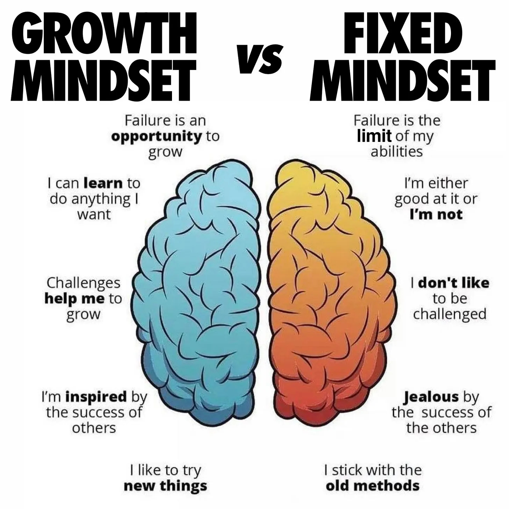

---
jupytext:
  formats: md:myst
  text_representation:
    extension: .md
    format_name: myst
kernelspec:
  display_name: Python 3
  language: python
  name: python3
---

# Why ASTR 596 is Designed This Way

## TL;DR: This Course Prepares You for Research Reality

Traditional courses teach you to follow recipes and get right answers. Research requires creating solutions to problems nobody has solved yet. This course bridges that gap through:

- **"Glass box" modeling** - Build it yourself to truly understand it.
- **Productive struggle** - Embrace confusion and frustration as the beginning of discovery.
- **Growth over perfection** - Learn from failure rather than avoiding it.
- **Strategic AI integration** - Use tools to amplify, not replace, thinking.
- **Neuroplasticity in action** - Your brain literally rewires through challenge (this is proven neuroscience, not motivational fluff).

---

## The Research Environment You're Entering

### What Professional Technical Work Actually Looks Like

Whether pursuing academia, industry, or other technical careers, you'll face:

- **No predetermined answers** - You're solving problems nobody has tackled before.
- **Independent problem-solving** - Supervisors and research advisors expect solutions, not hand-holding requests.
- **Creative adaptation** - Standard methods need modification for new contexts.
- **Peer collaboration** - Working effectively with colleagues at your level.
- **AI-integrated workflows** - Strategic tool use is now becoming the standard.
- **Continuous learning** - Technology and knowledge evolve; professionals must too.
- **Cross-disciplinary thinking** - Real problems ignore academic boundaries.

### The Jarring Transition: Student → Scientist

As Martin Schwartz explains in his 2008 essay ["The Importance of Stupidity in Scientific Research"](https://doi.org/10.1242/jcs.033340) published in *Nature* (required reading for Week 1):

> **Undergraduate coursework**: Getting the right answers, feeling smart when you know them.
> 
> **Graduate research**: "Immersion in the unknown," where nobody knows the answers — *that's why it's research*.

Schwartz's key realization came when his Nobel Prize-winning advisor couldn't solve a research problem:

> **"That's when it hit me: nobody did. That's why it was a research problem."**

But here's the critical problem Schwartz identified nearly two decades ago that **still plagues STEM education today**:

> **"We don't do a good enough job of teaching our students how to be productively stupid — that is, if we don't feel stupid it means we're not really trying."**

Despite this recognition in 2008, most courses still haven't addressed this gap. This course directly tackles the problem. We intentionally create opportunities for productive stupidity — the kind where you're pushing beyond your comfort zone into genuine discovery. This requires being comfortable not knowing, so you can explore genuinely unknown territory where breakthroughs happen.

---

## Why Traditional Teaching Falls Short for Research Preparation

### The "Recipe Following" Problem

| Traditional Approach | Research Reality |
|---------------------|------------------|
| "Here's the method, follow these steps." | "Here's a phenomenon — figure out how to study it." |
| "Use this package exactly as shown." | "Choose tools, adapt them, integrate approaches." |
| "Avoid mistakes — they hurt your grade." | "Learn from mistakes — they drive discovery and skill development." |
| "What does the professor want?" | "What does this result mean?" |

### The Passive Learning Trap

Traditional courses accidentally train students to:

- Wait for instructions rather than taking initiative.
- See confusion as failure rather than opportunity.
- Avoid intellectual risks that lead to discoveries.
- Focus on grades over understanding.

**This doesn't prepare you for careers where creativity and independent thinking are essential.**

But here's what traditional courses rob you of: **the addictive joy of discovery**. There's nothing quite like the rush of finally cracking a problem you've been wrestling with for hours. That "aha!" moment when disparate pieces suddenly click together. The pride of building something that works through your own effort and creativity. 

Research scientists don't endure the struggle despite the difficulty — they do it because solving hard problems and coming up with new ideas and strategies keeps things exciting. This course is designed to provide you with similar opportunities in a supportive, educational environment.

---

## Our Evidence-Based Design Choices

### Research Validation

**Ting & O'Briain (2025)** studied LLM integration in astronomy education and found:

- Students **decreased AI dependence over time** with structured guidance.
- AI became a **learning tool rather than shortcut**.
- Documentation requirements **fostered metacognitive awareness**.
- **High student satisfaction** with professional skill development.

**Key insight**: Thoughtful AI integration with reflection requirements enhances learning while building essential 21st-century skills.

**Li (2024)** found that new-era university students need scaffolded transitions to autonomy — they have strong abilities but weak self-control without structure. This directly informs our three-phase approach.

### Core Design Elements

#### 1. "I Want You to Think" Focus

- **Why**: Research requires contributing ideas, not following directions.
- **How**: Explicitly reward thinking over compliance.

#### 2. Growth Over Perfection

- **Why**: Research involves failed experiments and iteration.
- **How**: Build resilience through **productive failure**.
- **Evidence**: Neural research shows error awareness directly predicts learning (Tirri & Kujala, 2016).

#### 3. Mandatory Project Extensions

- **Why**: Real research means going beyond minimums by testing new ideas.
- **How**: Practice asking "what if?" and "why does this happen?"

#### 4. Strategic AI Integration

- **Why**: AI is becoming standard in industry and research but requires critical thinking and domain expertise.
- **How**: Three-phase scaffolding from minimal to professional use.

#### 5. Pair Programming

- **Why**: Modern research is collaborative.
- **How**: Develop communication and mutual learning skills.

---

---

## What This Means for You

### The Skills You're Actually Developing

**Computational Competencies:**

- Code literacy and debugging.
- Documentation and version control.
- Performance optimization.
- Testing and validation.

**Scientific Thinking:**

- Hypothesis formation.
- Method selection.
- Result interpretation.
- Limitation assessment.

### **Professional Habits:**

- Intellectual honesty.
- Collaborative learning.
- Continuous improvement.
- Resilience through challenges.

### Technical Python Skills You'll Build

This is a Python-intensive course. You'll develop:

- Proficiency with NumPy, Matplotlib, SciPy  
- Debugging complex numerical code
- Performance optimization techniques
- Version control and documentation practices
- JAX and modern ML frameworks
- Ability to implement research papers from scratch

These aren't just academic exercises – these are the exact tools used at NASA, national labs, and tech companies.

---

## Addressing Your Concerns

### "This seems different than other courses"

**Yes, it is different — intentionally.** This requires consistent daily practice unlike lecture-based courses. You're developing new neural pathways for independent thinking and creative problem-solving. This isn't metaphorical — neuroscience research shows this literally requires brain rewiring through effortful practice.

**The neuroscience is clear:**

- **Your brain physically rewires when learning challenging material.** Woollett & Maguire (2011) demonstrated that London taxi drivers' hippocampi — the brain region crucial for spatial navigation — grew measurably larger after mastering the city's 25,000+ streets. This structural brain change occurred in adults averaging 40+ years old, proving neuroplasticity works at any age.

- **Struggle directly triggers neuroplasticity.** When you wrestle with difficult concepts, your brain releases BDNF (brain-derived neurotrophic factor), often called "Miracle Gro for the brain." This protein stimulates the formation of new synaptic connections (Draganski et al., 2004).

- **Error signals drive learning.** Moser et al. (2011) used EEG to show that the brain generates two distinct responses to mistakes: error detection (ERN) and error awareness (Pe). Students with growth mindsets showed enhanced Pe amplitude, which directly predicted improved performance. Your brain literally learns more from errors than successes.

- **Growth mindset has measurable neural correlates.** Tirri & Kujala (2016) found that believing intelligence is malleable activates different brain networks during problem-solving, leading to enhanced error processing and better learning outcomes across thousands of replicated studies.

**Translation**: That uncomfortable feeling when grappling with new concepts? That's your neurons forming new connections. You're not "bad at this" — *you're actively growing smarter*.

### "I'm making more mistakes than usual!"

**Perfect!** This is exactly what Schwartz advocates for. Remember his key insight: 

> "We don't do a good enough job of teaching our students how to be productively stupid."

This course does that job. We create structured opportunities for you to feel confused, make mistakes, and push through to fix them — *because that's where real learning happens*.

**Here's the neuroscience of why mistakes are so powerful**: Your brain is evolutionarily wired to remember failures more vividly than successes. When you make an error, your brain releases a cascade of neurotransmitters that essentially bookmark that moment — "Don't do that again!" This is why you'll forget a hundred correct answers but remember that one embarrassing mistake forever.

In programming, this is a superpower. Every bug you encounter, every error message you debug, every wrong approach you try gets seared into your memory. You likely won't make that mistake again. This is far more effective than being shown the "right way" first — your brain barely registers smooth successes, but it never forgets a good failure.

Mistakes signal your brain is building new neural pathways. Avoiding struggle means avoiding expertise development. Every error teaches you something textbooks can't.

### "I feel lost sometimes."

**Everyone does.** The difference between those who succeed and those who don't isn't ability — it's persistence and willingness to seek help.

**Critical insight from research** (Uwerhiavwe, 2022): Mathematical ability is socially constructed, not innate. If you've ever thought you're "not a math person" or "not good with computers," this is a learned limitation, not a biological fact. Research definitively shows these beliefs are shaped by past experiences and can be changed through new experiences, proper support, and resilience.

---

## Your Agency in This Process

This is **your education and your career**. I provide opportunities; you decide your engagement level.

### What I Offer

- Structured opportunities for developing independence.
- Professional skills for any technical career.
- Support as you enhance your problem-solving capabilities and independent thinking skills.
- Safe environment for intellectual risk-taking. In fact, this is a requirement for assignments.

### What You Control

- **Engagement level**: How deeply you dive into explorations.
- **Learning goals**: Which skills you prioritize.
- **Career direction**: Academia, industry, or something else.
- **Relationship with challenges**: Obstacles or opportunities?

### Three Valid Approaches

1. **Minimum**: Meet requirements, pass, move on.
2. **Growth**: Develop stronger technical and problem-solving skills.
3. **Transformation**: Fundamentally change how you approach learning.

All are valid. I hope you choose deeper engagement, but it's your decision.

---

## Week 1 Survival Guide

### Expect This Trajectory

- **Initial adjustment period**: "I'm completely lost" → Normal, your brain is rewiring through project-based learning
- **Connecting concepts phase**: "Some things make sense" → Patterns emerging across projects
- **Acceleration phase**: "I can do this" → Confidence and speed increase notably
- **Mastery development**: "This is actually fun" → Solving problems becomes genuinely enjoyable

This progression aligns with research on skill acquisition and deliberate practice [(*Peak: Secrets from the New Science of Expertise*, Ericsson & Pool, 2016)](https://notes.andymatuschak.org/Peak_-_Ericsson_and_Pool).

That "actually fun" phase is real. Once you experience the satisfaction of solving something yourself — debugging that stubborn error, watching your simulation finally work, seeing your MCMC converge — you'll understand why researchers voluntarily spend their lives tackling hard problems and consistently learn new topics and techniques independently. 

### Immediate Actions

1. **Accept confusion and frustration as normal** - Everyone feels lost initially.
2. **Use the 30-minute rule** - Struggle builds problem-solving muscles.
3. **Form study partnerships** - This is a small class - leverage each other.
4. **Come prepared with specific questions** - "I tried X, expected Y, got Z."

### Mindset Shifts to Practice

**Remember the neuroscience**: Every time you struggle and push through, you're literally building new neural pathways. This isn't motivational speaking — it's biological fact.

- **Add "yet":** "I don't understand this **yet**" (growth mindset activation).
- **Reframe errors:** "Interesting, why did that break?" (error-positive learning).
- **Celebrate failures:** "I learned three ways that don't work" (Edison had 1,000+ "failures" before inventing the lightbulb).
- **Value questions:** "What am I missing?" (metacognitive development).

Your brain is plastic. **Intelligence and ability are not fixed.** Every struggle makes you literally, measurably smarter. The MRI scans prove it.

---

## The Bottom Line

You're not just learning to code and design algorithms. You're learning to think like a computational scientist and astrophysicist.

Computational thinking requires consistent daily practice, not last-minute cramming. **Ultimately, what you get from this course is proportional to what you invest.** I've designed every element to maximize your growth — the scaffolding, the struggle, the support. But I can't do the learning for you. The students who embrace the challenge, lean into the discomfort, and engage deeply will undergo genuine transformation. Those who do the minimum will get minimum returns.

**And please, USE THE RESOURCES available to you.** "Hacking hours" aren't just for crisis mode — come to explore ideas, dive deeper into topics that excite you, or just work alongside others. Be selfish with your learning: grab every opportunity for support, ask "dumb" questions, pursue tangents that interest you. The best students aren't the ones who never need help; they're the ones smart enough to seek connection and growth.

**Remember**: The struggle is the point. That's where the learning happens. But struggling alone when help is available? That's just inefficient.

---

### References & Additional Resources

**Core Readings:**
- Schwartz, M. A. (2008). [The importance of stupidity in scientific research](https://journals.biologists.com/jcs/article/121/11/1771/30038/The-importance-of-stupidity-in-scientific-research). *Journal of Cell Science*, 121(11), 1771.

**Neuroscience of Learning:**
- Moser, J. S., Schroder, H. S., Heeter, C., Moran, T. P., & Lee, Y. H. (2011). [Mind your errors: Evidence for a neural mechanism linking growth mind-set to adaptive posterror adjustments](https://pubmed.ncbi.nlm.nih.gov/22042726/). *Psychological Science*, 22(12), 1484-1489.

- Woollett, K., & Maguire, E. A. (2011). [Acquiring "the Knowledge" of London's layout drives structural brain changes](https://pmc.ncbi.nlm.nih.gov/articles/PMC3268356/). *Current Biology*, 21(24), 2109-2114.

- Draganski, B., Gaser, C., Busch, V., Schuierer, G., Bogdahn, U., & May, A. (2004). Neuroplasticity: Changes in grey matter induced by training. *Nature*, 427(6972), 311-312.

**Growth Mindset & Educational Research:**
- Tirri, K., & Kujala, T. (2016). [Students' mindsets for learning and their neural underpinnings](https://www.scirp.org/journal/paperinformation?paperid=69884). *Psychology*, 7(09), 1231-1239.

- Uwerhiavwe, O. (2022). [The influence of learners' mathematical social identities on their mathematics learning](https://www.scirp.org/journal/paperinformation?paperid=122622). *Open Journal of Social Sciences*, 10(13), 458-473.

- Li, Y. (2024). [Characteristics of the mindset and behaviour of university students in the new era and educational countermeasures](https://www.scirp.org/journal/paperinformation?paperid=134134). *Creative Education*, 15(08), 1685-1700.

**AI in Education:**
- Ting, Y. S. & O'Briain, D. (2025). [Teaching astronomy with large language models](https://arxiv.org/abs/2506.06921). *arXiv preprint* arXiv:2506.06921.