## Learning Objectives

By the end of this chapter, you will be able to:

- [ ] **1. Create** and manipulate DataFrames to organize simulation outputs, parameter studies, and observational catalogs
- [ ] **2. Apply** indexing, slicing, and boolean masking to extract specific subsets of astronomical data efficiently
- [ ] **3. Implement** groupby operations to analyze populations, parameter dependencies, and statistical distributions
- [ ] **4. Design** data pipelines that merge, join, and concatenate results from multiple simulations or surveys
- [ ] **5. Transform** messy computational outputs into clean, analysis-ready DataFrames using reshaping and pivoting
- [ ] **6. Calculate** rolling statistics, resample time series, and handle missing data in astronomical datasets
- [ ] **7. Optimize** memory usage and performance when working with large simulation grids or survey catalogs
- [ ] **8. Export** analysis results to various formats for publication, collaboration, and further processing

## Prerequisites Check

Before starting this chapter, verify you can:

- [ ] Work confidently with NumPy arrays (Chapter 7)
- [ ] Create plots with Matplotlib (Chapter 8)
- [ ] Handle errors and validate data (Chapter 9)
- [ ] Design classes with proper methods (Chapters 5, 10)
- [ ] Read and write files in various formats (Chapter 6)
- [ ] Use list comprehensions and dictionary operations (Chapter 4)

### Self-Assessment Diagnostic

Test your readiness by predicting the outputs:

```{code-cell} python
import numpy as np

# Question 1: What's the shape of this array operation?
data = np.array([[1, 2, 3], [4, 5, 6]])
result = data.mean(axis=0)
print(result)  # Shape and values?

# Question 2: How would you find unique values efficiently?
redshifts = [0.5, 1.2, 0.5, 2.3, 1.2, 3.5]
# How many unique redshifts?

# Question 3: What's wrong with this dictionary operation?
params = {'mass': [1e10, 2e10], 'radius': [1, 2, 3]}
# Why would this cause problems in analysis?

# Question 4: How would you organize this simulation output?
results = []
for mass in [1e10, 2e10, 3e10]:
    for metallicity in [0.001, 0.01, 0.02]:
        luminosity = mass * metallicity  # Simplified
        results.append([mass, metallicity, luminosity])
# What data structure would be better?
```

:::{dropdown} Self-Assessment Answers
1. Result is `[2.5, 3.5, 4.5]` with shape `(3,)` - mean along columns
2. Use `set(redshifts)` to get unique values: 4 unique redshifts
3. Dictionary values have different lengths (2 vs 3) - can't form rectangular data
4. A table/DataFrame would be better for parameter study results

If you struggled with array operations or organizing structured data, review NumPy (Chapter 7) first!
:::

## Chapter Overview

Every computational astrophysics simulation produces mountains of data: parameter grids from stellar evolution models, time series from N-body integrations, statistical distributions from Monte Carlo radiative transfer. Every observational survey generates catalogs: millions of galaxies from SDSS, billions of stars from Gaia, thousands of supernovae from ZTF. Whether you're running hydrodynamic simulations of galaxy formation or analyzing spectroscopic surveys, you face the same challenge: how do you organize, filter, and analyze structured data efficiently? NumPy gave you arrays for numerical computation, but real research requires more—you need to track which simulation parameters produced which results, merge outputs from different runs, group galaxies by their properties, and compute statistics across parameter spaces. **Pandas** is Python's answer to this challenge, providing DataFrames that are like spreadsheets with superpowers, designed for the messy reality of scientific data analysis.

Pandas transforms how you think about data organization in computational astrophysics. Instead of managing parallel arrays where `masses[i]`, `radii[i]`, and `luminosities[i]` correspond to the same model (and hoping the indices never get misaligned), you work with DataFrames where each row is a complete model and columns have names and meanings. Instead of writing nested loops to group simulation results by parameter values, you use `groupby` operations that express your intent clearly. Instead of complex index arithmetic to align time series from different simulations, you use Pandas' intelligent alignment. This isn't just convenience—it's about correctness. When you're comparing models across a six-dimensional parameter space, or merging catalogs with millions of objects, manual bookkeeping becomes error-prone. Pandas handles the bookkeeping, letting you focus on the science. It's the difference between spending days debugging index mismatches and spending hours understanding your results.

This chapter teaches you Pandas from a computational scientist's perspective, focusing on the workflows that matter for astrophysics research. You'll learn to organize simulation outputs where each row might represent a complete stellar evolution track or a cosmological simulation at different redshifts. You'll discover how `groupby` operations let you compute statistics across parameter studies—finding which combinations produce stable orbits, which initial conditions lead to black hole formation, or which parameters match observations. You'll master merging and joining, essential for combining results from different simulation codes or cross-matching theoretical predictions with observations. You'll handle time series data from orbital integrations or light curves, learning to resample, interpolate, and compute rolling statistics. Most importantly, you'll learn to think in terms of "split-apply-combine"—the mental model that makes complex analyses simple. By chapter's end, you'll transform from manually managing arrays and indices to elegantly expressing data transformations, making your analysis code both more reliable and more readable.

## 11.1 DataFrames: Your Simulation's Best Friend

:::{margin} **DataFrame**
A 2D labeled data structure with columns of potentially different types, like a spreadsheet with programming superpowers.
:::

:::{margin} **Series**
A 1D labeled array, essentially a single column of a DataFrame with an index.
:::

### Why DataFrames Matter: Beyond NumPy Arrays

You've been using NumPy arrays successfully for numerical computations, so why do you need another data structure? The answer lies in the reality of scientific data management. Imagine you're running a parameter study of stellar evolution models with 6 different masses, 3 metallicities, and 5 random seeds—that's 90 simulations. With NumPy, you might organize this data using parallel arrays:

```python
# The NumPy approach - parallel arrays that can get misaligned
masses = np.array([1.0, 1.0, 1.0, 2.0, ...])  # 90 values
metallicities = np.array([0.001, 0.01, 0.02, 0.001, ...])  # 90 values
luminosities = np.array([0.8, 0.9, 0.85, 3.2, ...])  # 90 values
temperatures = np.array([5700, 5750, 5720, 6100, ...])  # 90 values

# Which luminosity corresponds to which mass and metallicity?
# If you sort one array, you must sort all others identically!
# Delete an outlier from one array? Better delete from all arrays!
```

This approach is fragile. One misaligned index, one forgotten sort operation, or one mismatched deletion, and your data relationships are corrupted—silently. You might analyze the luminosity from one model with the temperature from another without realizing it. These bugs are insidious because they don't crash your program; they just produce wrong science.

**DataFrames solve this fundamental problem** by keeping related data together. Each row represents one complete observation or simulation run, and columns have meaningful names. Operations affect entire rows, maintaining data integrity:


### DataFrame vs Excel: Why Not Just Use Spreadsheets?

Many astronomers already use Excel for data organization, so why learn Pandas? While Excel is excellent for small datasets and quick visualizations, it fails catastrophically for scientific computing at scale:

**Excel's Limitations for Astrophysics:**
1. **Row limit**: Excel handles maximum 1,048,576 rows. A single Gaia data release has 1.8 billion sources. Even a modest N-body simulation with 100,000 particles over 1,000 timesteps produces 100 million data points.

2. **No reproducibility**: Excel operations are mouse clicks, not code. You can't version control clicks, share them with collaborators, or reproduce them exactly. In Pandas, every operation is code that can be reviewed, tested, and repeated.

3. **Slow for large data**: Excel loads everything into memory and renders it graphically. Opening a 100MB CSV can take minutes. Pandas loads the same file in seconds and doesn't waste resources on display.

4. **Limited computational ability**: Try computing a Fourier transform, fitting a power law, or solving an ODE in Excel. These are one-liners with Pandas + SciPy.

5. **Poor for automation**: You can't run Excel in a pipeline on a supercomputer. Pandas scripts run anywhere Python runs—from laptops to HPC clusters.

6. **Type confusion**: Excel infamously converts gene names to dates, destroying data. Pandas maintains type integrity.

Here's a concrete comparison for a common astronomy task—analyzing a parameter study:

| Task | Excel | Pandas |
|------|-------|--------|
| Load 1GB CSV | Crashes or takes 10+ minutes | 5 seconds |
| Group by parameters | Pivot tables with manual setup | One line: `df.groupby(['mass', 'Z'])` |
| Compute statistics | Click through menus for each stat | One line: `.agg(['mean', 'std', 'max'])` |
| Join with another dataset | VLOOKUP with manual column mapping | One line: `df.merge(other, on='id')` |
| Reproducible? | No - manual clicks | Yes - executable script |
| Version control? | Binary files, poor diffs | Text code, clear diffs |
| Scalable? | Max ~1 million rows | Billions of rows possible |

### Understanding DataFrame Structure

A **DataFrame** is fundamentally a collection of **Series** (columns) that share a common **index** (row labels). This structure provides both flexibility and performance:


Each column is a Series—essentially a NumPy array with labels. This means:
- Columns can have different data types (float, int, string, datetime)
- Column operations are vectorized and fast (they use NumPy internally)
- You can apply NumPy functions directly to columns
- Memory layout is column-oriented, optimizing analytical queries

The index provides:
- O(1) lookup time for rows by label
- Automatic alignment in operations between DataFrames
- Meaningful row identification beyond just position
- Support for hierarchical indexing (MultiIndex) for complex data

### Creating DataFrames from Simulation Results

Now let's see how to create DataFrames from typical computational astrophysics workflows. We'll start simple and build complexity gradually:

```{code-cell} python
import pandas as pd
import numpy as np

# Start with a simple example - just 3 models to understand structure
simple_models = pd.DataFrame({
    'mass': [1.0, 2.0, 5.0],           # Solar masses
    'metallicity': [0.02, 0.02, 0.01],  # Z values
    'luminosity': [1.0, 7.8, 92.1]      # Solar luminosities
})

print("Simple DataFrame structure:")
print(simple_models)
print(f"\nType: {type(simple_models)}")
print(f"Shape: {simple_models.shape}  # (rows, columns)")

# Now scale up to a realistic parameter study
np.random.seed(42)
masses = [0.5, 1.0, 2.0, 5.0, 10.0, 20.0]  # Solar masses
metallicities = [0.001, 0.01, 0.02]  # Z values

# Collect results in a list of dictionaries - clear structure
results = []
for mass in masses:
    for z in metallicities:
        # Each dictionary is one complete model
        model_output = {
            'mass': mass,
            'metallicity': z,
            'luminosity': mass**3.5 * (1 + np.log10(z/0.02)),
            'lifetime_gyr': 10 * mass**(-2.5) * (z/0.02)**0.2,
            'temperature': 5778 * mass**0.5 * (z/0.02)**0.1
        }
        results.append(model_output)

# Convert to DataFrame - each dictionary becomes a row
stellar_models = pd.DataFrame(results)
print("\n\nFull parameter study DataFrame:")
print(stellar_models.head(6))
print(f"\nTotal models: {len(stellar_models)}")
```

### DataFrame Anatomy and Basic Operations

Understanding DataFrame structure is crucial:

```{code-cell} python
# Examine the DataFrame structure
print("Data types:")
print(stellar_models.dtypes)
print("\nBasic statistics:")
print(stellar_models.describe())

# Access specific columns (returns Series)
masses = stellar_models['mass']
print(f"\nMass column type: {type(masses)}")
print(f"First 5 masses: {masses.head().values}")

# Multiple columns (returns DataFrame)
params = stellar_models[['mass', 'metallicity']]
print(f"\nParameter subset shape: {params.shape}")

# Add calculated columns
stellar_models['log_L'] = np.log10(stellar_models['luminosity'])
stellar_models['M_bol'] = 4.74 - 2.5 * stellar_models['log_L']  # Absolute magnitude

print("\nDataFrame with new columns:")
print(stellar_models.head())
```

### Creating DataFrames from Different Sources

Pandas can ingest data from various sources common in astrophysics:

```{code-cell} python
# From NumPy arrays (e.g., simulation output arrays)
n_particles = 1000
positions = np.random.randn(n_particles, 3) * 100  # kpc
velocities = np.random.randn(n_particles, 3) * 50   # km/s
masses = np.random.lognormal(10, 1, n_particles)    # Solar masses

particles_df = pd.DataFrame({
    'x': positions[:, 0],
    'y': positions[:, 1], 
    'z': positions[:, 2],
    'vx': velocities[:, 0],
    'vy': velocities[:, 1],
    'vz': velocities[:, 2],
    'mass': masses
})

# Add derived quantities
particles_df['radius'] = np.sqrt(
    particles_df['x']**2 + 
    particles_df['y']**2 + 
    particles_df['z']**2
)
particles_df['speed'] = np.sqrt(
    particles_df['vx']**2 + 
    particles_df['vy']**2 + 
    particles_df['vz']**2
)

print("N-body Particle Data:")
print(particles_df.head())
print(f"\nMemory usage: {particles_df.memory_usage(deep=True).sum() / 1024**2:.2f} MB")
```

:::{admonition} 💡 Computational Thinking Box: Row-wise vs Column-wise Operations
:class: tip

**PATTERN: Vectorized Column Operations**

Pandas operations are optimized for column-wise (vectorized) operations, not row-wise loops:

```python
# BAD: Row-wise iteration (slow!)
for idx, row in particles_df.iterrows():
    kinetic = 0.5 * row['mass'] * row['speed']**2
    # Process each particle individually

# GOOD: Column-wise vectorization (fast!)
particles_df['kinetic_energy'] = 0.5 * particles_df['mass'] * particles_df['speed']**2

# BETTER: Use NumPy operations when possible
particles_df['kinetic_energy'] = 0.5 * particles_df['mass'].values * particles_df['speed'].values**2
```

Benchmarking shows vectorized operations can be 100-1000x faster for large datasets!
:::

## 11.2 Indexing and Selection: Finding Your Data

:::{margin} **Index**
The row labels of a DataFrame, providing efficient lookup and alignment.
:::

### The Mental Model: Labels vs Positions

One of the most confusing aspects of Pandas for beginners is the distinction between label-based and position-based indexing. This confusion stems from a fundamental design choice: DataFrames have both labels (meaningful names) and positions (integer locations). Understanding when to use each is crucial for correct data selection.

Think of a DataFrame like a library. Books have two ways to be identified:
1. **Call numbers** (labels) - like "QB 461.S73" - meaningful identifiers that don't change
2. **Shelf positions** (integer positions) - "3rd shelf, 5th book from left" - depends on physical arrangement

Similarly, DataFrame rows can be accessed by:
1. **Index labels** using `.loc[]` - robust to reordering
2. **Integer positions** using `.iloc[]` - useful for algorithms

This dual nature exists because different tasks require different access patterns. When analyzing specific models, you want to select by meaningful labels ("get model_M005"). When implementing algorithms, you need positional access ("get every 10th row for subsampling").

```mermaid
graph TB
    subgraph "DataFrame Indexing Methods"
        DF[DataFrame with<br/>10 rows]
        
        subgraph "Label-based: .loc[]"
            L1[df.loc['model_003']]
            L2[df.loc['model_001':'model_005']]
            L3["df.loc[df['mass'] > 5]"]
        end
        
        subgraph "Position-based: .iloc[]"
            P1[df.iloc[2]]
            P2[df.iloc[0:5]]
            P3[df.iloc[::2]]
        end
        
        DF --> L1
        DF --> L2
        DF --> L3
        DF --> P1
        DF --> P2
        DF --> P3
        
        L1 --> R1["Returns row with label 'model_003'"]
        P1 --> R2["Returns 3rd row (position 2)"]
    end
```

The critical insight: **labels persist through operations while positions don't**. If you sort a DataFrame, labels stay with their rows but positions change. This is why scientific analysis should primarily use label-based selection—it's robust to data transformations.

### Boolean Masking: The Power Tool

Boolean masking is perhaps Pandas' most powerful selection feature. Instead of writing loops with if-statements to filter data, you create boolean arrays that select rows meeting certain criteria. This isn't just more concise—it's orders of magnitude faster because the operation is vectorized.

The concept is simple but powerful:
1. Create a boolean Series by comparing a column to a value
2. Use this boolean Series to filter the DataFrame
3. Combine multiple conditions with `&` (and), `|` (or), `~` (not)

Here's the mental model:

```mermaid
graph LR
    subgraph "Boolean Masking Process"
        DF[DataFrame<br/>100 rows] --> COND[Condition:<br/>"mass > 5"]
        COND --> BOOL[Boolean Series<br/>False,False,True,...]
        BOOL --> FILT[Filtered DataFrame<br/>12 rows]
    end
    
    COND -->|"Creates"| BOOL
    DF -->|"Apply mask"| FILT
```

This approach extends naturally to complex queries. In astronomy, you often need to select objects meeting multiple criteria: "Find all stars with mass > 5 solar masses AND metallicity < 0.01 AND temperature > 10000K". With boolean masking, this complex query is one readable line of code.

### Label-based Selection with loc

The `.loc[]` accessor is your primary tool for scientific data analysis. It selects by labels and can handle:
- Single labels: `df.loc['model_001']`
- Lists of labels: `df.loc[['model_001', 'model_005']]`
- Slices of labels: `df.loc['model_001':'model_005']` (inclusive!)
- Boolean arrays: `df.loc[boolean_mask]`
- All combinations with columns: `df.loc[rows, columns]`

A critical difference from Python slicing: **loc slices are inclusive of both endpoints**. This matches how scientists think about ranges: "models 1 through 5" means models 1, 2, 3, 4, and 5.

```{code-cell} python
# Set an informative index
stellar_models['model_id'] = ['M' + str(i).zfill(3) for i in range(len(stellar_models))]
stellar_models = stellar_models.set_index('model_id')

print("Models with meaningful index:")
print(stellar_models.head())

# Select specific models by label
model_M005 = stellar_models.loc['M005']
print(f"\nModel M005:\n{model_M005}")

# Select multiple models
subset = stellar_models.loc[['M000', 'M005', 'M010']]
print(f"\nSubset shape: {subset.shape}")

# Select specific rows and columns
high_mass = stellar_models.loc[
    stellar_models['mass'] > 5,
    ['mass', 'luminosity', 'lifetime_gyr']
]
print(f"\nHigh mass stars:\n{high_mass}")
```

### Position-based Selection with iloc

```{code-cell} python
# Select by position
first_model = stellar_models.iloc[0]  # First row
print(f"First model:\n{first_model}\n")

# Slicing rows and columns by position
subset = stellar_models.iloc[0:5, 0:3]  # First 5 rows, first 3 columns
print(f"Position-based subset:\n{subset}")

# Every 3rd model
every_third = stellar_models.iloc[::3]
print(f"\nEvery 3rd model: {every_third.index.tolist()}")
```

### Boolean Masking for Complex Queries

```{code-cell} python
# Find specific stellar populations
solar_like = stellar_models[
    (stellar_models['mass'] > 0.8) & 
    (stellar_models['mass'] < 1.2) &
    (stellar_models['metallicity'] > 0.015) &
    (stellar_models['metallicity'] < 0.025)
]
print(f"Solar-like stars found: {len(solar_like)}")

# Complex conditions
short_lived_massive = stellar_models[
    (stellar_models['lifetime_gyr'] < 0.1) &
    (stellar_models['luminosity'] > 1000)
]
print(f"\nShort-lived massive stars:\n{short_lived_massive[['mass', 'lifetime_gyr', 'luminosity']]}")

# Using query method for readable complex selections
metal_poor_giants = stellar_models.query(
    'metallicity < 0.005 and luminosity > 100'
)
print(f"\nMetal-poor giants: {len(metal_poor_giants)}")
```

:::{admonition} ⚠️ Common Bug Alert: The SettingWithCopyWarning
:class: warning

```python
# DANGER: This might not modify the original DataFrame!
subset = stellar_models[stellar_models['mass'] > 10]
subset['new_column'] = 100  # SettingWithCopyWarning!

# SOLUTION 1: Use .copy() explicitly
subset = stellar_models[stellar_models['mass'] > 10].copy()
subset['new_column'] = 100  # Now safe

# SOLUTION 2: Use .loc for in-place modification
stellar_models.loc[stellar_models['mass'] > 10, 'new_column'] = 100
```

This warning prevents mysterious bugs where modifications don't propagate as expected!
:::

## 11.3 GroupBy: Analyzing Parameter Dependencies

:::{margin} **GroupBy**
A powerful pattern for split-apply-combine operations on DataFrames.
:::

### Understanding Split-Apply-Combine

The groupby operation is conceptually profound—it represents a different way of thinking about data analysis. Instead of writing loops that process subsets of data, you express your analysis as three distinct steps: split the data into groups, apply a function to each group, and combine the results. This mental model, popularized by Hadley Wickham in the R community, transforms complex analyses into simple, readable operations.

Let's understand this with a concrete astronomy example. Suppose you've run stellar evolution models across different masses and want to understand how lifetime depends on mass. The traditional approach requires nested loops and manual bookkeeping:

```python
# The old way - manual loops and bookkeeping
lifetimes_by_mass = {}
for mass in unique_masses:
    mass_subset = []
    for i, row in enumerate(all_data):
        if row['mass'] == mass:
            mass_subset.append(row['lifetime'])
    lifetimes_by_mass[mass] = {
        'mean': np.mean(mass_subset),
        'std': np.std(mass_subset)
    }
```

This code is error-prone (what if you forget an index?), hard to read (nested loops obscure intent), and slow (Python loops are not optimized). The groupby approach expresses the same analysis clearly:

```python
# The Pandas way - clear intent, optimized execution
lifetimes_by_mass = df.groupby('mass')['lifetime'].agg(['mean', 'std'])
```

Here's the mental model visualized:

```mermaid
graph TB
    subgraph "Split-Apply-Combine Process"
        DF[Original DataFrame<br/>90 rows, 5 columns]
        
        subgraph "Split by 'mass'"
            G1[Group 1<br/>mass=0.5<br/>15 rows]
            G2[Group 2<br/>mass=1.0<br/>15 rows]
            G3[Group 3<br/>mass=2.0<br/>15 rows]
            GN[... more groups]
        end
        
        subgraph "Apply function"
            F1[mean(), std()<br/>on each group]
        end
        
        subgraph "Combine results"
            R[Result DataFrame<br/>6 rows × 2 columns<br/>indexed by mass]
        end
        
        DF --> G1
        DF --> G2
        DF --> G3
        DF --> GN
        
        G1 --> F1
        G2 --> F1
        G3 --> F1
        
        F1 --> R
    end
```

### Why GroupBy Matters for Computational Astrophysics

In computational astrophysics, groupby operations are essential for:

1. **Parameter Studies**: You run simulations across parameter grids. GroupBy lets you analyze how outputs depend on each parameter: "How does galaxy morphology depend on dark matter halo mass?"

2. **Convergence Testing**: You run simulations at different resolutions. GroupBy helps verify numerical convergence: "Group by particle number, check if results converge."

3. **Statistical Analysis**: You run multiple realizations with different random seeds. GroupBy computes statistics: "Group by parameters, compute mean and variance across seeds."

4. **Population Studies**: You analyze populations of objects. GroupBy reveals trends: "Group galaxies by environment, compare star formation rates."

5. **Time Evolution**: You have snapshots at different times. GroupBy tracks evolution: "Group by object ID, track properties over time."

The key insight is that groupby transforms nested loops into declarative operations. You state what you want ("mean lifetime by mass") rather than how to compute it (loops and accumulation). This isn't just cleaner—it's faster because Pandas implements these operations in optimized C code.

### Multi-level Grouping for Complex Studies

Real parameter studies often vary multiple parameters simultaneously. Consider a cosmological simulation study varying Ωₘ, ΩΛ, and H₀. You want to understand how structure formation depends on these parameters. Multi-level grouping handles this elegantly:

```mermaid
graph TB
    subgraph "Multi-level GroupBy"
        DF[DataFrame<br/>1000 simulations]
        
        subgraph "Level 1: Group by Ωₘ"
            L1A[Ωₘ=0.25]
            L1B[Ωₘ=0.30]
            L1C[Ωₘ=0.35]
        end
        
        subgraph "Level 2: Group by ΩΛ"
            L2A[ΩΛ=0.65]
            L2B[ΩΛ=0.70]
            L2C[ΩΛ=0.75]
        end
        
        DF --> L1A
        DF --> L1B
        DF --> L1C
        
        L1A --> L2A
        L1A --> L2B
        L1A --> L2C
    end
```



This hierarchical grouping lets you answer complex questions: "For each combination of cosmological parameters, what's the mean and variance of σ₈ across random realizations?" In one line of code, you get a complete statistical analysis that would require hundreds of lines with traditional approaches.

```{code-cell} python
# Analyze how stellar properties depend on mass
mass_groups = stellar_models.groupby('mass')

# Compute statistics for each mass
mass_stats = mass_groups.agg({
    'luminosity': ['mean', 'std'],
    'lifetime_gyr': ['mean', 'min', 'max'],
    'temperature': 'mean'
})

print("Statistics by stellar mass:")
print(mass_stats)

# Flatten column names for easier access
mass_stats.columns = ['_'.join(col).strip() for col in mass_stats.columns.values]
print("\nCleaned column names:")
print(mass_stats.columns.tolist())
```

### Multi-level Grouping for Parameter Studies

```{code-cell} python
# Create a more complex parameter study
np.random.seed(42)

# Simulate cosmological simulations with different parameters
cosmo_params = []
for omega_m in [0.25, 0.30, 0.35]:
    for omega_l in [0.65, 0.70, 0.75]:
        for h0 in [67, 70, 73]:
            # Run multiple random realizations
            for seed in range(5):
                np.random.seed(seed)
                
                # "Simulate" structure formation
                sigma8 = 0.8 * (omega_m/0.3)**0.5 * np.random.normal(1, 0.02)
                n_clusters = int(1000 * sigma8 * np.random.normal(1, 0.1))
                
                cosmo_params.append({
                    'omega_m': omega_m,
                    'omega_l': omega_l,
                    'h0': h0,
                    'seed': seed,
                    'sigma8': sigma8,
                    'n_clusters': n_clusters
                })

cosmo_df = pd.DataFrame(cosmo_params)

# Group by cosmological parameters
param_groups = cosmo_df.groupby(['omega_m', 'omega_l', 'h0'])

# Compute mean and std across realizations
results = param_groups.agg({
    'sigma8': ['mean', 'std'],
    'n_clusters': ['mean', 'std']
})

print("Cosmological parameter study results:")
print(results.head(10))
```

### Custom Aggregation Functions

```{code-cell} python
# Define custom analysis functions
def convergence_test(values):
    """Check if values are converged (low scatter)."""
    return values.std() / values.mean() < 0.1

def parameter_range(values):
    """Return the range of values."""
    return values.max() - values.min()

# Apply custom functions
convergence = param_groups.agg({
    'sigma8': convergence_test,
    'n_clusters': parameter_range
})

print("Convergence analysis:")
print(convergence.head())

# Find best-fit parameters (highest cluster count)
best_params = cosmo_df.loc[cosmo_df.groupby(['omega_m', 'omega_l'])['n_clusters'].idxmax()]
print("\nBest parameters for cluster formation:")
print(best_params[['omega_m', 'omega_l', 'h0', 'n_clusters']])
```

:::{admonition} 🌟 Why This Matters: Parameter Space Exploration in Simulations
:class: info, important

Modern cosmological simulations explore vast parameter spaces. The Illustris simulation suite (Vogelsberger et al. 2014) ran hundreds of simulations varying cosmological parameters, galaxy formation physics, and numerical resolution. Each simulation produces terabytes of data.

Pandas groupby operations are essential for:
1. **Comparing runs**: Group by physical parameters, compare outcomes
2. **Convergence testing**: Group by resolution, check numerical convergence  
3. **Statistical analysis**: Group by random seed, compute cosmic variance

Without efficient grouping operations, analyzing parameter studies would require custom code for each analysis, making systematic exploration impractical.
:::

## 11.4 Merging and Joining: Combining Data Sources

:::{margin} **Join**
Combining DataFrames based on common columns or indices.
:::

### Why Merging Matters in Astrophysics

In computational astrophysics, you rarely work with a single, complete dataset. Instead, you have fragmented information that must be combined:

- **Different simulation codes** produce different outputs (hydrodynamics from one code, radiative transfer from another)
- **Parameter studies** split across multiple runs due to computational limits
- **Theoretical predictions** need comparison with observations
- **Time series** from different instruments must be aligned
- **Cross-matching** catalogs from different surveys

The ability to correctly merge these data sources is crucial for science. A wrong join can silently corrupt your analysis—matching the wrong models with the wrong observations, or duplicating data in ways that bias statistics. Understanding join semantics isn't just technical knowledge; it's essential for scientific integrity.

### Understanding Join Types Through Set Theory

Joins are fundamentally set operations on rows. Each join type answers a different scientific question:


Each join type serves different research needs:

1. **Inner Join**: "Which objects have BOTH optical AND spectroscopic data?"
   - Use when you need complete information
   - Common for multi-wavelength studies requiring all bands

2. **Left Join**: "Keep ALL my simulation results, add observations where available"
   - Use when one dataset is primary
   - Common for adding auxiliary data to main analysis

3. **Right Join**: "Keep ALL observations, add model predictions where available"
   - Mirror of left join
   - Less common (can always swap dataset order)

4. **Outer Join**: "Show me EVERYTHING, indicating what's missing"
   - Use for completeness checks
   - Common for understanding selection effects

### The Perils of Incorrect Joins

Incorrect joins are a major source of scientific errors. Here are common pitfalls:

**Pitfall 1: Duplicate Keys Creating Cartesian Products**
If your key column has duplicates, joins create all possible combinations:
```
Dataset A: star_001 appears 3 times (different observations)
Dataset B: star_001 appears 2 times (different filters)
Result: 6 rows for star_001 (3 × 2 combinations)
```
This silently inflates your sample size, biasing statistics!

**Pitfall 2: Mismatched Key Names**
Different conventions across teams:
```
Theory team uses: 'stellar_mass'
Observation team uses: 'M_star'
Pipeline uses: 'mass_stellar'
```
These won't match automatically—you must specify the correspondence.

**Pitfall 3: Type Mismatches**
Keys that look identical but have different types:
```
Catalog A: source_id as string: "12345"
Catalog B: source_id as integer: 12345
```
These won't match! String "12345" ≠ integer 12345 in joins.

### Cross-Matching: Astronomy's Special Join Problem

Astronomical cross-matching is a specialized form of joining based on sky position rather than exact key matches. Objects at (RA, Dec) in one catalog must be matched to nearest neighbors in another catalog within some tolerance (typically arcseconds). This is complex because:

1. **Coordinates aren't exact**: Measurement uncertainties mean positions vary
2. **Proper motion**: Objects move between observation epochs  
3. **Crowded fields**: Multiple objects within matching radius
4. **Coordinate systems**: Different surveys use different systems

While Pandas doesn't handle spherical geometry natively (use astropy for that), it excels at the bookkeeping after cross-matching: tracking which sources matched, handling multiple matches, and propagating uncertainties.

```{code-cell} python
# Simulate having spectral data in a separate DataFrame
spectral_data = []
for idx in stellar_models.index[:10]:  # Subset for example
    model = stellar_models.loc[idx]
    
    # "Observe" the star
    h_alpha_ew = np.random.normal(5, 1) * model['temperature'] / 5778
    metallicity_measured = model['metallicity'] * np.random.normal(1, 0.1)
    
    spectral_data.append({
        'model_id': idx,
        'h_alpha_ew': h_alpha_ew,
        'metallicity_obs': metallicity_measured,
        'snr': np.random.uniform(10, 100)
    })

spectral_df = pd.DataFrame(spectral_data).set_index('model_id')

# Merge model predictions with "observations"
combined = stellar_models.merge(
    spectral_df, 
    left_index=True, 
    right_index=True,
    how='inner'  # Only keep models with spectral data
)

print("Combined model + spectral data:")
print(combined[['mass', 'metallicity', 'metallicity_obs', 'h_alpha_ew']].head())

# Calculate observation vs model discrepancy
combined['metallicity_error'] = (
    combined['metallicity_obs'] - combined['metallicity']
) / combined['metallicity']

print(f"\nMean metallicity error: {combined['metallicity_error'].mean():.3f}")
```

### Different Join Types

```{code-cell} python
# Create two catalogs to cross-match
catalog_a = pd.DataFrame({
    'ra': np.random.uniform(0, 30, 100),
    'dec': np.random.uniform(-10, 10, 100),
    'mag_r': np.random.uniform(15, 20, 100)
})
catalog_a['source_id'] = ['A' + str(i).zfill(4) for i in range(len(catalog_a))]

catalog_b = pd.DataFrame({
    'ra': np.random.uniform(0, 30, 150),
    'dec': np.random.uniform(-10, 10, 150),
    'redshift': np.random.uniform(0, 2, 150)
})
catalog_b['source_id'] = ['B' + str(i).zfill(4) for i in range(len(catalog_b))]

# Simulate cross-match (simplified - real matching uses coordinates)
# Randomly assign some B sources to A sources
match_fraction = 0.6
n_matches = int(len(catalog_a) * match_fraction)
catalog_a['matched_id'] = None
matched_indices = np.random.choice(catalog_a.index, n_matches, replace=False)
catalog_a.loc[matched_indices, 'matched_id'] = np.random.choice(
    catalog_b['source_id'].values, n_matches, replace=False
)

# Different join types
inner_join = catalog_a.merge(
    catalog_b, 
    left_on='matched_id', 
    right_on='source_id',
    how='inner',
    suffixes=('_optical', '_spectro')
)

print(f"Inner join (both catalogs): {len(inner_join)} objects")

left_join = catalog_a.merge(
    catalog_b,
    left_on='matched_id',
    right_on='source_id', 
    how='left',
    suffixes=('_optical', '_spectro')
)

print(f"Left join (all optical): {len(left_join)} objects")
print(f"Objects without spectroscopy: {left_join['redshift'].isna().sum()}")
```

## 11.5 Time Series and Resampling

:::{margin} **Time Series**
Data indexed by timestamps, common in light curves and simulation outputs.
:::

Many astrophysical datasets are time series: light curves, orbital evolution, simulation snapshots:

```{code-cell} python
# Generate orbital evolution data
n_orbits = 10
points_per_orbit = 100
time = np.linspace(0, n_orbits * 2 * np.pi, n_orbits * points_per_orbit)

# Keplerian orbit with perturbations
r = 1 + 0.1 * np.sin(5 * time) * np.exp(-time / 20)  # Decaying perturbation
theta = time + 0.05 * np.sin(3 * time)

# Convert to Cartesian
x = r * np.cos(theta)
y = r * np.sin(theta)

# Add some "measurement" times (non-uniform)
obs_times = np.sort(np.random.uniform(0, time[-1], 200))
obs_indices = np.searchsorted(time, obs_times)

orbit_df = pd.DataFrame({
    'time': time[obs_indices],
    'x': x[obs_indices],
    'y': y[obs_indices],
    'r': r[obs_indices]
})

# Convert to datetime index (days since start)
orbit_df['datetime'] = pd.to_datetime('2024-01-01') + pd.to_timedelta(orbit_df['time'], unit='D')
orbit_df = orbit_df.set_index('datetime')

print("Orbital data time series:")
print(orbit_df.head())

# Resample to uniform time grid
uniform_1h = orbit_df.resample('1H').mean()
print(f"\nResampled to 1-hour intervals: {len(uniform_1h)} points")

# Rolling statistics
orbit_df['r_smooth'] = orbit_df['r'].rolling(window=20, center=True).mean()
orbit_df['r_std'] = orbit_df['r'].rolling(window=20, center=True).std()

print("\nWith rolling statistics:")
print(orbit_df[['r', 'r_smooth', 'r_std']].head(25))
```

:::{admonition} 💡 Computational Thinking Box: Window Functions for Signal Processing
:class: tip

**PATTERN: Rolling Windows for Time Series Analysis**

```python
def detect_flares(light_curve, window=20, threshold=3):
    """Detect flares in light curves using rolling statistics."""
    
    # Compute rolling median (robust to outliers)
    baseline = light_curve.rolling(window, center=True).median()
    
    # Compute rolling MAD (Median Absolute Deviation)
    mad = (light_curve - baseline).abs().rolling(window, center=True).median()
    
    # Detect significant deviations
    z_score = (light_curve - baseline) / (1.4826 * mad)  # MAD to std
    
    flares = z_score > threshold
    return flares, baseline, z_score

# This approach is used in:
# - Kepler/TESS flare detection
# - GRB trigger algorithms
# - Gravitational wave glitch removal
```
:::

## 11.6 Handling Missing Data

Real data is messy. Simulations crash, observations fail, instruments malfunction:

```{code-cell} python
# Create dataset with realistic missing data patterns
np.random.seed(42)

# Simulate observation log with failures
obs_log = []
for night in range(30):
    # Weather affects all observations
    weather_good = np.random.random() > 0.3  # 70% clear nights
    
    for target_id in range(10):
        if weather_good:
            # Instrument issues affect specific targets
            if np.random.random() > 0.1:  # 10% instrument failure
                mag = 15 + np.random.normal(0, 0.5)
                error = 0.01 + np.random.exponential(0.02)
            else:
                mag = np.nan
                error = np.nan
        else:
            mag = np.nan
            error = np.nan
            
        obs_log.append({
            'night': night,
            'target': f'T{target_id:03d}',
            'magnitude': mag,
            'error': error
        })

obs_df = pd.DataFrame(obs_log)

# Analyze missing data patterns
print("Missing data summary:")
print(obs_df.isnull().sum())
print(f"\nTotal observations: {len(obs_df)}")
print(f"Complete observations: {obs_df.dropna().shape[0]}")

# Different strategies for handling missing data
# 1. Forward fill (use last valid observation)
filled_forward = obs_df.groupby('target')['magnitude'].fillna(method='ffill')

# 2. Interpolation
obs_df['mag_interpolated'] = obs_df.groupby('target')['magnitude'].transform(
    lambda x: x.interpolate(limit=2)  # Limit interpolation span
)

# 3. Group mean imputation
target_means = obs_df.groupby('target')['magnitude'].transform('mean')
obs_df['mag_filled'] = obs_df['magnitude'].fillna(target_means)

print("\nComparison of filling strategies:")
sample = obs_df[obs_df['target'] == 'T000'].head(10)
print(sample[['night', 'magnitude', 'mag_interpolated', 'mag_filled']])
```

:::{admonition} ⚠️ Common Bug Alert: Silent NaN Propagation
:class: warning

```python
# DANGER: NaN propagates through calculations
data = pd.Series([1, 2, np.nan, 4, 5])
print(data.sum())  # Returns NaN, not 12!

# SOLUTIONS:
print(data.sum(skipna=True))  # Skip NaN values: 12
print(data.fillna(0).sum())    # Fill with 0: 12
print(data.dropna().sum())     # Drop NaN first: 12

# For DataFrames:
df.mean()  # Default skipna=True
df.mean(skipna=False)  # Include NaN effect
```

Always check for NaN before statistical operations!
:::

## 11.7 Performance Optimization

When working with large simulation outputs or survey catalogs, performance matters:

```{code-cell} python
# Demonstrate memory usage and optimization
import time

# Create a large dataset
n_objects = 100000
large_df = pd.DataFrame({
    'id': range(n_objects),
    'ra': np.random.uniform(0, 360, n_objects),
    'dec': np.random.uniform(-90, 90, n_objects),
    'magnitude': np.random.uniform(10, 25, n_objects),
    'redshift': np.random.uniform(0, 5, n_objects),
    'classification': np.random.choice(['GALAXY', 'STAR', 'QSO'], n_objects)
})

print("Initial memory usage:")
print(large_df.info(memory_usage='deep'))

# Optimize data types
optimized_df = large_df.copy()

# Convert float64 to float32 where precision allows
optimized_df['magnitude'] = optimized_df['magnitude'].astype('float32')
optimized_df['redshift'] = optimized_df['redshift'].astype('float32')

# Use categorical for repeated strings
optimized_df['classification'] = optimized_df['classification'].astype('category')

# Use appropriate integer types
optimized_df['id'] = optimized_df['id'].astype('int32')

print("\nOptimized memory usage:")
print(optimized_df.info(memory_usage='deep'))

# Compare query performance
start = time.time()
result1 = large_df[large_df['classification'] == 'GALAXY']
time1 = time.time() - start

start = time.time()
result2 = optimized_df[optimized_df['classification'] == 'GALAXY']
time2 = time.time() - start

print(f"\nQuery performance:")
print(f"Original: {time1*1000:.2f} ms")
print(f"Optimized: {time2*1000:.2f} ms")
print(f"Speedup: {time1/time2:.1f}x")
```

### Using NumPy for Numerical Operations

```{code-cell} python
# Compare Pandas vs NumPy for numerical operations
n_particles = 10000
particles = pd.DataFrame({
    'x': np.random.randn(n_particles),
    'y': np.random.randn(n_particles),
    'z': np.random.randn(n_particles),
    'mass': np.random.lognormal(0, 1, n_particles)
})

# Pandas approach
start = time.time()
particles['r_pandas'] = np.sqrt(
    particles['x']**2 + particles['y']**2 + particles['z']**2
)
time_pandas = time.time() - start

# NumPy approach
start = time.time()
positions = particles[['x', 'y', 'z']].values
particles['r_numpy'] = np.linalg.norm(positions, axis=1)
time_numpy = time.time() - start

print(f"Computation time:")
print(f"Pandas: {time_pandas*1000:.2f} ms")
print(f"NumPy: {time_numpy*1000:.2f} ms")
print(f"Speedup: {time_pandas/time_numpy:.1f}x")

# Verify results are identical
assert np.allclose(particles['r_pandas'], particles['r_numpy'])
```

:::{admonition} 🎯 The More You Know: How Pandas Saved the Gaia Catalog
:class: note, dropdown

The Gaia space telescope has measured positions and velocities for nearly 2 billion stars, creating the most detailed 3D map of our galaxy ever made. The Gaia Data Release 3 (DR3) contains 1.8 billion sources with ~100 parameters each—that's roughly 1.5 TB of tabular data.

The Gaia Data Processing and Analysis Consortium (DPAC) faced a massive challenge: how do you validate, cross-match, and analyze a catalog this large? The solution involved Pandas at multiple stages:

```python
# Simplified version of Gaia validation pipeline
def validate_gaia_chunk(chunk):
    """Validate a chunk of Gaia data."""
    
    # Check for duplicate sources
    duplicates = chunk[chunk.duplicated('source_id')]
    
    # Validate astrometric solution
    chunk['parallax_snr'] = chunk['parallax'] / chunk['parallax_error']
    bad_parallax = chunk[chunk['parallax_snr'] < -5]  # Negative beyond errors
    
    # Cross-match with previous release
    dr2_match = chunk.merge(dr2_catalog, on='source_id', how='inner')
    
    # Check for large proper motion differences
    pm_diff = np.sqrt(
        (dr2_match['pmra'] - dr2_match['pmra_dr2'])**2 +
        (dr2_match['pmdec'] - dr2_match['pmdec_dr2'])**2
    )
    
    suspicious = dr2_match[pm_diff > 10]  # mas/yr
    
    return validation_report

# Process in chunks to fit in memory
for chunk in pd.read_csv('gaia_dr3.csv', chunksize=1000000):
    validate_gaia_chunk(chunk)
```

The ability to process data in chunks, perform complex cross-matches, and compute statistics across billions of rows made Pandas indispensable. Without it, custom C++ code would have been needed for each analysis, slowing scientific discovery.
:::

## 11.8 Input/Output: Sharing Your Results

DataFrames can be saved in various formats for different purposes:

```{code-cell} python
# Create a sample results DataFrame
results = pd.DataFrame({
    'model_name': ['Model_A', 'Model_B', 'Model_C'],
    'chi_squared': [1.23, 0.98, 2.45],
    'best_fit_mass': [1.4e10, 2.1e10, 0.9e10],
    'confidence': [0.95, 0.99, 0.87]
})

# CSV - Human readable, widely compatible
results.to_csv('model_results.csv', index=False)
print("Saved to CSV")

# HDF5 - Efficient for large datasets, preserves types
results.to_hdf('model_results.h5', key='results', mode='w')
print("Saved to HDF5")

# LaTeX - For publications
latex_table = results.to_latex(
    index=False,
    float_format='%.2e',
    caption='Model comparison results',
    label='tab:models'
)
print("\nLaTeX table:")
print(latex_table)

# Excel - For collaborators
results.to_excel('model_results.xlsx', sheet_name='Results', index=False)
print("\nSaved to Excel")

# JSON - For web APIs
results.to_json('model_results.json', orient='records', indent=2)
print("Saved to JSON")
```

## Practice Exercises

### Exercise 1: Simulation Parameter Study Analysis

Analyze results from a grid of N-body simulations:

**Part A: Create and organize simulation data (5 minutes)**

```{code-cell} python
def generate_nbody_results():
    """
    Generate mock N-body simulation results.
    
    Create DataFrame with:
    - n_particles: [100, 1000, 10000]
    - softening: [0.01, 0.1, 1.0] 
    - random_seed: [0, 1, 2, 3, 4]
    - energy_error: simulated convergence metric
    - runtime: simulated runtime in hours
    """
    # Your code here
    pass

# Test your function
nbody_df = generate_nbody_results()
```

**Part B: Analyze parameter dependencies (10 minutes)**

```{code-cell} python
def analyze_convergence(df):
    """
    Analyze convergence with resolution.
    
    Should:
    - Group by n_particles and softening
    - Compute mean and std of energy_error across seeds
    - Identify converged simulations (std/mean < 0.1)
    - Return summary DataFrame
    """
    # Your code here
    pass
```

**Part C: Find optimal parameters (10 minutes)**

```{code-cell} python
def find_optimal_parameters(df, max_runtime=10.0):
    """
    Find best parameters balancing accuracy and speed.
    
    Should:
    - Filter simulations with runtime < max_runtime
    - Find parameters with minimum energy_error
    - Create visualization comparing accuracy vs runtime
    - Return recommended parameters
    """
    # Your code here
    pass
```

### Exercise 2: Time Series Light Curve Analysis

Process and analyze variable star observations:

**Part A: Load and clean light curve data (5 minutes)**

```{code-cell} python
def load_light_curve():
    """
    Create mock variable star light curve.
    
    Generate DataFrame with:
    - time: 365 days of observations with gaps
    - magnitude: varying magnitude with period ~25 days
    - error: realistic measurement errors
    - flag: quality flags (0=good, 1=suspect, 2=bad)
    """
    # Your code here
    pass
```

**Part B: Period detection (10 minutes)**

```{code-cell} python
def find_period(df, min_period=1, max_period=100):
    """
    Find periodic signal in light curve.
    
    Should:
    - Clean data (remove flag > 0)
    - Try different period folds
    - Compute chi-squared for each trial period
    - Return best period and folded light curve
    """
    # Your code here
    pass
```

**Part C: Phase binning and analysis (10 minutes)**

```{code-cell} python
def analyze_phase_curve(df, period):
    """
    Create phase-binned light curve.
    
    Should:
    - Fold data on given period
    - Bin phases (20 bins)
    - Compute mean and error in each bin
    - Identify eclipse/transit features
    - Return binned DataFrame and plot
    """
    # Your code here
    pass
```

### Exercise 3: Catalog Cross-Matching

Cross-match and analyze multi-wavelength survey data:

**Part A: Generate mock catalogs (5 minutes)**

```{code-cell} python
def create_survey_catalogs():
    """
    Create mock optical and infrared catalogs.
    
    Optical catalog:
    - 10000 sources with ra, dec, mag_g, mag_r
    
    Infrared catalog:
    - 7000 sources with ra, dec, mag_j, mag_k
    - 60% overlap with optical
    
    Return both DataFrames
    """
    # Your code here
    pass
```

**Part B: Spatial cross-matching (10 minutes)**

```{code-cell} python
def cross_match_catalogs(optical_df, infrared_df, radius=1.0):
    """
    Cross-match catalogs by position.
    
    Should:
    - Find nearest neighbor matches within radius (arcsec)
    - Handle multiple matches (keep nearest)
    - Return merged catalog with match statistics
    """
    # Your code here (simplified - real matching uses sky coordinates)
    pass
```

**Part C: Color-color analysis (10 minutes)**

```{code-cell} python
def analyze_colors(merged_df):
    """
    Analyze color-color diagrams.
    
    Should:
    - Compute optical color (g-r)
    - Compute infrared color (j-k)
    - Identify populations (stars, galaxies, QSOs)
    - Create color-color plot with populations labeled
    - Return classification column
    """
    # Your code here
    pass
```

### Exercise 4: Debug This!

Fix the parameter study analysis code:

```{code-cell} python
def analyze_parameter_study_buggy(results_df):
    """
    This function has 4 bugs. Find and fix them.
    """
    # Bug 1: Groupby without aggregation
    grouped = results_df.groupby(['param_a', 'param_b'])
    means = grouped.mean  # Missing parentheses!
    
    # Bug 2: Chained assignment warning
    subset = results_df[results_df['convergence'] < 0.01]
    subset['quality'] = 'good'  # SettingWithCopyWarning!
    
    # Bug 3: Merge with duplicate keys
    df1 = pd.DataFrame({'key': [1, 2, 2], 'val1': [10, 20, 30]})
    df2 = pd.DataFrame({'key': [2, 3], 'val2': [200, 300]})
    merged = df1.merge(df2, on='key')  # Unexpected row duplication!
    
    # Bug 4: NaN handling in calculation
    results_df['ratio'] = results_df['value1'] / results_df['value2']
    avg_ratio = results_df['ratio'].mean()  # NaN if any value2 is 0!
    
    return means, subset, merged, avg_ratio

# Test and fix the bugs
```

## Main Takeaways

This chapter transformed you from manually managing arrays and indices to elegantly organizing complex scientific data with Pandas DataFrames. You've learned that DataFrames aren't just convenient—they're essential for maintaining data integrity when dealing with parameter studies, time series, and multi-dimensional results from simulations or observations. The shift from thinking in arrays to thinking in labeled, structured data represents a fundamental upgrade in how you approach data analysis.

**DataFrames as Organizational Tools**: You now understand that DataFrames excel at keeping related data together with meaningful labels. Instead of separate arrays for mass, luminosity, and temperature that might get misaligned, you have a single structure where each row represents a complete model or observation. This prevents the insidious index-mismatch bugs that plague array-based analysis while making your code self-documenting through meaningful column names.

**Indexing and Selection Mastery**: You've learned Pandas' multiple selection methods—loc for labels, iloc for positions, and boolean masking for conditions. These aren't just different syntaxes for the same operation; each is optimized for specific use cases. Label-based indexing ensures you select the right data even if row order changes, position-based indexing gives precise control for algorithmic operations, and boolean masking enables complex queries that would require nested loops with arrays.

**GroupBy as a Thinking Tool**: The groupby operation has changed how you approach analysis. Instead of writing loops to process subsets of data, you think in terms of split-apply-combine: split by parameters, apply analysis functions, combine results. This mental model makes complex analyses—like comparing convergence across different resolutions or computing statistics for each stellar mass bin—both conceptually clearer and computationally efficient.

**Data Combination Strategies**: You've mastered merging and joining, critical for combining results from different simulation codes or cross-matching theoretical predictions with observations. Understanding different join types (inner, outer, left, right) lets you control exactly how data sources combine, preserving all information or focusing on overlaps as needed.

**Time Series Capabilities**: Pandas' time series functionality—resampling, rolling windows, and date-time indexing—provides sophisticated tools for analyzing temporal data. Whether tracking orbital evolution, processing light curves, or analyzing simulation snapshots, you can now handle non-uniform sampling, compute rolling statistics, and detect temporal patterns efficiently.

**Performance Consciousness**: You've learned that while Pandas provides convenient high-level operations, performance matters for large datasets. Using appropriate data types, leveraging NumPy for numerical operations, and understanding when to process in chunks versus loading everything into memory makes the difference between analyses that complete in seconds versus hours.

The overarching theme is that Pandas provides a grammar for data manipulation that matches how scientists think about their data. Instead of low-level array operations, you express high-level intentions: "group by metallicity and compute mean luminosity" or "merge simulations where parameters match." This isn't just convenience—it reduces bugs, makes code more readable, and lets you focus on science rather than bookkeeping. As you move forward to SciPy's advanced algorithms and machine learning with scikit-learn, Pandas will be your foundation for organizing inputs and results.

## Definitions

**Aggregation**: Combining multiple values into a single summary value using functions like mean, sum, or custom operations.

**Boolean masking**: Selecting DataFrame rows based on conditional expressions that return True/False arrays.

**Categorical data**: Data type for columns with a fixed set of possible values, saving memory and improving performance.

**Chained assignment**: Modifying a DataFrame view that may not affect the original, causing SettingWithCopyWarning.

**DataFrame**: Two-dimensional labeled data structure with columns of potentially different types.

**GroupBy**: Split-apply-combine operation that partitions data, applies functions to groups, and combines results.

**HDF5**: Hierarchical Data Format for efficiently storing large scientific datasets while preserving data types.

**Index**: Row labels providing efficient data access and automatic alignment in operations.

**Inner join**: Merge operation keeping only rows present in both DataFrames.

**Left join**: Merge keeping all rows from the left DataFrame, filling missing right values with NaN.

**Loc**: Label-based selection method for accessing DataFrame rows and columns by index/column names.

**Iloc**: Integer position-based selection for accessing DataFrame elements by numerical position.

**Merge**: Combining DataFrames based on common columns or indices, similar to SQL joins.

**MultiIndex**: Hierarchical indexing allowing multiple levels of row or column labels.

**NaN**: Not a Number, representing missing or undefined values in DataFrames.

**Pivot**: Reshaping data by converting unique values from one column into multiple columns.

**Resampling**: Converting time series data to different frequency (upsampling or downsampling).

**Rolling window**: Moving window calculation across sequential data for computing statistics.

**Series**: One-dimensional labeled array, essentially a single column of a DataFrame.

**SettingWithCopyWarning**: Warning when modifying a view that may not propagate to the original DataFrame.

**Time series**: Data indexed by datetime values, enabling time-based operations.

**Vectorization**: Applying operations to entire columns at once rather than iterating over rows.

## Key Takeaways

✓ **DataFrames organize heterogeneous data** – Keep parameters, results, and metadata together with meaningful labels

✓ **Use appropriate selection methods** – loc for labels, iloc for positions, boolean masks for conditions

✓ **GroupBy enables split-apply-combine** – Analyze parameter dependencies without writing loops

✓ **Merge/join combines data sources** – Essential for comparing models or cross-matching catalogs

✓ **Time series tools handle temporal data** – Resampling, rolling statistics, and datetime indexing built-in

✓ **Handle missing data explicitly** – Use fillna, dropna, or interpolate depending on physical meaning

✓ **Optimize memory for large datasets** – Use appropriate dtypes, process in chunks when necessary

✓ **Leverage NumPy for numerics** – Extract arrays for computational performance when needed

✓ **Chain operations for clarity** – Express complex transformations as readable sequences

✓ **Export to multiple formats** – CSV for sharing, HDF5 for large data, LaTeX for publications

## Quick Reference Tables

### Essential DataFrame Operations

| Operation | Method | Example |
|-----------|--------|---------|
| Create from dict | `pd.DataFrame()` | `df = pd.DataFrame({'a': [1,2], 'b': [3,4]})` |
| Select column | `df['col']` | `masses = df['mass']` |
| Select rows | `df.loc[]` | `df.loc[df['mass'] > 1]` |
| Add column | Assignment | `df['new'] = df['a'] * 2` |
| Drop column | `df.drop()` | `df.drop('col', axis=1)` |
| Sort | `df.sort_values()` | `df.sort_values('mass')` |
| Reset index | `df.reset_index()` | `df.reset_index(drop=True)` |

### GroupBy Aggregations

| Function | Purpose | Example |
|----------|---------|---------|
| `mean()` | Average per group | `df.groupby('type').mean()` |
| `std()` | Standard deviation | `df.groupby('type').std()` |
| `count()` | Count per group | `df.groupby('type').count()` |
| `agg()` | Multiple functions | `df.groupby('type').agg(['mean', 'std'])` |
| `transform()` | Broadcast to original | `df.groupby('type')['val'].transform('mean')` |
| `apply()` | Custom function | `df.groupby('type').apply(custom_func)` |

### Merge/Join Types

| Join Type | SQL Equivalent | Keeps |
|-----------|---------------|-------|
| `inner` | INNER JOIN | Only matching rows |
| `left` | LEFT JOIN | All left, matching right |
| `right` | RIGHT JOIN | All right, matching left |
| `outer` | FULL OUTER | All rows from both |

### Missing Data Handling

| Method | Purpose | Example |
|--------|---------|---------|
| `isna()` | Find NaN | `df['col'].isna()` |
| `fillna()` | Fill NaN | `df.fillna(0)` |
| `dropna()` | Remove NaN | `df.dropna()` |
| `interpolate()` | Interpolate | `df.interpolate()` |
| `ffill()` | Forward fill | `df.ffill()` |
| `bfill()` | Backward fill | `df.bfill()` |

## Next Chapter Preview

With Pandas providing the foundation for data organization, Chapter 12 will introduce **SciPy**—the Swiss Army knife of scientific computing. You'll learn to solve differential equations governing stellar evolution, integrate orbits through gravitational potentials, optimize model parameters to match observations, and process signals from astronomical time series. The DataFrames you've mastered will organize SciPy's inputs and outputs, tracking which parameters produce stable solutions, storing optimization trajectories, and managing results from numerical experiments. SciPy's algorithms combined with Pandas' organization capabilities will transform you from writing basic analysis scripts to building sophisticated computational pipelines that can tackle real research problems!