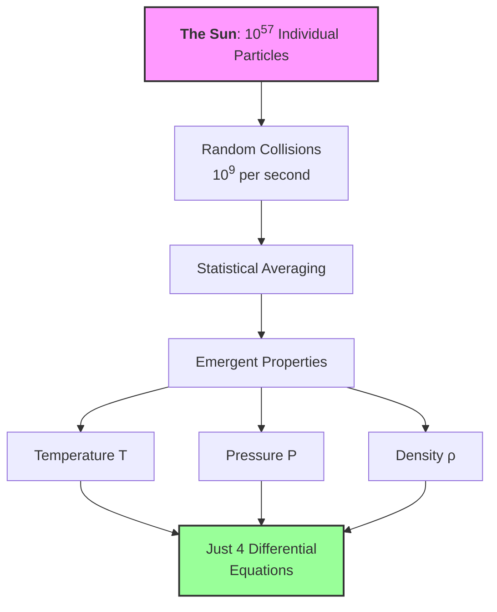

## The Big Picture: Learning Statistics Through Physics

### A Story That Changes Everything

In 1827, botanist [Robert Brown](https://www.aps.org/apsnews/2016/08/robert-brown-molecular-motion-pollen) peered through his microscope at pollen grains suspended in water. The grains danced chaotically, jittering in random directions with no apparent cause. For 80 years, this "Brownian motion" remained a mystery. Then in 1905, a patent clerk named Einstein had a profound insight: the pollen wasn't randomly moving on its own — it was being bombarded by unseen water molecules.

But here's the key: Einstein didn't try to track individual molecules (impossible!). Instead, he used statistical mechanics to predict the *collective* behavior of billions of random collisions. His predictions matched Brown's observations perfectly, finally proving atoms were real and showing that **randomness at small scales creates predictable patterns at large scales**.

This is the heart of what you're about to learn: **physics IS statistics when you zoom out far enough**. Every time you feel air pressure, measure temperature, or model a star, you're witnessing statistical mechanics in action — individual chaos creating collective order.

### Your Mission: Uncover the Statistical Truth Hidden in Physics (and AI)

You're about to discover that everything you thought you knew about physics is actually statistics in disguise:

- **Temperature?** Not a property of atoms, but a statistical parameter describing velocity distributions *(just like hyperparameters in neural networks)*
- **Pressure?** Just the average of random particle collisions *(like gradient descent averaging over mini-batches in neural networks)*
- **Stellar structure?** Four differential equations that emerge from $10^57$ particles through statistical magic *(dimensionality reduction at cosmic scale!)*
- **Stellar and Galactic dynamics?** Statistical mechanics applied to stars instead of particles *(same math as clustering algorithms!)*

But here's the kicker: **the same statistical principles that govern stars and galaxies also power machine learning and AI**. That softmax function in neural networks? It's literally the Boltzmann distribution. MCMC sampling? It's statistical mechanics. The Central Limit Theorem that makes pressure stable? It's why stoichastic gradient descent (SGD) converges.

This module teaches you statistics through physics you can visualize, preparing you for both astrophysics AND machine learning. You're not learning isolated facts — you're learning the universal language of how nature computes, whether in stellar cores or neural networks.

### Why This Matters Now More Than Ever

The boundaries between astrophysics and machine learning are dissolving. Modern astronomy runs on:

- Neural networks finding identifying hidden structure in astronomical images
- Gaussian Processes interpolating between sparse time series observations  
- MCMC exploring 20-dimensional cosmological parameter spaces
- Random forests classifying billions of galaxies

**You NEED statistical thinking to do modern astrophysics.** This module ensures you're not intimidated by either the stellar structure equations OR TensorFlow code, because you understand the statistical foundations underlying both.

## Quick Navigation Guide

### 🎯 Choose Your Learning Path

::::{grid} 1 1 3 3
:gutter: 3

:::{grid-item-card} 🏃 **Fast Track**
Essential concepts only

- [Temperature as a Parameter](01-mod1-part1-foundations.md#temperature-lie)
- [Pressure from Statistics](01-mod1-part1-foundations.md#pressure-emerges)  
- [Maximum Entropy Basics](01-mod1-part1-foundations.md#maximum-entropy)
- [Random Sampling](04-mod1-part4-sampling.md#random-sampling)
:::

:::{grid-item-card} 🚶 **Standard Path**
Full conceptual understanding

Everything in Fast Track, plus:

- [Central Limit Theorem](01-mod1-part1-foundations.md#central-limit)
- [Correlation and Independence](02-mod1-part2-statistical-tools.md#correlation)
- [Marginalization](02-mod1-part2-statistical-tools.md#marginalization)
- [Moments](03-mod1-part3-moments.md#moments)
- All "What We Just Learned" boxes
:::

:::{grid-item-card} 🧗 **Complete Path**
Deep dive with all details

Complete module including:

- All mathematical derivations
- [Ergodicity](02-mod1-part2-statistical-tools.md#ergodicity)
- [Error Propagation](02-mod1-part2-statistical-tools.md#error-propagation)
- Thought experiments
- Mathematical Deep Dives
:::
::::

### 🎯 Navigation by Project Needs

:::{admonition} Quick Jump to What You Need by Project
:class: tip, dropdown

**For Project 1 (Stellar Populations)**:

- [Temperature as Parameter](01-mod1-part1-foundations.md#temperature-lie) - Understanding distribution parameters
- [Moments](03-mod1-part3-moments.md#moments) - Population statistics  
- [Random Sampling](04-mod1-part4-sampling.md#random-sampling) - Generating stellar populations

**For Project 2 (N-body Dynamics)**:

- [Random Sampling](04-mod1-part4-sampling.md#random-sampling) - Complete initial conditions
- [Power Law Distributions](04-mod1-part4-sampling.md#power-laws) - Kroupa IMF
- [Plummer Sphere](04-mod1-part4-sampling.md#plummer-sphere) - Spatial distributions
- [Central Limit Theorem](01-mod1-part1-foundations.md#central-limit) - Why cluster properties are stable
- [Error Propagation](02-mod1-part2-statistical-tools.md#error-propagation) - Understanding numerical errors

**For Project 3 (Monte Carlo Radiative Transfer)**:

- [Maximum Entropy](01-mod1-part1-foundations.md#maximum-entropy) - Why exponentials appear in opacities
- [Marginalization](02-mod1-part2-statistical-tools.md#marginalization) - Integrating over photon angles
- [Error Propagation](02-mod1-part2-statistical-tools.md#error-propagation) - Monte Carlo convergence rates
- [Inverse Transform](04-mod1-part4-sampling.md#inverse-transform) - Sampling path lengths

**For Project 4 (MCMC)**:

- [Ergodicity](02-mod1-part2-statistical-tools.md#ergodicity) - Why MCMC works fundamentally
- [Correlation](02-mod1-part2-statistical-tools.md#correlation) - Understanding autocorrelation times
- [Central Limit Theorem](01-mod1-part1-foundations.md#central-limit) - Chain convergence diagnostics
- [Moments](03-mod1-part3-moments.md#moments) - Posterior statistics
- [Bayesian Thinking](02-mod1-part2-statistical-tools.md#bayesian-thinking) - The theoretical foundation

**For Project 5 (Gaussian Processes)**:

- [Correlation and Covariance](02-mod1-part2-statistical-tools.md#correlation) - Kernel functions are covariance
- [Maximum Entropy](01-mod1-part1-foundations.md#maximum-entropy) - GP as max entropy given covariance
- [Marginalization](02-mod1-part2-statistical-tools.md#marginalization) - Making predictions from joint distributions
- [Moments](03-mod1-part3-moments.md#moments) - Understanding GP mean and variance functions

**For Final Project (Neural Networks)**:

- [Temperature Parameter](01-part1-foundations.md#temperature-lie) - Softmax temperature
- [Maximum Entropy](01-part1-foundations.md#maximum-entropy) - Cross-entropy loss
- [Moments in ML](03-part3-moments.md#moments-ml) - Batch normalization
- [Central Limit Theorem](01-part1-foundations.md#central-limit) - Why batch training works
:::

:::{admonition} 💭 Why This Module Exists: A Personal Note from Your Instructor
:class: note, dropdown

**This module has a secret mission**: teaching you probability and statistics through physical intuition, using statistical mechanics as our vehicle.

Traditional statistics courses bombard you with abstract concepts — random variables, distributions, hypothesis tests — without ever explaining why these ideas matter or where they come from. Traditional stat mech is equally painful: memorizing partition functions without understanding what temperature actually means.

**What makes this different**: Traditional statistics courses give you formulas without meaning. Traditional physics courses give you equations without revealing their statistical nature. Here, **we flip the script** — every physics example teaches a fundamental statistical concept you'll use throughout your career. When you later take your *ASTR 630:Stellar Atmospheres and Interiors* and *ASTR 650: Galactic Structure and Evolution* courses, you'll recognize the statistical machinery underneath and understand the physics more deeply.

**The revelation students have**:

- *Wait, stellar structure is just the Central Limit Theorem in action?* **Yes!**
- *The virial theorem is just statistical averaging?* **Exactly!**

This module makes those connections explicit from the start.

**Here's what statistical mechanics actually is**: the profound realization that when you have enough of anything — atoms, stars, photons, neural network parameters — individual chaos becomes collective order. The same mathematical framework that explains why gases have pressure also explains why neural networks can learn, why MCMC converges, and why we can model stars and galaxies at all.

By the end, you'll understand not just the formulas but the deep principles: why large numbers create simplicity rather than complexity, why nature uses exponential distributions, and how random sampling becomes a computational superpower. These aren't separate topics — they're all facets of one beautiful framework that spans from quantum mechanics to machine learning.
:::

## Order from Chaos: The Statistical Foundation of Reality

Right now, the air around you contains roughly 10²⁵ molecules per cubic meter, all moving chaotically at hundreds of meters per second, colliding billions of times per second. Yet you experience perfectly steady pressure and temperature. This seeming paradox — perfect order emerging from absolute chaos — reveals the fundamental truth this module explores: **at large scales, physics IS statistics**.

To see why, consider a number that should terrify you: the Sun contains approximately $10^{57}$ particles. To grasp this magnitude, imagine counting these particles at one trillion per second. You would need $10^{27}$$ times the current age of the universe just to count them all.

Yet somehow, we model the Sun's structure with just four differential equations. *How is this possible?*

**The answer:** when you have enough of anything, individual details become irrelevant and statistical properties dominate. **Individual chaos creates collective order.** This isn't approximation — at these scales, *statistics IS reality*, more precise than any measurement could ever be.

:::{admonition} 📊 Statistical Insight: The Universal Pattern
:class: important

Throughout this module, watch for this recurring pattern:

1. **Many random components** → Statistical distributions emerge
2. **Large numbers** → Central Limit Theorem applies
3. **Constraints + maximum entropy** → Natural distributions appear
4. **Time evolution** → Ergodic behavior emerges
5. **Random sampling** → Computational solutions become possible

This pattern appears in every computational method you'll learn, from Monte Carlo simulations to neural networks to MCMC sampling.
:::

:::{admonition} 📚 Why Physics Examples for Statistics?
:class: note

We could teach variance, correlation, and sampling using coin flips and dice. But you're astrophysicists! By learning statistics through physics:

1. **You see why statistics matters** — not abstract math but how nature actually works
2. **You build correct intuition** — temperature isn't "average energy" but distribution width
3. **You prepare for advanced courses** — Stars and Galaxies courses become applications of statistics you already understand
4. **You think computationally** — sampling distributions isn't just theory but how you'll build simulations

Every subsequent physics course you take will secretly be applied statistics. I'm just making the secret visible. When you later encounter stellar structure equations or stellar and galaxy dynamics, you'll recognize them as applications of the statistical principles you're learning here.
:::

## Learning Objectives

By the end of this module, you will be able to:

- [ ] **Recognize** that macroscopic physics is fundamentally statistical in nature
- [ ] **Explain** why temperature is a statistical parameter, not a physical property
- [ ] **Derive** how pressure emerges statistically from random molecular collisions
- [ ] **Apply** the Central Limit Theorem to predict when and why Gaussian distributions appear in physical systems
- [ ] **Calculate** statistical quantities (moments, correlations, errors) and propagate uncertainties through computations
- [ ] **Implement** random sampling methods to generate realistic astrophysical distributions computationally
- [ ] **Connect** maximum entropy principles to both physical distributions and machine learning algorithms
- [ ] **Design** Monte Carlo simulations with proper error analysis and convergence understanding
- [ ] **Synthesize** statistical mechanics concepts to build complete computational models of stellar systems

## Mathematical Foundations

:::{admonition} 📖 Probability Notation: Your Foundation for Bayesian Inference
:class: important

Before we connect physics to statistics, let's establish the probability notation you'll use throughout this course and especially in **Project 4** (MCMC/Bayesian Inference).

### Basic Probability Notation

| Notation | Meaning | Example |
|----------|---------|---------|
| $P(A)$ | Probability of event A | $P(\text{heads}) = 0.5$ |
| $P(A, B)$ or $P(A \cap B)$ | Joint probability of A AND B | $P(\text{hot}, \text{dense})$ |
| $P(A \cup B)$ | Probability of A OR B | $P(\text{heads} \cup \text{tails}) = 1$ |
| $P(A\|B)$ | Conditional probability of A given B | $P(\text{fusion}\|\text{high T})$ |
| $P(\neg A)$ or $P(A^c)$ | Probability of NOT A | $P(\neg \text{heads}) = 0.5$ |

### Key Relationships

**Product Rule** (foundation of Bayesian inference):
$$P(A, B) = P(A|B) \cdot P(B) = P(B|A) \cdot P(A)$$

**Sum Rule** (marginalization):
$$P(A) = \sum_i P(A, B_i) = \sum_i P(A|B_i) \cdot P(B_i)$$

**Bayes' Theorem** (the heart of Project 4):
$$P(A|B) = \frac{P(B|A) \cdot P(A)}{P(B)}$$

Or in parameter inference notation:
$$P(\theta|\text{data}) = \frac{P(\text{data}|\theta) \cdot P(\theta)}{P(\text{data})}$$
$$\text{posterior} = \frac{\text{likelihood} \times \text{prior}}{\text{evidence}}$$

### Statistical Mechanics Connection

In this module, we use probability to describe particle distributions:

| Physics | Probability Notation | Meaning |
|---------|---------------------|---------|
| $f(v)$ | $P(v)$ or $p(v)$ | Probability density for velocity |
| $\langle A \rangle$ | $E[A]$ or $\mathbb{E}[A]$ | Expectation value/ensemble average |
| $\int f(v) dv = 1$ | $\int P(v) dv = 1$ | Normalization |
| Partition function $Z$ | $P(\text{total}) = 1$ | Normalization constant |

**Why This Matters**: Every physics concept in this module is *secretly* probability theory. When we say "temperature characterizes the velocity distribution," we mean temperature is a parameter of $P(v)$. When we compute pressure as an ensemble average, we're calculating $E[\text{momentum transfer}]$. Statistical mechanics IS applied probability theory.
:::

:::{admonition} 📖 Statistical Vocabulary: Your Physics-to-Statistics Rosetta Stone
:class: important

Before diving in, let's establish the connection between physics language and statistical language. This module teaches statistical concepts through physics, so understanding these parallels is crucial.

| Physics Term | Statistical Equivalent | What It Means | First Appears |
|-------------|------------------------|---------------|---------------|
| **Temperature** $(T)$ | Distribution parameter | Controls the width/spread of velocity distribution | [Part 1, Section 1.1](01-mod1-part1-foundations.md#temperature-lie) |
| **Pressure** $(P)$ | Ensemble average of momentum transfer | Mean value over all possible microstates | [Part 1, Section 1.2](01-mod1-part1-foundations.md#pressure-emerges) |
| **Thermal equilibrium** | Stationary distribution | Distribution that doesn't change with time | [Part 2, Section 2.3](02-mod1-part2-statistical-tools.md#ergodicity) |
| **Partition function** $(Z)$ | Normalization constant | Ensures probabilities sum to 1 | [Part 1, Section 1.4](01-mod1-part1-foundations.md#maximum-entropy) |
| **Ensemble** | Sample space | Set of all possible microscopic states | [Part 1, Section 1.2](01-mod1-part1-foundations.md#pressure-emerges) |
| **Correlation** | Statistical dependence | How variables relate to each other | [Part 2, Section 2.1](02-mod1-part2-statistical-tools.md#correlation) |
| **Ergodicity** | Time average = ensemble average | Long-time behavior equals average over all states | [Part 2, Section 2.3](02-mod1-part2-statistical-tools.md#ergodicity) |

**Key insight**: Every physics concept teaches a fundamental statistical principle. When we say "temperature doesn't exist for one particle," we're really saying "you can't characterize a distribution with a single sample."
:::

## Module Contents

### [Part 1: The Foundation - Statistical Mechanics from First Principles](01-mod1-part1-foundations.md)

- Temperature is a Lie (For Single Particles)
- Pressure Emerges from Chaos
- The Central Limit Theorem: Why Everything is Gaussian
- The Maximum Entropy Principle

### [Part 2: Statistical Tools and Concepts](02-mod1-part2-statistical-tools.md)

- Correlation and Independence
- Marginalization: The Art of Ignoring
- Ergodicity: When Time Equals Ensemble
- The Law of Large Numbers
- Error Propagation
- Variance and Standard Deviation
- Bayesian Thinking: Learning from Data

### [Part 3: Moments - The Statistical Bridge to Physics](03-mod1-part3-moments.md)

- What Are Moments?
- Why Moments Matter Statistically
- Example: Moments of Maxwell-Boltzmann
- Moments in Machine Learning

### [Part 4: Random Sampling - From Theory to Computation](04-mod1-part4-sampling.md)

- Why Random Sampling Matters
- The CDF and Inverse Transform Method
- Power Law Distributions
- Rejection Sampling
- Spatial Distributions: The Plummer Sphere

### [Part 5: Module Summary and Synthesis](05-mod1-part5-synthesis.md)

- Key Takeaways
- Quick Reference Tables
- Glossary

---

## Navigation

[→ Part 1: Foundations](01-mod1-part1-foundations.md)