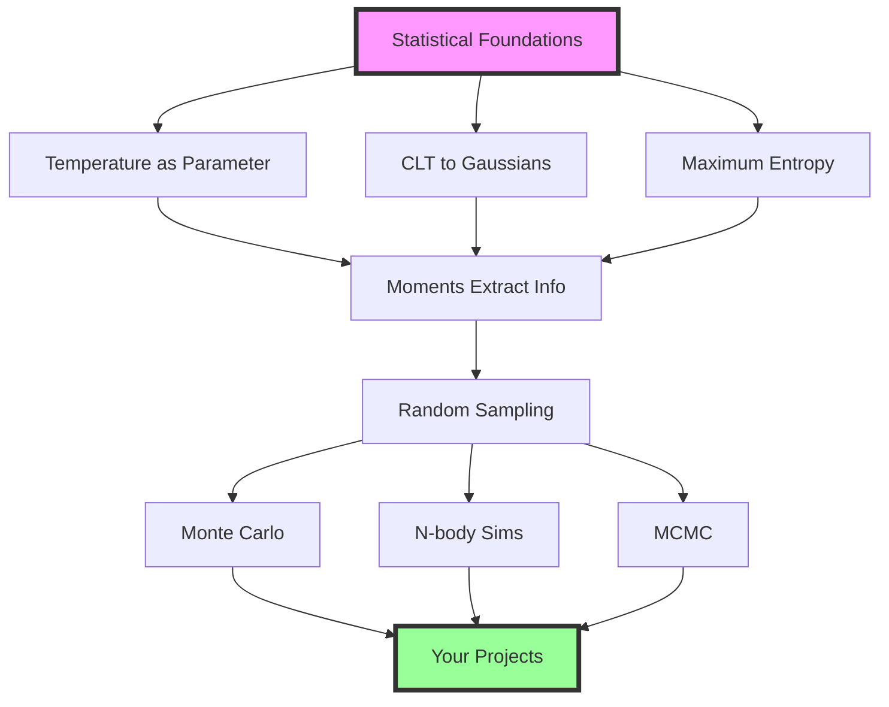

## Navigation

[← Part 4: Random Sampling](04-part4-sampling.md) | [Module 1: Statistical Foundations Home](00-part0-overview.md) | [Module 2: From Particles to Stars](../02-particles-to-stars/)

%[Progressive Problems →](06-progressive-problems.md)

---

## Module Summary: Your Statistical Toolkit

This module has given you a complete statistical foundation built on physical intuition:

**Part 1** revealed the deep principles:

- Macroscopic properties emerge from **distributions**, not individuals
- **Central Limit Theorem** creates predictability
- **Maximum entropy** gives least-biased distributions
- **Ergodicity** connects time and ensemble averages

**Part 2** showed how moments extract information:

- Few numbers characterize entire distributions!
- Temperature IS **variance**, pressure IS **second moment**
- Same tools work in physics and ML, which will see later in the course.

**Part 3** made it computational:

- Transform uniform random to any distribution
- Sample realistic astrophysical populations
- Bridge theory to simulation

These aren't separate topics – they're one framework that spans from statistical mechanics to machine learning. Master these concepts once, apply them everywhere.

## Key Takeaways

✅ **Temperature is a distribution parameter**, not a particle property  
✅ **CLT makes large-scale behavior predictable** despite microscopic chaos  
✅ **Maximum entropy gives natural distributions** from constraints  
✅ **Correlation matters** – independence is powerful but rare  
✅ **Ergodicity enables MCMC** and molecular dynamics  
✅ **Moments compress distributions** to essential information  
✅ **Random sampling bridges** theory to computation  
✅ **Error propagation** follows simple rules with profound consequences  
✅ **The same framework** works from atoms to galaxies to neural networks

## Looking Forward

With these foundations, you're ready for:

- **Module 2**: How moments of Boltzmann give stellar structure.
- **Module 3**: Stars as particles in star cluster dynamics.  
- **Project 2**: N-body simulations with realistic initial conditions.
- **Projects 3-5**: Monte Carlo, MCMC, and Gaussian Processes.

The journey from "temperature doesn't exist for one particle" to "I can simulate a star cluster" demonstrates the power of statistical thinking. You now have the tools to understand not just how to compute, but why these methods work.

**Remember:** Whether you're modeling stellar interiors, training neural networks, or exploring parameter spaces, you're applying the *same* statistical principles. The universe, it turns out, is remarkably consistent in its use of statistics at every scale.

---

## Quick Reference Tables

### Probability Notation for MCMC/Bayesian Inference

| Notation | Name | Example in Astrophysics |
|----------|------|-------------------------|
| $P(\theta\|\mathcal{D})$ | Posterior | Stellar parameters given spectra |
| $P(\mathcal{D}\|\theta)$ | Likelihood | Probability of observing data given model |
| $P(\theta)$ | Prior | Initial belief about parameters |
| $P(\mathcal{D})$ | Evidence | Normalization constant |
| $P(A,B)$ | Joint probability | $P(T, \rho)$ for stellar interior |
| $P(A\|B)$ | Conditional | $P(\text{fusion}\|T > 10^7 K)$ |
| $\int P(A,B) dB$ | Marginalization | Integrate out nuisance parameters |

### Key Statistical-Physical Connections

| Statistical Concept | Physical Manifestation | Mathematical Form |
|--------------------|------------------------|-------------------|
| Distribution parameter | Temperature | $T$ in $\exp(-E/k_B T)$ |
| Expectation value | Ensemble average | $\langle A \rangle = \int A f dv$ |
| Variance | Kinetic energy/pressure | $\sigma_v^2 = k_B T/m$ |
| Maximum entropy | Thermal equilibrium | Maxwell-Boltzmann |
| Ergodicity | Virial equilibrium | Time avg = ensemble avg |
| Central Limit Theorem | Gaussian velocities | Many interactions → normal |
| Marginalization | Reduced dimensions | 3D → 1D velocity distribution |

### Temperature Misconceptions vs Reality

| Common Belief | Reality |
|--------------|---------|
| "Temperature = average kinetic energy" | Temperature is distribution parameter; KE follows from this |
| "Hot particles move fast" | Hot *ensemble* has broad velocity distribution |
| "One particle can be hot" | One particle has KE, not temperature |
| "$T = 0$ means no motion" | $T = 0$ means zero width distribution (quantum limits apply) |
| "Temperature is energy" | Temperature is intensive; energy is extensive |

---

## Glossary

**Boltzmann constant ($k_B$)**: Fundamental constant relating temperature to energy. $k_B = 1.38 \times 10^{-16}$ erg/K in CGS units. Appears in all statistical distributions.

**Central Limit Theorem (CLT)**: Mathematical theorem stating that sums of many independent random variables converge to a Gaussian distribution, regardless of the original distribution shape.

**Covariance**: Measure of how two variables change together. $\text{Cov}(X,Y) = E[(X-\mu_X)(Y-\mu_Y)]$. Zero for independent variables.

**Cumulative Distribution Function (CDF)**: $F(x) = P(X \leq x)$. Maps any distribution to [0,1]. Essential for inverse transform sampling.

**Ensemble**: Complete set of all possible microstates of a system. In statistical mechanics, macroscopic properties are ensemble averages.

**Ensemble average**: Average over all possible microstates, weighted by their probabilities. Denoted $\langle A \rangle$ or $E[A]$.

**Equipartition theorem**: Each quadratic degree of freedom contributes $\frac{1}{2}k_B T$ to the average energy in thermal equilibrium.

**Ergodicity**: Property where time averages equal ensemble averages. Essential for MCMC and molecular dynamics simulations.

**Expectation value**: Average value of a quantity over a probability distribution. $E[X] = \int x p(x) dx$.

**Extensive property**: Scales with system size (mass, energy, volume). Doubles when you double the system.

**Intensive property**: Independent of system size (temperature, pressure, density). Same value for any sample size.

**Inverse transform sampling**: Method to generate random samples by inverting the CDF. $x = F^{-1}(u)$ where $u \sim U(0,1)$.

**Kroupa IMF**: Initial Mass Function describing stellar mass distribution. Broken power law with three segments.

**Lagrange multiplier**: Mathematical tool for constrained optimization. Temperature emerges as the Lagrange multiplier for energy constraint in maximum entropy.

**Law of Large Numbers**: As $N \to \infty$, sample averages converge to true expectation values. Fluctuations scale as $1/\sqrt{N}$.

**Marginalization**: Integrating out unwanted variables from joint distribution. $P(x) = \int P(x,y) dy$.

**Maximum entropy principle**: Choose the probability distribution with maximum entropy (least bias) consistent with known constraints.

**Maxwell-Boltzmann distribution**: Velocity distribution for particles in thermal equilibrium. $f(v) \propto \exp(-mv^2/2k_B T)$.

**Moment**: Expected value of powers of a random variable. $n$-th moment: $M_n = E[X^n]$.

**Monte Carlo method**: Computational technique using random sampling to solve problems. Named after Monaco casino.

**Parameter**: Variable characterizing an entire distribution (e.g., mean $\mu$, variance $\sigma^2$, temperature $T$).

**Partition function**: Normalization constant ensuring probabilities sum to 1. $Z = \sum_i e^{-E_i/k_B T}$.

**Plummer sphere**: Density profile for star clusters. $\rho(r) \propto (1 + r^2/a^2)^{-5/2}$.

**Probability density function (PDF)**: Function giving probability per unit interval. Must integrate to 1.

**Rejection sampling**: Method to sample from arbitrary distributions by accepting/rejecting uniform samples.

**Standard deviation ($\sigma$)**: Square root of variance. Measures spread of distribution.

**Statistical mechanics**: Framework connecting microscopic particle behavior to macroscopic observables through statistics.

**Temperature**: Parameter characterizing width of velocity distribution. NOT a property of individual particles.

**Variance**: Second central moment. $\text{Var}(X) = E[(X-\mu)^2] = \sigma^2$. Measures distribution spread.

**Velocity dispersion**: RMS spread of velocities in stellar systems. Analogous to temperature in gases but without thermalization.

---

*You now have the statistical foundations for computational astrophysics. Ready for Module 2? Let's see how these same statistical principles explain stellar structure – not as new physics, but as beautiful applications of the statistics you just learned!*

---

## Navigation
[← Part 4: Random Sampling](04-part4-sampling.md) | [Module 1: Statistical Foundations Home](00-part0-overview.md) | [Module 2: From Particles to Stars](../02-particles-to-stars/)

%| [Progressive Problems →](06-progressive-problems.md)
