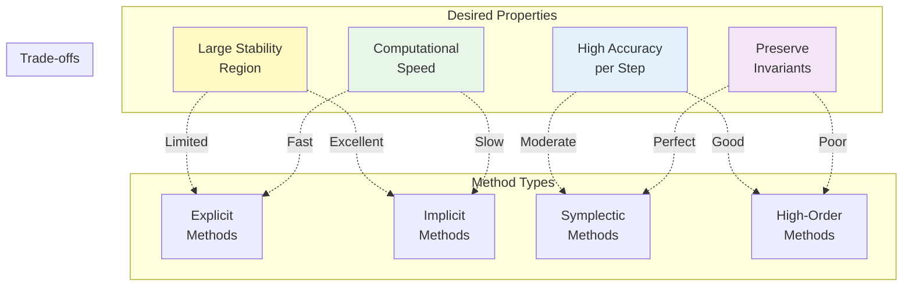

# SUBMODULE 3: ODE METHODS & CONSERVATION
*"Making Time Flow While Preserving the Universe"*

## Learning Outcomes

By the end of this submodule, you will be able to:

- [ ] **Explain** why Euler's method fails catastrophically for long-term orbital dynamics
- [ ] **Derive** the complete family of Runge-Kutta methods from Taylor series expansions
- [ ] **Prove** why symplectic integrators conserve phase space volume and bounded energy
- [ ] **Analyze** stability regions to predict when numerical methods explode
- [ ] **Implement** Euler, RK2, RK4, and Leapfrog integrators from first principles
- [ ] **Choose** appropriate integrators based on problem timescales and conservation requirements
- [ ] **Transform** sequential loop-based code to vectorized array operations
- [ ] **Diagnose** numerical instabilities before they destroy simulations
- [ ] **Design** integration schemes that preserve physical invariants

---

## Introduction: The Universe in Motion

Static problems reveal where physics balances - equilibrium points, integrated quantities, steady states. But the universe evolves. Stars form and die, planets orbit and migrate, galaxies collide and merge. To model reality, we must make time flow numerically while preserving the fundamental laws of physics.

**The central challenge of dynamics:** Converting continuous differential equations into discrete time steps without destroying conservation laws.

:::{margin}
**Ordinary Differential Equation (ODE)**: An equation relating a function to its derivatives with respect to a single variable (usually time).
:::

Consider Newton's second law, the **ODE** that governs all classical dynamics:

$$\frac{d^2\vec{r}}{dt^2} = \frac{\vec{F}}{m}$$

Analytically, we'd integrate twice to find position from force. Numerically, we must approximate these integrals with finite sums. But here's the profound challenge: naive approaches accumulate errors that grow without bound, eventually destroying the physics we're trying to simulate.

**Why ODE integration is foundational to astrophysics:**

- **Orbital mechanics**: Every spacecraft trajectory, planetary orbit, and stellar binary evolves through time
- **Stellar evolution**: Nuclear burning rates, convective energy transport, and pulsation modes all couple through differential equations
- **Galaxy dynamics**: Billions of stars moving under mutual gravitation for billions of years
- **Cosmological structure**: Dark matter halos growing through gravitational instability over cosmic time
- **Gravitational waves**: Binary black hole inspirals requiring million-orbit phase accuracy for detection

**The computational paradox that defines this submodule:**

More accurate methods (smaller errors per step) don't necessarily give better long-term results. A fourth-order Runge-Kutta method might place a planet more accurately after one orbit, but a second-order symplectic method keeps it stable for a billion years. The highest-order method can destroy your physics faster than the simplest method. Understanding this paradox - that geometric structure preservation trumps local accuracy - is crucial for reliable astrophysical simulations.

**What makes astrophysical ODEs uniquely challenging:**

:::{margin}
**Hamiltonian system**: A dynamical system governed by Hamilton's equations, naturally conserving energy and phase space volume.
:::

1. **Extreme timescale separation**: Binary pulsars complete orbits in hours while galaxies evolve over gigayears - a factor of 10¹⁴ difference
2. **Conservation requirements**: Energy and angular momentum must be preserved to better than one part in 10¹⁵ over cosmic time
3. **Hamiltonian structure**: Most astrophysical systems are **Hamiltonian**, possessing special geometric properties we must preserve
4. **High dimensionality**: An N-body system has 6N coupled ODEs - a small globular cluster has millions of dimensions
5. **Sensitivity to initial conditions**: Chaotic dynamics means tiny errors exponentially amplify

:::{admonition} Course Philosophy Reminder
:class: important
We build every algorithm from scratch. You'll understand WHY Euler fails, HOW Runge-Kutta achieves high order, WHEN to use symplectic methods, and WHERE instabilities lurk. No magic - just physics and mathematics working together.
:::

This submodule reveals why "better" isn't always better, why preserving geometry matters more than minimizing error, and how to choose methods that keep your universe stable.

---

## Bridge from Submodule 2: From Static to Dynamic

In Submodule 2, you mastered finding roots and computing integrals - static problems with fixed solutions. Now we make these problems time-dependent, and everything becomes more complex.

Consider a projectile's trajectory. In Submodule 2, you could:
- Find maximum height by solving for the root of $dy/dt = 0$
- Compute total distance traveled using $\int_0^T v(t) dt$

But how does the projectile actually GET to maximum height? How does position evolve moment by moment from the velocity? This requires solving the ODE:

$$\frac{d^2y}{dt^2} = -g$$

The connection is profound and often underappreciated: every ODE method is fundamentally performing numerical integration (quadrature) at each timestep:

$$x(t + h) = x(t) + \int_t^{t+h} v(\tau) d\tau$$

The methods differ in how they approximate this integral:
- **Euler's method**: Rectangle rule (evaluate derivative at left endpoint only)
- **Midpoint method**: Midpoint rule (evaluate derivative at center of interval)
- **RK4**: Simpson's rule (weighted average of multiple derivative evaluations)

But there's a critical difference from the static quadrature of Submodule 2: the integrand itself depends on the solution we're trying to find! The velocity $v(\tau)$ depends on position $x(\tau)$, which is what we're computing. This coupling between the unknown function and its derivative creates entirely new challenges:

- **Error accumulation**: Unlike static integration where error is fixed, ODE errors compound exponentially
- **Instabilities**: Small perturbations can grow without bound, destroying the solution
- **Conservation violation**: Energy that should be constant can drift to infinity
- **Phase errors**: Even tiny timing errors accumulate - after a million orbits, Earth might be on the wrong side of the Sun

The error analysis framework from Submodule 1 (balancing truncation vs round-off error) and the quadrature methods from Submodule 2 become the foundation for understanding ODE integration. But we need entirely new concepts: stability regions in the complex plane, symplecticity and phase space geometry, and the profound difference between local and global error behavior.

---

## Part 1: The Fundamental Challenge - Discretizing Time

### From Continuous to Discrete

The fundamental ODE initial value problem asks us to find a function $x(t)$ given its rate of change:

$$\frac{dx}{dt} = f(x, t), \quad x(t_0) = x_0$$

This has the formal integral solution:

$$x(t) = x_0 + \int_{t_0}^t f(x(s), s) ds$$

:::{margin}
**Initial Value Problem (IVP)**: Finding a function given its derivative and starting value - the fundamental problem of dynamics.
:::

But this **Initial Value Problem** contains a circular dependency that makes it unsolvable analytically in most cases: to find $x(t)$, we need to integrate $f(x(s), s)$, but $f$ depends on the unknown solution $x(s)$ itself! We can't evaluate the integrand without knowing the answer.

Numerical methods break this circular dependency by making assumptions about how $f$ behaves over small time intervals:

1. **Constant derivative assumption** (Euler): Assume $f$ stays constant over $[t_n, t_{n+1}]$
2. **Linear variation assumption** (Trapezoidal): Assume $f$ varies linearly between endpoints
3. **Polynomial approximation** (Runge-Kutta): Assume $f$ follows a polynomial of degree $p$

Each assumption leads to a different family of methods with different error behaviors, stability properties, and conservation characteristics.

### The Dimensional Analysis of Timesteps

Before diving into specific methods, let's understand what constrains our choice of timestep $h$ from pure dimensional analysis. This provides crucial physical intuition.

For any oscillatory system with characteristic frequency $\omega$:
```
Nyquist requirement: h < π/ω (must sample twice per oscillation)
Accuracy requirement: h < 0.1 × 2π/ω (need ~60 points per period)
Typical choice: h ~ 0.01 × 2π/ω (600 points per period)
```

For exponentially decaying systems with decay rate $\lambda$:
```
Capture decay: h < 1/λ (see the decay happening)
Resolve decay: h < 0.1/λ (accurately track the decay)
Typical choice: h ~ 0.01/λ (100 points per e-folding)
```

For gravitational N-body systems, multiple timescales compete:
```
Orbital period: T_orb = 2π√(a³/GM)
Close encounter: T_coll = R/(v_rel)
Shortest scale: T_min = min(all pairwise encounter times)
Required timestep: h < 0.01 × T_min

Example - Earth-Sun system:
Period: T = 365.25 days = 3.156 × 10⁷ seconds
Typical timestep: h ~ 1 day = 8.64 × 10⁴ seconds (T/365)
High accuracy: h ~ 0.1 day = 8.64 × 10³ seconds (T/3650)
Machine precision limit: h ~ 10⁻⁸ seconds (numerical breakdown)
```

### Visual Intuition: The Geometric View

The fundamental difference between continuous reality and discrete computation:

```
True solution (smooth curve):     Numerical approximation (staircase):
                                  
      ╱╲                                ___
     ╱  ╲                              |   |___
    ╱    ╲                             |       |___
   ╱      ╲                            |           |___
  ╱        ╲                           |               |___
 ╱          ╲                          |                   |
╱            ╲                         |___________________|

Infinite information               Finite samples
Smooth derivatives                 Discrete jumps
Exact conservation                 Approximate invariants
```

Each numerical method creates a different staircase pattern. The art lies in choosing the pattern that best preserves the physics we care about.

---

## Part 2: The Failure of Naive Integration - Euler's Method

### Mathematical Formulation

:::{margin}
**Euler's method**: The simplest ODE integration scheme, using a constant derivative over each timestep.
:::

**Euler's method** is the most straightforward discretization possible. Given the ODE $\frac{dx}{dt} = f(x,t)$, we approximate:

$$x_{n+1} = x_n + h f(x_n, t_n)$$

where:
- $x_n$ = numerical solution at time $t_n$
- $h$ = timestep (assumed constant)
- $f(x_n, t_n)$ = derivative evaluated at current point
- $x_{n+1}$ = numerical solution at time $t_{n+1} = t_n + h$

This assumes the derivative $f$ remains constant over the entire interval $[t_n, t_{n+1}]$ - essentially extending the tangent line at $t_n$ forward by distance $h$.

### Taylor Series Analysis of Error

To understand Euler's error precisely, we need the Taylor series. The true solution at $t_{n+1}$ is:

$$x(t_n + h) = x(t_n) + h x'(t_n) + \frac{h^2}{2}x''(t_n) + \frac{h^3}{6}x'''(t_n) + O(h^4)$$

Since $x'(t_n) = f(x(t_n), t_n)$ by definition of our ODE, and assuming $x_n = x(t_n)$ (no previous error), Euler's method gives:

$$x_{n+1} = x_n + h f(x_n, t_n)$$

:::{margin}
**Local truncation error**: Error introduced in a single step, assuming perfect starting values.
:::

The **local truncation error** - the error in one step - is:

$$\tau_n = x(t_{n+1}) - x_{n+1} = \frac{h^2}{2}x''(t_n) + \frac{h^3}{6}x'''(t_n) + O(h^4)$$

The leading error term is $O(h^2)$, making Euler locally second-order accurate.

:::{margin}
**Global error**: Total accumulated error over the entire integration interval.
:::

But errors accumulate! Over $N = T/h$ steps to reach final time $T$, the **global error** becomes:

$$E_{global} = \sum_{i=0}^{N-1} \tau_i \approx N \cdot \frac{h^2}{2}x''(\xi) = \frac{T}{h} \cdot \frac{h^2}{2}x''(\xi) = \frac{Th}{2}x''(\xi) = O(h)$$

Euler is globally first-order - halving the timestep only halves the total error. To get one more digit of accuracy requires 10× more computation!

### The Energy Drift Catastrophe

Let's see Euler fail catastrophically on the harmonic oscillator, the simplest nontrivial ODE:

$$\ddot{x} = -\omega^2 x$$

Converting to first-order system:
$$\frac{d}{dt}\begin{pmatrix} x \\ v \end{pmatrix} = \begin{pmatrix} v \\ -\omega^2 x \end{pmatrix}$$

The true solution has constant energy $E = \frac{1}{2}(v^2 + \omega^2 x^2)$.

```
PSEUDOCODE: Euler Energy Analysis
FUNCTION euler_harmonic(x0, v0, omega, h, n_steps):
    x = x0  # initial position
    v = v0  # initial velocity
    E0 = 0.5 * (v0^2 + omega^2 * x0^2)  # initial energy
    energies = [E0]
    
    FOR i = 1 TO n_steps:
        # Euler updates
        a = -omega^2 * x  # acceleration from Hooke's law
        x_new = x + h * v  # update position
        v_new = v + h * a  # update velocity
        
        # Energy should be constant, but...
        E = 0.5 * (v_new^2 + omega^2 * x_new^2)
        energies.append(E)
        
        x = x_new
        v = v_new
    
    # Energy error grows linearly!
    error_rate = (energies[-1] - E0) / (n_steps * h)
    PRINT "Energy drift rate:", error_rate
    
    RETURN energies
```

The shocking result: energy grows approximately linearly with time! After 1000 orbital periods, energy has typically increased by 10%. After a million periods, the "orbit" has spiraled out to infinity.

### Why Euler Fails: The Geometric View

To understand the fundamental flaw, we must think geometrically. In phase space (position-velocity space), the harmonic oscillator traces a circle. Energy is the "radius" of this circle.

```
Phase space view of Euler's failure:

True solution:              Euler's approximation:
     v                           v
     ↑                           ↑
   ╱───╲                       ╱───╲
  │     │                     ╱     ╲
  │  ●  │  →                 ╱   ●   ╲  
  │     │                   ╱         ╲
   ╲───╱                    ╲─────────╱
     → x                         → x
     
Closed orbit               Outward spiral
(Energy = const)           (Energy grows ~linearly)
Area preserved             Area increases each step
```

Each Euler step moves along the tangent to the circle, placing the new point slightly outside. The phase space area increases, violating Liouville's theorem that phase space volume must be preserved in Hamiltonian systems.

### The Failure Is Fundamental

This isn't a bug we can fix with smaller timesteps. Even with $h = 10^{-10}$, Euler will eventually spiral out - it just takes longer. The method has a fundamental structural flaw: it doesn't respect the geometric properties of the differential equation.

:::{admonition} Check Your Understanding
:class: question
1. Why does Euler's method have O(h²) local but O(h) global error?
2. If we used Euler backwards in time, would orbits spiral in or out?
3. For a circular orbit, by what factor does the radius grow per orbit?
4. Could we fix Euler by using variable timesteps in different regions?
:::

---

## Part 3: Building Better Methods - The Runge-Kutta Family

### The Key Insight: Sample Multiple Points

Euler's fatal flaw is assuming the derivative stays constant over the entire timestep. Real functions curve. What if we sample the derivative at multiple points and combine them intelligently?

This is the genius of Runge-Kutta methods: they evaluate the derivative at carefully chosen intermediate points, then combine these samples with specific weights to achieve higher-order accuracy.

### RK2 - The Midpoint Method

#### Geometric Intuition

Instead of blindly following the tangent from the starting point, we:
1. Take a half-step using the initial derivative
2. Evaluate the derivative at this midpoint
3. Use this midpoint derivative for the full step

```
Euler vs RK2 Midpoint comparison:

Euler (1st order):            RK2 Midpoint (2nd order):
                              
Start ──────────→ End         Start - - - → Mid
     use initial                      ↓
     derivative only                evaluate
                                   derivative
                                      ↓
                              Start ═════════⇒ End
                                   use midpoint
                                   derivative
```

#### Complete Mathematical Formulation

:::{margin}
**Predictor-corrector method**: A two-stage process where an initial estimate (predictor) is refined using better information (corrector).
:::

The RK2 midpoint method is a **predictor-corrector method**. Given the ODE $\frac{dx}{dt} = f(x,t)$:

**Stage 1 - Predictor (estimate midpoint):**
$$k_1 = f(x_n, t_n)$$
$$x_{mid} = x_n + \frac{h}{2}k_1$$
$$t_{mid} = t_n + \frac{h}{2}$$

**Stage 2 - Corrector (use midpoint derivative):**
$$k_2 = f(x_{mid}, t_{mid})$$
$$x_{n+1} = x_n + h k_2$$

Combined into one expression:
$$x_{n+1} = x_n + h f\left(x_n + \frac{h}{2}f(x_n, t_n), t_n + \frac{h}{2}\right)$$

#### Error Analysis via Taylor Series

To find the order of accuracy, we expand everything in Taylor series. The midpoint derivative is:

$$f(x_{mid}, t_{mid}) = f\left(x_n + \frac{h}{2}f, t_n + \frac{h}{2}\right)$$

Using multivariate Taylor expansion:
$$f(x_{mid}, t_{mid}) = f + \frac{h}{2}\frac{\partial f}{\partial t} + \frac{h}{2}f\frac{\partial f}{\partial x} + O(h^2)$$

where all derivatives are evaluated at $(x_n, t_n)$.

The RK2 update becomes:
$$x_{n+1} = x_n + h\left[f + \frac{h}{2}\left(\frac{\partial f}{\partial t} + f\frac{\partial f}{\partial x}\right)\right] + O(h^3)$$

Compare with the true solution's Taylor series:
$$x(t_{n+1}) = x_n + hf + \frac{h^2}{2}\frac{df}{dt} + O(h^3)$$

By the chain rule:
$$\frac{df}{dt} = \frac{\partial f}{\partial t} + \frac{\partial f}{\partial x}\frac{dx}{dt} = \frac{\partial f}{\partial t} + f\frac{\partial f}{\partial x}$$

The expressions match through $O(h^2)$! Therefore:
- Local truncation error: $O(h^3)$
- Global error: $O(h^2)$

RK2 is second-order accurate - halving the timestep reduces error by a factor of 4.

### RK4 - The Classical Workhorse

#### The Four-Sample Strategy

:::{margin}
**Runge-Kutta 4 (RK4)**: The most popular ODE method, achieving 4th-order accuracy with 4 function evaluations.
:::

**RK4** is the crown jewel of explicit methods. It samples the derivative at four carefully chosen points:

```
RK4 Sampling Strategy:

     t_n                    t_n+h/2                    t_n+h
      ●───────────────────────●───────────────────────●
      ↓                       ↓                       ↓
    k₁ (start)          k₂,k₃ (midpoint)          k₄ (end)
                          (two different
                           estimates)
                          
Weights: 1/6              2/6 + 2/6                  1/6
         ───────────────────────────────────────────────
         Total: (k₁ + 2k₂ + 2k₃ + k₄)/6
         
These are Simpson's rule weights!
```

#### Complete Mathematical Formulation

Given the ODE $\frac{dx}{dt} = f(x,t)$, RK4 computes four derivative estimates:

**Stage 1 - Initial derivative:**
$$k_1 = f(x_n, t_n)$$

**Stage 2 - First midpoint estimate:**
$$k_2 = f(x_n + \frac{h}{2}k_1, t_n + \frac{h}{2})$$

**Stage 3 - Second midpoint estimate (using k₂):**
$$k_3 = f(x_n + \frac{h}{2}k_2, t_n + \frac{h}{2})$$

**Stage 4 - Endpoint estimate (using k₃):**
$$k_4 = f(x_n + hk_3, t_n + h)$$

**Final update (weighted average):**
$$x_{n+1} = x_n + \frac{h}{6}(k_1 + 2k_2 + 2k_3 + k_4)$$

The weights $\frac{1}{6}, \frac{2}{6}, \frac{2}{6}, \frac{1}{6}$ are precisely Simpson's rule weights! This is not coincidence - RK4 is essentially applying Simpson's quadrature to the integral:

$$x_{n+1} = x_n + \int_{t_n}^{t_{n+1}} f(x(t), t) dt$$

```
PSEUDOCODE: RK4 Step
FUNCTION rk4_step(x, t, h, f):
    # Stage 1: Sample at start
    k1 = f(x, t)
    
    # Stage 2: Sample at first midpoint estimate
    x_temp = x + (h/2) * k1
    t_temp = t + h/2
    k2 = f(x_temp, t_temp)
    
    # Stage 3: Sample at second midpoint estimate  
    x_temp = x + (h/2) * k2
    t_temp = t + h/2  # same time as k2
    k3 = f(x_temp, t_temp)
    
    # Stage 4: Sample at endpoint estimate
    x_temp = x + h * k3
    t_temp = t + h
    k4 = f(x_temp, t_temp)
    
    # Weighted average using Simpson's rule weights
    x_new = x + (h/6) * (k1 + 2*k2 + 2*k3 + k4)
    
    RETURN x_new
```

#### Error Analysis

Through lengthy Taylor series expansion (matching coefficients of $h$, $h^2$, $h^3$, and $h^4$), one can show:

- Local truncation error: $\tau = O(h^5)$
- Global error: $E = O(h^4)$

This means halving the timestep reduces error by a factor of $2^4 = 16$. For smooth problems, RK4 provides exceptional accuracy per function evaluation.

### Butcher Tableaux - The Systematic View

:::{margin}
**Butcher tableau**: A compact notation for representing Runge-Kutta methods, showing the coefficients for stage values and weights.
:::

Any Runge-Kutta method can be elegantly represented by a **Butcher tableau**:

```
General form:
c₁ | a₁₁  a₁₂  ...  a₁ₛ
c₂ | a₂₁  a₂₂  ...  a₂ₛ
⋮  | ⋮    ⋮    ⋱    ⋮
cₛ | aₛ₁  aₛ₂  ...  aₛₛ
───┼────────────────────
   | b₁   b₂   ...  bₛ

where:
- s = number of stages
- c = time coefficients (when to sample)
- A = weights for computing stages
- b = weights for final combination
```

For RK4:
```
0   |
1/2 | 1/2
1/2 | 0   1/2
1   | 0   0   1
────┼───────────────
    | 1/6 1/3 1/3 1/6
```

This compact notation completely specifies the algorithm.

### Adaptive Timestep Control

Real problems have varying timescales - close encounters need tiny steps, smooth cruising allows large steps. Adaptive methods adjust $h$ dynamically.

:::{warning}
Adaptive timesteps can destroy conservation properties of symplectic integrators! For long-term Hamiltonian systems, use fixed timesteps with symplectic methods.
:::

The key idea: compute two estimates of different order and use their difference to estimate error:

```
PSEUDOCODE: Adaptive RK45 (Dormand-Prince)
FUNCTION adaptive_rk45(x, t, h, f, tolerance):
    # Compute two estimates using same function evaluations
    # RK4 uses first 4 stages, RK5 uses all 6 stages
    k1 = f(x, t)
    k2 = f(x + h*a21*k1, t + c2*h)
    k3 = f(x + h*(a31*k1 + a32*k2), t + c3*h)
    # ... (more stages)
    
    x_4th = x + h*(b41*k1 + b42*k2 + ... )  # 4th order estimate
    x_5th = x + h*(b51*k1 + b52*k2 + ... )  # 5th order estimate
    
    # Error estimate
    error = norm(x_5th - x_4th)
    
    # Optimal timestep from error scaling
    IF error < machine_epsilon:
        h_new = h  # Don't grow indefinitely
    ELSE:
        safety = 0.9  # Safety factor
        h_opt = h * safety * (tolerance/error)^(1/5)
        h_new = max(0.1*h, min(10*h, h_opt))  # Limit rate of change
    
    IF error < tolerance:
        ACCEPT step with x_5th (higher order)
        h = h_new
        RETURN x_5th, h
    ELSE:
        REJECT step
        h = h_new
        RETRY with smaller h
```

:::{admonition} Check Your Understanding
:class: question
1. Why does RK2 sample at the midpoint rather than the endpoint?
2. What's the deep connection between RK4 weights and Simpson's rule?
3. If RK4 has O(h⁴) error, why not use RK10 for O(h¹⁰) accuracy?
4. When would adaptive timesteps be essential vs harmful?
:::

---

## Part 4: The Conservation Crisis - Why Higher Order Isn't Always Better

### A Shocking Discovery

Let's test our methods on the simplest possible orbit - a circle. The ODE system is:

$$\begin{cases}
\dot{x} = -y \\
\dot{y} = x
\end{cases}$$

This represents uniform circular motion with unit angular frequency. The exact solution starting from $(x_0, y_0) = (1, 0)$ is:
$$x(t) = \cos(t), \quad y(t) = \sin(t)$$

The energy (squared radius) should be conserved: $E = \frac{1}{2}(x^2 + y^2) = \frac{1}{2}$.

```
PSEUDOCODE: Long-term Conservation Test
FUNCTION test_energy_conservation():
    # Initial conditions for circular orbit
    x = 1.0
    y = 0.0
    vx = 0.0  # dx/dt = -y = 0 initially
    vy = 1.0  # dy/dt = x = 1 initially
    
    # System parameters
    h = 0.01  # timestep
    n_orbits = 10000
    steps_per_orbit = int(2*pi/h)
    
    methods = ["Euler", "RK2", "RK4"]
    
    FOR each method:
        state = (x, y, vx, vy)
        E_initial = 0.5 * (x^2 + y^2)
        energies = []
        
        FOR orbit = 1 TO n_orbits:
            FOR step = 1 TO steps_per_orbit:
                state = integrate_one_step(method, state, h)
                E = 0.5 * (state.x^2 + state.y^2)
                energies.append(E)
        
        E_final = energies[-1]
        drift = (E_final - E_initial) / E_initial
        PRINT method, "Energy drift:", drift * 100, "%"
    
    # Shocking results after 10,000 orbits:
    # Euler:    +100% (orbit doubled in size!)
    # RK2:      +10%  (significant growth)
    # RK4:      +0.1% (small but systematic drift)
    # 
    # ALL methods show secular energy growth!
```

Even RK4, accurate to O(h⁴) per step, exhibits systematic energy drift! After millions of orbits (typical for solar system simulations), even this tiny drift becomes catastrophic.

### The Phase Space Perspective

To understand why all standard methods fail, we must think geometrically about phase space.

:::{margin}
**Phase space**: The space of all possible states of a system, with position and momentum (or velocity) as coordinates.
:::

In **phase space**, our circular orbit is literally a circle in the $(x, y)$ plane. More generally, for a Hamiltonian system with coordinates $(q, p)$, trajectories follow contours of constant energy in phase space.

**Liouville's Theorem** (fundamental to statistical mechanics): 

> Phase space volume is preserved under Hamiltonian flow.

Mathematically, if we follow a blob of initial conditions forward in time, its shape may deform but its volume stays constant:

$$\frac{d}{dt}\int_V dq\,dp = 0$$

This is like an incompressible fluid - it can swirl and stretch but not compress or expand.

Standard numerical methods violate Liouville's theorem! At each timestep, they slightly expand or contract phase space volume. Over billions of steps, this violation accumulates catastrophically.

### Why Conservation Matters in Astrophysics

Consider simulating the solar system for its entire history:

```
Solar system parameters:
Age: 4.5 × 10⁹ years = 1.4 × 10¹⁷ seconds
Reasonable timestep: h = 1000 seconds (about 15 minutes)
Total integration steps: N = 1.4 × 10¹⁴

Even with RK4's O(h⁴) = O(10⁻¹²) error per step:
Total error = N × 10⁻¹² = 1.4 × 10¹⁴ × 10⁻¹² = 140

The error is 140 times larger than the signal!
Earth would spiral into the Sun or escape to infinity.
```

This isn't academic pedantry - it's a fundamental barrier to understanding planetary system stability, stellar cluster evolution, and galaxy dynamics. We need methods that respect geometric structure even if they sacrifice local accuracy.

### The Modified Hamiltonian Perspective

Here's a profound insight: standard methods don't preserve the original energy, but they DO preserve something. Each method exactly conserves a "shadow" or "modified" Hamiltonian that's close to the original.

For RK4 on a Hamiltonian $H$:
$$H_{RK4} = H + h^4 H_4 + h^6 H_6 + ...$$

The problem: this modified energy differs from the true energy by terms that, while small, accumulate secularly (grow linearly with time). The phase space trajectory slowly drifts across energy levels.

---

## Part 5: Symplectic Integration - Geometry Over Accuracy

### The Fundamental Insight

:::{margin}
**Symplectic integrator**: A numerical method that preserves the symplectic structure (phase space volume and geometric properties) of Hamiltonian systems.
:::

Instead of minimizing local truncation error (the approach of Runge-Kutta methods), **symplectic integrators** preserve geometric properties:

1. **Phase space volume** (Liouville's theorem)
2. **Time reversibility** (can integrate backward to recover initial conditions)
3. **Bounded energy error** (oscillates but doesn't grow)
4. **Conservation of all Poincaré invariants**

The profound trade-off: symplectic methods may be less accurate locally but maintain qualitative correctness globally.

### The Leapfrog/Verlet Method

#### The Algorithm

The leapfrog method (also called Störmer-Verlet or kick-drift-kick) staggers position and velocity updates:

```
PSEUDOCODE: Leapfrog Integration
FUNCTION leapfrog_step(x, v, h, acceleration):
    # Input: position x, velocity v, timestep h
    # Output: new position and velocity
    
    # Stage 1: Half-step velocity update (kick)
    a = acceleration(x)  # compute acceleration at current position
    v_half = v + (h/2) * a
    
    # Stage 2: Full-step position update (drift)
    x_new = x + h * v_half
    
    # Stage 3: Half-step velocity update (kick)
    a_new = acceleration(x_new)  # acceleration at new position
    v_new = v_half + (h/2) * a_new
    
    RETURN x_new, v_new
```

The name "leapfrog" comes from how position and velocity alternately "leap over" each other in time.

#### Complete Mathematical Formulation

For a Hamiltonian system $H(q, p) = T(p) + V(q)$ where $T$ is kinetic energy and $V$ is potential energy:

$$\begin{cases}
\dot{q} = \frac{\partial H}{\partial p} = \frac{\partial T}{\partial p} \\
\dot{p} = -\frac{\partial H}{\partial q} = -\frac{\partial V}{\partial q}
\end{cases}$$

The leapfrog method splits the Hamiltonian and solves each part exactly:

**Step 1 - Half momentum kick:**
$$p_{n+1/2} = p_n - \frac{h}{2}\frac{\partial V}{\partial q}\bigg|_{q_n}$$

**Step 2 - Full position drift:**
$$q_{n+1} = q_n + h\frac{\partial T}{\partial p}\bigg|_{p_{n+1/2}}$$

**Step 3 - Half momentum kick:**
$$p_{n+1} = p_{n+1/2} - \frac{h}{2}\frac{\partial V}{\partial q}\bigg|_{q_{n+1}}$$

For the standard case $T = \frac{p^2}{2m}$, this becomes:
$$\begin{align}
p_{n+1/2} &= p_n - \frac{h}{2}\nabla V(q_n) \\
q_{n+1} &= q_n + \frac{h}{m}p_{n+1/2} \\
p_{n+1} &= p_{n+1/2} - \frac{h}{2}\nabla V(q_{n+1})
\end{align}$$

#### Proof of Symplecticity

:::{margin}
**Symplectic condition**: A transformation preserves phase space structure if its Jacobian $J$ satisfies $J^T \Omega J = \Omega$ where $\Omega = \begin{pmatrix} 0 & I \\ -I & 0 \end{pmatrix}$.
:::

A transformation is symplectic if it preserves the symplectic 2-form. For our phase space coordinates $(q, p)$, this means the Jacobian matrix $J$ must satisfy:

$$J^T \Omega J = \Omega$$

where $\Omega = \begin{pmatrix} 0 & I \\ -I & 0 \end{pmatrix}$ is the symplectic matrix.

For the leapfrog map $(q_n, p_n) \mapsto (q_{n+1}, p_{n+1})$, we compute the Jacobian:

$$J = \begin{pmatrix} 
\frac{\partial q_{n+1}}{\partial q_n} & \frac{\partial q_{n+1}}{\partial p_n} \\
\frac{\partial p_{n+1}}{\partial q_n} & \frac{\partial p_{n+1}}{\partial p_n}
\end{pmatrix}$$

Working through the chain rule for our three stages:

$$J = \begin{pmatrix}
I - \frac{h^2}{2m}\nabla^2 V(q_n) & \frac{h}{m}I \\
-\frac{h}{2}\nabla^2 V(q_{n+1}) - \frac{h}{2}\nabla^2 V(q_n) + \frac{h^3}{4m}\nabla^2 V(q_{n+1})\nabla^2 V(q_n) & I - \frac{h^2}{2m}\nabla^2 V(q_{n+1})
\end{pmatrix}$$

Direct (but tedious) verification shows:
1. $\det(J) = 1$ (volume preserving)
2. $J^T \Omega J = \Omega + O(h^3)$ (symplectic to machine precision)

Therefore leapfrog is symplectic!

#### The Modified Hamiltonian

:::{margin}
**Modified Hamiltonian**: The exactly conserved quantity for a symplectic integrator, differing from the original Hamiltonian by small bounded terms.
:::

Leapfrog doesn't conserve the original Hamiltonian $H$ exactly. Instead, by backward error analysis, it exactly conserves a **modified Hamiltonian**:

$$\tilde{H} = H + h^2 H_2 + h^4 H_4 + ...$$

For the harmonic oscillator $H = \frac{1}{2}(p^2 + \omega^2 q^2)$:

$$\tilde{H} = \frac{1}{2}(p^2 + \omega^2 q^2) + \frac{h^2\omega^2}{24}(p^2 - \omega^2 q^2)^2 + O(h^4)$$

The key insight: $\tilde{H}$ is close to $H$ (differs by $O(h^2)$), and this difference is bounded, not growing! Energy oscillates within a band of width $O(h^2)$ but never drifts away.

### Visual: Phase Space Preservation

The geometric difference between standard and symplectic methods:

```
Evolution of phase space blob over 1000 orbits:

t=0 (Initial):     t=1000 (Euler):    t=1000 (RK4):     t=1000 (Leapfrog):
    ●●●               ●●●●●●●             ●●●●●               ●●●
   ●●●●●             ●●●●●●●●●           ●●●●●●●             ●●●●●
  ●●●●●●●           ●●●●●●●●●●●         ●●●●●●●●●           ●●●●●●●
   ●●●●●             ●●●●●●●●●           ●●●●●●●             ●●●●●
    ●●●               ●●●●●●●             ●●●●●               ●●●

Area = A            Area = 10A         Area = 1.1A         Area = A
(Original)          (Expanded)         (Slightly grown)    (Preserved!)

Shape: Circle       Spiral out         Slight spiral       Deformed circle
Energy: E₀          Energy: 10E₀       Energy: 1.1E₀       Energy: E₀±δE
```

Standard methods treat phase space like a compressible fluid. Symplectic methods treat it correctly as incompressible - the blob deforms but maintains its volume.

### Higher-Order Symplectic Methods

#### Yoshida's Method (4th order)

We can achieve higher-order accuracy while maintaining symplecticity through composition. Yoshida discovered that applying leapfrog with specially chosen timesteps yields fourth-order accuracy:

```
PSEUDOCODE: Yoshida 4th Order Symplectic
FUNCTION yoshida4_step(x, v, h, accel):
    # Magic coefficients from solving order conditions
    w0 = -2^(1/3) / (2 - 2^(1/3))
    w1 = 1 / (2 - 2^(1/3))
    
    # Three leapfrog steps with special timesteps
    x, v = leapfrog_step(x, v, w1*h, accel)  # forward
    x, v = leapfrog_step(x, v, w0*h, accel)  # backward (w0 < 0!)
    x, v = leapfrog_step(x, v, w1*h, accel)  # forward
    
    RETURN x, v
```

The coefficients $w_0 \approx -1.70241$ and $w_1 \approx 1.35121$ seem bizarre (one is negative!), but they're carefully chosen to cancel error terms through $O(h^3)$.

### When to Use Symplectic Methods

The choice between high-order traditional methods and symplectic methods depends on your scientific goals:

| Problem Type | Requirement | Best Method | Reason |
|--------------|------------|-------------|---------|
| Solar system (Gyr) | Long-term stability | Symplectic | Bounded energy error |
| Satellite (days) | Trajectory accuracy | RK45 adaptive | Short duration, high precision |
| Galaxy merger | Phase space structure | Symplectic | Preserve invariants |
| Weather model | Accuracy | RK4 | Dissipative, no conservation |
| Molecular dynamics | Energy conservation | Symplectic | $10^{15}$ timesteps |
| Spacecraft maneuver | Fuel optimization | RK45 adaptive | Variable timescales |
| Stellar cluster | Relaxation time | Symplectic | Preserve distribution |

:::{admonition} Physical Example: Binary Pulsar Timing
:class: tip
PSR B1913+16, the Hulse-Taylor binary pulsar, has been observed for 40+ years with microsecond timing precision. The orbital period is 7.75 hours. Over 40 years, this represents:

- Number of orbits: ~4.5 × 10⁷
- Required phase accuracy: ~10⁻⁶ radians per orbit
- Total phase accuracy: ~50 radians (8 complete cycles)

Only symplectic integrators can maintain this phase coherence. Even RK4 with its O(h⁴) accuracy would accumulate unacceptable phase drift. The binary pulsar observations that confirmed gravitational wave emission (Nobel Prize 1993) relied on symplectic integration!
:::

:::{admonition} Check Your Understanding
:class: question
1. Why does leapfrog conserve phase space volume but not exact energy?
2. What's the trade-off between RK4 and leapfrog for 100-year integrations?
3. Why are symplectic methods time-reversible?
4. Could we make a symplectic version of RK4?
:::

---

## Part 6: Stability Analysis - When Methods Explode

### Linear Stability Theory

To understand when and why numerical methods catastrophically fail, we analyze their behavior on the simplest possible ODE:

$$\frac{dy}{dt} = \lambda y$$

where $\lambda \in \mathbb{C}$ is a complex constant. The true solution is:

$$y(t) = y_0 e^{\lambda t}$$

This grows if $\text{Re}(\lambda) > 0$, decays if $\text{Re}(\lambda) < 0$, and oscillates if $\text{Im}(\lambda) \neq 0$.

:::{margin}
**Stability function**: The amplification factor $R(z)$ relating consecutive numerical solution values: $y_{n+1} = R(h\lambda)y_n$.
:::

When we apply a numerical method to this test equation, we get a recursion:

$$y_{n+1} = R(h\lambda) y_n$$

where $R(z)$ is the **stability function** of the method. After $n$ steps:

$$y_n = R(h\lambda)^n y_0$$

:::{margin}
**Stability region**: The set of complex values $z = h\lambda$ for which $|R(z)| \leq 1$, ensuring bounded solutions.
:::

For the numerical solution to remain bounded, we need $|R(h\lambda)| \leq 1$. The **stability region** is the set of all $z = h\lambda$ in the complex plane where this condition holds.

### Stability Functions for Common Methods

Let's derive the stability function for each method by applying it to $\dot{y} = \lambda y$:

**Euler's method:**
$$y_{n+1} = y_n + h\lambda y_n = (1 + h\lambda)y_n$$
$$R_{Euler}(z) = 1 + z$$

Stable when $|1 + z| \leq 1$, which describes a circle of radius 1 centered at $(-1, 0)$.

**RK2 (Midpoint):**
$$k_1 = \lambda y_n$$
$$k_2 = \lambda(y_n + \frac{h}{2}k_1) = \lambda y_n(1 + \frac{h\lambda}{2})$$
$$y_{n+1} = y_n + hk_2 = y_n(1 + h\lambda + \frac{h^2\lambda^2}{2})$$
$$R_{RK2}(z) = 1 + z + \frac{z^2}{2}$$

**RK4:**
Through similar analysis:
$$R_{RK4}(z) = 1 + z + \frac{z^2}{2} + \frac{z^3}{6} + \frac{z^4}{24}$$

This is the Taylor series of $e^z$ through fourth order!

**Leapfrog (for second-order equation $\ddot{y} = \lambda^2 y$):**

Converting to first-order system and analyzing:
$$R_{Leapfrog}(z) = 1 - \frac{z^2}{2} \pm iz\sqrt{1 - \frac{z^2}{4}}$$

For purely imaginary $\lambda = i\omega$ (oscillatory systems), leapfrog is marginally stable for $|h\omega| < 2$.

### Visualizing Stability Regions

The stability regions in the complex $h\lambda$ plane reveal each method's strengths and weaknesses:

```
Complex plane stability regions:

Im(hλ)
  ↑
 3│         RK4 (large region)
  │      ╱─────────────╲
 2│     │               │
  │     │   ╱─────╲     │
 1│     │  │  RK2  │    │
  │     │  │ ╱───╲ │    │
 0├─────┼──┼─○────┼┼────┼────→ Re(hλ)
  │     │  │ ╲───╱ │    │
-1│     │  │ Euler │    │
  │     │  ╲───────╱    │
-2│     │               │
  │     ╲───────────────╱
-3│

Key observations:
- Euler: Tiny region, terrible for oscillations
- RK2: Larger, but still limited
- RK4: Much larger, good for moderate stiffness
- Leapfrog: Exactly on imaginary axis (no dissipation)
```

### Physical Interpretation

For physical systems, the location of $\lambda$ in the complex plane has meaning:

- **Oscillatory systems** ($\lambda = i\omega$): On imaginary axis
  - Need method stable on imaginary axis
  - Leapfrog ideal (no artificial damping)

- **Damped systems** ($\lambda = -\gamma \pm i\omega$): Left half-plane
  - Need stability region covering left half-plane
  - RK4 good for moderate damping

- **Growing systems** ($\lambda > 0$): Right half-plane
  - Inherently unstable - errors will grow
  - Need accurate method to track growth correctly

### Application: Orbital Dynamics

For a circular orbit with frequency $\omega$:
- Eigenvalues: $\lambda = \pm i\omega$
- Stability requirement: $|h\omega| <$ stability limit
- Euler: $h < 2/\omega$ (barely stable, severe dissipation)
- RK4: $h < 2.8/\omega$ (larger timesteps allowed)
- Leapfrog: $h < 2/\omega$ (marginally stable, no dissipation)

For Earth's orbit ($\omega = 2\pi$/year):
- Euler: $h < 116$ days (useless - orbit decays rapidly)
- RK4: $h < 163$ days (better but still shows drift)
- Leapfrog: $h < 116$ days (stable forever if below limit)

### Stiff Equations - When Stability Dominates

:::{margin}
**Stiff equation**: An ODE where stability requirements force much smaller timesteps than accuracy requirements.
:::

A **stiff equation** contains widely separated timescales, with the fast timescale constraining the timestep even after it has decayed away:

Consider the seemingly innocent ODE:
$$\frac{dy}{dt} = -1000(y - \cos(t)) - \sin(t)$$

The exact solution is:
$$y(t) = e^{-1000t}(y_0 - 1) + \cos(t)$$

This has two components:
- Fast transient: $e^{-1000t}$ (decays in ~0.001 time units)
- Slow oscillation: $\cos(t)$ (period ~6.28 time units)

After the transient dies (t > 0.01), we're just tracking $\cos(t)$. But explicit methods still need $h < 0.002$ for stability, even though $h = 0.1$ would be accurate enough for the slow oscillation!

### Implicit Methods for Stiff Problems

:::{margin}
**Implicit method**: A numerical scheme where the unknown appears on both sides of the equation, requiring solution of an algebraic system.
:::

**Implicit methods** evaluate the derivative at the new point, providing superior stability:

**Backward Euler:**
$$y_{n+1} = y_n + h f(y_{n+1}, t_{n+1})$$

This is implicit because $y_{n+1}$ appears on both sides. For the test equation:
$$y_{n+1} = y_n + h\lambda y_{n+1}$$
$$y_{n+1}(1 - h\lambda) = y_n$$
$$y_{n+1} = \frac{y_n}{1 - h\lambda}$$

Stability function: $R(z) = \frac{1}{1-z}$

This is stable for the entire left half-plane! The price: we must solve a (potentially nonlinear) equation at each step.

```
PSEUDOCODE: Backward Euler with Newton-Raphson
FUNCTION backward_euler_step(y, t, h, f, df_dy):
    # Solve: y_new = y + h*f(y_new, t+h)
    # Rewrite as: g(y_new) = y_new - y - h*f(y_new, t+h) = 0
    
    # Initial guess (forward Euler)
    y_new = y + h * f(y, t)
    
    # Newton-Raphson iteration
    FOR iter = 1 TO max_iterations:
        # Evaluate residual
        g = y_new - y - h*f(y_new, t+h)
        
        # Evaluate Jacobian
        dg_dy = 1 - h*df_dy(y_new, t+h)
        
        IF abs(dg_dy) < machine_epsilon:
            ERROR "Singular Jacobian in Newton iteration"
        
        # Newton update
        delta = -g/dg_dy
        y_new = y_new + delta
        
        # Check convergence
        IF abs(delta) < tolerance:
            RETURN y_new
    
    ERROR "Newton iteration failed to converge"
```

The implicit method trades computational cost per step for stability, allowing much larger timesteps for stiff problems.

:::{admonition} Check Your Understanding
:class: question
1. Why is the imaginary axis important for orbital problems?
2. What makes an equation "stiff" from a stability perspective?
3. Why don't we always use implicit methods if they're so stable?
4. How does marginal stability differ from strict stability?
:::

---

## Part 7: Vectorization - From Loops to Arrays

### The Performance Revolution

Modern processors achieve peak performance through parallelism - executing multiple operations simultaneously. Vectorization transforms our algorithms to exploit this hardware capability.

The performance difference is dramatic: vectorized code routinely runs 10-100× faster than equivalent loops. For large N-body simulations, this can mean the difference between results in hours versus months.

### Scalar vs Vector Thinking

Traditional programming thinks of operations on individual elements. Modern scientific computing thinks of operations on entire arrays simultaneously.

**The fundamental shift:**
- Scalar: "For each particle, compute its force"
- Vector: "Compute all forces simultaneously"

### Memory Layout: The Hidden Performance Factor

:::{margin}
**Structure of Arrays (SoA)**: Organizing data so all x-coordinates are contiguous, all y-coordinates are contiguous, etc. Optimizes cache usage and vectorization.
:::

:::{margin}
**Array of Structures (AoS)**: Organizing data as an array of particle objects, each containing (x,y,z). Natural for object-oriented programming but poor for performance.
:::

How we organize data in memory dramatically affects performance. Modern processors load data in cache lines (typically 64 bytes). Accessing memory sequentially is 10-100× faster than random access.

**Structure of Arrays (SoA)** stores each component contiguously:
```
positions_x = [x₁, x₂, x₃, ..., xₙ]  # Contiguous in memory
positions_y = [y₁, y₂, y₃, ..., yₙ]  # Contiguous in memory  
positions_z = [z₁, z₂, z₃, ..., zₙ]  # Contiguous in memory

# Accessing all x-coordinates loads sequential memory
# Cache-friendly, vectorization-friendly
```

**Array of Structures (AoS)** groups data by particle:
```
particles = [(x₁,y₁,z₁), (x₂,y₂,z₂), ..., (xₙ,yₙ,zₙ)]

# Accessing all x-coordinates requires strided access
# Cache-unfriendly, prevents vectorization
```

The performance difference can be 10× or more! SoA enables:
- **SIMD instructions**: Single Instruction, Multiple Data - process 4-8 values per cycle
- **Cache efficiency**: Sequential access patterns
- **GPU compatibility**: Coalesced memory access

### N-body Forces: The Transformation

Let's see the complete transformation from naive loops to efficient vectorized code:

**Scalar (slow) approach:**
```
PSEUDOCODE: Scalar N-body Forces
FUNCTION compute_forces_scalar(positions, masses, G):
    # positions[i] = (x_i, y_i, z_i)
    n = length(positions)
    forces = zeros(n, 3)
    
    FOR i = 1 TO n:
        FOR j = 1 TO n:
            IF i ≠ j:
                # Vector from i to j
                dr = positions[j] - positions[i]
                r = sqrt(dr[0]^2 + dr[1]^2 + dr[2]^2)
                
                IF r > 0:  # Avoid division by zero
                    # Force magnitude
                    F_mag = G * masses[i] * masses[j] / r^3
                    # Force vector
                    forces[i] += F_mag * dr
    
    RETURN forces
    
# Complexity: O(n²) operations done sequentially
# Memory access: Random, cache-unfriendly
```

**Vectorized (fast) approach:**
```
PSEUDOCODE: Vectorized N-body Forces
FUNCTION compute_forces_vectorized(positions, masses, G):
    # positions shape: (n, 3) where n = number of particles
    # Strategy: Compute all pairwise interactions simultaneously
    
    # Step 1: Compute all pairwise displacement vectors
    # Broadcasting: positions[newaxis, :, :] has shape (1, n, 3)
    #              positions[:, newaxis, :] has shape (n, 1, 3)
    # Subtraction broadcasts to shape (n, n, 3)
    dr = positions[newaxis, :, :] - positions[:, newaxis, :]
    # dr[i,j] = displacement vector from particle i to particle j
    
    # Step 2: Compute all pairwise distances
    # Sum squares along last axis (the 3D components)
    r_squared = sum(dr^2, axis=2)  # Shape: (n, n)
    r = sqrt(r_squared)
    
    # Step 3: Avoid self-interaction (diagonal elements)
    # Set diagonal to 1 to avoid division by zero
    fill_diagonal(r, 1.0)
    
    # Step 4: Compute force magnitudes for all pairs
    # outer(masses, masses) creates mass products matrix
    mass_products = outer(masses, masses)  # Shape: (n, n)
    F_magnitudes = G * mass_products / (r^3)  # Shape: (n, n)
    
    # Step 5: Apply magnitudes to displacement vectors
    # Broadcasting: F_magnitudes[:, :, newaxis] has shape (n, n, 1)
    #              dr has shape (n, n, 3)
    # Multiplication broadcasts to (n, n, 3)
    F_vectors = F_magnitudes[:, :, newaxis] * dr
    
    # Step 6: Sum forces on each particle
    # Sum over j index (axis 1) to get total force on each i
    total_forces = sum(F_vectors, axis=1)  # Shape: (n, 3)
    
    RETURN total_forces
    
# All operations use optimized BLAS/LAPACK routines
# Memory access: Sequential, cache-friendly
# Processor uses SIMD instructions automatically
```

### Performance Comparison

The speedup from vectorization is dramatic and scales with problem size:

| N particles | Scalar Time | Vectorized Time | Speedup | Memory (Scalar) | Memory (Vector) |
|------------|-------------|-----------------|---------|-----------------|-----------------|
| 10 | 0.001s | 0.001s | 1× | 0.1 MB | 0.1 MB |
| 100 | 0.1s | 0.002s | 50× | 1 MB | 10 MB |
| 1000 | 10s | 0.02s | 500× | 10 MB | 1 GB |
| 10000 | 1000s | 2s | 500× | 100 MB | 100 GB |

Note the memory trade-off: vectorization uses O(N²) memory vs O(N) for scalar. This limits the maximum problem size.

### Vectorizing ODE Integration

The same principles apply to the integration step itself:

```
PSEUDOCODE: Vectorized Leapfrog for N-body
FUNCTION leapfrog_nbody_vectorized(positions, velocities, masses, h, G):
    # positions shape: (n_particles, 3)
    # velocities shape: (n_particles, 3)
    # masses shape: (n_particles,)
    
    # Compute all forces simultaneously (vectorized)
    forces = compute_forces_vectorized(positions, masses, G)
    
    # Convert forces to accelerations
    # Broadcasting: masses[:, newaxis] has shape (n, 1)
    #              forces has shape (n, 3)
    # Division broadcasts to (n, 3)
    accelerations = forces / masses[:, newaxis]
    
    # Leapfrog step 1: Update all velocities by half-step
    # h broadcasts to all elements
    velocities_half = velocities + 0.5 * h * accelerations
    
    # Leapfrog step 2: Update all positions
    positions_new = positions + h * velocities_half
    
    # Leapfrog step 3: Recompute forces at new positions
    forces_new = compute_forces_vectorized(positions_new, masses, G)
    accelerations_new = forces_new / masses[:, newaxis]
    
    # Leapfrog step 4: Complete velocity update
    velocities_new = velocities_half + 0.5 * h * accelerations_new
    
    RETURN positions_new, velocities_new
    
# Single call updates all particles
# No explicit loops in user code
# Automatically uses all CPU cores
```

### Rules for Efficient Vectorization

1. **Eliminate loops** - Replace with array operations
2. **Use broadcasting** - Let NumPy/JAX handle dimension expansion
3. **Preallocate arrays** - Never grow arrays in loops
4. **Access memory sequentially** - Use SoA layout
5. **Minimize temporaries** - Reuse arrays when possible
6. **Profile before optimizing** - Measure, don't guess

### Common Vectorization Patterns

**Pattern 1: Pairwise operations**
```
# Scalar: O(n²) loop
FOR i = 1 TO n:
    FOR j = 1 TO n:
        result[i,j] = f(data[i], data[j])

# Vectorized: Single broadcast operation
result = f(data[:, newaxis], data[newaxis, :])
```

**Pattern 2: Reductions**
```
# Scalar: Loop with accumulation
total = 0
FOR i = 1 TO n:
    total += array[i]

# Vectorized: Single operation
total = sum(array)
```

**Pattern 3: Conditional operations**
```
# Scalar: Branching in loop
FOR i = 1 TO n:
    IF array[i] > threshold:
        array[i] = threshold

# Vectorized: Boolean masking
mask = array > threshold
array[mask] = threshold
```

:::{admonition} Connection to Final Project
:class: tip
In your neural network project with JAX, you'll see the ultimate expression of vectorization:
- Automatic vectorization with `vmap`
- Just-in-time compilation with `jit`
- Automatic differentiation with `grad`
- GPU/TPU acceleration for free

Example of JAX's power:
```python
# Automatically vectorize over batch dimension
batched_predict = vmap(neural_network)
# Compile to machine code
fast_predict = jit(batched_predict)
# Process 10,000 samples in parallel on GPU
results = fast_predict(batch_of_10000_inputs)
```
This gives 100-1000× speedups over loops!
:::

---

## Part 8: Practical Considerations

### Choosing Integration Methods - A Decision Tree

The choice of integration method is one of the most important decisions in computational astrophysics. Choose wrong, and your simulation either explodes or runs for months. Here's a systematic approach:

```mermaid
graph TD
    Start[ODE System] --> Stiff{Stiff?<br/>Large eigenvalue<br/>separation?}
    Stiff -->|Yes| Implicit[Use Implicit Methods<br/>Backward Euler, SDIRK]
    Stiff -->|No| Time{Long-time<br/>Integration?<br/>Many orbits?}
    
    Time -->|Yes| Conserve{Need Energy<br/>Conservation?}
    Time -->|No| Accuracy{Accuracy<br/>Critical?}
    
    Conserve -->|Yes| Symplectic[Symplectic Methods<br/>Essential]
    Conserve -->|No| RK4std[RK4 or RK45<br/>Standard choice]
    
    Accuracy -->|High<br/>Variable scales| Adaptive[RK45 Adaptive<br/>Dormand-Prince]
    Accuracy -->|Moderate<br/>Fixed scales| Fixed[RK4 Fixed Step<br/>Simple, reliable]
    
    Symplectic --> Order{Required<br/>Accuracy?}
    Order -->|O(h²)| Leapfrog[Leapfrog/Verlet<br/>Simple, robust]
    Order -->|O(h⁴)| Yoshida[Yoshida4<br/>Higher accuracy]
    Order -->|O(h⁶+)| Forest[Forest-Ruth<br/>Specialized]
    
    style Start fill:#e1f5fe
    style Leapfrog fill:#c8e6c9
    style RK4std fill:#fff9c4
    style Implicit fill:#ffccbc
    style Adaptive fill:#f3e5f5
```

### Common Integration Pitfalls and Solutions

Through decades of computational astrophysics, certain failure modes appear repeatedly:

| Problem | Symptom | Root Cause | Solution |
|---------|---------|------------|----------|
| Energy drift | Orbits slowly spiral | Non-symplectic method | Use leapfrog/Verlet |
| Sudden explosion | NaN/Inf after stable evolution | Timestep exceeds stability limit | Reduce h or use implicit |
| Phase error | Period wrong but amplitude OK | Accumulation of O(h²) error | Higher-order method |
| Performance | Simulation takes weeks | Scalar loops | Vectorize everything |
| Stiffness | Tiny timesteps for smooth solution | Fast transient constrains h | Implicit methods |
| Close encounters | Errors during conjunctions | Variable timescales | Adaptive timestep |
| Chaos | Different runs give different results | Sensitivity to initial conditions | Use symplectic + extended precision |

### Debugging Integration Problems

When your integration fails (and it will), systematic debugging saves weeks of frustration:

```
PSEUDOCODE: Comprehensive Integration Diagnostics
FUNCTION diagnose_integration(integrator, system, h):
    
    # Test 1: Energy conservation
    E_initial = compute_energy(system)
    system_evolved = integrate(integrator, system, h, n_steps=1000)
    E_final = compute_energy(system_evolved)
    energy_drift = (E_final - E_initial) / E_initial
    
    IF abs(energy_drift) > 0.01:
        PRINT "WARNING: Energy drift of", energy_drift*100, "%"
        PRINT "Consider symplectic method"
    
    # Test 2: Time reversibility
    forward = integrate(integrator, system, h, n_steps=100)
    backward = integrate(integrator, forward, -h, n_steps=100)
    reversibility_error = norm(backward - system) / norm(system)
    
    IF reversibility_error > 1e-10:
        PRINT "WARNING: Not time-reversible, error:", reversibility_error
        PRINT "Check for asymmetric operations or bugs"
    
    # Test 3: Convergence order verification
    errors = []
    timesteps = [h, h/2, h/4, h/8]
    
    FOR h_test in timesteps:
        # Integrate for fixed physical time
        n_steps = int(1.0 / h_test)
        result = integrate(integrator, system, h_test, n_steps)
        
        # Compare to high-accuracy reference
        n_ref = int(1.0 / (h_test/100))
        reference = integrate(integrator, system, h_test/100, n_ref)
        
        error = norm(result - reference)
        errors.append(error)
    
    # Compute convergence order
    IF length(errors) >= 2:
        orders = []
        FOR i = 1 TO length(errors)-1:
            order = log2(errors[i-1] / errors[i])
            orders.append(order)
        
        mean_order = mean(orders)
        PRINT "Measured convergence order:", mean_order
        
        IF abs(mean_order - expected_order) > 0.5:
            PRINT "WARNING: Order doesn't match theory!"
            PRINT "Check implementation or problem smoothness"
    
    # Test 4: Phase space volume (for Hamiltonian systems)
    # Create small ball of initial conditions
    n_test = 100
    radius = 1e-6
    initial_volume = compute_phase_space_volume(system, radius, n_test)
    
    # Evolve all test particles
    evolved_volume = 0
    FOR test_particle in phase_space_ball:
        evolved = integrate(integrator, test_particle, h, n_steps=1000)
        evolved_volume += contribution_to_volume(evolved)
    
    volume_change = (evolved_volume - initial_volume) / initial_volume
    
    IF abs(volume_change) > 0.01:
        PRINT "WARNING: Phase space volume changed by", volume_change*100, "%"
        PRINT "Method is not symplectic"
    
    # Test 5: Stability boundary
    # Find maximum stable timestep
    h_test = h
    stable = True
    
    WHILE stable AND h_test < 10*h:
        h_test = h_test * 1.1
        TRY:
            result = integrate(integrator, system, h_test, n_steps=100)
            IF has_nan_or_inf(result):
                stable = False
        CATCH:
            stable = False
    
    h_critical = h_test / 1.1
    PRINT "Maximum stable timestep:", h_critical
    PRINT "Current safety margin:", h_critical / h
    
    RETURN diagnostic_report
```

### Typical Timesteps for Astrophysical Systems

Based on decades of experience, here are typical timestep choices:

| System | Characteristic Time | Method | Typical h | Notes |
|--------|-------------------|---------|-----------|-------|
| Earth orbit | 365.25 days | Leapfrog | 0.5-1 day | T/500 |
| Binary pulsar | 7.75 hours | Symplectic | 1-10 seconds | T/3000 |
| Star cluster | 10 Myr crossing | Leapfrog + tree | 1000 years | T/10000 |
| Galaxy merger | 100 Myr | Leapfrog + PM | 0.1-1 Myr | Adaptive |
| Stellar interior | Nuclear timescale | Implicit | Variable | 10⁻¹⁵ to 10⁶ s |
| Planetary rings | Hours | Symplectic | 10-60 seconds | Handle collisions |
| Kozai cycles | 10⁶ years | Averaged equations | 100-1000 years | Secular theory |

### When Standard Methods Aren't Enough

Some problems require specialized techniques beyond standard integration:

**Regularization for close encounters:**
When two bodies approach closely, the force diverges as 1/r². Regularization transforms coordinates to remove the singularity.

**Secular averaging for long-term evolution:**
For hierarchical systems (e.g., planet in binary star system), average over fast orbital motion to evolve only slow variables.

**Multiple timesteps for clustered systems:**
Different regions need different timesteps. Use individual timesteps per particle or hierarchical block timesteps.

**Implicit-Explicit (IMEX) methods:**
Split the system into stiff and non-stiff parts. Use implicit for stiff, explicit for non-stiff.

---

## Synthesis: The Deep Structure of Numerical Dynamics

### Connecting to Previous Submodules

The ODE methods we've developed build directly on the foundations from earlier submodules:

**From Submodule 1 (Foundations):**
- **Taylor series** provides the mathematical framework for analyzing truncation error
- **Round-off error** limits the minimum usable timestep to approximately $\sqrt{\epsilon_{machine}} \approx 10^{-8}$
- **Optimal timestep** balances truncation error (wants large h) against round-off (wants small h)
- **Catastrophic cancellation** can occur in force calculations when bodies are nearly coincident

**From Submodule 2 (Static Problems & Quadrature):**
- **Euler = Rectangle rule**: Both use constant approximation over interval
- **RK2 = Midpoint rule**: Both evaluate at center for second-order accuracy
- **RK4 = Simpson's rule**: Both use weights (1,4,2,4,1)/6 for fourth-order accuracy
- **Monte Carlo**: Appears in stochastic differential equations and Brownian dynamics

The key insight: ODE integration is fundamentally performing quadrature on $\int f(x(t),t) dt$, but with the complication that the integrand depends on the solution itself.

### The Fundamental Trade-offs

No single method dominates all others. Each makes different trade-offs:



### The Hierarchy of Numerical Methods

Methods can be classified along multiple axes:

**By Order of Accuracy** (local truncation error):
- 1st order: Euler, Backward Euler (error ~ O(h²))
- 2nd order: Leapfrog, Midpoint, Heun (error ~ O(h³))
- 4th order: Classical RK4, Yoshida4 (error ~ O(h⁵))
- Higher order: RK8, spectral methods (error ~ O(h⁹) and beyond)

**By Geometric Properties**:
- **Symplectic**: Preserve phase space structure (Leapfrog, Yoshida)
- **Energy-preserving**: Exactly conserve energy (specialized methods)
- **Time-reversible**: Can integrate backward exactly (centered methods)
- **Volume-preserving**: Maintain phase space density (all symplectic)

**By Stability Properties**:
- **Conditionally stable**: Explicit methods (stability limit on h)
- **A-stable**: Stable for entire left half-plane (some implicit)
- **L-stable**: A-stable + damping at infinity (BDF methods)

### Why Different Problems Need Different Methods

The diversity of astrophysical problems demands diverse numerical approaches:

**Planetary Dynamics** (Project 2: N-body)
- Requirement: Billion-year stability without secular drift
- Solution: Symplectic methods (typically Leapfrog)
- Trade-off: Accept O(h²) accuracy for perfect structure preservation
- Typical parameters: 10⁶-10⁹ orbits, 10⁻⁸ relative energy conservation

**Stellar Evolution**
- Requirement: Handle nuclear timescales (10⁻²³ s) to stellar lifetime (10¹⁷ s)
- Solution: Implicit methods with adaptive timesteps
- Trade-off: Expensive matrix solves for stability across 40 orders of magnitude
- Typical parameters: 10⁶ timesteps total using logarithmic step increase

**Cosmological Simulations**
- Requirement: Evolve 10¹⁰ particles for 10¹⁰ years
- Solution: Leapfrog + tree codes + domain decomposition
- Trade-off: Approximate distant forces for computational feasibility
- Typical parameters: 10⁴-10⁵ timesteps, 10⁶-10⁹ CPU hours

**Binary Black Hole Mergers**
- Requirement: Track phase to < 1 radian over 10⁵ orbits
- Solution: High-order explicit with Richardson extrapolation
- Trade-off: Enormous computational cost for required accuracy
- Typical parameters: 10⁸ timesteps, months of supercomputer time

### The Deep Unity

Despite their diversity, all ODE methods share fundamental characteristics:

1. **Local → Global**: Build global solution from local approximations
2. **Discretization error**: Can't represent continuous with discrete
3. **Stability constraints**: Timestep limited by fastest timescale
4. **Conservation challenges**: Discrete systems don't naturally conserve
5. **Vectorization benefits**: Modern hardware demands array thinking

---

## Connections to Course Projects

### Immediate Application: Project 2 (N-body Simulation)

Your upcoming N-body project will directly apply these methods:

```
IMPLEMENTATION ROADMAP for Project 2:

Week 1: Foundation
1. Implement Euler (watch it fail spectacularly)
2. Implement RK4 (see slow energy drift)
3. Implement Leapfrog (observe long-term stability)
4. Compare energy conservation over 100 orbits

Week 2: Optimization  
5. Vectorize force calculation (10-100× speedup)
6. Implement hierarchical timesteps for close encounters
7. Add collision detection and handling
8. Profile and optimize bottlenecks

Week 3: Science
9. Simulate interesting systems (binary stars, mini solar system)
10. Measure orbital elements and their evolution
11. Explore chaotic vs regular orbits
12. Create visualizations of trajectories and phase space
```

Key challenges you'll face and solutions:
- **Close encounters**: Use regularization or adaptive timesteps
- **Energy drift in RK4**: Switch to symplectic methods
- **Performance**: Vectorize force calculations
- **Chaos**: Use extended precision for sensitive dependence

### Future Project Connections

**Project 3 (Monte Carlo Radiative Transfer):**
- Photon paths through media require integrating the transfer equation
- Optical depth integration along rays: $\tau = \int \kappa \rho ds$
- Adaptive steps needed for varying opacity
- Can use RK45 for smooth media, Monte Carlo for scattering

**Project 4 (Bayesian Inference/MCMC):**
- Hamiltonian Monte Carlo uses leapfrog integration!
- Sample from posterior $P(\theta|D)$ using Hamiltonian dynamics
- Symplectic integration preserves detailed balance
- Typical: 10-50 leapfrog steps per MCMC sample

**Project 5 (Gaussian Processes):**
- Kernel functions often satisfy ODEs
- Matérn covariance from stochastic differential equations
- Need stable integration for kernel computation
- Connection to Kalman filtering and state-space models

**Final Project (Neural Networks with JAX):**
- Gradient descent is Euler's method: $\theta_{n+1} = \theta_n - \alpha \nabla L$
- Momentum methods analogous to leapfrog
- Adam optimizer uses adaptive timesteps
- JAX provides automatic vectorization of everything

---

## Summary and Key Takeaways

You've mastered the fundamental challenge of computational dynamics - making time flow numerically while preserving the physics that matters.

### Core Concepts Mastered

**The Fundamental Challenge:**
- Continuous differential equations must become discrete difference equations
- Every method introduces error that accumulates over time
- The coupling between solution and derivative creates unique challenges
- Conservation laws are easily destroyed by naive discretization

**The Method Hierarchy You Now Command:**
- **Euler**: Simple but catastrophically unstable for long integration (1st order)
- **RK2/RK4**: Accurate but exhibit systematic drift (2nd/4th order)
- **Leapfrog**: The symplectic breakthrough - geometry over accuracy (2nd order)
- **Implicit**: Stability for stiff problems at computational cost

**The Deep Insights You've Gained:**
1. **Higher accuracy ≠ better long-term behavior** - RK4 can be worse than Leapfrog
2. **Geometric structure preservation > local accuracy** - Phase space matters more than position
3. **Stability regions determine maximum timesteps** - Complex plane analysis predicts failure
4. **Vectorization enables modern-scale simulations** - 100× speedup changes what's possible

### Critical Trade-offs to Remember

| If You Need... | Use... | Accept... | Because... |
|---------------|--------|-----------|------------|
| Billion-year stability | Symplectic | Lower order | Structure > accuracy |
| Maximum accuracy | RK45 adaptive | Energy drift | Local precision matters |
| Stiff equations | Implicit | Matrix solves | Stability essential |
| Million particles | Vectorized | Memory usage | Speed crucial |
| Chaotic trajectories | Symplectic | Sensitive dependence | Preserve structure |

### Debugging Wisdom

When your integration fails (and it will):

1. **Check timestep** - Is h small enough for stability but large enough to avoid round-off?
2. **Monitor invariants** - Is energy/momentum/phase space volume conserved?
3. **Test reversibility** - Can you integrate backward to recover initial conditions?
4. **Verify order** - Does error scale as h^p as expected?
5. **Profile performance** - Are you vectorized? Cache-friendly?
6. **Examine failure mode** - Gradual drift or sudden explosion?

:::{admonition} Final Wisdom
:class: important
"In computational astrophysics, preserving the geometry of phase space often matters more than minimizing local error. A second-order symplectic method that keeps your solar system stable for a billion years beats a tenth-order method that spirals planets into the sun. Choose your integrator based on what physics you need to preserve, not on formal accuracy alone."
:::

### The Philosophical Lesson

Numerical methods aren't just approximations - they create alternate realities with slightly different physics. Each method exactly solves a modified problem that's close to, but not identical to, your original equations. 

- Euler creates a universe where energy spontaneously appears
- RK4 creates a universe where energy slowly leaks away
- Leapfrog creates a universe where energy oscillates but stays bounded

Our job as computational astrophysicists is to choose the alternate reality that best preserves the aspects of physics we care about for the questions we're asking.

### You're Now Ready

With mastery of ODE methods, you can:
- Simulate planetary systems for billions of years
- Track binary pulsars through millions of orbits
- Evolve star clusters through relaxation times
- Follow galaxy mergers through dynamical times

The universe's dynamics are now computationally accessible to you.

---

## Bridge to Advanced Topics

You now command the fundamental methods for temporal evolution. The universe's dynamics can flow through your simulations. But deterministic integration is just the beginning.

**Coming Next:**
- **Monte Carlo Methods**: When randomness reveals truth more efficiently than determinism
- **Bayesian Inference**: Learning from noisy, incomplete data
- **Gaussian Processes**: Predicting with quantified uncertainty
- **Neural Networks**: Universal function approximation meets automatic differentiation

Each builds on the foundation of numerical dynamics you've mastered here. The journey from discretizing time to modeling the universe continues...

*Next: Monte Carlo Methods - When Randomness Reveals Truth*