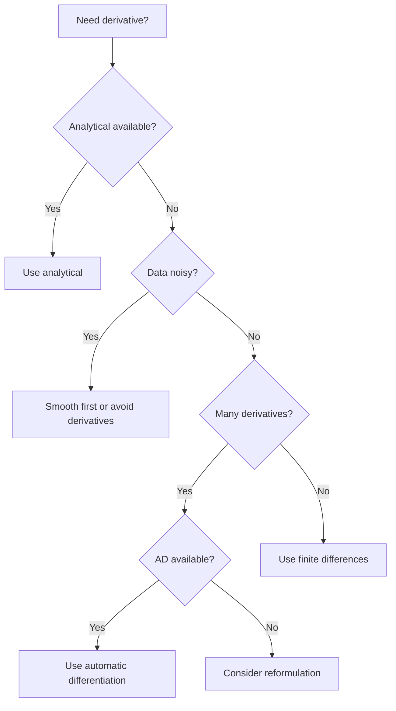

**Navigation:**
[← Part 2: Numbers Aren't Real](./02-part2-numerical-errors.md) | [Synthesis & Summary →](./04-module1-synthesis.md)

## Learning Outcomes

By the end of this section, you will be able to:

- [ ] **Verify** that Taylor series error predictions match numerical experiments
- [ ] **Design** custom finite difference formulas for specific accuracy requirements
- [ ] **Recognize** when to avoid numerical derivatives entirely
- [ ] **Compare** finite differences with automatic differentiation for different applications
- [ ] **Connect** these foundations to the dynamic systems in upcoming modules

---

## Introduction: From Theory to Practice

In Part 1, you learned how Taylor series generates finite difference formulas and predicts their errors. Now we'll verify these predictions work in practice, explore when NOT to use numerical derivatives, and introduce modern alternatives that you'll use in your final project.

## Verifying Error Predictions

**Why this matters**: Taylor series isn't just abstract mathematics - it accurately predicts the errors in our numerical methods. This verification shows that our theoretical analysis matches reality, giving us confidence in our error estimates. When you implement numerical methods in your research, you can use similar tests to verify your code is working correctly.

```python
import numpy as np

def verify_taylor_predictions():
    """
    Empirically verify that truncation errors match Taylor predictions
    This builds confidence that our theory accurately describes reality
    """
    # Test function: sin(x) - we know all its derivatives analytically
    f = np.sin
    x, h = 1.0, 0.01
    
    # Forward difference actual error
    fd_approx = (f(x+h) - f(x))/h
    fd_error = fd_approx - np.cos(x)  # cos is the true derivative
    
    # Taylor predicts: error ≈ -(h/2)*f''(x) = (h/2)*sin(x)
    fd_predicted = (h/2) * np.sin(x)
    
    # Central difference actual error  
    cd_approx = (f(x+h) - f(x-h))/(2*h)
    cd_error = cd_approx - np.cos(x)
    
    # Taylor predicts: error ≈ -(h²/6)*f'''(x) = (h²/6)*cos(x)
    cd_predicted = (h**2/6) * np.cos(x)
    
    results = {
        'forward': {'actual': fd_error, 'predicted': fd_predicted},
        'central': {'actual': cd_error, 'predicted': cd_predicted}
    }
    
    print("Taylor Series Predictions vs Reality:")
    print("-" * 60)
    for method, errors in results.items():
        ratio = errors['actual']/errors['predicted']
        print(f"{method.capitalize():8} - Actual: {errors['actual']:.6e}, "
              f"Predicted: {errors['predicted']:.6e}, Ratio: {ratio:.3f}")
    
    return results

# Run verification
results = verify_taylor_predictions()
```

The ratio should be very close to 1.000, confirming our theory works! Try different functions and $h$ values to build intuition.

## Designing Custom Finite Difference Formulas

Sometimes standard methods aren't sufficient. Here's how to derive your own:

### Example: One-Sided Second Derivative

Suppose you need $f''(x)$ but can only evaluate $f$ at $x$, $x+h$, and $x+2h$ (e.g., at a boundary). Use Taylor series:

$$f(x+h) = f(x) + hf'(x) + \frac{h^2}{2}f''(x) + \frac{h^3}{6}f'''(x) + O(h^4)$$

$$f(x+2h) = f(x) + 2hf'(x) + \frac{4h^2}{2}f''(x) + \frac{8h^3}{6}f'''(x) + O(h^4)$$

To eliminate $f'(x)$, compute $f(x+2h) - 2f(x+h)$:

$$f(x+2h) - 2f(x+h) = -f(x) + h^2f''(x) + h^3f'''(x) + O(h^4)$$

Therefore:

$$\boxed{f''(x) = \frac{f(x+2h) - 2f(x+h) + f(x)}{h^2} + O(h)}$$

This is first-order accurate - not great, but sometimes necessary at boundaries.

### General Recipe for Custom Methods

1. **Write Taylor expansions** for all available points
2. **Form linear combinations** to eliminate unwanted derivatives
3. **Solve for the derivative** you want
4. **Identify the error order** from remaining terms

```python
def custom_second_derivative(f, x, h):
    """One-sided second derivative for boundary conditions"""
    return (f(x+2*h) - 2*f(x+h) + f(x)) / h**2
```

## When NOT to Use Numerical Derivatives

Before implementing numerical derivatives, consider if they're the right tool:

### 1. Analytical Derivatives Available

If you can derive the derivative analytically, always do so:

```python
# BAD: Numerical derivative of a polynomial
def df_numerical(x):
    f = lambda x: x**3 - 2*x**2 + 5*x - 3
    return (f(x+1e-8) - f(x-1e-8)) / (2*1e-8)

# GOOD: Exact derivative
def df_analytical(x):
    return 3*x**2 - 4*x + 5
```

### 2. Noisy Data

Numerical derivatives amplify noise catastrophically:

```python
import numpy as np
import matplotlib.pyplot as plt

# Smooth function with noise
x = np.linspace(0, 2*np.pi, 100)
y_true = np.sin(x)
y_noisy = y_true + 0.01 * np.random.randn(len(x))

# Numerical derivative amplifies noise
dy_dx = np.gradient(y_noisy, x)

plt.figure(figsize=(10, 4))
plt.subplot(121)
plt.plot(x, y_true, 'b-', label='True')
plt.plot(x, y_noisy, 'r.', alpha=0.5, label='Noisy data')
plt.title('Function: Noise is small')
plt.legend()

plt.subplot(122)
plt.plot(x, np.cos(x), 'b-', label='True derivative')
plt.plot(x, dy_dx, 'r-', alpha=0.7, label='Numerical derivative')
plt.title('Derivative: Noise is amplified!')
plt.legend()
plt.show()
```

### 3. Expensive Function Evaluations

If each function evaluation involves solving a PDE or running a simulation, numerical derivatives become prohibitively expensive. Central difference needs 2 evaluations, fourth-order needs 4.

### 4. You Need Many Derivatives

For neural networks with millions of parameters, computing gradients via finite differences would require millions of forward passes. This is where automatic differentiation shines.

## Modern Alternative: Automatic Differentiation

**Automatic differentiation (AD)** computes exact derivatives (to machine precision) by tracking operations, not by finite differences. You'll use this extensively with JAX in your final project.

### How AD Differs from Finite Differences

| Aspect | Finite Differences | Automatic Differentiation |
|--------|-------------------|--------------------------|
| **Accuracy** | Approximate, $O(h^p)$ error | Exact to machine precision |
| **Cost** | 2+ function evaluations per derivative | Similar to one function evaluation |
| **Implementation** | Simple, works on any function | Requires AD-aware library |
| **Use cases** | Black-box functions, verification | Neural networks, optimization |

### Simple JAX Example (Preview for Final Project)

```python
import jax
import jax.numpy as jnp

# Define a complex function
def f(x):
    return jnp.sin(x) * jnp.exp(-x**2) + x**3

# Automatic differentiation gives exact derivative
df_dx = jax.grad(f)

# Compare with finite differences
x = 1.0
exact = df_dx(x)
numerical = (f(x + 1e-8) - f(x - 1e-8)) / (2e-8)

print(f"AD derivative:     {exact:.15f}")
print(f"Finite difference: {numerical:.15f}")
print(f"Difference:        {abs(exact - numerical):.3e}")
```

AD gives the exact derivative without any $h$ optimization or truncation error!

### When to Use Each Method

**Use Finite Differences when:**

- Function is only available as a black box
- Quick derivative estimates needed
- Verifying AD implementations
- Teaching/understanding numerical methods

**Use Automatic Differentiation when:**
- You need many derivatives (optimization, neural networks)
- Exact derivatives are crucial
- Function is expensive but differentiable
- Using modern ML frameworks (JAX, PyTorch, TensorFlow)

:::{admonition} Connection to Final Project
:class: tip
In your neural network project, you'll use JAX's automatic differentiation to:

- Compute gradients for millions of parameters simultaneously
- Implement backpropagation without manual derivative coding
- Achieve exact gradients without truncation error

Understanding finite differences now helps you appreciate why AD is revolutionary for machine learning!
:::

## Practical Guidelines

### Choosing the Right Tool



### Verification Strategy

Always verify numerical methods with multiple approaches:

```python
def verify_derivative(f, x, true_derivative=None):
    """Compare different derivative methods for verification"""
    
    methods = {
        'forward_1e-8': (f(x + 1e-8) - f(x)) / 1e-8,
        'central_1e-5': (f(x + 1e-5) - f(x - 1e-5)) / 2e-5,
        'central_1e-8': (f(x + 1e-8) - f(x - 1e-8)) / 2e-8,
    }
    
    print("Derivative estimates:")
    for name, value in methods.items():
        print(f"  {name:15s}: {value:.10f}")
    
    if true_derivative is not None:
        print(f"  {'True':15s}: {true_derivative:.10f}")
        
    # Check consistency
    values = list(methods.values())
    spread = max(values) - min(values)
    if spread > 1e-6:
        print(f"⚠️ Warning: Large spread {spread:.3e} suggests numerical issues")
    
    return methods
```

---

## Bridge to Module 2: From Static to Dynamic

You've now mastered computing derivatives at single points. But astrophysics is about evolution and motion. In Module 2, you'll apply these foundations to dynamic problems:

### What's Coming Next

**Root Finding**: Finding where $f(x) = 0$
- Where does a planet's orbit cross the ecliptic?
- At what radius does hydrostatic equilibrium occur?
- When does a light curve reach maximum?

**Integration**: Computing $\int f(x)dx$
- Total energy radiated by a star
- Mass enclosed within a radius
- Optical depth through an atmosphere

**ODEs**: Solving $\frac{dy}{dt} = f(t,y)$
- Orbital evolution over time
- Stellar structure equations
- Chemical reaction networks

### Key Insight to Carry Forward

The error analysis framework you've learned here — balancing truncation vs. round-off error, understanding convergence rates, choosing appropriate methods — applies to ALL numerical methods:

- Integration methods have similar accuracy/cost trade-offs
- ODE solvers must balance step size just like choosing $h$
- Root finders converge at rates predicted by Taylor series

The finite difference methods you've mastered are the building blocks for these more complex algorithms. When you implement Runge-Kutta methods in Module 3, you'll recognize them as clever combinations of the forward differences you've studied here.

## Final Checklist

Before moving to Module 2, ensure you can:

- [ ] Verify Taylor series predictions match numerical experiments
- [ ] Derive custom finite difference formulas when needed
- [ ] Recognize when to avoid numerical derivatives
- [ ] Explain the difference between finite differences and automatic differentiation
- [ ] Choose the appropriate differentiation method for a given problem

---

*Ready for Module 2? You now have the foundation to tackle root finding, integration, and the beginning of dynamical systems!*
