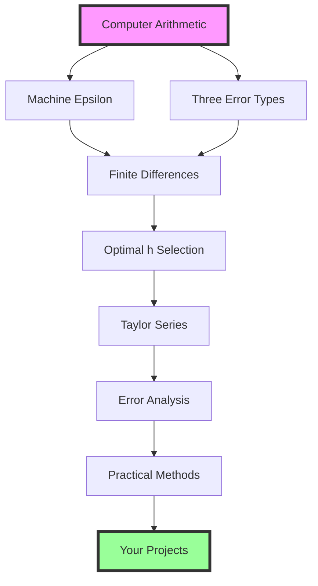

## Module Summary: Your Numerical Toolkit

This module has given you a complete foundation for numerical computing built on understanding fundamental limitations:

**Part 1** revealed the core paradox:
- Computers cannot take limits $h \to 0$
- Finite differences approximate derivatives
- Optimal $h$ balances truncation vs round-off error
- Symmetric methods achieve higher accuracy

**Part 2** exposed the reality of computer arithmetic:
- Machine epsilon limits precision
- Three error types interact and propagate
- Catastrophic cancellation destroys accuracy
- Reformulation preserves precision

**Part 3** provided the mathematical framework:
- Taylor series reveals exact errors
- Custom methods for special cases
- When to avoid numerical derivatives
- Modern automatic differentiation

These aren't separate topics – they're one unified framework for understanding how continuous mathematics becomes discrete computation.

## Key Takeaways

✅ **Computers cannot represent real numbers exactly** – finite precision is fundamental  
✅ **The limit $h \to 0$ is impossible** – we must balance competing errors  
✅ **Optimal $h \approx \sqrt{\epsilon}$ for forward difference** – not intuitive but mathematically rigorous  
✅ **Central difference is superior** – symmetry cancels systematic errors  
✅ **Machine epsilon $\approx 10^{-16}$** – sets fundamental accuracy limits  
✅ **Three error types** – round-off, truncation, propagation  
✅ **Catastrophic cancellation is avoidable** – through careful reformulation  
✅ **Taylor series is our mathematical microscope** – reveals error structure  
✅ **Automatic differentiation changes everything** – exact derivatives for machine learning

## Looking Forward

With these foundations, you're ready for:

- **Module 2**: Root finding and integration – same error principles, new applications
- **Module 3**: ODEs and conservation – controlling error propagation over time
- **Project 2**: N-body simulations with appropriate timesteps
- **Projects 3-5**: Monte Carlo, MCMC, and Gaussian Processes with proper error control
- **Final Project**: Neural networks using automatic differentiation

The journey from "computers can't do calculus" to "I can control numerical errors" demonstrates the power of understanding limitations. You now have the tools to know not just how to compute, but when to trust your results.

**Remember:** Every numerical calculation is an approximation. The art lies in understanding and controlling the errors, not eliminating them.

---

## Quick Reference Tables

### Finite Difference Formulas

| Method | Formula | Error Order | Optimal h |
|--------|---------|-------------|-----------|
| Forward | $\frac{f(x+h) - f(x)}{h}$ | $O(h)$ | $\sqrt{\epsilon} \approx 10^{-8}$ |
| Backward | $\frac{f(x) - f(x-h)}{h}$ | $O(h)$ | $\sqrt{\epsilon} \approx 10^{-8}$ |
| Central | $\frac{f(x+h) - f(x-h)}{2h}$ | $O(h^2)$ | $\epsilon^{1/3} \approx 10^{-5}$ |
| 4th-order | $\frac{-f(x+2h) + 8f(x+h) - 8f(x-h) + f(x-2h)}{12h}$ | $O(h^4)$ | $\epsilon^{1/5} \approx 10^{-3}$ |

### Error Types and Mitigation

| Error Type | Source | Scaling | Mitigation |
|------------|--------|---------|------------|
| Round-off | Finite precision | $\propto \epsilon/h$ | Use larger h, reformulate |
| Truncation | Approximation | $\propto h^p$ | Use smaller h, higher-order methods |
| Propagation | Iteration | Exponential | Stable algorithms, error monitoring |

### When to Use Each Differentiation Method

| Situation | Recommended Method | Reason |
|-----------|-------------------|---------|
| Black-box function | Finite differences | Only option available |
| Smooth function, moderate accuracy | Central difference | Good accuracy/cost balance |
| Boundary points | One-sided differences | Symmetric not possible |
| Noisy data | Smooth first or avoid | Derivatives amplify noise |
| Many parameters | Automatic differentiation | O(1) vs O(n) scaling |
| Known analytical form | Analytical derivative | Exact and fast |

### Common Reformulations for Stability

| Unstable Form | Stable Form | When Needed |
|---------------|-------------|-------------|
| $a - b$ | Use relative coords | $a \approx b$ |
| $(a^2 - b^2)/(a - b)$ | $a + b$ | $a \approx b$ |
| $\sqrt{x+1} - \sqrt{x}$ | $1/(\sqrt{x+1} + \sqrt{x})$ | Large $x$ |
| $1 - \cos(x)$ | $2\sin^2(x/2)$ | Small $x$ |
| $\log(x) - \log(y)$ | $\log(x/y)$ | $x \approx y$ |

---

## Glossary

**Automatic differentiation (AD)**: Technique for computing exact derivatives by tracking operations through a computational graph, applying the chain rule systematically. Unlike finite differences, AD has no truncation error.

**Catastrophic cancellation**: Severe loss of precision when subtracting nearly equal floating-point numbers. Example: computing $(1 + 10^{-15}) - 1$ loses all significant digits.

**Central difference**: Finite difference method using points symmetrically placed around the evaluation point: $f'(x) \approx \frac{f(x+h) - f(x-h)}{2h}$. Achieves $O(h^2)$ accuracy.

**Convergence**: The property that numerical results approach the true solution as parameters (like step size) are refined. Verified by observing error reduction at predicted rates.

**Floating-point arithmetic**: System for representing real numbers in computers using a fixed number of bits (typically 64 for double precision), leading to finite precision.

**Forward difference**: Simplest finite difference using current and next point: $f'(x) \approx \frac{f(x+h) - f(x)}{h}$. First-order accurate with $O(h)$ error.

**Machine epsilon ($\epsilon$)**: The smallest number such that $1 + \epsilon \neq 1$ in floating-point arithmetic. For double precision: $\epsilon \approx 2.2 \times 10^{-16}$.

**Optimal step size**: The value of $h$ that minimizes total error by balancing truncation error (decreases with h) and round-off error (increases as h decreases).

**Order of accuracy**: The power $p$ in the error scaling $O(h^p)$. Higher-order methods have errors that decrease more rapidly as $h$ is reduced.

**Propagation error**: Accumulation and amplification of errors through repeated calculations. Critical in long-term integrations like orbital mechanics.

**Relative error**: Error normalized by the true value: $|x_{computed} - x_{true}|/|x_{true}|$. Provides scale-independent accuracy measure.

**Round-off error**: Error introduced by representing real numbers with finite precision. Fundamental limitation of floating-point arithmetic.

**Taylor series**: Power series representation of a function: $f(x+h) = \sum_{n=0}^{\infty} \frac{h^n f^{(n)}(x)}{n!}$. Foundation for deriving and analyzing numerical methods.

**Truncation error**: Error from approximating an infinite process with finite terms. In finite differences, it's the error from neglecting higher-order terms in Taylor series.

---

*You now have the foundations of numerical computing. These principles – understanding finite precision, managing errors, and choosing appropriate methods – will guide you through every computational challenge in astrophysics. Ready for Module 2? Let's explore how these same principles apply to finding roots and computing integrals!*