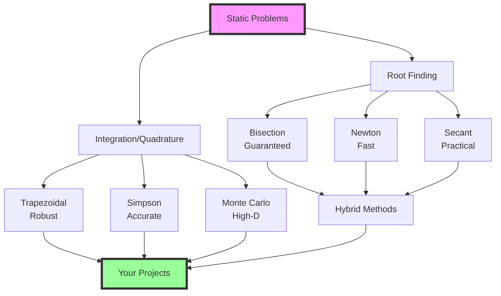

## Module Summary: Your Equilibrium Toolkit

This module has given you a complete toolkit for static problems built on understanding fundamental trade-offs:

**Part 1** revealed three approaches to root finding:
- **Bisection** guarantees convergence through bracketing
- **Newton** achieves quadratic convergence using derivatives
- **Secant** compromises between speed and requirements
- **Hybrid methods** combine strengths for robustness

**Part 2** showed how integration methods balance accuracy and cost:
- **Trapezoidal** handles rough functions and noisy data
- **Simpson** excels for smooth functions
- **Monte Carlo** conquers high dimensions
- **Error analysis** guides method selection

**Part 3** synthesized the connections:
- Root finding and integration are **inverse operations**
- **Condition numbers** predict sensitivity across all methods
- **Convergence patterns** are universal
- **Method selection** depends on problem characteristics

These aren't separate topics—they're one framework that spans from finding Lagrange points to training neural networks. Master these concepts once, apply them everywhere.

## Key Takeaways

✅ **Bracketing guarantees convergence** even when sophisticated methods fail  
✅ **Newton's quadratic convergence** comes at the cost of needing derivatives  
✅ **Higher order isn't always better**—Simpson amplifies noise, Newton can diverge  
✅ **Monte Carlo's dimension-independence** makes it unbeatable for d > 4  
✅ **Condition numbers reveal sensitivity** to perturbations across all methods  
✅ **Hybrid approaches leverage strengths**—Brent's method combines bisection's reliability with interpolation's speed  
✅ **Error scales predictably**: $O(h)$ for bisection, $O(h^2)$ for trapezoid, $O(h^4)$ for Simpson  
✅ **The curse of dimensionality** makes grid methods impossible above ~5D  
✅ **Richardson extrapolation** achieves higher accuracy from lower-order methods  
✅ **The same principles** work from stellar equilibrium to machine learning optimization

## Looking Forward

With these foundations, you're ready for:

- **Module 3**: Making time flow with ODE integration
- **Project 2**: N-body simulations using Kepler's equation and energy integrals
- **Project 3**: Monte Carlo radiative transfer in high dimensions
- **Projects 4-5**: MCMC optimization and Gaussian process integration

The journey from "find where f(x) = 0" to "I can locate Lagrange points and measure galaxy luminosities" demonstrates the power of computational thinking. You now have the tools to understand not just how to compute, but why these methods work and when they fail.

**Remember:** Whether you're finding stellar radii, computing orbital periods, or optimizing neural networks, you're applying the *same* mathematical principles. The universe, it turns out, is remarkably consistent in its computational needs at every scale.

---

## Quick Reference Tables

### Root Finding Methods

| Method | Formula | Convergence | Iterations for ε | When to Use |
|--------|---------|-------------|------------------|-------------|
| Bisection | $c = \frac{a+b}{2}$ | Linear: $e_{n+1} = \frac{1}{2}e_n$ | $\log_2(L/\epsilon)$ | Need guarantee |
| Newton | $x_{n+1} = x_n - \frac{f(x_n)}{f'(x_n)}$ | Quadratic: $e_{n+1} \propto e_n^2$ | ~5-10 | Have derivative, good guess |
| Secant | $x_{n+1} = x_n - f(x_n)\frac{x_n-x_{n-1}}{f(x_n)-f(x_{n-1})}$ | Superlinear: $e_{n+1} \propto e_n^{1.618}$ | ~8-15 | No derivative available |

### Integration Methods

| Method | Local Error | Global Error | Function Evals | Best For |
|--------|-------------|--------------|----------------|----------|
| Rectangle | $O(h^2)$ | $O(h)$ | n | Teaching only |
| Trapezoidal | $O(h^3)$ | $O(h^2)$ | n+1 | Noisy/experimental data |
| Simpson | $O(h^5)$ | $O(h^4)$ | n+1 (n even) | Smooth functions |
| Gaussian | $O(h^{2n+1})$ | $O(h^{2n})$ | n | Maximum accuracy |
| Monte Carlo | — | $O(N^{-1/2})$ | N | Dimensions > 4 |

### Method Selection Guide

| If your problem has... | Use this method | Because... |
|------------------------|-----------------|------------|
| No guaranteed bracket | Scan + bisection | Ensures convergence |
| Expensive derivatives | Secant | Avoids f'(x) computation |
| High dimension (d>4) | Monte Carlo | Dimension-independent |
| Smooth function | Simpson/Newton | High-order accuracy |
| Noisy data | Trapezoidal | Doesn't amplify noise |
| Multiple roots | Bracketing first | Isolates each root |
| Near machine precision | Reformulate | Avoid catastrophic cancellation |

### Common Failure Modes and Fixes

| Problem | Symptom | Solution |
|---------|---------|----------|
| f'(x) ≈ 0 | Newton diverges | Switch to bisection |
| No sign change | Bisection won't start | Scan for brackets |
| Oscillatory integrand | Poor convergence | Increase sampling |
| Dimension > 5 | Grid methods fail | Use Monte Carlo |
| Odd n for Simpson | Algorithm fails | Add one interval |
| Round-off dominance | Convergence plateau | Use fewer points |

---

## Glossary

**Adaptive quadrature**: Integration method that automatically refines sampling in regions where the function varies rapidly, allocating computational effort where needed most.

**Bisection method**: Root-finding algorithm that repeatedly halves an interval containing a sign change, guaranteeing convergence at a linear rate of 1/2 per iteration.

**Bracketing**: Having two points where a function has opposite signs, guaranteeing at least one root between them by the Intermediate Value Theorem.

**Catastrophic cancellation**: Severe loss of precision when subtracting nearly equal floating-point numbers, revealing the perils of finite precision arithmetic.

**Condition number**: For root finding, κ = 1/|f'(r)|. Large κ indicates sensitivity to perturbations—an ill-conditioned problem where small changes cause large effects.

**Convergence order**: The power p in error scaling $e_{n+1} ∝ e_n^p$. Linear (p=1), superlinear (1<p<2), quadratic (p=2) describe how rapidly methods approach the solution.

**Curse of dimensionality**: Exponential growth of computational cost with dimension for grid-based methods, making them impractical above ~5 dimensions.

**Gaussian quadrature**: Integration method using optimally-placed points (roots of orthogonal polynomials) to achieve maximum accuracy for polynomial integrands.

**Hybrid method**: Algorithm combining multiple approaches, like Brent's method mixing bisection's reliability with interpolation's speed for robust root finding.

**Ill-conditioned**: Problem sensitive to small perturbations. In root finding, occurs when |f'(r)| is small; in integration, when integrands oscillate rapidly.

**Intermediate Value Theorem**: If f is continuous on [a,b] and k is between f(a) and f(b), then there exists c ∈ (a,b) where f(c) = k.

**Interpolation**: Approximating a function between known points using simpler functions (lines for secant method, parabolas for Simpson's rule).

**Kepler's equation**: Transcendental equation E - e·sin(E) = M relating eccentric anomaly E to mean anomaly M for elliptical orbits. Classic root-finding application.

**Lagrange points**: Five positions in orbital mechanics where gravitational forces balance. Found using root-finding methods on the effective potential gradient.

**Linear convergence**: Error decreases by constant factor each iteration: $e_{n+1} = Ce_n$. Reliable but slow, characteristic of bisection method.

**Monte Carlo integration**: Statistical method using random sampling to estimate integrals. Error scales as N^(-1/2) independent of dimension, making it superior for high-dimensional problems.

**Newton-Raphson method**: Root-finding using tangent line approximation. Achieves quadratic convergence when conditions are favorable but can fail catastrophically.

**Quadratic convergence**: Error squared each iteration: $e_{n+1} ∝ e_n^2$. Number of correct digits doubles per iteration. Characteristic of Newton's method near simple roots.

**Quadrature**: Numerical integration—approximating continuous integrals with discrete sums. From Latin "quadratura" meaning squaring, originally finding square with same area as curve.

**Richardson extrapolation**: Using results at different resolutions to cancel leading error terms, achieving higher accuracy from lower-order methods.

**Root/Zero**: Value x* where f(x*) = 0. In physics, often represents equilibrium points where forces balance or extrema where derivatives vanish.

**Secant method**: Root-finding using line through two points instead of tangent. Achieves superlinear convergence (order ≈1.618, the golden ratio) without needing derivatives.

**Simpson's rule**: Integration using parabolic interpolation through consecutive triplets of points. Achieves fourth-order accuracy despite using only quadratic polynomials.

**Superlinear convergence**: Convergence faster than linear but slower than quadratic. Secant method achieves order φ ≈ 1.618 (golden ratio).

**Transcendental equation**: Equation involving transcendental functions (sin, cos, exp, log) that cannot be solved algebraically. Requires numerical methods.

**Trapezoidal rule**: Integration by connecting consecutive points with straight lines. Second-order accurate, robust for noisy data and irregular spacing.

**Well-conditioned**: Problem where small perturbations cause proportionally small changes. Characterized by small condition number, indicating numerical stability.

---

*You now have the mathematical machinery to find where nature balances and measure cosmic quantities. Whether computing Lagrange points for spacecraft, integrating stellar spectra, or optimizing machine learning models, these methods transform impossible equations into solved problems. Ready for Module 3? Time to make physics evolve!*