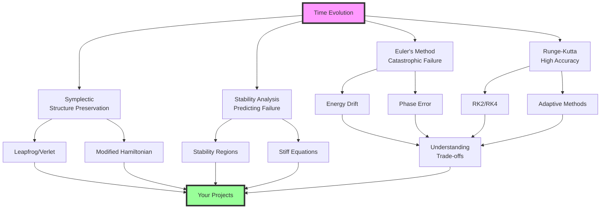

## Module Summary: Your Dynamics Toolkit

This module has given you a complete toolkit for temporal evolution built on understanding fundamental trade-offs:

**Part 1** revealed why naive integration fails catastrophically:
- **Euler's method** creates systematic energy growth
- **Local accuracy** doesn't guarantee global stability
- **Phase errors** accumulate linearly with time
- **Geometric structure** matters more than we thought

**Part 2** showed how Runge-Kutta methods achieve higher accuracy:
- **Multiple sampling** captures solution curvature
- **RK4's weights** connect to Simpson's quadrature
- **Adaptive timesteps** handle varying timescales
- **Higher order** still doesn't preserve energy long-term

**Part 3** introduced symplectic integration's profound insight:
- **Preserve geometry** over local accuracy
- **Leapfrog** keeps energy bounded for gigayears
- **Modified Hamiltonians** explain stability
- **Time reversibility** comes naturally

**Part 4** analyzed when methods become unstable:
- **Stability regions** predict catastrophic failure
- **Stiff equations** force tiny timesteps
- **Implicit methods** trade computation for stability
- **CFL conditions** connect space and time discretization

These aren't separate topics—they're one framework showing how continuous physics becomes discrete computation while preserving what matters most.

## Key Takeaways

✅ **Local accuracy ≠ long-term stability**—Euler is locally O(h²) but destroys physics globally  
✅ **Geometric structure preservation beats high-order accuracy** for Hamiltonian systems  
✅ **Symplectic integrators keep energy bounded** even with lower formal accuracy  
✅ **RK4 achieves O(h⁴) accuracy** but still exhibits systematic energy drift  
✅ **Stability regions are hard limits**—exceed them and simulations explode  
✅ **Stiff equations require implicit methods** despite computational cost  
✅ **Adaptive timesteps destroy symplecticity**—can't have both benefits  
✅ **Modified Hamiltonians explain** why symplectic methods work  
✅ **Phase space volume must be preserved** (Liouville's theorem)  
✅ **The same principles** apply from planetary orbits to neural network training

## Looking Forward

With these foundations, you're ready for:

- **Module 4**: Monte Carlo methods—when randomness beats determinism
- **Project 2**: N-body simulations with proper conservation
- **Project 3**: Monte Carlo radiative transfer with ray integration
- **Projects 4-5**: MCMC with Hamiltonian dynamics, GP with SDEs
- **Final Project**: Neural networks as gradient flow ODEs

The journey from "Euler destroys orbits" to "I can simulate galaxies for gigayears" demonstrates the power of understanding numerical structure. You now have the tools to know not just which integrator to use, but why certain methods preserve physics while others destroy it.

**Remember:** Every numerical integrator creates an alternate reality with slightly different physics. Whether simulating binary pulsars, galaxy mergers, or training neural networks, you're choosing which approximation best preserves the phenomena you study.

---

## Quick Reference Tables

### Integration Methods Comparison

| Method | Order | Energy Behavior | Phase Space | When to Use |
|--------|-------|-----------------|-------------|-------------|
| Euler | 1 | Exponential growth | Expands | Never for dynamics |
| RK2 | 2 | Systematic drift | Not preserved | Short integrations |
| RK4 | 4 | Slow drift | Not preserved | Moderate accuracy needs |
| Leapfrog | 2 | Bounded oscillation | Preserved exactly | Long-term Hamiltonian |
| Yoshida4 | 4 | Small bounded error | Preserved exactly | High-accuracy symplectic |
| Backward Euler | 1 | Artificial damping | Contracts | Stiff problems |

### Timestep Selection Guide

| System Type | Characteristic Time | Recommended h | Stability Limit |
|-------------|-------------------|----------------|-----------------|
| Harmonic oscillator | T = 2π/ω | 0.01T | h < 2/ω (Euler) |
| Kepler orbit | T = orbital period | 0.001T - 0.01T | h < 0.01T (symplectic) |
| N-body close encounter | t_coll = R/v_rel | 0.01 t_coll | Adaptive needed |
| Stiff chemical | t_fast = 1/λ_max | Implicit only | No explicit limit |
| Wave equation | t_CFL = Δx/c | 0.5 t_CFL | CFL condition |

### Stability Regions Summary

| Method | Real Axis Limit | Imaginary Axis | Best For |
|--------|-----------------|----------------|----------|
| Euler | [-2, 0] | Small circle | Nothing serious |
| RK2 | [-2, 0] | Larger region | Mild dissipation |
| RK4 | [-2.78, 0] | Even larger | General purpose |
| Leapfrog | None | [-2i, 2i] | Pure oscillations |
| Backward Euler | (-∞, 0] | Entire left plane | Stiff equations |
| Trapezoidal | (-∞, 0] | Entire left plane | A-stable + 2nd order |

### Common Bugs and Fixes

| Symptom | Likely Cause | Solution |
|---------|-------------|----------|
| Energy grows exponentially | Using Euler | Switch to symplectic |
| Orbits spiral | Non-symplectic method | Use leapfrog |
| Simulation explodes | Exceeding stability limit | Reduce timestep |
| Takes forever | Stiff equation | Use implicit method |
| Phase drift | Accumulating error | Higher-order symplectic |
| NaN values | Numerical instability | Check h < stability limit |
| Wrong period | Phase error | Reduce timestep |

---

## Glossary

**A-stable**: Property of numerical methods that remain stable for all eigenvalues in the left half of the complex plane. Essential for stiff equations.

**Adaptive timestep**: Dynamically adjusting h based on error estimates. Improves efficiency but destroys symplecticity.

**Butcher tableau**: Compact notation organizing the coefficients (aᵢⱼ, bᵢ, cᵢ) that define a Runge-Kutta method.

**CFL condition**: Courant-Friedrichs-Lewy stability criterion requiring h ≤ Δx/c_max for hyperbolic PDEs.

**Conjugate momenta**: In Hamiltonian mechanics, the momenta p conjugate to generalized coordinates q, related by p = ∂L/∂q̇.

**Energy drift**: Systematic change in total energy that should be conserved, indicating non-physical behavior of integrator.

**Euler's method**: Simplest ODE integration using constant derivative: x_{n+1} = x_n + hf(x_n,t_n). Catastrophically bad for long-term dynamics.

**Global error**: Total accumulated error over entire integration interval, typically O(h^p) for method of order p.

**Hamiltonian**: Function H(q,p,t) representing total energy of system. H = T + V for kinetic T and potential V.

**Implicit method**: Integration scheme where unknown appears on both sides, requiring algebraic solution each step but offering superior stability.

**Initial Value Problem (IVP)**: Finding function x(t) given dx/dt = f(x,t) and x(t₀) = x₀. Fundamental problem of dynamics.

**Leapfrog/Verlet**: Symplectic integrator that staggers position and momentum updates to preserve phase space structure exactly.

**Liouville's theorem**: Phase space volume is preserved under Hamiltonian flow. Symplectic integrators respect this exactly.

**Local truncation error**: Error introduced in single step assuming perfect starting values, typically O(h^{p+1}) for order-p method.

**Modified Hamiltonian**: The quantity H̃ = H + O(h²) exactly conserved by symplectic integrators, explaining bounded energy error.

**Order of accuracy**: Power p in global error scaling O(h^p). Higher order doesn't guarantee better long-term behavior.

**Phase space**: Space of all possible states (q,p) of Hamiltonian system. Trajectories follow energy contours.

**Poisson bracket**: {f,g} = ∂f/∂q · ∂g/∂p - ∂f/∂p · ∂g/∂q. Fundamental operation in Hamiltonian mechanics.

**Predictor-corrector**: Two-stage integration where initial estimate (predictor) is refined using additional information (corrector).

**RK4 (Runge-Kutta 4)**: Classical fourth-order method using weighted average of four derivative evaluations with Simpson's rule weights.

**Stability function**: R(z) relating consecutive values y_{n+1} = R(hλ)y_n for test equation y' = λy.

**Stability region**: Set of complex values z = hλ where |R(z)| ≤ 1, ensuring bounded numerical solutions.

**Stiff equation**: ODE with widely separated timescales where stability forces much smaller timesteps than accuracy requires.

**Symplectic integrator**: Numerical method preserving symplectic structure (phase space volume, time reversibility) of Hamiltonian systems.

**Symplectic structure**: Geometric structure of phase space preserved by Hamiltonian flow, characterized by 2-form ω = dq ∧ dp.

**Time reversibility**: Property where integrating forward then backward returns exactly to start. Natural for symplectic methods.

**Yoshida coefficients**: Special timestep ratios w₀, w₁ involving 2^(1/3) that achieve fourth-order accuracy while maintaining symplecticity.

---

*You now master the art of making time flow numerically while preserving the physics that matters. Whether tracking spacecraft to Jupiter, simulating galaxy mergers, or training neural networks, you understand the deep trade-offs between accuracy, stability, and structure preservation. The universe's dynamics can now evolve through your simulations with confidence!*