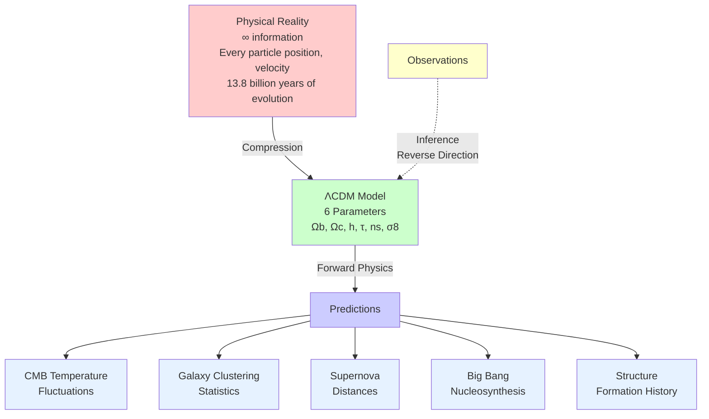
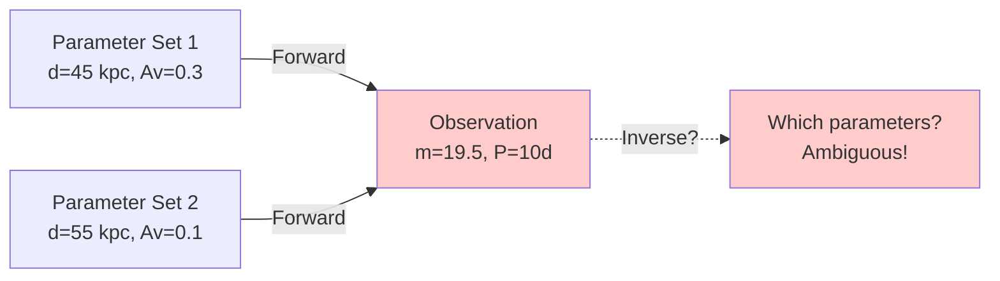
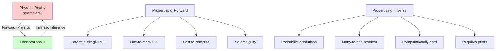

:::{epigraph}
"Measure what is measurable, and make measurable what is not so."

-- Galileo Galilei
:::

## Learning Objectives

By the end of Part 1, you will be able to:

- [ ] **Explain** why every astronomical measurement is an act of inference, not direct observation
- [ ] **Articulate** how models embody our beliefs about how nature works
- [ ] **Distinguish** between forward problems (physics) and inverse problems (inference)
- [ ] **Recognize** how prior beliefs shape what we can discover
- [ ] **Identify** where information is lost in the measurement chain
- [ ] **Connect** the philosophy of measurement to the Statistical Thinking framework from Module 1

---

:::{admonition} 🗺️ Your Roadmap Through Part 1
:class: note

**Core Question**: How can we know the temperature of a star, the mass of a galaxy, or the age of the universe when we can only collect photons from Earth?

This part establishes the philosophical and conceptual foundation for statistical inference. We'll explore:

**Section 1.1: What Is a Model?**
Models as compression algorithms for reality. The Platonic vs. Instrumentalist debate about scientific truth.

**Section 1.2: Beliefs Shape Discovery**
How prior knowledge enables and constrains what we can discover. Historical examples from parallax to dark matter.

**Section 1.3: The Inverse Problem**
Why the forward direction (physics) is easy but the reverse direction (inference) requires statistical frameworks.

**The Big Picture**: Understanding WHAT we're doing philosophically prepares us for HOW we'll do it mathematically (Part 2) and computationally (Parts 3-5).
:::

---

## 1.1 The Fundamental Problem: What Does It Mean to Measure Reality?

**Priority: 🔴 Essential**

### What Is a Model? A Philosophical Foundation

:::{margin}
**Model**: A simplified representation of reality that captures essential features while ignoring irrelevant details.
:::

A **model** is humanity's attempt to compress the infinite complexity of reality into comprehensible patterns. It's not reality itself — it's a map that helps us navigate reality. Every model is a story we tell about how the Universe works, written in the language of mathematics.

But here's the profound question: Are we discovering truth or creating useful fiction? When Newton wrote $F = ma$, did he uncover a fundamental law written into the fabric of spacetime, or did he invent a remarkably successful description that happens to work? This isn't just philosophy—it affects how we interpret our measurements.

Consider two perspectives:

**The Platonic View**: Mathematical laws exist independently of human minds. We discover them like explorers finding new continents. The Universe IS mathematical at its deepest level. When we measure the mass of an electron, we're uncovering an actual property of reality. Our models converge toward absolute truth.

**The Instrumentalist View**: Models are tools, not truth. They're human constructs that happen to predict observations. "All models are wrong, but some are useful" (George Box). The electron doesn't "have" a mass—rather, our model assigns it a parameter we call mass that makes predictions work. Different models might use completely different parameters and still predict the same observations.

The remarkable fact is that both views lead to the same practical approach: We build models, test them against observations, and refine our understanding. But your philosophical stance affects how you interpret uncertainty. Are we uncertain because we haven't measured precisely enough (Platonic), or because uncertainty is fundamental to the modeling process (Instrumentalist)?

### The Role of Belief in Scientific Measurement

Here's something they don't tell you in introductory physics: Every measurement carries beliefs. When you point a telescope at a Cepheid variable and measure its brightness, you're not just recording photons. You're bringing an entire framework of assumptions, prior knowledge, and beliefs about how the Universe works.

**Beliefs embedded in a "simple" brightness measurement:**

- Light travels in straight lines (mostly true, except near massive objects)
- The inverse square law holds over cosmic distances (assumes flat space)
- Photons aren't created or destroyed en route (mostly true, except scattering)
- Our detector responds linearly to photon flux (calibration assumption)
- The star's brightness isn't being affected by unseen companions (binary assumption)
- Intervening dust follows known extinction laws (prior astronomical knowledge)

Each of these beliefs affects how we interpret the measurement. If we believed space was filled with invisible absorbing material (as some 19th-century astronomers did), we'd interpret the same brightness measurement as indicating a different distance. Our conclusions depend not just on data but on the entire framework of prior understanding we bring to the problem.

This is why astronomy progresses through successive refinements of our belief framework. Hipparcos satellite measurements updated our beliefs about stellar distances. Gaia refined them further. Each generation doesn't start from scratch—it inherits the accumulated wisdom (and biases) of previous generations. This inherited knowledge shapes what we look for and how we interpret what we find.

:::{admonition} 📚 The More You Know: Newton and the Birth of Mathematical Physics
:class: note

**The First True Scientific Model**

While humans have recognized patterns since antiquity (Babylonian astronomy tracked planetary positions, Greek geometry described shapes), Isaac Newton created the first complete **mathematical model of physical reality** in 1687 with the *Principia Mathematica*.

**What made Newton revolutionary:**

Before Newton, natural philosophers had two types of knowledge:

- **Terrestrial physics**: How things move on Earth (Galileo's experiments)
- **Celestial mechanics**: How planets move in heaven (Kepler's laws)

These were considered fundamentally different realms. The heavens were perfect, eternal, divine. Earth was corrupt, changing, mundane. No one imagined the same laws could govern both.

Newton's radical insight: One equation $(F = GMm/r²)$ explains both realms:

- Why apples fall from trees
- Why the Moon orbits Earth
- Why Earth orbits the Sun
- Ocean tides (Moon's gravity pulling water)
- Precession of equinoxes (Sun and Moon pulling Earth's bulge)

**The model's predictive power stunned the world:**

- Halley used it to predict a comet's return (76 years later, it appeared)
- Astronomers used perturbations in Uranus's orbit to predict Neptune's existence and location
- Engineers used it to calculate trajectories for Apollo missions

But here's the subtle point about beliefs: Newton's model worked so spectacularly that it became difficult to imagine it could be wrong. For 200 years, any observation that didn't fit was assumed to be an error or due to an undiscovered planet. It took Einstein's genius (and the persistent anomaly of Mercury's perihelion) to realize the model itself needed revision.

*"Nature and Nature's laws lay hid in night: God said, Let Newton be! and all was light."* — Alexander Pope

*"It did not last: the Devil howling 'Ho! Let Einstein be!' restored the status quo."* — John Collings Squire
:::

<! ALR Note: Should we add Occam's Razor discussion here? Or in 1.2 instead?>

### From Patterns to Mathematics: The Language of Inference

The journey from observation to understanding always follows the same arc. Early astronomers noticed patterns: certain stars brighten and dim regularly. But noticing isn't understanding. The breakthrough comes when we can describe the pattern mathematically, because only then can we:

1. **Predict precisely**: Not just "the star will brighten sometime soon" but "maximum brightness at 2:31:17 UTC"
2. **Connect to physics**: The period-luminosity relation reveals stellar structure
3. **Measure the unmeasurable**: Use the pattern to determine distance

But here's where inference becomes essential: The mathematical model gives us the forward direction (if we know the star's intrinsic luminosity and distance, we can predict its apparent brightness). But we need the reverse: given the observed brightness, what's the distance? This reverse direction is fundamentally uncertain because multiple combinations of intrinsic brightness and distance could produce the same observation.

### Models as Compression Algorithms for Reality

:::{margin}
**Compression**: Reducing information from a large set to a smaller, more manageable representation while retaining essential features.
:::

Think of a model as a **compression** algorithm for the Universe. Reality has essentially infinite information — every particle's position and momentum at every instant. A model compresses this to a manageable set of parameters.

The ΛCDM cosmological model is perhaps the ultimate example. The entire history and future of the Universe — the position and velocity of every galaxy, the formation of every structure, 13.8 billion years of evolution — is compressed into just six numbers (Planck 2018 results):

- $Ω_b$ (baryon density): 0.0486
- $Ω_c$ (cold dark matter density): 0.2589  
- $h$ (dimensionless Hubble parameter, where H₀ = 100h km/s/Mpc): 0.6774
- $τ$ (optical depth to reionization): 0.066
- $n_s$ (scalar spectral index): 0.9667
- $σ_8$ (amplitude of fluctuations): 0.8159

From these six numbers, we can predict:

- When the first stars formed
- How galaxies cluster
- The temperature patterns in the CMB
- The acceleration of cosmic expansion
- The ultimate fate of the Universe

This is almost miraculous compression — infinite complexity reduced to six parameters! But the compression is lossy. We can't predict which specific stars will form where, only statistical properties. This is why inference must be probabilistic.

:::{admonition} 🔍 Decoding the Cosmological Parameters
:class: note

What do these six numbers actually mean? And why is dark energy missing from the list?

**$\Omega_b$ (Baryon Density) = 0.0486**  
The fraction of the universe's total energy in ordinary matter—protons, neutrons, electrons. The atoms that make up stars, planets, and you. This is only about **5%** of everything.

**$\Omega_c$ (Cold Dark Matter Density) = 0.2589**  
The fraction in dark matter—mysterious stuff that has gravity but doesn't emit, absorb, or scatter light. We know it's there from how galaxies rotate and how clusters hold together. About **26%** of everything. "Cold" means it moves slowly (non-relativistic), allowing gravity to pull it into clumps.

**$h$ (Dimensionless Hubble Parameter) = 0.6774**  
The universe's expansion rate today, written as $H_0 = 100h$ km/s/Mpc. This tells us how fast distant galaxies are receding from us. Larger $h$ means faster expansion, younger universe. *(Note: There's currently an unresolved disagreement between different ways of measuring this!)*

**$\tau$ (Optical Depth to Reionization) = 0.066**  
After the Big Bang, the universe was dark for millions of years. Then the first stars formed and their light re-ionized hydrogen gas. This parameter measures how much that ionized gas affected ancient light (from the Cosmic Microwave Background) traveling through it. Tells us roughly when the first stars "turned on."

**$n_s$ (Scalar Spectral Index) = 0.9667**  
This describes the "texture" of density fluctuations in the early universe—the tiny ripples that eventually grew into galaxies and galaxy clusters. A value near 1 means fluctuations are similar at all scales. The slight deviation below 1 tells us larger-scale fluctuations are a bit stronger.

**$\sigma_8$ (Fluctuation Amplitude) = 0.8159**  
How "clumpy" the universe is today on a specific scale (8 Mpc, roughly the size of large galaxy clusters). Sets the overall strength of cosmic structure formation. Higher values = more pronounced clustering.

---

**The Missing Parameter: Where's Dark Energy?**

You might notice dark energy ($\Omega_\Lambda$) — which makes up **68%** of the universe — isn't in our list of six parameters. Why not?

**It's derived from the others**, but only if we make a crucial assumption:

**The Flatness Assumption:**  
$$\Omega_b + \Omega_c + \Omega_\Lambda + \Omega_r = 1$$

This equation says the universe's **total energy density** equals the "critical density" — the boundary between a universe that expands forever and one that eventually collapses. In geometric terms, this means space is **flat** (not curved like a sphere or saddle).

Since radiation ($\Omega_r$) is tiny today (~0.01%), we can solve for dark energy:
$$\Omega_\Lambda = 1 - \Omega_b - \Omega_c \approx 1 - 0.05 - 0.26 = 0.69$$

**But why assume flatness?**

For the past two decades, the evidence strongly suggested the universe is flat:

- Measurements of the Cosmic Microwave Background (ancient light from 380,000 years after the Big Bang) showed spatial geometry consistent with flatness.
- Theoretical predictions from inflation (a period of ultra-rapid expansion right after the Big Bang) say the universe should be flat to extraordinary precision.

However - **and this is very recent** - data released in 2024 from the Dark Energy Spectroscopic Instrument (**DESI**) hints that the flatness assumption might not be quite right. Early results suggest:

- Dark energy might **change with time** $\to$ Einstein's "cosmological constant" Λ may not be constant! 🤯
- Space might have **slight positive curvature** (like a very gentle sphere).
- The evidence isn't conclusive yet - currently ~2σ significance (meaning roughly 95% confidence). Cosmologists require **5σ**, or 99.9999% confidence, to claim a discovery. *Why this specific threshold? You'll find out when we formalize hypothesis testing in Part 2!*

**What does this mean?**

If confirmed by future observations, we might need to expand our parameter list:

- Add $\Omega_k$ (spatial curvature) as a 7th parameter
- Replace constant $\Omega_\Lambda$ with a function $w(z)$ describing how dark energy evolves
- Recalibrate other parameters accordingly

**The profound lesson**: Even our most successful model — one that explains the universe's history with just six numbers — remains **provisional**. Science doesn't give us eternal truth; it gives us the *best* current description, always subject to revision when better data arrives.

When you do Project 4 and infer cosmological parameters from supernova data, you'll be wrestling with the same questions professional cosmologists debate today. Your inference will depend on whether you assume flatness or allow curvature. **Different assumptions = different conclusions.**

:::

This is the scientific method in action: theories are provisional models, always open to revision by better data. This exemplifies the scientific mindset — *hold your conclusions tentatively, update them honestly*.

:::{admonition} 📊 The Compression Architecture
:class: note



**The Key Insight**: Forward (model → predictions) is physics. Reverse (observations → model) is **inference** — the subject of this entire module!
:::

:::{margin}
**Overfitting vs. Generalization**: Overfitting occurs when a model captures noise instead of the underlying pattern, leading to poor predictions on new data. Generalization is the model's ability to perform well on unseen data by capturing true patterns.
:::

:::{admonition} 💡 Occam's Razor: Why Simpler Models Are Preferred
:class: tip

**Occam's Razor** states that among competing explanations, the simplest is usually correct. But why?

From an information theory perspective, simpler models achieve better **compression**. A model with 6 parameters (ΛCDM) that explains the universe is remarkable; a model with 600 parameters would be memorization, not understanding.

**More profoundly**: Complex models can fit noise. If you have 100 data points and 99 parameters, you can fit *anything* — including random fluctuations that mean nothing. This is **overfitting**. Simpler models with fewer parameters are forced to capture only the real patterns, making them more likely to predict new observations.

In Bayesian terms (which we'll formalize in Part 2), Occam's Razor emerges naturally: complex models spread their probability across more possibilities, so they make weaker predictions. When those predictions succeed, it's more impressive evidence.

**The catch**: "Simple" must be defined carefully. Einstein's relativity is mathematically complex but conceptually simple — one principle (equivalence) explains gravity. Sometimes apparent complexity reveals deeper simplicity.
:::

### The Measurement Chain: Where Information Is Lost

:::{margin}
**Measurement Chain**: The sequence of transformations from reality to recorded data, each step losing information.

**Inference**: The reverse process of extracting parameters from data, requiring models and prior knowledge.

**Parameters**: The underlying physical quantities we want to know (e.g., distance, mass, temperature).

**Forward Model**: A mathematical function that predicts observations given parameters.

**Reverse Model**: The process of inferring parameters from observations, often ill-posed and requiring statistical methods.

**Degeneracy**: When multiple parameter combinations produce the same observations, making inference ambiguous.
:::

Every astronomical measurement involves a chain of transformations, and each link loses information:

**Reality** → The actual physical state (infinite information)
↓ *Physics filters what's observable*

**Electromagnetic radiation** → Only photons escape (no direct mass measurement)

↓ *Propagation effects*
**Altered radiation** → Dust absorption, gravitational lensing, redshift

↓ *Telescope aperture*
**Collected photons** → Only a tiny fraction captured

↓ *Detector quantum efficiency*
**Recorded counts** → Only some photons trigger detection

↓ *Calibration uncertainty*
**Calibrated measurement** → Systematic errors in flux scale

↓ *Model assumptions*
**Physical parameters** → Extracted using imperfect models

At each step, we lose information and add uncertainty. By the time we get to "the distance to this galaxy is $25.3 ± 0.5$ Mpc," we've compressed an enormous amount of physics, assumptions, and prior knowledge into that simple statement.

This is why **forward modeling** (parameters → observations) is straightforward but inference (observations → parameters) is hard. In the forward direction, physics tells us exactly what to expect. In the reverse direction (**reverse model**), multiple parameter combinations could explain the same observation. We need prior knowledge to break these **degeneracies**.

### The Cepheid Variable: A Case Study in Inference

:::{margin}
**Cepheid Variable**: A type of pulsating star whose brightness varies periodically. The period of pulsation correlates with intrinsic luminosity, making them "standard candles" for distance measurement.
:::

Let's make this concrete with **Cepheid variables**, the stars that revealed the true scale of the Universe. Henrietta Leavitt discovered that their pulsation period correlates with luminosity. But transforming this pattern into distance measurements requires navigating the full complexity of astronomical inference.

```python
import numpy as np

def cepheid_inference_chain():
    """
    Shows how beliefs and prior knowledge enter at every step.
    All calculations use CGS units as astronomers do.
    """

    # Step 1: Raw observation
    observed_flux = 3.7e-10  # erg/s/cm² (CGS units!)
    observed_period = 5.366341  # days
    
    # Step 2: Apply prior belief about detector calibration
    # Vega magnitude system: m = -2.5*log10(F/F_0)
    # For V-band: zero_point ≈ 21.10 when F in erg/s/cm²
    zero_point = 21.10  # From Vega calibration
    calibrated_magnitude = -2.5 * np.log10(observed_flux) + zero_point
    
    # Step 3: Apply prior knowledge about extinction
    # We believe dust follows Cardelli et al. (1989) extinction law
    A_V = 0.15  # Visual extinction in magnitudes (from dust maps)
    intrinsic_magnitude = calibrated_magnitude - A_V
    
    # Step 4: Apply model (Leavitt Law)
    # We believe P-L relation is universal: M_V = -2.43(log P - 1) - 4.05
    # (Madore & Freedman 1991)
    absolute_magnitude = -2.43 * (np.log10(observed_period) - 1) - 4.05
    
    # Step 5: Infer distance
    # We believe inverse square law + flat space geometry
    distance_modulus = intrinsic_magnitude - absolute_magnitude
    distance_pc = 10 ** (distance_modulus / 5 + 1)  # parsecs
    distance_kpc = distance_pc / 1000  # kiloparsecs
    
    return {
        'distance_kpc': distance_kpc,
        'distance_modulus': distance_modulus,
        'apparent_mag': calibrated_magnitude,
        'absolute_mag': absolute_magnitude
    }

# Example usage shows a typical LMC Cepheid
result = cepheid_inference_chain()
print(f"Inferred distance: {result['distance_kpc']:.1f} kpc")
# Output: Inferred distance: ~50 kpc (consistent with LMC!)
```

Notice how beliefs enter at every step. If any of these beliefs are wrong, our distance is wrong. But here's the key insight: we don't have to be certain about our beliefs. We can assign probabilities to different possibilities and propagate uncertainty through the entire chain. This probabilistic propagation is **Bayesian inference**.

:::{margin}
**Bayesian Inference**: A statistical framework that updates prior beliefs with evidence to produce posterior distributions over parameters.
:::

### Prior Knowledge: The Foundation We Build Upon

Science never starts from nothing. When Edwin Hubble first pointed the 100-inch Hooker telescope at Andromeda in 1923, he brought centuries of accumulated astronomical knowledge:

- **Stellar physics**: Stars of similar type have similar luminosities
- **Geometric principles**: The inverse square law for light
- **Previous measurements**: The period-luminosity relation from Magellanic Clouds
- **Theoretical framework**: The concept of "island universes" (galaxies)

This prior knowledge shaped what he looked for (Cepheid variables), how he interpreted observations (as distance indicators), and what conclusions he drew (Andromeda is far outside our galaxy). Without this foundation, the same observations would have been meaningless patterns of light.

In modern inference, we make this prior knowledge explicit and mathematical. When we say "the Hubble constant is probably between 67 and 74 km/s/Mpc," we're encoding decades of measurements into a probability distribution. This isn't arbitrary—it's the mathematical representation of our accumulated understanding.

Prior knowledge also tells us what's impossible or highly unlikely:

- Distances can't be negative (hard constraint)
- Stars can't be older than the Universe (consistency requirement)
- Most galaxies follow known scaling relations (soft constraint)
- Dust extinction can't make things brighter (physical law)

These constraints dramatically reduce the space of possible explanations for our observations. Without them, inference would be impossible—there would be infinite ways to explain any observation.

:::{admonition} 🔗 Connection to Module 1: Statistical Thinking
:class: note

Remember the **Central Limit Theorem** and why repeated measurements converge to normal distributions? That framework is crucial here!

**From Module 1, we learned:**

- **Distributions** describe uncertainty (brightness measurements scatter around true value)
- **Moments** characterize distributions (mean = best estimate, variance = uncertainty)
- **Sampling** lets us explore distributions we can't compute analytically
- **Law of Large Numbers** guarantees convergence with more data

**Now in Module 5:**

- **Prior distributions** encode our beliefs before seeing data
- **Posterior distributions** update beliefs after seeing data  
- **MCMC sampling** explores posteriors too complex to compute directly
- **Uncertainty propagation** tracks how measurement errors affect inferred parameters

The statistical machinery from Module 1 wasn't abstract math — it's the **foundation of all astronomical inference**. Every "measurement" in astronomy is really a statistical inference problem.
:::

### Why Every Measurement Is Actually Inference

Here's the profound realization: There's no such thing as a direct measurement in astronomy. Every number in every paper—mass, distance, temperature, composition—is the result of inference. We never measure mass; we measure orbital periods and infer mass using Kepler's laws. We never measure temperature; we measure colors and infer temperature using blackbody physics.

Consider "measuring" a star's temperature:

1. **What we actually measure**: Flux through different filters
2. **The model we apply**: Blackbody radiation (modified by atmospheric opacity)
3. **Prior knowledge we use**: Stellar atmospheres behave approximately as blackbodies
4. **What we infer**: Effective temperature

But it goes deeper. Even "flux through a filter" isn't directly measured:

1. **What we actually measure**: Electron counts in CCD pixels
2. **The model we apply**: Linear detector response
3. **Prior knowledge we use**: Calibration from standard stars
4. **What we infer**: Incident flux

This regression continues all the way down to raw voltage readings from the detector. At every level, we're using models and prior knowledge to infer what we actually want from what we can actually measure.

### The Fundamental Problem, Restated

We can now state the fundamental problem of astronomical measurement precisely:

**Given:**

- Incomplete, noisy, indirect observations
- Physical models connecting parameters to observables
- Prior knowledge from centuries of astronomy
- Understanding that multiple parameter combinations could explain the same data

**Find:**

- The most probable values of physical parameters
- The uncertainties on these parameters
- The correlations between parameters
- Whether our model is adequate

This is the inference problem. It's not about finding the "right" answer — it's about quantifying what we can know *given* what we've observed. It requires combining observations with prior knowledge through the framework of probability theory.

The solution to this problem — **Bayesian inference** — doesn't give us truth. It gives us the most honest assessment of our knowledge given our observations, our models, and our prior understanding. It's a framework for learning from data while acknowledging uncertainty.

---

## 1.2 Beliefs Shape What We Can Discover

**Priority: 🔴 Essential**

### The Parallax Problem: A Case Study in Belief-Limited Discovery

:::{margin}
**Stellar Parallax**: The apparent shift in a star's position due to Earth's orbit around the Sun. The angle of this shift allows direct distance measurement.

**Beliefs**: Prior assumptions or knowledge that influence the interpretation of data.
:::

For two thousand years, astronomers looked for stellar parallax — the apparent shift in a star's position as Earth orbits the Sun. They couldn't find it. This wasn't due to bad instruments or poor observing conditions. The problem was their **beliefs** about the universe's scale.

**The logic seemed airtight:**

1. If Earth orbits the Sun, nearby stars should show parallax
2. We observe no parallax (even with best instruments)
3. Therefore, either Earth doesn't move OR stars are unimaginably distant

Most chose option 1: Earth doesn't move. This was used as evidence *against* Copernican heliocentrism. But here's the subtle trap: they assumed stars were relatively nearby (perhaps 1000 Earth-Sun distances). With that belief, parallax *should* have been observable.

The breakthrough came only when astronomers **updated their beliefs** about cosmic scale. Friedrich Bessel, in 1838, finally measured stellar parallax — 0.314 arcseconds for 61 Cygni. This tiny angle revealed the star was 600,000 times farther than the Sun! Only by accepting that stars could be at almost incomprehensible distances could astronomers design instruments sensitive enough to detect parallax.

:::{margin}
**0.314 arcseconds**: The width of a dime seen from 7 kilometers away. Ancient astronomers weren't foolish — they were measuring impossibly small angles with pre-telescope technology.
:::

**The lesson**: Our beliefs about what's possible determine what we look for and whether we can find it. The data was always there; the limiting factor was belief.

### The Great Debate: Same Data, Different Conclusions

:::{admonition} 📚 The More You Know: The Great Debate of 1920
:class: note

On April 26, 1920, Harlow Shapley and Heber Curtis stood before the National Academy of Sciences to debate the nature of "spiral nebulae." Both examined the same observations—the same photographic plates, the same brightness measurements, the same spectral data. Yet they reached opposite conclusions:

**Curtis**: Spiral nebulae are "island universes" — separate galaxies far outside the Milky Way.

**Shapley**: Spiral nebulae are small objects within our galaxy, which encompasses the entire observable universe.

**What differed? Their prior beliefs:**

**Curtis believed:**

- The Milky Way is modest in size (~10 kpc)
- Novae in spiral nebulae are like Milky Way novae
- Different brightness implies different distance

**Shapley believed:**

- The Milky Way is enormous (~100 kpc, based on globular clusters)  
- Spiral nebulae novae are intrinsically fainter
- Similar brightness implies similar distance

Same observations → opposite conclusions. Why? **Different priors about Milky Way size** led to different interpretations of identical brightness measurements.

**Resolution**: Hubble's discovery of Cepheids in Andromeda (1923) broke the tie. The period-luminosity relation provided an independent distance estimate that confirmed Curtis's view. But notice: it took *different data* with *stronger constraints* to overcome the dependence on priors.
:::

This illustrates a profound challenge: **observations alone never uniquely determine conclusions**. Your interpretation always depends on what you believed before seeing the data. In modern inference, we make these priors explicit so others can see how our beliefs shaped our conclusions.

### The Underdetermination Problem: Infinite Theories, Finite Data

The philosopher Pierre Duhem articulated a troubling fact: Any finite set of observations can be explained by infinitely many theories. This isn't pedantic philosophy — it's a practical problem every astronomer faces.

**Example: A galaxy's rotation curve**

You observe that stars at a galaxy's edge orbit faster than Newtonian gravity predicts (given the visible matter). What's the explanation?

1. **Dark matter halos**: Add invisible matter with standard gravity
2. **Modified Newtonian Dynamics (MOND)**: Modify gravity at low accelerations
3. **Measurement errors**: Our velocity measurements are systematically wrong
4. **Selection bias**: We preferentially study unusual galaxies
5. **Something else**: New physics we haven't imagined yet

The observations alone don't tell you which is correct. You need additional beliefs:

- Is it more plausible to add new matter or modify fundamental laws?
- How much do we trust our error estimates?
- Is the universe comprehensible, or fundamentally mysterious?

**Most astronomers favor dark matter** because:

- It's conceptually simpler (add matter, keep laws)
- It explains multiple independent phenomena (rotation curves, CMB, gravitational lensing)
- It requires only one new component, not rewriting physics

But notice: these are *reasons for belief*, not logical proofs. MOND advocates have their own compelling reasons. The point isn't who's right—it's that **choosing requires prior beliefs** about what kinds of explanations are more plausible.

### How Leavitt's Belief Enabled Her Discovery

Henrietta Swan Leavitt's period-luminosity discovery (1908) provides a perfect example of how the *right* belief enables discovery that was impossible before.

**The setup:**

- Leavitt studied variable stars in the Small Magellanic Cloud (SMC)
- She noticed brighter Cepheids had longer periods
- But was this *intrinsic* (a real physical relation) or just selection bias?

**The crucial belief:** All stars in the SMC are at approximately the same distance.

If true, then differences in *apparent* brightness reflect differences in *intrinsic* luminosity. The period-luminosity relation must be real, not an artifact of geometry.

**Why was this belief justified?**

- The SMC is a gravitationally bound system (not a chance alignment)
- Its angular size (~3°) corresponds to ~2 kpc depth at ~60 kpc distance
- Depth is small compared to distance (~3% variation)

But notice: Leavitt couldn't *prove* this. She **believed** it based on:

- Previous observations of the SMC's structure
- Theoretical understanding of gravitational binding
- Consistency checks with other distance indicators

Her belief wasn't arbitrary—it was an informed judgment based on accumulated knowledge. And it was correct! But had she believed the SMC was a chance superposition of stars at wildly different distances, she couldn't have discovered the period-luminosity relation. **The right belief enabled the discovery.**

:::{admonition} 🤔 Pause and Reflect
:class: tip

Consider the discoveries you've learned about in astronomy:

1. Could any of them have been made without appropriate prior beliefs?
2. What beliefs do you bring to astronomical observations that you've never explicitly examined?
3. How would you know if one of your beliefs was limiting what you could discover?

*The challenge isn't to eliminate beliefs (impossible) but to make them explicit, examine them critically, and update them when evidence demands.*
:::

### From Implicit to Explicit: The Bayesian Solution

Historically, astronomers carried their beliefs implicitly. Curtis and Shapley disagreed without explicitly quantifying their priors. Modern inference makes beliefs explicit through **prior distributions**—mathematical representations of what we believe before seeing data.

**The Bayesian framework** (which we'll formalize in Part 2) provides:

1. **Explicit priors**: State your beliefs mathematically
2. **Likelihood functions**: Connect parameters to observations via physics  
3. **Bayes' theorem**: Update beliefs systematically with data
4. **Posterior distributions**: Quantify remaining uncertainty

This doesn't eliminate the role of belief—it makes beliefs **transparent** and **updatable**. Other scientists can see your priors, question them, and reanalyze with different assumptions. This is more honest than pretending beliefs don't exist.

**The profound insight**: By making beliefs explicit, we transform arguments about "who's right" into **quantitative questions** about how much different priors affect conclusions. If conclusions barely change with reasonable prior variations, we're on solid ground. If conclusions are extremely prior-dependent, we know we need better data.

### Why This Matters for Your Career

Whether you pursue academia or industry, you'll face the underdetermination problem:

- **Research**: Competing models explain your data. *Which is right?*
- **Data Science**: Multiple algorithms fit training data. *Which generalizes?*
- **Policy**: Different projections predict different futures. *Which to trust?*

The Bayesian framework you'll learn in this module isn't just for astronomy — it's a systematic way to **combine evidence with judgment** while honestly acknowledging uncertainty. *This is the core of scientific thinking.*

:::{admonition} 💡 Key Insight
:class: important

**Beliefs aren't a bug in scientific reasoning — they're a feature.** We can't observe without prior knowledge; we can't interpret without assumptions. The question isn't whether to have beliefs, but whether to make them explicit and updatable.

Bayesian inference is the mathematics of **honest reasoning** with incomplete information.
:::

---

## 1.3 The Inverse Problem in Astronomy

**Priority: 🔴 Essential**

### The Fundamental Asymmetry: Forward is Easy, Inverse is Hard

:::{margin}
**Forward Problem**: Predicting observations from known parameters using physical laws.

**Inverse Problem**: Inferring parameters from observations, often ill-posed and requiring statistical methods.
:::

Every model in physics naturally runs forward — from causes to effects, from parameters to observations, from theory to prediction (**forward problem**). But in astronomy, we need to run backward: from effects to causes, from observations to parameters, from data to theory. This reversal is the **inverse problem**, and it's fundamentally harder than the forward direction.

**Forward Problem (Easy):**
$$
\text{Parameters} \xrightarrow{\text{Physics}} \text{Observations}
$$

Given:

- A Cepheid has period $P = 10$ days
- It's at distance $d = 50$ kpc  
- Extinction is $A_V = 0.2$ mag

**Calculate**: What brightness will we observe?

This is straightforward. Apply the Leavitt law to get absolute magnitude, calculate distance modulus, add extinction, done. One calculation, one answer.

**Inverse Problem (Hard):**
$$
\text{Observations} \xrightarrow{\text{Inference}} \text{Parameters}
$$

Given:

- Observed apparent magnitude $m = 19.5$
- Observed period $P = 10$ days

**Infer**: What is the distance?

This is ambiguous! Multiple combinations of distance and extinction produce the same observed brightness:

- Close + high extinction = dim observed
- Far + low extinction = dim observed

The observations alone don't uniquely specify the parameters. This is **degeneracy**.

### Why Information Is Lost in the Forward Direction

:::{margin}
**Information Loss**: When a many-to-one mapping prevents unique inversion. Multiple inputs produce the same output.

**Degeneracy**: Multiple parameter combinations that produce identical (or indistinguishable) observations.
:::

Consider the measurement chain we discussed in Section 1.1. Each step loses information:

**Reality → Photons:**

- Lost: Mass, composition, internal structure (we only detect photons)
- Kept: Temperature (via wavelength), radial velocity (via redshift)

**Photons → Detection:**  

- Lost: Individual photon properties (we count, not track individuals)
- Kept: Total flux, spectrum

**Detection → Parameters:**

- Lost: Unique solution (degeneracies remain)
- Kept: Constraints (reduced parameter space)

This is why forward modeling is a **many-to-one** function. Many parameter combinations map to similar observations. When you try to invert a many-to-one function, you face ambiguity: which of the many inputs produced this output?



### Breaking Degeneracies with Prior Knowledge

How do we resolve the ambiguity? **We bring additional information—prior knowledge.**

**Example: The Cepheid distance-extinction degeneracy**

Observations alone don't separate distance and extinction. But we have additional knowledge:

1. **Physical constraints**: 
   - Extinction can't be negative (dust absorbs, doesn't emit)
   - Distance must be positive and finite

2. **From other observations**:
   - Dust maps (from other wavelengths) constrain $A_V$
   - Galaxy membership suggests distance range

3. **From theory**:
   - Period-luminosity relation has known scatter (~0.3 mag)
   - Cepheid absolute magnitudes have physical limits

Each piece of prior knowledge **shrinks the parameter space** where solutions live. With enough constraints, we can break degeneracies and obtain unique (or nearly unique) solutions.

:::{admonition} 🔗 Connection to Module 1: Monte Carlo Integration
:class: note

Remember in Module 1 when we computed integrals by sampling? We avoided impossible integrals by exploring the integrand through random samples.

**The same principle applies to inference!**

Computing the full posterior distribution $P(\theta|D)$ over all parameters $\theta$ often involves integrals we can't solve analytically:

$$P(\theta|D) = \frac{P(D|\theta)P(\theta)}{\int P(D|\theta')P(\theta')d\theta'}$$

That denominator—the **evidence**—requires integrating over all possible parameter values. For high-dimensional problems, this is intractable.

**Solution: MCMC sampling** (which we'll learn in Parts 3-4)

Instead of computing the integral, we **sample from the posterior** using Markov Chain Monte Carlo. Just as Monte Carlo integration samples to estimate integrals, MCMC samples to characterize posteriors.

The statistical framework from Module 1 wasn't just academic—it's the computational engine for astronomical inference!
:::

### Multiple Parameters, Exponential Complexity

The inverse problem becomes exponentially harder as dimensions increase. With one parameter, you might search a line. With two parameters, you search a plane. With ten parameters, you search a 10-dimensional space.

**Example: Supernova Cosmology (Project 4 preview)**

To infer cosmological parameters from supernova observations, you need to determine:

- $\Omega_M$ (matter density)
- $\Omega_\Lambda$ (dark energy density)
- $H_0$ (Hubble constant)
- $M$ (absolute magnitude normalization)
- Plus systematic uncertainty parameters...

That's a multi-dimensional parameter space. Observations constrain combinations of parameters but leave degeneracies. For instance, you can trade $\Omega_M$ against $\Omega_\Lambda$ and get similar distance-redshift relations—until you add other constraints (like CMB data).

This is the **curse of dimensionality**: the volume of parameter space grows exponentially with dimensions. Exhaustive search becomes impossible. We need smart sampling strategies (MCMC!) to explore efficiently.

### The Likelihood Function: Connecting Parameters to Data

To solve inverse problems, we need a mathematical bridge between parameters and observations. This bridge is the **likelihood function**:

$$
\mathcal{L}(\theta|D) = P(D|\theta)
$$

Read this carefully: "The likelihood of parameters $\theta$ given data $D$ equals the probability of observing data $D$ if parameters were $\theta$."

**Crucially**: This is NOT the probability that parameters are $\theta$! It's a function of $\theta$ that tells us how probable our actual observations would be for each possible parameter value.

**Example**: Measuring a Cepheid's distance

Let's say we observe $m_{\text{obs}} = 19.5 \pm 0.2$ mag. The likelihood function is:

$$
\mathcal{L}(d) = \frac{1}{\sqrt{2\pi\sigma^2}} \exp\left(-\frac{[m_{\text{obs}} - m_{\text{pred}}(d)]^2}{2\sigma^2}\right)
$$

where $m_{\text{pred}}(d)$ is the predicted magnitude given distance $d$ (using period-luminosity relation).

This function peaks at the distance where predicted magnitude matches observed magnitude. But it doesn't tell us "the probability that $d$ is correct"—for that, we need Bayes' theorem (Part 2).

### Why the Inverse Problem is Ill-Posed

Mathematicians classify problems as:

- **Well-posed**: Unique solution that depends continuously on data
- **Ill-posed**: Multiple solutions, no solution, or unstable solutions

The inverse problem in astronomy is typically **ill-posed** because:

1. **Multiple solutions** (degeneracies)
2. **Sensitivity to noise** (small data changes → large parameter changes)
3. **Incompleteness** (we never observe everything)

**Example of instability**: Imagine inferring a galaxy's dark matter profile from rotation curve data. If measurements have small errors in the outer regions, the inferred halo mass might swing wildly. Small observational changes produce large parameter changes—instability.

**The Bayesian solution**: Prior information **regularizes** ill-posed problems. Priors favor certain parameter regions, providing stability and uniqueness where the data alone doesn't. This is why priors aren't arbitrary—they're necessary to make inference tractable.

### Forward vs. Inverse: A Visual Summary



**The asymmetry is fundamental:** Going from parameters to observations is physics. Going from observations to parameters is **inference** — requiring probability theory, statistical methods, and computational algorithms.

:::{admonition} 💡 Key Insight
:class: important

**The forward problem asks**: "What would we see?"  
**The inverse problem asks**: "What must be true?"

The first is a physics question with deterministic answers.  
The second is a statistical question with probabilistic answers.

Every astronomical measurement is an inverse problem. Understanding this changes how you read papers: when you see "$d = 50.2 \pm 3.1$ kpc," you're seeing the **solution to an inverse problem**—not a direct measurement, but an inference that combines data with prior knowledge through statistical methods.
:::

### The Promise of What's Ahead

This module equips you to solve inverse problems systematically:

- **Part 2** (next): Bayes' theorem provides the mathematical engine for updating beliefs
- **Part 3**: MCMC algorithms let us explore complex posterior distributions
- **Part 4**: Real astronomical applications (Cepheids, supernovae, cosmology)
- **Part 5**: Advanced methods for modern inference challenges

By the end, you'll understand not just *what* astronomical measurements are, but *how* they're made—and why uncertainty isn't a limitation but an honest acknowledgment of the inverse problem's fundamental nature.

---

## Part 1 Synthesis: The Foundation for Inference

:::{admonition} 🎯 What We Just Learned
:class: important

**Models as Compression**:

- Reality has infinite information; models compress to manageable parameters
- ΛCDM: 6 numbers → entire universe
- Compression is lossy → inference must be probabilistic

**Beliefs Are Inescapable**:

- Every measurement embeds assumptions and prior knowledge
- We never observe with a blank slate
- Making beliefs explicit (priors) is more honest than hiding them

**The Measurement Chain**:

- Information lost at every step: reality → photons → detector → parameters
- Forward direction (physics) is straightforward
- Inverse direction (inference) requires statistical framework

**Why Inference Matters**:

- There are no "direct" measurements in astronomy
- Every number is the result of inference
- Understanding the inference process is understanding astronomy itself

**Looking Forward**:

In Part 2, we'll transform these philosophical insights into mathematical tools: likelihood functions, prior distributions, and Bayes' theorem — the engine that updates beliefs with evidence.
:::

:::{admonition} 🎯 Conceptual Checkpoint
:class: note

Before moving forward, ensure you understand:

1. Can you explain why a distance measurement is really an inference, not a direct measurement?
2. What beliefs would change your interpretation of a star's observed brightness?
3. Why is the inverse problem (observations → parameters) harder than the forward problem (parameters → observations)?
4. How does prior knowledge break the degeneracy when multiple parameter combinations could explain the same data?

If these questions feel uncomfortable, revisit the sections above. The philosophical foundation matters—it shapes how you'll approach every astronomical inference problem.
:::
