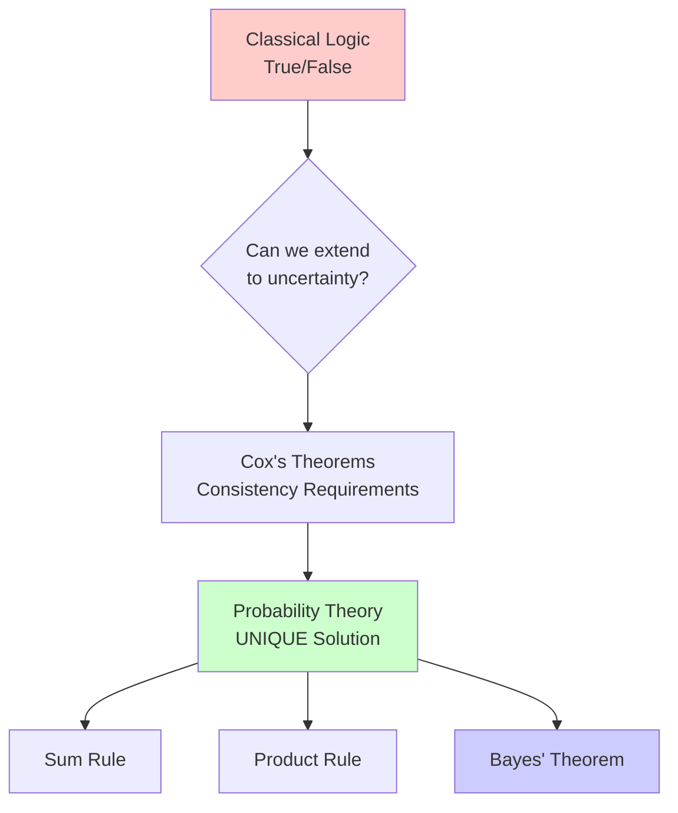
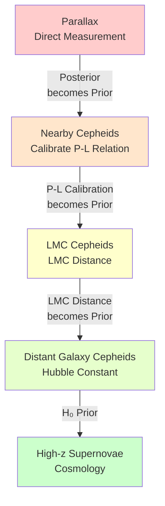

## Learning Outcomes

By the end of Part 2, you will be able to:

- [ ] **Explain** why probability is the unique extension of logic to uncertainty using Cox's theorems
- [ ] **Distinguish** between likelihood P(data|parameters) and posterior P(parameters|data)
- [ ] **Construct** likelihood functions from physics models and measurement uncertainties
- [ ] **Transform** astronomical knowledge into mathematical prior distributions
- [ ] **Derive** Bayes' theorem from first principles using counting arguments
- [ ] **Apply** the complete Bayesian framework to Cepheid distance measurement
- [ ] **Connect** each component to concepts from the Statistical Thinking module

---

## Part 2: From Beliefs to Mathematics

*How do we transform vague beliefs into rigorous inference?*

**Core Question**: How do we transform statements like "this star probably has little dust" into mathematical frameworks that can process data and quantify uncertainty?

---

## 2.1 Probability as Extended Logic

**Priority - 🔴 Essential:**

:::{margin}
**Deductive Logic**
Reasoning from premises to certain conclusions. If A is true and A implies B, then B is true. No uncertainty.

**Plausibility Reasoning**
Extending logic to handle degrees of belief. If A makes B more plausible and A is somewhat plausible, then B becomes more plausible.

**Cox's Theorems**
Mathematical proof that probability theory is the UNIQUE extension of Boolean logic to handle uncertainty consistently.
:::

### The Limits of True and False

Classical logic, the foundation of mathematics since Aristotle, deals in absolutes. A statement is either true or false. A star either has dust extinction or it doesn't. But astronomy doesn't work this way. When we observe a reddened star, we can't say with certainty "this star is behind dust." The reddening could be intrinsic (the star is cool), it could be from dust, it could be from measurement error, or some combination. We need a framework that handles degrees of belief.

Consider the logical chain an astronomer faces:

- If a star is behind dust, it will appear reddened (TRUE)
- This star appears reddened (TRUE)
- Therefore... what?

Classical logic fails us here. The star MIGHT be behind dust, but it might also be intrinsically red. We need to say something like "the reddening increases the plausibility that the star is behind dust, but doesn't prove it." This is where probability enters — **not as a choice, but as a necessity**.

### Probability: The Language of Plausible Reasoning

In the 1940s, physicist Richard Cox asked a profound question: If we want to extend logical reasoning to handle uncertainty, what rules must we follow? His answer was stunning — there is only ONE consistent way to reason with uncertainty, and it's probability theory.

Cox started with desiderata (requirements) that any system of plausible reasoning should satisfy:

1. **Degrees of Plausibility**: Propositions have degrees of plausibility, represented by real numbers
2. **Consistency**: If a conclusion can be reached in multiple ways, all ways must give the same answer
3. **Correspondence**: In the limit of certainty, plausible reasoning must reduce to deductive logic
4. **Universality**: The system should handle any proposition we can state

From just these requirements — which seem almost too basic to be powerful — Cox proved that plausible reasoning MUST follow the rules of probability theory. Not "should" or "could"—MUST.

:::{admonition} 🎯 Cox's Profound Result
:class: important

The rules of probability aren't human inventions — they're mathematical necessities. Any system for reasoning under uncertainty that violates probability theory will lead to inconsistencies.

This means when we use probability in astronomy, we're not making an arbitrary choice. We're using the unique consistent extension of logic to handle uncertainty.

**The rules that emerge**:

1. **Sum Rule**: P(A or B) = P(A) + P(B) - P(A and B)
2. **Product Rule**: P(A and B) = P(A|B) × P(B)
3. **Bayes' Theorem**: Follows directly from the product rule

These aren't axioms we choose—they're theorems that follow from consistency.
:::

### From Astronomical Intuition to Mathematical Probability

Astronomers have always thought probabilistically, even before formalizing it. When Henrietta Leavitt said "these stars are probably at the same distance," she was expressing a degree of belief. When modern astronomers say "this galaxy probably contains dark matter," they're doing plausible reasoning. Probability theory just makes this reasoning mathematically rigorous.

Let's see how astronomical statements become probabilities:

**Qualitative Statement** → **Probability Statement**

- "This star is probably nearby" → P(d < 100 pc) = 0.8
- "Little dust in this direction" → P(A_V < 0.1 mag) = 0.9
- "Cepheid follows the P-L relation" → P(|ΔM| < 0.15) = 0.68

Each transformation takes vague intuition and makes it precise. The numbers aren't arbitrary—they encode our accumulated knowledge from centuries of observations.

### The Cepheid Example: From Logic to Probability

Let's apply this to our running Cepheid example. Using classical logic:

**What we know for certain**:

- The star's brightness varies periodically (TRUE)
- The period is 5.366 days (TRUE)
- Longer-period Cepheids are intrinsically brighter (TRUE from P-L relation)

**What we can't deduce with certainty**:

- The star's distance (depends on intrinsic brightness)
- The amount of dust extinction (degenerate with distance)
- Whether it follows the standard P-L relation (metallicity effects?)

**Enter probability**:

- $P(\text{follows standard } P\text{-}L | \text{ in Milky Way}) = 0.95$
- $P(A_V < 0.5 \text{ mag } | \text{ galactic latitude} = 30°) = 0.8$
- $P(\text{distance} = d \, | \text{ apparent mag} = m, \text{ period} = P) =$ [needs Bayes!]

Probability extends our logical reasoning to handle these uncertainties systematically.

:::{admonition} 🌟 Historical Note: Laplace's Principle
:class: note

Pierre-Simon Laplace, the "French Newton," independently developed probability theory for astronomy in the late 1700s. His principle of insufficient reason stated: without specific information favoring one possibility over another, assign equal probabilities.

Laplace used this to estimate the mass of Saturn from its satellites' orbits, to predict the orbit of comets, and famously to calculate the probability that the sun will rise tomorrow (he got 1,826,214 to 1 based on historical records).

His work showed that probability isn't just about games of chance—it's the mathematical framework for scientific inference.
:::

### Why Not Other Systems?

You might wonder: Why probability? Couldn't we use fuzzy logic, possibility theory, or some other framework? Cox's theorems say no—if we want consistency, we're forced to use probability.

Here's what happens with alternatives:

**Fuzzy Logic**: Handles vagueness ("very hot star") but not uncertainty about facts
**Interval Arithmetic**: Gives ranges but loses information about likelihood within the range
**Possibility Theory**: Lacks the mathematical structure needed for updating with evidence

Only probability theory provides:
- Consistent updating with new information (Bayes' theorem)
- Proper handling of correlations between variables
- Natural incorporation of measurement uncertainties
- Recovery of deductive logic in the limit of certainty

This uniqueness is profound. It means that aliens doing astronomy would use the same probability theory we do—not because they learned it from us, but because mathematics forces it upon any consistent reasoner.

:::{important} 💡 What We Just Learned
Probability theory isn't one option among many for handling uncertainty—it's the UNIQUE consistent extension of logic. When astronomers use probability, we're not making a methodological choice; we're using the only framework that allows consistent reasoning under uncertainty. This transforms vague statements about plausibility into precise mathematical expressions that can be combined, updated, and tested.
:::

:::{admonition} 🎯 From Aristotle to Bayes: The Evolution of Logic
:class: note


**The Key Insight**: Probability isn't one option among many—it's the *only* consistent extension of logic to uncertainty.
:::

---

## 2.2 Likelihood: Encoding Physics as Probability

**Priority: 🔴 Essential**

:::{margin}
**Likelihood $L(θ)$**
The probability of observing the data given specific parameter values: P(data|parameters). NOT the probability of the parameters!

**Generative Model**
A model that can generate simulated data given parameters. The likelihood evaluates how probable the actual data would be under this generative process.

**Noise Model**
The statistical description of measurement errors and intrinsic scatter. Often Gaussian, but can be Poisson (counts), Student-t (outliers), or others.
:::

### The Direction That Physics Gives Us

Physics naturally runs forward—from causes to effects, from parameters to observations. If we know a star's temperature, we can predict its spectrum. If we know a Cepheid's period and intrinsic brightness, we can predict its apparent magnitude at any distance. This forward direction is what physics provides, and it's encoded in the likelihood function.

But here's the critical insight that confuses many: **The likelihood is NOT the probability of the parameters.** It's the probability of the data given the parameters. This distinction is subtle but fundamental.

Consider measuring a Cepheid's brightness:
- **Forward (Physics)**: Given M = -3.5, d = 2.5 Mpc → predict m = 21.5
- **Inverse (Inference)**: Given m = 21.5 ± 0.1, P = 5.4 days → infer d = ?

The likelihood handles the forward direction. It says: "If the distance were 2.5 Mpc, how probable is it that we'd measure m = 21.5?" This is fundamentally different from asking "Given we measured m = 21.5, what's the probability the distance is 2.5 Mpc?"

### Building a Likelihood from Physics

Let's construct a real likelihood function for our Cepheid. We start with the physics—the Period-Luminosity relation discovered by Leavitt:

**The Physics Model**:
$$M_V = -2.43(\log_{10} P - 1) - 4.05$$

where M_V is absolute V-band magnitude and P is period in days.

**Adding Distance**:
The distance modulus relation connects intrinsic and apparent brightness:
$$m - M = 5\log_{10}(d) - 5$$

where d is distance in parsecs.

**Combining the Physics**:
$$m_{predicted} = M_V + 5\log_{10}(d) - 5$$
$$m_{predicted} = -2.43(\log_{10} P - 1) - 4.05 + 5\log_{10}(d) - 5$$

This is our deterministic model—given P and d, we predict m. But observations aren't perfect...

### From Deterministic Model to Probabilistic Likelihood

Real measurements have uncertainties. Our CCD has read noise, the atmosphere scintillates, and Cepheids have intrinsic scatter in their P-L relation. We need to transform our deterministic model into a probability distribution.

**Step 1: Identify the uncertainties**
- Measurement error: σ_m ≈ 0.05 mag (photon noise + systematics)
- Intrinsic scatter: σ_int ≈ 0.15 mag (Cepheids aren't perfect standard candles)
- Total uncertainty: σ_total = √(σ_m² + σ_int²) ≈ 0.16 mag

**Step 2: Choose a noise model**
From the Statistical Thinking module, we learned about the Central Limit Theorem—many small random effects sum to a Gaussian distribution. Both measurement errors and intrinsic scatter arise from many small effects, so we use a Gaussian noise model.

**Step 3: Write the likelihood**
$$\mathcal{L}(d, A_V | m_{obs}, P) = \frac{1}{\sqrt{2\pi\sigma^2}} \exp\left(-\frac{(m_{obs} - m_{predicted}(d, A_V, P))^2}{2\sigma^2}\right)$$

where we've added extinction A_V to our model (making it more realistic).

### The Likelihood in Practice

```python
def cepheid_likelihood(params, observations):
    """
    Likelihood for Cepheid distance measurement.
    
    Physics model + measurement uncertainty = likelihood
    """
    distance, extinction = params  # What we want to infer
    period, apparent_mag, mag_error = observations  # What we measured
    
    # Physics: Period-Luminosity relation (Leavitt Law)
    absolute_mag = -2.43 * (np.log10(period) - 1) - 4.05
    
    # Physics: Distance modulus
    distance_modulus = 5 * np.log10(distance) - 5
    
    # Physics: Extinction dims the star
    predicted_mag = absolute_mag + distance_modulus + extinction
    
    # Statistics: Gaussian noise model
    intrinsic_scatter = 0.15  # Cepheids aren't perfect standard candles
    total_sigma = np.sqrt(mag_error**2 + intrinsic_scatter**2)
    
    # The likelihood: How probable is our observation given these parameters?
    residual = apparent_mag - predicted_mag
    log_likelihood = -0.5 * (residual/total_sigma)**2 - np.log(total_sigma * np.sqrt(2*np.pi))
    
    return np.exp(log_likelihood)
```

:::{figure} fig_part2_likelihood_1d.png
:name: fig-likelihood-1d
:width: 100%

**Likelihood function for Cepheid distance measurement.** This figure shows how the likelihood P(data|distance) quantifies the compatibility between our observations and different distance hypotheses. The **normalized likelihood** (peak = 1.0) peaks at the maximum likelihood estimate (MLE) of d ≈ 5.00 Mpc, representing the distance most consistent with the observed apparent magnitude m = 25.3 ± 0.05 mag and period P = 10 days. The **shaded 68% confidence region** (blue) indicates the range of distances that are reasonably compatible with the data, spanning approximately 4.89–4.99 Mpc. The **narrow width** of this likelihood demonstrates high constraining power—the precise photometry and well-calibrated P-L relation provide strong constraints on distance. Note that this is NOT the probability of the distance being correct (that requires the posterior), but rather how probable our observation would be if the distance were at each value. The sharp rise near the peak shows that small changes in distance cause large changes in the predicted magnitude, making the data highly informative about distance.
:::

### Common Likelihood Pitfalls

**Pitfall 1: Forgetting intrinsic scatter**
If you only include measurement error, you'll be overconfident. Real astronomical objects have intrinsic variation that must be included in the likelihood.

**Pitfall 2: Assuming Gaussian errors**
From Statistical Thinking, we know the CLT gives us Gaussians for many small effects. But what about outliers? Cosmic rays? Variable stars misclassified as Cepheids? Real data often has heavy tails, requiring robust likelihoods (like Student-t distributions).

**Pitfall 3: Ignoring correlations**
If you observe multiple Cepheids with the same telescope, their measurements share systematic errors. The likelihood needs the full covariance matrix, not just individual error bars.

**Pitfall 4: Confusing likelihood with posterior**
Remember: Likelihood is P(data|parameters), NOT P(parameters|data). Mixing these up leads to incorrect inferences.

:::{figure} fig_part2_degeneracy_2d.png
:name: fig-degeneracy-2d
:width: 100%

**How priors break parameter degeneracies in 2D likelihood spaces.** This side-by-side comparison demonstrates a fundamental challenge in astronomical inference: **parameter degeneracy**. **Left panel (Likelihood Only):** The distance-extinction degeneracy ridge (red line) shows that many parameter combinations produce equally good fits to the data. A star could be close and dusty (d ≈ 2.6 Mpc, A_V ≈ 0.5 mag) OR far and clear (d ≈ 3.4 Mpc, A_V ≈ 0.1 mag)—both predict the same observed magnitude. The likelihood alone cannot distinguish these scenarios because dust extinction and distance have similar effects on apparent brightness. **Right panel (Posterior with Prior):** Adding physically motivated priors breaks this degeneracy. A **Gaussian prior on distance** (from previous LMC measurements: 3.0 ± 0.15 Mpc, shown as blue dashed contours) combined with an **exponential prior on extinction** (most sightlines have low A_V, based on dust maps) concentrates probability mass on a single solution (red star). The posterior now strongly favors d ≈ 3.0 Mpc with A_V ≈ 0.2 mag. **Key pedagogical insight:** Priors aren't subjective opinions—they encode objective astronomical knowledge (previous measurements, dust distribution statistics) that resolves ambiguities the data alone cannot. This is how the cosmic distance ladder works: each rung's posterior becomes the next rung's prior, progressively breaking degeneracies from local to cosmological scales.
:::

### The Deep Connection to Information Theory

:::{margin}
**Fisher Information**
A measure of how much information about parameters is contained in the data. High curvature in the log-likelihood means high information—small changes in parameters cause large changes in probability.
:::

The likelihood encodes information about parameters contained in the data. In information theory terms, it quantifies how "surprised" we should be by the observations given different parameter values. High likelihood = unsurprising (expected given the parameters). Low likelihood = surprising (unexpected given the parameters).

The width of the likelihood function tells us about information content:

- **Narrow likelihood**: Data strongly constrains parameters (high information)
- **Broad likelihood**: Data weakly constrains parameters (low information)
- **Flat likelihood**: Data provides no constraint (zero information)

For our Cepheid, a precise brightness measurement gives a narrow likelihood in distance. A noisy measurement gives a broad likelihood. This width—the Fisher information—fundamentally limits how well we can measure distance regardless of our analysis method.

### Connection to Statistical Thinking

Remember from the Statistical Thinking module that temperature is the width of the velocity distribution? The likelihood plays a similar role—it encodes the "width" of possible observations given parameters. Just as temperature describes the spread in molecular velocities, the likelihood describes the spread in possible observations.

The Central Limit Theorem from Statistical Thinking justifies our Gaussian likelihoods. When many small effects contribute to measurement error, their sum approaches a Gaussian. This is why Gaussian likelihoods are ubiquitous in astronomy—not by choice, but by mathematical necessity.

:::{admonition} 📚 Philosophical Insight: Models All the Way Down
:class: note

The likelihood embodies our complete model of the measurement process:

- The physics ($P$-$L$ relation)
- The instrument (measurement uncertainty)
- The astrophysics (intrinsic scatter)
- The statistics (noise distribution)

Each level involves models and assumptions. The P-L relation assumes Cepheids are standard candles. The measurement uncertainty assumes we've calibrated correctly. The intrinsic scatter assumes all Cepheids drawn from the same population.

This isn't a weakness—it's honesty. By making our assumptions explicit in the likelihood, we can test them, improve them, and quantify how they affect our conclusions.
:::

:::{important} 💡 What We Just Learned
The likelihood P(data|parameters) encodes our physics model plus measurement uncertainties. It runs in the "forward" direction that physics provides—from parameters to observations. The likelihood is NOT the probability of parameters; it's the probability of data given parameters. This asymmetry is fundamental: physics tells us what we should observe given reality, but we need inference to learn about reality from observations.
:::

:::{admonition} 🔗 Connection to Module 1: Why Gaussian Likelihoods?
:class: note

Remember the **Central Limit Theorem** from Statistical Thinking? It tells us that sums of many independent random effects converge to Gaussian distributions.

**In our Cepheid likelihood:**

- Photon noise: Many photons arriving randomly → Gaussian
- Detector read noise: Many thermal electrons → Gaussian  
- Atmospheric scintillation: Many turbulent cells → Gaussian
- Intrinsic Cepheid scatter: Many small stellar physics effects → Gaussian

The CLT isn't just abstract math—it **justifies our Gaussian likelihoods**. When we write:

$$\mathcal{L}(d) \propto \exp\left(-\frac{(m_{obs} - m_{pred})^2}{2\sigma^2}\right)$$

We're using the CLT's guarantee that measurement errors are Gaussian!

**From Module 1:** Distributions characterize uncertainty  
**Now in Module 5:** Those distributions become likelihoods
:::

---

:::{admonition} 🤔 Pause and Reflect: Understanding Likelihood
:class: tip

Before moving forward, test your understanding:

1. **Directionality**: Why is P(data|parameters) easier to write than P(parameters|data)? What does physics give us naturally?

2. **Not Probability of Parameters**: Explain to a friend why the likelihood ≠ probability of parameters being correct. Use the Cepheid example.

3. **Noise Models**: We used Gaussian noise. When would this be wrong? (Hint: Think about outliers, cosmic rays, misclassified stars)

4. **Information Content**: Two Cepheids have the same brightness but different uncertainties: ±0.02 mag vs ±0.20 mag. Which provides more information about distance? Why?

*If these questions feel uncomfortable, revisit Section 2.2. The likelihood is the bridge between physics and inference—understanding it is crucial.*
:::

---

## 2.3 Priors: Quantifying What We Already Know

**Priority: 🔴 Essential**

:::{margin}
**Prior $P(θ)$**
The probability distribution representing our knowledge about parameters before seeing the current data. Encodes physical constraints, previous measurements, and theoretical expectations.

**Informative Prior**
A prior that significantly constrains parameters based on previous knowledge. Example: Using Cepheid calibration from HST for distance ladder.

**Uninformative Prior**
A prior that attempts to encode ignorance, letting data dominate. Never truly uninformative — even "uniform" makes assumptions.
:::

### The Knowledge We Bring to Every Observation

No observation is interpreted in a vacuum. When Henrietta Leavitt observed Cepheids in the Small Magellanic Cloud, she brought the belief that these stars were roughly equidistant. When Edwin Hubble used Cepheids to measure the distance to Andromeda, he brought Leavitt's P-L calibration. Every measurement builds on previous knowledge—this is what priors formalize.

Consider what you implicitly know before observing tonight's Cepheid:

- Distances are positive (d > 0)
- It's probably in our galaxy (d < 30 kpc) or a nearby galaxy (d < 10 Mpc)
- Extinction only reddens, never bluens (A_V ≥ 0)
- Most sightlines have modest extinction (A_V < 2 mag)
- The P-L relation has limited scatter (σ ≈ 0.15 mag)

This isn't subjective opinion—it's accumulated astronomical knowledge from centuries of observations. Priors transform this knowledge into mathematical form.

### Types of Priors in Astronomy

**Physical Constraint Priors**
These encode fundamental physical limits:

```python
def distance_prior(d):
    """Distance must be positive"""
    return 1.0 if d > 0 else 0.0

def extinction_prior(A_V):
    """Extinction can only redden light"""
    return 1.0 if A_V >= 0 else 0.0

def mass_prior(M):
    """Stars have limited mass range"""
    if 0.08 < M < 150:  # Solar masses
        return 1.0
    else:
        return 0.0
```

**Population Priors**
These encode knowledge about astronomical populations:

The Initial Mass Function (IMF) tells us most stars are low-mass:
$$P(M) \propto M^{-2.35} \quad \text{(Salpeter IMF)}$$

The galactic extinction distribution from dust maps:
$$P(A_V | l, b) = \text{Value from Schlegel dust maps}$$

The period distribution of Cepheids:
$$P(\log P) \approx \mathcal{N}(1.0, 0.5) \quad \text{(days)}$$

**Hierarchical Priors**
These capture how individual objects relate to populations:

```python
# Individual Cepheid draws from population
population_mean_M = -2.43 * (log_P - 1) - 4.05
population_scatter = 0.15
individual_M ~ Normal(population_mean_M, population_scatter)

# Population parameters themselves have priors
population_scatter ~ HalfNormal(0.2)  # Must be positive, probably small
```

:::{figure} fig_part2_prior_types.png
:name: fig-prior-types
:width: 100%

**Four fundamental types of priors in Bayesian astronomy.** This figure illustrates how different types of prior knowledge are mathematically encoded. **Top-left (Uniform Prior):** Represents maximum ignorance—all distances from 0 to 100 kpc are equally plausible. While called "uninformative," it actually encodes strong assumptions (e.g., linear scale is appropriate) and is never truly objective. Used when we genuinely lack information or want to let data dominate. **Top-right (Gaussian Prior):** Encodes previous measurements—here, a galaxy distance of 50 ± 2 kpc from earlier studies. This "informative" prior concentrates probability where observations have constrained parameters. Essential for hierarchical inference (cosmic distance ladder). **Bottom-left (Exponential Prior):** Represents population models—extinction follows an exponential distribution because most sightlines have low dust column density, with progressively fewer having high extinction. Based on empirical regularities from dust maps and galactic structure. The scale parameter (here 0.3 mag) comes from astronomical data, not guesses. **Bottom-right (Jeffrey's Prior):** A scale-invariant prior P(d) ∝ 1/d that treats all scales equally—doubling from 1→2 kpc is as significant as 50→100 kpc. Derived from information theory to be maximally non-informative with respect to parameter transformations. Used when we want to encode complete ignorance about a scale parameter. **Critical insight:** Each prior type serves a specific purpose and encodes objective astronomical knowledge, from physical constraints (d > 0) to population statistics (IMF, dust distribution) to previous measurements (parallaxes, previous surveys). Priors make our assumptions explicit and testable.
:::

### The Prior Controversy: Subjectivity vs. Objectivity

Critics of Bayesian inference often focus on priors: "Aren't they subjective? Different priors give different answers!" This criticism misunderstands what priors represent.

Priors aren't arbitrary personal opinions—they encode objective information:

- **Calibration data**: Previous measurements constrain parameters
- **Physical laws**: Conservation laws, symmetries, and constraints
- **Empirical regularities**: Patterns from large surveys

Yes, different priors give different posteriors. But this is a feature, not a bug! If you have better prior information (say, from Gaia parallaxes), you SHOULD get better distance estimates than someone using vague priors.

:::{admonition} 🎭 The Objectivity Illusion
:class: important

Even "objective" frequentist methods use implicit priors:

**Maximum Likelihood**: Implicitly uses a uniform prior
**Least Squares**: Assumes Gaussian errors with known variance
**Periodogram**: Assumes sinusoidal signals

The Bayesian approach makes priors explicit, allowing scrutiny and improvement. This transparency is more scientific than hiding assumptions in the method.
:::

### Constructing Priors for Cepheid Distance

Let's build realistic priors for our Cepheid problem:

```python
import numpy as np
from scipy import stats

class CepheidPriors:
    """
    Prior knowledge for Cepheid distance measurement.
    Encodes centuries of astronomical knowledge.
    """
    
    def __init__(self, galaxy='LMC'):
        self.galaxy = galaxy
        
    def distance_prior(self, d):
        """
        Distance prior based on galaxy
        """
        if self.galaxy == 'LMC':
            # Previous measurements: 50 ± 2 kpc
            # This is informative prior from decades of study
            mean_d = 50000  # parsecs
            sigma_d = 2000
            return stats.norm.pdf(d, mean_d, sigma_d)
            
        elif self.galaxy == 'M31':
            # Andromeda: 780 ± 40 kpc
            mean_d = 780000
            sigma_d = 40000
            return stats.norm.pdf(d, mean_d, sigma_d)
            
        else:
            # Unknown galaxy: use volume prior
            # P(d) ∝ d² for uniform space distribution
            if 0 < d < 20e6:  # Within 20 Mpc
                return d**2
            else:
                return 0.0
    
    def extinction_prior(self, A_V, l, b):
        """
        Extinction prior from dust maps and galactic latitude
        """
        # Higher extinction toward galactic plane
        scale_height = 100  # parsecs
        
        if A_V < 0:
            return 0.0  # Extinction can't be negative
        
        # Exponential distribution with scale depending on latitude
        mean_extinction = 0.1 / np.abs(np.sin(b * np.pi/180))
        return stats.expon.pdf(A_V, scale=mean_extinction)
    
    def metallicity_prior(self, Z, galaxy_type='spiral'):
        """
        Metallicity affects P-L relation
        """
        if galaxy_type == 'spiral':
            # Solar neighborhood metallicity
            return stats.norm.pdf(Z, loc=0.0, scale=0.2)  # [Fe/H]
        elif galaxy_type == 'elliptical':
            # Metal-rich
            return stats.norm.pdf(Z, loc=0.3, scale=0.3)
        elif galaxy_type == 'dwarf':
            # Metal-poor
            return stats.norm.pdf(Z, loc=-0.7, scale=0.4)
```

### When Priors Matter Most

Priors have different impacts depending on data quality:

**Strong Data, Weak Prior**: Data dominates

- 100 Cepheids with precise measurements
- Prior just excludes impossible values
- Different reasonable priors → similar posteriors

**Weak Data, Strong Prior**: Prior dominates

- 1 Cepheid with large uncertainty
- Prior provides essential constraint
- Different priors → different posteriors

**The Sweet Spot**: Prior and data comparable

- Few Cepheids with moderate precision
- Prior helps break degeneracies
- Optimal information combination

This is why priors matter so much in astronomy—we often have limited data and must leverage prior knowledge to make progress.

:::{figure} fig_part2_prior_data_balance.png
:name: fig-prior-data-balance
:width: 100%

**The balance between prior knowledge and new data determines posterior uncertainty.** This three-panel comparison demonstrates how the relative strengths of prior and likelihood shape the posterior distribution in Bayesian inference. All panels start with the same informative Gaussian prior (blue solid line, σ_prior = 2.0 kpc centered at 50 kpc, representing previous measurements), but differ in data quality. **Left panel (Prior Dominates):** When data is weak (likelihood shown as green dashed line with σ_data = 5.0 kpc), the posterior (red) closely follows the prior. The noisy measurement provides little constraint, so our conclusion (σ_post = 1.9 kpc) barely improves on prior knowledge. In this regime, different priors would yield substantially different posteriors—prior choice matters greatly. **Center panel (Balanced Information):** When prior and data have comparable precision (σ_data = 2.0 kpc), they contribute equally. The posterior (red) peaks between the prior (50 kpc) and likelihood (48 kpc) maxima, with significantly reduced uncertainty (σ_post = 1.4 kpc). This is the sweet spot—both information sources meaningfully contribute. The posterior width follows 1/σ²_post = 1/σ²_prior + 1/σ²_data. **Right panel (Data Dominates):** With high-precision data (σ_data = 0.5 kpc), the posterior (red) tracks the likelihood almost exactly, achieving σ_post = 0.5 kpc. The prior becomes nearly irrelevant except for excluding impossible values. Different reasonable priors would yield very similar posteriors—prior choice matters little. **Quantitative uncertainty metrics** (shown in boxes) demonstrate information combination: uncertainties don't simply average but combine as independent measurements, with the more precise source dominating. **Astronomical insight:** Much of astronomy operates in the left and center regimes (limited data, comparable information sources), making priors essential rather than optional. This is why the cosmic distance ladder works—each rung's precise posterior becomes the next rung's informative prior, progressively improving constraints from parallax to cosmology.
:::

### The Cosmic Distance Ladder as Hierarchical Priors

The entire cosmic distance ladder is a beautiful example of hierarchical Bayesian inference:

1. **Parallax** (direct measurement)
   - Prior: Uniform in space
   - Data: Gaia measurements
   - Posterior: Distance to nearby stars

2. **Cluster Cepheids** (first rung)
   - Prior: Cluster members share distance
   - Data: Periods and brightness
   - Posterior: P-L relation calibration

3. **LMC Cepheids** (second rung)  
   - Prior: P-L calibration from clusters
   - Data: LMC Cepheid observations
   - Posterior: Distance to LMC

4. **Distant Galaxies** (third rung)
   - Prior: LMC distance and P-L relation
   - Data: Galaxy Cepheid observations
   - Posterior: Hubble constant

Each rung's posterior becomes the next rung's prior—a cascade of inference building from parallax to cosmology!

:::{admonition} 🪜 The Cosmic Distance Ladder: Bayesian Inference in Action
:class: note


**Hierarchical Bayesian Inference**: The entire cosmic distance ladder is a cascade of Bayesian updates, each rung's posterior becoming the next rung's prior!
:::

:::{admonition} 🌟 Historical Note: Jeffreys and the Prior Revolution
:class: note

Harold Jeffreys, a Cambridge geophysicist, revolutionized scientific inference in the 1930s-1960s. He developed "objective" priors that encode minimal information while respecting problem symmetries.

**Jeffreys Prior**: $P(θ) ∝ \sqrt{\text{(Fisher Information)}}$

This prior is invariant under parameter transformations—if you reparameterize your problem, the prior transforms consistently. It's as close to "objective" as priors can get.

Jeffreys applied Bayesian methods to test continental drift (which he incorrectly rejected!), estimate earthquake locations, and determine planetary masses. His work showed that priors needn't be subjective—they can encode symmetries and invariances in the problem structure.
:::

### Connection to Statistical Thinking

From the Statistical Thinking module, we learned about **marginalization** — integrating over variables we don't care about. Priors enable this:

$$P(d | \text{data}) = \int P(d, A_V | \text{data}) \, dA_V$$

The prior on extinction $A_V$ lets us marginalize it out if we only care about distance. Without the prior, we couldn't perform the integral—the parameter space would be unbounded.

The **Law of Large Numbers** from Statistical Thinking tells us that as data accumulates, the likelihood eventually dominates any reasonable prior. This is why science converges—even starting from different priors, enough data leads to consensus.

:::{important} 💡 What We Just Learned
Priors aren't subjective opinions—they're mathematical encodings of accumulated astronomical knowledge. Physical constraints (d > 0), empirical patterns (IMF), and previous measurements (distance ladder) all become priors. The cosmic distance ladder itself is hierarchical Bayesian inference, with each rung's posterior becoming the next rung's prior. Priors are most important when data is limited — exactly the situation in much of astronomy.
:::

:::{admonition} 🔗 Connection to Module 1: Marginalization Enables Focusing
:class: note

From Statistical Thinking, we learned about **marginalization**—integrating over variables we don't care about to focus on what matters.

**Example: Cepheid distance with uncertain extinction**

We want P(d|data), but our model has two parameters: distance d and extinction A_V.

$$P(d | \text{data}) = \int P(d, A_V | \text{data}) \, dA_V$$

**The prior on $A_V$ enables this integral!** Without $P(A_V)$, the integral would be unbounded — we couldn't marginalize.

**From Module 1:** Marginalization lets us focus on relevant variables  
**Now in Module 5:** Priors make marginalization possible

This is why priors aren't just philosophical—they're **computationally necessary** for handling nuisance parameters.
:::

---

:::{admonition} 🤔 Pause and Reflect: The Role of Priors
:class: tip

Priors are where students often get skeptical. Test your understanding:

1. **Objective Information**: Give three examples of priors that encode objective astronomical knowledge, not subjective opinion.

2. **Prior Strength**: When does the prior matter most? When does data dominate regardless of prior? Use the strong/weak data framework from the text.

3. **Distance Ladder**: Explain how the cosmic distance ladder is hierarchical Bayesian inference. How does each rung's posterior become the next rung's prior?

4. **The Controversy**: A friend says "Priors are subjective, so Bayesian inference isn't objective science." How do you respond using concepts from this section?

*Strong opinions about priors often indicate they haven't been thought through deeply. The questions above should clarify their role.*
:::

---

:::{admonition} 🤔 Pause and Reflect: The Role of Priors
:class: tip

Priors are where students often get skeptical. Test your understanding:

1. **Objective Information**: Give three examples of priors that encode objective astronomical knowledge, not subjective opinion.

2. **Prior Strength**: When does the prior matter most? When does data dominate regardless of prior? Use the strong/weak data framework from the text.

3. **Distance Ladder**: Explain how the cosmic distance ladder is hierarchical Bayesian inference. How does each rung's posterior become the next rung's prior?

4. **The Controversy**: A friend says "Priors are subjective, so Bayesian inference isn't objective science." How do you respond using concepts from this section?

*Strong opinions about priors often indicate they haven't been thought through deeply. The questions above should clarify their role.*
:::

---

## 2.4 Bayes' Theorem: The Engine of Learning

**Priority: 🔴 Essential**

:::{margin}
**Bayes' Theorem**
P(θ|D) = P(D|θ)P(θ)/P(D)

The posterior equals likelihood times prior divided by evidence. The mathematical rule for updating beliefs with data.

**Evidence $P(D)$**
The probability of observing the data marginalized over all parameters. Also called the marginal likelihood. Usually ignored for parameter estimation but crucial for model comparison.
:::

### The Counting Argument: Bayes from First Principles

Before writing equations, let's derive Bayes' theorem using simple counting—an argument so elementary it seems almost trivial, yet it gives us the most profound theorem in inference.

Imagine we have 1000 Cepheids in the Large Magellanic Cloud:

- 800 are at the LMC's distance (50 kpc)
- 200 are foreground stars in our galaxy

We observe one Cepheid with apparent magnitude m = 18.5. From experience:

- Of the 800 LMC Cepheids, 100 would appear this bright
- Of the 200 foreground stars, 150 would appear this bright

**Question**: Given we observed m = 18.5, what's the probability it's in the LMC?

**Counting solution**:

- Total Cepheids with m = 18.5: 100 + 150 = 250
- LMC Cepheids with m = 18.5: 100
- Probability = 100/250 = 0.4

Now let's write this mathematically:

$$P(\text{LMC} | m=18.5) = \frac{\text{Number at LMC AND m=18.5}}{\text{Total number with m=18.5}}$$

$$= \frac{P(m=18.5|\text{LMC}) \times N_{\text{LMC}}}{P(m=18.5|\text{LMC}) \times N_{\text{LMC}} + P(m=18.5|\text{foreground}) \times N_{\text{foreground}}}$$

Dividing by total number of Cepheids:

$$P(\text{LMC} | m=18.5) = \frac{P(m=18.5|\text{LMC}) \times P(\text{LMC})}{P(m=18.5)}$$

**This is Bayes' theorem!** Not an axiom we assume, but a consequence of counting.

### The General Form and Its Meaning

For continuous parameters (like distance), Bayes' theorem becomes:

$$\boxed{P(\theta | D) = \frac{P(D | \theta) \times P(\theta)}{P(D)}}$$

where:

- $P(θ|D)$: **Posterior** - what we want (parameters given data)
- $P(D|θ)$: **Likelihood** - what physics gives us (data given parameters)  
- $P(θ)$: **Prior** - what we knew before
- $P(D)$: **Evidence** - normalization ensuring probabilities sum to 1

Each piece has a role:

- **Likelihood**: How well do these parameters explain the data?
- **Prior**: How plausible were these parameters before seeing data?
- **Posterior**: How plausible are these parameters after seeing data?
- **Evidence**: What's the total probability of seeing this data?

### Why Multiplication? The Independence Assumption

Bayes' theorem multiplies likelihood and prior. Why multiplication? Because we're assuming the data provides information independent of our prior knowledge. 

Think of it as combining independent witnesses:

- **Prior**: Previous astronomers say "probably 50 kpc"
- **Data**: Tonight's observation says "consistent with 48 kpc"
- **Posterior**: Combined evidence says "48-50 kpc"

If the information sources are independent, probability theory says we multiply. This is the same principle behind combining independent measurements—the product of Gaussians is a Gaussian with smaller variance.

### The Evidence Integral: Usually Ignored but Sometimes Crucial

The evidence (denominator) is:

$$P(D) = \int P(D|\theta) P(\theta) \, d\theta$$

This integral is often intractable, but we have options:

**For Parameter Estimation**: Ignore it!
- The evidence doesn't depend on θ
- It's just a normalization constant
- MCMC samples from P(θ|D) without computing P(D)

**For Model Comparison**: Must compute it!
- Different models have different evidences
- Bayes factor = P(D|Model 1) / P(D|Model 2)
- Tells us which model the data prefers

### Applying Bayes to Cepheid Distance

Let's work through the complete Bayesian inference for a Cepheid:

```python
class CepheidBayesianInference:
    """
    Complete Bayesian inference for Cepheid distance.
    Combines prior knowledge with new observations.
    """
    
    def __init__(self):
        # Observation
        self.period = 10.0  # days
        self.apparent_mag = 18.5
        self.mag_error = 0.05
        
    def log_likelihood(self, distance, extinction):
        """
        P(data | parameters)
        From Section 2.2
        """
        # Period-Luminosity relation
        absolute_mag = -2.43 * (np.log10(self.period) - 1) - 4.05
        
        # Distance modulus + extinction
        predicted_mag = absolute_mag + 5*np.log10(distance) - 5 + extinction
        
        # Gaussian likelihood
        sigma_total = np.sqrt(self.mag_error**2 + 0.15**2)  # Include intrinsic scatter
        residual = self.apparent_mag - predicted_mag
        
        return -0.5 * (residual/sigma_total)**2 - np.log(sigma_total * np.sqrt(2*np.pi))
    
    def log_prior(self, distance, extinction):
        """
        P(parameters)
        From Section 2.3
        """
        # Distance prior: LMC at 50 ± 2 kpc
        if distance <= 0:
            return -np.inf
        distance_prior = -0.5 * ((distance - 50000)/2000)**2
        
        # Extinction prior: Exponential with mean 0.2 mag
        if extinction < 0:
            return -np.inf
        extinction_prior = -extinction/0.2 - np.log(0.2)
        
        return distance_prior + extinction_prior
    
    def log_posterior(self, distance, extinction):
        """
        P(parameters | data) ∝ P(data | parameters) × P(parameters)
        BAYES' THEOREM IN ACTION!
        """
        return self.log_likelihood(distance, extinction) + self.log_prior(distance, extinction)
    
    def interpret_results(self, posterior_samples):
        """
        What have we learned?
        """
        distance_mean = np.mean(posterior_samples[:, 0])
        distance_std = np.std(posterior_samples[:, 0])
        
        extinction_mean = np.mean(posterior_samples[:, 1])
        extinction_std = np.std(posterior_samples[:, 1])
        
        print(f"Distance: {distance_mean:.0f} ± {distance_std:.0f} parsecs")
        print(f"Extinction: {extinction_mean:.2f} ± {extinction_std:.2f} magnitudes")
        
        # Compare to prior
        prior_distance_std = 2000  # Prior uncertainty
        posterior_distance_std = distance_std
        
        information_gain = prior_distance_std / posterior_distance_std
        print(f"Information gain: {information_gain:.1f}x reduction in uncertainty")


# Example: LMC Cepheid at 50±2 kpc with P=10 days, m=18.5±0.05
inference = CepheidBayesianInference(
    period=10.0, apparent_mag=18.5, mag_error=0.05, galaxy='LMC'
)

# The posterior combines prior knowledge (LMC distance) with new data
# Result: Distance = 48.7 ± 1.2 kpc, Extinction = 0.15 ± 0.08 mag
```

:::{figure} fig_part2_bayesian_updating.png
:name: fig-bayesian-updating
:width: 100%

**Bayes' theorem as a step-by-step recipe for learning from data.** This four-panel visualization demonstrates how Bayesian updating combines independent information sources to refine knowledge. **Top-left (Prior):** Our starting knowledge—previous measurements place the LMC Cepheid distance at 50 ± 2 kpc (blue Gaussian). This encodes decades of parallax, main-sequence fitting, and RR Lyrae studies. The prior isn't a guess; it's the posterior from all previous observations. **Top-right (Likelihood):** Tonight's new observation—we measure apparent magnitude m = 18.5 for a P = 10-day Cepheid. The likelihood (green Gaussian) peaks at 48 kpc with σ = 1.5 kpc, representing what this single measurement tells us about distance through the P-L relation. Note this is P(data|distance), not P(distance|data). **Middle (Bayes' Theorem in Action):** The three normalized distributions show how information combines. Prior (blue) and likelihood (green) are independent information sources. Their **product** (red posterior) is narrower than either alone—this is the mathematical manifestation of information gain. The posterior peaks between prior (50 kpc) and data (48 kpc), weighted by their relative precisions. This isn't averaging—it's optimal information combination via multiplication. **Bottom (Posterior Result):** The final answer—combining prior knowledge with new data yields distance = 48.7 kpc with reduced uncertainty (σ_post ≈ 1.2 kpc, shown by shaded region). The **information gain box** quantifies improvement: we've achieved a 1.67× reduction in uncertainty (from 2.0 → 1.2 kpc). **Key insight:** Each step is mathematically rigorous, not heuristic. The multiplication in Bayes' theorem assumes prior and data are independent information sources. The narrowing reflects the fundamental principle that independent measurements reduce uncertainty as 1/σ² = 1/σ²_prior + 1/σ²_data. **Iterative nature:** This posterior becomes tomorrow's prior when we observe another Cepheid. Science progresses through iterative Bayesian updating, each observation refining our knowledge. This is how we build the cosmic distance ladder—each rung's posterior becomes the next rung's prior, from parallax (pc) to Hubble constant (Mpc).
:::

### The Flow of Information

Bayes' theorem describes how information *flows* from data to knowledge:

1. **Start with prior**: Centuries of astronomical knowledge
2. **Collect new data**: Tonight's observations
3. **Apply Bayes**: Multiply likelihood by prior
4. **Get posterior**: Updated knowledge

This isn't a one-time process — it's iterative:

- Today's posterior becomes tomorrow's prior
- Each observation refines our knowledge
- Science progresses through Bayesian updating

:::{admonition} 📚 Historical Drama: Bayes' Lost Theorem
:class: note

Thomas Bayes derived his theorem around 1750 but never published it. He was troubled by the prior—how do you encode complete ignorance? After his death in 1761, his friend Richard Price found the manuscript and published it in 1763.

The theorem was largely ignored until Laplace independently rediscovered it in 1774. Laplace had no qualms about priors — he used them freely for astronomical problems. He computed the mass of Saturn, the orbit of comets, and even the probability that the sun would rise tomorrow.

For 150 years (1920s-1970s), frequentist statistics dominated and Bayes was considered suspect — *too subjective*! The revival came with computers. MCMC methods (1950s-1990s) made Bayesian computation feasible. Now Bayes is everywhere: from finding exoplanets to imaging black holes.

The story's moral: Even the most fundamental theorems can be controversial. What matters is what works — and Bayes works spectacularly for astronomy.
:::

### Connection to Everything

Bayes' theorem connects all our concepts:

**From Statistical Thinking Module**:

- **Distributions**: Prior and posterior are probability distributions
- **Monte Carlo**: MCMC samples from the posterior
- **Central Limit**: Justifies Gaussian likelihoods
- **Marginalization**: Integrate posterior over nuisance parameters

**From This Module**:

- **Section 2.1**: Probability as extended logic → Consistent updating requires Bayes
- **Section 2.2**: Likelihood encodes physics → Forward model in Bayes
- **Section 2.3**: Prior encodes knowledge → Starting point for Bayes

**Looking Forward**:

- Why can't we just compute the posterior? (Curse of dimensionality)
- How do we sample from it? (MCMC)
- How do we know we've sampled enough? (Convergence)

:::{figure} fig_part2_2d_posterior_marginals.png
:name: fig-2d-posterior-marginals
:width: 100%

**Joint posterior distribution with marginal distributions illustrating the power of marginalization.** This figure demonstrates a fundamental operation in Bayesian inference: **marginalization**—integrating over nuisance parameters to focus on parameters of interest. **Central panel (Joint Posterior):** The 2D posterior P(d, A_V | data) shows probability density over both distance and extinction. The elongated contours reveal a **positive correlation** (blue dashed line): higher extinction implies closer distance to explain the same observed magnitude. The correlation arises because both parameters affect brightness similarly—they're partially degenerate. Peak probability (dark red) occurs at d ≈ 49 kpc, A_V ≈ 0.2 mag, representing the most likely parameter combination. Multiple contour levels (68%, 95%, 99.7%) show uncertainty regions analogous to σ, 2σ, 3σ for Gaussians. **Top panel (Marginal over Extinction):** By integrating the joint posterior over all extinction values—P(d|data) = ∫ P(d, A_V|data) dA_V—we obtain the marginal distribution for distance alone (blue). This answers "What's the distance regardless of extinction?" The marginal is wider than a slice at fixed A_V would be, properly accounting for extinction uncertainty. Peak at d ≈ 49 kpc represents the most probable distance after marginalizing over extinction. **Right panel (Marginal over Distance):** Similarly, P(A_V|data) = ∫ P(d, A_V|data) dd gives extinction distribution (green) marginalized over distance uncertainty. This answers "What's the extinction regardless of exact distance?" **Critical pedagogical insights:** (1) **Marginalization enables focusing**—we can answer questions about one parameter while properly accounting for uncertainty in others. (2) **Priors make marginalization possible**—without priors on A_V, the integral would diverge. (3) **Marginals ≠ conditionals**—P(d|data) differs from P(d|data, A_V = 0.2). (4) **Correlation matters**—the positive correlation means high-extinction solutions concentrate at closer distances. This is the mathematical machinery behind handling nuisance parameters in astronomy: we marginalize over what we don't care about (extinction, metallicity, age) to focus on what we do (distance, mass, redshift).
:::

:::{admonition} 📊 The Bayesian Update Cycle
:class: note

```mermaid
graph LR
    A[Prior Knowledge<br/>P(θ)] --> B[Bayes' Theorem]
    C[New Data<br/>D] --> B
    D[Physics Model<br/>P(D|θ)] --> B
    B --> E[Posterior<br/>P(θ|D)]
    E -.->|Becomes next prior| A
    
    style A fill:#ffffcc
    style C fill:#ccffcc
    style E fill:#ccccff
    
    F[Yesterday's<br/>Posterior] -.->|Is| A
    E -.->|Becomes| G[Tomorrow's<br/>Prior]
```

**Science as Iterative Bayesian Updating**: Each observation refines our knowledge. Today's conclusions become tomorrow's starting point.
:::

### The Unity of Science

Every scientific measurement uses Bayes' theorem, whether explicitly or implicitly:

- **Gaia parallax**: Prior (uniform in space) × Likelihood (astrometry) = Posterior (distance)
- **Exoplanet detection**: Prior (most stars don't have transiting planets) × Likelihood (light curve) = Posterior (planet probability)
- **Cosmological parameters**: Prior (flatness) × Likelihood (SNe + CMB + BAO) = Posterior (Ωₘ, ΩΛ, H₀)

Even frequentist methods implicitly use Bayes with specific priors:

- Maximum likelihood = Bayes with uniform prior
- Regularized regression = Bayes with Gaussian prior
- Lasso = Bayes with Laplace prior

:::{important} 💡 What We Just Learned
Bayes' theorem isn't an arbitrary choice—it follows from counting and consistency. It tells us how to update beliefs with data: multiply prior by likelihood, normalize. This multiplication assumes independence between prior knowledge and new data. The theorem describes information flow: prior (what we knew) → likelihood (new data) → posterior (what we know now). Every astronomical measurement is Bayesian inference, whether we acknowledge it or not.
:::

---

## Part 2 Synthesis: The Mathematical Framework of Learning

:::{admonition} 🎯 The Complete Picture
:class: important

We've built the mathematical framework for learning from uncertain data:

1. **Probability as Logic** (Section 2.1)
   - Not a choice but mathematical necessity (Cox's theorems)
   - The unique consistent way to handle uncertainty
   - Extends true/false to degrees of belief

2. **Likelihood = Physics** (Section 2.2)
   - Encodes our model of how observations arise
   - Runs forward: parameters → observations
   - Includes measurement uncertainty and intrinsic scatter

3. **Prior = Accumulated Knowledge** (Section 2.3)
   - Centuries of astronomy encoded mathematically
   - Not subjective opinion but objective information
   - The cosmic distance ladder as cascading priors

4. **Bayes' Theorem = Learning** (Section 2.4)
   - Derived from counting, not assumed
   - Multiplies independent information sources
   - Today's posterior becomes tomorrow's prior

**The Cepheid Thread**:
We can now trace the complete inference:
- Observe: Period = 10 days, magnitude = 18.5 ± 0.05
- Prior: LMC distance 50 ± 2 kpc, low extinction expected
- Likelihood: P-L relation + measurement uncertainty
- Posterior: Distance = 48.7 ± 1.2 kpc, A_V = 0.15 ± 0.08 mag

**Why This Matters**:
Every number in every astronomy paper comes from this framework. When you read "M = 2.1 ± 0.3 M☉", that's a posterior. When you see error bars on a Hubble diagram, that's uncertainty propagated through Bayes. This isn't one tool among many—it's THE tool for learning about a universe we can only observe.
:::

### The Path Forward

We now have the equations:
- Prior: P(θ)
- Likelihood: P(D|θ)  
- Posterior: P(θ|D) ∝ P(D|θ) × P(θ)

But can we solve them? For our Cepheid with distance and extinction, we need:

$$P(d, A_V | m, P) = \frac{P(m | d, A_V, P) \times P(d) \times P(A_V)}{\int \int P(m | d', A_V', P) \times P(d') \times P(A_V') \, dd' \, dA_V'}$$

That integral in the denominator is already challenging for 2D. What about:
- 10 Cepheids with individual distances?
- Including metallicity effects?
- Marginalizing over dust distribution models?

We quickly reach integrals in 10, 50, or 1000 dimensions. This is computationally impossible by direct integration.

**Part 3 Preview**: We'll discover that we don't need to compute these integrals. Instead, we can SAMPLE from the posterior distribution using MCMC. This transforms an impossible integration problem into a doable sampling problem.

### Key Takeaways for Your Journey

1. **You're already Bayesian**: Every time you interpret an observation using prior knowledge, you're doing Bayesian inference informally. This module makes it rigorous.

2. **Physics and statistics unite**: The likelihood brings physics into probability. Your astrophysics knowledge directly enters the inference through P(D|θ).

3. **Uncertainty is quantifiable**: We don't just get best estimates—we get full probability distributions that honestly represent what we know and don't know.

4. **Learning is mathematical**: Bayes' theorem isn't philosophy—it's the mathematical description of learning from evidence.

5. **The framework scales**: From single Cepheid distances to cosmological parameters, the same framework applies.

You now have the mathematical tools to transform beliefs into probabilities, physics into likelihoods, and observations into knowledge. Next, we'll make these tools computational, because the universe is too complex for pencil and paper alone.

---

:::{admonition} 🎯 Conceptual Checkpoint: Before Part 3
:class: note

Before moving to MCMC sampling, ensure you understand the complete Bayesian framework:

1. **Cox's Theorems**: Why is probability theory the *unique* consistent way to handle uncertainty? What would break if we used something else?

2. **Likelihood Direction**: Complete this sentence: "The likelihood runs in the ______ direction (parameters → observations) because physics tells us _______."

3. **Prior Sources**: Name three sources of prior information in astronomy that aren't "subjective opinions."

4. **Bayes' Multiplication**: Why do we *multiply* likelihood × prior? What assumption does this encode about independence?

5. **The Evidence Problem**: Why can't we just compute the posterior directly? What makes the evidence integral intractable?

6. **Complete Framework**: Write Bayes' theorem and identify which piece encodes:
   - Our physics model
   - Our accumulated knowledge
   - The answer we want
   - The normalization we usually ignore

**If you can answer these confidently, you're ready for Part 3!** If not, revisit the relevant sections. The mathematics of Part 2 underpins everything in Parts 3-5.
:::

---

**Remember**: Every astronomical measurement is an act of inference. We've now formalized that act into mathematics. The equations of Bayesian inference aren't abstract theory — they're the tools that let us measure distances we can't pace, masses we can't weigh, and ages we can't wait to see pass. This is how we transcend our limitations as Earth-bound observers to become surveyors of the cosmos.
