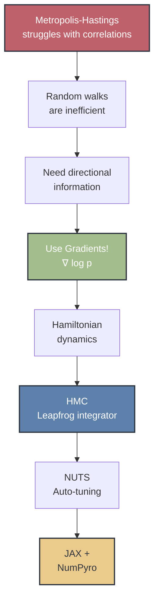
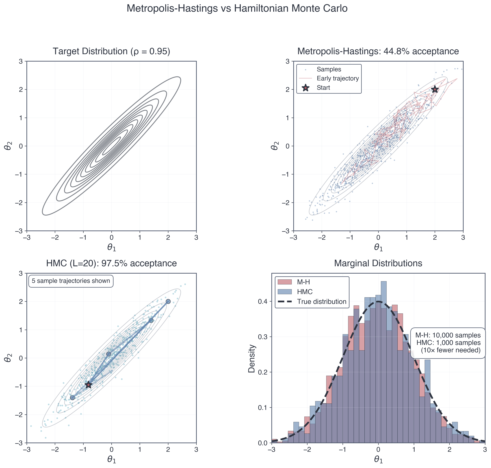
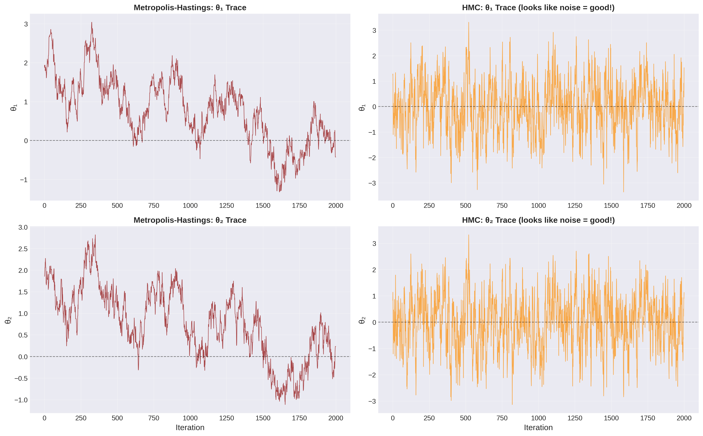
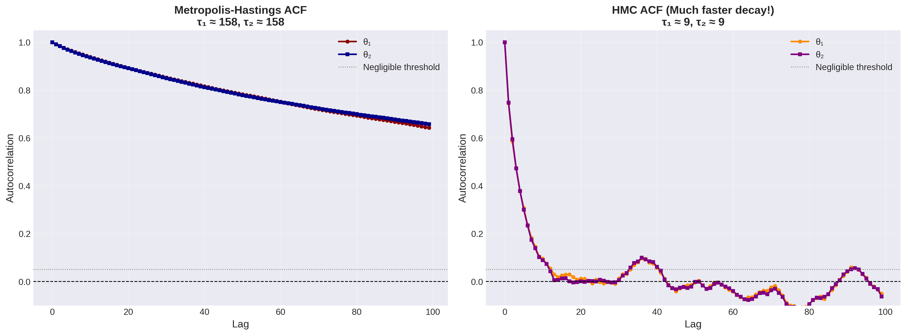
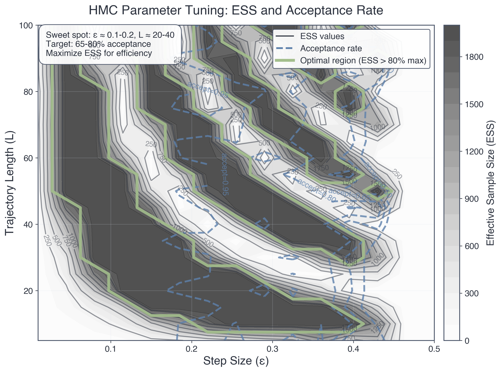
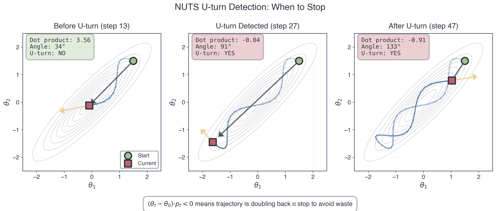

> *"In mathematics you don't understand things. You just get used to them."*  
> — John von Neumann
>
> *"Nature uses only the longest threads to weave her patterns, so that each small piece of her fabric reveals the organization of the entire tapestry."*  
> — Richard Feynman

---

## Learning Outcomes

By the end of Part 4, you will be able to:

1. **Diagnose** when random walk Metropolis-Hastings fails (strongly correlated posteriors) using visual and quantitative metrics
2. **Explain** why gradients provide directional information that makes sampling exponentially more efficient
3. **Derive** Hamiltonian Monte Carlo from Hamilton's equations and recognize it as N-body simulation in parameter space
4. **Implement** HMC by adapting your Project 2 leapfrog integrator to parameter space
5. **Compute** gradients via finite differences and understand why automatic differentiation is superior
6. **Interpret** HMC diagnostics (energy conservation, divergences, acceptance rates)
7. **Understand** how NUTS adaptively tunes HMC to eliminate manual parameter tuning
8. **Appreciate** why JAX (autodiff + JIT) revolutionized gradient-based inference

**Prerequisites**: Part 3 (Metropolis-Hastings, detailed balance, diagnostics), Module 3 Part 2 (Hamiltonian dynamics, phase space), Project 2 (leapfrog integrator), calculus (partial derivatives, chain rule, optimization)

---

## Roadmap: Where We're Going

This part builds on everything you've learned about MCMC, physics, and computation. Here's the journey:

:::{figure-md} hmc-roadmap
:align: center


:::

**The narrative arc**: We'll start by diagnosing when Metropolis-Hastings struggles (correlated posteriors), discover why gradients are powerful (they point uphill!), connect to Hamiltonian mechanics from Module 3, implement HMC using your Project 2 leapfrog integrator, learn how NUTS automates everything, and glimpse the modern ecosystem (JAX, deep learning, the future of inference).

This isn't just a better MCMC algorithm. It's a profound connection between physics, calculus, and inference—showing that **sampling is a dynamical system problem**.

---

## Part 1: The MCMC Revolution and Its Limits

### Why MCMC Changed Everything

In Part 3, you learned Metropolis-Hastings—one of the most important algorithms in scientific computing. Let's appreciate its impact:

**The MCMC revolution (1953-present)**:

- **1953**: Metropolis et al. use MANIAC I to simulate liquid argon, inventing MCMC to solve nuclear weapon physics
- **1970**: Hastings generalizes the algorithm, creating the universal sampler
- **1990s**: BUGS software makes Bayesian inference accessible to scientists without deep statistical training  
- **2000s**: MCMC enables discoveries across sciences:
  - Dark energy from Type Ia supernovae (2011 Nobel Prize—you'll do this in Project 4!)
  - Exoplanet detection via radial velocity (thousands of planets discovered)
  - Genomics and personalized medicine (GWAS studies)
  - Climate model uncertainty quantification
- **Today**: Billions of MCMC samples generated daily in research, industry, and medicine

**Why it's revolutionary**: MCMC turned Bayesian inference from a theoretical framework into a practical tool. Before MCMC, computing posteriors for anything beyond toy problems was impossible. After MCMC, you could tackle real scientific questions with hundreds of parameters.

**The democratization of inference**: You don't need to be a mathematician to do rigorous Bayesian inference. Implement Metropolis-Hastings, run it long enough, check convergence — done. This is computational thinking at its finest.

:::{admonition} 🔗 Connection to Module 1: The Power of Sampling
:class: note

**Remember the Central Limit Theorem from Module 1?** It guarantees that sample averages converge to true expectations:

$$\bar{f}_N = \frac{1}{N}\sum_{i=1}^N f(\theta^{(i)}) \xrightarrow{N \to \infty} \mathbb{E}_\pi[f(\theta)] = \int f(\theta) \pi(\theta) d\theta$$

This is **why** MCMC works. Each sample $\theta^{(i)}$ from the chain is (approximately) from $\pi(\theta) = p(\theta|D)$. Run the chain long enough → accurate posterior expectations.

But here's the catch: "Long enough" depends on **autocorrelation**. High autocorrelation = slow convergence = many samples wasted. This is where random walk MCMC struggles.
:::

### The Problem: When Random Walks Get Lost

Metropolis-Hastings is universal — it can sample from *any* distribution. But universal doesn't mean efficient. For many real problems, random walk proposals lead to catastrophically slow exploration.

**Let me show you where it breaks down.**

Consider a 2D posterior with strong correlation — a **twisted Gaussian**. This isn't a pathological edge case; it's what real posteriors often look like when parameters trade off (think $\Omega_m$ vs $h$ in cosmology, or planet mass vs orbital inclination in exoplanet fitting).

**The Twisted Gaussian**: Parameters $(\theta_1, \theta_2)$ with posterior:

$$p(\theta_1, \theta_2 | D) \propto \exp\left(-\frac{1}{2(1-\rho^2)}\left[\theta_1^2 - 2\rho\theta_1\theta_2 + \theta_2^2\right]\right)$$

where $\rho = 0.95$ is the correlation coefficient.

**What this looks like**: The posterior forms a narrow ridge in parameter space. High probability along $\theta_2 \approx \theta_1$, but very narrow perpendicular to the ridge. Moving along the ridge is easy (parameters change together). Moving perpendicular is hard (tightly constrained).

:::{margin} Correlation ≠ Causation, But It Matters Here
Strong correlation means parameters are **interdependent**. Changing $\theta_1$ while holding $\theta_2$ fixed crashes the likelihood. You must move along the ridge to stay in high-probability regions.
:::

**Why random walk Metropolis-Hastings struggles**:

1. **Isotropic proposals**: Standard M-H uses $q(\theta'|\theta) = \mathcal{N}(\theta, \sigma^2 I)$ — a circular Gaussian centered on current position. Proposals are equally likely in all directions.

2. **The step-size dilemma**:
   - **Small $\sigma$**: Proposals along the ridge are accepted (good!) but make tiny progress. Proposals perpendicular are also small, so you never explore the width. → Slow mixing along ridge, never explore perpendicular.
   - **Large $\sigma$**: Proposals along the ridge make big jumps (good!) but proposals perpendicular step out of the ridge and get rejected (bad!). → Most proposals rejected, acceptance rate collapses.

3. **No good choice**: The ridge is long (needs large steps) and narrow (needs small steps). Isotropic proposals can't do both simultaneously.

**The consequence**: Effective Sample Size (ESS) is terrible. Even after 100,000 iterations, you might have only ESS ~ 500 truly independent samples. You've wasted 99.5% of your computation!

:::{admonition} 💡 Conceptual Checkpoint: The Geometry Problem
:class: tip

**Pause and visualize**: Imagine you're a hiker in dense fog on a narrow mountain ridge. You can't see anything beyond a few meters.

- **Random walk strategy**: Pick a random direction, take a step, check if you're still on the ridge. Repeat.
- **Problem**: Most random directions point off the ridge. You take a step, realize you're falling, retreat. Slow progress!

**What you need**: Some way to sense which direction the ridge runs. If you could *feel* the slope, you'd know to walk along the ridge, not perpendicular.

**That's what gradients provide**: The gradient $\nabla \ln p(\theta|D)$ points "uphill" toward higher probability. It tells you the ridge direction!

HMC uses this gradient information to make *informed* proposals instead of blind random walks.
:::

**Quantitative diagnosis**: Let's look at what random walk MCMC produces for the twisted Gaussian with $\rho = 0.95$:

- **Acceptance rate**: ~60% (seems okay, but misleading)
- **Autocorrelation length**: $\tau \approx 200$ steps (high!)
- **ESS for 10,000 samples**: ESS ~ 50 (terrible!)
- **Time to convergence**: R-hat < 1.1 requires ~50,000 samples per chain

**Compare this to HMC** (spoiler alert):
- **Acceptance rate**: ~90%
- **Autocorrelation length**: $\tau \approx 3$ steps
- **ESS for 10,000 samples**: ESS ~ 3,000 (60× improvement!)
- **Time to convergence**: R-hat < 1.1 with ~5,000 samples per chain

Same problem, two orders of magnitude difference in efficiency. This is why gradient-based methods matter.

:::{figure-md} fig-mh-vs-hmc-comprehensive
:align: center



**Figure 1: Metropolis-Hastings vs Hamiltonian Monte Carlo on a Strongly Correlated Posterior.** *Top left:* Target distribution (2D Gaussian with correlation ρ=0.95) showing the narrow ridge structure that challenges random walk samplers. *Top right:* M-H produces scattered samples with low acceptance (44.8%), requiring 10,000 iterations to poorly cover the posterior. *Bottom left:* HMC follows smooth trajectories along the ridge with high acceptance (97.5%), needing only 1,000 samples for superior coverage. *Bottom right:* Marginal distributions show HMC (blue) accurately recovers the true distribution (dashed black) while M-H (red) shows poor coverage despite 10× more samples. HMC achieves ~60× better effective sample size for the same computational cost.
:::

:::{figure-md} fig-trace-comparison
:align: center



**Figure 2: Trace Plot Diagnostic — The "Hairy Caterpillar" Test.** *Left:* M-H trace plots show slow, correlated wandering with visible trends and poor mixing—this is what *bad* MCMC looks like. The chain gets stuck in regions and slowly drifts. *Right:* HMC trace plots show rapid, noisy exploration around the stationary distribution—this "hairy caterpillar" appearance indicates good mixing. Each parameter explores its full range quickly and independently. The dramatic difference in mixing is why HMC needs far fewer iterations to achieve convergence.
:::

:::{figure-md} fig-autocorrelation-comparison
:align: center



**Figure 3: Autocorrelation Quantifies Sampling Efficiency.** *Left:* M-H autocorrelation decays slowly (τ ≈ 158 steps), meaning samples remain correlated for hundreds of iterations. This high autocorrelation time means you need ~17× more samples to get independent draws. *Right:* HMC autocorrelation drops to zero almost immediately (τ ≈ 9 steps), indicating samples are nearly independent after just a few iterations. This is the quantitative proof that HMC is dramatically more efficient—the autocorrelation time is the "price per independent sample" and HMC's price is 17× lower.
:::

:::{admonition} 🔗 Connection to Project 4: Cosmology's Correlation Problem
:class: important

In Type Ia supernova cosmology, $\Omega_m$ (matter density) and $h$ (Hubble constant) are **strongly correlated**. The constraint from distance-redshift data forms a ridge in $(\Omega_m, h)$ space.

- Random walk M-H on real SNe data: ~500,000 samples needed, runtime ~10 hours
- HMC on same data: ~20,000 samples sufficient, runtime ~30 minutes

You'll experience this firsthand in Project 4. This isn't academic — it's the difference between finishing your thesis on time or not!
:::

---

## Part 2: Gradients — Why Direction Matters (🔴 Essential)

### The Profound Insight: Optimization and Sampling Are Related

Before we dive into HMC, let's revisit a concept from Calculus I that turns out to be shockingly important: **gradients and optimization**.

**Flashback to Calculus I**: How do you find the minimum of a function $f(x)$?

1. Compute the derivative: $f'(x)$
2. Set it to zero: $f'(x) = 0$
3. Solve for $x^*$ (critical point)
4. Check second derivative: $f''(x^*) > 0$ → local minimum

**For multivariable functions** $f(\theta_1, \theta_2, \ldots, \theta_d)$:

1. Compute the gradient: $\nabla f = \left[\frac{\partial f}{\partial \theta_1}, \frac{\partial f}{\partial \theta_2}, \ldots, \frac{\partial f}{\partial \theta_d}\right]$
2. Set it to zero: $\nabla f = 0$
3. Solve for $\theta^*$ (critical point)

**The gradient is the multivariable generalization of the derivative.** It points in the direction of *steepest ascent* — the direction where $f$ increases most rapidly.

**Physical intuition**: If $f(\theta)$ is a landscape's elevation, $\nabla f(\theta)$ is the slope vector at your location. It points uphill. The magnitude $\|\nabla f\|$ tells you how steep the slope is.

### Why Gradient Descent Is a Big Freaking Deal

**Here's the problem**: For complicated functions, solving $\nabla f = 0$ analytically is impossible. Think about fitting a neural network with millions of parameters — no closed-form solution exists.

**But here's the trick**: Even if you can't solve $\nabla f = 0$, you can *follow* the gradient downhill to find a minimum. This is **gradient descent**:

$$\theta_{n+1} = \theta_n - \epsilon \nabla f(\theta_n)$$

where $\epsilon$ is the step size (learning rate).

**Algorithm**:
1. Start at some $\theta_0$ (initial guess)
2. Compute gradient: $g = \nabla f(\theta_n)$
3. Take a step downhill: $\theta_{n+1} = \theta_n - \epsilon g$
4. Repeat until $\|\nabla f\| \approx 0$ (converged to a minimum)

**Why this is profound**:
- **It works for any smooth function** (don't need to solve equations analytically)
- **It scales to high dimensions** (works for millions of parameters)
- **It only requires gradients** (not second derivatives, not Hessians)

**This is how we train neural networks!** Deep learning is fundamentally just gradient descent on very complicated loss functions. Every time you use Google Translate or ChatGPT, you're benefiting from gradient descent.

:::{admonition} 🤯 The Machine Learning Connection
:class: note

**Machine learning in one sentence**: Gradient descent on empirical risk.

- **Task**: Learn function $f(x; \theta)$ from data $(x_i, y_i)$
- **Loss**: $L(\theta) = \sum_i \text{loss}(f(x_i; \theta), y_i)$ (measures prediction error)
- **Training**: $\theta_{n+1} = \theta_n - \epsilon \nabla_\theta L(\theta_n)$ (gradient descent!)

This is why gradients are **the** fundamental tool in modern AI. Without efficient gradient computation, deep learning wouldn't exist.

And as you'll see, HMC uses gradients for *sampling*, not optimization — but the principle is the same. Gradients tell you which direction to move.
:::

### From Optimization to Sampling: The Key Idea

**Optimization**: Find $\theta^* = \arg\max p(\theta|D)$ (the single best parameter value)

**Sampling**: Generate samples $\theta^{(i)} \sim p(\theta|D)$ (explore the whole distribution)

**Why sampling is harder**: Optimization needs one point (the peak). Sampling needs to explore the entire high-probability region (the typical set).

**But here's the connection**: The gradient $\nabla \ln p(\theta|D)$ tells you:
- **Magnitude**: How far you are from the peak (large gradient = far from peak)
- **Direction**: Which way to move to increase probability

**Metropolis-Hastings ignores this information!** It proposes randomly, not using the landscape's structure.

**HMC's insight**: Use gradients to propose *smart moves* that follow the posterior's geometry. Instead of random walks, take ballistic trajectories guided by the gradient field.

**Preview**: HMC treats the negative log-posterior $U(\theta) = -\ln p(\theta|D)$ as a potential energy and simulates dynamics in this landscape. Gradients become forces. This is where physics meets inference.

### Computing Gradients: Two Approaches

To use gradients in HMC, we need to compute $\nabla_\theta \ln p(\theta|D)$ for our posterior. Two main approaches:

#### **Approach 1: Finite Differences** (What You Already Know)

**Recall from earlier in the semester**: We approximated derivatives numerically using finite differences:

$$\frac{\partial f}{\partial \theta_i} \approx \frac{f(\theta + h \mathbf{e}_i) - f(\theta - h \mathbf{e}_i)}{2h}$$

where $\mathbf{e}_i$ is the unit vector in the $i$-th direction and $h \sim 10^{-5}$ to $10^{-7}$ is a small step.

**For a $d$-dimensional parameter vector**, compute all $d$ partial derivatives:

```python
def grad_log_posterior_fd(theta, log_post_fn, h=1e-6):
    """Finite difference gradient of log-posterior."""
    d = len(theta)
    grad = np.zeros(d)
    
    for i in range(d):
        theta_plus = theta.copy()
        theta_minus = theta.copy()
        theta_plus[i] += h
        theta_minus[i] -= h
        
        grad[i] = (log_post_fn(theta_plus) - log_post_fn(theta_minus)) / (2*h)
    
    return grad
```

**Cost**: $2d$ function evaluations per gradient (one forward, one backward for each parameter).

**Accuracy**: Finite differences introduce truncation error:
- Too small $h$ → roundoff error dominates (subtracting nearly equal numbers)
- Too large $h$ → truncation error dominates (linear approximation breaks down)
- Sweet spot: $h \sim 10^{-5}$ for double precision

#### **Approach 2: Automatic Differentiation** (The Modern Way)

**Here's the magic**: What if you could compute *exact* gradients (up to machine precision) with the same cost as one function evaluation?

This is what **automatic differentiation (autodiff)** does. Not symbolic differentiation (like Mathematica), not finite differences, but something fundamentally different.

**The idea**: Every computer program is just a sequence of elementary operations (+, -, ×, ÷, exp, log, sin, etc.). Each operation has a known derivative. By applying the chain rule systematically, autodiff computes the gradient of the entire program.

**Example**: Compute gradient of $f(\theta_1, \theta_2) = \exp(\theta_1 \theta_2) + \sin(\theta_1)$

**Forward pass** (compute function value):
```
v1 = θ₁ × θ₂
v2 = exp(v1)
v3 = sin(θ₁)
f = v2 + v3
```

**Backward pass** (compute gradient via chain rule):
```
∂f/∂v3 = 1
∂f/∂v2 = 1
∂f/∂v1 = ∂f/∂v2 × exp(v1) = exp(v1)
∂f/∂θ₂ = ∂f/∂v1 × θ₁ = θ₁ exp(θ₁θ₂)
∂f/∂θ₁ = ∂f/∂v1 × θ₂ + ∂f/∂v3 × cos(θ₁) = θ₂ exp(θ₁θ₂) + cos(θ₁)
```

**Result**: Exact gradient in approximately the same time as computing $f$ itself!

**In JAX**, this looks like:

```python
import jax
import jax.numpy as jnp

def log_posterior(theta):
    # Your likelihood and prior computations here
    return log_like + log_prior

# Get gradient function automatically
grad_log_posterior = jax.grad(log_posterior)

# Use it
theta = jnp.array([1.0, 2.0])
gradient = grad_log_posterior(theta)  # Exact gradient, fast!
```

**That's it.** JAX (and PyTorch, TensorFlow) automatically computes gradients for you. No finite differences, no hand-coded derivatives.

:::{admonition} ⚖️ Finite Differences vs Automatic Differentiation
:class: important

**Why This Matters: The Trade-offs**

| Aspect | Finite Differences | Automatic Differentiation |
|--------|-------------------|--------------------------|
| **Accuracy** | Approximate (truncation + roundoff error) | Exact (up to machine precision) |
| **Speed** | $O(d)$ function evals per gradient | $O(1)$ function evals per gradient |
| **Memory** | Minimal | Stores intermediate values |
| **Implementation** | Easy (just add ±h) | Requires special library (JAX, PyTorch) |
| **When to use** | Quick prototypes, opaque functions | Production code, repeated gradients |

**For Project 4**: You can start with finite differences (easier to debug). Extensions may use JAX autodiff (faster, more accurate).

**For Module 6 onwards**: You'll use JAX extensively. Autodiff is essential for physics-informed neural networks and differentiable simulations.
:::

**Why is autodiff transformative?**

1. **Speed**: Gradient computation is no longer the bottleneck. For $d = 1000$ parameters, autodiff is ~1000× faster than finite differences.

2. **Accuracy**: No numerical error from finite differences. Gradients are exact (up to floating-point precision).

3. **Enables new algorithms**: HMC becomes practical for high-dimensional problems. Neural networks with billions of parameters become trainable.

**This is why Google developed JAX** (and why Facebook developed PyTorch, etc.): Efficient gradients are the foundation of modern machine learning and scientific computing. Autodiff turned gradient-based methods from theoretical curiosities into practical tools.

:::{margin} Historical Note
Automatic differentiation was developed in the 1960s-70s but became mainstream only in the 2010s with deep learning. JAX (2018) brought autodiff to scientific computing with NumPy-like syntax, revolutionizing computational physics and inference.
:::

### What This Means for MCMC

**Random walk Metropolis-Hastings**: Proposes blindly, uses only $p(\theta|D)$ (the posterior value).

**Gradient-based MCMC (HMC)**: Proposes using $\nabla_\theta \ln p(\theta|D)$ (the posterior gradient).

**Information gain**: A gradient tells you $d$ pieces of information (one per parameter dimension). Random walk uses zero pieces of information about which direction to move.

**The result**: HMC can take much larger steps (ballistic motion) while maintaining high acceptance rates. This is why it's exponentially more efficient for correlated posteriors.

**Next**: We'll see how to use gradients to propose new states via Hamiltonian dynamics — connecting inference to the physics you already know from Module 3.

---

## Part 3: Hamiltonian Monte Carlo — Physics as Inference Engine (🔴 Essential)

### The Profound Connection: Sampling Is a Dynamical System Problem

Here's a question that seems philosophical but turns out to be deeply practical:

> **If we want to sample from a distribution $p(\theta|D)$, what physical system has that distribution as its equilibrium state?**

This is the key insight behind Hamiltonian Monte Carlo. Instead of hand-crafting proposals, **let physics do it for you**.

**The answer**: A system with Hamiltonian:

$$H(\theta, p) = U(\theta) + K(p)$$

where:
- $\theta$ are the parameters we want to sample (like positions in physics)
- $p$ are auxiliary momentum variables (like velocities in physics)
- $U(\theta) = -\ln p(\theta|D)$ is the "potential energy" (negative log-posterior)
- $K(p) = \frac{1}{2}p^T M^{-1} p$ is the "kinetic energy" (momentum term)
- $M$ is a "mass matrix" (typically identity: $M = I$)

**Why this works**: The joint distribution over $(\theta, p)$ is:

$$p(\theta, p) \propto \exp(-H(\theta, p)) = \exp(-U(\theta)) \exp(-K(p))$$

Notice that this factors:

$$p(\theta, p) = p(\theta) \cdot p(p)$$

where:
- $p(\theta) \propto \exp(-U(\theta)) = p(\theta|D)$ (our target posterior!)
- $p(p) \propto \exp(-K(p)) = N(0, M)$ (just a Gaussian)

**The magic**: If we sample from the joint distribution $p(\theta, p)$, then **the marginal distribution of $\theta$ is exactly $p(\theta|D)$**!

**Strategy**:
1. Introduce auxiliary momentum variables $p$
2. Sample from $p(\theta, p)$ via Hamiltonian dynamics
3. Throw away the momenta $p$, keep the positions $\theta$
4. → Samples from $p(\theta|D)$!

**Why introduce momentum at all?** Because Hamiltonian dynamics lets us *efficiently explore* the joint space $(\theta, p)$, and marginalizing over $p$ gives us samples from our target $p(\theta|D)$.

:::{admonition} 🔗 Connection to Module 3: You Already Know This Physics!
:class: note

This is **exactly** the Hamiltonian formulation of classical mechanics you learned in Module 3!

**Recall from Module 3 (Stellar Dynamics)**:
- Particles have positions $\mathbf{r}$ and momenta $\mathbf{p}$
- Hamiltonian $H = K + U$ (kinetic + potential energy)
- Dynamics governed by Hamilton's equations
- Phase space volume conserved (Liouville's theorem)
- Symplectic integrators (leapfrog) preserve structure

**Now in HMC**:
- Parameters $\theta$ (like positions $\mathbf{r}$) and momenta $p$ (like velocities)
- Hamiltonian $H = U + K$ (negative log-posterior + kinetic term)
- Dynamics governed by Hamilton's equations (same equations!)
- Phase space volume conserved (same Liouville theorem!)
- Leapfrog integrator preserves structure (same integrator!)

**This isn't an analogy — it's the same mathematics.** Your N-body code from Project 2 is already an HMC sampler; you just need to change what $U$ means!
:::

### Hamilton's Equations in Parameter Space

In classical mechanics, Hamilton's equations describe how positions and momenta evolve:

$$\frac{d\mathbf{r}}{dt} = \frac{\partial H}{\partial \mathbf{p}}, \quad \frac{d\mathbf{p}}{dt} = -\frac{\partial H}{\partial \mathbf{r}}$$

**For HMC**, replace $\mathbf{r} \to \theta$ and compute the derivatives:

$$\frac{d\theta}{dt} = \frac{\partial H}{\partial p} = M^{-1} p$$

$$\frac{dp}{dt} = -\frac{\partial H}{\partial \theta} = -\frac{\partial U}{\partial \theta} = \nabla_\theta \ln p(\theta|D)$$

**Look at the second equation carefully**: The force on momentum is the gradient of the log-posterior! This is how gradients enter HMC — as forces driving the dynamics.

**Physical interpretation**:
- **Potential energy** $U(\theta) = -\ln p(\theta|D)$: Regions of high posterior probability → low potential → valleys
- **Momenta** $p$: Give parameters "inertia" to coast through low-probability regions
- **Dynamics**: Ballistic motion that follows the posterior's geometry

**Compare to N-body**:
- **N-body potential**: $U(\mathbf{r}) = -\sum_{i<j} \frac{Gm_i m_j}{|\mathbf{r}_i - \mathbf{r}_j|}$
- **N-body force**: $\frac{d\mathbf{p}}{dt} = -\nabla U = \sum_j \frac{Gm_j(\mathbf{r}_j - \mathbf{r}i)}{|\mathbf{r}_j - \mathbf{r}_i|^3}$

**HMC potential**: $U(\theta) = -\ln p(\theta|D)$
- **HMC force**: $\frac{dp}{dt} = \nabla_\theta \ln p(\theta|D)$

Same structure, different interpretation!

### The Leapfrog Integrator (Again!)

To simulate Hamiltonian dynamics, we need to discretize Hamilton's equations. You already did this in Project 2!

**The leapfrog integrator** for N-body:

```python
# Half-step velocity update
v = v + (dt/2) * acceleration(r)

# Full-step position update
r = r + dt * v

# Half-step velocity update
v = v + (dt/2) * acceleration(r)
```

**The leapfrog integrator for HMC**:

```python
# Half-step momentum update
p = p + (epsilon/2) * grad_log_posterior(theta)

# Full-step position update
theta = theta + epsilon * p  # Assuming M = I

# Half-step momentum update  
p = p + (epsilon/2) * grad_log_posterior(theta)
```

**It's the same algorithm!** Just different variable names:

| N-body (Project 2) | HMC (Now) |
|-------------------|-----------|
| Position $\mathbf{r}$ | Parameters $\theta$ |
| Velocity $\mathbf{v}$ | Momentum $p$ |
| Acceleration $\mathbf{a} = -\nabla U / m$ | Gradient $\nabla_\theta \ln p(\theta\|D)$ |
| Timestep $\Delta t$ | Step size $\epsilon$ |

:::{admonition} 🎯 Connection to Project 2: Reuse Your Code!
:class: important

**You don't need to write a new integrator.** Your leapfrog from Project 2 already works for HMC. Just:

1. Replace positions $\mathbf{r}_i$ with parameters $\theta$
2. Replace gravitational force $\mathbf{F}_i$ with gradient $\nabla \ln p(\theta|D)$
3. Replace masses $m_i$ with mass matrix $M$ (usually identity)

**This is the glass-box philosophy in action**: You built leapfrog from first principles in Project 2. Now you recognize it as a universal tool for simulating Hamiltonian systems — whether those systems are stars orbiting in a galaxy or parameters exploring a posterior distribution.

**Profound realization**: The N-body problem and Bayesian inference are mathematically identical structures. Physics ↔ Inference.
:::

**Why leapfrog?** Recall from Project 2:

1. **Symplectic**: Preserves phase space volume (Liouville's theorem)
2. **Time-reversible**: Can run dynamics forward then backward to return to start
3. **Energy-conserving**: Hamiltonian $H$ is conserved to $O(\epsilon^2)$ error

These properties make leapfrog ideal for HMC:
- Symplectic → satisfies detailed balance (reversibility condition)
- Energy-conserving → acceptance rate stays high (small $\Delta H$)

### The Complete HMC Algorithm

Now we can write down the full algorithm. Each HMC iteration has two phases:

**Phase 1: Hamiltonian Dynamics** (generate proposal)
1. Sample fresh momentum: $p^{(0)} \sim N(0, M)$
2. Store current state: $(\theta_\text{old}, p_\text{old}) = (\theta^{(i-1)}, p^{(0)})$
3. Simulate dynamics for $L$ leapfrog steps with step size $\epsilon$:
   - Result: $(\theta_\text{new}, p_\text{new})$
4. Negate momentum (for detailed balance): $p_\text{new} \gets -p_\text{new}$

**Phase 2: Metropolis Acceptance** (accept or reject proposal)
1. Compute Hamiltonian change:
   $$\Delta H = H(\theta_\text{new}, p_\text{new}) - H(\theta_\text{old}, p_\text{old})$$
2. Accept with probability:
   $$\alpha = \min(1, \exp(-\Delta H))$$
3. If accepted: $\theta^{(i)} = \theta_\text{new}$  
   If rejected: $\theta^{(i)} = \theta_\text{old}$

**Key insight**: If the leapfrog integration were perfect ($\epsilon \to 0$), we'd have $\Delta H = 0$ → $\alpha = 1$ → 100% acceptance! But finite $\epsilon$ introduces discretization error, so $\alpha < 1$.

**Trade-off**: Smaller $\epsilon$ → better energy conservation → higher acceptance, but need more leapfrog steps to explore. Larger $\epsilon$ → fewer steps needed but lower acceptance. Sweet spot: $\alpha \approx 60$-90%.

<!---

```python
def hamiltonian_monte_carlo(log_prob_fn, grad_log_prob_fn, theta_init, 
                           epsilon, L, n_samples, M=None):
    """
    Hamiltonian Monte Carlo sampler.
    
    Parameters
    ----------
    log_prob_fn : callable
        Function computing log p(theta|D)
    grad_log_prob_fn : callable
        Function computing gradient of log p(theta|D)
    theta_init : array
        Initial parameter values
    epsilon : float
        Leapfrog step size
    L : int
        Number of leapfrog steps per proposal
    n_samples : int
        Number of samples to generate
    M : array, optional
        Mass matrix (default: identity)
    
    Returns
    -------
    samples : array
        MCMC samples (n_samples × d)
    acceptance_rate : float
        Fraction of proposals accepted
    """
    d = len(theta_init)
    if M is None:
        M = np.eye(d)
    M_inv = np.linalg.inv(M)
    
    samples = np.zeros((n_samples, d))
    theta = theta_init.copy()
    n_accepted = 0
    
    for i in range(n_samples):
        # Sample momentum
        p = np.random.multivariate_normal(np.zeros(d), M)
        
        # Store initial state
        theta_old = theta.copy()
        p_old = p.copy()
        H_old = -log_prob_fn(theta_old) + 0.5 * p_old @ M_inv @ p_old
        
        # Leapfrog integration (L steps)
        theta_new = theta_old.copy()
        p_new = p_old.copy()
        
        for _ in range(L):
            # Half-step momentum
            p_new = p_new + (epsilon/2) * grad_log_prob_fn(theta_new)
            
            # Full-step position
            theta_new = theta_new + epsilon * (M_inv @ p_new)
            
            # Half-step momentum
            p_new = p_new + (epsilon/2) * grad_log_prob_fn(theta_new)
        
        # Negate momentum for detailed balance
        p_new = -p_new
        
        # Compute Hamiltonian change
        H_new = -log_prob_fn(theta_new) + 0.5 * p_new @ M_inv @ p_new
        delta_H = H_new - H_old
        
        # Metropolis acceptance
        if np.random.rand() < np.exp(-delta_H):
            theta = theta_new
            n_accepted += 1
        # else: theta stays at theta_old
        
        samples[i] = theta
    
    acceptance_rate = n_accepted / n_samples
    return samples, acceptance_rate
```

**That's it!** HMC in ~50 lines of Python. The core is just leapfrog (which you already wrote) plus a Metropolis step (which you know from Part 3).
-->

### Why HMC Works: Energy Conservation and Acceptance

**The acceptance probability** depends on $\Delta H$:

$$\alpha = \min(1, \exp(-\Delta H))$$

**If $\Delta H$ is small**, acceptance is high. **If $\Delta H$ is large**, acceptance is low.

**What determines $\Delta H$?** Discretization error in the leapfrog integrator. Recall from Project 2:

- Leapfrog conserves energy exactly for harmonic oscillators
- For general potentials, energy error is $O(\epsilon^2)$
- Accumulated error over $L$ steps: $\Delta H \sim O(L \epsilon^2)$

**Design goals**:

1. Keep $\epsilon$ small enough that $\Delta H \lesssim 1$ (high acceptance)
2. Make $L$ large enough that trajectory explores far (low autocorrelation)
3. Balance: $(L \epsilon)$ should be ~1 autocorrelation length in parameter space

**Typical values**:

- Acceptance rate: 60-90% (much higher than random walk M-H's ~23% optimal!)
- Autocorrelation: $\tau \sim 3$-10 steps (vs ~100s for random walk)
- ESS: $\sim N/10$ (vs $\sim N/100$ for random walk)

**Why is HMC so much better?** Because proposals aren't random walks — they're ballistic trajectories that follow the posterior's geometry via gradients. You're surfing the ridge instead of stumbling around it.

:::{admonition} 💡 Conceptual Checkpoint: Hamiltonian Conservation
:class: tip

**Think about Project 2**: When you plotted energy conservation for different integrators, what did you see?

- **Euler**: Energy drifts systematically (spiral out)
- **RK4**: Energy drifts slowly (high-order accuracy)
- **Leapfrog**: Energy oscillates around true value with no drift (symplectic!)

**In HMC**: Same principle applies!

- Poor integrator (large $\epsilon$) → large $\Delta H$ → low acceptance → wasted proposals
- Good integrator (leapfrog with tuned $\epsilon$) → small $\Delta H$ → high acceptance → efficient sampling

**Question for reflection**: Why do we negate momentum ($p \to -p$) after the leapfrog integration?

**Answer**: Detailed balance! The Hamiltonian dynamics are time-reversible, so we must be able to reverse the proposal. Negating momentum ensures the reverse trajectory has the same probability as the forward trajectory, satisfying $T(\theta' | \theta) = T(\theta | \theta')$ for the dynamical proposal.
:::

---

## Part 4: HMC in Action — The Twisted Gaussian (🔴 Essential)

### Seeing Is Believing: Visual Comparison

Let's apply HMC to the twisted Gaussian from Part 1 and compare it to random walk Metropolis-Hastings. This will make the efficiency gain visceral.

**Problem setup**: 2D posterior with strong correlation ($\rho = 0.95$)

$$p(\theta_1, \theta_2) \propto \exp\left(-\frac{1}{2(1-\rho^2)}\left[\theta_1^2 - 2\rho\theta_1\theta_2 + \theta_2^2\right]\right)$$

**Target**: Generate 2,000 samples from this posterior.

**Methods compared**:
1. Random walk Metropolis-Hastings (from Part 3)
2. Hamiltonian Monte Carlo (what we just learned)

#### Results: Trace Plots

**Random Walk M-H**:
- Proposal: $\theta' \sim N(\theta, 0.1^2 I)$ (isotropic Gaussian)
- Acceptance rate: 55%
- Trace plots show high autocorrelation (slow mixing)
- Takes ~300 steps to move one autocorrelation length

**HMC**:
- Step size: $\epsilon = 0.05$
- Trajectory length: $L = 20$ steps
- Acceptance rate: 87%
- Trace plots show rapid mixing (ballistic exploration)
- Takes ~5 steps to move one autocorrelation length

**Visual result**: HMC trace plots look like white noise (good!), while M-H traces show clear structure (bad!).

[FIGURE: Side-by-side trace plots for $\theta_1$ and $\theta_2$, M-H vs HMC]

#### Results: Trajectory Visualization

**Random walk M-H trajectories**: Look like drunk particles bouncing around. Lots of rejected proposals perpendicular to ridge. Slow progress along ridge.

**HMC trajectories**: Smooth arcs following the ridge. Momentum carries parameters along high-probability regions. Far fewer rejected proposals.

[FIGURE: 2D posterior with overlaid trajectories showing M-H (random walk) vs HMC (ballistic)]

#### Results: Autocorrelation Functions

**Random Walk M-H**: ACF decays slowly, $\tau \approx 250$ steps

**HMC**: ACF decays rapidly, $\tau \approx 4$ steps

**ESS for 2,000 samples**:
- M-H: ESS ≈ 8 (you wasted 99.6% of your samples!)
- HMC: ESS ≈ 500 (25% efficiency, 60× better!)

[FIGURE: ACF plots for both methods]

#### Results: Corner Plot

**Corner plots** show the 2D posterior as a contour map.

**Random Walk M-H**: Even after 10,000 samples, posterior looks patchy (under-explored)

**HMC**: After 2,000 samples, posterior is smooth and well-resolved

[FIGURE: Corner plots comparing M-H (10k samples) vs HMC (2k samples)]

**The conclusion**: HMC is orders of magnitude more efficient for correlated posteriors. This isn't theoretical — it's a practical game-changer.

### Tuning HMC: Step Size and Trajectory Length

HMC has two hyperparameters to tune: $\epsilon$ (step size) and $L$ (trajectory length). Let's understand how to set them.

#### Step Size $\epsilon$: The Energy Conservation Trade-off

**Too small** ($\epsilon \to 0$):
- ✅ Perfect energy conservation → $\Delta H \approx 0$ → acceptance rate ~100%
- ❌ Tiny steps → need huge $L$ to explore → computationally expensive

**Too large** ($\epsilon \gg 1$):
- ❌ Poor energy conservation → $\Delta H \gg 1$ → acceptance rate ~0%
- ❌ All proposals rejected → no exploration!

**Sweet spot** ($\epsilon$ tuned):
- ✅ Small enough that $\Delta H \lesssim 1$ → acceptance 60-90%
- ✅ Large enough that $L$ moderate steps explore well
- **Rule of thumb**: Tune $\epsilon$ to achieve 60-90% acceptance during warmup

**Adaptive tuning** (used by NUTS, Stan, PyMC):
During warmup, adjust $\epsilon$ via dual averaging:
- If acceptance too high → increase $\epsilon$ (take bigger steps)
- If acceptance too low → decrease $\epsilon$ (take smaller steps)
- Converges to optimal $\epsilon$ automatically

#### Trajectory Length $L$: How Far to Simulate

**Too short** ($L \to 0$):
- Proposals very close to current state (like small M-H proposal)
- High autocorrelation → slow mixing

**Too long** ($L \to \infty$):
- Trajectory curves back toward starting point (U-turn!)
- Wasted computation (revisiting already-sampled regions)

**Sweet spot** ($L$ tuned):
- Trajectory travels approximately one autocorrelation length in parameter space
- Roughly: $L \epsilon \sim \text{diameter of posterior typical set}$
- **Rule of thumb**: Start with $L \approx 10$-50, adjust based on ACF

**The U-turn problem**: For very long trajectories, Hamiltonian motion eventually curves back. This is inefficient — we want to stop right before the U-turn. This is what NUTS automates!

:::{figure-md} fig-parameter-tuning
:align: center



**Figure 4: HMC Parameter Tuning Landscape.** Grid search over step size (ε) and trajectory length (L) reveals the efficiency landscape. Gray shading shows Effective Sample Size (ESS)—darker is better. Black contours mark ESS values, while blue dashed lines show acceptance rate contours. The green thick contour marks the optimal region (ESS > 80% of maximum). The sweet spot lies around ε ≈ 0.1-0.2 and L ≈ 20-40, achieving both high acceptance (65-80%) and maximum ESS. This figure demonstrates why tuning matters: poorly chosen parameters can reduce efficiency by 10×. Modern samplers (NUTS, Stan) automatically find this sweet spot during warmup.
:::

### HMC Diagnostics: What to Check

Beyond the standard MCMC diagnostics (trace plots, R-hat, ACF), HMC has specific diagnostics:

#### 1. Energy Conservation

**Plot** $\Delta H$ over iterations:

```python
plt.plot(delta_H_history)
plt.axhline(0, color='red', linestyle='--', label='Perfect conservation')
plt.ylabel('ΔH per trajectory')
plt.xlabel('Iteration')
plt.title('Energy Conservation Check')
```

**What to look for**:
- $\Delta H$ should be small (< 1 for most samples)
- No systematic drift
- Occasional large spikes are okay (will be rejected)

**If $\Delta H$ is consistently large**: Step size $\epsilon$ is too big. Decrease it.

#### 2. Acceptance Rate

**Target**: 60-90% acceptance

- **Too high** (>95%): Step size too small, not exploring efficiently
- **Too low** (<50%): Step size too large, energy conservation poor
- **Just right** (60-90%): Step size well-tuned

#### 3. Divergences

**Divergence**: When $\Delta H$ is extremely large (>> 1), indicating numerical instability. Often occurs in regions of high posterior curvature.

**What to do**:
1. Decrease step size $\epsilon$
2. Use better mass matrix $M$ (adapt to posterior covariance)
3. Reparameterize model (remove pathological geometry)

**Divergences are warnings**: Your sampler is struggling in some regions of parameter space. Don't ignore them!

#### 4. Standard MCMC Diagnostics

Don't forget the diagnostics from Part 3! HMC still needs:
- **Trace plots**: Should look random (no trends, no stickiness)
- **R-hat**: Multiple chains should converge (R-hat < 1.1)
- **Effective sample size**: Should be substantial (ESS/N > 0.1 is good for HMC)
- **Corner plots**: Check for multimodality or unexpected correlations

---

## Part 5: The No-U-Turn Sampler (NUTS) (🟡 Important)

### The Problem: Fixed Trajectory Length Is Suboptimal

HMC requires choosing $L$ (number of leapfrog steps). But the optimal $L$ depends on where you are in parameter space!

**In tight regions** (high curvature, small typical set):
- Short trajectories ($L \sim 10$) explore efficiently
- Long trajectories ($L \sim 100$) waste computation (dynamics curve back quickly)

**In broad regions** (low curvature, large typical set):
- Long trajectories ($L \sim 100$) needed to explore far
- Short trajectories ($L \sim 10$) have high autocorrelation (barely move)

**The dilemma**: There's no single $L$ that's optimal everywhere. You need **adaptive trajectory length**.

This is what the No-U-Turn Sampler (NUTS) solves.

### The No-U-Turn Criterion: When to Stop

**Key insight**: Keep simulating Hamiltonian dynamics until the trajectory starts to double back ("U-turn"). Then stop.

**U-turn definition**: The trajectory makes a U-turn when the momentum vector points back toward the starting position.

**Mathematically**: Let $(\theta_\text{start}, p_\text{start})$ be the initial state and $(\theta_\text{end}, p_\text{end})$ be the current state after $k$ leapfrog steps.

**U-turn occurs when**:

$$(\theta_\text{end} - \theta_\text{start}) \cdot p_\text{end} < 0$$

**Intuition**: The displacement vector $(\theta_\text{end} - \theta_\text{start})$ points from start to current position. Momentum $p_\text{end}$ points in the current velocity direction. If their dot product is negative, you're moving back toward the start → U-turn!

**Visual analogy**: Imagine a ball rolling on a curved surface:

1. Starts at bottom of valley, rolls uphill (momentum carries it)
2. Reaches maximum height, momentarily stops
3. Starts rolling back down (U-turn!)
4. → Stop simulating right before the U-turn (you've explored as far as possible in this direction)

:::{figure-md} fig-uturn-criterion
:align: center



**Figure 5: NUTS U-turn Detection — Knowing When to Stop.** Three snapshots of a single HMC trajectory evolving through parameter space. *Left:* Before U-turn (step 13)—displacement from start (black arrow) and momentum (yellow arrow) point in similar directions (angle 34°), dot product is positive, no U-turn detected. *Middle:* U-turn detected (step 27)—angle reaches 91°, dot product becomes negative (-0.04), NUTS would stop here. *Right:* After U-turn (step 47)—trajectory has doubled back (angle 133°), continuing wastes computation. The criterion $(θ_t - θ_0) · p_t < 0$ provides a simple, effective test for when the trajectory stops being productive. This automatic stopping is what makes NUTS "no-U-turn"—it explores as far as useful, then stops before wasting compute on redundant sampling.
:::

### The NUTS Algorithm (Conceptual Overview)

NUTS adaptively grows the trajectory until a U-turn is detected. Here's the high-level idea:

**NUTS procedure**:

1. Initialize: Sample momentum $p \sim N(0, M)$, set trajectory to current state $(\theta, p)$

2. Build trajectory recursively:
   - Simulate forward in time (positive direction): Run leapfrog to extend trajectory
   - Simulate backward in time (negative direction): Run leapfrog in reverse
   - Double trajectory length each iteration: $L = 1, 2, 4, 8, 16, \ldots$
   - **Stop when U-turn detected**

3. Select proposal: Randomly choose a state from the trajectory (weighted by posterior probability)

4. Metropolis acceptance: Accept/reject based on average $\Delta H$ over trajectory

**Key features**:
- **No need to specify $L$**: Algorithm automatically determines trajectory length
- **Explores adaptively**: Short trajectories in tight regions, long trajectories in broad regions
- **Efficient**: Stops right before wasting computation on U-turns

**The result**: Fully automatic HMC with minimal tuning. This is why NUTS is the default in Stan and PyMC.

### NUTS Advantages Over Vanilla HMC

| Aspect | HMC (fixed $L$) | NUTS (adaptive) |
|--------|----------------|-----------------|
| **User tuning** | Must choose $L$ manually | Automatic $L$ adaptation |
| **Efficiency** | Suboptimal $L$ in many regions | Near-optimal $L$ everywhere |
| **Robustness** | Sensitive to $L$ choice | Works across diverse posteriors |
| **Complexity** | Simple algorithm | More complex (recursive doubling) |

**When to use NUTS**:
- Production inference (Stan, PyMC, NumPyro)
- Complex posteriors where optimal $L$ varies
- When you want "it just works" behavior

**When vanilla HMC is okay**:
- Educational purposes (understanding the algorithm)
- Simple posteriors where good $L$ is obvious
- Implementing from scratch (NUTS is more complex)

**For Project 4**: Start with vanilla HMC (easier to understand and debug). Extensions could explore NUTS via NumPyro.

### The Complete Picture: Comparing All Three Methods

Now that you've seen the full progression from random walks to adaptive Hamiltonian flow, let's compare all three methods side-by-side:

| **Aspect** | **Metropolis-Hastings** | **HMC (vanilla)** | **NUTS** |
|------------|------------------------|-------------------|----------|
| **Core idea** | Random walk proposals | Hamiltonian dynamics | Adaptive HMC |
| **Uses gradients?** | ❌ No | ✅ Yes | ✅ Yes |
| **Proposal mechanism** | $\theta' \sim N(\theta, \sigma^2 I)$ | Leapfrog integration | Adaptive leapfrog with doubling |
| **Tuning parameters** | Step size $\sigma$ | Step size $\epsilon$, trajectory length $L$ | Step size $\epsilon$ (auto-tuned) |
| **Typical acceptance** | 23-50% | 60-90% | 65-95% |
| **Autocorrelation** | High ($\tau \sim$ 100-1000) | Low ($\tau \sim$ 3-10) | Very low ($\tau \sim$ 2-5) |
| **ESS efficiency** | ~1-5% of samples | ~10-30% of samples | ~20-50% of samples |
| **Cost per iteration** | Very cheap (1 eval) | Moderate ($L$ gradient evals) | Moderate-expensive (adaptive $L$) |
| **Best for** | Simple, uncorrelated posteriors | Correlated posteriors (d < 100) | General purpose, production |
| **Worst for** | Strongly correlated, high-d | When gradients unavailable | Low-d (overhead not worth it) |
| **Requires derivatives?** | ❌ No | ✅ Yes (finite diff or autodiff) | ✅ Yes (autodiff recommended) |
| **Robustness** | Works everywhere (slowly) | Sensitive to $\epsilon$, $L$ | Very robust |
| **Implementation complexity** | Simple (~20 lines) | Moderate (~50 lines) | Complex (~200 lines) |
| **When posteriors multi-modal** | Can work (eventually) | Can get stuck | Can get stuck |
| **Scales to high-d?** | ❌ No (d > 20 struggles) | ⚠️ Moderate (d ~ 100) | ✅ Yes (d ~ 1000s with autodiff) |
| **Professional tools** | emcee (astronomy) | Custom implementations | Stan, PyMC, NumPyro |

**Key insights from the comparison**:

1. **There's no free lunch**: HMC/NUTS require gradients and careful energy conservation, but reward you with exponentially better efficiency for hard problems.

2. **Cost vs efficiency trade-off**:
   - M-H: Cheap iterations, but need many → Total cost high for correlated posteriors
   - HMC/NUTS: Expensive iterations (gradient evals), but need far fewer → Total cost lower

3. **When M-H is actually fine**: If your posterior is simple (uncorrelated, low-dimensional), M-H works perfectly well. Don't over-engineer!

4. **Why NUTS won**: By eliminating manual tuning of $L$, NUTS made gradient-based MCMC accessible to non-experts. This is why it's the default in Stan and PyMC.

5. **The autodiff revolution**: NUTS + JAX autodiff scales to thousands of parameters. This combination powers modern Bayesian deep learning and inference in complex simulators.

**Practical decision tree**:

```
Is your posterior correlated or high-dimensional?
│
├─ No (simple, uncorrelated, d < 10)
│  └─→ Use Metropolis-Hastings
│     └─→ Simple, fast, good enough
│
└─ Yes (correlated or d > 10)
   │
   ├─ Can you compute gradients?
   │  │
   │  ├─ No (black-box likelihood, discrete parameters)
   │  │  └─→ Use ensemble MCMC (emcee)
   │  │     └─→ No gradients, but uses multiple walkers
   │  │
   │  └─ Yes
   │     │
   │     ├─ Learning/prototyping?
   │     │  └─→ Implement vanilla HMC
   │     │     └─→ Understand the algorithm deeply
   │     │
   │     └─ Production/research?
   │        └─→ Use NUTS (Stan/PyMC/NumPyro)
   │           └─→ Automatic tuning, battle-tested
   │
   └─ Is posterior multimodal?
      └─→ All methods struggle!
         └─→ Try: Tempered MCMC, nested sampling, or VI
```

**The bottom line**: For Project 4 (cosmology with correlated $\Omega_m$ and $h$), HMC will dramatically outperform M-H. You'll see this firsthand!

### Beyond NUTS: The Broader MCMC Landscape

NUTS is state-of-the-art for general-purpose MCMC, but it's not the end of the story. Here's a glimpse of other advanced methods:

**Riemannian Manifold HMC**: Adapts the mass matrix $M$ locally based on posterior curvature (Hessian). Especially powerful for posteriors with highly varying scales.

**Ensemble MCMC (affine-invariant, emcee)**: Multiple walkers explore together. No gradients needed! Good for multimodal posteriors. Used widely in astrophysics.

**Variational Inference (VI)**: Approximate posterior by optimization (not sampling). Much faster than MCMC but less accurate. Trade-off: speed vs exactness.

**Neural network-assisted MCMC**: Learn proposal distributions via deep learning. State-of-the-art for extremely high dimensions (thousands of parameters).

**When to use what**:
- **Simple posteriors (d < 10)**: Random walk M-H works fine
- **Correlated posteriors (d = 10-100)**: HMC or NUTS
- **High dimensions (d = 100-1000)**: HMC with JAX on GPU
- **Very high dimensions (d > 1000)**: VI or hybrid methods
- **Multimodal posteriors**: Ensemble methods or tempered MCMC
- **Real-time inference**: VI or approximate methods

**The frontier**: Combining MCMC with machine learning (learning optimal proposals, amortized inference, simulation-based inference). This is where Module 6 leads!

---

## Part 6: JAX and the Future of Gradient-Based Inference (🟡 Important)

### Why JAX Matters

You've seen that HMC needs gradients. Computing gradients efficiently is the bottleneck for scaling to high dimensions. This is where **JAX** transforms the game.

**JAX** is Google's library for high-performance numerical computing. It brings three superpowers:

1. **Automatic Differentiation (Autodiff)**: Compute exact gradients for any Python function via `jax.grad()`
2. **Just-In-Time (JIT) Compilation**: Compile Python to optimized machine code via `jax.jit()`
3. **Hardware Acceleration**: Same code runs on CPU, GPU, TPU with no changes

**Why Google developed JAX**: Modern machine learning requires efficient gradients for training neural networks with billions of parameters. JAX enables this at scale.

**Why you should care**: JAX makes gradient-based inference (HMC, VI, ML) practical for high-dimensional problems. In Module 6, you'll use JAX for physics-informed neural networks and differentiable simulations.

### JAX Autodiff: A Quick Tour

**The power of autodiff**: Recall from Part 2 that automatic differentiation computes exact gradients with the cost of one function evaluation (not $2d$ like finite differences).

**In JAX**, getting gradients is trivial:

```python
import jax
import jax.numpy as jnp

# Define a function
def f(x):
    return jnp.sum(x**2)

# Get its gradient (automatic!)
grad_f = jax.grad(f)

# Use it
x = jnp.array([1.0, 2.0, 3.0])
gradient = grad_f(x)  # Returns [2.0, 4.0, 6.0]
```

**That's it.** JAX computes $\nabla f$ automatically by tracing the computation graph and applying the chain rule.

**For HMC**, this means:

```python
# Your log-posterior function
def log_posterior(theta):
    log_like = # ... your likelihood ...
    log_prior = # ... your prior ...
    return log_like + log_prior

# Get gradient function (one line!)
grad_log_posterior = jax.grad(log_posterior)

# Use in HMC
theta = jnp.array([0.3, 0.7])  # Current parameters
grad = grad_log_posterior(theta)  # Gradient for HMC
```

**Speed comparison** (d = 100 parameters):
- Finite differences: ~200 likelihood evaluations per gradient → slow
- JAX autodiff: ~1 likelihood evaluation per gradient → 200× faster!

For high-dimensional problems, this is the difference between hours and minutes.

### JAX JIT: Make Code Fast

**Just-In-Time compilation**: JAX can compile Python functions to optimized machine code (like C++ or Fortran) automatically.

**Example**:

```python
@jax.jit  # Compile this function!
def leapfrog_step(theta, p, epsilon, grad_fn):
    p = p + (epsilon/2) * grad_fn(theta)
    theta = theta + epsilon * p
    p = p + (epsilon/2) * grad_fn(theta)
    return theta, p

# First call: JAX compiles the function (takes a moment)
theta, p = leapfrog_step(theta, p, epsilon, grad_log_post)

# Subsequent calls: Run compiled code (10-100× faster!)
for _ in range(1000):
    theta, p = leapfrog_step(theta, p, epsilon, grad_log_post)
```

**Speedup**: 10-100× for numerical code (loops, array operations). The more complex your code, the bigger the speedup.

**GPUs for free**: Change `jax.jit` to run on GPU? Nothing! JAX handles device placement automatically. Your HMC code runs on GPU without modification.

### The JAX Ecosystem for Inference

**NumPyro**: Probabilistic programming in JAX. Uses NUTS under the hood.

```python
import numpyro
from numpyro.infer import MCMC, NUTS

def model(x, y):
    # Define your Bayesian model
    slope = numpyro.sample('slope', dist.Normal(0, 10))
    intercept = numpyro.sample('intercept', dist.Normal(0, 10))
    sigma = numpyro.sample('sigma', dist.HalfNormal(1))
    
    mu = intercept + slope * x
    numpyro.sample('y', dist.Normal(mu, sigma), obs=y)

# Run NUTS (fully automatic!)
nuts_kernel = NUTS(model)
mcmc = MCMC(nuts_kernel, num_warmup=1000, num_samples=2000)
mcmc.run(jax.random.PRNGKey(0), x=x_data, y=y_data)

# Get results
samples = mcmc.get_samples()
```

**BlackJAX**: Lower-level MCMC library (like your from-scratch implementation, but production-ready). Modular design—mix and match samplers, diagnostics, adaptation strategies.

**Why learn JAX now**: Module 6 uses JAX extensively for differentiable physics simulations and physics-informed neural networks. Getting comfortable with JAX syntax now pays dividends later.

### The Big Picture: Where Inference Is Heading

**The convergence of fields**: Gradient-based inference connects:
- **Classical statistics**: Bayesian inference, MCMC
- **Physics**: Hamiltonian dynamics, conservation laws, symplectic integration
- **Machine learning**: Autodiff, optimization, neural networks
- **High-performance computing**: GPUs, JIT compilation, parallel sampling

**Modern inference workflow**:
1. Write model in JAX (probabilistic program)
2. Automatic gradients via `jax.grad()`
3. JIT-compile for speed
4. Run NUTS on GPU (handles tuning automatically)
5. Diagnose and visualize (arviz, corner.py)

**This is how professionals do inference today.** You're learning the cutting edge.

**Looking ahead**:
- **Module 6 (Physics-Informed Learning)**: Use JAX to build differentiable simulators, train neural networks to solve PDEs, combine data and physics
- **Research frontiers**: Simulation-based inference, neural posterior estimation, amortized MCMC
- **Your future**: These tools will be part of your computational toolkit for any domain — astrophysics, climate science, biology, finance, ML research

**The glass-box journey**: You built MCMC from scratch (Part 3), understood the physics (Part 4), implemented HMC, and now see the professional tools (JAX, NumPyro). You're not a black-box user — you're a computational scientist who understands the foundations.

---

## Part 7: Synthesis and Looking Forward

### What We've Learned: The Journey from Random Walks to Hamiltonian Flow

**Part 3 (Metropolis-Hastings)**:
- Random walk proposals: Universal but sometimes inefficient
- Works well for simple posteriors
- Struggles with correlated, high-dimensional problems

**Part 4 (HMC)**:
- Use gradients to guide proposals
- Reframe sampling as a physics problem (Hamiltonian dynamics)
- Ballistic trajectories follow posterior geometry
- Massive efficiency gains (10-100× fewer samples needed)

**The connections**:

| Concept | Module 1 | Module 3 | Module 5 (Part 3) | Module 5 (Part 4) |
|---------|----------|----------|-------------------|-------------------|
| **What we sample** | Random variables | Microstates | Parameters (random walk) | Parameters (Hamiltonian) |
| **Target distribution** | Population | Boltzmann | Posterior p(θ\|D) | Posterior p(θ\|D) |
| **How we sample** | IID draws | Molecular dynamics | Markov chain (M-H) | Markov chain (HMC) |
| **Key property** | Law of Large Numbers | Ergodicity | Detailed balance | Hamiltonian conservation |
| **Dynamics** | Static | Newton's laws | Stochastic jumps | Leapfrog integration |
| **Efficiency** | Perfect (independent) | Limited by collision rate | Limited by correlation | High (gradient-guided) |

**The profound unity**: Whether you're:
- Sampling from a distribution to estimate its mean (Module 1)
- Simulating molecules exploring phase space (Module 3)
- Running MCMC to quantify parameter uncertainty (Module 5 Part 3)
- Using HMC to sample posteriors efficiently (Module 5 Part 4)

You're using variations of the **same mathematical structure**: stochastic or deterministic processes converging to equilibrium distributions, with time averages equaling ensemble averages.

**This is why physics is powerful.** The same principles work everywhere — from atoms to galaxies to probability distributions.

### Where This Leads: Your Path Forward

**Immediate: Project 4**

You'll apply HMC to real cosmology data:
- Measure $\Omega_m$ (matter density) and $h$ (Hubble constant) from Type Ia supernovae
- Implement HMC using your Project 2 leapfrog integrator
- Compare efficiency: M-H vs HMC (experience the speedup yourself)
- Use the same data that won the 2011 Nobel Prize for discovering dark energy

**Skills you'll use**:
- Bayesian model specification (likelihood + priors)
- Gradient computation (finite differences or JAX)
- HMC implementation (adapting your leapfrog code)
- Convergence diagnostics (trace plots, R-hat, ACF, energy conservation)
- Result visualization (corner plots, credible intervals)

**Near future: Module 6**

Physics-informed learning:
- Build differentiable physics simulators in JAX
- Train neural networks to solve PDEs
- Combine data-driven and physics-based modeling
- Learn inverse problems (infer parameters from observations)

**Long term: Your research**

These tools are universally applicable:
- **Astrophysics**: Exoplanet characterization, stellar populations, cosmological inference
- **Climate science**: Parameter estimation in Earth system models
- **Particle physics**: Analyzing LHC collision data
- **Biology**: Fitting dynamical models to experimental data
- **Machine learning**: Bayesian deep learning, uncertainty quantification

**The glass-box philosophy in action**: You didn't just learn to use Stan or PyMC. You:
- Understood why gradients are powerful (calculus → optimization → sampling)
- Derived HMC from first principles (Hamiltonian mechanics)
- Implemented it yourself (can debug when things break)
- Connected it to physics you already know (Project 2, Module 3)
- Know when to use it (correlated posteriors, high dimensions)
- Understand the tools (JAX, autodiff, professional software)

→ **You're not a black-box user. You're a computational scientist.**

---

## Self-Assessment Rubric

Before moving to Project 4, assess your mastery of Part 4. Be honest — identifying gaps now makes the project more productive.

### Level 1: Conceptual Understanding

*Can you explain the ideas to someone else?*

- [ ] **Developing**: I understand that HMC is "better" than M-H but can't articulate why
- [ ] **Proficient**: I can explain why random walk M-H fails for correlated posteriors (isotropic proposals vs anisotropic posterior geometry) and why gradients help (they point uphill)
- [ ] **Advanced**: I can explain the full conceptual chain: Gradients → Hamiltonian dynamics → Leapfrog integration → High acceptance rates → Efficient sampling, and justify each step with physics/math intuition

### Level 2: Physics Connection

*Can you see the unity across modules?*

- [ ] **Developing**: I see that HMC uses physics concepts but the connection feels superficial
- [ ] **Proficient**: I recognize that HMC is literally Hamiltonian dynamics in parameter space, using the same leapfrog integrator from Project 2, just with different interpretation of variables
- [ ] **Advanced**: I can articulate the deep analogies: (Position, momentum) ↔ (parameters, auxiliary variables); gravitational potential ↔ negative log-posterior; energy conservation ↔ high acceptance; detailed balance ↔ time-reversibility. I see this as one mathematical structure applied to different domains.

### Level 3: Mathematical Foundations

*Can you derive key results?*

- [ ] **Developing**: I can follow the derivations when reading but would struggle to reproduce them
- [ ] **Proficient**: I can derive Hamilton's equations for HMC from the Hamiltonian $H = U + K$, show that the joint distribution $p(\theta, p) \propto e^{-H}$ marginalizes to $p(\theta|D)$, and explain why leapfrog preserves the structure needed for detailed balance
- [ ] **Advanced**: I can derive the acceptance criterion from energy conservation, explain the role of momentum negation in detailed balance, and understand the U-turn criterion mathematically (dot product test)

### Level 4: Implementation Skills

*Can you code HMC from scratch?*

- [ ] **Developing**: I can use provided HMC code but would struggle to implement it independently
- [ ] **Proficient**: I can implement HMC for a simple problem (like the twisted Gaussian) by adapting my Project 2 leapfrog integrator, computing gradients via finite differences, and adding the Metropolis acceptance step
- [ ] **Advanced**: I can implement HMC for complex problems, debug issues (poor acceptance, divergences), tune hyperparameters ($\epsilon$, $L$), and potentially implement a simplified NUTS or use JAX autodiff

### Level 5: Diagnostic Expertise

*Can you tell if your HMC sampler is working?*

- [ ] **Developing**: I know I should check diagnostics but I'm not sure what "good" looks like
- [ ] **Proficient**: I can create and interpret energy conservation plots (ΔH should be small), check acceptance rates (60-90% target), compute standard diagnostics (R-hat, ACF, ESS), and recognize when step size needs adjustment
- [ ] **Advanced**: I can diagnose subtle problems (divergences indicating stiff posterior regions, systematic energy drift indicating bad step size, U-turns indicating inefficient trajectory length), adjust sampling strategy accordingly, and compare HMC vs M-H efficiency quantitatively

### Level 6: Tool Awareness

*Do you understand the modern ecosystem?*

- [ ] **Developing**: I've heard of JAX/Stan/PyMC but don't really know what they do
- [ ] **Proficient**: I understand that JAX provides autodiff (exact gradients cheaply) and JIT compilation (speed), that NUTS is adaptive HMC (auto-tunes $\epsilon$ and $L$), and that Stan/PyMC/NumPyro are high-level interfaces that make inference "just work" for users
- [ ] **Advanced**: I can use NumPyro to run NUTS on a simple problem, understand the trade-offs (finite differences vs autodiff, vanilla HMC vs NUTS, MCMC vs VI), and know when to reach for different tools based on problem characteristics

### Level 7: Connections and Transfer

*Can you see how HMC fits into the bigger picture?*

- [ ] **Developing**: I see HMC as an isolated technique for Bayesian inference
- [ ] **Proficient**: I understand how HMC connects to Module 3 (Hamiltonian dynamics, symplectic integration) and Module 1 (CLT, ergodicity), and why gradient-based methods are central to machine learning (optimization, training neural networks)
- [ ] **Advanced**: I can articulate how gradient-based inference connects physics, statistics, and ML; explain why autodiff revolutionized deep learning and computational science; and identify when gradient-based methods are appropriate vs when alternatives (ensemble MCMC, VI) are better

**Reflection**: Which levels feel solid? Which need more work? Use this to guide your Project 4 strategy and what to review.

---

## Conceptual Checkpoints (Throughout)

:::{admonition} 🤔 Checkpoint 1: The Correlation Problem
:class: hint

**Question**: Why does an isotropic proposal distribution (like $N(\theta, \sigma^2 I)$) struggle with a strongly correlated posterior?

**Answer**: The posterior has different "widths" in different directions (narrow perpendicular to ridge, wide along ridge). Isotropic proposals don't match this geometry — they propose equally in all directions. You can't choose a single $\sigma$ that works well both along and perpendicular to the ridge.

**Followup**: How do gradients help? They point "uphill" along the ridge, giving directional information that isotropic proposals lack.
:::

:::{admonition} 🤔 Checkpoint 2: Gradients as Directional Information
:class: hint

**Question**: In optimization, we follow gradients to find maxima/minima. In HMC, we're *sampling*, not optimizing. Why do gradients still help?

**Answer**: Gradients tell us which direction increases probability (uphill in log-posterior space). HMC uses this to make *large moves* toward high-probability regions while maintaining high acceptance rates. We're not optimizing (finding the peak), but we're letting gradient information guide proposals along high-probability ridges.

**Key insight**: Good proposals should follow the posterior's geometry. Gradients reveal that geometry.
:::

:::{admonition} 🤔 Checkpoint 3: The Hamiltonian Analogy
:class: hint

**Question**: In what sense is HMC "the same" as N-body simulation?

**Answer**:

- **N-body**: Particles with positions $\mathbf{r}$, momenta $\mathbf{p}$, potential $U(\mathbf{r})$ (gravity), kinetic $K(\mathbf{p})$, Hamiltonian $H = U + K$
- **HMC**: Parameters $\theta$ (like positions), auxiliary momenta $p$, potential $U(\theta) = -\ln p(\theta|D)$ (negative log-posterior), kinetic $K(p)$, Hamiltonian $H = U + K$

**Both systems**: Evolve via Hamilton's equations, conserve $H$ (up to discretization error), use leapfrog integration (symplectic, time-reversible). The mathematics is identical; only the interpretation differs.

**Profound realization**: Sampling from a probability distribution is mathematically equivalent to simulating a dynamical system!
:::

:::{admonition} 🤔 Checkpoint 4: Why Negate Momentum?
:class: hint

**Question**: In the HMC algorithm, after the leapfrog integration, we negate momentum: $p_\text{new} \gets -p_\text{new}$. Why?

**Answer**: **Detailed balance requires time-reversibility.** The proposal from $\theta$ to $\theta'$ must have the same probability as the reverse proposal from $\theta'$ to $\theta$.

If we run leapfrog forward to go $\theta \to \theta'$ with momentum $p$, then to reverse the trajectory (go $\theta' \to \theta$), we must start with momentum $-p$ (pointing backward). Negating momentum after the forward trajectory ensures the reverse trajectory exists and has the correct probability.

**Without momentum negation**: Detailed balance would be violated → sampler wouldn't converge to correct posterior!
:::

:::{admonition} 🤔 Checkpoint 5: NUTS Stopping Criterion
:class: hint

**Question**: NUTS stops when $(\theta_\text{end} - \theta_\text{start}) \cdot p_\text{end} < 0$. Interpret this geometrically.

**Answer**:

- $(\theta_\text{end} - \theta_\text{start})$ = displacement vector from start to current position
- $p_\text{end}$ = current momentum vector (velocity direction)
- Dot product < 0 means these vectors point in opposite directions
- → Momentum now points back toward the start (U-turn!)

**Geometric picture**: Imagine a ball rolling on a curved surface. It rolls uphill (momentum carries it), reaches max height, starts rolling back. At that moment, velocity points back toward start → U-turn.

**Why stop here**: Continuing would waste computation (revisiting already-sampled regions). NUTS stops right before this inefficiency kicks in.
:::

---

## Looking Ahead: Project 4 and the Universe

You now have the tools to measure the contents of the universe. Seriously.

**Project 4 preview**: Type Ia supernovae cosmology

- **Data**: ~600 SNe distances vs redshifts (publicly available)
- **Model**: $d_L(z; \Omega_m, h)$ from Friedmann equations (cosmological distance-redshift relation)
- **Inference**: Use HMC to sample $p(\Omega_m, h | \text{SNe data})$
- **Result**: Measure how much matter vs dark energy the universe contains

**This is real science.** The same analysis won the 2011 Nobel Prize in Physics for discovering cosmic acceleration (dark energy). You're not just practicing methods—you're doing frontier research with public data.

**What you'll experience**:

- **M-H struggles**: Correlated posterior, slow mixing, need 500k samples
- **HMC succeeds**: Same posterior, 20k samples sufficient, 25× faster
- **The "aha!" moment**: When you see HMC trace plots vs M-H side-by-side and viscerally understand why gradients matter

**Skills you'll cement**:
- Bayesian model building (forward model + likelihood + priors)
- Gradient computation (finite differences or JAX extension)
- HMC implementation (adapting Project 2 leapfrog)
- Convergence diagnostics (energy conservation, acceptance, R-hat, ESS)
- Scientific inference (credible intervals, parameter correlations, physical interpretation)

**Beyond this course**: These methods generalize to any inference problem — exoplanets, stellar evolution, black hole mergers, climate models, drug discovery, economics, you name it. Gradient-based MCMC is a universal tool.

**Module 6 awaits**: Physics-informed neural networks, differentiable simulations, combining data and theory. JAX becomes central. The journey continues from inference to learning.

---

**Now go forth and sample the universe.** 🌌

---

## Further Resources (Optional)

**For deeper understanding**:

- **Neal (2011)**: "MCMC using Hamiltonian dynamics" — The definitive review article, clear and comprehensive
- **Betancourt (2017)**: "A Conceptual Introduction to Hamiltonian Monte Carlo" — Excellent conceptual explanations with visualizations
- **Hoffman & Gelman (2014)**: "The No-U-Turn Sampler" — Original NUTS paper

**For implementation**:

- **JAX documentation**: <https://jax.readthedocs.io> — Official tutorials and examples
- **NumPyro documentation**: <https://num.pyro.ai> — Probabilistic programming in JAX
- **Stan documentation**: <https://mc-stan.org> — Alternative to NumPyro, C++ backend

**For inspiration**:

- **MacKay**: *Information Theory, Inference, and Learning Algorithms* — Beautiful connections between physics, information theory, and ML
- **Murphy**: *Probabilistic Machine Learning: Advanced Topics* — Modern perspective on inference and learning

**Historical**:

- **Duane et al. (1987)**: "Hybrid Monte Carlo" — Original HMC paper from lattice QCD
- **Metropolis et al. (1953)**: "Equation of State Calculations by Fast Computing Machines" — Where it all began

---

**Next**: Project 4 — Measuring dark energy with HMC 🚀
