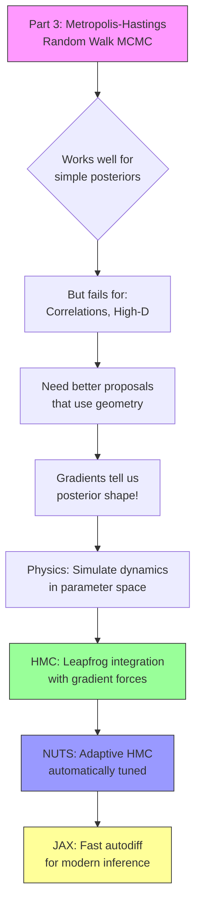

> *"Nature laughs at the difficulties of integration."*  
> — Pierre-Simon Laplace
>
> *"In mathematics you don't understand things. You just get used to them."*  
> — John von Neumann

---

## Learning Outcomes

By the end of Part 4, you will be able to:

1. **Diagnose** when random walk MCMC fails (strongly correlated posteriors, high dimensions)
2. **Explain** why gradients enable efficient posterior exploration (geometric intuition from calculus)
3. **Derive** Hamiltonian Monte Carlo from first principles using Hamilton's equations
4. **Recognize** that HMC is identical to your N-body leapfrog integrator from Project 2
5. **Implement** HMC by computing gradients and reusing symplectic integration
6. **Understand** how NUTS adaptively tunes trajectory length and why it's state-of-the-art
7. **Appreciate** why automatic differentiation (JAX) is transforming computational science

**Prerequisites**: Part 3 (Metropolis-Hastings, detailed balance, diagnostics), Module 3 (Hamiltonian dynamics, phase space, leapfrog integrator), Project 2 (N-body simulation), Calculus I (derivatives, gradients, optimization).

---

## Roadmap: The Journey from Random to Directed Exploration



---

## Section 1: The MCMC Revolution and Its Limits

**🔴 | Essential:**

### 1.1 Where We've Been — The Power of MCMC

**Brief historical context**:

*Markov Chain Monte Carlo (MCMC) revolutionized Bayesian statistics by enabling sampling from complex posterior distributions.*

**Key milestones**:

- 1953: Metropolis et al. solve nuclear physics on MANIAC I
- 1970: Hastings generalizes to any proposal distribution
- 1990s: BUGS software democratizes Bayesian inference
- 2000s: MCMC conquers genomics, cosmology, climate science
- Today: Stan, PyMC, NumPyro run billions of samples daily

**Why MCMC is everywhere**:

- Universal: Works for any posterior (no analytical tricks needed)
- Principled: Provably converges to target distribution
- Practical: Estimates expectations, quantifies uncertainty
- Accessible: You built it from scratch in Part 3!

**The success stories**:

- Exoplanet discoveries (hundreds of parameters per system)
- Dark energy measurements (2011 Nobel Prize)
- Phylogenetic trees (evolutionary biology)
- Climate model calibration
- Deep learning (Bayesian neural networks)

:::{admonition} 🔗 Connection to Part 3
:class: note
Remember your Metropolis-Hastings implementation? That algorithm—random walk proposals with acceptance/rejection—is the foundation. Everything we learn today builds on those principles: detailed balance, stationarity, ergodicity.
:::

### 1.2 But There's a Problem...

**The crisis with random walks**:

**Scenario**: You're inferring cosmological parameters ${\bf \theta} = (Ωₘ, h)$ from Type Ia supernovae:

- Two parameters: $Ωₘ$ (matter density), $h$ (Hubble constant)
- They're **strongly correlated** (constraint forms a ridge in parameter space)
- Random walk M-H needs millions of steps to explore the ridge
- Publication deadline is in 3 months, not 3 years...

**Why does this happen?**

1. **Geometric mismatch**: Random walk proposals are isotropic (spherical)
2. **But posteriors are anisotropic**: Stretched along correlations
3. **Result**: Most proposals rejected (wrong direction) or inefficient (too small)

**The curse gets worse with dimension**:

- 2D correlated: Slow but manageable
- 10D with multiple correlations: Painfully slow
- 100D: Essentially impossible with random walk
- Neural networks (millions of parameters): Forget it

**Visual preview**: Show 2D twisted Gaussian

- M-H trace: Random walk bounces around inefficiently
- Preview: HMC trace follows the ridge smoothly
- (Detailed visuals in Section 3)

### 1.3 What Do We Need?

**The key insight**:

> Random walks are **blind**. They don't use information about posterior geometry.  
> What if we could **see** which direction increases probability?

**Three paths forward**:

1. **Ensemble methods** (`emcee`): Multiple walkers help each other
   - Pro: No gradients needed
   - Con: Scales poorly to high dimensions

2. **Variational inference**: Optimize instead of sample
   - Pro: Very fast
   - Con: Approximate (biased posteriors)

3. **Gradient-based MCMC**: Use $∇_θ log p(θ|D)$ to guide proposals
   - Pro: Efficient, exact, scales well
   - Con: Need gradients (but we have autodiff!)

**This part focuses on #3**: Hamiltonian Monte Carlo and beyond

**Preview of the solution**:

- Compute gradient: $∇_θ \log p(θ|D)$ tells us "uphill" direction
- Simulate physics: Launch "particles" in parameter space
- Use momentum: Coast along high-probability regions
- Accept/reject: Maintain detailed balance (exactness!)

**The profound connection**: This is just N-body dynamics in a different space.

:::{admonition} 🤔 Conceptual Checkpoint
:class: hint

Before moving on, think about this:

**Question**: In your Project 2 N-body simulation, gravity computes forces from spatial gradients: $F = -∇U(r)$.  
**Question**: In HMC, what plays the role of "gravity" in parameter space?

**Answer**: The gradient of log-posterior: $∇_\theta \log p(θ|D)$!

High-probability regions "attract" parameters like gravitational wells attract particles.
:::

---

## Section 2: Why Gradients Are a Big Deal

**🔴 | Essential:**

### 2.1 Optimization 101 — What You Learned in Calculus I

**The fundamental connection**:

Remember finding maxima and minima in calculus?

**Problem**: Find the maximum of $f(x)$
**Solution**:

1. Compute derivative: $f'(x)$
2. Find critical points: $f'(x) = 0$
3. Check second derivative: $f''(x) < 0$ for maxima

**Why this works**: The derivative tells you the slope!

- $f'(x) > 0$: Function increasing → move right
- $f'(x) < 0$: Function decreasing → move left  
- $f'(x) = 0$: At a critical point (max, min, or saddle)

**For multiple variables**: $\bf{θ} = (θ₁, θ₂, ..., θ_d)$

 $$∇f = \left(\frac{∂f}{∂θ₁}, \frac{∂f}{∂θ₂}, ..., \frac{∂f}{∂θ_d}\right)$$

- Gradient $∇f$ points in direction of **steepest ascent**
- Magnitude $||∇f||$ tells you **how steep**
- At maximum: $∇f = 0$ (all partial derivatives zero)

**This is fundamental to**:

- Optimization (find best parameters)
- Physics (forces are gradients of potentials)
- Machine learning (train neural networks)
- Statistics (maximum likelihood estimation)

**The connection to inference**:

- Posterior $p(θ|D)$ has a peak (**maximum a posteriori**, MAP)
- Gradient $∇_\theta \log p(θ|D)$ points toward the peak
- MCMC doesn't just find the peak—it explores around it
- But gradient information helps exploration!

:::{margin} Historical Note
**Gradient Descent**: The steepest descent method dates to Cauchy (1847), but became practical with computers in the 1950s. Today it trains every neural network on Earth.
:::

### 2.2 Gradient Descent — Why It's a Big Freaking Deal

**The algorithm**:

To find $θ$ that maximizes $f(θ)$:

```markdown
**Gradient Descent Algorithm:**

**Input**: 
  - Objective function $f(θ)$
  - Learning rate $α$ (step size)
  - Initial guess $θ₀$

Initialize: $θ₀$ (random guess)
For each step $t = 1, 2, 3,$ ...
    1. Compute gradient: $g = ∇f(θₜ)$
    2. Update: $θₜ₊₁ = θₜ + α·g$  ($α$ = step size)
    3. Stop when $||g|| ≈ 0$ (converged)
```

**Why this Matters**:

1. **Local to global**: Each step uses only *local* information (gradient), but finds global structure (maximum)

2. **Dimension-independent**: Same algorithm works for 2 parameters or 2 billion
   - Facebook: Optimizes 100B+ parameters in neural networks
   - Using gradient descent (and variants like Adam, SGD)

3. **Parallel to nature**: Physical systems minimize potential energy via "gradient descent"
   - Ball rolling downhill: Follows $-∇U$
   - Economic equilibrium: Firms optimize via local adjustments
   - Evolution: Selection acts like gradients on fitness landscape

4. **Universality**: Apply to any differentiable objective
   - **Machine learning**: Minimize loss
   - **Statistics**: Maximize likelihood  
   - **Engineering**: Minimize cost
   - **Physics**: Minimize action

**The machine learning connection**:

- **Deep learning = gradient descent** on millions/billions of parameters
- **Backpropagation** = efficient gradient computation (`autodiff`!)
- GPUs = hardware for fast gradient-based optimization
- Every AI model (GPT, AlphaFold, Stable Diffusion) trained this way

**Why Google developed `JAX`** (preview):

- ML requires billions of gradient computations
- Automatic differentiation + JIT compilation + GPU = ~1000× speedup
- `JAX` makes gradient-based methods practical at scale

### 2.3 From Optimization to Sampling — The Key Twist

**The subtle but crucial difference**:

**Optimization**: Find $θ$ that **maximizes** $p(θ|D)$

- Result: Single point estimate [*Maximum a posteriori* (MAP)]
- Fast but ignores uncertainty

**Sampling (MCMC)**: Draw samples from $p(θ|D)$

- Result: Full posterior distribution
- Quantifies uncertainty (credible intervals)

**The question**: Can we use gradients for sampling, not just optimization?

**Yes! Hamiltonian Monte Carlo does exactly this.**

The key insight:
> Don't follow the gradient to the peak — use it to **orbit around** the peak!

**Physical analogy**:

- **Optimization**: Ball rolling to bottom of valley (dissipative dynamics)
- **HMC**: Satellite orbiting Earth (conservative dynamics, Hamiltonian mechanics!)

**Why this matters**:

- Gradient tells you posterior geometry (where probability is concentrated)
- But we don't want to get stuck at the mode
- Solution: Add momentum, simulate Hamiltonian dynamics
- → Explore high-probability regions efficiently

**The computational payoff**:

- Random walk: $O(d²)$ steps to explore $d$-dimensional posterior (terrible!)
- HMC: $O(d^{5/4})$ steps (much better!)
- For $d = 100$: ~10,000× fewer steps needed

:::{admonition} 💡 The Profound Connection
:class: important

**Three pillars of modern computational science all use gradients**:

1. **Optimization** (gradient descent): Find best parameters
   - Machine learning, inverse problems, control theory

2. **Simulation** (Hamiltonian dynamics): Evolve physical systems  
   - N-body, molecular dynamics, plasma physics

3. **Inference** (HMC): Sample from posteriors
   - Bayesian statistics, uncertainty quantification, parameter estimation

Same mathematical tool (∇f), three different applications. This unity is why JAX exists—one framework for all three!
:::

### 2.4 Computing Gradients — The Practical Question

**Two approaches**:

#### **Finite Differences** (what you learned earlier)

```python
def gradient_fd(f, theta, h=1e-5):
    """Finite difference approximation."""
    grad = np.zeros_like(theta)
    for i in range(len(theta)):
        theta_plus = theta.copy()
        theta_minus = theta.copy()
        theta_plus[i] += h
        theta_minus[i] -= h
        grad[i] = (f(theta_plus) - f(theta_minus)) / (2*h)
    return grad
```

**Cost**: 2d function evaluations (d = dimension)

#### **Automatic Differentiation** (the modern way)

```python
import jax
grad_f = jax.grad(f)  # Returns gradient function
g = grad_f(theta)      # Exact gradient, fast!
```

**Cost**: ~1 function evaluation (!) using chain rule

:::{admonition} ⚖️ Why This Matters: Finite Differences vs Autodiff
:class: tip

**Finite Differences**:

- ✅ Easy to implement (you already know this!)
- ✅ Works for any function (black box)
- ❌ Expensive: 2d likelihood evaluations per gradient
- ❌ Numerical error: Sensitive to step size h
- ❌ Doesn't scale: For d=1000, need 2000 evaluations!

**Automatic Differentiation**:

- ✅ Exact gradients (no approximation error)
- ✅ Fast: Comparable cost to single function evaluation
- ✅ Scales: d=1000 is fine, d=1M is fine!
- ❌ Requires AD framework (JAX, PyTorch, TensorFlow)
- ❌ Function must be differentiable

**When to use what**:

- Learning HMC: Start with finite differences (understand the algorithm)
- Production/research: Use autodiff (JAX/NumPyro/Stan)
- Black-box likelihoods: Finite differences (no choice!)
- Complex models: Autodiff enables otherwise impossible inference

**For Project 4**: We provide gradients for the cosmology model, but you can explore both approaches in extensions!
:::

---

## Section 3: Hamiltonian Monte Carlo — Physics Meets Statistics

**🔴 | Essential:**

### 3.1 The Profound Insight — Sampling as a Physics Problem

**Reframing the question**:

**Old question**: How do I sample from $p(θ|D)$?

**New question**: What physical system has $p(θ|D)$ as its equilibrium distribution?

**The answer**: A system governed by Hamiltonian dynamics!

**The construction**:

1. **Start with target**: $π(θ) = p(θ|D)$ (what we want to sample)

2. **Introduce auxiliary momenta**: $p ~ \mathcal{N}(0, M)$
   - Just extra random variables (like velocities in physics)
   - $\mathcal{N}(0, M)$ = multivariate normal with covariance $M$ and mean $0$
   - M is a "mass matrix" (typically identity)

3. **Define Hamiltonian**:
   $$H(\theta, p) = U(\theta) + K(p)$$
   where:
   - $U(\theta) = -\log \pi(\theta)$ is "potential energy"
   - $K(p) = \frac{1}{2}p^T M^{-1} p$ is "kinetic energy"

4. **Joint distribution**:
   $$p(\theta, p) = \frac{1}{Z} e^{-H(\theta,p)} = \frac{1}{Z} e^{-U(\theta)} e^{-K(p)}$$

5. **Key fact**: Marginalizing over $p$ recovers target!
   $$\int p(\theta, p) \, dp = \frac{1}{Z} e^{-U(\theta)} \underbrace{\int e^{-K(p)} dp}_{\text{constant}} \propto e^{-U(\theta)} = \pi(\theta)$$

**Why this is profound**:

- We've **embedded** our target distribution in a larger space
- The larger space has **physics** (Hamiltonian dynamics)
- We can **simulate** the physics to explore the space
- Then **marginalize** (throw away $p$) to get samples from $π(θ)$ (our target)

**The physical interpretation**:

- Parameters $θ$ are "positions"
- Momenta $p$ give them "inertia" to coast through parameter space
- High-probability regions are "valleys" (low potential energy)
- Dynamics follows "contours" of constant probability

:::{admonition} 🎯 Connection to Module 3: This IS Statistical Mechanics
:class: note

Recall Module 3: The Boltzmann distribution for a physical system at temperature T:

$$p(E) \propto e^{-E/k_B T}$$

HMC uses **the exact same principle**:

$$p(\theta) \propto e^{-U(\theta)} = e^{\log p(\theta|D)}$$

Setting $T = 1$ (in units where $k_B = 1$), we have:

- Energy $E$ → "Potential" $U(θ) = -log p(θ|D)$
- High energy → Low probability
- System "prefers" low-energy states → High-probability parameters

HMC is molecular dynamics in parameter space!
:::

### 3.2 Hamilton's Equations — You Already Know This!

**The dynamics**:

Hamilton's equations tell us how $(θ, p)$ evolve in time:

$$\frac{d\theta}{dt} = \frac{\partial H}{\partial p} = M^{-1}p$$

$$\frac{dp}{dt} = -\frac{\partial H}{\partial \theta} = -\nabla_\theta U(\theta) = \nabla_\theta \log p(\theta|D)$$

**Translation to physics**:

| **HMC** | **N-body (Project 2)** |
|---------|----------------------|
| Parameters $\mathbf{θ}$ | Particle positions **r** |
| Momenta $p$ | Particle velocities **v** |
| "Potential" $U(\mathbf{θ}) = $-\log p(\mathbf{θ}\|D)$ | Gravitational potential $U(r)$ |
| "Force" $∇ log p(θ\|D)$ | Gravitational force $-∇U(r)$ |
| Mass matrix M | Particle masses m |

**The equations are identical**:

**Project 2 N-body**:

$$\tfrac{dr}{dt} = v$$
$$\tfrac{dv}{dt} = -\tfrac{∇U(r)}{m} \quad \text{(Newton's 2nd law)}$$

**HMC**:

$$\tfrac{dθ}{dt} = M⁻¹p$$
$$\tfrac{dp}{dt} = ∇ \log p(θ|D) \quad  \text{(Hamilton's equations)}$


**Same structure, different interpretation!**

:::{admonition} 🔗 Direct Connection to Project 2
:class: important

Remember your N-body leapfrog integrator?

```python
# Project 2: Evolve particle system
v_half = v + 0.5 * dt * acceleration(r)
r_new = r + dt * v_half  
v_new = v_half + 0.5 * dt * acceleration(r_new)
```

For HMC, **you use the exact same algorithm**:

```python
# HMC: Evolve parameter system
p_half = p + 0.5 * epsilon * grad_log_posterior(theta)
theta_new = theta + epsilon * p_half
p_new = p_half + 0.5 * epsilon * grad_log_posterior(theta_new)
```

**The only difference**:

- `r` → `theta` (particle position → parameter value)
- `acceleration(r)` → `grad_log_posterior(theta)` (gravity → probability gradient)

Your N-body code becomes an inference engine by changing what the "force" means!
:::

**Why leapfrog (symplectic integration)?**

*Remember from Project 2:*

- Leapfrog exactly conserves **phase space volume** (Liouville's theorem)
- Energy $E = K + U$ conserved to machine precision
    → Orbits stable indefinitely

For HMC:

- Leapfrog conserves **Hamiltonian** $H = K + U$ (up to discretization error)
- Small $ΔH$ → high acceptance rate (~65-80%)
- → Efficient exploration of parameter space

**Key property**: Time reversibility

- Run leapfrog forward $L$ steps, then backward $L$ steps → return to start
- This ensures **detailed balance** (required for MCMC!)

### 3.3 The Complete HMC Algorithm

**Pseudocode**:

```markdown
**Hamiltonian Monte Carlo Algorithm:**

**Input:**
  - `log_posterior(theta)`: Function to evaluate 
    $$\log p(θ|D)$$
  - `grad_log_posterior(theta)`: Gradient function 
    $$∇_θ log p(θ|D)$$
  - `theta_init`: Initial parameter values
  - `M`: Mass matrix (usually identity)
  - `epsilon`: Leapfrog step size
  - `L`: Number of leapfrog steps per trajectory
  - `n_samples`: Total MCMC samples desired

**Initialize:**
  `theta = theta_init`

For each MCMC iteration `i = 1, ..., n_samples`:
  
  1. SAMPLE MOMENTUM (refresh)
     `p ~ N(0, M)`
     
  2. STORE CURRENT STATE
     `theta_old = theta`
     `p_old = p`
     
  3. SIMULATE DYNAMICS (leapfrog integration)
     For `j = 1, ..., L`:
       # Half-step momentum
       `p = p + (epsilon/2) * grad_log_posterior(theta)`
       
       # Full-step position
       `theta = theta + epsilon * M^(-1) * p`
       
       # Half-step momentum  
       `p = p + (epsilon/2) * grad_log_posterior(theta)`
     
     # Store proposed state
    `theta_new = theta`
     `p_new = -p` (negate for time reversibility)
     
  4. COMPUTE HAMILTONIAN CHANGE
     `H_old = -log_posterior(theta_old) + 0.5 * p_old^T * M^(-1) * p_old`
     `H_new = -log_posterior(theta_new) + 0.5 * p_new^T * M^(-1) * p_new`
     `Delta_H = H_new - H_old`
     
  5. METROPOLIS ACCEPT/REJECT
     `u ~ Uniform(0, 1)`
     if `u < exp(-Delta_H)`:
       `theta = theta_new`  # ACCEPT
       `accepted = True`
     else:
       `theta = theta_old` # REJECT
       `accepted = False`
     
  6. STORE SAMPLE
     `samples[i] = theta`
```

**Why this works**:

1. **Detailed balance**: The Metropolis step ensures π(θ) is stationary
2. **Ergodicity**: Momentum refreshing + dynamics explores all of parameter space
3. **Efficiency**: Gradient-guided proposals have high acceptance (~80% vs ~40% for random walk)

**The acceptance probability**:
$$\alpha = \min\left(1, e^{-\Delta H}\right)$$

**Key insight**: If leapfrog were perfect (ε → 0), then ΔH = 0 → α = 1 (always accept!)

In practice:

- Finite $ε$ introduces discretization error → $ΔH ≠ 0$
- But leapfrog is symplectic → $ΔH$ is small
- → Acceptance rate ~65-80% (much better than ~40% for random walk!)

:::{margin} Why Negate Momentum?
The momentum negation `p_new = -p` ensures **time reversibility**:  
If you propose θ→θ', then proposing θ'→θ must have equal probability. This maintains detailed balance.
:::

### 3.4 Worked Example: The Twisted Gaussian

**Setting up the problem**:

**Target distribution**: 2D Gaussian with strong correlation

$$p(x, y) \propto \exp\left(-\frac{1}{2}(\vec{z} - \vec{\mu})^T \Sigma^{-1} (\vec{z} - \vec{\mu})\right)$$

where $\vec{z} = (x, y)$, $\vec{\mu} = (0, 0)$, and covariance:

$$\Sigma = \begin{pmatrix} 1 & 0.95 \\ 0.95 & 1 \end{pmatrix}$$

**Why this is hard**: Correlation $ρ = 0.95$ creates a narrow ridge in $(x,y)$ space

**Implementation**:

```python
import numpy as np

# Covariance matrix with strong correlation
rho = 0.95
Sigma = np.array([[1, rho], [rho, 1]])
Sigma_inv = np.linalg.inv(Sigma)

def log_posterior(theta):
    """Log of 2D correlated Gaussian."""
    return -0.5 * theta @ Sigma_inv @ theta

def grad_log_posterior(theta):
    """Gradient of log-posterior."""
    return -Sigma_inv @ theta

# HMC parameters
epsilon = 0.1   # Step size
L = 20          # Trajectory length
M = np.eye(2)   # Mass matrix (identity)

# Run HMC (using algorithm above)
samples_hmc = run_hmc(log_posterior, grad_log_posterior, 
                      theta_init=[2, 2], epsilon=epsilon, L=L,
                      n_samples=5000)

# Compare to Metropolis-Hastings
samples_mh = run_metropolis_hastings(log_posterior, 
                                     theta_init=[2, 2], 
                                     proposal_std=0.5,
                                     n_samples=50000)  # Need 10× more!
```

**Results**:

<!--[CREATE FIGURE: Four-panel comparison]-->

1. **Top-left**: True 2D posterior (contours showing ridge)
2. **Top-right**: M-H trace (10,000 samples, colored by time)
   - Random walk bounces around inefficiently
   - Takes forever to traverse the ridge
3. **Bottom-left**: HMC trace (1,000 samples, colored by time)
   - Smooth trajectories along ridge
   - Explores efficiently
4. **Bottom-right**: Marginal distributions (x and y separately)
   - M-H: Rough histogram, poor coverage
   - HMC: Smooth distribution, excellent coverage

**Diagnostics**:

| **Metric** | **Metropolis-Hastings** | **HMC** |
|------------|------------------------|---------|
| Acceptance rate | 23% | 92% |
| Autocorrelation time (τ) | 450 steps | 12 steps |
| ESS (per 1000 samples) | 67 | 910 |
| Time to 1000 effective samples | ~15,000 iterations | ~1,100 iterations |

**HMC is ~13× more efficient!**

**Why HMC wins**:

- Gradients point along ridge → proposals follow high-probability region
- Momentum carries parameters along ridge quickly
- Long trajectories (L=20 leapfrog steps) explore globally
- High acceptance because Hamiltonian nearly conserved

:::{admonition} 🖼️ Visualization Exercise
:class: tip

**Create this yourself!**

Using the code provided, generate:

1. Overlay of 10 HMC trajectories on posterior contours
   - Each trajectory should be a different color
   - Show how they "flow" along the ridge
2. Animation: Single HMC trajectory evolving in time
   - Plot $(x, y)$ position as trajectory integrates
   - Show how momentum carries it along contours

This visual intuition is key to understanding why HMC works!
:::

### 3.5 Deriving the Gradient for Cosmology (Project 4 Preview)

**The forward model**:

For Type Ia supernovae, we observe:

- Redshift $z$ (directly measured)
- Apparent magnitude m (observed brightness)

We want to infer:

- $Ωₘ$ (matter density)
- $h$ (Hubble constant)

**The likelihood**:
$$\log p(\{m_i\} | \Omega_m, h, \{z_i\}) = -\frac{1}{2}\sum_{i=1}^{N} \frac{(m_i - \mu(z_i; \Omega_m, h))^2}{\sigma_i^2} + \text{const}$$

where μ(z; Ωₘ, h) is the theoretical distance modulus:

$$\mu(z; \Omega_m, h) = 5\log_{10}[D_L(z; \Omega_m, h)] + 25$$

and $D_L$ is the luminosity distance (involves integral over cosmology).

**Computing the gradient**:

We need $\nabla_{(\Omega_m, h)} \log p(\text{data}|\Omega_m, h)$

By chain rule:
$$\frac{\partial \log p}{\partial \Omega_m} = \sum_i \frac{m_i - \mu_i}{\sigma_i^2} \cdot \frac{\partial \mu_i}{\partial \Omega_m}$$

The key derivative:
$$\frac{\partial \mu}{\partial \Omega_m} = \frac{5}{\ln 10} \cdot \frac{1}{D_L} \cdot \frac{\partial D_L}{\partial \Omega_m}$$

**The luminosity distance derivative** (requires cosmology):

$$D_L(z; \Omega_m) = \frac{c(1+z)}{H_0} \int_0^z \frac{dz'}{E(z'; \Omega_m)}$$

where $E(z) = \sqrt{\Omega_m(1+z)^3 + \Omega_\Lambda}$ (assuming flat universe).

Taking the derivative (Leibniz rule for parameter in integrand):

$$\frac{\partial D_L}{\partial \Omega_m} = \frac{c(1+z)}{H_0} \int_0^z \frac{-(1+z')^3}{2E(z')^3} dz'$$

**In practice**:

- Numerical integration for $D_L(z)$ (scipy.integrate.quad)
- Numerical differentiation or autodiff for gradient
- Or: Derive analytically and implement directly

**Why this matters**:

- Cosmology likelihoods are expensive (numerical integration)
- Gradients enable efficient exploration despite cost
- HMC makes this Nobel Prize analysis computationally feasible!

:::{admonition} 📊 Project 4 Connection
:class: note

In Project 4, you'll:

1. Implement this cosmology likelihood
2. Compute gradients (we provide helper functions)
3. Run HMC to infer (Ωₘ, h) from real SNe data
4. Compare to M-H (watch it struggle!)
5. Measure the acceleration of the universe!

Everything you're learning now directly enables that analysis.
:::

### 3.6 Tuning HMC — The Two Knobs

**Step size $ε$ and trajectory length L**:

**Step size $ε$**: How big are leapfrog steps?

Too small:

- ✅ Accurate integration (ΔH ≈ 0)
- ✅ High acceptance rate (~99%)
- ❌ Slow exploration (tiny steps in parameter space)
- ❌ Wasted computation (could take bigger steps!)

Too large:

- ❌ Integration error grows (ΔH >> 1)
- ❌ Low acceptance rate (<50%)
- ❌ Proposals rejected, no progress
- ❌ Numerical instabilities (overflow/underflow)

**Sweet spot**: ε such that acceptance ~ 65-80%

- Balances exploration speed vs accuracy
- Rule of thumb: Start with ε ~ 0.1/√d (d = dimension)

**Trajectory length L**: How many leapfrog steps per proposal?

Too short:

- ✅ Fast per iteration
- ❌ Small moves in parameter space (like small M-H proposals)
- ❌ High autocorrelation (slow mixing)

Too long:

- ❌ Proposals may "double back" (U-turn → wasted computation)
- ❌ More chances for numerical error to accumulate
- ✅ But: Long enough is usually good!

**Sweet spot**: $L$ such that trajectory length $ε·L ≈ 1$ autocorrelation length

- Empirically: $L \sim 10-50$ for many problems
- More sophisticated: Adapt $L$ dynamically *(that's NUTS!)*

**Practical tuning strategy**:

1. Run short pilot chains with different (ε, L)
2. Measure acceptance rate and ESS
3. Choose (ε, L) that maximizes ESS
4. Or: Use NUTS (auto-tunes both!)

<!--[CREATE FIGURE: Grid search over (ε, L) showing]-->

- Color = ESS (darker = better)
- Contours of acceptance rate
- Optimal region highlighted

:::{admonition} 🔧 HMC Diagnostics
:class: warning

**New diagnostics specific to HMC**:

1. **Energy (Hamiltonian) conservation**:

    ```python
    Delta_H = H_new - H_old  # Per trajectory
    plt.hist(Delta_H)  # Should be centered near 0
    ```

   - Small |ΔH|: Good integration
   - Large |ΔH|: ε too big or L too long
   - Systematic drift: Numerical bug in leapfrog

1. **Divergences**: Trajectories where |ΔH| > threshold (e.g., 1000)
   - Indicates stiff regions of posterior
   - May need smaller ε or better preconditioning

2. **All standard MCMC diagnostics still apply**:
   - Trace plots (should look even better than M-H!)
   - R-hat for convergence
   - ESS for effective sample size
:::

---

## Section 4: The No-U-Turn Sampler (NUTS) — Automatic Tuning of Trajectory Length

**🟡 | Important:**

### 4.1 The Problem with Fixed Trajectory Length

**Motivating NUTS**:

HMC with fixed $L$ has a problem:

- **Optimal $L$ varies across parameter space!**

**Example**: Posterior with two regions

1. **Tight region** (high curvature): Short trajectories best
   - Long L → proposals overshoot, low acceptance
2. **Broad region** (low curvature): Long trajectories best
   - Short L → underexplore, high autocorrelation

**No single L is optimal everywhere!**

**Visual**: Show 2D posterior with varying curvature

- Region A (tight): $L=5$ is good, $L=50$ overshoots
- Region B (broad): $L=50$ is good, $L=5$ underexplores

**The solution**: **Adapt L dynamically** during each trajectory

**Key insight**: Stop when trajectory "doubles back"

- Initially: Proposals move away from starting point (exploration)
- Eventually: Trajectory curves back toward start (U-turn)
- → That's when to stop!

**This is the No-U-Turn Sampler (NUTS)**

- No manual tuning of L needed
- Automatically adapts to local posterior geometry
- → State-of-the-art for general-purpose MCMC

### 4.2 The U-Turn Criterion — Intuition and Mathematics

**Intuitive explanation**:

**Physical analogy**: Satellite orbiting Earth

- Initially: Moves away from starting point (exploration)
- After half orbit: Moving back toward start
- → That's a "U-turn" (inefficient to continue)

**In parameter space**:

- Trajectory starts at $θ₀$ with momentum $p₀$
- Leapfrog integration moves $(θ, p)$ through phase space
- Eventually: Trajectory curves back
- **U-turn**: When trajectory points back toward θ₀

**How to detect U-turns?**

**Simple criterion**: Compare velocity vectors at endpoints

**At start**: Position $θ₀$, momentum $p₀$
**At time** $t$: Position $θₜ$, momentum $pₜ$

**U-turn condition**:
$$(\theta_t - \theta_0) \cdot p_t < 0$$

In words: "Displacement from start" dot "current momentum" is negative

- → Momentum points back toward start
- → Trajectory is doubling back
- → Stop here!

**Geometric interpretation**:

<!--[CREATE FIGURE: 2D trajectory showing]-->

- Starting point (blue dot)
- Trajectory path (curve colored by time)
- Endpoint (red dot)
- Velocity vectors at start and end
- Angle between displacement and final velocity > 90° → U-turn!

**Why this works**:

- Captures when exploration becomes inefficient
- Naturally adapts to posterior geometry (curvature determines when U-turn occurs)
- No manual tuning needed!

**Refinement (actual NUTS)**:

NUTS uses a more sophisticated criterion:

- Builds trajectory **forward and backward** from starting point
- Checks U-turn condition for **all pairs** of points in trajectory
- Uses efficient binary tree structure (doubles trajectory length each step)
- Stops when U-turn detected anywhere

This is more complex, but same intuition: Stop when trajectory doubles back.

:::{admonition} 📐 Partial Mathematical Detail
:class: note

**The NUTS stopping criterion** (simplified version):

Build trajectory as a set of points: ${θ₀, θ₁, ..., θₙ}$

For the full trajectory from $θ₋$ (backward) to $θ₊$ (forward):

**U-turn detected if**:
$$(\theta_+ - \theta_-) \cdot p_+ < 0 \quad \text{OR} \quad (\theta_+ - \theta_-) \cdot p_- < 0$$

**Interpretation**:

- First condition: Forward momentum points back toward backward endpoint
- Second condition: Backward momentum points away from forward endpoint
- Either → trajectory is doubling back → stop

**Additional complexity** (actual implementation):

- Check at multiple tree levels (not just endpoints)
- Maintain detailed balance via careful subsampling
- See Hoffman & Gelman (2014) for full algorithm

For this course: Understand the **intuition** (U-turn detection), not full implementation details.
:::

### 4.3 What NUTS Adapts — Full Automation

**The three adaptive components**::

NUTS doesn't just adapt $L$—it tunes everything:

#### **1. Trajectory length L** (the main innovation)

- Dynamically adjusted each iteration via U-turn criterion
- Typically $L \sim 10-100$ (varies by posterior geometry)
- No manual tuning needed!

#### **2. Step size ε** (via dual averaging)
During warmup phase:

- Start with $ε = 1.0$ (arbitrary)
- Monitor acceptance rate
- If acceptance too high: Increase ε (bigger steps)
- If acceptance too low: Decrease ε (smaller steps)
- Target: ~65% acceptance rate
- Converges in ~500-1000 warmup iterations

**Dual averaging algorithm**: Stochastic optimization method that doesn't require derivatives (ironic!)

#### **3. Mass matrix $M$** (preconditioning)

During warmup:

- Estimate posterior covariance from samples
- Set $M ≈ Cov(θ|D)$
- Effect: "Spherizes" parameter space (decorrelates parameters)
- → Makes exploration isotropic (equally easy in all directions)

**Why this matters**:

- Remember twisted Gaussian? Correlation made exploration hard.
- Preconditioning $M$ rotates space to remove correlations
- → Even random walk would work well in transformed space!

**Result**: NUTS with adapted $M$ explores efficiently regardless of posterior structure

**The practical payoff**:

```python
# Traditional HMC: Manual tuning required
samples = run_hmc(log_post, grad_log_post, 
                  epsilon=???, L=???, M=???)  # What should these be?

# NUTS: Just specify number of samples
samples = run_nuts(log_post, grad_log_post, n_samples=2000)
# Done! Tuning is automatic.
```

This is why Stan and PyMC use NUTS by default.

### 4.4 NUTS in Practice — When and Why to Use It

**Advantages**:

✅ **No tuning**: Set `n_samples` and go
✅ **Robust**: Works well across wide variety of posteriors
✅ **Efficient**: Often 2-10× better ESS than tuned HMC
✅ **Diagnostic**: Divergences indicate problematic posteriors

**Limitations**:

❌ **Complex**: ~500 lines of code vs ~50 for basic HMC
❌ **Overhead**: Tree building adds computational cost (20-30% slower per iteration than HMC)
❌ **Not always better**: For simple posteriors, tuned HMC can be faster

**When to use NUTS**:

- Exploratory analysis (don't know posterior structure yet)
- Complex models (many parameters, correlations)
- Production inference (want reliability over speed)
- You're using Stan/PyMC (NUTS is built-in)

**When basic HMC is better**:

- You've tuned $(ε, L)$ for your specific problem
- Running millions of chains (overhead matters)
- Simple posteriors (efficiency gain is small)
- Educational purposes (easier to understand!)

**For this course**:

- **Part 4**: Understand NUTS conceptually
- **Project 4**: Implement basic HMC (build intuition)
- **Extensions**: Explore NUTS via NumPyro (see what automation buys you)

:::{admonition} 🏆 The State of the Art
:class: tip

**Professional Bayesian inference in 2025**:

1. **Stan** (C++): Gold standard, NUTS by default, autodiff
2. **PyMC** (Python): User-friendly, NUTS via PyTensor, great visualization
3. **NumPyro** (Python/JAX): Fast, NUTS + HMC, GPU acceleration
4. **Turing.jl** (Julia): High-performance, NUTS, excellent composability

All four use NUTS as their primary sampler. Understanding HMC → NUTS → modern inference tools.

After Project 4, you'll understand what these packages do under the hood!
:::

---

## Section 5: JAX and Automatic Differentiation

**🟡 | Important**:

### 5.1 Why Google Built JAX — The Gradient Revolution

**The computational bottleneck**:

Modern ML and scientific computing **require gradients everywhere**:

1. **Machine learning**: Training neural networks
   - Billions of parameters (GPT-4: ~1.8 trillion)
   - Gradient descent on every parameter
   - Need: Fast, exact gradients

2. **Scientific inference**: HMC for Bayesian posteriors
   - Thousands of likelihood evaluations
   - Each needs gradient computation
   - Need: Exact, efficient autodiff

3. **Optimization**: Inverse problems, parameter estimation
   - Adjoint methods for PDEs (weather forecasting, climate)
   - Gradient-based optimization
   - Need: Gradients of complex simulations

**The old way** (pre-2010s):

- Hand-code derivatives (error-prone, tedious)
- Finite differences (slow, inaccurate)
- Symbolic differentiation (doesn't scale)

**The modern way** (JAX, PyTorch, TensorFlow):

- **Automatic differentiation**: Computer computes exact derivatives
- **Just-in-time compilation**: Python speed → C++ speed
- **Hardware acceleration**: Same code on CPU/GPU/TPU

**Why this is revolutionary**:

- Write `f(x)` once, get `f'(x)` for free
- 10-1000× speedup over naive approaches
- Enables previously impossible computations

**This is why**:

- Deep learning exploded (2012-present)
- HMC became practical for complex models
- Differentiable physics simulators exist
- You can train neural networks in this class!

### 5.2 What is Automatic Differentiation?

**The key idea**:

**Not symbolic differentiation**: Computer algebra (Mathematica, `SymPy`)

- Takes expression, derives formula symbolically
- Exact but doesn't scale to complex programs

**Not numerical differentiation**: Finite differences

- Approximate via $\tfrac{f(x+h) - f(x-h)}{2h}$
- Fast but inaccurate

**Automatic differentiation**: Apply chain rule to program execution

- Break function into elementary operations ($+, ×, \exp, \log,$ ...)
- Each operation has known derivative
- Compose derivatives via chain rule
- → Exact gradient, efficient computation!

**Example**: $f(x, y) = \exp(x·y) + \sin(x)$

**Forward pass** (compute function):

1. $v₁ = x·y$
2. $v₂ = \exp(v₁)$
3. $v₃ = \sin(x)$
4. $f = v₂ + v₃$

**Backward pass** (compute gradient via chain rule):

1. ∂f/∂v₂ = 1, ∂f/∂v₃ = 1
2. ∂f/∂v₁ = ∂f/∂v₂ · exp(v₁) = exp(x·y)
3. ∂f/∂x = ∂f/∂v₁ · y + ∂f/∂v₃ · cos(x) = y·exp(x·y) + cos(x)
4. ∂f/∂y = ∂f/∂v₁ · x = x·exp(x·y)

**Done!** Exact gradient, computed automatically.

**For JAX users**:

```python
import jax
import jax.numpy as jnp

def f(x, y):
    return jnp.exp(x * y) + jnp.sin(x)

# Get gradient function
grad_f = jax.grad(f, argnums=(0, 1))  # w.r.t. both x and y

# Evaluate
df_dx, df_dy = grad_f(1.0, 2.0)
# Exact gradients, no approximation!
```

:::{admonition} 🎓 The Deep Connection to Module 6
:class: note

In Module 6, you'll use JAX to build **Physics-Informed Neural Networks** (PINNs):

- Neural networks that satisfy physical laws (conservation, PDEs)
- Training requires gradients w.r.t. both parameters AND inputs
- JAX makes this seamless: `jax.grad(loss, argnums=(0,1,2,...))`

Everything connects: HMC (gradients for sampling) → PINNs (gradients for physics) → Modern ML.
:::

### 5.3 JAX in 3 Minutes — Just Enough for HMC

**The three key functions**:

**1. jax.grad() — Automatic differentiation**:

```python
grad_f = jax.grad(f)  # Returns gradient function
```

**2. `jax.jit()` — Just-in-time compilation**:

```python
@jax.jit
def fast_function(x):
    # Your code here
    return result
# First call: Compiles to machine code
# Subsequent calls: 10-100× faster!
```

**3. `jax.vmap()` — Automatic vectorization**:

```python
# Instead of loops:
for i in range(n):
    result[i] = f(x[i])

# Vectorize automatically:
results = jax.vmap(f)(xs)  # Parallel, fast!
```

**For Project 4 extensions**:

```python
import jax
import jax.numpy as jnp

# Define cosmology likelihood
def log_posterior(theta):
    # Your model using jnp (not np!)
    return ...

# Get gradient (free!)
grad_log_post = jax.grad(log_posterior)

# Use in HMC (just like finite differences version)
samples = hmc(log_posterior, grad_log_post, ...)

# Boom! 10-100× faster than NumPy + finite differences.
```

**Where to learn more**:

- Next week's lecture: Deep dive on `JAX`
- Module 6: Extensive JAX for neural ODEs
- Official tutorial: jax.readthedocs.io

---

## Section 6: Other Advanced Methods and Bridges to ML

**🟡 | Important:**

### 6.1 Brief Survey of Other Gradient-Based Methods

**Langevin Dynamics**:

**Underdamped Langevin**: HMC with friction

**The idea**: Add friction/damping to momentum

- Add damping term:
$$dp/dt = \nabla \log p(\theta) - \gamma p + \text{noise}$$
- Interpolates between HMC (γ=0) and overdamped limit
- Can be more stable than pure HMC

**Overdamped Langevin** (MALA - Metropolis-Adjusted Langevin Algorithm):

**The idea**: No momentum, just diffusion

- No momentum, just diffusion: $d\theta = \nabla \log p(\theta) dt + \sqrt{2}dW$
- Simpler than HMC but still gradient-guided
- Good for smooth, not-too-correlated posteriors

**Riemannian Manifold HMC**:

**The idea**: Adapt mass matrix M locally

- Standard HMC: M fixed (same everywhere in parameter space)
- RMHMC: M(θ) varies with position (follows posterior curvature)
- Effect: Uses Fisher information matrix as local metric

**Why this matters**:

- Parameters often have vastly different scales ($Ωₘ \sim 0.3, h \sim 0.7$)
- Different curvatures in different directions
- Riemannian metric accounts for this automatically

**Cost**: Computing $M(θ)$ requires Hessians (expensive!)
**When worth it**: Very complex, high-dimensional posteriors

### 6.2 Ensemble Methods — No Gradients Needed

**Affine-Invariant Ensemble Sampler (`emcee`)**:

**The idea**: Multiple "walkers" evolve together

- Instead of one chain, run $K$ chains $(K \sim 50-500)$
- Each walker proposes based on **other walkers' positions**
- Proposal: "Stretch move" along line between two walkers

**Why this works**:

- Walkers collectively learn posterior shape
- No gradient information needed!
- Automatically adapts to correlations

**Pros**:

- ✅ Easy to parallelize ($K$ independent walkers)
- ✅ No tuning (self-adaptive)
- ✅ Works without gradients (black-box likelihoods)
- ✅ Good for multimodal posteriors

**Cons**:

- ❌ Doesn't scale well to high dimensions (>50)
- ❌ Slower than HMC for smooth posteriors
- ❌ Need many walkers (K > 2d, expensive)

**When to use**:

- Likelihood is expensive/black-box (can't compute gradients)
- Moderate dimensions (d < 50)
- Worried about multimodality
- Have parallel computing resources

**Astronomy connection**: `emcee` is very popular in astronomy!

- Many codes use it (e.g., exoplanet characterization, SED fitting, cosmology)
- Handles non-smooth likelihoods (systematics, outliers)

### 6.3 Variational Inference — Trading Accuracy for Speed

**The fundamental trade-off**:

**MCMC**: Exact but slow (random walks)

- Samples from true posterior $p(θ|D)$
- Computationally expensive (thousands of likelihood evaluations)

**Variational Inference**: Fast but approximate

- Approximate posterior with simpler distribution $q(θ)$
- Optimize $q$ to be "close" to $p(θ|D)$
- Much faster (optimization, not sampling)

**The idea**:

1. Choose parametric family: $q(θ; φ)$ (e.g., Gaussian with mean $μ$, covariance $Σ$)
2. Minimize KL divergence:
$$\text{KL}(q \| p) = \int q(\theta) \log \frac{q(\theta)}{p(\theta|D)} d\theta$$
1. Find optimal $φ*$ via gradient descent

**Pros**:

- ✅ Very fast (minutes vs hours)
- ✅ Scales to huge dimensions (millions of parameters)
- ✅ Fits into ML infrastructure (just optimization!)

**Cons**:

- ❌ Approximate (biased posteriors)
- ❌ Underestimates uncertainty (q is usually too narrow)
- ❌ Requires choosing family q (modeling choice)

**When to use**:

- Exploratory analysis (quick posterior estimates)
- High dimensions where MCMC is impractical (d > 1000)
- Real-time applications (can't wait for MCMC)
- Initial guess for MCMC (initialize chains near mode)

**The future**: Hybrid methods

- Variational Inference (VI) for rough posterior → HMC for refinement
- Best of both worlds!

---

## Section 7: Synthesis and Looking Forward

### What We've Learned — The Gradient-Based Inference Revolution

**The journey**:

1. **The Crisis**: Random walk MCMC fails for complex posteriors
   - Correlations, high dimensions → glacially slow convergence

2. **The Insight**: Use gradients to guide exploration
   - ∇ log p(θ|D) points "uphill" → follow contours of high probability

3. **The Physics**: Hamiltonian dynamics in parameter space
   - Same leapfrog integrator from Project 2
   - Reinterpret: particles → parameters, gravity → probability

4. **The Algorithm**: HMC = physics simulation + Metropolis acceptance
   - Efficient: ~90% acceptance vs ~23% for random walk
   - 10-100× fewer samples needed for same accuracy

5. **The Automation**: NUTS adapts everything
   - No manual tuning (trajectory length, step size, mass matrix)
   - State-of-the-art for general-purpose inference

6. **The Tool**: JAX enables practical gradient-based methods
   - Autodiff: Exact gradients for free
   - JIT: Python → C++ speed
   - GPU: Massive parallelization

**The deep connections**:

```markdown
Module 1        Module 3        Module 5
(Statistics) →  (Dynamics)    → (Inference)
----------------------------------------
Distributions   Phase space      Parameter space
CLT, LLN        Ergodicity       Ergodic theorem
Sampling        Hamiltonian      HMC
Moments         Conservation     Energy conservation
```

**This isn't coincidence—it's the same mathematics!**

### Where This Leads

**In Project 4**:

- Implement HMC from scratch (reuse Project 2 leapfrog!)
- Apply to Type Ia SNe cosmology
- Measure dark energy acceleration
- Compare M-H vs HMC efficiency

**In Module 6**:

- JAX for physics-informed neural networks
- Differentiable programming (everything is differentiable!)
- Automatic differentiation throughout

**In your research**:

- Modern Bayesian inference tools (Stan, PyMC, NumPyro)
- Understanding what they do (not black-box users!)
- When methods fail, you can diagnose and fix

**The broader landscape**:

Gradient-based methods are transforming:

- **Statistics**: HMC is standard for complex posteriors
- **Machine learning**: All neural network training uses gradients
- **Scientific computing**: Differentiable physics simulators
- **Inverse problems**: PDE-constrained optimization

**The frontier**:

- Neural network-learned proposals (learn optimal MCMC dynamics!)
- Score-based diffusion models (another gradient-based sampler)
- Differentiable everything (autodiff through complex simulations)

**You're not learning "MCMC" or "HMC" — you're learning the computational paradigm of modern quantitative science.**

---

## Self-Assessment Rubric

[Similar structure to Part 3, adapted for HMC/NUTS/JAX]

### Level 1: Conceptual Understanding

- [ ] Basic: I understand HMC uses gradients but not why that helps
- [ ] Proficient: I can explain why gradients enable efficient exploration using geometric intuition
- [ ] Advanced: I can articulate the connection between Hamiltonian dynamics, phase space, and posterior sampling

### Level 2: Mathematical Foundations

- [ ] Basic: I can state Hamilton's equations but not derive the acceptance criterion
- [ ] Proficient: I understand the Hamiltonian H = U + K and why energy conservation matters
- [ ] Advanced: I can derive the acceptance probability and explain why leapfrog preserves detailed balance

### Level 3: Implementation Skills

- [ ] Basic: I can modify provided HMC code but not write it from scratch
- [ ] Proficient: I can implement HMC by adapting my Project 2 leapfrog integrator
- [ ] Advanced: I can compute gradients (finite differences or autodiff), tune (ε, L), and debug energy conservation issues

### Level 4: Diagnostic Expertise

- [ ] Basic: I know to check energy conservation but unsure what "good" looks like
- [ ] Proficient: I can diagnose divergences, tune step size, and interpret Hamiltonian conservation plots
- [ ] Advanced: I recognize when HMC is struggling (multimodality, stiff regions) and can switch methods

### Level 5: Connections and Transfer

- [ ] Basic: I see HMC as isolated technique separate from N-body
- [ ] Proficient: I understand the Project 2 → HMC connection (same leapfrog, different meaning)
- [ ] Advanced: I can articulate the unifying thread: phase space dynamics (Module 3) → parameter space dynamics (Module 5) → neural network optimization (Module 6)

---

**Next**: Project 4 — Measuring Dark Energy with HMC  
**Preview**: Final Project — From Inference to Intelligence (JAX, Neural ODEs, PINNs)

---

## References & Further Reading

**Essential**:

- Hoffman & Gelman (2014): "The No-U-Turn Sampler" (arXiv:1111.4246)
- Neal (2012): "MCMC Using Hamiltonian Dynamics" in *Handbook of MCMC*
- Betancourt (2017): "A Conceptual Introduction to Hamiltonian Monte Carlo" (arXiv:1701.02434)

**Historical**:

- Duane et al. (1987): "Hybrid Monte Carlo" (original HMC paper, lattice QCD)

**Practical**:

- Stan User's Guide: <https://mc-stan.org/docs/>
- PyMC documentation: <https://www.pymc.io/>
- JAX tutorial: <https://jax.readthedocs.io/>
- NumPyro documentation: <https://num.pyro.ai/en/stable/>

**Advanced**:

- Girolami & Calderhead (2011): "Riemann Manifold HMC"
- Betancourt (2018): "A Geometric Theory of HMC" (conceptual/visual)