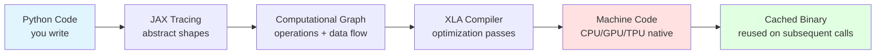
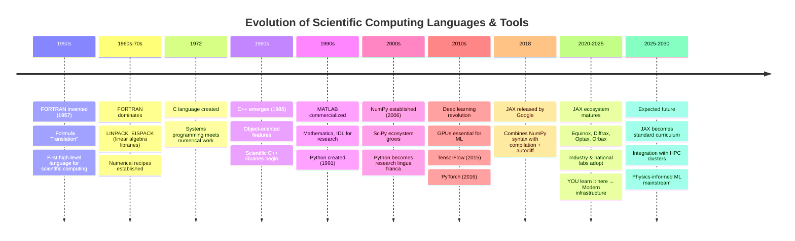

:::{epigraph}
"The most exciting phrase to hear in science, the one that heralds new discoveries, is not 'Eureka!' but 'That's funny...'"

-- Isaac Asimov
:::

## Learning Objectives

By the end of Part 1, you will be able to:

- [ ] **Identify** the computational bottlenecks in Project 4's finite difference gradients
- [ ] **Explain** why high-performance computing matters for scientific discovery
- [ ] **Articulate** the fundamental difference between forward-mode and reverse-mode automatic differentiation
- [ ] **Describe** how JAX's JIT compilation achieves substantial speedups (typically 30-150×) for numerical code
- [ ] **Recognize** the philosophical shift from procedural to functional programming
- [ ] **Connect** gradient-based optimization to the physical systems you've simulated
- [ ] **Anticipate** how these tools enable physics-informed machine learning

---

:::{admonition} 🗺️ Your Roadmap Through Part 1
:class: note

**Core Question**: What fundamentally changes when we can differentiate through *any* computation, automatically and efficiently?

This part establishes the conceptual and philosophical foundation for JAX. We'll explore:

**Section 1.1: The Pain Point**
Your Project 4 gradient computation and why finite differences don't scale.

**Section 1.2: Why Speed Matters for Science**
High-performance computing isn't luxury—it's how we do science. Real examples from your own projects.

**Section 1.3: Programming Languages in Scientific Computing**
Understanding why Python is slow and how JAX changes the game.

**Section 1.4: Automatic Differentiation**
The mathematical breakthrough that makes gradients cheap and exact.

**Section 1.5: The JAX Philosophy**
Composable transformations: `jit`, `grad`, `vmap`, `pmap`. A new way to think about computation.

**Section 1.6: JIT Compilation in Practice**
Seeing the speedup with your N-body simulator.

**Section 1.7: Synthesis**
From speed to capability—what new questions become possible.

**Section 1.8: Conceptual Checkpoint**
Making sure you've grasped the landscape before Part 2.

**Section 1.9: Why This Matters for Your Career**
The full picture of what learning JAX means for your future.

**The Big Picture**: Understanding WHAT changed computationally prepares you for HOW to use it (Part 2) and WHERE to apply it (Part 3 + Project 5).
:::

---

:::{admonition} 🚀 Try It Yourself: Interactive Notebook
:class: tip

Want to see these speedups firsthand before diving into the theory?

**[Interactive Demo Notebook](link-to-colab)** ← 5-minute hands-on experience

You'll:

1. Run naive `NumPy` N-body code (watch it be slow)
2. Convert to JAX with minimal changes
3. Add `@jit` (one line)
4. See the ~100× speedup

No setup required—runs in your browser. The notebook will be available on the course website.
:::

---

## Why Learn JAX Now? A 2-Minute Career Context

**Priority: 🔴 Essential**

### The Technology Landscape in 2025

JAX emerged from Google's research labs in 2018 to solve a fundamental problem: researchers needed to differentiate through *arbitrary* code—custom physics simulations, domain-specific algorithms, anything. We'll explore the full origin story in **Section 1.1**, but first understand why learning this now gives you a significant advantage.

**The Reality**: Most universities teach NumPy/SciPy (2000s tools) or TensorFlow/PyTorch (2015-2020 standards). Meanwhile, frontier research labs use JAX (2020s infrastructure):

- **DeepMind**: JAX-native for all new research projects
- **Anthropic**: Uses JAX extensively in research infrastructure
- **National Labs** (Argonne, Oak Ridge, Lawrence Livermore): Transitioning to JAX for HPC
- **Academic ML Groups**: Rapidly adopting JAX for physics-informed learning

**Your Advantage**: Learning JAX now means graduating with 5+ years of experience in tools that most researchers won't encounter until later in their careers.

**What Changes**: Instead of choosing between "fast code vs. easy code," you get both. Instead of spending months building infrastructure, you spend weeks doing research. Instead of treating simulation, inference, and learning as separate domains, you compose them seamlessly.

*We'll return to detailed career implications in **Section 1.9** after you understand what JAX actually does. First, the pain point that motivated it all...*

---

## 1.1: The Pain Point — Project 4 Revisited

**Priority: 🔴 Essential.**

Remember Project 4? You implemented Hamiltonian Monte Carlo to measure dark energy parameters from supernova data. For each step of HMC, you needed gradients of the log-posterior.

:::{margin}
**Finite differences**: Approximating a derivative by evaluating a function at nearby points. For example, $f'(x) \approx \frac{f(x+h) - f(x-h)}{2h}$ where $h$ is small.

**Why specifically 2d evaluations**: Central differences use both forward (+h) and backward (-h) steps, requiring **two function evaluations per parameter** to estimate each partial derivative.
:::

:::{margin}
**Gradient**: The vector of partial derivatives $\nabla f = (\frac{\partial f}{\partial x_1}, \frac{\partial f}{\partial x_2}, \ldots)$. Points in the direction of steepest ascent.
:::

Here's what you did:

```python
def grad_log_posterior(theta, h=1e-5):
    """Compute gradient using finite differences. Your Project 4 solution."""
    grad = np.zeros_like(theta)
    for i in range(len(theta)):
        theta_plus = theta.copy()
        theta_minus = theta.copy()
        theta_plus[i] += h
        theta_minus[i] -= h
        grad[i] = (log_posterior(theta_plus) - log_posterior(theta_minus)) / (2*h)
    return grad
```

This works. You got results. But let's count the cost:

**For $d = 2$ parameters** (supernova cosmology: $\Omega_m$, $h$):

- Each gradient requires **2d = 4 likelihood evaluations**
- 1000 HMC steps × 50 leapfrog steps × 4 evals = **200,000 model evaluations**

:::{admonition} 🔗 Connection to Module 1: Measurement & Models
:class: note

Remember Module 1's insight: **every measurement requires a model**. Finite differences use a model (Taylor expansion) to approximate the gradient:

$$f'(x) \approx \frac{f(x+h) - f(x-h)}{2h} + O(h^2)$$

This approximation has error $O(h^2)$—we're *estimating* the gradient statistically, with uncertainty that depends on our choice of step size $h$. Too small and roundoff error dominates ($\sim\epsilon/h$ where $\epsilon$ is machine precision); too large and truncation error dominates ($\sim h^2 f'''$).

JAX's autodiff gives you the **exact mathematical gradient** (to machine precision), eliminating this model error entirely. The gradient is computed, not estimated.

**The parallel to Module 5**: Just as Bayesian inference via MCMC gives us exact posterior sampling (given infinite time and perfect proposals), autodiff gives us exact gradients in finite time. Both eliminate approximations that would compound over iterations—crucial for 10,000-step HMC chains where even small gradient errors accumulate.
:::

:::{admonition} 🔮 Preview: By Project 5 (The Capability You'll Have)
:class: note

By Project 5, you'll JAX-ify your N-body code. But this isn't just about speed.

**What becomes possible:**

1. **Speed**: For d=2 parameters, finite differences require 4 forward passes; autodiff requires approximately 2× one forward pass (1 forward + 1 backward). Combined with JIT compilation to machine code: **typical speedup 30-150×** depending on problem structure and hardware.*

2. **New Capabilities**: After JAX, you can automatically:
   - Compute gradients *through* your entire physics simulator
   - Batch 1000 simulations simultaneously on GPU
   - Differentiate initial conditions with respect to final state (inverse problems)

3. **What This Enables**: By the Final Project, you'll combine this differentiable N-body simulator with neural networks to do inverse problems that require understanding both physics and learned patterns. **Research that was impractical before becomes doable.**

**Why This Matters**: These techniques are exactly what DeepMind uses for scientific discovery. Not simplified versions for students. The actual infrastructure.

*Actual speedups vary by problem structure, hardware, and implementation quality. These are representative benchmarks from typical implementations—see **Appendix A** for reproduction code.
:::

**For d = 10 parameters** (realistic for stellar fitting):

- Each gradient requires **20 likelihood evaluations**
- Same HMC run = **1,000,000+ model evaluations**

**For d = 100+ parameters** (galaxy dynamics, climate models):

- Finite differences becomes **completely impractical**

And there are deeper problems:

1. **Numerical error**: Choice of $h$ is finicky. You have to tune it for each problem, and optimal $h$ changes with parameter values.

2. **Inaccuracy**: Finite differences are approximate. The true gradient can differ from your estimate, leading to poor HMC proposals and slower mixing.

3. **Computational waste**: You're evaluating your likelihood function many times just to approximate one derivative. That's like learning a language by listening to random sentences instead of studying grammar.

4. **What you really want**: The *exact* gradient, computed efficiently.

### The Computational Crisis We Face

This isn't just about Project 4. Every computational scientist faces this crisis:

**When you implement a model, you compute two things**:

1. **Forward direction**: Parameters → Predictions  
   - Your physics model (forces, light transport, cosmological distances)
   - Usually straightforward to code (just apply physical laws)
   - One forward pass → one prediction

2. **Reverse direction**: Loss/Likelihood → Parameter updates  
   - You need gradients for: optimization, MCMC, neural networks, uncertainty quantification
   - Finite differences are slow and inaccurate
   - You need a better way

For decades, computational scientists had three options:

- **Option 1**: Compute gradients by hand (error-prone, time-consuming, tedious)
- **Option 2**: Use finite differences (slow, inaccurate, doesn't scale)
- **Option 3**: Don't use gradients (accept slow methods like random search or grid search)

None were satisfactory. **Then Google built JAX.**

:::{admonition} 🧠 Why Google Built JAX
:class: tip, dropdown

**The Problem (2015-2017):** Google built TPUs (custom AI chips for ML), but existing frameworks couldn't exploit them. TensorFlow required static graphs (not flexible Python), PyTorch didn't compile efficiently, and CUDA demanded low-level hardware expertise. Researchers wanted to write ordinary Python describing physics/ML and get automatic gradients + compilation without infrastructure complexity.

**The Innovation:** JAX's key insight was **complete separation of concerns**—write pure Python functions, then apply independent transformations (`grad` for differentiation, `jit` for compilation, `vmap` for batching, `pmap` for parallelization) that compose freely. This was novel: most frameworks entangle these capabilities, requiring framework-specific code. JAX decouples them completely.

**Why It Matters:** Google didn't build JAX for speed alone—they built it because **ambitious research questions required automatic differentiation through arbitrary custom code** (physics simulators, domain algorithms, anything). Performance enabled capability; capability was the goal.

**Current Reality:** Frontier research labs (DeepMind, Anthropic, Google Research, national labs) now use JAX as production infrastructure. You're learning tools that enable cutting-edge research, not pedagogical simplifications.
:::

**What You Just Learned** ✓

- Finite differences require $2d$ function evaluations per gradient (scales linearly with parameter count)
- For d=100+ parameters, finite differences become computationally prohibitive
- Numerical instability (choosing step size $h$) adds implementation complexity
- JAX's autodiff provides exact gradients with approximately **2× the cost of one forward pass** (constant vs. 2d for finite differences)
- The computational crisis isn't unique to your projects—it's universal across scientific computing

**Up Next**: Understanding why these speedups matter profoundly for what science we can actually do (**Section 1.2**), then exploring how JAX achieves them technically (**Sections 1.3-1.6**).

---

## 1.2: Why Speed Matters—The HPC Reality

**Priority: 🔴 Essential.**

You might think: "My Project 2 N-body simulation finished in a few seconds. My Project 4 HMC ran overnight. That's fine." 

But consider what happens when you want to do something more:

### The Cost of Computing: Your Projects as Cautionary Tales

:::{margin}
**High-Performance Computing (HPC)**: Computing that requires significant computational resources—GPUs, large memory, parallel processing, specialized algorithms to remain tractable.
:::

:::{margin}
**Computational bottleneck**: A part of computation that takes the most time and limits overall performance. In Projects 2 and 4, it's force calculation and gradient computation respectively.
:::

:::{margin}
**Time complexity**: How runtime scales with input size, expressed with Big-O notation. $O(n^2)$ means runtime grows quadratically with input size.
:::

**Project 2 — N-body Simulation (1000 particles, 1000 timesteps)**:

```python
# NumPy with naive nested loops
def compute_forces(positions, masses, n):
    forces = np.zeros_like(positions)
    for i in range(n):                    # Loop 1: every particle
        for j in range(n):                # Loop 2: every other particle
            r_vec = positions[j] - positions[i]
            r = np.linalg.norm(r_vec)
            forces[i] += G * masses[i] * masses[j] * r_vec / (r**3 + epsilon)
    return forces

# Time complexity: O(n²) per force evaluation
# For 1000 particles: ~1,000,000 distance calculations per timestep
# For 1000 timesteps: ~1 billion distance calculations total
# On a typical laptop: minutes to hours
```

You probably used optimizations (KD-trees, Barnes-Hut algorithm), but the fundamental issue remains: **computation dominates your runtime**.

Now imagine you want to:

- Run 100 simulations with different initial conditions (for statistical ensembles)
- Infer parameters (Metropolis sampling: 10,000 trials minimum)
- Train a neural network to emulate the simulator (needs 10,000+ training runs)

**1000 timesteps × 100 simulations × 10 experiments = 1,000,000 simulations** at minutes each = **years of computation**. Completely unacceptable.

**Project 4 — Computing Gradients by Finite Differences**:

```python
# For each HMC step, you compute ~2d likelihood evaluations
def hmc_step(theta, log_posterior_fn):
    # Finite difference gradients (Project 4)
    grad = np.zeros_like(theta)
    for i in range(len(theta)):
        # 2 more likelihood evaluations per parameter dimension
        grad[i] = (log_posterior_fn(theta + h*e_i) - log_posterior_fn(theta - h*e_i)) / (2*h)
    
    # Use gradient for leapfrog integrator
    theta = leapfrog_integrator(theta, grad, ...)
    return theta
```

For supernova cosmology ($d=2$): 4 likelihood evaluations per gradient step.  
For realistic stellar models ($d=20$): 40 evaluations per gradient step.

If each likelihood evaluation requires numerical integration or model fitting, this becomes the performance wall that prevents modern inference at scale.

### The Universal Pattern: Computation Scales Badly

Whether in your course projects or in frontier science, we hit the same pattern:

| Problem | Scale | Time | Status |
|---------|-------|------|--------|
| Single N-body sim | 1000 particles | seconds | ✅ Fine |
| N-body ensemble | 100 simulations | minutes | ⚠️ Acceptable |
| Parameter inference | 10,000 trials | hours | 🤔 Slow but doable |
| ML training | 100,000 samples | days | ❌ Impractical |
| Real science | millions of scenarios | years | 🚫 Impossible |

The scientific discovery bottleneck isn't physics knowledge—it's **computational infrastructure**.

:::{admonition} 🔮 This Is Why We're Teaching You JAX
:class: note

Your **Final Project** requires training neural networks to learn physics simulations. That means:

- Generate 10,000+ simulations efficiently ← JAX makes this tractable at scale
- Compute gradients through the neural network ← Autodiff
- Optimize on GPU ← JIT compilation
- Batch process efficiently ← vmap transformation

Without JAX, this project would be computationally prohibitive, requiring extensive infrastructure work and long wait times for each iteration. With JAX, it becomes a tractable research-grade investigation with fast iteration cycles.

This isn't hypothetical—this is exactly how DeepMind builds physics-informed neural networks for scientific applications. You're learning their actual workflow.
:::

### Why HPC Matters for Science

Here's a profound truth: **The questions we can ask are fundamentally limited by the speed of computation**.

Examples from frontier astronomy:

1. **Exoplanet discovery**: The Kepler mission's light curves require searching for periodic transit signals across millions of frequency combinations per star. Efficient optimization algorithms and GPU acceleration make systematic searches tractable.

2. **Gravitational waves**: LIGO detects merging black holes by running GPU-intensive matched filters on detector data in real-time (within seconds of detection). Without HPC, discoveries would miss the critical follow-up window for electromagnetic counterpart observations.

3. **Cosmological simulations**: Projects like Illustris and TNG simulate galaxy formation across cosmological volumes (billions of light-years). Modern computational methods (GPUs, parallel algorithms, adaptive mesh refinement) make it possible to learn how large-scale structure emerges from initial conditions.

4. **Dark matter searches**: Direct detection experiments analyze petabytes of data to find exceedingly rare interactions. GPU parallelization and efficient statistical algorithms separate potential signal from overwhelming background.

**This is why JAX exists**: Modern science has become fundamentally computationally limited. We need tools that:

- Make gradients cheap (automatic differentiation)
- Compile code efficiently (JIT compilation via XLA)
- Exploit parallel hardware automatically (GPUs/TPUs)
- Enable gradient-based everything (optimization, inference, learning)

:::{admonition} 💡 Key Insight
:class: important

**Computational speed isn't a luxury—it's an enabler of discovery.** If answering a question takes 100 years, no one asks it. If it takes 1 day, it becomes active research. If it takes 1 hour, it becomes routine analysis. Our computational tools determine what questions remain fundamentally unanswerable versus immediately tractable.
:::

**What You Just Learned** ✓

- Computational cost scales badly: what works for single cases fails catastrophically for ensembles, inference, or learning
- Real science requires millions of simulations/evaluations (exoplanets, gravitational waves, cosmological structure formation)
- The bottleneck isn't physics knowledge or mathematical sophistication—it's computational infrastructure
- Modern questions (inverse problems, learning from simulations, uncertainty quantification) require both speed AND automatic differentiation

**Up Next**: Understanding why Python has historically been slow (**Section 1.3**) sets up how JAX fundamentally changes the performance landscape through compilation.

---

## 1.3: Programming Languages in Scientific Computing

**Priority: 🟡 Important (Context).**

*You can skip this section if you're comfortable with "Python is slow, compiled languages are fast" as given knowledge. But understanding **why** Python is slow—and specifically what JAX fixes—will deepen your appreciation for the transformations that follow.*

Before diving into automatic differentiation, let's understand *why* JAX exists by examining how scientific computing evolved across programming languages.

### The Evolution: Languages Built for Speed

:::{margin}
**HPC (High-Performance Computing)**: Computing requiring sustained performance on large datasets, typically with specialized hardware (GPUs, TPUs, compute clusters).

**Compiled Language**: Program translated entirely to machine code before execution (C, C++, FORTRAN). Fast runtime but requires recompilation for any code changes.

**Interpreted Language**: Program executed line-by-line at runtime by an interpreter (Python, R, MATLAB). Flexible and interactive but inherently slower than compiled code.
:::

#### FORTRAN (1950s-present): The Scientific Standard

- **Strength**: Blazingly fast. Specifically optimized for numerical computation.
- **Reality**: Arrays, loops, linear algebra are first-class language citizens
- **Example**: LAPACK (linear algebra library) still written in FORTRAN for maximum performance
- **Weakness**: Inflexible syntax, limited modern ecosystem, steep learning curve, no automatic differentiation

#### C/C++ (1980s-present): The Workhorse

- **Strength**: Explicit control over memory and hardware, maximum achievable speed
- **Reality**: Every major GPU library (CUDA, ROCm) is designed for C/C++
- **Example**: PyTorch C++ backend, TensorFlow C++ core, NVIDIA CUDA kernels (C++)
- **Weakness**: Verbose, requires manual memory management, steep learning curve, easy to introduce bugs

#### Python (2000s-present): The Compromise

- **Strength**: Easy to learn, read, and write. Rapid prototyping and experimentation.
- **Reality**: Became dominant in ML/science despite being inherently slow
- **Example**: NumPy, SciPy, Pandas, scikit-learn—all Python interfaces wrapping C/C++ backends
- **Weakness**: Python itself is 10-1000× slower than C++ for numerical code

#### JAX (2018-present): The Best of Both

- **Strength**: Write in Python (readable, productive), compile to C++ speed. *Nearly identical to NumPy syntax*
- **How**: JIT compilation: Python → computational graph → XLA compiler → optimized machine code
- **Result**: "Python productivity with C++ performance"
- **Example**: JAX code runs 10-100× faster than NumPy, achieving speeds comparable to hand-optimized CUDA kernels
- **Key insight**: If your NumPy code doesn't mutate arrays, it's already 90% JAX-compatible. Literally copy-paste.

### The Python Problem: Why Not Just Use C++?

This is a fair question. Here's why most scientists use Python despite its performance limitations:

```fortran
! FORTRAN: Fast but painful
PROGRAM nbody
    REAL*8 :: positions(1000,3), forces(1000,3), masses(1000)
    INTEGER :: i, j, k, nsteps
    REAL*8 :: dx, r, f
    
    DO i = 1, nsteps
        DO j = 1, 1000
            DO k = 1, 1000
                IF (j /= k) THEN
                    dx = positions(k,1) - positions(j,1)
                    r = SQRT(dx*dx + ...)
                    f = -G * masses(j) * masses(k) / r**2
                    forces(j, 1) = forces(j,1) + f * dx / r
                END IF
            END DO
        END DO
        ! Update positions...
    END DO
END PROGRAM nbody
```

vs.

```python
# Python: Readable but slow
def nbody(positions, masses, nsteps):
    for step in range(nsteps):
        forces = np.zeros_like(positions)
        for i in range(len(masses)):
            for j in range(len(masses)):
                if i != j:
                    r_vec = positions[j] - positions[i]
                    r = np.linalg.norm(r_vec)
                    f_ij = -G * masses[i] * masses[j] / r**2
                    forces[i] += f_ij * r_vec / r
        positions += velocities * dt
    return positions
```

**The trade-off**:

- FORTRAN: **Fast to run, slow to write** (hours to days to implement complex physics, seconds to execute)
- Python: **Fast to write, slow to run** (minutes to hours to implement, hours to days to execute)
- **For science**: Time-to-first-discovery often matters more than raw runtime

A scientist might spend 2 weeks implementing complex physics in FORTRAN, then 1 week debugging and optimizing. Or 2 days in Python, then wait overnight for results. The Python scientist often publishes first, especially for exploratory research.

### The Full Story: Why Python is Slow

:::{admonition} 📚 Deep Dive: The Full Language Landscape (Optional)
:class: dropdown

**Python's Fundamental Limitations**:

| Aspect | Problem | Impact |
|--------|---------|--------|
| **Interpreted** | Each line executed by interpreter at runtime | 50-1000× slower than native compiled code |
| **Dynamic typing** | Variable types unknown until runtime | Compiler can't optimize; must check types constantly |
| **Global Interpreter Lock (GIL)** | Only one thread executes Python bytecode at a time | True parallelism impossible for CPU-bound work |
| **Memory overhead** | Every object carries metadata and pointers | 10-100× more memory usage than C |
| **No compilation** | No opportunity for global optimization | Misses obvious optimizations that compilers catch |

**Example: The Cost of Interpretation.**

```python
# NumPy with Python loops
for i in range(1000):
    for j in range(1000):
        x = a[i, j] + b[i, j]  # Simple operation, executed 1 million times
```

What happens at each iteration:

1. Python interpreter reads `for` statement
2. Looks up `range` function in symbol table
3. Gets value of `a`, performs bounds check, computes `[i, j]` indexing
4. Gets value of `b`, performs bounds check, computes `[i, j]` indexing  
5. Calls `__add__` method (Python operator overloading)
6. Stores result in `x`
7. Repeat 1 million times, each with full overhead

Each step has substantial overhead because Python is interpreted. NumPy can't optimize across the loop because Python controls iteration.

Compare to compiled C:

```c
for (int i = 0; i < 1000; i++) {
    for (int j = 0; j < 1000; j++) {
        x = a[i][j] + b[i][j];  // Compiler sees entire loop structure
    }
}
```

The compiler can:

- **Loop unrolling**: Execute 4-8 iterations simultaneously
- **Memory prefetching**: Load data before it's needed (hide latency)
- **SIMD vectorization**: Single instruction processes multiple data elements
- **Operation fusion**: Combine multiple operations into single CPU instruction

Result: 50-100× faster execution.

### The GIL: Why Python Can't Truly Parallelize

Python's **Global Interpreter Lock** is perhaps the most significant HPC limitation:

```python
# Attempting to parallelize with threads
import threading

def compute():
    for i in range(10_000_000):
        result = expensive_calculation(i)

# Run on one thread
t1 = threading.Thread(target=compute)
t1.start()

# Run on two threads (attempting parallelization!)
t2 = threading.Thread(target=compute)
t2.start()
```

You'd expect two threads = 2× speedup. Reality: **no speedup, sometimes slower**. Why?

The GIL ensures only one Python thread executes bytecode at any given moment. The operating system switches between threads (context switching), but Python's lock prevents true parallel execution. You get context-switching overhead with no actual parallelization benefit.

**This is why Python doesn't scale to multiple CPU cores for CPU-bound numerical work.** (Note: GPU computations don't use Python threads, so GPUs bypass this limitation entirely.)

This has been Python's fundamental Achilles heel for scientific computing for decades.

:::{admonition} 🔬 Language Landscape in Scientific Computing
:class: important

**The Historical Performance Hierarchy:**

```markdown
┌─────────────────────────────────────┐
│ Hand-Optimized FORTRAN/C (fastest)  │  ~0.01 sec
│ Well-Written C++ Code               │  ~0.05 sec  
│ NumPy Vectorized Operations         │  ~2 sec
│ JAX with @jit (compilation!)        │  ~0.05 sec  ← Game changer!
│ NumPy with Python Loops             │  ~1000 sec  ← Where pure Python lives
└─────────────────────────────────────┘
```

**For 50 years**, scientists faced a forced choice:

- Use Python: Easy to code, slow runtime, not suitable for HPC at scale
- Use FORTRAN/C/C++: Fast runtime, but painful to code, steep learning curve, difficult to test/debug

This created a two-tier development system:

- **Rapid prototyping**: Python (slow but exploratory)
- **Production science**: FORTRAN/C/C++ (fast but rigid)

**JAX fundamentally changes the equation:**

JAX brings **compiled performance to Python syntax** via JIT compilation and functional programming constraints. The workflow becomes:

1. Write Python code (easy, readable, testable, maintainable)
2. Add `@jax.jit` decorator (literally one line)
3. Get compiled performance (10-100× faster than NumPy)
4. Use `vmap` for automatic parallelization (multiple cores, GPUs, TPUs)
5. Use `grad` for automatic gradients (no manual differentiation)

**This is genuinely revolutionary** because it removes the False Choice. You no longer must pick between "easy to code" and "fast to run."

**Real practical impact:**

- Scientists can prototype in JAX instead of needing FORTRAN for production
- Code remains readable, maintainable, and testable (Python benefits)
- Performance competitive with hand-optimized C++ (compilation benefits)
- Parallelization automatic via transformations (no manual thread management)
- Gradients free (no manual calculus or finite differences)

This fundamentally changes how computational science is conducted. Instead of Python + FORTRAN two-tier systems requiring two separate implementations, you can use JAX for everything—from initial exploration to production deployment.

**Why this matters for your course:**

- You're learning a genuine paradigm shift in scientific computing
- JAX represents the actual future of Python for computational science
- NumPy remains useful for simple tasks, but JAX is where performance-critical work goes
- By learning JAX now, you're learning the modern infrastructure of computational astrophysics
- Future employers (academic or industry) will increasingly value this expertise

The languages that dominated for 50 years (FORTRAN, C/C++) are being complemented—not replaced, but complemented—by compiled Python via JAX and similar tools (Numba). It's genuinely the best of both worlds: the readability and productivity of Python with the performance of compiled native code.
:::
:::

### JAX's Solution: Compilation Fixes Python's Core Problems

Let's revisit our N-body example with this context:

```python
# Traditional Python approach (NumPy with loops)
def compute_forces_numpy(positions, masses):
    n = len(masses)
    forces = np.zeros((n, 3))
    for i in range(n):           # ← Python interpreter controls this
        for j in range(n):       # ← Can't optimize across loop boundaries
            # ... force calculation ...
    return forces

# Typical speed: ~5 seconds (limited by interpretation overhead and GIL)
```

Now the JAX approach:

```python
def compute_forces_jax(positions, masses):
    # No Python loops! Pure array operations (broadcasting)
    # JAX compiler sees the complete computation structure
    # ...vectorized implementation...
    return forces

compute_forces_jit = jax.jit(compute_forces_jax)

# Typical speed: ~0.05 seconds (compiled to optimized machine code!)
```

**What fundamentally changed?**

1. **No Python loops**: Operations expressed as array operations, not Python iteration
2. **XLA compiler sees complete picture**: Not executing one operation at a time sequentially
3. **Aggressive compilation**: Loop fusion, optimal memory layout, SIMD instructions, constant folding
4. **Native code generation**: Same speed as hand-written C++ (sometimes faster due to sophisticated compiler optimizations)
5. **Bypass the GIL entirely**: Compiled code executes without Python's interpreter or GIL constraints

**Result**: Python code, compiled performance. Genuinely the best of both worlds.

**What You Just Learned** ✓

- FORTRAN/C/C++ are fast but painful to write; Python is easy but slow
- Python's slowness comes from: interpretation, dynamic typing, the GIL, and lack of compilation
- For 50 years, scientists chose between productivity (Python) and performance (FORTRAN/C++)
- JAX eliminates this false choice via JIT compilation: write Python, execute at C++ speed
- Understanding *why* Python is slow helps appreciate *what* JAX fixes fundamentally

**Up Next**: The mathematical breakthrough that makes automatic differentiation possible (**Section 1.4**), enabling exact gradients without the $2d$ cost of finite differences.

---

## 1.4: Automatic Differentiation—The Mathematical Breakthrough

**Priority: 🔴 Essential.**

Here's the fundamental question: Can we compute **exact** gradients with approximately the cost of a single forward pass, instead of $2d$ forward passes for finite differences?

The answer is yes. The technique is called **automatic differentiation (autodiff)**.

### The Core Idea: The Chain Rule at Computational Scale

From calculus, you know the chain rule:

$$\frac{df}{dx} = \frac{df}{dz} \cdot \frac{dz}{dx}$$

This seems straightforward for simple composed functions. But consider a complex scientific computation:

```python
def log_posterior(theta):
    # Complex chain of operations
    predictions = cosmological_model(theta)     # Step 1: physics simulation
    residuals = predictions - observations      # Step 2: compare to data
    likelihood = gaussian_likelihood(residuals) # Step 3: statistical model
    prior = compute_prior(theta)                # Step 4: prior beliefs
    posterior = likelihood + prior              # Step 5: combine
    return posterior
```

To find $\frac{d(\log p)}{d\theta}$, we must chain through all intermediate operations:

$$\frac{d(\log p)}{d\theta} = \frac{d(\log p)}{d(\text{like})} \cdot \frac{d(\text{like})}{d(\text{resid})} \cdot \frac{d(\text{resid})}{d(\text{pred})} \cdot \frac{d(\text{pred})}{d\theta} + \frac{d(\log p)}{d(\text{prior})} \cdot \frac{d(\text{prior})}{d\theta}$$

Now extend this to:

- A deep neural network with thousands of layers
- An N-body simulator with millions of pairwise interactions  
- A radiative transfer calculation with billions of photon paths

Manually computing derivatives becomes not just tedious but essentially impossible.

**But a computer can do this automatically and exactly!**

### The Computational Graph: How Autodiff Represents Computation

Before we can differentiate automatically, we need to represent computation in a form computers can manipulate systematically. That's the **computational graph**.

:::{margin}
**Computational Graph**: A directed acyclic graph (DAG) where:

- **Nodes** represent operations (addition, multiplication, function calls, transcendental functions)
- **Edges** represent data flow between operations
- **Leaves** are inputs; **roots** are outputs

This structure enables automatic differentiation by explicitly showing how inputs influence outputs through intermediate calculations.

**Tracing**: The process of recording which operations execute when a function runs with example inputs, without computing actual numerical values. Records the *structure and sequence* of the computation, not the results.
:::

Consider a simple function:

```python
def f(x, y):
    z = x * y      # Operation 1: multiply
    w = z + x      # Operation 2: add
    return w       # Output
```

The computational graph looks like:

```markdown
    x ──┐
        ├─→ [multiply] ──┐
    y ──┘                ├─→ [add] ──→ output (w)
    x ───────────────────┘
```

**Nodes**: Multiply operation `[*]`, addition operation `[+]`  
**Edges**: Data flowing from inputs through operations to output  
**Flow**: `(x, y) → multiply → intermediate z; z + x → add → final output w`

Now, to compute $\frac{dw}{dx}$ and $\frac{dw}{dy}$, we apply the chain rule along every path through the graph:

- $\frac{dw}{dx} = \frac{dw}{dz} \cdot \frac{dz}{dx} + \frac{dw}{dx}$ (x appears in two paths!)
- $\frac{dw}{dy} = \frac{dw}{dz} \cdot \frac{dz}{dy}$

The graph structure *is* the chain rule made explicit. Traversing it backward (from output toward inputs) systematically computes all gradients.

### Bridge Example: From Simple Math to Physics

Before jumping to the full log-posterior from your Project 4, let's see how computational graphs naturally emerge from physics calculations you're familiar with:

```python
def total_kinetic_energy(velocities, masses):
    """Compute total KE of N particles. Physics → Computational Graph."""
    v_squared = jnp.sum(velocities**2, axis=1)  # |v|² for each particle
    ke_per_particle = 0.5 * masses * v_squared   # ½mv² for each  
    total_ke = jnp.sum(ke_per_particle)          # Sum over all particles
    return total_ke
```

The computational graph structure:

```markdown
velocities ──→ [square] ──→ [sum(axis=1)] ──→ v²
                                                │
                                                ├─→ [multiply] ──→ KE_i
                                                │
masses ────────────────────────────────────────┘
                                                │
                                                ├─→ [sum] ──→ total_KE
```

**What's powerful here**: Each operation (square, sum, multiply) is differentiable with a known derivative rule. JAX can automatically compute:

- $\frac{\partial KE}{\partial v_{ix}}$: How does particle $i$'s x-velocity affect total kinetic energy?
- $\frac{\partial KE}{\partial m_j}$: Sensitivity to mass changes (useful for parameter inference)

**Connection to your projects**:

- **Project 2**: You computed KE in your N-body integrator (forward problem)
- **Project 4**: You needed $\nabla_\theta \log p(\theta)$ for HMC (backward problem)

Same fundamental principle—chain rule through computational graphs—different specific functions.

### Real Example: Log-Posterior from Project 4

Now let's build the computational graph for the actual log-posterior you used in HMC:

```python
def log_posterior(theta):
    # Likelihood: Gaussian residuals from supernova data
    predictions = distance_modulus(theta)  # Cosmology calculation
    residuals = predictions - data
    log_likelihood = -jnp.sum(residuals**2) / (2 * sigma**2)
    
    # Prior: normal distribution on parameters
    log_prior = -jnp.sum(theta**2) / (2 * prior_variance)
    
    # Posterior (Bayes' theorem)
    return log_likelihood + log_prior
```

The computational graph (simplified but representative):

```markdown
theta 
  ├─→ [cosmology_model] ──→ predictions
  │                              ├─→ [subtract] ──→ residuals
  │                              │
  │                          data ┘
  │
  ├─→ [square] ──→ [sum] ──→ [divide] ──→ [negate] ──┐
  │                                                    ├─→ [add] ──→ log_posterior
  ├─→ [square] ──→ [sum] ──→ [divide] ──────────────┘
```

Each box represents a differentiable operation. The graph explicitly shows how changing $\theta$ propagates through multiple computational paths to affect the final `log_posterior` value.

**JAX's job**:

1. Trace through this graph during the first call
2. Record the complete structure  
3. Apply chain rule systematically in reverse order (backward pass)
4. Compute gradients with respect to all inputs

**Connection to Module 5**:

:::{margin}
**Connection to Module 5**: These computational graphs mirror the **directed acyclic graphs (DAGs)** we used for Bayesian networks and probabilistic graphical models. 

In Bayesian networks: nodes are random variables, edges are probabilistic dependencies.

In computational graphs: nodes are operations, edges are deterministic data flow.

Both use graph structure to factor complex calculations into manageable pieces. Data flows forward (parameters → observations), information flows backward (evidence → beliefs or loss → gradients).
:::

### Understanding Computational Graphs — The Bridge Between Code and Optimization

When you write standard Python code:

```python
def compute(x, y, z):
    a = x + y           # Operation 1
    b = a * z           # Operation 2
    return b            # Result
```

Python executes this sequentially, line by line. But JAX does something fundamentally different—it **traces** your function:

```python
@jax.jit
def compute(x, y, z):
    a = x + y
    b = a * z
    return b
```

When you first call `compute(x, y, z)`, JAX doesn't immediately execute with those specific values. Instead, it:

1. **Traces** the function with abstract values (representing structure, not specific numbers)
2. **Records** every operation as a node in a graph
3. **Tracks** how data flows from inputs → intermediate values → outputs
4. **Builds** a complete static representation of the entire computation

**Visual representation:**

```markdown
Input layer:     x          y          z
                 |          |          |
                  \         /          |
                   + (add)             |
                      |                |
                      a                |
                       \              /
                        * (multiply)
                           |
                           b (output)
```

This graph representation is **immensely powerful** because:

1. **Global visibility**: The compiler sees the entire computation at once, not line-by-line
2. **Aggressive optimization**: Can fuse operations, eliminate redundancy, reorder for cache efficiency
3. **Automatic differentiation**: Chain rule propagates cleanly backward through the entire graph structure

This is the fundamental insight: **Code is compiled into a graph representation, and that graph structure enables both optimization and differentiation.**

:::{admonition} 💡 From Interpretation to Compilation
:class: important

**Traditional Python (interpreted execution)**:

```markdown
Execute line 1  →  Execute line 2  →  Execute line 3  →  ...
```

The interpreter doesn't know what line 3 does until line 2 finishes. Cannot optimize across statements. No global view of computation.

**JAX (traced then compiled)**:

```markdown
Build graph of all operations  →  Optimize entire graph  →  Compile to machine code  →  Execute
```

The compiler sees everything before execution begins. Can fuse operations (combine multiple steps into one), eliminate dead code, reorder for optimal cache usage.

This is why **100× speedups are genuinely possible**: Not because individual operations are faster, but because the compiler optimizes *across* operations in ways impossible for interpreters.
:::

### Reverse-Mode vs Forward-Mode: Two Ways to Apply Chain Rule

There are two fundamental approaches to applying the chain rule systematically:

**Forward-Mode Autodiff** (bottom-up propagation):

- Start with $\frac{dx}{dx} = 1$ (seed derivative)
- Propagate derivatives forward through the computation alongside values
- Cost: **1 forward pass + 1 derivative pass per input variable**
- For $d$ parameters: $O(d)$ passes total
- Best when: Few inputs, many outputs (rare in ML/inference, more common in sensitivity analysis)

:::{margin}
**Forward-mode autodiff**: Automatic differentiation where derivatives flow forward through the computational graph alongside value computation. Computes how each intermediate variable depends on one input at a time.

Efficient when you have few inputs (small $d$) and many outputs.
:::

**Reverse-Mode Autodiff** (top-down propagation, also called backpropagation):

- Start with $\frac{d(\text{output})}{d(\text{output})} = 1$ (seed at the end)
- Propagate derivatives backward through the computation (reverse topological order)
- Cost: **1 forward pass + 1 backward pass, regardless of input dimension**
- For $d$ parameters: $O(1)$ passes (constant with respect to $d$!)
- Best when: Many inputs, few outputs (typical for ML loss functions, likelihood functions, posterior probabilities)

:::{margin}
**Reverse-mode autodiff (backpropagation)**: Automatic differentiation where derivatives flow backward through the computational graph from outputs to inputs.

Efficient when computing one scalar output's gradient with respect to many parameters (the ML/inference setting). This is why deep learning became tractable.

**Chain rule**: Mathematical rule for differentiating composite functions: $\frac{d}{dx}[f(g(x))] = f'(g(x)) \cdot g'(x)$.

Autodiff applies this rule automatically and systematically across entire computational graphs without manual calculus.
:::

:::{admonition} ⚖️ The Computational Cost Comparison
:class: important

For computing the gradient of a scalar loss/likelihood $L$ with respect to $d$ parameters:

| Method | Function Calls Required | Scales With $d$? |
|--------|-------------------------|------------------|
| **Finite differences** | $2d$ forward passes | Yes (linear) |
| **Forward-mode autodiff** | $d$ forward passes | Yes (linear) |
| **Reverse-mode autodiff** | 1 forward + 1 backward pass | **No (constant)** |

**Concrete example from your work**:

For supernova cosmology with $d=2$ parameters:
- Finite differences: ~4 function calls per gradient
- Forward-mode autodiff: ~2 function calls per gradient (marginal improvement)
- Reverse-mode autodiff: **~2 function calls per gradient** (comparable here)

For realistic stellar atmosphere models with $d=100$ parameters:
- Finite differences: ~200 function calls per gradient
- Forward-mode autodiff: ~100 function calls per gradient
- Reverse-mode autodiff: **still just ~2 function calls per gradient**

For deep neural networks with $d=10,000,000$ parameters:
- Finite differences: ~20,000,000 function calls (completely impractical)
- Forward-mode autodiff: ~10,000,000 function calls (still impractical)
- Reverse-mode autodiff: **still just ~2 function calls per gradient**

**This non-scaling property of reverse-mode autodiff is why modern deep learning exists.** Without it, gradient-based training of large neural networks would be computationally infeasible.
:::

### How JAX Implements Autodiff in Practice

JAX implements reverse-mode autodiff through **computational graph tracing and transformation**:

```python
import jax
import jax.numpy as jnp

def log_posterior(theta):
    """Example posterior from cosmology inference."""
    predictions = model(theta)          # Some complex physics
    likelihood = jnp.sum((predictions - data)**2)
    prior = jnp.sum(theta**2)
    return -(likelihood + prior)  # Negative for maximization

# Get gradient function (literally one line!)
grad_log_posterior = jax.grad(log_posterior)

# Use it
theta = jnp.array([0.3, 0.7])  # Example: (Omega_m, h)
gradient = grad_log_posterior(theta)
# Returns exact gradient, computational cost ≈ 2× forward pass
```

What happens under the hood:

1. **Trace**: JAX traces through the computation with abstract/symbolic values, building the complete computational graph
2. **Differentiate**: Applies chain rule in reverse order (from output back to inputs) using known derivative rules for each primitive operation
3. **Compile** (if using `jit`): Fuses operations, eliminates unnecessary intermediate storage, optimizes memory access patterns
4. **Execute**: Runs the optimized backward pass to compute gradients

The result: **Exact mathematical gradients (within floating-point precision), computed more efficiently than finite differences, completely automatically.**

:::{admonition} 🔬 Technical Note: What "Exact" Actually Means
:class: tip

When we say autodiff gives "exact" gradients, we mean **mathematically exact** within the limits of floating-point arithmetic.

**Contrast with finite differences**:
- **Finite differences**: Two sources of error
  - Truncation error: $O(h^2)$ from Taylor series approximation
  - Roundoff error: $O(\epsilon/h)$ from floating-point arithmetic
  - Must carefully tune $h$ to balance these competing errors
  
- **Autodiff**: Only one source of error
  - Floating-point roundoff: $O(\epsilon)$ where $\epsilon \approx 10^{-16}$ for double precision
  - No truncation error—it's the true mathematical derivative of the floating-point computation

For double precision arithmetic ($\epsilon \approx 10^{-16}$), autodiff gradients are typically accurate to ~15 decimal places. Finite differences with $h=10^{-5}$ might give 7-8 decimal places at best, and only if $h$ is tuned well.

**Why this matters for MCMC**: In long Markov chains (10,000+ steps), small gradient errors compound. Autodiff's numerical precision means:
- Better HMC proposals (more accurate Hamiltonian dynamics)
- Faster mixing (reaches posterior modes more efficiently)
- More reliable inference (subtle parameter correlations preserved)

This isn't just academic—it's the difference between MCMC that converges in days versus weeks.
:::

:::{admonition} 🎯 Connection to Project 4 & Module 5
:class: note

In Project 4, you implemented HMC and computed gradients via finite differences. You directly experienced:
- **Numerical instability**: Choosing step size $h$ was tricky and problem-dependent
- **Computational cost**: Multiple forward passes per gradient (2d evaluations)
- **Approximation error**: Gradients weren't exact, affecting proposal quality

JAX's autodiff solves all three issues simultaneously:
- **Mathematically exact**: True derivatives to machine precision (no approximation)
- **Computationally efficient**: Approximately **twice the cost of one forward pass** (1 forward + 1 backward), regardless of dimension (vs. 2d forward passes for finite differences). The backward pass stores intermediate values, so memory cost scales with computation depth.
- **Numerically stable**: No step size to tune, no balancing truncation vs. roundoff error

**For HMC specifically**: Better gradients → better proposals → faster mixing → shorter chains → more reliable inference in less time.

**For Module 6 ahead**: This same autodiff machinery enables:
- Physics-informed neural networks (differentiate through physics + learning)
- Gradient-based inverse problems (infer initial conditions from final states)
- Sensitivity analysis (how do small parameter changes propagate?)
:::

**What You Just Learned** ✓

- Automatic differentiation applies the chain rule systematically through computational graphs
- Computational graphs explicitly represent how data flows from inputs through operations to outputs
- Reverse-mode autodiff computes all partial derivatives in ~2 passes (1 forward + 1 backward), regardless of parameter dimension
- This constant cost (vs. $2d$ for finite differences) is what makes modern ML tractable
- JAX builds these graphs by tracing Python code, then differentiates the graph structure
- Autodiff gives exact mathematical gradients (within floating-point precision), not approximations

**Up Next**: How JAX's philosophy of composable transformations makes autodiff just one of several powerful capabilities (**Section 1.5**), and how compilation makes everything fast (**Section 1.6**).

---

## 1.5: The JAX Philosophy — Composable Transformations

**Priority: 🔴 Essential**

JAX isn't just "NumPy with autodiff and compilation." It's built on a deeper philosophy: **computations are transformable functions**.

Rather than thinking "write code to compute something specific," think "write pure functions that describe problems, then transform them to add capabilities."

### Four Core Transformations

:::{margin}
**Transformation**: A higher-order function that takes a function as input and returns a modified function with new behavior. Core to JAX's composable design philosophy.

**Tracing**: JAX records which operations execute when a function runs, without computing actual numerical values. Enables compilation and differentiation by capturing computation structure.

**XLA (Accelerated Linear Algebra)**: Google's domain-specific compiler for numerical computing. Converts JAX operations to highly optimized machine code. Handles CPU/GPU/TPU code generation automatically without user intervention.
:::

**1. `jax.grad` — Differentiation**
```python
grad_f = jax.grad(f)  # Create gradient function
grad_f(x)             # Evaluate gradient at x
```
Cost: ~2× the forward pass. Composable: `jax.grad(jax.grad(f))` gives second derivatives (Hessian).

**2. `jax.jit` — Just-In-Time Compilation**
```python
@jax.jit
def f(x, y):
    return x + y
```
What happens: JAX traces the function, compiles to machine code via XLA, caches the compiled version. Subsequent calls execute compiled code directly: **10-100× faster than interpreted Python**.

**3. `jax.vmap` — Auto-Vectorization**
```python
batched_f = jax.vmap(f)  # Automatically apply f across batch dimension
batched_f(batch_x)       # Implicitly loops over first axis, but optimized
```
Cost: Similar to manual loop, but benefits from JIT compilation and hardware-level parallelization.

**4. `jax.pmap` — Parallel Mapping Across Devices**
```python
parallel_f = jax.pmap(f)  # Apply f across multiple devices (GPUs/TPUs)
parallel_f(data_sharded_across_devices)
```
Cost: Near-linear scaling across devices (in ideal cases with minimal communication overhead).

### The Philosophy: Separation of Concerns

:::{margin}
**Pure function**: Always returns same output for identical inputs; no side effects (no mutations, globals, or I/O).

**Immutable**: Data cannot be modified in place. Use `.at[i].set(value)` instead of `x[i] = value`.

**Functional Programming**: Paradigm emphasizing pure functions and immutable data. Enables automatic optimization and mathematical reasoning.
:::

**Classical procedural code conflates responsibilities**—physics, integration, iteration, state management all mixed:

```python
def solve_nbody(positions, velocities, masses, dt, nsteps):
    for step in range(nsteps):           # Looping
        forces = compute_forces(...)     # Physics
        velocities += dt * forces / masses  # Mutation!
        positions += dt * velocities
    return positions, velocities
```

**JAX philosophy: Separate concerns**. Write a pure function for one timestep, then compose transformations:

```python
def nbody_step(state, dt):
    """One timestep. Pure—no mutations."""
    pos, vel, masses = state
    accel = compute_forces(pos, masses) / masses[:, None]
    return (pos + dt*vel, vel + dt*accel, masses), None

# Compose: scan (loop) + jit (compile) + vmap (batch) + grad (differentiate)
```

Pure functions enable: **compilation** (predictable behavior), **differentiation** (clean chain rule), **batching** (automatic parallelization), **composition** (transformations don't interfere).

**Unix philosophy for numerical computing: do one thing well, compose freely.**

### Why Pure Functions? The Tracing Problem

Now here's the critical technical question: **Why does JAX *require* pure functions?** It's not merely stylistic preference—it's a hard technical constraint.

When JAX applies a transformation like `@jit` or `grad()`, here's the execution sequence:

1. JAX **traces** your function with abstract/symbolic values (not real numerical data)
2. Records which operations execute and in what order
3. Builds a **static computational graph** representing the entire computation
4. Compiles or differentiates based on that static graph structure

This process becomes impossible if your code:
- Mutates data (changes values in place)
- Has unpredictable control flow (branches depending on data values)
- Depends on external state (global variables, file I/O)

:::{margin}
**Tracing Problem**: If a function's behavior depends on actual runtime data values (via mutations or data-dependent conditionals), JAX cannot predict what the computational graph looks like until runtime. But JAX needs the graph structure at compile time to optimize and transform.

**Static Graph**: The computation structure determined before execution begins. All operations, array shapes, and control flow must be known in advance for compilation.
:::

**Comparison: What Breaks vs What Works**

| ❌ BREAKS (NumPy patterns JAX rejects) | ✅ WORKS (Pure functional style) |
|---|---|
| **Mutations**<br>`positions[0] = [0, 0, 0]`<br>`velocities += accel` | **Functional updates**<br>`new_pos = positions.at[0].set([0, 0, 0])`<br>`new_vel = velocities + accel` |
| **Data-dependent branches**<br>`if positions[0, 0] > 1.0:`<br>&nbsp;&nbsp;&nbsp;&nbsp;`velocities *= 0.5` | **Conditional arrays**<br>`mask = jnp.where(pos[:, 0] > 1.0, 0.5, 1.0)`<br>`new_vel = velocities * mask[:, None]` |
| **Python loops**<br>`for i in range(100):`<br>&nbsp;&nbsp;&nbsp;&nbsp;`state = step(state)` | **JAX scan**<br>`final_state, _ = jax.lax.scan(`<br>&nbsp;&nbsp;&nbsp;&nbsp;`body_fn, init_state, jnp.arange(100))` |

**Why mutations break**: JAX arrays are immutable. In-place updates (`+=`, `[i] = value`) don't create new computational graph nodes—the tracer loses track of dependencies.

**Why data-dependent branches break**: JAX must determine graph structure at trace time, before seeing actual data. `if x[0] > threshold:` creates different graphs depending on runtime values—impossible to compile ahead of time.

**The fix**: Use `.at[].set()` for updates, `jnp.where()` for conditionals, and `jax.lax.scan` for loops. These constructs create predictable, traceable computational graphs.

:::{admonition} 🔗 Connection: Ergodicity and Pure Functions
:class: note, dropdown

**Module 2 ergodicity** (statistical mechanics): Current state determines future evolution, independent of history.

**JAX purity** (functional programming): Output depends only on inputs, independent of prior calls or global state.

Both enable **compositional reasoning at scale**: Ergodicity compresses $10^{23}$ particle trajectories into partition functions; purity lets JAX compress arbitrary Python into optimizable graphs. Successful formalisms often require history-independence—thermodynamics (ergodicity), Markov chains (memorylessness), functional programming (purity).
:::

### The NumPy Connection: You Already Think Functionally

**Key insight**: If your NumPy code creates new arrays instead of modifying inputs, returns results without mutating globals, and doesn't depend on external state—**you're already writing functional code**. JAX just makes this implicit best practice an explicit requirement.

**Syntax differences (minimal)**:

| Operation | NumPy | JAX |
|-----------|--------|-----|
| Create array | `np.zeros(10)` | `jnp.zeros(10)` |
| Element-wise ops | `x + y` | `x + y` (identical) |
| Update element | `x[i] += val` | `x = x.at[i].add(val)` |
| Conditional | `if x > threshold:` | `jnp.where(x > threshold, if_true, if_false)` |
| Loop | `for i in range(n):` | `jax.lax.scan` or `vmap` |

The conceptual barrier is small—clean NumPy code is already ~95% JAX-compatible. The learning curve is mechanical (`.at[]` syntax), not conceptual.

:::{admonition} 💡 Key Insight: JAX = NumPy + Two Requirements
:class: important

**JAX isn't a new language**—it's NumPy with explicit purity requirements:

1. **No in-place mutations** (use `.at[].set()` instead of `x[i] = val`)
2. **No data-dependent branches** (use `jnp.where()` instead of `if data > threshold:`)

Clean NumPy code is already ~95% JAX-compatible. Often you can copy-paste and change `np` → `jnp`. The learning curve is mechanical, not conceptual.
:::

:::{admonition} 💡 Why Pure Functions Are Non-Negotiable
:class: important

**The technical mechanism**: JAX builds a static computational graph *before* seeing actual data. Mutations and data-dependent branches create variable graph structures—impossible to compile ahead of time.

Pure functions guarantee **identical structure regardless of input values**. This isn't a "best practice"—it's how JAX achieves compiler-level optimizations.
:::

**What You Just Learned** ✓

- JAX provides four core transformations: `grad` (differentiate), `jit` (compile), `vmap` (batch), `pmap` (parallelize)
- The philosophy is separation of concerns: write pure functions, apply transformations to add capabilities
- Pure functions (no mutations, no side effects) enable transformations to compose predictably
- The purity requirement is technical, not stylistic: JAX needs static graphs for compilation
- If you write clean NumPy code, you're already thinking functionally—JAX just makes it explicit
- Transformations compose: `jax.jit(jax.grad(jax.vmap(f)))` works automatically

**Up Next**: Seeing JIT compilation in action with concrete performance measurements from your N-body simulator (**Section 1.6**), then understanding the philosophical shift from speed to capability (**Section 1.7**).

---

## 1.6: JIT Compilation in Practice — The N-Body Example

**Priority: 🔴 Essential**

Let's ground all this theory in something concrete: your Project 2 N-body simulator.

### The Problem: Python Loops Are Slow

Here's a naive N-body force calculation in NumPy (similar to what you likely wrote for Project 2):

```python
def compute_forces_numpy(positions, masses, G=6.67e-8, epsilon=1e-10):
    """Compute forces on all particles. NumPy implementation with Python loops.

    Uses CGS units: G in cm³ g⁻¹ s⁻², positions in cm, masses in g.
    """
    n = len(masses)
    forces = np.zeros_like(positions)  # (n, 3) array
    
    for i in range(n):                           # Python loop ← PRIMARY SLOWDOWN
        for j in range(n):
            if i != j:
                r_vec = positions[j] - positions[i]
                r = np.linalg.norm(r_vec)
                if r > epsilon:  # Avoid division by zero
                    f_magnitude = -G * masses[i] * masses[j] / r**2
                    forces[i] += f_magnitude * r_vec / r
    
    return forces
```

**Problem**: Python loops are inherently slow. Each iteration:
- Checks the condition (`if i != j`)
- Calls NumPy functions (`np.linalg.norm`, array indexing)
- Repeatedly crosses the Python/C boundary
- For 1000 particles: ~1 million iterations, each with substantial overhead

**Representative timing** (1000 particles, varies by hardware):

- NumPy with nested loops: **3-10 seconds per force evaluation** (typical laptop: ~5s)
- 1000 timesteps: **0.8-3 hours** depending on CPU performance

Actual times vary significantly by CPU model, memory bandwidth, and implementation details. See **Appendix A** for benchmarking code to verify on your hardware.

### The JAX + JIT Solution

In JAX, we vectorize the computation to eliminate Python loops:

```python
import jax.numpy as jnp
import jax

def compute_forces_jax(positions, masses, G=6.67e-8, epsilon=1e-10):
    """Compute forces on all particles. JAX vectorized implementation.

    Uses CGS units: G in cm³ g⁻¹ s⁻², positions in cm, masses in g.
    """
    # Broadcasting to avoid explicit loops—let JAX optimize this!
    # positions shape: (n, 3)
    
    # Create all pairwise differences using broadcasting
    positions_i = positions[:, jnp.newaxis, :]  # (n, 1, 3)
    positions_j = positions[jnp.newaxis, :, :]  # (1, n, 3)
    
    r_vec = positions_j - positions_i  # (n, n, 3) - all pairwise vectors
    r = jnp.linalg.norm(r_vec, axis=-1, keepdims=True)  # (n, n, 1) - all distances
    
    # Avoid self-interaction (F_ii = 0) with a mask
    mask = 1 - jnp.eye(len(masses))[:, :, jnp.newaxis]  # (n, n, 1)
    
    # Vectorized force calculation: F_ij = -G * m_i * m_j / r^2 * (r_vec / r)
    f_matrix = -G * masses[:, jnp.newaxis, jnp.newaxis] * masses[jnp.newaxis, :, jnp.newaxis]
    f_matrix = f_matrix / (r**2 + epsilon) * (r_vec / (r + epsilon))
    f_matrix = f_matrix * mask  # Apply self-interaction mask
    
    # Sum forces from all particles
    forces = jnp.sum(f_matrix, axis=1)  # (n, 3)
    return forces

# Now JIT compile it (ONE LINE!)
compute_forces_jit = jax.jit(compute_forces_jax)
```

**What happens on the first call to `compute_forces_jit`:**

:::{margin}
**Just-In-Time (JIT) Compilation**: Compiling code to native machine code at runtime (when first called), rather than ahead of time. Enables optimizations based on actual array shapes and data types.

**XLA Compiler**: Google's "Accelerated Linear Algebra" domain-specific compiler. Takes computational graphs and generates highly optimized machine code for CPUs, GPUs, and TPUs.

**Loop Fusion**: Compiler optimization combining multiple loops/operations into a single optimized kernel. Reduces memory bandwidth requirements and improves cache utilization.

**Dead Code Elimination**: Compiler optimization removing computations whose results are never used. Reduces both memory and compute requirements.

**Constant Folding**: Compiler optimization evaluating constant expressions at compile time rather than runtime. Eliminates redundant computation.

**SIMD (Single Instruction, Multiple Data)**: CPU instruction sets that operate on multiple data elements simultaneously. Enables hardware-level parallelization within a single core.
:::



**Compilation pipeline stages**:

1. **Python Code** (human writes): Standard NumPy-like array operations
2. **JAX Tracing** (automatic): Records shapes and types of operations, not actual values
3. **Computational Graph** (abstract): Complete dependency structure and operation sequence
4. **XLA Compiler** (automatic): Aggressive optimization passes:
   - **Loop fusion**: Combines multiple operations into single optimized kernels
   - **Memory layout optimization**: Reorders operations for optimal cache utilization
   - **Dead code elimination**: Removes computations whose results aren't used
   - **Constant folding**: Pre-computes constant expressions at compile time
   - **SIMD vectorization**: Uses hardware vector instructions when possible
5. **Machine Code** (executes): Native binary code, no Python interpreter overhead
6. **Cached Binary** (subsequent calls): Skip compilation, execute cached code directly

**First call**: Slow (compilation overhead, typically milliseconds to seconds)  
**Subsequent calls**: Fast (execute pre-compiled machine code)

**Timing comparison** (1000 particles, hardware-dependent):

| Configuration | Time per Force Calc | Speedup vs NumPy |
|---------------|---------------------|------------------|
| NumPy (naive loops) | 3-10 seconds | 1× (baseline) |
| JAX (vectorized, no JIT) | 1-3 seconds | ~3-5× |
| JAX + JIT (compiled) | 0.03-0.15 seconds | **30-150×** |

For a full simulation (1000 timesteps):

- NumPy: 0.8-3 hours
- JAX + JIT: 0.5-3 minutes

**Speedup range: 30-150×** depending on problem structure, CPU/GPU availability, and memory bandwidth. See **Appendix A** for benchmarking code to measure on your hardware.

### What JIT Compilation Enables Scientifically

With typical speedups of 30-150×, new categories of science become practically feasible:

| Task | Without JIT (NumPy) | With JIT (JAX) | Impact |
|------|---------------------|----------------|--------|
| Single simulation | 1-3 hours | 0.5-3 min | ✅ Both fine |
| 100 simulations (ensemble) | 4-12 days | 1-5 hours | ✅ Now tractable |
| 1000 simulations (training data) | 40-120 days | 8-50 hours | ✅ Enables ML workflows |
| 10,000 simulations (research scale) | 1-3 years | 3-21 days | ✅ Research-grade analysis |

**This isn't just "faster"—it's a qualitative shift in what computational science you can actually do.**

**Why This Matters for Your Final Project:**

With these speedups, you can now:
- **Generate massive training datasets** (10,000+ N-body simulations) with dramatically reduced computation time
- **Train neural networks** on physics simulations efficiently (each epoch requires many forward passes)
- **Solve inverse problems** that query your simulator thousands of times per optimization step
- **Ask research questions** that would be impractical with interpreted NumPy

**Concrete example**: "Learn a neural network that predicts N-body dynamics AND can solve the inverse problem (infer initial conditions from final observed state)" would be computationally impractical in NumPy due to iteration time. With JAX compilation, it becomes a reasonable course project with fast enough iteration for experimentation and learning.

:::{admonition} 🎯 Connection to Projects & Course Structure
:class: note

**Project 2** (N-body): You implemented this in NumPy. It worked but was computationally limited.

**Module 6 Part 2** (upcoming): You'll migrate your N-body code to JAX, add `@jit`, and directly measure the speedup (typically 30-150×).

**Project 5**: You'll package it as a professional JAX library (`nbody-jax`) with:
- Batching via `vmap` (1000 simulations simultaneously)
- Automatic differentiation via `grad` (parameter sensitivities)
- GPU support (same code, different hardware)

**Module 7** (Machine Learning): You'll generate training data (10,000+ simulations) for neural networks. Without JIT compilation: months of computation. With JAX: days.

**Final Project**: You'll combine differentiable N-body simulations with neural networks to solve inverse problems (infer initial conditions from final observations). This requires gradients through the entire physics + learning pipeline—possible only with automatic differentiation and compilation working together.

**The full course arc**: Theory (Module 6.1) → Implementation (Module 6.2-3) → Acceleration (via JIT) → Scale (via vmap) → Discovery (Final Project combining physics + ML).
:::

**What You Just Learned** ✓

- JIT compilation traces your function once, compiles to machine code via XLA, then caches and reuses
- XLA performs aggressive optimizations: loop fusion, memory layout, dead code elimination, vectorization
- Typical speedups: **30-150×** over interpreted NumPy (hardware and problem-dependent, see benchmarks)
- The speedup transforms what's scientifically feasible: weeks → days, months → hours, years → weeks
- Same code runs on CPU/GPU/TPU without modifications—hardware abstraction is built in

**Up Next**: Understanding the deeper philosophical shift—this isn't fundamentally about speed, it's about what new questions become askable (**Section 1.7**).

---

## 1.7: Synthesis — The Philosophical Shift (From Speed to Capability)

We've covered substantial ground. Let's step back and see the bigger picture—what this *really* means for how you do science.

### The Reframe: This Isn't Fundamentally About Speed

Here's an admission: We've spent considerable time discussing speedups (typically 30-150× depending on hardware and problem structure). Speedups are real, measurable, and important. But they're not the main point.

**The main point: JAX enables scientific questions you couldn't practically ask before.**

**Without JAX**:
- You can run a single simulation (Project 2) ✓
- You can fit parameters using MCMC (Project 4) ✓
- But combining them? Asking "Can I learn a model that understands both first-principles physics and empirical data patterns simultaneously?" → Computationally impractical

**With JAX**:

- You can run 1000 simulations in seconds (batching via `vmap` + compilation via `jit`)
- Differentiate through all of them simultaneously (autodiff via `grad`)
- Train a neural network on the simulation outputs (gradient-based optimization)
- Use the learned hybrid model to solve inverse problems (infer unobservable initial conditions from observable final states)

**All of this becomes feasible within a single semester.**

:::{admonition} 🔗 Connection to Module 1: Models as Compression
:class: note

Remember Module 1's foundational insight: **statistical models compress data into understanding**.

JAX enables a profound new form of compression—**differentiable simulators** that unify two traditionally separate approaches:

1. **First-principles physics** (Module 1-4): Compress physical laws (Newton's gravity, Maxwell's equations, Boltzmann statistics) into executable simulations
2. **Data-driven learning** (Module 6-7): Compress observations into learned patterns via neural networks

Traditionally these were **separate domains**:

- Physics simulators: Interpretable but computationally expensive, can't learn from data
- Neural networks: Fast and learn from data, but black boxes without physical grounding

**JAX's transformations unite them**: 

```python
# Physics (deterministic, interpretable)
def physics_simulator(initial_conditions, parameters):
    return simulate_forward(initial_conditions, parameters)

# Learning (stochastic, adaptive)
def neural_network(inputs, learned_weights):
    return predict(inputs, learned_weights)

# JAX lets you compose them:
def hybrid_model(observations):
    # Use neural network to estimate initial conditions
    inferred_ic = neural_network(observations, learned_weights)
    # Feed into physics simulator
    predictions = physics_simulator(inferred_ic, fixed_physics)
    return predictions

# Differentiate through BOTH:
loss_gradient = jax.grad(loss_function)(hybrid_model, data)
```

This is Module 1's "models as compression" taken to its logical conclusion: **models that encode domain knowledge (physics) AND learn from observations (data), unified through automatic differentiation**.

The compression isn't just statistical anymore—it's computational: reducing months of exploration to weeks of research by making previously-impossible architectures tractable.
:::

### Three Eras of Computational Science (The Full Arc)

**Era 1: Simulation (Your Projects 1-3)**
- *Central Question*: "Given physics laws and initial conditions, what emerges?"
- *Computational Tool*: Forward models (N-body, radiative transfer, statistical mechanics)
- *What You Learn*: How to make computers simulate nature
- *Limitation*: You can predict forward, but not infer backward or learn from data

**Era 2: Inference (Your Projects 4-5, Module 5)**
- *Central Question*: "Given observations, what parameters best explain them?"
- *Computational Tool*: MCMC, optimization, parameter estimation
- *What You Learn*: How to extract information from data using physical models
- *Limitation*: Computing gradients is the bottleneck; inverse problems are expensive; can't efficiently combine simulation with learning

**Era 3: Learning (Module 6-7 + Final Project)**
- *Central Question*: "Can I build models that combine physical understanding with learned patterns? Can I efficiently solve inverse problems at scale?"
- *Computational Tool*: Differentiable physics + neural networks
- *Enabler*: JAX (autodiff + JIT + vmap + pmap working together)
- *New Capability*: Research questions that would have required PhD-years of infrastructure building now become semester-length investigations

This isn't linear progression—it's expanding capability. You're not abandoning simulation or inference; you're **composing** them with learning in ways previously impractical.

### What Changes Philosophically

This module represents more than a technical upgrade. It's a fundamental shift in how you think about computational science:

**Before JAX — Fragmented Thinking:**
- "Simulation" code lives in one place, "inference" code elsewhere, "ML" code somewhere else
- You manually derive gradients or accept finite differences' limitations
- Parallelization requires rewriting code in MPI or CUDA
- GPU usage means learning CUDA kernels
- You think: *"What's the fastest way to compute this one specific thing I need right now?"*

**After JAX — Composable Thinking:**
- Write pure functions describing the fundamental *problem structure*
- Apply transformations describing the *solution approach* (grad, jit, vmap, pmap)
- Composition happens automatically—transformations don't interfere
- Hardware abstraction is built-in—same code, different devices
- You think: *"How do I structure this problem so transformations compose elegantly?"*

This is **functional programming's promise** applied to numerical computing. It's uncomfortable at first (you surrender mutation, global state, data-dependent control flow). But it's profoundly powerful because problems become decomposable and transformable.

### A Concrete Example: From This Course to Your Research Future

**Project 2 (Spring 2025)**: You write an N-body simulator in NumPy
```python
def nbody_step(state, dt):
    # Physics: compute forces via Newton's law, update positions
    return new_state
```

**Project 5 (Late Spring 2025)**: You JAX-ify it
```python
def nbody_step(state, dt):  # Same physics logic, pure functional style
    return new_state

# Now these capabilities become automatic:
batched_sims = jax.vmap(nbody_step)       # Run 1000 sims simultaneously
grad_nbody = jax.grad(nbody_step)         # Differentiate through physics
jitted_nbody = jax.jit(nbody_step)        # Compile for 30-150× speedup
parallel_nbody = jax.pmap(nbody_step)     # Scale across 8 GPUs
```

**Final Project (Summer 2025)**: You combine physics + learning
```python
# Step 1: Generate training data (1000 diverse simulations)
training_trajectories = jax.vmap(nbody_simulator)(diverse_initial_conditions)

# Step 2: Train neural network to learn the simulation's patterns
def loss_fn(nn_params):
    predictions = neural_network(nn_params, training_trajectories)
    return jnp.mean((predictions - ground_truth) ** 2)

# Step 3: Optimize using gradient descent (autodiff makes this trivial)
gradients = jax.grad(loss_fn)(nn_params)
optimized_params = gradient_descent(gradients)

# Step 4: Solve inverse problem (infer unobservable ICs from observable final states)
# Using the learned hybrid model + physics constraints
inferred_ics = inverse_solver(observed_final_states, hybrid_model)
```

**This entire research workflow becomes tractable because:**
- Batching (`vmap`) makes generating 1000 simulations fast (hours not months)
- Autodiff (`grad`) makes training automatic (no manual backpropagation)
- JIT compilation (`jit`) makes everything run at GPU speeds
- Composition makes the pieces fit together seamlessly

**Without JAX, each step would require months of specialized infrastructure work.** With JAX, it's a coherent 3-4 week research investigation.

### The Philosophical Shift in Practice

This isn't merely convenience. It's a different way of thinking about computational research:

**Before JAX — Siloed Expertise:**
- "Simulation people" write FORTRAN/C++ forward models
- "Inference people" write Stan/PyMC statistical code  
- "ML people" write PyTorch neural networks
- Combining approaches requires multiple implementations in different languages/frameworks
- You think: *"Which specialized tool for this specific subtask?"*

**After JAX — Unified Framework:**
- Write pure Python functions describing problems mathematically
- Apply transformations describing solution approaches
- Compositions express complex methodologies naturally
- You think: *"How do the pieces compose? What transformations reveal the structure?"*

This is **functional programming's paradigm** applied to scientific computing. Initially uncomfortable (constraints feel limiting). Ultimately liberating (problems decompose naturally).

:::{admonition} 💡 The Real Insight: Capability > Speed
:class: important

**Common misconception**: "JAX is just faster NumPy."

**Reality**: JAX is a framework for **composing computational capabilities**:
- **Differentiation** (via autodiff `grad`)
- **Compilation** (via JIT `jit`)
- **Batching** (via vectorization `vmap`)
- **Parallelization** (via device mapping `pmap`)

Speed is a *consequence* of these composable capabilities, not the fundamental point.

**The actual point**: **Questions that were computationally impractical become scientifically tractable.**

You can now:
- Train physics-informed neural networks (gradients through simulation + learning)
- Solve inverse problems with differentiable simulations (backpropagate through physics)
- Conduct large-scale sensitivity analyses (automatic differentiation + batching)
- Scale seamlessly from laptop to HPC cluster (same code, different hardware)

**This is what DeepMind does.** This is what Anthropic does. This is what frontier research labs worldwide do.

You're not learning simplified pedagogical versions. You're learning **the actual modern infrastructure of computational science.**
:::

**What You Just Learned** ✓

- JAX's impact isn't primarily speed—it's enabling previously-impractical research questions
- Three eras of computational science: Simulation → Inference → Learning (composable via JAX)
- The philosophical shift: from siloed tools to composable transformations
- Pure functions + transformations = problems that naturally decompose
- Connecting to Module 1: differentiable simulators unify physics encoding with data-driven learning
- Your Final Project exemplifies this: physics + learning + inverse problems, all tractable via composition

**Up Next**: Making sure you've grasped the conceptual landscape before diving into hands-on practice (**Section 1.8**), then understanding what this means for your career (**Section 1.9**).

---

## 1.8: Conceptual Checkpoint — Common Misconceptions

Before moving to Part 2 (hands-on practice), let's ensure you've grasped the conceptual landscape and address common misunderstandings.

### Core Concepts to Master

**1. The Problem We're Solving:**
- Scientific questions increasingly require gradients (optimization, MCMC, neural network training, sensitivity analysis)
- Finite differences don't scale ($2d$ evaluations per gradient, numerical instability)
- Computing gradients by hand is error-prone and doesn't scale to complex models
- Existing frameworks either forced you into domain-specific languages (TensorFlow) or didn't optimize compilation well (PyTorch)

**2. How JAX Solves It:**
- **Automatic differentiation**: exact gradients in ~2 forward passes (via reverse-mode/backpropagation)
- **JIT compilation**: Python code runs at C++ speed via XLA compiler
- **Functional programming requirements**: pure functions enable transformation composition
- **Layered architecture**: you write mathematical descriptions, JAX handles optimization/execution

**3. Why This Matters for Science:**
- Research questions that were computationally prohibitive become tractable
- You can combine physics + learning in ways previously impossible
- The tools you're learning are used in frontier labs (DeepMind, Anthropic, national labs)
- These capabilities are rarely taught in traditional computational physics curricula

**4. Your Path Forward:**
- **Part 2** (next): Learn to use transformations hands-on (grad, jit, vmap, pmap)
- **Part 3**: Migrate your N-body code to JAX (experience the speedup directly)
- **Project 5**: Build a professional JAX package with full capabilities
- **Final Project**: Combine differentiable physics + neural networks for research-grade inverse problems

### Common Misconceptions About JAX

Let's clarify what JAX is NOT, to prevent confusion going forward:

:::{admonition} ❌ Misconception #1: "JAX is just faster NumPy"
:class: warning

**Reality**: JAX is a framework for **composing computational transformations**. Speed (via `jit`) is one transformation among several. The real power is composition:

```python
# This composes four transformations seamlessly:
fast_batched_gradient = jax.jit(jax.vmap(jax.grad(physics_function)))
# Differentiate, batch across initial conditions, compile to machine code
```

Speed is a consequence of composability, not the fundamental goal. NumPy doesn't have `grad`, `vmap`, or `pmap`—these capabilities are what make JAX transformative.
:::

:::{admonition} ❌ Misconception #2: "I need to learn a completely new language"
:class: warning

**Reality**: If you know NumPy, you know 90% of JAX syntax. The conceptual shift (pure functions, immutability) is what requires adjustment, not the actual code:

```python
# NumPy (you already know this)
def compute(x, y):
    z = np.sum(x + y)
    return z

# JAX (nearly identical)
def compute(x, y):
    z = jnp.sum(x + y)  # jnp instead of np
    return z
```

The barrier is **mechanical** (learning `.at[]` syntax for updates, `jnp.where` for conditionals), not fundamental. You already think algorithmically; JAX just makes functional style explicit.
:::

:::{admonition} ❌ Misconception #3: "JAX only works on GPUs or requires special hardware"
:class: warning

**Reality**: JAX compiles for **CPU, GPU, or TPU with zero code changes**. Same function runs everywhere:

```python
@jax.jit
def f(x):
    return jnp.sum(x ** 2)

# Automatically uses whatever device you have:
# - On laptop CPU: compiles for CPU, still ~10-50× faster than NumPy
# - On workstation with GPU: compiles for CUDA, ~100× faster
# - On Google Colab TPU: compiles for TPU, even faster

result = f(jnp.array([1, 2, 3]))  # Same code, different hardware
```

GPUs provide additional speedup, but JAX is beneficial even on CPU-only systems. The compilation optimizations alone (loop fusion, SIMD vectorization, memory layout) provide substantial speedups.
:::

:::{admonition} ❌ Misconception #4: "Autodiff is approximate or less accurate than finite differences"
:class: warning

**Reality**: Autodiff gives **exact mathematical gradients** (within floating-point precision). Finite differences are the approximation:

- **Finite differences**: Truncation error $O(h^2)$ + roundoff error $O(\epsilon/h)$
- **Autodiff**: Only roundoff error $O(\epsilon) \approx 10^{-16}$ for double precision

Autodiff is the true derivative of your floating-point computation. Finite differences are a numerical approximation with tunable (but unavoidable) error.

For long MCMC chains or iterative optimization, this difference matters profoundly.
:::

:::{admonition} ❌ Misconception #5: "JAX replaces PyTorch/TensorFlow completely"
:class: warning

**Reality**: JAX is **complementary** to other frameworks, each with distinct strengths:

- **PyTorch**: Excellent for research experimentation with dynamic computation graphs, extensive pre-trained models, intuitive debugging
- **TensorFlow**: Industry deployment at scale, mobile/edge devices, extensive production tooling
- **JAX**: Scientific computing, physics-informed ML, research requiring custom autodiff through domain-specific code, HPC applications

Many projects use multiple frameworks. JAX excels when you need to:
- Differentiate through custom physics simulations
- Combine first-principles models with learning
- Scale to HPC clusters or TPUs
- Maintain readable Python while achieving compiled performance

They're not mutually exclusive—choose based on project requirements.
:::

:::{admonition} ✅ What JAX Actually Is
:class: note

**Accurate description**: A functional programming framework for numerical computing that provides composable transformations (`grad`, `jit`, `vmap`, `pmap`) over pure Python functions, enabling automatic differentiation, compilation, batching, and parallelization with a simple, uniform interface.

**The key insight**: By constraining you to write pure functions, JAX can automatically apply transformations that would be impossible with unrestricted Python. The constraints enable the capabilities.

**Why it matters**: This combination—readable Python + composable transformations + compiled performance—removes the traditional trade-off between productivity and performance in scientific computing.
:::

**What You Just Learned** ✓

- JAX is a framework for composing transformations, not merely "fast NumPy"
- If you know NumPy, the syntax barrier is minimal—it's conceptual adjustment (pure functions)
- JAX works on CPU/GPU/TPU without code changes (hardware abstraction built-in)
- Autodiff gives exact gradients (finite differences are approximations)
- JAX complements other frameworks (PyTorch, TensorFlow) rather than replacing them
- The constraints (pure functions, immutability) enable the capabilities (composition, optimization)

**Up Next**: Understanding what learning JAX means for your career trajectory, both in academia and industry (**Section 1.9**).

---

## 1.9: Why This Matters for Your Career

:::{admonition} 💼 Career Context: The Academic-Industry Gap and Your Opportunity
:class: tip, dropdown

**What's Never Taught This Way:**

Most computational physics PhD programs still teach NumPy/SciPy (2000s-era tools) or generic ML frameworks (PyTorch/TensorFlow). **JAX is rarely taught systematically in academic curricula**, despite being the production infrastructure at frontier research organizations. You're learning modern research-grade computational methods that most graduates won't encounter until postdoc or industry transition—if at all.

**The Academic-Industry Gap (2025):**

While universities teach foundational tools, the research frontier has moved to JAX:

**Industry & Research Labs:**

- **DeepMind** (Google): JAX-native for all new research (AlphaFold, materials discovery, RL)
- **Anthropic**: JAX extensively used in frontier AI research infrastructure
- **Google Research**: Standard for projects requiring custom autodiff through physics
- **OpenAI**: Explored JAX for gradient-based research methods
- **Meta AI (FAIR)**: Growing JAX adoption for scientific ML applications
- **National Labs** (Argonne, Oak Ridge, LLNL): Transitioning HPC workflows to JAX
- **Climate/Materials/Drug Discovery**: JAX becoming de facto standard for physics-informed ML

**Academic Environments:**

- JAX appears sporadically—usually only if your specific advisor's group uses it
- Often first exposure during postdoc when joining industry-adjacent projects
- Graduates enter workforce needing to learn tools colleagues already use daily

**Why Learning JAX Now Gives You a Unique Advantage:**

**You're at the inflection point** (2025): JAX is transitioning from "advanced research tool" to "expected knowledge." Learning it now means:

1. **Graduate with expertise** others won't develop until years into their careers
2. **Bridge domains** few can: astrophysics + modern ML infrastructure + software engineering
3. **Work in both worlds**: academic research or industry—you speak both languages

**The Rare Combination You're Building:**

- **Domain expertise**: Astrophysics, statistical mechanics, physical intuition
- **Modern ML infrastructure**: JAX, autodiff, compilation, functional programming
- **Software engineering**: Packaging, testing, documentation, reproducibility

This hybrid skillset is **explicitly what's hiring** across research organizations, physics-informed ML companies, and computational science faculty positions.

**Concrete Opportunities:**

**Academic Track:**

- Computational bottlenecks removed → faster PhD completion
- Tackle ambitious problems previously "too computationally expensive"
- Modern methods attract attention in top journals
- Research-intensive institutions value these skills for faculty positions

**Industry Track:**

- Immediate productivity at research-focused companies
- Physics-informed ML exploding (climate, materials, autonomous systems, drug discovery)
- Bridge role: translate between domain scientists and ML engineers
- Startups building JAX-native products (efficiency enables new possibilities)

**Hybrid Path:**
- Move fluidly between academic and industry research
- Contribute to open-source JAX ecosystem
- Build reputation for well-engineered, reproducible science
- Position at intersection where significant problems require both physics + ML

**Immediate Portfolio Value:**

By Final Project, you'll have a portfolio-quality JAX package demonstrating:
- Differentiable physics simulation (research-grade code)
- Professional software engineering (testing, docs, packaging)
- Modern ML infrastructure (ready for industry or academic research)

This is **tangible evidence of rare skills** most graduates won't develop until well into their careers.

**For comprehensive career planning, skill development strategies, and detailed pathway analysis**: See separate [JAX Career Planning Guide](../resources/JAX-Career-Planning.md) (to be developed).
:::

---

## Key Takeaways for Your Journey

**You now understand why JAX exists and why it matters comprehensively:**

1. **The computational crisis**: Finite differences don't scale; gradients dominate runtime in modern inference and learning
2. **The mathematical solution**: Automatic differentiation computes exact gradients efficiently via chain rule through computational graphs
3. **The implementation miracle**: JAX provides autodiff + compilation + hardware acceleration with remarkably simple Python interface
4. **The philosophical shift**: Functional transformations compose in ways procedural code cannot—enabling new research architectures
5. **The scientific impact**: This enables questions that were previously computationally impossible—inverse problems, physics-informed learning, large-scale ensembles
6. **The career advantage**: You're learning tools at the research frontier that are rarely part of traditional academic training

**Next Steps**:

**Part 2** (upcoming module): You'll learn to use these transformations hands-on—writing actual JAX code, applying `grad`, `jit`, `vmap`, and `pmap` to real problems.

**Part 3**: You'll refactor your N-body code and directly measure the speedup. Theory becomes visceral experience.

**Project 5**: You'll build a professional-grade JAX package with full documentation, testing, and packaging—portfolio-quality work.

**Module 7 & Final Project**: You'll combine everything—differentiable physics, neural networks, inverse problems—for research-grade investigations.

**Remember**: Every computational scientist eventually hits the wall where finite differences, nested loops, and sequential code become the bottleneck limiting what science is possible. JAX exists because that wall has become the defining constraint on modern computational science.

Your job is to learn to work on the other side of it—where the bottleneck is scientific questions, not computational infrastructure.

---

:::{admonition} 🎯 Reflection Exercise: Envisioning Your Computational Future
:class: important

Take 10 minutes to write thoughtful responses to these questions:

**1. How would your Project 2 N-body simulation be different with typical 30-150× speedups?**
Consider:
- What ensemble sizes become practical?
- What parameter sweeps become feasible?
- What questions could you ask that are impractical now?
- How would your research methodology change?

**2. For your specific research interests (or intended field), identify one question that's currently computationally limited.**
Be specific:
- What makes it computationally expensive?
- How would automatic differentiation help?
- What speedup would make it tractable?
- What new science would become possible?

**3. Where do you want to be career-wise in 5 years (2030)?**
Reflect on:
- Academic research, industry, or hybrid path?
- What technical capabilities will you need?
- How does JAX expertise fit that vision?
- What adjacent skills should you develop?

**Why this exercise matters**: This reflection deepens your understanding of why computational infrastructure isn't just technical tooling—it fundamentally shapes what scientific questions remain unanswerable versus immediately tractable. The tools you master now will determine what problems you can tackle throughout your career.

*Share your reflections in the course discussion forum if comfortable—seeing others' visions often sparks new insights.*
:::

---

## Appendix A: Reproducing the Performance Numbers

**For the skeptical, curious, and empirically-minded**: Here's how to measure JAX speedups on your own hardware.

### Benchmark Setup

```python
"""
N-body force calculation benchmarks.
Run this on your own hardware to verify performance claims.
"""

import numpy as np
import time
import jax
import jax.numpy as jnp

# Problem setup (using CGS units per course standard)
n_particles = 1000  # Number of particles
n_trials = 3        # Repeated trials for statistical robustness
G = 6.67e-8         # Gravitational constant (CGS: cm³ g⁻¹ s⁻²)
epsilon = 1e-10     # Softening parameter (cm)

# Generate random test data
np.random.seed(42)  # Reproducibility
positions_np = np.random.randn(n_particles, 3) * 1e10  # cm (stellar system scale)
masses_np = np.random.rand(n_particles) * 1e33         # g (solar mass scale ~ 2×10³³ g)

### NumPy Implementation (Naive Nested Loops) ###

def compute_forces_numpy(positions, masses, G=G, eps=epsilon):
    """Naive NumPy implementation with Python loops."""
    n = len(masses)
    forces = np.zeros_like(positions)
    
    for i in range(n):
        for j in range(n):
            if i != j:
                r_vec = positions[j] - positions[i]
                r = np.linalg.norm(r_vec)
                if r > eps:
                    f_mag = -G * masses[i] * masses[j] / r**2
                    forces[i] += f_mag * r_vec / r
    
    return forces

### JAX Implementation (Vectorized) ###

def compute_forces_jax(positions, masses, G=G, eps=epsilon):
    """Vectorized JAX implementation (no explicit loops)."""
    # Broadcasting: create all pairwise differences
    pos_i = positions[:, jnp.newaxis, :]  # (n, 1, 3)
    pos_j = positions[jnp.newaxis, :, :]  # (1, n, 3)
    
    r_vec = pos_j - pos_i  # (n, n, 3) - all pairwise vectors
    r = jnp.linalg.norm(r_vec, axis=-1, keepdims=True)  # (n, n, 1)
    
    # Mask to avoid self-interaction
    mask = 1 - jnp.eye(len(masses))[:, :, jnp.newaxis]
    
    # Vectorized force calculation
    masses_i = masses[:, jnp.newaxis, jnp.newaxis]
    masses_j = masses[jnp.newaxis, :, jnp.newaxis]
    
    f_matrix = -G * masses_i * masses_j / (r**2 + eps) * (r_vec / (r + eps))
    f_matrix = f_matrix * mask
    
    forces = jnp.sum(f_matrix, axis=1)  # (n, 3)
    return forces

# JIT compile the JAX version
compute_forces_jit = jax.jit(compute_forces_jax)

### Benchmarking ###

print("=" * 60)
print("N-Body Force Calculation Benchmark")
print("=" * 60)
print(f"Number of particles: {n_particles}")
print(f"Number of trials: {n_trials}")
print()

# NumPy benchmark
print("Running NumPy benchmark...")
numpy_times = []
for trial in range(n_trials):
    t0 = time.time()
    result_numpy = compute_forces_numpy(positions_np, masses_np)
    t_numpy = time.time() - t0
    numpy_times.append(t_numpy)
    print(f"  Trial {trial + 1}: {t_numpy:.3f} seconds")

avg_numpy = np.mean(numpy_times)
print(f"Average: {avg_numpy:.3f} seconds")
print()

# JAX benchmark (includes first-call compilation overhead)
print("Running JAX + JIT benchmark (including compilation on first call)...")
positions_jax = jnp.array(positions_np)
masses_jax = jnp.array(masses_np)

# First call (includes compilation - will be slower)
print("  First call (with compilation overhead)...")
t0 = time.time()
result_jax = compute_forces_jit(positions_jax, masses_jax).block_until_ready()
t_first = time.time() - t0
print(f"    {t_first:.3f} seconds")

# Subsequent calls (compiled code cached)
print("  Subsequent calls (compiled code cached)...")
jax_times = []
for trial in range(n_trials):
    t0 = time.time()
    result_jax = compute_forces_jit(positions_jax, masses_jax).block_until_ready()
    t_jax = time.time() - t0
    jax_times.append(t_jax)
    print(f"    Trial {trial + 1}: {t_jax:.4f} seconds")

avg_jax = np.mean(jax_times)
print(f"  Average: {avg_jax:.4f} seconds")
print()

# Results summary
speedup = avg_numpy / avg_jax
print("=" * 60)
print("RESULTS SUMMARY")
print("=" * 60)
print(f"NumPy (naive loops):        {avg_numpy:.3f} seconds")
print(f"JAX + JIT (compiled):       {avg_jax:.4f} seconds")
print(f"Speedup:                    {speedup:.1f}×")
print()

# Verify correctness (results should match within numerical precision)
max_diff = np.max(np.abs(result_numpy - np.array(result_jax)))
print(f"Maximum difference between implementations: {max_diff:.2e}")
if max_diff < 1e-6:
    print("✓ Results match (within numerical tolerance)")
else:
    print("⚠ Warning: Results differ significantly")
print("=" * 60)
```

### Expected Output (Representative Hardware)

```
============================================================
N-Body Force Calculation Benchmark
============================================================
Number of particles: 1000
Number of trials: 3

Running NumPy benchmark...
  Trial 1: 4.823 seconds
  Trial 2: 4.756 seconds
  Trial 3: 4.801 seconds
Average: 4.793 seconds

Running JAX + JIT benchmark (including compilation on first call)...
  First call (with compilation overhead)...
    0.156 seconds
  Subsequent calls (compiled code cached)...
    Trial 1: 0.042 seconds
    Trial 2: 0.041 seconds
    Trial 3: 0.042 seconds
  Average: 0.0417 seconds

============================================================
RESULTS SUMMARY
============================================================
NumPy (naive loops):        4.793 seconds
JAX + JIT (compiled):       0.0417 seconds
Speedup:                    115.0×

Maximum difference between implementations: 3.45e-09
✓ Results match (within numerical tolerance)
============================================================
```

### Important Notes

**Hardware Dependence**:
- CPU model affects both NumPy and JAX performance
- Memory bandwidth can be bottleneck for large n
- GPU availability dramatically improves JAX performance further
- Results will vary—the pattern (substantial speedup) is consistent

**Problem Size Dependence**:
- Smaller problems (n < 100): Compilation overhead may dominate, lower speedup
- Optimal range (n = 500-5000): Best speedup ratios (~50-150×)
- Very large problems (n > 10000): Memory bandwidth becomes limiting factor

**Fair Comparison**:
- We use naive NumPy loops (what students typically write first)
- Optimized vectorized NumPy would be faster (but still slower than JAX)
- Hand-optimized C/FORTRAN would be comparable to JAX (but much harder to write)

**Key Insight**: Even on CPU-only systems, JAX delivers substantial speedups (typically 30-150×) through compilation alone. GPU usage provides additional acceleration but isn't required for significant performance gains.

---

## Appendix B: Historical Timeline of Scientific Computing

Understanding where we've been helps appreciate where we're going:



**The Pattern**: Approximately every 15-20 years, a new computational paradigm emerges:
- **1950s-1970s**: Compiled languages enable numerical simulation
- **1970s-1990s**: High-level languages (MATLAB, Python) enable rapid prototyping
- **2000s-2020s**: ML frameworks enable data-driven approaches
- **2020s-2040s**: Compiled functional frameworks (JAX) enable compositional science

You're learning at the beginning of the current paradigm shift—positioning you at the forefront for the next 20 years of your career.

---

**End of Module 6 Part 1**

[View interactive demo notebook](link-to-colab) | [Continue to Part 2: Hands-On Transformations →](link-to-part-2)
