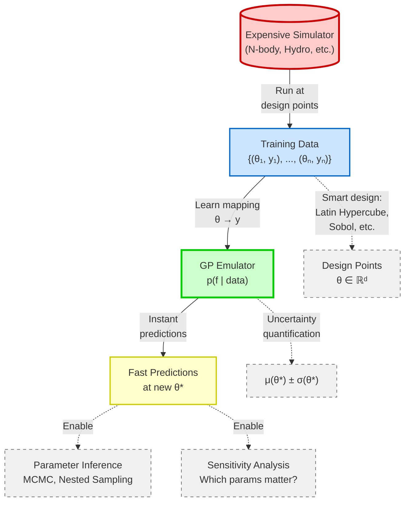
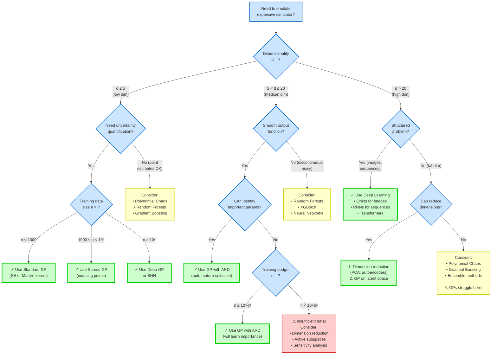

> "All models are wrong, but some are useful. The practical question is not whether to use a model, but which model to use."
>
> — George E. P. Box

---

## Learning Outcomes

By the end of Part II, you will be able to:

- [ ] **Articulate** why surrogate modeling is essential for modern computational astrophysics and **identify** when emulation is appropriate
- [ ] **Explain** Gaussian Processes as probability distributions over functions and **derive** predictions from Gaussian conditioning
- [ ] **Decide** when to use GPs versus neural networks versus other approaches based on problem characteristics
- [ ] **Interpret** kernel functions as encoding physical assumptions about smoothness, periodicity, and structure
- [ ] **Distinguish** epistemic from aleatoric uncertainty and **explain** how GPs quantify both
- [ ] **Connect** GP regression to the Bayesian inference framework from Module 5, seeing it as infinite-dimensional parameter inference
- [ ] **Apply** GP concepts to emulate N-body star cluster simulations, predicting cluster evolution from initial conditions

---

```{admonition} Recommended Reading: Visual Exploration of Gaussian Processes
:class: tip

For an interactive visual introduction to GPs, see [**A Visual Exploration of Gaussian Processes**](https://distill.pub/2019/visual-exploration-gaussian-processes/) (Görtler et al., 2019, *Distill*). This outstanding article provides interactive visualizations of kernel functions, prior/posterior distributions, and hyperparameter effects. It complements the mathematical treatment below with visual intuition—highly recommended for building geometric understanding before diving into equations!
```

---

## The Big Picture: The Computational Crisis in Modern Astrophysics

### The Problem We're Solving

You've spent the semester building physics from first principles:

**Module 1-2: Statistical Foundations**

- Central Limit Theorem, Maximum Entropy, moments as information compression
- Statistical mechanics: from microstates to macrostates
- The Boltzmann equation: evolution of distribution functions

**Module 3: Dynamics in Phase Space**

- Collisionless Boltzmann equation for stellar systems
- Virial theorem: when systems reach equilibrium
- Two-body relaxation: how clusters dissolve

**Module 4: Radiative Transfer**

- Photon transport through stellar atmospheres
- Monte Carlo methods for solving integral equations
- Importance sampling: making rare events tractable

**Module 5: Bayesian Inference**

- Beliefs as probability distributions over parameters
- **MCMC** (Markov Chain Monte Carlo): sampling complex posteriors when no closed form exists
- Model comparison via marginal likelihoods

**Projects 2, 3, 5: Building the Machinery**

- N-body simulations of star cluster evolution (gravity from scratch)
- Monte Carlo radiative transfer (photon-by-photon tracking)
- JAX implementations (fast, differentiable, GPU-accelerated)
  - **JAX**: Just-In-Time compiled array computing for Python with automatic differentiation
  - **GPU**: Graphics Processing Unit (massively parallel hardware accelerator)
  - **JIT**: Just-In-Time compilation (`jit`) for speed

Each simulator encodes **centuries of physics** compressed into a few hundred lines of code. They work beautifully. They give correct answers.

**They're also prohibitively slow.**

:::{admonition} The Computational Bottleneck
:class: important

Consider your N-body star cluster simulation from Project 5:

**Input**: 3 parameters describing initial conditions

- **Virial ratio**: $Q = 2K/|W|$ where:
  - $K$ = total kinetic energy (always positive)
  - $W$ = gravitational potential energy (always negative for bound systems)
  - $|W|$ = absolute value of potential energy (so $Q > 0$ always)
  - Range for your simulations: $Q \in [0.3, 0.7]$ (subvirial, bound systems)
- Number of stars $N \in [500, 2000]$
- Plummer scale radius $a \in [0.5, 2.0]$ pc (Plummer profile characteristic scale)

**Derived quantities**:

- Total mass $M_{\rm tot} = N \langle m \rangle_{\rm Kroupa}$ where the **Kroupa IMF** (Kroupa 2001) with $\alpha = 2.3$ for $m > 0.5$ M$_\odot$ gives $\langle m \rangle \approx 0.5$ M$_\odot$ for the range $m \in [0.1, 100]$ M$_\odot$
- IMF is **fixed** (not a free parameter): You will use the standard Kroupa (2001) broken power-law IMF in all simulations

:::{admonition} Understanding the Virial Ratio Q
:class: note

We define the virial ratio as $Q \equiv 2K/|W|$, where $K$ is the total kinetic energy and $W$ is the gravitational potential energy (negative for bound systems). This quantifies the dynamical state of the cluster:

**Notation clarification**: In this section, $K$ denotes kinetic energy (a scalar quantity). Later in the notes, we use $\mathbf{K}$ (bold) for the kernel covariance matrix; context will always make clear which is meant.

**Physical Interpretation**:

- **Q < 1**: **Subvirial** (cold, deeply bound)
  - Kinetic energy insufficient for virial equilibrium
  - System will virialize by redistributing energy (violent relaxation, two-body relaxation)
  - Example: $Q = 0.5$ means $K = 0.25|W|$ — very bound!

- **Q = 1**: **Virial equilibrium** (virialized)
  - $2K = |W|$ (virial theorem satisfied for bound systems)
  - System is dynamically relaxed and stable
  - Consistent with long-lived clusters that are approximately virialized on average, such as globular clusters in equilibrium

- **Q > 1**: **Supervirial** (hot, marginally bound)
  - Kinetic energy exceeds virial requirement
  - System will expand or become unbound
  - Example: $Q = 1.5$ means some stars will escape

**For your emulation**: The range $Q \in [0.3, 0.7]$ samples the **subvirial regime** where clusters are bound but not yet fully virialized. As $Q$ increases from 0.3 → 0.7, clusters become less bound and easier to disrupt by tidal forces or stellar evolution. Systems near $Q = 1$ are marginally stable; systems with $Q < 0.5$ are deeply bound.

**Connection to Module 3**: Recall the virial theorem from stellar dynamics: for a gravitationally bound system in equilibrium, $2\langle K \rangle + \langle W \rangle = 0$, which gives $Q = 1$. Your simulations explore departures from this equilibrium.
:::

**Output**: Cluster properties at time $t = 10 \, t_{\rm dyn}$, where the **dynamical time** is defined as $t_{\rm dyn} \equiv \sqrt{R_h^3 / (G M_{\rm tot})}$ (the characteristic timescale for orbital motion at the half-mass radius)

**Note on Plummer profiles**: For the Plummer density profile you're using, the half-mass radius relates to the scale radius as $R_h \approx 1.305 a$ (the exact factor depends on definitions and conventions; verify in your simulator's documentation). So clusters with larger $a$ have longer dynamical times (slower evolution): $t_{\rm dyn} \propto a^{3/2} / \sqrt{G M_{\rm tot}}$. This means $a$ directly controls the evolutionary timescale—important for interpreting your emulator's learned lengthscale $\ell_a$!

- Bound fraction: what percentage of stars remain gravitationally bound?
- Core radius $R_{\rm core}$: how compact is the cluster center?
- Half-mass radius $R_h$: characteristic size
- Velocity dispersion $\sigma_v$: kinetic energy indicator

**Computational Cost**:

- Single simulation: ~10 minutes (1000 particles, 100 timesteps, direct N-body)
- With your JAX implementation: ~2 minutes (GPU acceleration, `jit` compilation)

Now suppose you want to answer scientific questions:

1. **Parameter Space Exploration**: "Which initial conditions lead to cluster survival vs dissolution?"
   - Need: ~5,000 simulations to sample 3D space densely (roughly $\sim 17$ points per dimension for $17^3 \approx 5{,}000$ total)
   - Cost: 5,000 × 2 min = **~167 hours = 7 days of compute**

2. **Bayesian Parameter Inference**: "What initial conditions produced the Pleiades cluster?"
   - Need: ~100,000 MCMC samples × likelihood evaluations
   - Cost: 100,000 × 2 min = **~3,333 hours = 138 days = 4.5 months**

3. **Optimization**: "What initial setup maximizes cluster lifetime?"
   - Need: ~50,000 gradient evaluations for optimization
   - Cost: 50,000 × 2 min = **~1,666 hours = 69 days = 2.3 months**

**This is not a toy problem. This is real research.**
:::

### The Traditional Approach: Suffer or Approximate

Historically, astronomers faced a choice:

**Option 1: Just Wait**

- Run the expensive simulations
- Use supercomputers, parallelize, optimize
- Wait weeks/months for results
- **Problem**: Kills iteration speed, makes exploration impossible

**Option 2: Use Simple Models**

- Fit polynomials, power laws, linear regression
- Fast to evaluate, easy to interpret
- **Problem**: Physics is nonlinear, complex, high-dimensional. Simple models fail.

**Option 3: Dimensional Reduction**

- Derive simplified analytic approximations (e.g., virial theorem $Q = 1$ for equilibrium)
- Use scaling relations (e.g., $t_{\rm relax} \propto N / \ln N$)
- **Problem**: Valid only in limited regimes, miss interesting dynamics (unless validated with new simulations)

**Option 4: Give Up on Some Questions**

- Don't do parameter inference, don't optimize, don't explore broadly
- **Problem**: Science suffers

### The Modern Solution: Emulation

**Key Insight**: Your simulator $f_{\rm sim}$ is deterministic (or nearly so). Once you fix initial conditions $\mathbf{x}$, the output $y$ is determined by physics:

$$
y = f_{\rm sim}(\mathbf{x}) + \epsilon
$$

where $\epsilon$ represents numerical noise (finite timesteps, roundoff errors, stochastic elements).

**The Emulation Strategy**:

1. **One-Time Investment**: Run $N = 200\text{-}500$ simulations with carefully chosen initial conditions
   - Cost: $500 \times 2 \text{ min} \approx 16 \text{ hours}$ (one night of compute)
   - Generate training dataset: $\mathcal{D} = \{(\mathbf{x}_i, y_i)\}_{i=1}^N$

2. **Learn the Function**: Train a *surrogate model* (emulator) $f_{\rm emu}$ that approximates $f_{\rm sim}$
   - Cost: Minutes to hours (one-time training)
   - Result: Fast function $f_{\rm emu}(\mathbf{x})$ that mimics $f_{\rm sim}(\mathbf{x})$

3. **Deploy Everywhere**: Use $f_{\rm emu}$ instead of $f_{\rm sim}$ for:
   - Parameter space exploration: evaluate $f_{\rm emu}$ at millions of points
   - MCMC sampling: cheap likelihood evaluations
   - Optimization: fast gradient computation (if emulator is differentiable)
   - **Speedup**: $10^4$ to $10^6$ times faster than simulator

4. **Quantify Trust**: Emulator provides **uncertainty estimates**
   - "I predict bound fraction = $0.65 \pm 0.08$"
   - Know when to trust predictions, when to run more simulations
   - Principled decision-making about computational budget

:::{admonition} Connection to Module 5: Bayesian Inference
:class: note

In Project 4, you used MCMC to sample posterior distributions:

$$
p(\theta | \mathcal{D}) \propto p(\mathcal{D} | \theta) \, p(\theta)
$$

Each MCMC step required evaluating the likelihood $p(\mathcal{D} | \theta)$. When your model was simple (e.g., Gaussian with unknown mean/variance), this was cheap—just compute a probability.

But what if the likelihood requires *running a simulation*?

$$
p(\mathcal{D} | \theta) = p(\text{observed cluster properties} | \text{initial conditions } \theta)
$$

Then each MCMC step costs 2 minutes, and 100,000 samples = 138 days. **Intractable.**

**Emulation makes Bayesian inference feasible**: Replace $f_{\rm sim}(\theta)$ with $f_{\rm emu}(\theta)$ in the likelihood. Now each MCMC step costs milliseconds, and 100,000 samples = 1 hour.

This workflow is called **simulation-based inference** or **likelihood-free inference**, and it's how modern experiments (LIGO, DESI, Planck) constrain cosmological and astrophysical parameters.
:::

**[FIGURE 1.1: Emulation Workflow]**

<details>
<summary>View Figure: Complete Emulation Workflow from Simulation to Inference</summary>



**Figure 1.1**: The complete emulation workflow. **Red (expensive)**: Run your physics simulator 100-500 times at carefully chosen design points. **Blue (training)**: Collect training dataset linking initial conditions to outcomes. **Green (GP)**: Train Gaussian Process emulator that learns this mapping and provides uncertainty estimates μ(θ) ± σ(θ). **Yellow (fast)**: Query emulator millions of times for parameter inference, sensitivity analysis, and exploration. The one-time upfront cost enables downstream analyses that would be impossible with the direct simulator.

**Key Insight**: GPs provide both prediction μ(θ) AND uncertainty σ(θ), enabling trustworthy predictions with error bars, adaptive sampling (add more training data where uncertain), and rigorous parameter inference (uncertainty propagation in MCMC).

</details>

---

## First Principles: Why Gaussian Processes Work

### The Core Idea: Functions as Infinite-Dimensional Vectors

You're familiar with probability distributions over scalars and vectors:

**Scalar random variable**: $x \sim \mathcal{N}(\mu, \sigma^2)$

- Describes uncertainty about a single number
- Specified by mean $\mu$ and variance $\sigma^2$

**Vector random variable**: $\mathbf{x} \sim \mathcal{N}(\boldsymbol{\mu}, \boldsymbol{\Sigma})$

- Describes uncertainty about $n$ numbers jointly
- Specified by mean vector $\boldsymbol{\mu} \in \mathbb{R}^n$ and covariance matrix $\boldsymbol{\Sigma} \in \mathbb{R}^{n \times n}$

**A Gaussian Process extends this to functions**:

$$
f \sim \mathcal{GP}(m, k)
$$

- Describes uncertainty about an **entire function** $f: \mathbb{R}^D \to \mathbb{R}$
- Specified by:
  - **Mean function** $m: \mathbb{R}^D \to \mathbb{R}$ (often $m(\mathbf{x}) = 0$ after centering data)
  - **Kernel function** $k: \mathbb{R}^D \times \mathbb{R}^D \to \mathbb{R}$ (covariance between function values)

:::{admonition} Key Notation (Quick Reference)
:class: note, dropdown

| Symbol | Meaning | Type |
|--------|---------|------|
| $f$ | Unknown function we're learning | scalar |
| $\mathbf{x}$ | Input (e.g., initial conditions $Q, N, a$) | D-dimensional vector |
| $y$ | Output (e.g., bound fraction) | scalar |
| $\mathcal{D} = \{(\mathbf{x}_i, y_i)\}_{i=1}^N$ | Training dataset | $N$ pairs |
| $\mathbf{X}$ | Design matrix ($N \times D$) | matrix |
| $\mathbf{y}$ | Training targets (vector of length $N$) | vector |
| $\mathcal{GP}(m, k)$ | Gaussian process with mean $m$ and kernel $k$ | stochastic process |
| $m(\mathbf{x})$ | Mean function | scalar function |
| $k(\mathbf{x}, \mathbf{x}')$ | Kernel (covariance) function | scalar |
| $\mathbf{K}$ | Kernel matrix ($N \times N$) with entries $K_{ij} = k(\mathbf{x}_i, \mathbf{x}_j)$ | matrix |
| $\sigma_f^2$ | Signal variance (prior amplitude) | scalar (output$^2$) |
| $\ell$ | Lengthscale (correlation distance) | scalar (input units) |
| $\sigma_n^2$ | Noise variance (aleatoric uncertainty) | scalar (output$^2$) |
| $\boldsymbol{\theta} = (\sigma_f^2, \ell, \sigma_n^2, \ldots)$ | Hyperparameters | vector |
| $\mu(\mathbf{x}_*)$ | Predictive mean at test point | scalar |
| $\sigma^2(\mathbf{x}_*)$ | Predictive epistemic variance at test point | scalar (output$^2$) |

:::

:::{admonition} Choosing the Mean Function
:class: tip

**Default choice**: $m(\mathbf{x}) = 0$ after standardizing targets (subtract mean from training outputs, divide by std)

**Physics-informed alternative**: If you have strong prior knowledge about functional form:

- **Linear trend**: $m(\mathbf{x}) = \beta_0 + \sum_d \beta_d x_d$ (fit $\boldsymbol{\beta}$ via least-squares or treat as hyperparameters)
- **Known scaling**: If you expect $R_{\rm core} \propto a$, set $m(\mathbf{x}) = \beta \cdot a$ and let kernel model residuals

**When to use non-zero mean**:

- ✅ Strong theoretical expectation (e.g., virial scaling relations from Module 3)
- ✅ Extrapolation beyond training data (mean function guides predictions where no data exists)
- ❌ Weak prior knowledge → stick with $m = 0$ (avoid overfitting, let kernel learn structure)

**For your N-body emulation**: Start with $m = 0$ after standardization (recommended). If predictions extrapolate poorly near boundaries, consider physics-informed mean (e.g., linear in $\log a$ based on self-similar scaling).

**Practical note**: Standardize inputs/targets first, use zero mean, then denormalize predictions. This is simpler and more numerically stable than fitting complex mean functions.

**Critical implementation note**: If using a parametric mean $m(\mathbf{x}) = \boldsymbol{\beta}^T \mathbf{x}$ fitted to data, do NOT re-standardize the predictions afterward. Standardization should occur once at the start (normalize raw inputs/outputs), and be reversed once at the very end (denormalize predictions). Double-standardizing produces garbage.
:::

**Definition (Gaussian Process)**:

A stochastic process $f(\mathbf{x})$ is a Gaussian Process if, for *any* finite collection of input points $\{\mathbf{x}_1, \ldots, \mathbf{x}_n\}$, the joint distribution of function values is a multivariate Gaussian:

$$
\begin{bmatrix} f(\mathbf{x}_1) \\ f(\mathbf{x}_2) \\ \vdots \\ f(\mathbf{x}_n) \end{bmatrix} \sim \mathcal{N}\left( \begin{bmatrix} m(\mathbf{x}_1) \\ m(\mathbf{x}_2) \\ \vdots \\ m(\mathbf{x}_n) \end{bmatrix}, \begin{bmatrix} k(\mathbf{x}_1, \mathbf{x}_1) & k(\mathbf{x}_1, \mathbf{x}_2) & \cdots & k(\mathbf{x}_1, \mathbf{x}_n) \\ k(\mathbf{x}_2, \mathbf{x}_1) & k(\mathbf{x}_2, \mathbf{x}_2) & \cdots & k(\mathbf{x}_2, \mathbf{x}_n) \\ \vdots & \vdots & \ddots & \vdots \\ k(\mathbf{x}_n, \mathbf{x}_1) & k(\mathbf{x}_n, \mathbf{x}_2) & \cdots & k(\mathbf{x}_n, \mathbf{x}_n) \end{bmatrix} \right)
$$

**Intuition**:

- A function is an infinite-dimensional object: it assigns a value to every point in input space
- A GP says: "I don't know the exact function, but I have beliefs about what it looks like"
- Those beliefs are encoded in the kernel $k(\mathbf{x}, \mathbf{x}')$: "how similar should $f(\mathbf{x})$ and $f(\mathbf{x}')$ be?"

```{figure} figures/fig_2_1_gp_prior_samples.png
:label: fig-gp-prior-samples
:alt: GP prior samples showing lengthscale effects on function smoothness
:align: center

**Figure 2.1: GP Prior Samples - How Lengthscale Controls Smoothness**. Random function samples from GP(0, k_SE) with different lengthscales demonstrate how ℓ controls function smoothness. **Top row**: Individual samples show that small ℓ = 0.1 produces highly wiggly (high-frequency) functions, while large ℓ = 1.0 produces smooth (low-frequency) functions. **Bottom row**: Prior confidence bands (±2σ) with correlation length visualization. The red arrows show the lengthscale ℓ—the distance over which function values remain correlated (correlation drops to ~60% at distance ℓ). **Key Insight**: Small lengthscales require dense training data to capture rapid variations; large lengthscales allow sparse sampling since the function varies slowly.
```

:::{admonition} Why This Matters for Emulation
:class: tip

Your N-body simulator defines a true (unknown) function:

$$
f_{\rm true}(Q, N, a) = \text{bound fraction at } t = 10 \, t_{\rm dyn}
$$

where $M_{\rm tot} = N \langle m \rangle_{\rm Kroupa}$ is derived from $N$ using the fixed Kroupa IMF ($\langle m \rangle \approx 0.5$ M$_\odot$).

You observe this function at $N_{\rm train}$ training points: $\{(\mathbf{x}_i, y_i)\}_{i=1}^{N_{\rm train}}$ where $y_i = f_{\rm true}(\mathbf{x}_i) + \epsilon_i$.

**A GP gives you**:

1. **Prior beliefs**: Before seeing data, what do you expect? (smooth? discontinuous? periodic?)
2. **Posterior beliefs**: After seeing data, updated predictions at *any* input $\mathbf{x}_*$
3. **Uncertainty quantification**: Not just "I predict 0.65", but "I predict $0.65 \pm 0.08$"

This is **Bayesian inference in function space** — exactly the framework from Module 5, but now inferring an entire function instead of a parameter vector.
:::

### From Finite to Infinite: The Consistency Requirement

Why use Gaussians for functions? Two reasons:

**1. Computational Tractability**

Gaussian distributions have magical properties (recall Module 1):

- Marginals are Gaussian (if you ignore some dimensions, what's left is still Gaussian)
- Conditionals are Gaussian (if you observe some values, predictions for others are Gaussian)
- Linear transformations are Gaussian

These properties mean we can compute predictions **in closed form** — no MCMC, no numerical integration, just linear algebra.

**2. Consistency Under Marginalization**

Suppose I specify a GP prior $f \sim \mathcal{GP}(0, k)$. Then by definition:

$$
\begin{bmatrix} f(\mathbf{x}_1) \\ f(\mathbf{x}_2) \\ f(\mathbf{x}_3) \end{bmatrix} \sim \mathcal{N}\left(0, \begin{bmatrix} k(\mathbf{x}_1, \mathbf{x}_1) & k(\mathbf{x}_1, \mathbf{x}_2) & k(\mathbf{x}_1, \mathbf{x}_3) \\ k(\mathbf{x}_2, \mathbf{x}_1) & k(\mathbf{x}_2, \mathbf{x}_2) & k(\mathbf{x}_2, \mathbf{x}_3) \\ k(\mathbf{x}_3, \mathbf{x}_1) & k(\mathbf{x}_3, \mathbf{x}_2) & k(\mathbf{x}_3, \mathbf{x}_3) \end{bmatrix}\right)
$$

But also:

$$
\begin{bmatrix} f(\mathbf{x}_1) \\ f(\mathbf{x}_2) \end{bmatrix} \sim \mathcal{N}\left(0, \begin{bmatrix} k(\mathbf{x}_1, \mathbf{x}_1) & k(\mathbf{x}_1, \mathbf{x}_2) \\ k(\mathbf{x}_2, \mathbf{x}_1) & k(\mathbf{x}_2, \mathbf{x}_2) \end{bmatrix}\right)
$$

**Consistency**: The distribution over $[f(\mathbf{x}_1), f(\mathbf{x}_2)]$ obtained by marginalizing out $f(\mathbf{x}_3)$ from the 3D Gaussian must match the 2D Gaussian. Gaussians satisfy this automatically.

This is called the **Kolmogorov consistency theorem**, and it's why GPs are mathematically well-defined even though functions are infinite-dimensional.

:::{admonition} Conceptual Checkpoint #1
:class: warning

Pause and reflect:

1. **Infinite dimensions**: A function $f: \mathbb{R} \to \mathbb{R}$ assigns a value to every real number — uncountably infinite values. How can we specify a probability distribution over something infinite-dimensional?

2. **Finite observations**: We only ever observe $f$ at finitely many points. How does the GP use those finite observations to predict at new points?

3. **Connection to Module 1**: Recall the Central Limit Theorem: sums of i.i.d. random variables converge to Gaussian. Can you imagine how a function might be built as a sum of many basis functions, leading to Gaussian beliefs?

4. **Emulation intuition**: If I tell you "bound fraction is 0.8 when $Q=0.5$", should your prediction at $Q=0.51$ be closer to 0.8 or to some totally different value? What does this say about the kernel $k(Q, Q')$?

Think through these before moving on. Discuss with a neighbor.
:::

---

## 🔴 The Mathematical Machinery: Gaussian Conditioning

### Reviewing Multivariate Gaussians

Before we predict with GPs, we need the key formula from Module 1: **Gaussian conditioning**.

Suppose we have a joint Gaussian distribution over two sets of variables:

$$
\begin{bmatrix} \mathbf{f}_1 \\ \mathbf{f}_2 \end{bmatrix} \sim \mathcal{N}\left( \begin{bmatrix} \boldsymbol{\mu}_1 \\ \boldsymbol{\mu}_2 \end{bmatrix}, \begin{bmatrix} \boldsymbol{\Sigma}_{11} & \boldsymbol{\Sigma}_{12} \\ \boldsymbol{\Sigma}_{21} & \boldsymbol{\Sigma}_{22} \end{bmatrix} \right)
$$

where:

- $\mathbf{f}_1 \in \mathbb{R}^n$ are **observed** variables (training data)
- $\mathbf{f}_2 \in \mathbb{R}^m$ are **unobserved** variables (test points)
- $\boldsymbol{\Sigma}_{12} = \boldsymbol{\Sigma}_{21}^T$ (covariance is symmetric)

**Question**: If we observe $\mathbf{f}_1 = \mathbf{y}$ (actual data), what is the distribution of $\mathbf{f}_2$?

**Theorem (Gaussian Conditioning)**:

The conditional distribution is Gaussian:

$$
p(\mathbf{f}_2 | \mathbf{f}_1 = \mathbf{y}) = \mathcal{N}(\mathbf{f}_2 | \boldsymbol{\mu}_{2|1}, \boldsymbol{\Sigma}_{2|1})
$$

where:

$$
\boxed{
\begin{align}
\boldsymbol{\mu}_{2|1} &= \boldsymbol{\mu}_2 + \boldsymbol{\Sigma}_{21} \boldsymbol{\Sigma}_{11}^{-1} (\mathbf{y} - \boldsymbol{\mu}_1) \tag{Posterior Mean}\\[1em]
\boldsymbol{\Sigma}_{2|1} &= \boldsymbol{\Sigma}_{22} - \boldsymbol{\Sigma}_{21} \boldsymbol{\Sigma}_{11}^{-1} \boldsymbol{\Sigma}_{12} \tag{Posterior Covariance}
\end{align}
}
$$

**This is the entire machinery of Gaussian Process regression.**

### Interpreting the Formulas

Let's unpack these equations physically:

**Posterior Mean** $\boldsymbol{\mu}_{2|1} = \boldsymbol{\mu}_2 + \boldsymbol{\Sigma}_{21} \boldsymbol{\Sigma}_{11}^{-1} (\mathbf{y} - \boldsymbol{\mu}_1)$

- **Prior guess**: $\boldsymbol{\mu}_2$ (what we'd predict before seeing data)
- **Residual**: $(\mathbf{y} - \boldsymbol{\mu}_1)$ (how much the observations differ from prior expectations)
- **Regression weights**: $\boldsymbol{\Sigma}_{21} \boldsymbol{\Sigma}_{11}^{-1}$ (how much each observation influences the prediction)
- **Update**: Add weighted combination of residuals to prior

**Physical interpretation**: If test point $\mathbf{x}_*$ is highly correlated with training point $\mathbf{x}_i$ (large $\Sigma_{21}$), then observing $y_i$ strongly influences prediction at $\mathbf{x}_*$.

**Posterior Covariance** $\boldsymbol{\Sigma}_{2|1} = \boldsymbol{\Sigma}_{22} - \boldsymbol{\Sigma}_{21} \boldsymbol{\Sigma}_{11}^{-1} \boldsymbol{\Sigma}_{12}$

- **Prior uncertainty**: $\boldsymbol{\Sigma}_{22}$ (uncertainty before seeing data)
- **Reduction**: $\boldsymbol{\Sigma}_{21} \boldsymbol{\Sigma}_{11}^{-1} \boldsymbol{\Sigma}_{12}$ (how much observations reduce uncertainty)
- **Key insight**: Posterior covariance does **not** depend on observed values $\mathbf{y}$!

**Physical interpretation**: Uncertainty depends only on *where* you observed data (the $\mathbf{x}_i$), not on *what* you observed (the $y_i$). This makes sense: uncertainty is about information geometry, not values.

:::{admonition} Conceptual Checkpoint #2
:class: warning

Before moving on, make sure you understand:

1. **Why is the posterior still Gaussian?** Hint: Joint Gaussian + conditioning = conditional is Gaussian (Module 1 property).

2. **What happens to $\boldsymbol{\mu}_{2|1}$ if $\boldsymbol{\Sigma}_{21} = 0$ (test and training points uncorrelated)?**
   - Answer: $\boldsymbol{\mu}_{2|1} = \boldsymbol{\mu}_2$ (observations don't help, fall back to prior)

3. **What happens to $\boldsymbol{\Sigma}_{2|1}$ if $\boldsymbol{\Sigma}_{21} = 0$?**
   - Answer: $\boldsymbol{\Sigma}_{2|1} = \boldsymbol{\Sigma}_{22}$ (no uncertainty reduction, observations don't help)

4. **Why doesn't posterior variance depend on $\mathbf{y}$?**
   - Think about: If I tell you "I flipped a coin 10 times", you know your uncertainty about the bias. Does that uncertainty depend on whether I got 5 heads or 8 heads? (No! Sample size determines precision, not values.)

5. **Connection to Module 5**: Is this formula the same as Bayesian updating $p(\theta | \mathcal{D}) \propto p(\mathcal{D} | \theta) p(\theta)$? How?
   - Hint: For Gaussians, Bayes' rule + Gaussian likelihood + Gaussian prior = Gaussian posterior with these exact formulas!
:::

### From Conditioning to GP Prediction

Now apply this to Gaussian Processes. We have:

**Training data**: $\mathcal{D} = \{(\mathbf{x}_i, y_i)\}_{i=1}^N$ where $y_i = f(\mathbf{x}_i) + \epsilon_i$

- Collected input-output pairs from expensive simulator
- Noise $\epsilon_i \sim \mathcal{N}(0, \sigma_n^2)$ (numerical errors, stochasticity)

**GP prior**: $f \sim \mathcal{GP}(m, k)$

- Before seeing data, we believe $f$ has mean function $m$ and kernel $k$
- For simplicity, often take $m(\mathbf{x}) = 0$ (data can be centered)

**Goal**: Predict $f(\mathbf{x}_*)$ at new test point $\mathbf{x}_*$

**Setup**: Form joint distribution over training outputs and test output:

$$
\begin{bmatrix} \mathbf{y} \\ f_* \end{bmatrix} \sim \mathcal{N}\left( \begin{bmatrix} \mathbf{m} \\ m_* \end{bmatrix}, \begin{bmatrix} \mathbf{K} + \sigma_n^2 \mathbf{I} & \mathbf{k}_* \\ \mathbf{k}_*^T & k_{**} \end{bmatrix} \right)
$$

where:

- $\mathbf{y} = [y_1, \ldots, y_N]^T$ (training outputs, observed)
- $f_* = f(\mathbf{x}_*)$ (test output, unobserved)
- $\mathbf{K} \in \mathbb{R}^{N \times N}$ with $K_{ij} = k(\mathbf{x}_i, \mathbf{x}_j)$ (training-training covariance)
- $\mathbf{k}_* \in \mathbb{R}^N$ with $[\mathbf{k}_*]_i = k(\mathbf{x}_i, \mathbf{x}_*)$ (training-test covariance)
- $k_{**} = k(\mathbf{x}_*, \mathbf{x}_*)$ (test-test covariance, usually 1 for normalized kernels)
- $\sigma_n^2 \mathbf{I}$ accounts for observation noise

**Apply Gaussian conditioning**: Condition on observed $\mathbf{y}$ to get posterior over $f_*$:

$$
\boxed{
\begin{align}
\mu(\mathbf{x}_*) &= m(\mathbf{x}_*) + \mathbf{k}_*^T (\mathbf{K} + \sigma_n^2 \mathbf{I})^{-1} (\mathbf{y} - \mathbf{m}) \tag{GP Predictive Mean}\\[1em]
\sigma^2(\mathbf{x}_*) &= k_{**} - \mathbf{k}_*^T (\mathbf{K} + \sigma_n^2 \mathbf{I})^{-1} \mathbf{k}_* \tag{GP Predictive Variance}
\end{align}
}
$$

**These are the fundamental equations of GP regression.**

### What These Equations Mean

Let's interpret each term:

**Predictive Mean**: $\mu(\mathbf{x}_*) = m(\mathbf{x}_*) + \mathbf{k}_*^T (\mathbf{K} + \sigma_n^2 \mathbf{I})^{-1} (\mathbf{y} - \mathbf{m})$

1. **Prior mean** $m(\mathbf{x}_*)$: Default guess (often zero)
2. **Data term** $(\mathbf{y} - \mathbf{m})$: How training outputs differ from prior expectations
3. **Weights** $(\mathbf{K} + \sigma_n^2 \mathbf{I})^{-1} (\mathbf{y} - \mathbf{m})$: How much influence each training point has (depends on noise and correlations)
4. **Similarity** $\mathbf{k}_*$: How similar test point is to each training point
5. **Weighted average**: Prediction is weighted sum of training residuals, weighted by similarity

**Predictive Variance**: $\sigma^2(\mathbf{x}_*) = k_{**} - \mathbf{k}_*^T (\mathbf{K} + \sigma_n^2 \mathbf{I})^{-1} \mathbf{k}_*$

1. **Prior variance** $k_{**}$: Uncertainty before seeing data (usually normalized to 1)
2. **Reduction** $\mathbf{k}_*^T (\mathbf{K} + \sigma_n^2 \mathbf{I})^{-1} \mathbf{k}_*$: How much training data reduces uncertainty
3. **Key property**: Variance is small (confident) when test point is similar to training points (large $\mathbf{k}_*$)
4. **Another key property**: Variance is large (uncertain) far from training data

:::{admonition} Epistemic vs Aleatoric Uncertainty
:class: important

**Critical distinction**: The predictive variance $\sigma_*^2(\mathbf{x}_*)$ above is **epistemic uncertainty** (uncertainty about the latent function $f$).

When predicting an **observed target** $y_*$ (which includes measurement noise), the total predictive distribution is:

$$
\boxed{y_* \mid \mathcal{D}, \mathbf{x}_* \sim \mathcal{N}\left(\mu(\mathbf{x}_*), \underbrace{\sigma_*^2(\mathbf{x}_*)}_{\text{epistemic}} + \underbrace{\sigma_n^2}_{\text{aleatoric}}\right)}
$$

- **Epistemic**: Uncertainty about the function (reducible with more data)
- **Aleatoric**: Measurement/simulation noise (irreducible)

**When plotting predictions**:

- For the **latent function** $f$: Use $\mu \pm 2\sigma_*$ (epistemic only)
- For **observed outputs** $y$: Use $\mu \pm 2\sqrt{\sigma_*^2 + \sigma_n^2}$ (total uncertainty)

**When checking calibration**: Compare predictions to actual observations using total uncertainty $\sqrt{\sigma_*^2 + \sigma_n^2}$.

**Golden rule**: When checking model performance on test data, ALWAYS use total variance $\sigma_*^2 + \sigma_n^2$ (epistemic + aleatoric). Using epistemic only underestimates true prediction uncertainty.

**Rule of thumb for all GP applications**:

| Use Case | Variance to Use | Why |
|----------|----------------|-----|
| **Plotting latent function** | $\sigma_*^2$ (epistemic) | Visualizing the GP's belief about the true function |
| **Plotting prediction intervals** | $\sigma_*^2 + \sigma_n^2$ (total) | Comparing to actual noisy observations |
| **Test-set NLL** | $\sigma_*^2 + \sigma_n^2$ (total) | Scoring probability of observed data |
| **Calibration checks** | $\sigma_*^2 + \sigma_n^2$ (total) | Empirical coverage against observations |
| **Active learning (fixed noise)** | $\sigma_*^2$ (epistemic) | Quantifying function uncertainty, not observation noise |
| **MCMC likelihoods** | $\sigma_*^2 + \sigma_{\rm obs}^2$ (total) | Combine emulator + measurement uncertainties |

:::

:::{admonition} Numerical Stability: When Noise Gets Too Small
:class: warning

**The Problem**: As observation noise $\sigma_n^2 \to 0$ (perfectly precise simulator), the kernel matrix $\mathbf{K}_y = \mathbf{K} + \sigma_n^2 \mathbf{I}$ becomes **ill-conditioned**:

1. **Matrix condition number** $\kappa(\mathbf{K}_y) \approx \sigma_f^2 / \sigma_n^2$ grows
2. **Cholesky factorization** $\mathbf{K}_y = \mathbf{L} \mathbf{L}^T$ fails with numerical errors
3. **Linear solver** for $\mathbf{K}_y^{-1} (\mathbf{y} - \mathbf{m})$ becomes inaccurate
4. **Predictions** become unreliable (NaNs or Infs appear)

**Why this matters**: Your N-body simulator is nearly deterministic (same initial conditions → same output, up to rounding errors). You might think $\sigma_n^2 \approx 0$. But then the GP fails computationally!

#### Solution 1: Add Jitter

Use the formula:

$$
\mathbf{K}_y = \mathbf{K} + (\sigma_n^2 + \epsilon_{\rm jitter}) \mathbf{I}
$$

where $\epsilon_{\rm jitter} \sim 10^{-6}$ to $10^{-4}$ (scale-aware). This adds numerical stability without changing predictions significantly.

Choose jitter scale by:

1. Inspect your data: Estimate typical output scale $\sim \sigma_f$
2. Set $\epsilon_{\rm jitter} = 10^{-6} \times \sigma_f^2$ (relative to signal variance)
3. If Cholesky still fails, increase to $10^{-4} \times \sigma_f^2$

#### Solution 2: Add Real Noise

If your simulator has negligible noise, consider:

- Run each simulation twice with same ICs, measure repeatability
- If outputs differ by δ (e.g., due to numerical integration), set $\sigma_n^2 = \delta^2$
- If perfectly reproducible, set $\sigma_n^2 = 10^{-4} \times \sigma_f^2$ (small but nonzero)

#### Solution 3: Standardize Carefully

Before fitting GP:

1. Standardize outputs: $\tilde{y}_i = (y_i - \bar{y}) / \text{std}(y)$
2. All outputs now have scale ~1
3. Use jitter $\epsilon_{\rm jitter} \sim 10^{-6}$ (in standardized units)
4. After predictions, denormalize back to original units

**For your N-body emulation**:

- Your outputs (bound fraction ∈ [0,1], core radius ∈ [0.1, 10] pc) have different scales
- **Standardize each output separately**
- Use jitter $\epsilon_{\rm jitter} = 10^{-6}$ in standardized space
- Debug: If Cholesky fails, print $\text{cond}(\mathbf{K}_y)$ to diagnose ill-conditioning

:::

:::{admonition} Optional: Heteroskedastic Noise (Advanced)
:class: tip, dropdown

So far we've assumed **homoskedastic** noise: $\sigma_n^2$ is constant across all training points.

In reality, some simulators are noisier at certain parameter values:

- Simulations of chaotic systems (butterfly effect) produce noise that scales with system sensitivity
- Measurements in crowded stellar fields have position-dependent noise
- N-body simulations may have higher variance for specific (Q, N, a) combinations

**Heteroskedastic GP** (input-dependent noise) uses $\sigma_n^2(\mathbf{x})$:

$$y_i | \mathbf{x}_i \sim \mathcal{N}(f(\mathbf{x}_i), \sigma_n^2(\mathbf{x}_i))$$

**When to use**:

- Variance clearly depends on inputs (inspect training residual scatter vs parameters)
- You have repeated measurements at some points (allows fitting noise model)

**Implementation**: More complex; requires either:

1. Gaussian approximation + marginal likelihood optimization (GPyTorch, TensorFlow Probability handle this)
2. Approximate inference (EP, variational methods)
3. Pre-transform data to homoskedastize (log for multiplicative noise)

**For your N-body emulation**: Start with constant $\sigma_n^2$ (homoskedastic). If residuals show structure (e.g., $|\text{residual}|$ correlates with $Q$ or $N$), ask instructors about heteroskedastic extensions.

:::

:::{admonition} Worked Example: 1D Gaussian Process by Hand
:class: example

Let's compute predictions manually for a trivial 1D problem to see exactly how the math works.

**Setup**:

- Training data: $X = [0, 1]$, $y = [0, 1]$
- Test point: $x_* = 0.5$
- Kernel: Squared Exponential with $\sigma_f^2 = 1$, $\ell = 0.5$, $\sigma_n^2 = 0.01$ (small noise)
- Mean function: $m(x) = 0$

**Step 1: Build kernel matrix**

$$k(x, x') = \sigma_f^2 \exp\left(-\frac{(x - x')^2}{2\ell^2}\right) = \exp\left(-\frac{(x - x')^2}{2 \cdot 0.5^2}\right) = \exp\left(-2(x - x')^2\right)$$

$$\mathbf{K} = \begin{bmatrix} k(0, 0) & k(0, 1) \\ k(1, 0) & k(1, 1) \end{bmatrix} = \begin{bmatrix} \exp(0) & \exp(-2 \cdot 1^2) \\ \exp(-2 \cdot 1^2) & \exp(0) \end{bmatrix} = \begin{bmatrix} 1 & 0.0183 \\ 0.0183 & 1 \end{bmatrix}$$

Add noise: $\mathbf{K}_y = \mathbf{K} + \sigma_n^2 \mathbf{I} = \begin{bmatrix} 1.01 & 0.0183 \\ 0.0183 & 1.01 \end{bmatrix}$

**Step 2: Compute test kernel vector**

$$\mathbf{k}_* = \begin{bmatrix} k(0.5, 0) \\ k(0.5, 1) \end{bmatrix} = \begin{bmatrix} \exp(-2 \cdot 0.5^2) \\ \exp(-2 \cdot 0.5^2) \end{bmatrix} = \begin{bmatrix} 0.6065 \\ 0.6065 \end{bmatrix}$$

**Step 3: Solve for predictive mean**

$$\mu(0.5) = \mathbf{k}_*^T \mathbf{K}_y^{-1} \mathbf{y}$$

First, compute $\boldsymbol{\alpha} = \mathbf{K}_y^{-1} \mathbf{y}$. For a 2×2 matrix:

$$\mathbf{K}_y^{-1} = \frac{1}{1.01 \cdot 1.01 - 0.0183^2} \begin{bmatrix} 1.01 & -0.0183 \\ -0.0183 & 1.01 \end{bmatrix} = \frac{1}{1.0198} \begin{bmatrix} 1.01 & -0.0183 \\ -0.0183 & 1.01 \end{bmatrix}$$

$$\boldsymbol{\alpha} = \frac{1}{1.0198} \begin{bmatrix} 1.01 & -0.0183 \\ -0.0183 & 1.01 \end{bmatrix} \begin{bmatrix} 0 \\ 1 \end{bmatrix} = \frac{1}{1.0198} \begin{bmatrix} -0.0183 \\ 1.01 \end{bmatrix} = \begin{bmatrix} -0.0179 \\ 0.9902 \end{bmatrix}$$

Then:

$$\mu(0.5) = [0.6065, 0.6065] \cdot \begin{bmatrix} -0.0179 \\ 0.9902 \end{bmatrix} = -0.0109 + 0.6004 = 0.5895 \approx 0.59$$

**Interpretation**: The GP predicts ~0.59 at the midpoint (close to 0.5, but pulled slightly toward 1 because kernel decays fast with $\ell=0.5$).

**Step 4: Compute predictive variance**

$$\sigma^2(0.5) = k(0.5, 0.5) - \mathbf{k}_*^T \mathbf{K}_y^{-1} \mathbf{k}_*$$

First: $k(0.5, 0.5) = \exp(0) = 1$

Then: $\mathbf{K}_y^{-1} \mathbf{k}_* = \frac{1}{1.0198} \begin{bmatrix} 1.01 & -0.0183 \\ -0.0183 & 1.01 \end{bmatrix} \begin{bmatrix} 0.6065 \\ 0.6065 \end{bmatrix} = \frac{1}{1.0198} \begin{bmatrix} 0.6014 \\ 0.6014 \end{bmatrix} = \begin{bmatrix} 0.5898 \\ 0.5898 \end{bmatrix}$

$$\mathbf{k}_*^T \mathbf{K}_y^{-1} \mathbf{k}_* = [0.6065, 0.6065] \cdot \begin{bmatrix} 0.5898 \\ 0.5898 \end{bmatrix} = 2 \cdot 0.6065 \cdot 0.5898 = 0.7154$$

$$\sigma^2(0.5) = 1 - 0.7154 = 0.2846, \quad \sigma(0.5) = 0.533$$

**Final prediction**: $\mu(0.5) \pm 2\sigma(0.5) = 0.59 \pm 1.07 \approx [-0.48, 1.66]$

**This is Bayesian inference in action**: The GP weighted the training data ($y=0$ and $y=1$) by kernel similarity, predicted a reasonable interpolation (0.59), and quantified uncertainty (±1.07 spans the full data range because we only have 2 points far apart in kernel space).

:::

:::{admonition} N-Body Emulation Example
:class: tip

Suppose you're emulating bound fraction vs virial ratio $Q$. You've run simulations at:

- Training points: $Q \in \{0.35, 0.45, 0.55, 0.65\}$ with results $\mathbf{y} = [0.9, 0.75, 0.55, 0.35]$
- Note the trend: As $Q$ increases (clusters become less bound, approaching virial equilibrium at $Q=1$), bound fraction decreases (easier to disrupt)

Now predict at test point $Q_* = 0.50$:

**Predictive mean**:

- $Q_* = 0.50$ is between $Q_2 = 0.45$ and $Q_3 = 0.55$
- Those training points get high weight (similar $Q$ values)
- Kernel encodes "similar $Q$ → similar bound fraction"
- Prediction will be roughly $(0.75 + 0.55)/2 = 0.65$, adjusted by kernel

**Predictive variance**:

- $Q_* = 0.50$ is well-interpolated (between training points)
- $\mathbf{k}_*$ has large components (high correlation)
- Variance reduction is large → small $\sigma^2(Q_*)$
- **Confident prediction**: $0.65 \pm 0.05$ (narrow error bars)

Now predict at $Q_* = 0.80$ (outside training range):

- Far from all training points → small $\mathbf{k}_*$
- Little variance reduction → large $\sigma^2(Q_*)$
- **Uncertain prediction**: $0.20 \pm 0.25$ (wide error bars)
- **Extrapolation warning**: Don't blindly trust this!

**This is exactly what you want**: Confident interpolation, uncertain extrapolation.

**Important caveats about GP uncertainty in extrapolation**:

1. **Uncertainty plateaus at prior variance**: As you move far from training data, $\sigma^2(\mathbf{x}_*)$ grows toward the prior variance $\sigma_f^2$, not infinitely. The GP essentially says "I'm as uncertain as my prior beliefs" far from data.

2. **Uncertainty ≠ reliability**: Wide uncertainty bars don't guarantee the prediction is *unbiased*. A GP can confidently extrapolate in the wrong direction if the kernel's assumptions are violated. Example: If true bound fraction jumps discontinuously at $Q = 1.0$ (virial threshold), the GP will smoothly extrapolate, predicting intermediate values that never physically occur. The uncertainty won't capture this systematic bias.

3. **Physics prior matters**: The kernel encodes your prior beliefs about smoothness and structure. If reality differs from these assumptions (e.g., sharp phase transitions), the GP's uncertainty won't reflect that error.

4. **Validate extrapolation regions**: For scientific applications, always validate emulator predictions against a few held-out simulations in the extrapolation region. Don't assume wide error bars mean "the emulator knows it's unreliable."

**Best practice**:

- ✅ Use confident interpolation (between training points) without hesitation
- ⚠️  Use uncertain predictions with caution (check physics plausibility)
- ❌ Avoid relying on extrapolation predictions for publication without validation

```{figure} figures/fig_3_2_gp_uncertainty.png
:label: fig-gp-uncertainty
:alt: GP uncertainty showing confident interpolation and uncertain extrapolation
:align: center

**Figure 3.2: GP Uncertainty - Interpolation vs Extrapolation**. GP posterior with training data at x ∈ {1, 3, 5} demonstrates automatic uncertainty quantification. **Blue mean line**: Predictive mean μ(x) interpolates smoothly between training points (black dots with white edges). **Shaded regions**: Inner blue band shows ±2σ epistemic (function) uncertainty; outer coral band shows ±2σ total (epistemic + noise) uncertainty. **Green arrows** (interpolation regions): Narrow uncertainty between training points where GP is confident. **Red arrows** (extrapolation regions): Wide uncertainty outside training range where GP warns "I don't know—don't trust me here!" **Key Insight**: GP uncertainty σ(x) automatically grows far from data, providing a principled warning system for when predictions become unreliable. This is the epistemic uncertainty that shrinks with more training data.
```

:::

:::{admonition} Conceptual Checkpoint #3
:class: warning

Test your understanding:

1. **Interpolation vs extrapolation**: Why is the GP uncertain when predicting outside the training range? Draw a picture of $\sigma^2(\mathbf{x}_*)$ as a function of $\mathbf{x}_*$ for 1D data at $x \in \{1, 3, 5\}$.

2. **Effect of noise**: What happens to $\mu(\mathbf{x}_*)$ and $\sigma^2(\mathbf{x}_*)$ as $\sigma_n^2 \to 0$ (perfect observations)? As $\sigma_n^2 \to \infty$ (useless observations)?

3. **Sparse vs dense data**: Suppose you have 10 training points vs 100 training points (same range). How does predictive variance change? Why?

4. **Physical intuition**: You're emulating cluster core radius vs initial concentration $c$. At $c = 1.0$, you have 5 training points all showing $R_{\rm core} \approx 2$ pc with noise $\sigma_n = 0.1$ pc. What do you predict at $c = 1.0$? What uncertainty? (Hint: Think about averaging noisy measurements.)

5. **Connection to Module 1**: The GP posterior is $p(f | \mathcal{D})$. Is this like the Bayesian posterior $p(\theta | \mathcal{D})$ from Module 5? What's $f$ analogous to? What's $\mathcal{D}$?

Work through these carefully. This is the conceptual foundation.
:::

---

## 🔴 Kernels: Encoding Physical Intuition

### What Kernels Do

The kernel function $k: \mathbb{R}^D \times \mathbb{R}^D \to \mathbb{R}$ is the **heart of the GP**. It encodes all your prior beliefs about the function you're learning.

**Definition**: The kernel $k(\mathbf{x}, \mathbf{x}')$ measures the **covariance** between function values at inputs $\mathbf{x}$ and $\mathbf{x}'$:

$$
k(\mathbf{x}, \mathbf{x}') = \mathbb{E}[(f(\mathbf{x}) - m(\mathbf{x}))(f(\mathbf{x}') - m(\mathbf{x}'))]
$$

**Interpretation**:

- Large $k(\mathbf{x}, \mathbf{x}')$ → knowing $f(\mathbf{x})$ tells you a lot about $f(\mathbf{x}')$ (strongly correlated)
- Small $k(\mathbf{x}, \mathbf{x}')$ → knowing $f(\mathbf{x})$ tells you little about $f(\mathbf{x}')$ (weakly correlated)
- $k(\mathbf{x}, \mathbf{x}) = \sigma_f^2$ → prior variance of $f$ at any point (signal variance)

**Key Properties** (for a valid kernel):

1. **Symmetry**: $k(\mathbf{x}, \mathbf{x}') = k(\mathbf{x}', \mathbf{x})$ (covariance is symmetric)
2. **Positive Semi-Definite**: For any set of points $\{\mathbf{x}_i\}$, the matrix $K_{ij} = k(\mathbf{x}_i, \mathbf{x}_j)$ must have non-negative eigenvalues
3. **Stationarity** (common but not required): Many kernels are stationary, $k(\mathbf{x}, \mathbf{x}') = k(\mathbf{x} - \mathbf{x}')$ (depends only on distance, not absolute location). Non-stationary kernels can model varying lengthscales (e.g., input warping, Gibbs kernel).

:::{admonition} Why Positive Semi-Definite?
:class: tip, dropdown

A covariance matrix must be positive semi-definite because:

$$
\text{Var}[\mathbf{a}^T \mathbf{f}] = \mathbf{a}^T \mathbf{K} \mathbf{a} \geq 0
$$

for any vector $\mathbf{a}$. Variances can't be negative!

**Practical implication**: You can't just invent arbitrary $k(\mathbf{x}, \mathbf{x}')$. Must satisfy mathematical constraints. Common kernels (SE, Matérn, periodic) are guaranteed to be valid.
:::

### The Squared Exponential (RBF) Kernel

The most common kernel is the **Squared Exponential** (SE), also called **Radial Basis Function** (RBF):

$$
k_{\text{SE}}(\mathbf{x}, \mathbf{x}') = \sigma_f^2 \exp\left( -\frac{\|\mathbf{x} - \mathbf{x}'\|^2}{2\ell^2} \right)
$$

**Hyperparameters**:

- $\sigma_f^2$ : **Signal variance** (overall amplitude of function, units: output$^2$)
- $\ell$ : **Lengthscale** (how far you must move in input space for function to change significantly, units: input)

**Anisotropic version (Automatic Relevance Determination - ARD)**:

When dimensions have different importance, use per-dimension lengthscales:

$$
k_{\text{SE-ARD}}(\mathbf{x}, \mathbf{x}') = \sigma_f^2 \exp\left( -\frac{1}{2} \sum_{d=1}^D \frac{(x_d - x'_d)^2}{\ell_d^2} \right)
$$

where each $\ell_d$ controls sensitivity to dimension $d$. Small $\ell_d$ → high sensitivity, large $\ell_d$ → low sensitivity.

**Physical interpretation**:

1. **Exponential decay**: Correlation decreases exponentially with distance $\|\mathbf{x} - \mathbf{x}'\|$
2. **Lengthscale**: If $\|\mathbf{x} - \mathbf{x}'\| = \ell$, then $k = \sigma_f^2 e^{-1/2} \approx 0.6 \sigma_f^2$ (60% correlated)
3. **Short lengthscale**: Function varies rapidly, needs data points close together
4. **Long lengthscale**: Function varies slowly, data points far apart still informative
5. **Infinite smoothness**: Functions drawn from SE GP are infinitely differentiable (unrealistic for many physical systems!)

**Visualization**: Imagine bound fraction vs virial ratio $Q$:

- Small $\ell = 0.01$: Bound fraction changes dramatically between $Q = 0.50$ and $Q = 0.51$ (highly sensitive)
- Large $\ell = 0.5$: Bound fraction changes smoothly across entire range $Q \in [0.3, 0.7]$ (insensitive)

:::{admonition} Isotropy vs Anisotropy
:class: note

The SE kernel as written is **isotropic**: Uses Euclidean distance $\|\mathbf{x} - \mathbf{x}'\|$, treating all dimensions equally.

Often physics has **different lengthscales per dimension**. Use **Automatic Relevance Determination** (ARD):

$$
k_{\text{SE-ARD}}(\mathbf{x}, \mathbf{x}') = \sigma_f^2 \exp\left( -\frac{1}{2} \sum_{d=1}^D \frac{(x_d - x'_d)^2}{\ell_d^2} \right)
$$

Now each dimension has its own lengthscale $\ell_d$.

**N-body example**:

- Bound fraction may be very sensitive to $Q$ (small $\ell_Q$)
- But relatively insensitive to $N$ (large $\ell_N$) in some regime
- ARD learns this automatically from data!
- **Bonus**: Tells you which parameters matter most (scientific discovery!)

```{figure} figures/fig_4_3_ard_effect.png
:label: fig-ard-effect
:alt: ARD automatic parameter importance discovery for N-body simulations
:align: center

**Figure 4.3: ARD Effect - Automatic Parameter Importance Discovery**. ARD automatically discovers which parameters matter for N-body cluster evolution. **Left panel**: GP prediction with ARD lengthscales ℓ_Q = 0.3 (small) and ℓ_N = 2.0 (large). The **vertical contours** reveal that bound fraction is highly sensitive to virial ratio Q but weakly sensitive to particle number N. **Right panel**: True underlying function confirms ARD learned correctly. **Yellow box annotation**: Lengthscale ratio ℓ_N/ℓ_Q = 6.7× means the GP is ~7× more sensitive to Q than N—the GP automatically discovered from just 25 training points (red dots) that Q is the dominant physics parameter! **Key Insight**: ARD performs automatic feature selection by learning which input dimensions actually affect the output. Small ℓ_d → parameter d matters; large ℓ_d → parameter d is relatively unimportant. This is scientific discovery from data—no physics intuition required (though validating against physics is essential!).
```

:::

### The Matérn Family: More Realistic Smoothness

The SE kernel assumes **infinitely smooth** functions. Real physics is often rougher. The **Matérn family** allows tunable smoothness:

$$
k_{\text{Matérn}}(\mathbf{x}, \mathbf{x}') = \sigma_f^2 \frac{2^{1-\nu}}{\Gamma(\nu)} \left( \sqrt{2\nu} \frac{\|\mathbf{x} - \mathbf{x}'\|}{\ell} \right)^\nu K_\nu\left( \sqrt{2\nu} \frac{\|\mathbf{x} - \mathbf{x}'\|}{\ell} \right)
$$

where:

- $\nu > 0$ : **Smoothness parameter**
- $K_\nu$ : Modified Bessel function of the second kind
- $\Gamma(\nu)$ : Gamma function

**Key cases**:

1. **$\nu = 1/2$ (Matérn-1/2)**:
   - Equivalent to Ornstein-Uhlenbeck process
   - Functions are **continuous but not differentiable** (rough, can have kinks)
   - With $r = \|\mathbf{x} - \mathbf{x}'\|$:
   $$k(\mathbf{x}, \mathbf{x}') = \sigma_f^2 \exp(-r / \ell)$$
   - **Note**: Still continuous! Doesn't model true discontinuities, just permits roughness.

2. **$\nu = 3/2$ (Matérn-3/2)**:
   - Functions are **once differentiable** (smooth but can have kinks in second derivative)
   - With $r = \|\mathbf{x} - \mathbf{x}'\|$:
   $$k(\mathbf{x}, \mathbf{x}') = \sigma_f^2 \left(1 + \sqrt{3} \frac{r}{\ell}\right) \exp\left(-\sqrt{3} \frac{r}{\ell}\right)$$

3. **$\nu = 5/2$ (Matérn-5/2)**:
   - Functions are **twice differentiable** (smoother, often good default)
   - With $r = \|\mathbf{x} - \mathbf{x}'\|$:
   $$k(\mathbf{x}, \mathbf{x}') = \sigma_f^2 \left(1 + \sqrt{5} \frac{r}{\ell} + \frac{5r^2}{3\ell^2}\right) \exp\left(-\sqrt{5} \frac{r}{\ell}\right)$$

4. **$\nu \to \infty$**: Recovers SE kernel (infinitely smooth)

**When to use which**:

- **Matérn-5/2** (default): Start here for most physical systems (smooth but not unrealistically so)
- **Matérn-3/2**: If Matérn-5/2 is over-smooth (under-coverage in calibration, residuals show structure)
- **SE**: When you know function is truly smooth (interpolating well-behaved data)
- **Matérn-1/2**: When function is rough/non-smooth, but still continuous (not for true discontinuities - GPs struggle with those)

**Practical tuning guide**:

- If predictions are under-covered (empirical coverage < 68% at 1σ) → try lower $\nu$ (Matérn-3/2 instead of 5/2) or regularize $\sigma_n^2$
- If predictions are numerically wiggly → increase $\nu$ (higher smoothness)
- If lengthscales blow up → kernel may be too flexible, try Matérn-5/2 or SE

:::{admonition} N-Body Application: Choosing Smoothness
:class: tip

Consider emulating different cluster properties:

**Bound fraction vs $Q$**:

- Physical expectation: Smooth transition from deeply bound (low $Q < 1$) to marginally bound/unbound (high $Q \geq 1$)
- Virial equilibrium occurs at $Q = 1$ (where $2K = |W|$ by virial theorem)
- Range $[0.3, 0.7]$ explores subvirial regime — all bound, varying degrees of stability
- Critical transition expected near $Q \approx 1.0$ (outside training range in this example)
- **Recommended**: Matérn-5/2 (smooth but allows second-derivative changes)

**Time to core collapse vs initial $N$**:

- Physical expectation: Two-body relaxation time $t_{\rm relax} \propto (N / \ln N) \, t_{\rm dyn}$ at fixed density and crossing time (smooth, slowly varying)
- **Recommended**: SE or Matérn-5/2

**Cluster fate (bound/unbound) vs initial conditions**:

- Physical expectation: Might have sharp boundaries in parameter space
- Classification-like problem (binary outcome smoothly varying with inputs)
- **Recommended**: Matérn-3/2 (allows some roughness)

**The key**: Match kernel smoothness to your physical intuition. When uncertain, Matérn-5/2 is a good default.
:::

```{figure} figures/fig_2_3_matern_smoothness.png
:label: fig-matern-smoothness
:alt: Matérn family smoothness comparison showing differentiability controlled by nu
:align: center

**Figure 2.3: Matérn Smoothness Comparison**. Matérn family smoothness comparison showing how ν controls differentiability. **Top row**: Function samples f(x) for each smoothness parameter. **Middle row**: Numerical derivatives f'(x) reveal roughness—Matérn-1/2 (ν=0.5) shows visible kinks and is NOT differentiable (rough, discontinuous slopes); Matérn-3/2 (ν=1.5) has smooth first derivatives but rough second derivatives (once differentiable); Matérn-5/2 (ν=2.5) is very smooth (twice differentiable). **Bottom row**: Kernel correlation k(r) vs distance shows how quickly correlations decay. **Practical Recommendation**: Use **Matérn-5/2 as default** for physics emulation—smooth enough for realistic systems but more flexible than infinitely-smooth SE kernel. Only use SE when you KNOW the function is truly infinitely smooth (rare in real physics). Use Matérn-3/2 if validation shows underfitting or if you expect rougher behavior.
```

### Periodic Kernels: Exploiting Symmetries

If your function has **periodic structure**, you can encode this:

$$
k_{\text{Per}}(x, x') = \sigma_f^2 \exp\left( -\frac{2 \sin^2(\pi |x - x'| / p)}{\ell^2} \right)
$$

**Note**: This is the **1D periodic kernel**. For vector inputs, periodicity is typically applied per dimension: $k_{\text{Per}}(\mathbf{x}, \mathbf{x}') = \prod_d \sigma_f^2 \exp\left(-\frac{2\sin^2(\pi(x_d - x_d')/p_d)}{\ell_d^2}\right)$. Use only if you have strong physical reason to expect periodicity in a specific dimension (e.g., orbital angular position, stellar rotation phase).

where:

- $p$ : **Period** (units: input)
- $\ell$ : **Lengthscale within period** (controls smoothness)

**When to use**:

- Time series with known periodicity (stellar rotation, orbital period)
- Spatial data with translational symmetry

**N-body example**: If you're emulating cluster properties in a rotating frame, periodic kernel might capture rotational symmetry. (Rare, but possible!)

```{figure} figures/fig_2_2_kernel_gallery.png
:label: fig-kernel-gallery
:alt: Comprehensive kernel gallery comparing common GP kernels
:align: center

**Figure 2.2: Kernel Gallery**. Comprehensive kernel gallery comparing five common GP kernels. **Top row**: Kernel correlation k(r) vs distance r—shows how correlation decays with separation. SE (RBF) has smooth Gaussian decay; Matérn-1/2 has exponential decay (roughest); Matérn-3/2 and 5/2 are intermediate; Periodic shows repeating pattern. **Middle row**: Random function samples demonstrate smoothness—SE is infinitely smooth (no kinks ever), Matérn-1/2 can have kinks (rough), Matérn-5/2 is very smooth but more realistic than SE, Periodic captures repeating patterns. **Bottom row**: Prior ±2σ confidence bands show expected function variability. **Key Comparisons**: SE (blue) is too smooth for most physics; Matérn-1/2 (purple) is too rough (kinks visible); Matérn-5/2 (red) balances smoothness with realism (**recommended default**); Periodic (green) for phenomena with known periodicity. All kernels share lengthscale ℓ=0.3 for fair comparison.
```

### Compositional Kernels: Building Complexity

You can combine kernels to build more complex priors:

**1. Addition** $k(\mathbf{x}, \mathbf{x}') = k_1(\mathbf{x}, \mathbf{x}') + k_2(\mathbf{x}, \mathbf{x}')$

- Functions are sums of two independent processes
- Example: Smooth trend + noise, Long-range + short-range structure

**2. Multiplication** $k(\mathbf{x}, \mathbf{x}') = k_1(\mathbf{x}, \mathbf{x}') \cdot k_2(\mathbf{x}, \mathbf{x}')$

- Functions have coupled structure
- Example: Periodic function with varying amplitude

**3. Per-dimension kernels**:
$$
k(\mathbf{x}, \mathbf{x}') = \prod_{d=1}^D k_d(x_d, x'_d)
$$

- Different structure in each dimension
- Encodes independence assumptions

:::{admonition} Example: Composite Kernel for Core Radius Evolution
:class: tip

Suppose emulating $R_{\rm core}(Q, t)$ — core radius as function of virial ratio and time.

**Physical expectations**:

1. Smooth variation with $Q$ (subvirial/bound → supervirial/unbound as $Q$ increases toward 1)
2. Power-law-like decay with time: $R_{\rm core}(t) \propto t^{-\alpha}$ (core collapse)
3. Cross-terms: Decay rate $\alpha$ depends on $Q$ (more bound systems collapse faster)

**Safe composite kernel approaches**:

**Option 1: Transform to log-space** (recommended)
$$
k((Q, t), (Q', t')) = k_{\text{SE}}(Q, Q') \times k_{\text{SE}}(\log t, \log t')
$$
Modeling in $\log t$ naturally captures power-law behavior and is guaranteed PSD.

**Option 2: Linear kernel for log-time**

$$
k((Q, t), (Q', t')) = k_{\text{SE}}(Q, Q') \times (\sigma_0^2 + \sigma_1^2 \log t \cdot \log t')
$$
Linear kernels are PSD and can capture monotonic trends.

**Option 3: Spectral mixture** (advanced)
Use spectral mixture kernels for multi-scale temporal structure—beyond this course but very powerful.

**Key principle**: Always verify your kernel is positive semi-definite! Ad-hoc "power kernels" often fail this. When in doubt, transform inputs and use standard kernels.
:::

:::{admonition} Conceptual Checkpoint #4
:class: warning

Apply kernel intuition to your N-body emulation:

1. **Lengthscale interpretation**: You're emulating bound fraction vs $(Q, N, a)$. You expect:
   - Small changes in $Q$ → large changes in bound fraction (especially as $Q$ approaches virial threshold $Q=1$)
   - Large changes in $N$ → small changes in bound fraction (mainly affects resolution, not global dynamics)
   - Changes in $a$ (Plummer scale radius) → moderate changes (larger clusters easier to disrupt by tides)

   Should $\ell_Q$ be larger or smaller than $\ell_N$? What about $\ell_a$? Why?

2. **Smoothness**: Bound fraction transitions from 1.0 (everything bound) to 0.0 (everything unbound) as $Q$ increases. Is this:
   - Infinitely smooth (SE kernel)?
   - Once differentiable (Matérn-3/2)?
   - Discontinuous jump (Matérn-1/2)?

   Sketch what you expect and choose a kernel.

3. **Visualization**: Draw $k_{\text{SE}}(x, x')$ as a 2D heatmap for $x, x' \in [0, 1]$ with $\ell = 0.1$ vs $\ell = 0.5$. Which allows longer-range correlations?

4. **Edge cases**: What happens to GP predictions if $\ell \to 0$? If $\ell \to \infty$? (Hint: Think about what the kernel matrix $\mathbf{K}$ looks like.)

5. **Physical constraints**: You know bound fraction must be in $[0, 1]$. Does the GP enforce this? (Spoiler: No! GPs are Gaussian, so predictions can be negative or >1. We'll address this later.)

Discuss these before moving on!
:::

---

## 🔴 Decision Framework: When to Use What

You now understand *what* GPs are and *how* they work. But when should you actually use them?

### The Method Landscape

Modern surrogate modeling has three main approaches:

| Method | Strengths | Weaknesses | When to Use |
|--------|-----------|------------|-------------|
| **Polynomial / Basis Function Expansion** | Simple, interpretable, fast | Limited flexibility, high-D curse | Linear systems, low-D, known structure |
| **Gaussian Processes** | Uncertainty quantification, data-efficient, interpretable hyperparameters | $O(N^3)$ scaling, assumes smoothness, struggles in high-D | Low-D ($D < 10$-20), need uncertainty, limited data ($N < 5000$), interpretability important |
| **Neural Networks** | Scales to high-D, handles complex patterns, can learn representations | Needs lots of data, uncertain uncertainty, black box | High-D ($D > 20$), abundant data ($N > 10,000$), complex discontinuities |

### When to Use Gaussian Processes

**GPs Excel When**:

✅ **Low-dimensional inputs** (single-digit to low-tens, roughly $D \lesssim 10$–20)

- Kernel methods scale poorly with dimension (curse of dimensionality)
- Need exponentially more data to cover space as $D$ increases
- **Effective dimensionality** often lower than nominal $D$ when using ARD (automatic relevance determination learns which dimensions matter)
- Your N-body emulation: $D = 3$ → perfect for GPs!

✅ **Limited training data** ($N = 100$-5000)

- GPs are data-efficient (Bayesian priors help)
- Can make reasonable predictions from tens of samples
- NNs need thousands to millions of samples

✅ **Uncertainty quantification is critical**

- GPs give Bayesian uncertainty automatically
- Know when predictions are trustworthy
- Essential for scientific applications (error bars matter!)

✅ **Smooth or structured functions**

- Physics is usually continuous, differentiable
- Kernels encode this structure explicitly
- GPs exploit smoothness for efficient learning

✅ **Interpretability matters**

- Hyperparameters have clear physical meaning
  - $\ell_Q = 0.05$ → "Bound fraction changes significantly over $\Delta Q = 0.05$"
  - $\sigma_f^2 = 0.1$ → "Typical variation in bound fraction is $\pm 0.3$"
- Can diagnose what GP learned about physics

✅ **Need gradients**

- GP predictions are differentiable (can compute $\nabla_{\mathbf{x}} \mu(\mathbf{x})$)
- Useful for optimization, sensitivity analysis
- JAX makes this automatic!

### When NOT to Use Gaussian Processes

❌ **High-dimensional inputs** ($D > 20$)

- Kernel evaluations become expensive
- Need impractical amounts of data to cover space
- Consider dimensionality reduction first, or use NNs

❌ **Large datasets** ($N > 5000$-10,000)

- $O(N^3)$ training cost becomes prohibitive
- $O(N^2)$ memory for covariance matrix
- **Solution**: Sparse/inducing-point GPs (see below)

:::{admonition} Scaling Beyond $N \sim 5000$: Sparse GPs
:class: tip, dropdown

If you have abundant data ($N > 5000$) but still want GP uncertainty quantification, use **sparse approximations**:

**Idea**: Approximate full GP with $m \ll N$ **inducing points**:

- Select $m \in [256, 512]$ representative locations in input space
- Complexity: $O(N m^2 + m^3)$ instead of $O(N^3)$
- Memory: $O(N m + m^2)$ instead of $O(N^2)$

**Methods**:

- **Variational Free Energy (VFE)** / Titsias (2009): Optimal inducing locations
- **SVGP**: Stochastic variational GPs for $N \sim 10^6$

**When to use**:

- You have $N > 5000$ simulations
- Still want principled uncertainty (not just NN)
- Willing to accept approximation error

**Trade-off**: Lose some accuracy for computational feasibility.

**For your project**: With $N \sim 250$, use exact GP. If extending to $N > 2000$, consider sparse methods.

**JAX Libraries**: GPJax supports sparse GPs natively.
:::

❌ **Discontinuous or highly irregular functions**

- GPs assume some smoothness
- Can't represent sharp discontinuities well
- Matérn-1/2 helps, but NNs might be better

❌ **Complex structured outputs**

- GPs naturally handle scalar outputs
- **Multi-output GPs possible** for moderate cases:
  - **Independent GPs**: Train separate GP per output (simple, loses correlations between outputs)
  - **Multi-output GP** (coregionalization): Model output correlations via cross-covariance (ICM/LMC methods)
    - Example: If $R_{\rm core}$ and $R_h$ are correlated, joint GP can leverage this
    - **Benefit**: More data-efficient than training separate GPs if outputs are correlated
    - **Caveat**: More hyperparameters to optimize (cross-covariances + per-output lengthscales)
    - **Trade-off**: More complex training, but can improve predictions when training data is scarce
  - **Your project**: For $(R_{\rm core}, R_h, \sigma_v)$, independent GPs are recommended (3× training cost, straightforward implementation, maintains modularity). Use multi-output only if data-scarce and outputs strongly correlated.
- For high-dimensional outputs (images, sequences, graphs) → use NNs

❌ **Real-time constraints**

- Training is one-time cost (acceptable if slow)
- But prediction scales as $O(N M)$ for $M$ test points
- If need millisecond inference for millions of queries, NNs may be faster

### Decision Tree for Your N-Body Emulation

Let's apply this to your project:

**Your Problem**:

- **Input**: $(Q, N, a) \in \mathbb{R}^3$ as primary parameters
  - $M_{\rm tot}$ is **derived**: $M_{\rm tot} = N \langle m \rangle_{\rm Kroupa}$ (fixed IMF, $\langle m \rangle \approx 0.5$ M$_\odot$)
- **Output**: Bound fraction, $R_{\rm core}$, etc. (scalar properties)
- **Training data**: ~250 simulations (200 provided + 50 yours)
- **Goal**: Predict at new initial conditions, quantify uncertainty

**Analysis**:

- ✅ $D = 3$ → Low-dimensional (GPs shine here)
- ✅ $N \approx 250$ → Limited data (GPs data-efficient)
- ✅ Smooth physics (cluster properties vary continuously with ICs)
- ✅ Need uncertainty (must know when emulator is trustworthy)
- ✅ Interpretability (want to understand which parameters matter)

**Verdict**: **Gaussian Processes are ideal for this problem!**

**But also try Neural Networks because**:

- Good learning exercise (compare approaches)
- NNs scale better if you want to add more simulations later
- Can handle multi-output prediction more naturally
- Shows you the tradeoffs empirically

**[FIGURE 5.1: Emulation Method Decision Tree]**

<details>
<summary>View Figure: Complete Decision Tree for Choosing Emulation Methods</summary>



**Figure 5.1**: Decision tree for choosing emulation methods based on problem characteristics. **Green boxes**: Recommended methods with strong theoretical/empirical support. **Yellow boxes**: Alternative methods to consider. **Red boxes**: Warning situations requiring problem reformulation. **Blue diamonds**: Decision points based on dimensionality, data availability, and smoothness assumptions. For your N-body cluster emulation (d=3, n≈250, smooth physics, need UQ), follow the path: d≤5 → Yes UQ → n<1000 → **Standard GP with SE or Matérn kernel**—the ideal choice!

**Quick Reference**: **Standard GP** (d≤5, n<1000) for small data + uncertainty. **GP with ARD** (5<d≤20) for automatic feature selection. **Sparse GP** (n>5000) for computational efficiency. **Neural Networks** (d>20 or n>10,000) for high-dimensional/large-data regimes. **Decision Rule**: Use GPs when you need rigorous uncertainty quantification, have limited expensive training data, smooth outputs, and interpretable lengthscales matter.

</details>

:::{admonition} The Research Frontier
:class: tip

In cutting-edge research, often **combine** GPs and NNs:

**Approach 1: Neural Process.**

- NN that outputs GP parameters (mean, kernel)
- Gets NN flexibility + GP uncertainty
- Active research area!

**Approach 2: Deep Kernel Learning.**

- Use NN to learn feature representation
- Use GP in learned feature space
- Handles high-D inputs better

**Approach 3: Bayesian Neural Networks.**

- Treat NN weights as random (like GP hyperparameters)
- Sample via MCMC (you know how from Project 4!)
- Gets NN flexibility + Bayesian uncertainty
- Computationally expensive but powerful

**Note for this course**: We won't cover these hybrids in code this term; they're included to connect your workflow to current literature and show where the field is heading.

**Your Final Project**: Focus on standard GP + standard NN to understand both. If time permits and you're ambitious, explore hybrids!
:::

:::{admonition} Conceptual Checkpoint #5
:class: warning

Test your decision-making:

1. **High-D problem**: Suppose you're emulating from full initial conditions (all $3N$ positions and velocities for $N = 1000$ stars). That's $D = 6000$. Should you use a GP? Why or why not? What would you do instead?

2. **Data scarcity**: You only have 20 simulations (very expensive, each takes 1 hour). Should you use a GP or NN? Justify.

3. **Discontinuities**: Suppose bound fraction jumps discontinuously at some critical $Q_{\rm crit}$ (instant tidal disruption). Will GP work well? What kernel would you try?

4. **Multi-output**: You want to predict $(R_{\rm core}, R_h, \sigma_v)$ jointly at once. How would you handle this with:
   - GPs? (Hint: Can train 3 separate GPs, or one multi-output GP)
   - NNs? (Hint: Single NN with 3 output units)

5. **Computational budget**: You have 1 hour to train an emulator. You have 50 simulations (train in minutes) or 5000 simulations (train might take hours). Which method?

Think through the tradeoffs!
:::

---

## 🎓 What We've Learned: Theory Summary

Let's step back and see what we've covered in Part I.

### First Principles

1. **The Problem**: Scientific simulations encode physics but are too slow for exploration, optimization, inference

2. **The Solution**: Emulation—learn a fast surrogate from modest training data

3. **Why GPs Work**:
   - Bayesian inference in function space
   - Gaussian conditioning gives predictions in closed form
   - Kernels encode physical structure (smoothness, lengthscales)
   - Uncertainty quantification is built-in (know when to trust predictions)

4. **When to Use GPs**:
   - Low-dimensional problems ($D < 20$)
   - Limited data ($N < 5000$)
   - Smooth physics
   - Uncertainty matters
   - Interpretability desired

### Connection to Everything You've Learned

**Module 1 (Statistics)**:

- GPs extend multivariate Gaussians to infinite dimensions
- Central Limit Theorem: Why Gaussian assumptions are reasonable
- Moments: GP mean and covariance are first two moments

**Module 2-3 (Stellar Systems)**:

- N-body simulations define functions $f(\text{ICs}) = \text{cluster properties}$
- Emulation lets you explore phase space without full dynamics
- Lengthscales relate to characteristic scales (dynamical time, relaxation time)

**Module 4 (Radiative Transfer)**:

- Monte Carlo RT is expensive (like N-body)
- Could emulate emergent spectrum vs stellar parameters
- Same workflow applies!

**Module 5 (Bayesian Inference)**:

- GPs are Bayesian: Prior (kernel) + Likelihood (data) = Posterior (predictions)
- MCMC becomes tractable with emulator replacing expensive likelihood
- Marginal likelihood for hyperparameters = evidence for model selection

**Project 5 (JAX)**:

- Automatic differentiation gives gradients for optimization
- JIT compilation makes GP fast
- Vectorization (`vmap`) enables efficient prediction at many test points
- GPU acceleration makes $N=1000$ feasible

### The Philosophical Point

Machine learning is not magic. It's **principled probabilistic inference with mathematical foundations**.

GPs exemplify this:

- Every component has clear interpretation (kernel, hyperparameters, predictions, uncertainty)
- Connections to statistics, physics, computation
- Uncertainty quantification is first-class citizen (not afterthought)
- Hyperparameters have physical meaning (not just numbers to tune)

**When you implement a GP, you're not using a black box—you're applying a century of mathematics (Kolmogorov, Wiener, Rasmussen) to solve a 21st-century astrophysics problem.**

This is computational astrophysics in 2025!

---

## 🔮 Preview: Part II

In **Part II: GP Implementation**, you'll learn:

- The complete emulation workflow (training data → predictions)
- Hyperparameter optimization via marginal likelihood
- Numerical implementation in JAX
- Validation and diagnostics
- How to use emulators for scientific inference

**See you in Part II!** Continue to [02b-gp-implementation.md](02b-gp-implementation.md).

---

## Self-Check Rubric: Do You Understand GPs?

Before Part II, honestly assess yourself using this rubric. This will help you identify gaps and ensure you're ready for implementation.

### 1. Conceptual Understanding

- [ ] Can you explain why Gaussians are special? (closure under conditioning and marginalization)
- [ ] Can you explain what a kernel does in one sentence *without* using the word "covariance"?
- [ ] Can you sketch how $\sigma^2(x)$ varies with position when you have training data at $x \in \{1, 3, 5\}$?
- [ ] Can you distinguish epistemic from aleatoric uncertainty and give an astrophysics example of each?

**If you checked <3 boxes**: Reread "First Principles" and "Uncertainty" sections before Part II.

### 2. Practical Knowledge

- [ ] Can you list 5 hyperparameters of an SE kernel with ARD and explain what each controls?
- [ ] Can you write pseudocode for computing $\mathbf{K}$ from scratch? (triple loop is fine)
- [ ] Can you explain why you should never compute $\mathbf{K}^{-1}$ explicitly?
- [ ] Can you design a training dataset for emulating your N-body simulator? (what range of $Q, N, a$? how many points?)

**If you checked <3 boxes**: Work through the "Kernels" and "Computational" sections with paper and pen.

### 3. Physical Intuition

- [ ] Can you guess approximate lengthscales for each parameter in your star cluster problem?
- [ ] Can you explain why extrapolating a GP beyond the training range is risky?
- [ ] Can you sketch $\mu(x) \pm 2\sigma(x)$ for a 1D problem with 3 training points?
- [ ] Can you explain the connection between GP lengthscale and physical smoothness of your simulator?

**If you checked <3 boxes**: Reread the "Why This Matters" sections and think about your N-body simulations.

### 4. Implementation Readiness

- [ ] Can you write a JAX function that computes the SE kernel for two input vectors?
- [ ] Can you explain how to standardize training data and denormalize predictions?
- [ ] Can you list 3 potential numerical stability issues and how to fix each?
- [ ] Do you know what "jitter" is and approximately how large to make it?

**If you checked <3 boxes**: Start Part II prepared to learn; ask questions early.

---

**Scoring**:

- **14+ / 16 boxes checked**: Ready for Part II! You have a solid conceptual foundation.
- **12-14**: You're close; review weak areas before starting Part II.
- **< 12**: You'll learn in Part II, but prioritize catching up on foundational concepts.

**Note**: Honest self-assessment helps you learn faster. If you're uncertain about a box, leave it unchecked and revisit that topic.

---

## 📖 Glossary of Key Terms

**ARD (Automatic Relevance Determination)**: Kernel with per-dimension lengthscales $\ell_d$, allowing the GP to learn which input dimensions matter most. Small $\ell_d$ → high sensitivity to dimension $d$, large $\ell_d$ → low sensitivity (GP effectively ignores that dimension).

**LHS (Latin Hypercube Sampling)**: Stratified sampling method ensuring uniform coverage in each dimension separately. Better than random sampling for space-filling experimental designs. Widely used for training surrogate models.

**OOD (Out-of-Distribution)**: Test points far from training data, where the emulator extrapolates and uncertainty is high. Detect via kernel similarity: $\max_i k(\mathbf{x}_*, \mathbf{x}_i) / \sigma_f^2 < \text{threshold}$ (e.g., 0.05; validate empirically for your problem as threshold depends on learned hyperparameters).

**ICM/LMC (Intrinsic Coregionalization Model / Linear Model of Coregionalization)**: Multi-output GP methods that model correlations between outputs via cross-covariance functions. Beyond scope of this course; see Álvarez et al. (2012) for details.

**Epistemic Uncertainty**: Uncertainty about the latent function $f$ (reducible with more training data). From GP: $\sigma_*^2(\mathbf{x})$. Also called "model uncertainty" or "knowledge uncertainty."

**Aleatoric Uncertainty**: Irreducible noise in observations (measurement error, simulation stochasticity). From likelihood: $\sigma_n^2$. Also called "data uncertainty."

**Marginal Likelihood (Evidence)**: $p(\mathbf{y} | X, \boldsymbol{\theta})$, the probability of observing training data given hyperparameters, integrating over all possible functions. Used for Type-II maximum likelihood hyperparameter optimization. Implements Occam's razor automatically.

**Kernel (Covariance Function)**: $k(\mathbf{x}, \mathbf{x}')$, measures correlation between function values at inputs $\mathbf{x}$ and $\mathbf{x}'$. Encodes smoothness assumptions and prior beliefs about function structure.

**Lengthscale ($\ell$)**: Characteristic distance in input space over which function values remain correlated. Small $\ell$ → rapid variation (wiggly functions), large $\ell$ → smooth variation (slowly varying functions). Units: same as input dimensions.

**Signal Variance ($\sigma_f^2$)**: Prior variance of function values (overall amplitude of variation). Units: output$^2$.

**Noise Variance ($\sigma_n^2$)**: Observation noise level (aleatoric uncertainty). Units: output$^2$.

**Cholesky Factorization**: Decomposition $\mathbf{K}_y = \mathbf{L} \mathbf{L}^T$ where $\mathbf{L}$ is lower-triangular. Numerically stable way to solve linear systems and compute determinants. Essential for GP implementation.

**Jitter**: Small constant added to kernel matrix diagonal to ensure numerical stability: $\mathbf{K}_y = \mathbf{K} + (\sigma_n^2 + \epsilon_{\rm jitter}) \mathbf{I}$. Prevents Cholesky failures from near-singular matrices. Typical values: $\epsilon_{\rm jitter} \sim 10^{-6}$ (scale-aware).

**SE (Squared Exponential) Kernel**: Also called RBF (Radial Basis Function). Assumes infinitely smooth functions. Often too smooth for real physics.

**Matérn Kernel**: Family of kernels with tunable smoothness $\nu$. Matérn-5/2 is recommended default (twice differentiable, realistic for physics).

**PSD (Positive Semi-Definite)**: Property required for valid kernels. Ensures covariance matrices have non-negative eigenvalues (variances can't be negative).

**MCMC (Markov Chain Monte Carlo)**: Sampling method for complex posterior distributions (from Module 5). GPs enable MCMC-based inference by providing fast, differentiable emulators of expensive simulators.

**JAX**: Just-In-Time compiled array computing library for Python with automatic differentiation. Makes GP implementation fast and enables gradient-based hyperparameter optimization.

**JIT (Just-In-Time Compilation)**: Compilation technique that speeds up Python code to near-C performance. Use `@jit` decorator in JAX.

**vmap (Vectorized Map)**: JAX function for automatic vectorization. Maps a function over batch dimension efficiently (avoids Python loops).

---

**Continue to Part II for implementation!** 🚀

*"The best way to understand a Gaussian Process is to implement one."* — Every computational scientist ever
