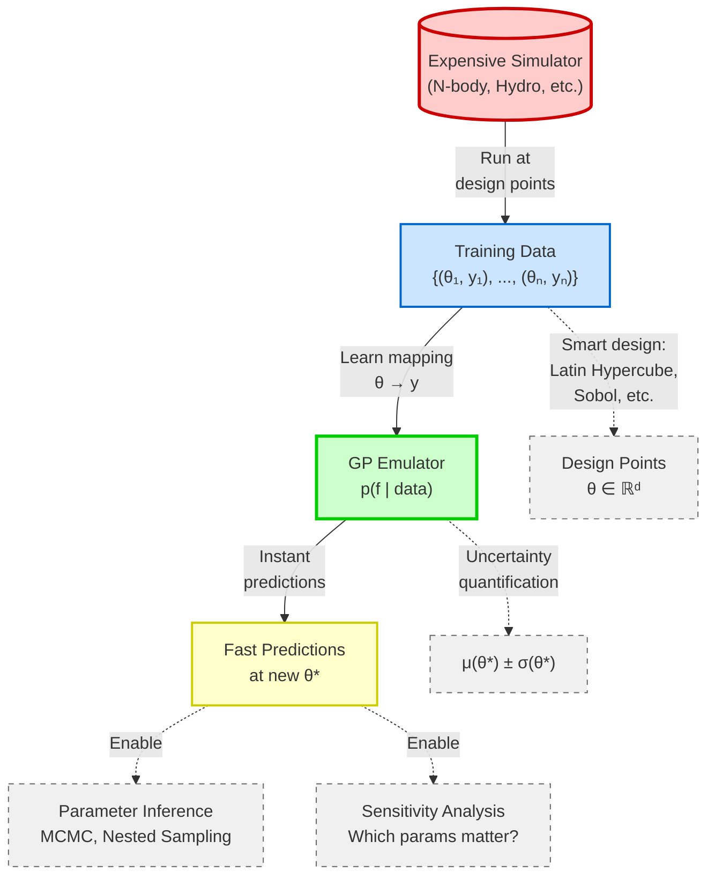

# Figure 1.1: Emulation Workflow

**Location**: After line 35 in Part I (Introduction)
**Pedagogical Goal**: Provide high-level overview before diving into mathematical details

## Key Insight

**The Problem**: Running simulator 10⁶ times for MCMC is impossible (years of compute)

**The Solution**: Run simulator ~100 times → Train GP → Query GP 10⁶ times in seconds

**The Magic**: GP provides both prediction μ(θ) AND uncertainty σ(θ), enabling:
- Trustworthy predictions with error bars
- Adaptive sampling (add more training data where uncertain)
- Rigorous parameter inference (uncertainty propagation in MCMC)

## Example: N-body Cluster Evolution

- **Expensive**: N-body simulation (30 min/run, 3 parameters)
- **Training**: 100 LHS runs → 50 hours total
- **GP Training**: ~1 second
- **Predictions**: 10⁶ predictions in ~10 seconds
- **Speedup**: ~200,000× faster than direct simulation!
