# Figure 5.1: Emulation Method Decision Tree

**Location**: End of Part I (Choosing a Method section)
**Pedagogical Goal**: Help students navigate the emulation landscape and choose appropriate methods

```mermaid
flowchart TD
    Start["Need to emulate<br/>expensive simulator?"] --> Q1{"Dimensionality<br/>d = ?"}

    %% Low dimensional branch
    Q1 -->|"d ≤ 5<br/>(low dim)"| Q2{"Need uncertainty<br/>quantification?"}
    Q2 -->|"Yes"| Q3{"Training data<br/>size n = ?"}
    Q3 -->|"n < 1000"| GP_SE["✓ Use Standard GP<br/>(SE or Matérn kernel)"]
    Q3 -->|"1000 ≤ n < 10⁴"| GP_Sparse["✓ Use Sparse GP<br/>(inducing points)"]
    Q3 -->|"n ≥ 10⁴"| GP_Deep["✓ Use Deep GP<br/>or BNN"]

    Q2 -->|"No (point<br/>estimates OK)"| AltLow["Consider:<br/>• Polynomial Chaos<br/>• Random Forests<br/>• Gradient Boosting"]

    %% Medium dimensional branch
    Q1 -->|"5 < d ≤ 20<br/>(medium dim)"| Q4{"Smooth output<br/>function?"}
    Q4 -->|"Yes"| Q5{"Can identify<br/>important params?"}
    Q5 -->|"Yes"| GP_ARD["✓ Use GP with ARD<br/>(auto feature selection)"]
    Q5 -->|"No"| Q6{"Training budget<br/>n = ?"}
    Q6 -->|"n ≥ 10×d²"| GP_ARD2["✓ Use GP with ARD<br/>(will learn importance)"]
    Q6 -->|"n < 10×d²"| Warning1["⚠ Insufficient data!<br/>Consider:<br/>• Dimension reduction<br/>• Active subspaces<br/>• Sensitivity analysis"]

    Q4 -->|"No (discontinuous,<br/>noisy)"| AltMed["Consider:<br/>• Random Forests<br/>• XGBoost<br/>• Neural Networks"]

    %% High dimensional branch
    Q1 -->|"d > 20<br/>(high dim)"| Q7{"Structured<br/>problem?"}
    Q7 -->|"Yes (images,<br/>sequences)"| NN["✓ Use Deep Learning<br/>• CNNs for images<br/>• RNNs for sequences<br/>• Transformers"]
    Q7 -->|"No (tabular)"| Q8{"Can reduce<br/>dimensions?"}
    Q8 -->|"Yes"| DimRed["1. Dimension reduction<br/>(PCA, autoencoders)<br/>2. GP on latent space"]
    Q8 -->|"No"| AltHigh["Consider:<br/>• Polynomial Chaos<br/>• Gradient Boosting<br/>• Ensemble methods<br/><br/>⚠ GPs struggle here!"]

    %% Styling
    classDef recommended fill:#ccffcc,stroke:#00cc00,stroke-width:3px
    classDef warning fill:#ffcccc,stroke:#cc0000,stroke-width:2px
    classDef alternative fill:#ffffcc,stroke:#cccc00,stroke-width:2px
    classDef question fill:#cce5ff,stroke:#0066cc,stroke-width:2px

    class GP_SE,GP_Sparse,GP_ARD,GP_ARD2,GP_Deep,NN,DimRed recommended
    class Warning1 warning
    class AltLow,AltMed,AltHigh alternative
    class Start,Q1,Q2,Q3,Q4,Q5,Q6,Q7,Q8 question
```

## Quick Reference Table

| Method | Best For | Pros | Cons | Training Cost |
|--------|----------|------|------|---------------|
| **Standard GP** | d ≤ 5, n < 1000 | • Uncertainty quantification • Small data • Interpretable | • O(n³) cost • Struggles with d > 10 | O(n³) |
| **GP with ARD** | 5 < d ≤ 20 | • Auto feature selection • Identifies important params • Uncertainty | • Needs n ≥ 10d² • O(n³) cost | O(n³) |
| **Sparse GP** | Large n | • Scales to n ~ 10⁴ • Maintains uncertainty | • Approximation • More hyperparams | O(nm²) |
| **Deep GP** | Complex functions | • Compositional structure • Captures deep patterns | • Harder to train • Less interpretable | O(nm²L) |
| **Polynomial Chaos** | Low d, smooth | • Fast predictions • Analytical moments | • No auto uncertainty • Poor for non-smooth | O(nd) |
| **Neural Networks** | High d, large n | • Scales to d ~ 100s • Flexible | • Needs lots of data • No uncertainty (unless BNN) | O(epochs×n) |
| **Random Forests** | Non-smooth, medium d | • Handles discontinuities • Robust | • No smooth interpolation • Limited UQ | O(n log n) |

## Decision Rules of Thumb

### ✓ Use GPs when:
- You need rigorous uncertainty quantification
- Training data is expensive (n < 1000)
- Output function is smooth
- Dimensionality d ≤ 20 (with ARD)
- You want interpretable lengthscales

### ⚠ Avoid GPs when:
- Dimensionality d > 50 (without structure)
- Training set size n > 10,000 (use sparse GP instead)
- Output is discontinuous or has sharp transitions
- You only care about point predictions (no uncertainty needed)

### Training Data Requirements

**Minimum recommended sample sizes**:
- **d ≤ 5**: n ≥ 50 (10 per dimension)
- **5 < d ≤ 10**: n ≥ 100 (LHS or Sobol)
- **10 < d ≤ 20**: n ≥ 10d² with ARD (e.g., n ≥ 200 for d=10)
- **d > 20**: Consider dimension reduction first

**Why these numbers?**
- Need to fill parameter space
- SE kernel correlation length ~ ℓ (typically 0.1-0.5 in normalized units)
- Need points within ~2ℓ of any prediction location
- With d dimensions, this requires exponentially more points (curse of dimensionality!)
