## Quick Navigation Guide

### 🎯 Choose Your Learning Path

::::{grid} 1 1 3 3
:gutter: 3

:::{grid-item-card} 🏃 **Fast Track**
Essential concepts only

- [Statistical Vocabulary](#statistical-vocabulary)
- [Temperature as a Parameter](#temperature-lie)
- [Pressure from Statistics](#pressure-emerges)  
- [Maximum Entropy Basics](#maximum-entropy)
- [Part 1 Synthesis](#part-1-synthesis)
:::

:::{grid-item-card} 🚶 **Standard Path**
Full conceptual understanding

- Everything in Fast Track, plus:
- [Central Limit Theorem](#central-limit)
- [Correlation and Independence](#correlation)
- [Marginalization](#marginalization)
- [Moments](#moments)
- [All "What We Just Learned" boxes]
:::

:::{grid-item-card} 🧗 **Complete Path**
Deep dive with all details (2+ hours)

- Complete module including:
- All mathematical derivations
- [Ergodicity](#ergodicity)
- [Error Propagation](#error-propagation)
- Thought experiments
- Mathematical Deep Dives
:::
::::

### 🎯 Navigation by Project Needs

:::{admonition} Quick Jump to What You Need by Project
:class: tip, dropdown

**For Project 1 (Stellar Populations)**:
- [Temperature as Parameter](#temperature-lie) - Understanding distribution parameters
- [Moments](#moments) - Population statistics  
- [Random Sampling](#random-sampling) - Generating stellar populations

**For Project 2 (N-body Dynamics)**:
- [Section 3: Random Sampling](#random-sampling) - Complete initial conditions
- [Kroupa IMF Sampling](#kroupa-imf) - Realistic mass distributions
- [Plummer Sphere](#plummer-sphere) - Spatial distributions
- [Central Limit Theorem](#central-limit) - Why cluster properties are stable
- [Error Propagation](#error-propagation) - Understanding numerical errors

**For Project 3 (Monte Carlo Radiative Transfer)**:
- [Maximum Entropy](#maximum-entropy) - Why exponentials appear in opacities
- [Marginalization](#marginalization) - Integrating over photon angles
- [Error Propagation](#error-propagation) - Monte Carlo convergence rates
- [Inverse Transform](#inverse-transform) - Sampling path lengths

**For Project 4 (MCMC)**:
- [Ergodicity](#ergodicity) - Why MCMC works fundamentally
- [Correlation](#correlation) - Understanding autocorrelation times
- [Central Limit Theorem](#central-limit) - Chain convergence diagnostics
- [Moments](#moments) - Posterior statistics

**For Project 5 (Gaussian Processes)**:
- [Correlation and Covariance](#correlation) - Kernel functions are covariance
- [Maximum Entropy](#maximum-entropy) - GP as max entropy given covariance
- [Marginalization](#marginalization) - Making predictions from joint distributions
- [Moments](#moments) - Understanding GP mean and variance functions

**For Final Project (Neural Networks)**:
- [Temperature Parameter](#temperature-lie) - Softmax temperature
- [Maximum Entropy](#maximum-entropy) - Cross-entropy loss
- [Moments in ML](#moments-ml) - Batch normalization
- [Central Limit Theorem](#central-limit) - Why batch training works
:::

:::{admonition} 💭 Why This Module Exists: A Personal Note from Your Instructor
:class: note, dropdown

**This module has a secret mission**: teaching you probability and statistics through physical intuition, using statistical mechanics as our vehicle. Traditional statistics courses bombard you with abstract concepts — random variables, distributions, hypothesis tests — without ever explaining why these ideas matter or where they come from. Traditional stat mech is equally painful: memorizing partition functions without understanding what temperature actually means.

**Here's what statistical mechanics actually is**: the profound realization that when you have enough of anything — atoms, stars, photons, neural network parameters — individual chaos becomes collective order. The same mathematical framework that explains why gases have pressure also explains why neural networks can learn, why MCMC converges, and why we can model stars at all.

This module builds your statistical intuition from the ground up using physics you can visualize. By the end, you'll understand not just the formulas but the deep principles: why large numbers create simplicity rather than complexity, why nature uses exponential distributions, and how random sampling becomes a computational superpower. These aren't separate topics — they're all facets of one beautiful framework that spans from quantum mechanics to machine learning.
:::

## The Big Picture: Order from Chaos Through Statistics

Right now, the air around you contains roughly $10^{25}$ molecules per cubic meter, all moving chaotically at hundreds of meters per second, colliding billions of times per second. Yet you experience perfectly steady pressure and temperature. This seeming paradox—perfect order emerging from absolute chaos — reveals the fundamental truth this module explores: **at large scales, physics IS statistics.**

To see why, let's start with a number that should frighten you: the Sun contains approximately $M_\odot/m_p \sim 10^{57}$ particles. To grasp this magnitude, imagine counting these particles at an impossible rate of one trillion per second. You would need $10^{27}$ times the current age of the universe just to count them all.

Yet somehow, we model the Sun's structure with just four differential equations. How is this possible?

The answer lies in a profound principle: when you have enough of anything, individual details become irrelevant and statistical properties dominate. **Individual chaos creates collective order.** This isn't approximation — at these scales, statistics IS reality, more precise than any measurement could ever be.

```mermaid
flowchart TD
    A[<b>The Sun</b>: 10<sup>57</sup> Individual Particles] --> B[Random Collisions - 10<sup>9</sup> per second]
    B --> C[Statistical Averaging]
    C --> D[Emergent Properties]
    D --> E[Temperature <i>T</i>]
    D --> F[Pressure <i>P</i>]
    D --> G[Density <i>ρ</i>]
    E --> H[Just 4 Differential Equations]
    F --> H
    G --> H
    style A fill:#f9f,stroke:#333,stroke-width:2px
    style H fill:#9f9,stroke:#333,stroke-width:2px
```



In this module, you'll discover:

- Why temperature doesn't exist for individual particles but emerges from distributions
- How the Central Limit Theorem makes physics predictable
- Why correlation and independence matter for everything from gas pressure to neural networks
- How entropy connects information theory to thermodynamics
- Why random sampling can solve problems that defeat analytical methods

These aren't just physics concepts — they're the foundation of all quantitative reasoning, from machine learning to financial modeling to understanding the universe itself.

:::{admonition} 📊 Statistical Insight: The Universal Pattern
:class: important

Throughout this module, watch for this recurring pattern:

1. **Many random components** → Statistical distributions emerge
2. **Large numbers** → Central Limit Theorem applies
3. **Constraints + maximum entropy** → Natural distributions appear
4. **Time evolution** → Ergodic behavior emerges
5. **Random sampling** → Computational solutions become possible

This pattern appears in every computational method you'll learn, from Monte Carlo simulations to neural networks to MCMC sampling.
:::

## Learning Objectives

By the end of this module, you will understand:

- [ ] **(1) Why temperature doesn't exist** for individual particles — it's a distribution parameter
- [ ] **(2) How the Central Limit Theorem** creates predictability from randomness  
- [ ] **(3) Why correlation matters** and how independence simplifies problems
- [ ] **(4) How pressure arises** purely from momentum transfer statistics
- [ ] **(5) Why maximum entropy** gives the least biased probability distributions
- [ ] **(6) What ergodicity means** and why it makes MCMC possible
- [ ] **(7) How marginalization** reduces complex problems to tractable ones
- [ ] **(8) How error propagates** and why Monte Carlo errors scale as $1/\sqrt{N}$
- [ ] **(9) How to sample** from any astrophysical distribution computationally

---

## Part 1: The Foundation - Statistical Mechanics from First Principles

:::{admonition} 📖 Probability Notation: Your Foundation for Bayesian Inference
:class: important

Before we connect physics to statistics, let's establish the probability notation you'll use throughout this course and especially in **Project 4** (MCMC/Bayesian Inference).

### Basic Probability Notation

| Notation | Meaning | Example |
|----------|---------|---------|
| $P(A)$ | Probability of event A | $P(\text{heads}) = 0.5$ |
| $P(A, B)$ or $P(A \cap B)$ | Joint probability of A AND B | $P(\text{hot}, \text{dense})$ |
| $P(A \cup B)$ | Probability of A OR B | $P(\text{heads} \cup \text{tails}) = 1$ |
| $P(A|B)$ | Conditional probability of A given B | $P(\text{fusion}|\text{high T})$ |
| $P(\neg A)$ or $P(A^c)$ | Probability of NOT A | $P(\neg \text{heads}) = 0.5$ |

### Key Relationships

**Product Rule** (foundation of Bayesian inference):
$$P(A, B) = P(A|B) \cdot P(B) = P(B|A) \cdot P(A)$$

**Sum Rule** (marginalization):
$$P(A) = \sum_i P(A, B_i) = \sum_i P(A|B_i) \cdot P(B_i)$$

**Bayes' Theorem** (the heart of Project 4):
$$P(A|B) = \frac{P(B|A) \cdot P(A)}{P(B)}$$

Or in parameter inference notation:
$$P(\theta|\text{data}) = \frac{P(\text{data}|\theta) \cdot P(\theta)}{P(\text{data})}$$
$$\text{posterior} = \frac{\text{likelihood} \times \text{prior}}{\text{evidence}}$$

### Statistical Mechanics Connection

In this module, we use probability to describe particle distributions:

| Physics | Probability Notation | Meaning |
|---------|---------------------|---------|
| $f(v)$ | $P(v)$ or $p(v)$ | Probability density for velocity |
| $\langle A \rangle$ | $E[A]$ or $\mathbb{E}[A]$ | Expectation value/ensemble average |
| $\int f(v) dv = 1$ | $\int P(v) dv = 1$ | Normalization |
| Partition function $Z$ | $P(\text{total}) = 1$ | Normalization constant |

**Why This Matters**: Every physics concept in this module is secretly probability theory. When we say "temperature characterizes the velocity distribution," we mean temperature is a parameter of $P(v)$. When we compute pressure as an ensemble average, we're calculating $E[\text{momentum transfer}]$. Statistical mechanics IS applied probability theory.
:::

(statistical-vocabulary)=
:::{admonition} 📖 Statistical Vocabulary: Your Physics-to-Statistics Rosetta Stone
:class: important

Before diving in, let's establish the connection between physics language and statistical language. This module teaches statistical concepts through physics, so understanding these parallels is crucial.

| Physics Term | Statistical Equivalent | What It Means | First Appears |
|-------------|------------------------|---------------|---------------|
| **Temperature** $(T)$ | Distribution parameter | Controls the width/spread of velocity distribution | [Section 1.1](#temperature-lie) |
| **Pressure** $(P)$ | Ensemble average of momentum transfer | Mean value over all possible microstates | [Section 1.2](#pressure-emerges) |
| **Thermal equilibrium** | Stationary distribution | Distribution that doesn't change with time | [Section 1.7](#ergodicity) |
| **Partition function** $(Z)$ | Normalization constant | Ensures probabilities sum to 1 | [Section 1.3](#maximum-entropy) |
| **Ensemble** | Sample space | Set of all possible microscopic states | [Section 1.2](#pressure-emerges) |
| **Correlation** | Statistical dependence | How variables relate to each other | [Section 1.5](#correlation) |
| **Ergodicity** | Time average = ensemble average | Long-time behavior equals average over all states | [Section 1.7](#ergodicity) |

**Key insight**: Every physics concept teaches a fundamental statistical principle. When we say "temperature doesn't exist for one particle," we're really saying "you can't characterize a distribution with a single sample."
:::

(temperature-lie)=
### 1.1 Temperature is a Lie (For Single Particles)

**Priority: 🔴 Essential**

Let's start with something that should bother you: we routinely say "this hydrogen atom has a temperature of 300 K." **This statement is fundamentally meaningless!** A single atom has kinetic energy, momentum, and position—but not temperature. To understand why, we need to confront what you probably think temperature is versus what it actually is.

**The Common Misconception**: You likely learned that temperature measures the average kinetic energy of particles:

$$\langle E_{\text{kinetic}} \rangle = \frac{3}{2}k_B T$$

This leads to thinking "hot = fast particles, cold = slow particles." While not entirely wrong, this is dangerously incomplete. It suggests that a single fast particle is "hot" — but this is meaningless! A single particle moving at 1000 m/s doesn't have temperature any more than a single person has an average height.

**What Temperature Actually Is**: Temperature is a **parameter** that characterizes the *distribution* of particle velocities. It tells you the shape of the velocity histogram, not the speed of any individual particle. Specifically:

- Temperature sets the width (spread) of the Maxwell-Boltzmann distribution
- Higher $T$ → broader distribution → more variety in particle speeds
- Lower $T$ → narrower distribution → particles clustered near mean speed

The relationship $\langle E_{\text{kinetic}} \rangle = \frac{3}{2}k_B T$ is a *consequence* of temperature being the distribution parameter, not the definition of temperature itself.

**The Critical Distinction**:

- **Kinetic energy**: Property of individual particles ($E = \frac{1}{2}mv^2$)
  - A particle HAS kinetic energy
- **Temperature**: Parameter describing the ensemble distribution
  - A distribution IS CHARACTERIZED BY temperature

Think of it this way: asking "what's the temperature of one particle?" is like asking "what's the average of one number?" The question itself is malformed.


:::{margin} Parameter
**Parameter**: A variable that characterizes an entire distribution or model. Unlike individual data points, parameters describe global properties. *Examples:* mean ($\mu$), standard deviation ($\sigma$), temperature ($T$).
:::

Temperature is a **parameter** — a number that characterizes an entire distribution. Just as you can't determine the average height of humans by measuring one person, you can't define temperature from one particle. You need an ensemble.

The Maxwell-Boltzmann distribution describes particle velocities in thermal equilibrium:

$$f(\vec{v}) = n \left(\frac{m}{2\pi k_B T}\right)^{3/2} \exp\left(-\frac{m|\vec{v}|^2}{2k_B T}\right)$$

Here, $T$ isn't a property of any particle — it's the parameter that sets the distribution width:

- Low $T$: narrow distribution, particles clustered near mean velocity
- High $T$: broad distribution, wide range of velocities

**The profound insight**: Temperature relates to the **variance** of the velocity distribution:
$$\langle v_x^2 \rangle = \frac{k_B T}{m}$$

Higher temperature = larger velocity variance = broader distribution. This connection between temperature and variance appears everywhere:

- **Neural networks**: "Temperature" in softmax controls output distribution spread
- **MCMC**: "Temperature" in simulated annealing controls parameter space exploration
- **Optimization**: High temperature = exploration, low temperature = exploitation

**The Equipartition Connection**:

Once you have a Maxwell-Boltzmann distribution characterized by temperature $T$, THEN you can derive:
$$\langle \frac{1}{2}mv_x^2 \rangle = \frac{1}{2}k_B T \quad \text{(per degree of freedom)}$$
$$\langle E_{\text{kinetic,total}} \rangle = \frac{3}{2}k_B T \quad \text{(3D motion)}$$

But remember: these are *consequences* of $T$ being the distribution parameter, not definitions of temperature.

:::{admonition} 🎯 Why This Matters: The Equipartition Theorem
:class: important

The **equipartition theorem** states that energy is shared equally among all quadratic degrees of freedom, with each getting $\frac{1}{2}k_B T$ of energy on average.

**What's a quadratic degree of freedom?**
Any energy term that goes as the square of a variable:

- Kinetic: $E \propto v_x^2$ (also $v_y^2$, $v_z^2$ separately)  
- Harmonic oscillator: $E \propto x^2$ (potential) and $E \propto p^2$ (kinetic)
- Rotation: $E \propto \omega^2$ (angular velocity squared)

**The Universal Result**: Each quadratic term contributes $\frac{1}{2}k_B T$ to the average energy.

**Why this is profound**:

- **Universality**: Doesn't matter if it's translation, rotation, or vibration
- **Predictive power**: Count quadratic terms → know total energy
- **Heat capacity**: Explains why $C_V = \frac{3}{2}Nk_B$ for monatomic gases (3 velocity components)
- **Classical limit**: Breaks down when quantum effects freeze out degrees of freedom

**Example Applications**:

- Monatomic gas: 3 translational DOF → $E = \frac{3}{2}Nk_B T$
- Diatomic gas: 3 translation + 2 rotation → $E = \frac{5}{2}Nk_B T$ (at room temp)
- Solid: 3 kinetic + 3 potential → $E = 3Nk_B T$ (Dulong-Petit law)

**The key insight**: Temperature democratically distributes energy — every quadratic degree of freedom gets an equal share, regardless of its physical nature.
:::

:::{admonition} 🧪 Thought Experiment: Building Temperature
:class: note

Start with 1 particle moving at 500 cm/s. Can you define its temperature?

Now add particles one by one:

- $N=2$: Two particles, different speeds. Can compute variance but not meaningful as temperature yet
- $N=10$: Starting to see a distribution shape emerge
- $N=100$: Clear bell curve forming, temperature becoming measurable
- $N=10,000$: Well-defined Gaussian, $T$ precisely measurable from width

**The insight**: Temperature doesn't suddenly "appear" - it gradually becomes meaningful as $N$ increases. Like trying to define "average human height" - meaningless for one person, fuzzy for 10, precise for millions.
:::

Let's see this computationally:

```python
# Demonstrate temperature as distribution parameter, not particle property
import numpy as np

# Single particle - has energy but no temperature
single_v = 5e4  # cm/s
single_KE = 0.5 * 1.67e-24 * single_v**2  # erg (hydrogen mass in g)

# Ensemble of particles - has temperature
N = 10000
T = 300  # K
m_H = 1.67e-24  # g (hydrogen mass)
k_B = 1.38e-16  # erg/K (Boltzmann constant)
sigma = np.sqrt(k_B * T / m_H)  # Maxwell-Boltzmann width
velocities = np.random.normal(0, sigma, N)

# Temperature emerges from the distribution width
T_measured = m_H * np.var(velocities) / k_B
print(f"Set T: {T} K, Measured from variance: {T_measured:.1f} K")
# The single particle? It has no temperature, just velocity.
```

:::{important} 💡 What We Just Learned
**Temperature is a statistical parameter, not a particle property.** It characterizes the width (variance) of the velocity distribution. This teaches us that macroscopic properties emerge from distributions, not individuals — a principle that applies from thermodynamics to machine learning.
:::

(pressure-emerges)=
### 1.2 Pressure Emerges from Chaos

**Priority: 🔴 Essential**

Here's something remarkable: the steady pressure you feel from the atmosphere emerges from pure chaos. Air molecules hit your skin randomly, from random directions, with random speeds. Yet somehow this randomness produces perfectly steady, predictable pressure. How?

Let's derive this from first principles. Consider a wall being bombarded by particles.

**Single collision**: A particle with velocity $v_x$ perpendicular to the wall transfers momentum:
$$\Delta p = 2mv_x$$

**Statistical averaging**: We can't track individual particles, but we know their distribution. The pressure emerges from the ensemble average:

$$P = nm\langle v_x^2\rangle$$

where $n$ is number density and $\langle \rangle$ denotes ensemble average.

For Maxwell-Boltzmann velocities, $\langle v_x^2 \rangle = k_B T/m$, giving:

$$\boxed{P = nk_B T}$$

The ideal gas law emerges from pure statistics! No empirical fitting, no assumptions beyond random molecular motion.

:::{margin}
**Ensemble Average**
The average value of a quantity over all possible microstates, weighted by their probabilities. Denoted by $\langle \rangle$ brackets.
:::

Let's demonstrate this computationally:

```python
# Pressure emerges from averaging random collisions
N_molecules = 100000
T = 300  # K
m_H = 1.67e-24  # g
k_B = 1.38e-16  # erg/K
sigma = np.sqrt(k_B * T / m_H)  # cm/s

velocities = np.random.normal(0, sigma, N_molecules)  # cm/s

# Each collision transfers momentum
momentum_transfers = 2 * m_H * np.abs(velocities)  # g·cm/s

# But pressure is steady despite random collisions
chunks = np.array_split(momentum_transfers, 100)
chunk_averages = [np.mean(chunk) for chunk in chunks]

print(f"Individual transfers vary by: {np.std(momentum_transfers)/np.mean(momentum_transfers):.1%}")
print(f"Averaged chunks vary by only: {np.std(chunk_averages)/np.mean(chunk_averages):.1%}")
# Demonstrates: chaos → order through averaging
```

**The key insight**: Macroscopic observables are ensemble averages of microscopic quantities:

- **Pressure**: average momentum transfer
- **Current**: average charge flow
- **Magnetization**: average spin alignment
- **Neural network output**: average over dropout masks

This principle — individual randomness + large numbers = predictable averages — makes both physics and machine learning possible.

(central-limit)=
### 1.3 The Central Limit Theorem: Why Everything is Gaussian

**Priority: 🔴 Essential**

You've seen that pressure emerges from averaging over many random collisions. But why is the result so predictable? The answer is one of the most important theorems in mathematics: the **Central Limit Theorem (CLT)**.

:::{admonition} 🎯 The Central Limit Theorem
:class: important

**If you add many independent random variables, their sum approaches a Gaussian distribution, regardless of the original distribution shape.**

Mathematically: If $X_1, X_2, ..., X_n$ are independent random variables with mean $\mu$ and variance $\sigma^2$, then:

$$\frac{\sum_{i=1}^n X_i - n\mu}{\sigma\sqrt{n}} \xrightarrow{n \to \infty} \mathcal{N}(0,1)$$

The normalized sum converges to a standard Gaussian.
:::

```{mermaid}
graph TD
    A[Random Variable 1] --> D[Sum of N Variables]
    B[Random Variable 2] --> D
    C[Random Variable N] --> D
    D --> E[Large N]
    E --> F[Gaussian Distribution]
    style F fill:#9f9,stroke:#333,stroke-width:2px
```

**Why this matters for physics**: Every macroscopic quantity is a **sum** over many particles:

- **Pressure** = sum of momentum transfers
- **Energy** = sum of particle energies
- **Magnetization** = sum of spin alignments

The CLT guarantees these sums have Gaussian distributions around their means!

**Example: Velocity of a dust grain**

A dust grain in air gets hit by ~$10^{10}$ molecules per second. Each collision imparts a random momentum kick. By CLT:

- Individual kicks: random, unpredictable
- Sum of kicks: Gaussian distribution
- Result: Brownian motion with Gaussian velocity distribution

This is why we see Gaussians everywhere:

- **Measurement errors**: sum of many small random errors
- **Stellar velocities**: sum of many gravitational interactions
- **Neural network weights**: initialized as Gaussian (sum of many small updates)

**The profound implication**: We don't need to know the details of individual interactions. The CLT guarantees that collective behavior will be Gaussian, making physics predictable despite underlying chaos.

:::{admonition} 🤔 Quick Check: When CLT Fails
:class: hint

The CLT requires independence and finite variance. When do these fail in astrophysics?

Think about: gravitational systems, power-law distributions, correlated variables.

Answer: 
- **Gravity**: Long-range forces create correlations (not independent)
- **Power laws**: Some have infinite variance (e.g., Cauchy distribution)
- **Phase transitions**: Critical points have diverging correlations
- **Small N**: Need many particles for CLT to apply

When CLT fails, we get non-Gaussian behavior: fat tails, levy flights, anomalous diffusion.
:::

:::{admonition} 🎯 Conceptual Checkpoint
:class: note

Before proceeding, ensure you understand:
- Why can't temperature exist for one particle?
- How does random molecular chaos create steady pressure?
- Why do sums of random variables become Gaussian?

If any of these feel unclear, revisit the relevant section before continuing.
:::

(maximum-entropy)=
### 1.4 The Maximum Entropy Principle

**Priority: 🔴 Essential**

Why does the Maxwell-Boltzmann distribution appear universally? Why exponentials? The answer connects physics, information theory, and machine learning: nature chooses the **least biased** distribution consistent with constraints.

:::{admonition} 🎯 Why This Matters: What "Least Biased" Really Means
:class: important

When we say "least biased" or "maximum entropy," we mean: **"I will admit my ignorance about everything I don't actually know."**

**The Honest Inference Problem**: 
You know the average energy of $10^{57}$ particles is $E_0$. That's it. What distribution should you assume for individual particle energies?

**Option 1 (Dishonest)**: "I'll assume they're all clustered near the average"
- This assumes knowledge you don't have
- Adds fake information not in your constraints
- Will give wrong predictions

**Option 2 (Maximum Entropy)**: "I'll assume the broadest distribution consistent with average energy $E_0$"
- Admits ignorance about everything except the average
- Doesn't invent patterns that might not exist
- Most likely to be right

**Maximum entropy is intellectual honesty in mathematical form.**

**The Procedure**:
1. List what you actually know (constraints)
2. Find the probability distribution that:
   - Satisfies your constraints
   - Has maximum uncertainty (entropy) about everything else
3. This distribution makes no claims beyond your actual knowledge

**Why Nature Uses It**:

- Collisions randomize velocities → maximum entropy given energy
- Light scattering randomizes photons → blackbody spectrum
- Heat flow randomizes energy → thermal equilibrium

**In Machine Learning**:

- Don't know class probabilities? Use uniform prior (max entropy with no constraints)
- Know only mean and variance? Use Gaussian (max entropy with those constraints)  
- Softmax is literally the max entropy distribution for classification

**The Deep Truth**: Maximum entropy isn't about what nature "prefers" — it's about what happens when you have many random interactions and limited constraints. It's the distribution you'll inevitably get because there are vastly more ways to be high-entropy than low-entropy.
:::

**The setup**: You know the average energy but nothing else about $10^{57}$ particles. What distribution should you assume?

**The principle**: Choose the distribution that maximizes entropy:
$$S = -k_B \sum_i p_i \ln p_i$$

This is the most honest choice — it assumes the least beyond what you know.

**The mathematical solution** (using Lagrange multipliers for constraints):
- Constraint 1: Probabilities sum to 1
- Constraint 2: Average energy is fixed
- Result: $p_i \propto e^{-E_i/k_B T}$

Temperature emerges as the Lagrange multiplier for the energy constraint!

**Why this matters everywhere**:

| Field | Maximum Entropy Application |
|-------|----------------------------|
| **Physics** | Boltzmann distribution for particles |
| **Information Theory** | Optimal compression and coding |
| **Machine Learning** | Softmax for classification |
| **Bayesian Inference** | Least informative priors |
| **Image Processing** | Deblurring and reconstruction |

**The deep connection**: The softmax function in neural networks IS the Boltzmann distribution:
$$p(class_i) = \frac{e^{z_i/T}}{\sum_j e^{z_j/T}}$$

Same math, different labels. Temperature controls exploration vs exploitation in both physics and ML.

(correlation)=
### 1.5 Correlation and Independence: When Variables Connect

**Priority: 🔴 Essential**

So far, we've assumed particle velocities are independent. But what if they're not? Understanding correlation is crucial for everything from gas dynamics to Gaussian processes.

:::{admonition} 📊 Statistical Insight: Correlation vs Independence
:class: important

**Independence**: $P(A \text{ and } B) = P(A) \times P(B)$
Variables don't influence each other.

**Correlation**: Measure of linear relationship
$$\rho_{XY} = \frac{\text{Cov}(X,Y)}{\sigma_X \sigma_Y} = \frac{E[(X-\mu_X)(Y-\mu_Y)]}{\sigma_X \sigma_Y}$$

Ranges from -1 (perfect anti-correlation) to +1 (perfect correlation).

**Covariance**: Unnormalized correlation
$$\text{Cov}(X,Y) = E[(X-\mu_X)(Y-\mu_Y)] = E[XY] - E[X]E[Y]$$

If independent: $\text{Cov}(X,Y) = 0$ (but reverse isn't always true!)
:::

**Physical examples of correlation**:

1. **Ideal gas**: Particle velocities are independent
   - Pressure tensor is diagonal: $P_{ij} = P\delta_{ij}$
   - No shear stress, no viscosity

2. **Stellar streams**: Velocities are correlated
   - Stars moving together have correlated velocities
   - Off-diagonal pressure terms represent streaming motion

3. **Turbulence**: Strong velocity correlations
   - Eddies create correlated motion
   - Kolmogorov spectrum from correlation functions

**Why correlation matters for your projects**:

**Project 2 (N-body)**: Initially uncorrelated velocities become correlated through gravity

**Project 4 (MCMC)**: Autocorrelation determines effective sample size
- High correlation = slow exploration
- Need to account for correlation in error estimates

**Project 5 (Gaussian Processes)**: Entire method based on correlation!
- Covariance kernel defines correlation between points
- Predictions use correlations to interpolate

:::{warning}
**Common Pitfall**: Zero correlation does NOT imply independence! Two variables can be uncorrelated but still dependent (e.g., $X$ and $X^2$ when $X$ is symmetric around zero).
:::

**The key insight**: Independence makes problems tractable (can multiply probabilities). Correlation makes problems realistic (real systems have relationships). Understanding when to assume independence and when to model correlation is crucial for both physics and ML.

(marginalization)=
### 1.6 Marginalization: The Art of Ignoring

**Priority: 🔴 Essential**

We have velocities in 3D but often need just speeds. We know positions and velocities but only care about energy. How do we extract what matters? Through **marginalization** — integrating out unwanted variables.

:::{margin} Marginalization
**Marginalization**: Integrating out variables you don't care about from a joint distribution. Named because you sum along the "margins" of a table.
:::

**The mathematical operation**:
$$P(x) = \int P(x,y) dy$$

"Sum over all possible values of what you don't care about."

**Example: From 3D velocities to 1D speeds**

Starting with Maxwell-Boltzmann in 3D:
$$f(\vec{v}) = n \left(\frac{m}{2\pi k_B T}\right)^{3/2} e^{-m|\vec{v}|^2/2k_B T}$$

To get speed distribution, integrate over all directions $(d\Omega)$:
$$f(v) = \int f(\vec{v}) \, d\Omega = 4\pi v^2 f(v)$$

 is the sThe $v^2$ factor appears from the spherical shell area — more ways to have large speeds than small speeds!

**Marginalization appears everywhere**:

| Context | Marginalizing Over | To Get |
|---------|-------------------|--------|
| **Bayesian inference** | Nuisance parameters | Posterior of interest |
| **Gaussian Processes** | Unobserved points | Predictions at test points |
| **Statistical mechanics** | Microscopic details | Macroscopic observables |
| **Neural networks** | Hidden layers | Output predictions |
| **Image processing** | Noise dimensions | Clean signal |

**The profound pattern**: Complex high-dimensional problem → Marginalize → Simple low-dimensional answer

This is how we go from $10^{57}$ particle coordinates to 4 stellar structure equations!

(ergodicity)=
### 1.7 Ergodicity: When Time Equals Ensemble

**Priority: 🟡 Standard Path**

You measure the pressure of a gas over time. You also calculate the ensemble average over all possible microstates. Remarkably, these give the same answer. This is **ergodicity** — one of the deepest principles in statistical mechanics.

Let's build intuition with a simple example first:

```python
# Ergodicity: time average = ensemble average
# Flip a coin many times (time) vs many coins once (ensemble)

# Time average: one coin, many flips
flips_over_time = np.random.choice([0,1], 10000)
time_avg = np.mean(flips_over_time)

# Ensemble average: many coins, one flip each  
ensemble_flips = np.random.choice([0,1], 10000)
ensemble_avg = np.mean(ensemble_flips)

print(f"Time average: {time_avg:.3f}")
print(f"Ensemble average: {ensemble_avg:.3f}")
# Both → 0.5! This is ergodicity.
```

:::{admonition} 🎯 The Ergodic Hypothesis
:class: important

**For ergodic systems**:
$$\langle A \rangle_{\text{time}} = \lim_{T \to \infty} \frac{1}{T} \int_0^T A(t) dt = \langle A \rangle_{\text{ensemble}}$$

Time averages equal ensemble averages.

**Requirements**:
1. System explores all accessible states given enough time
2. No "stuck" regions in phase space
3. Sufficient mixing/randomization
:::

**Why ergodicity matters**:

**For physics**: We can't measure ensemble averages directly (need all possible microstates). But we can measure time averages! Ergodicity says they're the same.

**For MCMC (Project 4)**: Your Markov chain explores parameter space over "time" (iterations). Ergodicity guarantees:
- Chain average → true posterior expectation
- One long chain equivalent to many independent samples
- Burn-in = waiting for ergodic exploration to begin

**For molecular dynamics**: Simulate one system over time instead of many systems at once

**When ergodicity fails**:
- **Glasses**: Stuck in local configuration (non-ergodic)
- **Broken symmetry**: System can't access all states
- **Isolated systems**: No mixing between regions

**The profound connection**: Ergodicity links:
- Theoretical (ensemble averages)
- Computational (time evolution)
- Experimental (time measurements)

All give the same answer for ergodic systems!

:::{important} 💡 What We Just Learned
**Ergodicity ensures that watching one system evolve over time tells us about all possible states.** This is why MCMC works, why molecular dynamics simulations are valid, and why time-averaged measurements match statistical predictions.
:::

### 1.8 The Law of Large Numbers: Why Statistics Works

**Priority: 🔴 Essential**

All these statistical principles work because of a mathematical miracle: as $N \to \infty$, randomness vanishes.

**The Law of Large Numbers (LLN)**:
For $N$ independent random variables, the relative fluctuation scales as:
$$\frac{\sigma}{\langle X \rangle} \sim \frac{1}{\sqrt{N}}$$

**What this means**:
- $N = 100$: ~10% fluctuations
- $N = 10^6$: ~0.1% fluctuations
- $N = 10^{23}$: ~$10^{-11}$% fluctuations
- $N = 10^{57}$ (Sun): ~$10^{-28}$% fluctuations

At stellar scales, fluctuations are smaller than quantum uncertainty!

**This is why**:
- Pressure is steady despite chaotic collisions
- Stars shine steadily despite random fusion events
- Thermodynamics works despite molecular chaos
- Monte Carlo methods converge despite using random numbers

This $\sqrt{N}$ scaling has profound implications for how errors propagate through calculations, which we'll explore next.

(error-propagation)=
### 1.9 Error Propagation: The Universal $\sqrt{N}$ Scaling

**Priority: 🟡 Standard Path**

Every measurement has uncertainty. Every calculation propagates these uncertainties. Understanding error propagation is crucial for both physics and computation. The Law of Large Numbers tells us fluctuations scale as $1/\sqrt{N}$ — now let's see how this propagates through calculations.

:::{admonition} 📊 Error Propagation Rules
:class: important

**For independent variables**:

**Addition/Subtraction**: $z = x \pm y$
$$\sigma_z^2 = \sigma_x^2 + \sigma_y^2$$
Errors add in quadrature.

**Multiplication by constant**: $z = cx$
$$\sigma_z = |c|\sigma_x$$

**General function**: $z = f(x,y,...)$
$$\sigma_z^2 = \left(\frac{\partial f}{\partial x}\right)^2\sigma_x^2 + \left(\frac{\partial f}{\partial y}\right)^2\sigma_y^2 + ...$$

**For correlated variables**, include covariance terms:
$$\sigma_z^2 = ... + 2\frac{\partial f}{\partial x}\frac{\partial f}{\partial y}\text{Cov}(x,y)$$
:::

```{mermaid}
flowchart LR
    A[N Samples] --> B[Error scales as N<sup>-1/2</sup>]
    B --> C[Want 10x Accuracy]
    C --> D[Need 100x Samples]
    B --> F[Monte Carlo]
    B --> G[MCMC]
    B --> H[N-body]
```

**Monte Carlo error scaling**:

For $N$ samples, the error in the mean scales as:
$$\sigma_{\bar{x}} = \frac{\sigma}{\sqrt{N}}$$

This $1/\sqrt{N}$ scaling is universal:
- Want 10× better accuracy? Need 100× more samples
- Diminishing returns as $N$ increases
- Why Monte Carlo can be slow but always converges

**Application to your projects**:

**Project 2**: Energy conservation error accumulates as $\sqrt{N_{\text{steps}}}$

**Project 3**: Monte Carlo photon error decreases as $1/\sqrt{N_{\text{photons}}}$

**Project 4**: MCMC error includes autocorrelation:
$$\sigma_{\text{MCMC}} = \frac{\sigma}{\sqrt{N_{\text{eff}}}} \text{ where } N_{\text{eff}} = \frac{N}{1 + 2\tau}$$

Here $\tau$ is the autocorrelation time.

(part-1-synthesis)=
### Part 1 Synthesis: The Statistical Foundation

:::{admonition} 🎯 Consolidating Your Foundation
:class: important

You've learned nine fundamental concepts that underpin all of statistics:

1. **Temperature as parameter**: Macroscopic properties characterize distributions
2. **Pressure from chaos**: Ensemble averages create order
3. **Central Limit Theorem**: Why Gaussians appear everywhere
4. **Maximum entropy**: Least biased distributions given constraints
5. **Correlation**: How variables relate to each other
6. **Marginalization**: Extracting what matters by integrating out the rest
7. **Ergodicity**: Time averages equal ensemble averages
8. **Law of Large Numbers**: Large $N$ creates certainty from randomness
9. **Error propagation**: How uncertainty flows through calculations

These aren't separate ideas — they're facets of one framework that explains why:

- We can model stars despite $10^{57}$ particles
- MCMC can explore complex posteriors
- Neural networks can learn from data
- Monte Carlo methods solve intractable problems

**The universal pattern**: Many random components + constraints + large numbers = predictable behavior
:::

---

## Bridge to Part 2: From Principles to Practice

You now understand that macroscopic properties emerge from distributions, not individuals. Next, we'll see how to extract useful information from these distributions using moments — the mathematical tools that compress $10^{57}$ particles into a handful of numbers.

(moments)=
## Part 2: Moments - The Statistical Bridge to Physics

### 2.1 What Are Moments? The Information Extractors

**Priority: 🔴 Essential**

You have a distribution with $10^{57}$ particles. How do you extract useful information without tracking every particle? The answer is **moments** — weighted averages that capture essential features.

For any distribution $f(v)$, the $n$-th moment is:

$$\boxed{M_n = \int_{-\infty}^{\infty} v^n f(v) dv = \langle v^n \rangle = E[v^n]}$$

Think of moments as increasingly sophisticated summaries:

- **1st moment**: Where is the distribution centered? (mean)
- **2nd moment**: How spread out is it? (relates to variance)
- **3rd moment**: Is it skewed? (asymmetry)
- **4th moment**: How heavy are the tails? (extreme events)

### 2.2 Why Moments Matter Statistically

**Priority: 🔴 Essential**

Moments are the fundamental tools for characterizing distributions:

| Moment | Statistical Name | Physical Meaning | Formula |
|--------|-----------------|------------------|---------|
| 1st | Mean | Average value | $\mu = E[X]$ |
| 2nd central | Variance | Spread around mean | $\sigma^2 = E[(X-\mu)^2]$ |
| 3rd standardized | Skewness | Asymmetry | $\gamma_1 = E[(X-\mu)^3]/\sigma^3$ |
| 4th standardized | Kurtosis | Tail weight | $\gamma_2 = E[(X-\mu)^4]/\sigma^4 - 3$ |

**The moment generating function** encodes all moments:
$$M(t) = E[e^{tX}] = \sum_{n=0}^{\infty} \frac{t^n}{n!}E[X^n]$$

Taylor expand and each coefficient gives a moment!

**Why few moments often suffice**:
- **Gaussian**: Completely determined by first two moments
- **Most distributions**: First 3-4 moments capture ~95% of behavior
- **Physics**: Conservation laws involve only low moments

### 2.3 Example: Moments of Maxwell-Boltzmann

**Priority: 🔴 Essential**

Let's extract physics from the Maxwell-Boltzmann distribution using moments.

For 1D velocity: $f(v_x) = n\sqrt{\frac{m}{2\pi k_B T}} e^{-mv_x^2/2k_B T}$

**First moment** (mean velocity):
$$\langle v_x \rangle = 0$$
Symmetric distribution — no net flow.

**Second moment** (mean square velocity):
$$\langle v_x^2 \rangle = \frac{k_B T}{m}$$

This IS temperature! Temperature literally is the second moment of velocity.

**Connection to pressure**:
$$P = nm\langle v_x^2 \rangle = nk_B T$$

Pressure is mass density times velocity variance!

**The profound realization**:

- Temperature = variance parameter
- Pressure = density × variance
- Not analogies — mathematical identities!

(moments-ml)=
### 2.4 Moments in Machine Learning

**Priority: 🔴 Essential**

The moment concept is fundamental to ML:

:::{admonition} 📊 Moments Everywhere in ML
:class: important

**Batch Normalization** computes moments:
```python
# For each mini-batch
batch_mean = np.mean(x, axis=0)        # 1st moment
batch_var = np.var(x, axis=0)          # 2nd central moment
normalized = (x - batch_mean) / np.sqrt(batch_var + eps)
```

**Optimization uses moment estimates**:
```python
# SGD with momentum (1st moment)
velocity = momentum * velocity - lr * gradient

# Adam (1st and 2nd moments)
m = beta1 * m + (1-beta1) * gradient     # 1st moment
v = beta2 * v + (1-beta2) * gradient**2  # 2nd moment
```

**Feature extraction IS moment computation**:
- Image statistics: mean, variance of pixels
- Time series: statistical moments over windows
- NLP: tf-idf is essentially first moment weighting
:::

**The universal principle**: Whether extracting features from data or deriving physics from distributions, moments compress information while preserving what matters.

### Part 2 Synthesis: Moments Bridge Statistics and Physics

:::{admonition} 🎯 What We Just Learned
:class: important

**Moments are universal information extractors**:

1. **Definition**: $E[X^n]$ captures increasingly detailed distribution features
2. **Few moments = much information**: Often 2-4 moments suffice
3. **Physical meaning**: Temperature IS variance, pressure IS second moment
4. **ML applications**: From batch norm to optimization
5. **The bridge**: Same math extracts physics from particles or features from data

In Module 2b, you'll see how taking moments of the Boltzmann equation gives conservation laws. But conceptually, it's just statistical summarization — exactly what you do in data analysis!
:::

:::{admonition} 🎯 Conceptual Checkpoint
:class: note

Before moving to computational applications, check your understanding:

- What information does each moment extract from a distribution?
- Why is temperature related to the second moment of velocity?
- How do moments appear in machine learning algorithms you know?

Ready? Let's make these ideas computational!
:::

---

## Bridge to Part 3: From Understanding to Implementation

You understand the principles and can extract information using moments. Now comes the crucial step: generating samples from these distributions computationally. This bridges theory to simulation.

(random-sampling)=
## Part 3: Random Sampling - From Theory to Computation

### 3.1 Why Random Sampling Matters

**Priority: 🔴 Essential**

Theory tells us distributions exist. But for simulations, we need to generate samples. The challenge: computers only produce uniform random numbers [0,1]. How do we transform these into complex astrophysical distributions?

This is where theory meets computation. Random sampling bridges the gap between:

- Statistical understanding (Parts 1-2)
- Computational modeling (your projects)

```{mermaid}
flowchart TD
    A[Uniform Random 0 to 1] --> B[Choose Method]
    B --> C[Inverse Transform]
    B --> D[Rejection Sampling]
    B --> E[MCMC]
    C --> F[Exponential]
    C --> G[Power Law]
    D --> H[Complex PDFs]
    E --> I[High Dimensions]
    style A fill:#f9f,stroke:#333,stroke-width:2px
```

:::{admonition} 🌟 The More You Know: From Solitaire to Nuclear Weapons - The Monte Carlo Origin Story
:class: info, dropdown

In 1946, mathematician Stanislaw Ulam was recovering from brain surgery at Los Angeles' Cedars of Lebanon Hospital. To pass the time during his convalescence, he played endless games of Canfield solitaire. Being a mathematician, he naturally wondered: what's the probability of winning?

He tried to calculate it using combinatorial analysis, but the problem was intractable — too many possible card arrangements and decision trees. Then came the insight that would revolutionize computational physics: instead of trying to solve it analytically, why not just play thousands of games and count the wins?

Back at Los Alamos, Ulam shared this idea with his colleague John von Neumann. They were working on nuclear weapon design, specifically trying to understand neutron diffusion—how neutrons travel through fissile material, sometimes causing more fissions, sometimes escaping. The equations were impossibly complex, but Ulam's solitaire insight applied perfectly: instead of solving the equations, simulate thousands of random neutron paths and count the outcomes!

They needed a code name for this classified work. Nicholas Metropolis suggested "Monte Carlo" after the famous casino in Monaco, inspired by an uncle who would borrow money from relatives to gamble there. The name was perfect — this method was essentially gambling with mathematics, rolling dice millions of times to get statistical answers.

The first Monte Carlo calculations were performed on ENIAC in 1948. It took the early computer weeks to run simulations that your laptop could do in seconds. But it worked, providing crucial insights for the hydrogen bomb design.

The irony is beautiful: a method developed for the most destructive weapon ever created now helps us understand everything from protein folding to galaxy formation. Your Project 3 radiative transfer code uses the same fundamental technique that emerged from Ulam's hospital bed solitaire games. When you launch random photon packets through your simulated atmosphere, you're using the intellectual descendant of those first neutron transport calculations.

Today, Monte Carlo methods are everywhere:

- Wall Street uses them for options pricing
- Drug companies use them for clinical trial design  
- Climate scientists use them for weather prediction
- Netflix uses them for recommendation algorithms

All because a mathematician recovering from brain surgery asked a simple question about solitaire. Sometimes the most powerful ideas come not from solving equations, but from admitting they're too hard and finding a cleverer way.
:::

::::{admonition} 💻 Hands-On Problem: Monte Carlo Estimation of $π$
:class: note

**Your Challenge**: Write a function that estimates π using Monte Carlo sampling.

**The Setup**:

- Consider a circle of radius 1 inscribed in a square with side length 2 (from -1 to 1)
- Area of square: 4
- Area of circle: π
- If you randomly throw darts at the square, the fraction landing inside the circle should be π/4

**Your Task**:
1. Write a function `estimate_pi(n_samples)` that:
   - Generates `n_samples` random points in the square [-1,1] × [-1,1]
   - Counts how many fall inside the unit circle (x² + y² ≤ 1)
   - Returns an estimate of π
   
2. Test your function with n = 100, 1000, 10000, 100000
3. Calculate the error for each sample size
4. What do you notice about how the error changes with n?

**Hint**: Use `np.random.uniform(-1, 1, n_samples)` to generate random coordinates.

:::{admonition} Solution
:class: tip, dropdown

```python
import numpy as np

def estimate_pi_monte_carlo(n_samples):
    """
    Estimate π using Monte Carlo sampling.
    
    Method: Generate random points in [-1,1] x [-1,1].
    Check if they fall inside unit circle (x² + y² ≤ 1).
    π/4 = (points inside circle) / (total points)
    """
    # Generate random points in square [-1, 1] x [-1, 1]
    x = np.random.uniform(-1, 1, n_samples)
    y = np.random.uniform(-1, 1, n_samples)
    
    # Check if points are inside unit circle
    inside_circle = (x**2 + y**2) <= 1
    
    # Estimate π
    # π/4 = fraction inside circle, so π = 4 * fraction
    pi_estimate = 4 * np.sum(inside_circle) / n_samples
    
    return pi_estimate

# Test with increasing sample sizes
print(f"True value: π = {np.pi:.10f}")
print("-" * 40)

for n in [100, 1000, 10000, 100000, 1000000]:
    pi_est = estimate_pi_monte_carlo(n)
    error = abs(pi_est - np.pi)
    relative_error = error / np.pi * 100
    print(f"N = {n:7d}: π ≈ {pi_est:.6f}, error = {error:.6f} ({relative_error:.2f}%)")
```

**Expected Output**:

```bash
True value: π = 3.1415926536
----------------------------------------
N =     100: π ≈ 3.160000, error = 0.018407 (0.59%)
N =    1000: π ≈ 3.132000, error = 0.009593 (0.31%)
N =   10000: π ≈ 3.141200, error = 0.000393 (0.01%)
N =  100000: π ≈ 3.142520, error = 0.000927 (0.03%)
N = 1000000: π ≈ 3.141532, error = 0.000061 (0.00%)
```

**What You Should Observe**:

1. The estimate gets more accurate as n increases
2. Error roughly decreases as $1/\sqrt{n}$ (to get 10× better accuracy, need 100× more samples!)
3. Even with 1 million samples, we only get 3-4 decimal places of accuracy
4. The method is simple but computationally expensive for high precision

**Extension**: Try plotting the error vs n on a log-log plot. You should see a slope of -0.5, confirming the $1/\sqrt{n}$ scaling!
:::
::::

:::{important} 🔑 What We Just Learned
Monte Carlo methods converge as 1/$\sqrt{N}$:

- Want $10×$ better accuracy? Need $100×$ more samples!
- This scaling is universal - same for integrating stellar opacities or galaxy luminosity functions
- The method works in any dimension (crucial for high-dimensional integrals)
- Random sampling turns geometry problems into counting problems
:::

### 3.2 The Cumulative Distribution Function (CDF) and Inverse Transform Sampling

**Priority: 🔴 Essential**

The key to sampling from any distribution lies in understanding the **cumulative distribution function** (CDF) and how it enables the inverse transform method—the most fundamental technique for converting uniform random numbers into samples from any distribution.

:::{margin}
**Cumulative Distribution Function (CDF)**
For a random variable X with PDF f(x), the CDF is F(x) = P(X ≤ x), giving the probability that X takes a value less than or equal to x. Always monotonically increasing from 0 to 1.
:::

#### Understanding the CDF

The CDF is defined as:

$$\boxed{F(x) = P(X \leq x) = \int_{-\infty}^{x} f(x') dx'}$$

While the probability density function (PDF) f(x) tells us the relative likelihood at each point, the CDF F(x) tells us the accumulated probability up to that point. This accumulation is what makes sampling possible.

To understand why this is so powerful, consider what the CDF actually represents. If you have a PDF f(x) that describes the distribution of stellar masses, then F(m) answers the question: "What fraction of stars have mass less than or equal to m?"

For example, in a stellar population:
- F(0.5 M☉) = 0.3 means 30% of stars have mass ≤ 0.5 M☉
- F(1.0 M☉) = 0.6 means 60% of stars have mass ≤ 1.0 M☉  
- F(∞) = 1.0 means 100% of stars have some finite mass

**Key properties of CDFs**:
- **Always non-decreasing**: F(x₁) ≤ F(x₂) if x₁ < x₂
- **Bounded**: F(-∞) = 0 and F(∞) = 1
- **Continuous from the right**: Important for discrete distributions
- **Derivative gives PDF**: dF/dx = f(x) for continuous distributions

#### The Inverse Transform Method

The crucial insight is that the CDF transforms any distribution—no matter how complex—into a uniform distribution on [0,1]. This provides the bridge between uniform random numbers (which computers generate) and any distribution we want.

:::{admonition} 🎯 The Inverse Transform Algorithm
:class: important

To sample from a distribution with CDF F(x):
1. Generate u ~ Uniform(0,1)
2. Solve F(x) = u for x
3. The solution x = F⁻¹(u) follows your desired distribution

**Why it works**: If U is uniformly distributed on [0,1], then F⁻¹(U) has the distribution f(x). The CDF essentially "encodes" your distribution in a way that uniform random numbers can decode.
:::

**Visual intuition**: Imagine the CDF as a transformation that "stretches" the uniform distribution. Regions where the PDF is large (high probability density) correspond to steep sections of the CDF. When we invert, these steep sections get "compressed" back, allocating more samples to high-probability regions.

#### Example: Exponential Distribution

Before tackling power laws, let's see how this works for the exponential distribution (which describes photon path lengths, radioactive decay, and time between stellar collisions):

**PDF**: $f(x) = \lambda e^{-\lambda x}$ for x ≥ 0

**CDF**: $F(x) = \int_0^x \lambda e^{-\lambda x'} dx' = 1 - e^{-\lambda x}$

**Inverse**: Solve $u = 1 - e^{-\lambda x}$ for x:
- $e^{-\lambda x} = 1 - u$
- $x = -\frac{1}{\lambda}\ln(1-u)$

Since u and (1-u) are both uniform on [0,1], we can simplify to:
$$x = -\frac{1}{\lambda}\ln(u)$$

```python
# Sample exponential distribution (e.g., photon mean free paths)
def sample_exponential(lambda_param, n_samples):
    u = np.random.uniform(0, 1, n_samples)
    return -np.log(u) / lambda_param

# Example: mean free path of 1 pc
mfp = 1.0  # pc
lambda_param = 1.0 / mfp
path_lengths = sample_exponential(lambda_param, 10000)
print(f"Mean path: {np.mean(path_lengths):.2f} pc (theory: {mfp} pc)")
```

#### Power Law Distributions: The Foundation of Astrophysics

Power law distributions appear everywhere in astronomy:
- Stellar initial mass function (IMF)
- Galaxy luminosity functions
- Cosmic ray energy spectrum
- Size distribution of asteroids and dust grains

:::{admonition} 📚 Example: Sampling from a Power Law Distribution
:class: note

Consider a power law PDF: $p(x) \propto x^{-\alpha}$ for $x \in [x_{\min}, x_{\max}]$

This is the foundation for understanding the Kroupa IMF, which is a broken power law with three different α values in different mass ranges.
:::

**Deriving the sampling formula**:

1. **Normalize the PDF**: 
   $$f(x) = \frac{(\alpha-1) x^{-\alpha}}{x_{\min}^{1-\alpha} - x_{\max}^{1-\alpha}}$$ 
   (for α ≠ 1)

2. **Compute the CDF**:
   $$F(x) = \int_{x_{\min}}^x f(x')dx' = \frac{x^{1-\alpha} - x_{\min}^{1-\alpha}}{x_{\max}^{1-\alpha} - x_{\min}^{1-\alpha}}$$

3. **Invert to get sampling formula**:
   Set F(x) = u and solve for x:
   $$\boxed{x = \left[x_{\min}^{1-\alpha} + u(x_{\max}^{1-\alpha} - x_{\min}^{1-\alpha})\right]^{1/(1-\alpha)}}$$

**Special case α = 1**: The integral of 1/x is ln(x), so:
$$\boxed{x = x_{\min} \left(\frac{x_{\max}}{x_{\min}}\right)^u}$$

#### Implementation and Visualization

```python
import numpy as np
import matplotlib.pyplot as plt

def sample_simple_power_law(alpha, x_min, x_max, n_samples):
    """
    Sample from a power law distribution p(x) ∝ x^(-alpha).
    
    This demonstrates the inverse transform method for power laws.
    Special case: alpha = 1 requires logarithmic sampling.
    
    Parameters:
    -----------
    alpha : float
        Power law exponent (positive for decreasing function)
    x_min, x_max : float
        Range of the distribution
    n_samples : int
        Number of samples to generate
        
    Returns:
    --------
    samples : ndarray
        Random samples from the power law
    """
    u = np.random.uniform(0, 1, n_samples)
    
    if abs(alpha - 1.0) < 1e-10:
        # Special case: p(x) ∝ x^(-1)
        # CDF integral gives logarithmic form
        samples = x_min * (x_max/x_min)**u
    else:
        # General case: p(x) ∝ x^(-alpha)
        # Apply the inverse transform formula we derived
        samples = (x_min**(1-alpha) + u*(x_max**(1-alpha) - x_min**(1-alpha)))**(1/(1-alpha))
    
    return samples

# Example: Sample stellar masses with different power laws
fig, axes = plt.subplots(1, 3, figsize=(15, 4))

# Different IMF slopes (Salpeter has alpha = 2.35)
alphas = [1.3, 2.3, 3.5]
x_min, x_max = 0.1, 100  # Solar masses

for ax, alpha in zip(axes, alphas):
    # Generate samples
    samples = sample_simple_power_law(alpha, x_min, x_max, 10000)
    
    # Plot histogram
    bins = np.logspace(np.log10(x_min), np.log10(x_max), 50)
    ax.hist(samples, bins=bins, alpha=0.7, density=True, label='Samples')
    
    # Overlay theoretical distribution
    x_theory = np.logspace(np.log10(x_min), np.log10(x_max), 100)
    # Normalized power law
    if alpha != 1:
        norm = (1-alpha)/(x_max**(1-alpha) - x_min**(1-alpha))
        p_theory = abs(norm) * x_theory**(-alpha)  # abs() for alpha < 1
    else:
        norm = 1/np.log(x_max/x_min)
        p_theory = norm / x_theory
    
    ax.plot(x_theory, p_theory, 'r-', linewidth=2, label='Theory')
    
    ax.set_xscale('log')
    ax.set_yscale('log')
    ax.set_xlabel(rf'Mass $[M_☉]$')
    ax.set_ylabel('Probability Density')
    ax.set_title(rf'$α = ${alpha}')
    ax.legend()
    ax.grid(True, alpha=0.3)
    
    # Add statistics
    mean_mass = np.mean(samples)
    median_mass = np.median(samples)
    text_str = rf'Mean: {mean_mass:.1f} $M_☉$\nMedian: {median_mass:.1f} $M_☉$'
    ax.text(0.05, 0.95, text_str, transform=ax.transAxes, 
            verticalalignment='top', bbox=dict(boxstyle='round', facecolor='wheat', alpha=0.5))

plt.suptitle('Power Law Sampling with Different Slopes', fontsize=14)
plt.tight_layout()
plt.show()

# Show how the distribution changes with alpha
print("Effect of power law slope α on stellar mass distribution:")
print(rf"{'α':<5} {'Mean $[M_☉]$':<12} {'Median $[M_☉]$':<12} {'% below $1 M_☉$':<15}")
print("-" * 50)

for alpha in alphas:
    samples = sample_simple_power_law(alpha, x_min, x_max, 10000)
    mean_mass = np.mean(samples)
    median_mass = np.median(samples)
    frac_below_1 = np.sum(samples < 1.0) / len(samples) * 100
    print(f"{alpha:<5.1f} {mean_mass:<12.2f} {median_mass:<12.2f} {frac_below_1:<15.1f}")
```

:::{admonition} 🎯 Conceptual Understanding
:class: important

Notice how the power law slope α dramatically affects the distribution:

- **α < 2**: Mean dominated by massive objects ("top-heavy")
  - Most of the total mass is in high-mass stars
  - Rare but massive objects dominate

- **α = 2**: Special transition point
  - Every logarithmic mass decade contributes equally to total mass
  - log-uniform mass distribution

- **α > 2**: Mean dominated by low-mass objects ("bottom-heavy")
  - Most of the total mass is in low-mass stars
  - Numerous small objects dominate

**Project 2: Kroupa Initial Mass Function (IMF)**
The real Kroupa IMF uses $α = 2.3$ for high masses ($M > 0.5 M_☉$), ensuring that most stellar mass is in low-mass stars. This is why the galaxy is full of red dwarfs! The IMF becomes even steeper $(α = 1.3)$ for intermediate masses $(0.08 M_☉ < M \le 0.5 M_☉)$ and flatter $(α = 0.3)$ for brown dwarfs ($(0.01 M_☉ < M \le 0.08 M_☉)$), creating a complex broken power law.

$$\xi(m) \propto \begin{cases}
m^{-0.3} & 0.01 < m/M_\odot < 0.08 \\
m^{-1.3} & 0.08 < m/M_\odot < 0.5 \\
m^{-2.3} & 0.5 < m/M_\odot < 150
\end{cases}$$

For power law $f(m) \propto m^{-\alpha}$ on $[m_{\min}, m_{\max}]$:

**Sampling formula** (for $\alpha \neq 1$):
$$\boxed{m = \left[m_{\min}^{1-\alpha} + u(m_{\max}^{1-\alpha} - m_{\min}^{1-\alpha})\right]^{1/(1-\alpha)}}$$

For $\alpha = 1$ (logarithmic):
$$\boxed{m = m_{\min} \left(\frac{m_{\max}}{m_{\min}}\right)^u}$$

For Project 2, you'll implement this broken power law with three segments, ensuring continuity at the break points. The principle is the same—apply the inverse transform formula piecewise—but you'll need to:

1. Calculate normalization constants for continuity
2. Choose which segment to sample from based on their relative probabilities
3. Apply the appropriate inverse transform for that segment

:::

#### Why the Inverse Transform is Powerful

The inverse transform method is the foundation of Monte Carlo sampling because:

1. **It's exact**: Every uniform random number produces exactly one sample from your distribution
2. **It's efficient**: 100% of random numbers are used (no rejections)
3. **It's deterministic**: The same uniform input always gives the same output (useful for debugging)
4. **It works in any dimension**: Can be extended to multivariate distributions

However, it requires that you can:

- Compute the CDF analytically (or numerically)
- Invert the CDF (analytically or numerically)

When these conditions aren't met, you'll need other methods like rejection sampling (Section 3.6) or Markov Chain Monte Carlo (Project 4).

:::{important} 🔑 Key Takeaways

- The CDF F(x) transforms any distribution to uniform [0,1]
- Inverse transform: x = F⁻¹(u) where u ~ Uniform(0,1)
- Power laws have analytical inverse: $x = [x_{\min}^{1-\alpha} + u(x_{\max}^{1-\alpha} - x_{\min}^{1-\alpha})]^{1/(1-\alpha)}$
- The slope α determines whether the distribution is top-heavy or bottom-heavy
- This method is exact and efficient when you can compute F⁻¹
:::

**Example**: Exponential distribution (photon path lengths!)

- PDF: $f(x) = \lambda e^{-\lambda x}$
- CDF: $F(x) = 1 - e^{-\lambda x}$
- Inverse: $x = -\frac{1}{\lambda}\ln(1-u)$

**Simple implementation:**

```python
# Sample exponential distribution (e.g., photon path lengths)
def sample_exponential(lambda_param, n_samples):
    u = np.random.uniform(0, 1, n_samples)
    # Inverse CDF transform
    return -np.log(1 - u) / lambda_param

# Example: mean free path of 1 pc
mfp = 1.0  # pc
lambda_param = 1.0 / mfp
path_lengths = sample_exponential(lambda_param, 10000)
print(f"Mean path: {np.mean(path_lengths):.2f} pc")
print(f"Theory: {mfp:.2f} pc")
```

<!-------
(plummer-sphere)=
### 3.5 Sampling Spatial Profiles: Plummer Sphere

**Priority: 🔴 Essential**

For star clusters, sample positions from the Plummer profile:

$$\rho(r) = \frac{3M}{4\pi a^3}\left(1 + \frac{r^2}{a^2}\right)^{-5/2}$$

**Key insight**: Sample from cumulative mass, not density!

**Radius sampling** (exact):
$$\boxed{r = \frac{au^{1/3}}{\sqrt{1 - u^{2/3}}}}$$

**Note:** This is the exact analytical result for Plummer sphere sampling. The virial coefficient for computing velocity dispersion involves elliptic integrals, but for practical purposes we use the approximation $\sigma^2 \approx GM/(6\sqrt{2}a)$.

**Full 3D position**:
```python
def sample_plummer_positions(n_stars, scale_radius):
    """Sample 3D positions from Plummer sphere"""
    # Sample radius from cumulative mass function
    u = np.random.uniform(0, 1, n_stars)
    r = scale_radius * u**(1/3) / np.sqrt(1 - u**(2/3))

    # Sample uniform angles on sphere
    theta = np.arccos(1 - 2*np.random.uniform(0, 1, n_stars))
    phi = 2 * np.pi * np.random.uniform(0, 1, n_stars)

    # Convert to Cartesian
    x = r * np.sin(theta) * np.cos(phi)
    y = r * np.sin(theta) * np.sin(phi)
    z = r * np.cos(theta)

    return np.column_stack([x, y, z])
```
------->

### 3.6 Rejection Sampling

**Priority: 🟡 Standard Path**

When inverse transform fails, use rejection sampling:

:::{admonition} 🎯 Rejection Algorithm
:class: important

To sample from PDF $f(x)$:
1. Find envelope $M \geq \max(f(x))$
2. Generate $x \sim U(a,b)$, $y \sim U(0,M)$
3. Accept if $y \leq f(x)$
4. Otherwise reject, repeat

Efficiency = (area under curve)/(box area)
:::

Visual: Throw darts at rectangle, keep those under curve.

```python
# Example: Sample from arbitrary distribution
def rejection_sample(f, x_min, x_max, f_max, n_samples):
    """Sample using rejection method"""
    samples = []
    n_tries = 0

    while len(samples) < n_samples:
        x = np.random.uniform(x_min, x_max)
        y = np.random.uniform(0, f_max)
        n_tries += 1

        if y <= f(x):
            samples.append(x)

    efficiency = n_samples / n_tries
    print(f"Efficiency: {efficiency:.1%}")
    return np.array(samples)
```

<!------ 
### 3.7 Complete Initial Conditions

**Priority: 🔴 Essential**

Combining everything for Project 2:

```python
def create_plummer_cluster(n_stars, total_mass, scale_radius):
    """
    Create realistic star cluster.

    Returns:
    - masses: Kroupa IMF (M_sun)
    - positions: Plummer sphere (pc)
    - velocities: Virial equilibrium (km/s)
    """
    # Sample masses from Kroupa
    masses = sample_kroupa_imf(n_stars)

    # Scale to desired total mass
    masses *= total_mass / np.sum(masses)

    # Sample positions from Plummer
    positions = sample_plummer_positions(n_stars, scale_radius)

   # Set velocities from virial theorem
   # For Plummer sphere, the exact relation:
   # sigma^2 = (3*pi/64) * GM/a ≈ 0.14726 * GM/a
   # Reference: Aarseth, Henon & Wielen (1974)
   G_pc_msun_kms = 4.49e-3  # Yields km/s for velocity

   # Exact coefficient: 3*pi/64 ≈ 0.14726
   sigma = np.sqrt((3*np.pi/64) * G_pc_msun_kms * total_mass / scale_radius)

    # Generate isotropic velocities
    velocities = np.random.normal(0, sigma, (n_stars, 3))

    # Remove net momentum (COM frame)
    v_com = np.sum(velocities * masses[:,None], axis=0) / total_mass
    velocities -= v_com

    return masses, positions, velocities
```
---->

### Part 3 Synthesis: Theory to Computation

:::{admonition} 🎯 What We Just Learned
:class: important

**Random sampling bridges theory and simulation**:

1. **CDFs** map any distribution to [0,1]
2. **Inverse transform** samples from analytical distributions
3. **Power laws** (IMF) use piecewise sampling with special $\alpha=1$ case
4. **Density profiles** sample from mass not density
5. **Rejection sampling** handles complex cases

You now have everything for Project 2:
- Realistic masses (Kroupa IMF)
- Spatial structure (Plummer)
- Velocities (virial equilibrium)

This creates self-consistent initial conditions ready for N-body integration!
:::

---

## Module Summary: Your Statistical Toolkit


This module has given you a complete statistical foundation built on physical intuition:

**Part 1** revealed the deep principles:
- Macroscopic properties emerge from distributions, not individuals
- Central Limit Theorem creates predictability 
- Maximum entropy gives least-biased distributions
- Ergodicity connects time and ensemble averages

**Part 2** showed how moments extract information:
- Few numbers characterize entire distributions
- Temperature IS variance, pressure IS second moment
- Same tools work in physics and ML

**Part 3** made it computational:
- Transform uniform random to any distribution
- Sample realistic astrophysical populations
- Bridge theory to simulation

These aren't separate topics — they're one framework that spans from statistical mechanics to machine learning. Master these concepts once, apply them everywhere.

## Key Takeaways

✅ **Temperature is a distribution parameter**, not a particle property  
✅ **CLT makes large-scale behavior predictable** despite microscopic chaos  
✅ **Maximum entropy gives natural distributions** from constraints  
✅ **Correlation matters** — independence is powerful but rare  
✅ **Ergodicity enables MCMC** and molecular dynamics  
✅ **Moments compress distributions** to essential information  
✅ **Random sampling bridges** theory to computation  
✅ **Error propagation** follows simple rules with profound consequences  
✅ **The same framework** works from atoms to galaxies to neural networks

## Looking Forward

With these foundations, you're ready for:
- **Module 2b**: How moments of Boltzmann give stellar structure
- **Module 2c**: Stars as particles in galactic dynamics  
- **Project 2**: N-body simulations with realistic initial conditions
- **Projects 3-5**: Monte Carlo, MCMC, and Gaussian Processes

The journey from "temperature doesn't exist for one particle" to "I can simulate a star cluster" demonstrates the power of statistical thinking. You now have the tools to understand not just how to compute, but why these methods work.

Remember: Whether you're modeling stellar interiors, training neural networks, or exploring parameter spaces, you're applying the same statistical principles. The universe, it turns out, is remarkably consistent in its use of statistics at every scale.

---

## Quick Reference Tables

### Probability Notation for MCMC/Bayesian Inference

| Notation | Name | Example in Astrophysics |
|----------|------|-------------------------|
| $P(\theta\|\mathcal{D})$ | Posterior | Stellar parameters given spectra |
| $P(\mathcal{D}\|\theta)$ | Likelihood | Probability of observing data given model |
| $P(\theta)$ | Prior | Initial belief about parameters |
| $P(\mathcal{D})$ | Evidence | Normalization constant |
| $P(A,B)$ | Joint probability | $P(T, \rho)$ for stellar interior |
| $P(A\|B)$ | Conditional | $P(\text{fusion}\|T > 10^7 K)$ |
| $\int P(A,B) dB$ | Marginalization | Integrate out nuisance parameters |

### Key Statistical-Physical Connections

| Statistical Concept | Physical Manifestation | Mathematical Form |
|--------------------|------------------------|-------------------|
| Distribution parameter | Temperature | $T$ in $\exp(-E/k_B T)$ |
| Expectation value | Ensemble average | $\langle A \rangle = \int A f dv$ |
| Variance | Kinetic energy/pressure | $\sigma_v^2 = k_B T/m$ |
| Maximum entropy | Thermal equilibrium | Maxwell-Boltzmann |
| Ergodicity | Virial equilibrium | Time avg = ensemble avg |
| Central Limit Theorem | Gaussian velocities | Many interactions → normal |
| Marginalization | Reduced dimensions | 3D → 1D velocity distribution |

### Temperature Misconceptions vs Reality

| Common Belief | Reality |
|--------------|---------|
| "Temperature = average kinetic energy" | Temperature is distribution parameter; KE follows from this |
| "Hot particles move fast" | Hot *ensemble* has broad velocity distribution |
| "One particle can be hot" | One particle has KE, not temperature |
| "$T = 0$ means no motion" | $T = 0$ means zero width distribution (quantum limits apply) |
| "Temperature is energy" | Temperature is intensive; energy is extensive |

---

## Glossary

**Boltzmann constant ($k_B$)**: Fundamental constant relating temperature to energy. $k_B = 1.38 \times 10^{-16}$ erg/K in CGS units. Appears in all statistical distributions.

**Central Limit Theorem (CLT)**: Mathematical theorem stating that sums of many independent random variables converge to a Gaussian distribution, regardless of the original distribution shape.

**Covariance**: Measure of how two variables change together. $\text{Cov}(X,Y) = E[(X-\mu_X)(Y-\mu_Y)]$. Zero for independent variables.

**Cumulative Distribution Function (CDF)**: $F(x) = P(X \leq x)$. Maps any distribution to [0,1]. Essential for inverse transform sampling.

**Ensemble**: Complete set of all possible microstates of a system. In statistical mechanics, macroscopic properties are ensemble averages.

**Ensemble average**: Average over all possible microstates, weighted by their probabilities. Denoted $\langle A \rangle$ or $E[A]$.

**Equipartition theorem**: Each quadratic degree of freedom contributes $\frac{1}{2}k_B T$ to the average energy in thermal equilibrium.

**Ergodicity**: Property where time averages equal ensemble averages. Essential for MCMC and molecular dynamics simulations.

**Expectation value**: Average value of a quantity over a probability distribution. $E[X] = \int x p(x) dx$.

**Extensive property**: Scales with system size (mass, energy, volume). Doubles when you double the system.

**Intensive property**: Independent of system size (temperature, pressure, density). Same value for any sample size.

**Inverse transform sampling**: Method to generate random samples by inverting the CDF. $x = F^{-1}(u)$ where $u \sim U(0,1)$.

**Kroupa IMF**: Initial Mass Function describing stellar mass distribution. Broken power law with three segments.

**Lagrange multiplier**: Mathematical tool for constrained optimization. Temperature emerges as the Lagrange multiplier for energy constraint in maximum entropy.

**Law of Large Numbers**: As $N \to \infty$, sample averages converge to true expectation values. Fluctuations scale as $1/\sqrt{N}$.

**Marginalization**: Integrating out unwanted variables from joint distribution. $P(x) = \int P(x,y) dy$.

**Maximum entropy principle**: Choose the probability distribution with maximum entropy (least bias) consistent with known constraints.

**Maxwell-Boltzmann distribution**: Velocity distribution for particles in thermal equilibrium. $f(v) \propto \exp(-mv^2/2k_B T)$.

**Moment**: Expected value of powers of a random variable. $n$-th moment: $M_n = E[X^n]$.

**Monte Carlo method**: Computational technique using random sampling to solve problems. Named after Monaco casino.

**Parameter**: Variable characterizing an entire distribution (e.g., mean $\mu$, variance $\sigma^2$, temperature $T$).

**Partition function**: Normalization constant ensuring probabilities sum to 1. $Z = \sum_i e^{-E_i/k_B T}$.

**Plummer sphere**: Density profile for star clusters. $\rho(r) \propto (1 + r^2/a^2)^{-5/2}$.

**Probability density function (PDF)**: Function giving probability per unit interval. Must integrate to 1.

**Rejection sampling**: Method to sample from arbitrary distributions by accepting/rejecting uniform samples.

**Standard deviation ($\sigma$)**: Square root of variance. Measures spread of distribution.

**Statistical mechanics**: Framework connecting microscopic particle behavior to macroscopic observables through statistics.

**Temperature**: Parameter characterizing width of velocity distribution. NOT a property of individual particles.

**Variance**: Second central moment. $\text{Var}(X) = E[(X-\mu)^2] = \sigma^2$. Measures distribution spread.

**Velocity dispersion**: RMS spread of velocities in stellar systems. Analogous to temperature in gases but without thermalization.