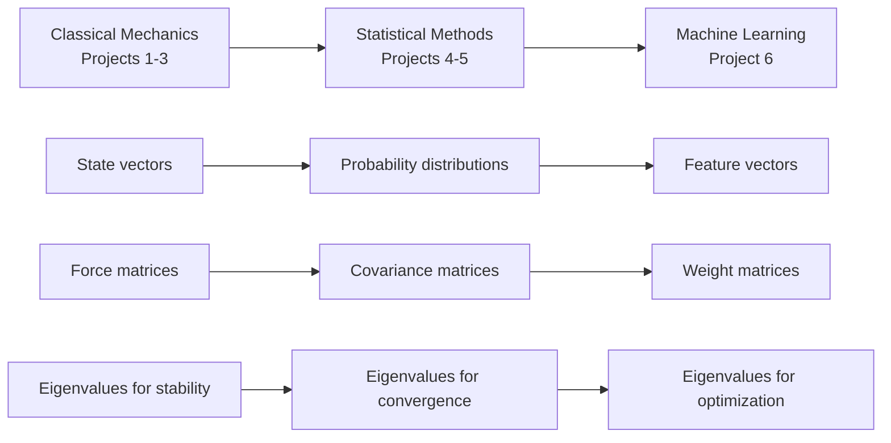

# ⚠️ Astrophysics Applications

Real astronomical phenomena and data analysis techniques that provide scientific context for computational methods.

## Overview

This section explores the astrophysical motivation behind every computational technique in ASTR 596. You'll understand not just *how* to implement algorithms, but *why* they're essential for modern astronomical research.

## Astrophysical Contexts

### ⭐ Stellar Physics

The life cycles of stars provide rich computational problems:

- **Stellar Structure**: Hydrostatic equilibrium and energy transport
- **Nuclear Physics**: Fusion rates and element synthesis
- **Stellar Evolution**: Main sequence to white dwarf/neutron star/black hole
- **Observational Data**: HR diagrams and stellar classification
- **Computational Methods**: ODE solving, boundary value problems
*Project Connection: Project 1 implements simple stellar evolution models*

### 🌌 Gravitational Dynamics

N-body systems from planetary motion to galaxy formation:

- **Classical Mechanics**: Newton's laws in astronomical contexts
- **Orbital Dynamics**: Kepler's laws and perturbation theory
- **N-Body Systems**: Star clusters, planetary orbits
- **ODE Numerical Integration**: [Euler](https://en.wikipedia.org/wiki/Euler_method), [RK4](https://en.wikipedia.org/wiki/Runge%E2%80%93Kutta_methods), [Leapfrog](https://en.wikipedia.org/wiki/Leapfrog_integration), [Velocity Vernet](https://en.wikipedia.org/wiki/Verlet_integration), symplectic methods
- **Dark Matter**: Structure formation and cosmological simulations
*Project Connection: Project 2 builds gravitational N-body simulators*

### 🌟 [Radiative Transfer](./03-radiative-transfer/index.md)

How light travels through astronomical environments:

- **Photon Physics**: Emission, absorption, and scattering processes
- **Stellar Atmospheres**: Spectral line formation
- **Interstellar Medium**: Dust extinction and emission
- **Monte Carlo Methods**: Photon transport simulations
- **Observational Astronomy**: From photons to physical parameters
*Project Connection: Projects 3 use Monte Carlo radiative transfer*

## Scientific Method Integration

Each topic demonstrates how computational astrophysics follows the scientific method:

1. **Observation**: Real astronomical data and phenomena
2. **Hypothesis**: Physical theories and mathematical models  
3. **Prediction**: Computational simulations and calculations
4. **Testing**: Comparison with observations and experiments
5. **Iteration**: Model refinement and new predictions

## Mathematical Physics Foundation

The astrophysical applications reinforce key physics concepts:

- **Conservation Laws**: Energy, momentum, angular momentum
- **Thermodynamics**: Stellar interiors and planetary atmospheres
- **Electromagnetism**: Radiation processes and magnetic fields
- **Quantum Mechanics**: Atomic physics and stellar nucleosynthesis
- **Statistical Mechanics**: Kinetic theory and plasma physics

## Observational Connection

Every computational method connects to real observations:

- **Photometry**: Measuring stellar brightness and colors
- **Spectroscopy**: Analyzing chemical composition and kinematics
- **Astrometry**: Precise positional measurements
- **Time-Domain**: Variable stars, supernovae, exoplanet transits
- **Multi-Wavelength**: Radio, infrared, optical, X-ray, gamma-ray astronomy

## Research Preparation

These applications prepare you for:

- **Graduate Research**: Understanding current astrophysical problems
- **Literature Review**: Reading and interpreting research papers
- **Data Analysis**: Working with real astronomical datasets
- **Scientific Communication**: Presenting results to scientific audiences
- **Career Readiness**: Skills applicable to academia or industry

## Course Integration

The astrophysical context enhances every aspect of ASTR 596:

- **Motivation**: Understanding why computational methods matter
- **Intuition**: Developing physical insight for debugging
- **Validation**: Testing code against known astronomical results
- **Application**: Solving genuine research problems
- **Communication**: Explaining technical work to scientific audiences

## Beyond the Course

These foundations prepare you for:

- Advanced astrophysics coursework.
- Graduate school applications and research.
- Careers in astronomy, data science, or technology.
- Lifelong learning in rapidly evolving fields.

The universe provides an inexhaustible source of computational challenges. Master these tools, and you'll be ready to tackle questions about the fundamental nature of reality itself.

---

## OLD Part 7: Numerical Reality - When Mathematics Meets Silicon

**Priority: 🔴 Essential** - Critical for debugging all projects

:::{admonition} 📅 When You'll Use This
:class: dropdown, hint

**Needed from**: Day 1 of coding
**Most critical for**: Debugging numerical errors
**Returns in**: Every project when things go wrong

Read this section early and refer back when debugging.
:::

:::{admonition} 🔭 Where We're Going
:class: note

Pure mathematics assumes infinite precision, but computers work with finite bits. This section reveals the harsh realities of floating-point arithmetic and teaches you to recognize and fix numerical disasters before they ruin your simulations. These aren't edge cases - you WILL encounter these issues in your projects.
:::

### 7.1 The Harsh Truth About Floating-Point Arithmetic {#floating-point-truth}

```{margin}
**floating-point**
Computer representation of real numbers with finite precision
```

```{margin}
**machine epsilon**
Smallest distinguishable floating-point increment (~2.2×10⁻¹⁶ for float64)
```

Computers represent numbers as:
$$x = \pm m \times 2^e$$

With 64-bit doubles:
- ~16 decimal digits of precision
- Largest number: ~10^308
- Smallest positive: ~10^-308
- **Machine epsilon**: ~2.2×10^-16

**Shocking Example**:
```python
0.1 + 0.2 == 0.3  # False!
# Actually equals 0.30000000000000004 in IEEE 754 double precision
# Because 0.1 = 0.00011001100110011... in binary (repeating infinitely)
```

**Concrete Example of Catastrophic Cancellation**:

Computing stellar parallax for distant stars:
```python
# Star at 1000 parsecs (very distant)
d = 1000  # parsecs
parallax = 1/d  # = 0.001 arcseconds

# Earth's orbit creates baseline
baseline = 1  # AU
observed_angle1 = 89.9999995  # degrees in January
observed_angle2 = 90.0000005  # degrees in July

# Catastrophic cancellation here!
angle_diff = observed_angle2 - observed_angle1  # Should be 0.000001
# But might be 0 due to rounding!

# Better approach: work with differences directly
# Never subtract nearly equal large numbers
```

### 7.2 Condition Numbers: Measuring Numerical Danger {#condition-numbers}

```{margin}
**condition number**
$\kappa(A) = \sigma_{\max}/\sigma_{\min}$, measures sensitivity to errors
```

The **condition number** measures error amplification:

| $\kappa(A)$ | Interpretation | Digits Lost |
|-------------|---------------|-------------|
| < 10 | Excellent | 0-1 |
| 10-100 | Good | 1-2 |
| 100-1000 | Acceptable | 2-3 |
| > 10^6 | Dangerous | > 6 |
| > 10^10 | Numerically singular | > 10 |

**Note**: These guidelines assume double precision arithmetic and general numerical problems. Some applications may tolerate higher condition numbers, while others require stricter bounds.

### 7.3 When Linear Algebra Fails

Understanding failure modes helps you recognize and fix problems:

**What happens when you invert a singular matrix?**
```python
A = np.array([[1, 2], [2, 4]])  # Rows are multiples
try:
    A_inv = np.linalg.inv(A)
except np.linalg.LinAlgError as e:
    print(f"Error: {e}")  # "Singular matrix"

# The matrix maps 2D to a line - information is lost!
```

**How eigenvalue algorithms fail on nearly-defective matrices:**
```python
# Nearly defective matrix (eigenvalues almost equal)
A = np.array([[1, 1000], [0, 1.0001]])
eigvals = np.linalg.eig(A)[0]
# Large condition number means eigenvectors are nearly parallel
# Small perturbations cause large changes in eigenvectors
```

**Why positive definiteness is lost through rounding:**
```python
# Start with positive definite matrix
A = np.array([[1e-8, 0], [0, 1]])  # Small but positive eigenvalues

# After many operations...
A_computed = A - 1e-8 * np.eye(2)  # Rounding error
# Now smallest eigenvalue is ~0 or negative!
# Cholesky will fail
```

### 7.4 Computational Timing Comparisons

:::{admonition} 💻 Never Invert - See The Proof!
:class: warning

```python
import numpy as np
import time

# Create a 1000×1000 matrix and vector
np.random.seed(42)
A = np.random.randn(1000, 1000)
A = A.T @ A  # Make positive definite
b = np.random.randn(1000)

# Method 1: Inversion (NEVER DO THIS)
start = time.time()
x_inv = np.linalg.inv(A) @ b
time_inv = time.time() - start

# Method 2: Solve (ALWAYS DO THIS)
start = time.time()
x_solve = np.linalg.solve(A, b)
time_solve = time.time() - start

# Compare accuracy
residual_inv = np.linalg.norm(A @ x_inv - b)
residual_solve = np.linalg.norm(A @ x_solve - b)

print(f"Inversion method: {time_inv:.3f}s, error: {residual_inv:.2e}")
print(f"Solve method: {time_solve:.3f}s, error: {residual_solve:.2e}")
# Typical output:
# Inversion method: 0.52s, error: 1.3e-08
# Solve method: 0.18s, error: 5.1e-12

# Solve is 3× faster and 1000× more accurate!
```
:::

### 7.5 Troubleshooting Guide

:::{admonition} 🔧 Common Linear Algebra Problems and Solutions
:class: important

**Problem**: "Matrix is singular to working precision"
- **Check**: Compute condition number with `np.linalg.cond()`
- **Fix**: Add regularization: `A_reg = A + epsilon * np.eye(n)`

**Problem**: "Eigenvalues should be real but are complex"
- **Check**: Verify symmetry: `np.allclose(A, A.T)`
- **Fix**: Symmetrize: `A_sym = (A + A.T) / 2`

**Problem**: "Cholesky decomposition failed"
- **Check**: Test positive definiteness via eigenvalues
- **Fix**: 
  ```python
  # Method 1: Add jitter
  L = np.linalg.cholesky(A + 1e-6 * np.eye(n))
  
  # Method 2: Use eigenvalue decomposition
  eigvals, eigvecs = np.linalg.eigh(A)
  eigvals = np.maximum(eigvals, 1e-6)
  A_fixed = eigvecs @ np.diag(eigvals) @ eigvecs.T
  ```

**Problem**: "Solution to Ax=b is wrong"
- **Check**: Residual `||Ax - b||` and condition number
- **Fix**: Use SVD for rank-deficient systems:
  ```python
  U, s, Vt = np.linalg.svd(A)
  # Pseudoinverse solution
  s_inv = np.where(s > 1e-10, 1/s, 0)
  x = Vt.T @ np.diag(s_inv) @ U.T @ b
  ```

**Problem**: "Matrix operations are too slow"
- **Check**: Matrix size and sparsity
- **Fix**: 
  - Use `scipy.sparse` for sparse matrices
  - Consider iterative solvers for large systems
  - Exploit structure (symmetric, banded, etc.)
:::

:::{admonition} 🚨 Critical Warning: Never Invert Matrices!
:class: warning

**NEVER do this**:
```python
x = np.linalg.inv(A) @ b  # WRONG! Slow and unstable
```

**ALWAYS do this**:
```python
x = np.linalg.solve(A, b)  # RIGHT! Fast and stable
```

The `solve` function uses LU decomposition, which is ~3× faster and much more accurate. In Project 5, the difference between these approaches can mean the difference between a working Gaussian Process and numerical disaster!
:::

:::{admonition} 📌 Key Takeaway
:class: important

Numerical precision is finite. Every operation loses a tiny bit of accuracy, and these errors compound. Check condition numbers, avoid subtracting nearly-equal numbers, never compute explicit inverses, and always add small regularization when matrices are near-singular. These aren't theoretical concerns - they're practical necessities for working code.
:::

---

## Part 8: The Bridge to Machine Learning and Beyond

**Priority: 🟡 Important** - Helps see the big picture

:::{admonition} 📅 When You'll Use This
:class: dropdown, hint

Read this section when transitioning between course phases to understand connections.
:::

### 8.1 From Classical to Statistical to Learning

Linear algebra unifies your entire course journey:



### 8.2 Linear Algebra in Modern Astronomy

Modern astronomical discoveries rely heavily on sophisticated linear algebra:

**LIGO's Gravitational Wave Detection**: LIGO uses SVD for noise reduction, separating gravitational wave signals from instrumental noise. The matched filtering technique that found GW150914 involves computing $(d|h) = d^T C^{-1} h$ where $C$ is the noise covariance matrix - without efficient matrix operations, we'd never detect spacetime ripples.

**Machine Learning for Transient Detection**: The Vera Rubin Observatory will detect millions of transients per night. Classification algorithms use eigendecomposition to find optimal feature spaces, transforming raw photometry into spaces where supernovae, variable stars, and asteroids separate cleanly.

**Compressed Sensing in Radio Astronomy**: Modern radio telescopes like ALMA use compressed sensing - exploiting sparsity in transformed bases - to reconstruct images from incomplete data. The key insight: most astronomical images are sparse in wavelet bases, allowing perfect reconstruction from far fewer measurements than traditional Nyquist sampling requires.

### 8.3 Big Picture: Linear Algebra Across Computational Astrophysics

Linear algebra isn't just for your course projects—it underlies all of computational astrophysics:

**Magnetohydrodynamics (MHD) Simulations**:
MHD combines fluid dynamics with magnetic fields to model stellar atmospheres, accretion disks, and the interstellar medium. The magnetic field evolution involves the **Maxwell stress tensor** (a symmetric matrix), and stability analysis requires eigenvalues of the linearized MHD equations. When eigenvalues have positive real parts, magnetic instabilities grow—this is how solar flares begin!

**Cosmological N-body Simulations**:
Simulating structure formation in the universe requires handling billions of particles. The **tidal tensor** (second derivatives of gravitational potential) is a symmetric matrix whose eigenvalues determine whether matter is collapsing into filaments, sheets, or halos. The Cosmic Web's structure—the largest pattern in the universe—emerges from the eigenvalues of this 3×3 matrix computed at each point in space.

**Adaptive Mesh Refinement (AMR)**:
Modern simulations adapt their resolution to follow interesting physics. The refinement criteria often involve the **Hessian matrix** of key quantities (density, vorticity). Eigenvalues of the Hessian indicate the directions and magnitudes of strongest variation, guiding where to add resolution. This lets us simulate both a galaxy and its central black hole in the same calculation!

**Stellar Oscillations and Asteroseismology**:
Stars ring like bells with characteristic frequencies determined by their internal structure. These oscillation modes are eigenvectors of the stellar structure equations, and the frequencies are related to eigenvalues. By measuring these frequencies in stars like our Sun, we can probe their invisible interiors—using the same mathematics you're learning here!

The takeaway: master linear algebra, and you hold the key to understanding phenomena from quantum scales to the cosmic web. Every major discovery in modern astrophysics—from exoplanets to dark energy—relied on the mathematical foundations in this module.

### 8.4 Preview: Neural Networks as Matrix Compositions

In your final project, a neural network is:

$$\vec{y} = f_L(W_L f_{L-1}(W_{L-1} ... f_1(W_1 \vec{x})...))$$

Where:
- $W_i$ are weight matrices (learned)
- $f_i$ are activation functions (non-linear)
- Learning = optimizing matrices via gradient descent

**Critical Point**: The non-linear activations $f_i$ are crucial—without them, any deep network would reduce to a single matrix multiplication, no matter how many layers. The power of neural networks comes from composing linear transformations (matrices) with non-linear activations, creating complex function approximators.

The same linear algebra you're learning now powers deep learning!

:::{admonition} 🎯 The Big Picture
:class: important

Every major computational achievement in astrophysics relies on linear algebra:
- **Gaia**: Mapping the Milky Way (1 billion stars = huge matrices)
- **LIGO**: Detecting gravitational waves (signal processing = matrix operations)
- **Event Horizon Telescope**: Imaging black holes (interferometry = linear algebra)
- **JWST**: Analyzing spectra (decomposition = eigenanalysis)

Master linear algebra, and you join this tradition of discovery!
:::

:::{tip} 🌟 The More You Know: How Least Squares Found the First Asteroid
:class: dropdown

**Priority: 🟢 Enrichment**

On January 1, 1801, Giuseppe Piazzi discovered Ceres—the first asteroid. But after tracking it for only 41 days, it disappeared behind the Sun. Would humanity's first asteroid be lost forever?

Enter Carl Friedrich Gauss, then 24 years old. He developed the method of least squares specifically to solve this problem. With only 41 observations, he needed to fit an elliptical orbit (6 parameters) to noisy data.

Gauss formulated this as minimizing:
$$S = \sum_{i=1}^{41} (\text{observed}_i - \text{predicted}_i)^2$$

This leads to the normal equations:
$$A^T A \vec{x} = A^T \vec{b}$$

where $A$ contains the orbital basis functions and $\vec{x}$ are the orbital elements.

Using hand calculations that took weeks, Gauss predicted where Ceres would reappear. On December 31, 1801—exactly one year after its discovery—astronomer Franz von Zach found Ceres within 0.5° of Gauss's prediction!

This triumph established least squares as fundamental to astronomy. Today, every spacecraft trajectory, every exoplanet orbit, every asteroid's path uses Gauss's method. When you call `scipy.linalg.lstsq()` in Project 1, you're using mathematics born from humanity's desire not to lose our first asteroid.

*Source: Teets, D. A., & Whitehead, K. (1999). "The Discovery of Ceres: How Gauss Became Famous." Mathematics Magazine, 72(2), 83-93.*
:::

:::{admonition} ✅ Test Your Understanding: The Complete Picture
:class: hint

Can you answer these synthesis questions?

1. How do conservation laws connect to matrix properties?
2. Why must covariance matrices be positive semi-definite?
3. How do eigenvalues determine both physical stability and algorithm convergence?
4. Why does the same math describe classical orbits and neural network training?

:::{admonition} Answers
:class: tip, dropdown

1. Conservation laws arise from symmetries (Noether's theorem). These symmetries manifest as matrix properties: energy conservation → symplectic structure (det=1), angular momentum → orthogonal transformations.

2. Covariance represents squared deviations from the mean. Since squares are non-negative, the quadratic form $\vec{x}^T\Sigma\vec{x}$ (which gives variance along direction $\vec{x}$) must be ≥ 0.

3. Eigenvalues determine growth/decay rates. In physics: positive → instability, negative → stability. In algorithms: second eigenvalue determines convergence rate. Same exponential growth/decay mathematics!

4. Both involve optimizing quadratic forms. Orbits minimize action (quadratic in velocity), neural networks minimize loss (quadratic near minima). The optimization landscape's eigenvalues determine behavior in both cases.
:::
:::

:::{admonition} 📌 Key Takeaway
:class: important

Linear algebra is the universal language of computational science. From simulating star clusters to detecting gravitational waves to training neural networks, the same mathematical structures appear everywhere. Master these foundations, and you're prepared not just for this course, but for the frontiers of computational astrophysics.
:::
**OLD**

---

