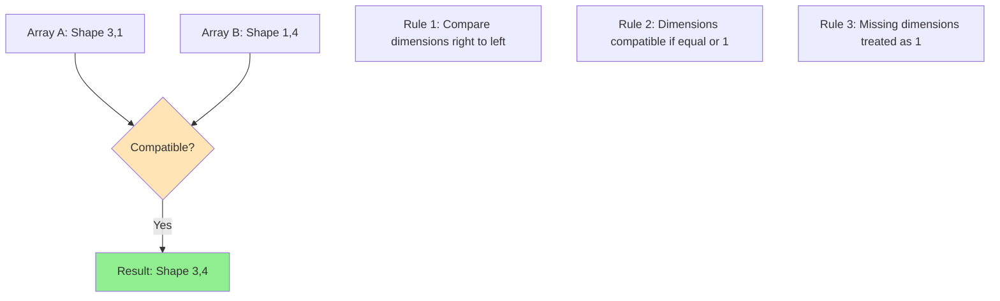

# Chapter 7: NumPy - The Foundation of Scientific Computing

## Learning Objectives

By the end of this chapter, you will be able to:
- Create and manipulate NumPy arrays for efficient numerical computation
- Apply vectorized operations to eliminate explicit loops and improve performance by 10-100x
- Master array indexing, slicing, and boolean masking for data selection and filtering
- Understand and leverage broadcasting rules to perform operations on arrays of different shapes
- Use essential NumPy functions for scientific computing (linspace, logspace, where, meshgrid)
- Perform array transformations including reshaping, stacking, and splitting for data analysis
- Generate random numbers from various distributions for Monte Carlo simulations
- Apply NumPy to real astronomical calculations with proper CGS units
- Recognize when to use NumPy instead of pure Python for numerical tasks

## Prerequisites Check

Before starting this chapter, verify you can:
- ✓ Work with Python lists and list comprehensions (Chapter 4)
- ✓ Use the math module for mathematical operations (Chapter 2)
- ✓ Understand functions and return values (Chapter 5)
- ✓ Work with nested data structures (Chapter 4)
- ✓ Import and use modules (Chapter 5)
- ✓ Read and write files (Chapter 6)

### Self-Assessment Diagnostic

Test your readiness by predicting these outputs WITHOUT running the code:

```{code-cell} python
# Question 1: What does this produce?
result = [x**2 for x in range(5) if x % 2 == 0]
# Your answer: _______

# Question 2: What's the final value of total?
total = sum([len(str(x)) for x in [10, 100, 1000]])
# Your answer: _______

# Question 3: What error (if any) occurs here?
import math
values = [1, 4, 9]
# roots = math.sqrt(values)  # Uncomment to test
# Your answer: _______

# Question 4: Can you understand this nested structure?
matrix = [[1, 2], [3, 4]]
flattened = [item for row in matrix for item in row]
# Your answer: _______
```

:::{dropdown} Self-Assessment Answers
1. `[0, 4, 16]` - squares of even numbers from 0-4
2. `9` - lengths are 2, 3, 4, sum = 9
3. `TypeError` - math.sqrt() doesn't accept lists, only single values
4. `[1, 2, 3, 4]` - flattens the 2D list into 1D

If you got all four correct, you're ready for NumPy! If not, review the indicated chapters.
:::

## Chapter Overview

You've been using Python lists to store collections of numbers, and the math module to perform calculations. But what happens when you need to analyze a million stellar spectra, each with thousands of wavelength points? Or when you need to perform the same calculation on every pixel in a telescope image? Try using a list comprehension on a million-element list, and you'll be waiting a while. This is where NumPy transforms Python from a general-purpose language into a powerhouse for scientific computing, providing the speed and tools necessary for research-grade computational science.

NumPy, short for Numerical Python, is the foundation upon which the entire scientific Python ecosystem is built. Every plot you'll make with Matplotlib, every optimization you'll run with SciPy, every dataframe you'll analyze with Pandas — they all build on NumPy arrays. But NumPy isn't just about speed; it's about expressing mathematical operations naturally. Instead of writing loops to add corresponding elements of two lists, you simply write `a + b`. Instead of nested loops for matrix multiplication, you write `a @ b`. This isn't just convenience — it's a fundamental shift in how you think about numerical computation, from operating on individual elements to operating on entire arrays at once.

This chapter introduces you to NumPy's ndarray (n-dimensional array), the object that makes scientific Python possible. You'll discover why NumPy arrays are 10-100 times faster than Python lists for numerical operations, and how **vectorization** eliminates the need for most explicit loops. You'll master **broadcasting**, NumPy's powerful mechanism for operating on arrays of different shapes, which enables elegant solutions to complex problems. Most importantly, you'll learn to think in arrays — a skill that transforms you from someone who writes code that processes data to someone who writes code that expresses mathematical ideas directly. By the end, you'll understand why virtually every astronomical software package, from data reduction pipelines to cosmological simulations, is built on NumPy's foundation.

:::{admonition} 📚 Essential Resource: NumPy Documentation
:class: important

This chapter introduces NumPy's core concepts, but NumPy is vast! The official documentation at **https://numpy.org/doc/stable/** is your indispensable companion. Throughout your career, you'll constantly reference it for:

- Complete function signatures and parameters
- Advanced broadcasting examples  
- Performance optimization tips
- Specialized submodules (random, fft, linalg)

**Practice using the documentation NOW**: After each new function you learn, look it up in the official docs. Read the parameters, check the examples, and explore related functions. The ability to efficiently navigate documentation is as important as coding itself. Bookmark the NumPy documentation — you'll use it daily in research!

Pro tip: Use the NumPy documentation's search function to quickly find what you need. Type partial function names or concepts, and it will suggest relevant pages. The "See Also" sections are goldmines for discovering related functionality.
:::

## 7.1 From Lists to Arrays: Why NumPy?

{margin} **NumPy**
A fundamental package for scientific computing in Python, providing support for large, multi-dimensional arrays and matrices.

{margin} **ndarray**
NumPy's n-dimensional array object, the core data structure for numerical computation.

{margin} **Contiguous Memory**
Data stored in adjacent memory locations, enabling fast access and cache efficiency.

Let's start with a problem you already know how to solve, then see how NumPy transforms it. Imagine you're analyzing brightness measurements from a variable star:

```{code-cell} python
import time
import math

# Python list approach (what you know from Chapter 4)
magnitudes = [12.3, 12.5, 12.4, 12.7, 12.6] * 20000  # 100,000 measurements
fluxes = []

start = time.perf_counter()
for mag in magnitudes:
    flux = 10**(-mag/2.5)  # Convert magnitude to relative flux
    fluxes.append(flux)
list_time = time.perf_counter() - start

print(f"List approach: {list_time*1000:.2f} ms")
print(f"First 5 fluxes: {fluxes[:5]}")
```

Now let's see the NumPy approach:

```{code-cell} python
import numpy as np  # Standard abbreviation used universally

# NumPy array approach (what you're learning)
magnitudes = np.array([12.3, 12.5, 12.4, 12.7, 12.6] * 20000)

start = time.perf_counter()
fluxes = 10**(-magnitudes/2.5)  # Operates on entire array at once!
numpy_time = time.perf_counter() - start

print(f"NumPy approach: {numpy_time*1000:.2f} ms")
print(f"Speedup: {list_time/numpy_time:.1f}x faster")
print(f"First 5 fluxes: {fluxes[:5]}")
```

The NumPy version is not only faster but also cleaner — no explicit loop needed! This is called **vectorization**, and it's the key to NumPy's power.

### NumPy vs. Math Module: A Complete Replacement

You've been using the math module for operations like `math.sin()`, `math.sqrt()`, and `math.log()`. Good news: NumPy can replace virtually all of math's functionality while adding array support:

```{code-cell} python
# Math module - works on single values only
import math
x = 2.0
math_result = math.sin(x)
print(f"math.sin({x}) = {math_result}")

# Try with a list - this fails!
# values = [0, 1, 2, 3]
# math.sin(values)  # TypeError!

# NumPy - works on single values AND arrays
x = 2.0
numpy_scalar_result = np.sin(x)
print(f"np.sin({x}) = {numpy_scalar_result}")

# NumPy shines with arrays
values = np.array([0, 1, 2, 3])
numpy_array_result = np.sin(values)
print(f"np.sin({values}) = {numpy_array_result}")

# NumPy has everything math has (and more)
print(f"\nComparison for x = {x}:")
print(f"  math.sqrt({x}) = {math.sqrt(x):.6f}")
print(f"  np.sqrt({x})   = {np.sqrt(x):.6f}")
print(f"  math.exp({x})  = {math.exp(x):.6f}")
print(f"  np.exp({x})    = {np.exp(x):.6f}")
print(f"  math.log10({x}) = {math.log10(x):.6f}")
print(f"  np.log10({x})   = {np.log10(x):.6f}")
```

**Key insight**: You can generally replace `import math` with `import numpy as np` and use NumPy for everything. The only exceptions are a few specialized functions like `math.factorial()` that don't have direct NumPy equivalents (though NumPy has `scipy.special.factorial()` if needed).

:::{admonition} 🎯 The More You Know: How NumPy Saved Gravitational Wave Astronomy
:class: note, story

On September 14, 2015, at 09:50:45 UTC, the Laser Interferometer Gravitational-Wave Observatory (LIGO) detected gravitational waves for the first time — ripples in spacetime from two black holes colliding 1.3 billion years ago. But this Nobel Prize-winning discovery almost didn't happen because of a computational bottleneck that NumPy solved.

LIGO's detectors produce 16,384 samples per second of incredibly noisy data. Detecting a gravitational wave requires comparing this data stream against hundreds of thousands of theoretical waveform templates using matched filtering. In 2009, the original C++ analysis pipeline took 24 hours to analyze just one hour of data — making real-time detection impossible.

Kipp Cannon, a LIGO scientist, made a radical decision: rewrite the entire pipeline in Python using NumPy. Critics were horrified. "Python is too slow for production!" they said. But Cannon understood something crucial: NumPy's vectorized operations call optimized C libraries (BLAS, LAPACK) that are often faster than hand-written C++ code.

The key transformation was replacing loops with NumPy operations:

```python
# Original approach (simplified)
def matched_filter_slow(data, template):
    result = 0
    for i in range(len(data)):
        result += data[i] * template[i]
    return result

# NumPy approach
def matched_filter_fast(data, template):
    return np.dot(data, template)  # Or simply: data @ template
```

The NumPy version wasn't just cleaner — it was 50x faster! NumPy's FFT implementation (using FFTW under the hood) accelerated frequency-domain operations by another factor of 100. The complete Python/NumPy pipeline could analyze data faster than real-time, searching for gravitational waves as they arrived.

When GW150914 (the first detection) arrived, the NumPy-based pipeline identified it as a candidate within 3 minutes. The same analysis would have taken the original C++ code 72 minutes. Those 69 minutes made the difference between a live detection and a historical footnote. The discovery paper acknowledges NumPy explicitly: "The PyCBC analysis pipeline... makes extensive use of NumPy arrays and operations."

Today, every gravitational wave detection — from colliding neutron stars to intermediate-mass black holes — flows through NumPy arrays. The library you're learning didn't just speed up the analysis; it made an entirely new kind of astronomy possible. When you vectorize operations with NumPy, you're using the same technique that let humanity hear the universe for the first time!
:::

## 7.2 Creating Arrays: Your Scientific Data Containers

{margin} **dtype**
Data type of array elements, controlling memory usage and precision.

{margin} **CGS Units**
Centimeter-Gram-Second system, traditionally used in astronomy for convenient scaling in stellar physics calculations.

NumPy provides many ways to create arrays, each suited for different scientific tasks:

```{code-cell} python
# From Python lists (most common starting point)
measurements = [23.5, 24.1, 23.8, 24.3]
arr = np.array(measurements)
print(f"From list: {arr}, dtype: {arr.dtype}")

# Specify data type for memory efficiency
counts = np.array([1000, 2000, 1500], dtype=np.int32)
print(f"Integer array: {counts}, dtype: {counts.dtype}")

# 2D array (matrix) - like an image
image_data = np.array([[10, 20, 30],
                       [40, 50, 60],
                       [70, 80, 90]])
print(f"2D array shape: {image_data.shape}")
print(f"2D array:\n{image_data}")
```

### Essential Array Creation Functions for Science

These functions are workhorses in scientific computing:

```{code-cell} python
# linspace: Evenly spaced values (inclusive endpoints)
# Perfect for wavelength grids, time series
wavelengths_nm = np.linspace(400, 700, 11)  # 11 points from 400 to 700 nm
print(f"Wavelengths (nm): {wavelengths_nm}")

# Convert to CGS (cm) - standard in stellar atmosphere models
wavelengths_cm = wavelengths_nm * 1e-7
print(f"Wavelengths (cm): {wavelengths_cm}")

# logspace: Logarithmically spaced values
# Essential for frequency grids, stellar masses
masses_solar = np.logspace(-1, 2, 4)  # 0.1 to 100 solar masses
masses_g = masses_solar * 1.989e33  # Convert to grams (CGS)
print(f"Stellar masses (g): {masses_g:.2e}")
```

```{code-cell} python
# arange: Like Python's range but returns array
times_s = np.arange(0, 10, 0.1)  # 0 to 9.9 in 0.1s steps
print(f"Time points: {len(times_s)} samples from {times_s[0]} to {times_s[-1]}")

# zeros and ones: Initialize arrays
dark_frame = np.zeros((100, 100))  # 100x100 CCD dark frame
flat_field = np.ones((100, 100))   # Flat field (perfect response)
print(f"Dark frame shape: {dark_frame.shape}, sum: {dark_frame.sum()}")
print(f"Flat field shape: {flat_field.shape}, sum: {flat_field.sum()}")
```

:::{admonition} 💡 Computational Thinking Box: Row-Major vs Column-Major
:class: tip

**PATTERN: Memory Layout Matters for Performance**

NumPy stores arrays in row-major order (C-style) by default, meaning elements in the same row are adjacent in memory. This affects performance dramatically:

```python
# Row-major (NumPy default) - fast row operations
image = np.zeros((1000, 1000))
# Accessing image[0, :] is fast (contiguous memory)
# Accessing image[:, 0] is slower (strided memory)

# For column operations, consider Fortran order
image_fortran = np.zeros((1000, 1000), order='F')
# Now image_fortran[:, 0] is fast
```

Why this matters:
- Processing images row-by-row? Use default (C-order)
- Processing spectra in columns? Consider Fortran order
- Matrix multiplication? NumPy optimizes automatically

Real impact: The wrong memory order can make your code 10x slower for large arrays!
:::

:::{admonition} 🔍 Check Your Understanding
:class: question

What's the memory difference between `np.zeros(1000)`, `np.ones(1000)`, and `np.empty(1000)`? When would you use each?

:::{dropdown} Answer
All three allocate the same amount of memory (8000 bytes for float64), but:
- `np.zeros()`: Allocates AND sets all values to 0 (slower, safe)
- `np.ones()`: Allocates AND sets all values to 1 (slower, safe)  
- `np.empty()`: Only allocates, doesn't initialize (fastest, dangerous)

Use cases:
- `zeros()/ones()`: When you need initialized values for accumulation or defaults
- `empty()`: ONLY when you'll immediately overwrite ALL values, like filling with calculated results

Example where `empty()` is appropriate:
```python
result = np.empty(1000)
for i in range(1000):
    result[i] = expensive_calculation(i)  # Overwrites immediately
```
:::
:::

### Saving and Loading Arrays (Connection to Chapter 6)

Remember the file I/O concepts from Chapter 6? NumPy extends them for efficient array storage:

```{code-cell} python
# Save astronomical data in binary format
flux_data = np.random.normal(1000, 50, size=1000)
np.save('observations.npy', flux_data)  # Binary format, fast

# Load for analysis
loaded_data = np.load('observations.npy')
print(f"Loaded {len(loaded_data)} measurements")

# For text format (human-readable but slower)
np.savetxt('observations.txt', flux_data[:10], fmt='%.2f')
text_data = np.loadtxt('observations.txt')
print(f"Text file sample: {text_data[:3]}")
```

## 7.3 Random Numbers for Monte Carlo Simulations

{margin} **Monte Carlo**
A computational technique using random sampling to solve problems that might be deterministic in principle.

Scientific computing often requires random data for Monte Carlo simulations, noise modeling, and statistical testing. NumPy's random module provides a comprehensive suite of distributions essential for computational astrophysics:

```{code-cell} python
# ALWAYS set seed for reproducibility in scientific code!
np.random.seed(42)

# Uniform distribution: random positions, phases
# Generate random sky coordinates
n_stars = 1000
ra = np.random.uniform(0, 360, n_stars)  # Right Ascension in degrees
dec = np.random.uniform(-90, 90, n_stars)  # Declination in degrees
print(f"Generated {n_stars} random sky positions")
print(f"RA range: [{ra.min():.1f}, {ra.max():.1f}]°")

# Random phases for periodic variables
phases = np.random.uniform(0, 2*np.pi, n_stars)
print(f"Phase range: [0, 2π]")
```

```{code-cell} python
# Normal (Gaussian) distribution: measurement errors, thermal noise
# Simulate CCD readout noise
mean_counts = 1000  # electrons
read_noise = 10  # electrons RMS
n_pixels = 10000

pixel_values = np.random.normal(mean_counts, read_noise, n_pixels)
print(f"Pixel statistics:")
print(f"  Mean: {pixel_values.mean():.1f} (expected: {mean_counts})")
print(f"  Std: {pixel_values.std():.1f} (expected: {read_noise})")
print(f"  SNR: {pixel_values.mean()/pixel_values.std():.1f}")
```

```{code-cell} python
# Poisson distribution: photon counting, radioactive decay
# Simulate photon arrival statistics
mean_photons = 100  # photons per exposure
n_exposures = 1000

photon_counts = np.random.poisson(mean_photons, n_exposures)
print(f"Photon counting statistics:")
print(f"  Mean: {photon_counts.mean():.1f} (expected: {mean_photons})")
print(f"  Std: {photon_counts.std():.2f} (expected: {np.sqrt(mean_photons):.2f})")
print(f"  Variance/Mean: {photon_counts.var()/photon_counts.mean():.2f} (should be ~1)")
```

### Advanced Distributions for Astrophysics

```{code-cell} python
# Exponential distribution: time between events, decay processes
# Simulate time between supernova detections (days)
mean_interval = 30  # days
n_events = 100
intervals = np.random.exponential(mean_interval, n_events)
print(f"Supernova intervals: mean = {intervals.mean():.1f} days")

# Power-law distribution (using Pareto for x_min=1)
# Initial Mass Function approximation
alpha = 2.35  # Salpeter IMF slope
n_stars = 1000
# Generate masses from 0.1 to 100 solar masses
x = np.random.pareto(alpha, n_stars) + 1  # Pareto starts at 1
masses = 0.1 * x  # Scale to start at 0.1 solar masses
masses = masses[masses < 100]  # Truncate at 100 solar masses
print(f"Generated {len(masses)} stellar masses with power-law distribution")
```

```{code-cell} python
# Multivariate normal: correlated parameters
# Simulate color-magnitude relationship
mean = [12, 1.0]  # Mean magnitude, mean color (B-V)
# Covariance matrix: brighter stars tend to be bluer
cov = [[1.0, -0.3],   # Variance in mag, covariance
       [-0.3, 0.25]]  # Covariance, variance in color

n_stars = 500
mag_color = np.random.multivariate_normal(mean, cov, n_stars)
magnitudes = mag_color[:, 0]
colors = mag_color[:, 1]

correlation = np.corrcoef(magnitudes, colors)[0, 1]
print(f"Generated {n_stars} stars with correlated properties")
print(f"Correlation coefficient: {correlation:.2f} (expected: ~-0.6)")
```

### Random Sampling Techniques

```{code-cell} python
# Random choice: selecting objects from catalogs
star_types = np.array(['O', 'B', 'A', 'F', 'G', 'K', 'M'])
# Probabilities based on stellar statistics
probs = np.array([0.00003, 0.0013, 0.006, 0.03, 0.076, 0.121, 0.765])
probs = probs / probs.sum()  # Ensure normalization

n_sample = 1000
sampled_types = np.random.choice(star_types, n_sample, p=probs)

# Count occurrences
unique, counts = np.unique(sampled_types, return_counts=True)
for star_type, count in zip(unique, counts):
    print(f"Type {star_type}: {count/n_sample*100:.1f}%")
```

```{code-cell} python
# Random permutation: bootstrap resampling
# Original dataset
data = np.array([23.5, 24.1, 23.8, 24.3, 23.9])

# Bootstrap resampling for error estimation
n_bootstrap = 1000
bootstrap_means = []

for i in range(n_bootstrap):
    # Resample with replacement
    resampled = np.random.choice(data, len(data), replace=True)
    bootstrap_means.append(resampled.mean())

bootstrap_means = np.array(bootstrap_means)
print(f"Original mean: {data.mean():.2f}")
print(f"Bootstrap mean: {bootstrap_means.mean():.2f}")
print(f"Bootstrap std error: {bootstrap_means.std():.3f}")

# Shuffle for randomization tests
shuffled = np.random.permutation(data)
print(f"Original: {data}")
print(f"Shuffled: {shuffled}")
```

:::{admonition} 🌟 Why This Matters: Monte Carlo Markov Chain (MCMC) in Cosmology
:class: info, important

The random number generation you're learning powers one of modern cosmology's most important techniques: MCMC sampling for parameter estimation. When analyzing the cosmic microwave background or galaxy surveys, we need to explore vast parameter spaces (often 10+ dimensions) to find the best-fit cosmological model.

MCMC uses random walks through parameter space, with each step drawn from distributions like those above. The Planck satellite mission used MCMC with billions of random samples to determine that the universe is 13.8 billion years old, contains 5% ordinary matter, 27% dark matter, and 68% dark energy — all with unprecedented precision.

Your ability to generate and manipulate random numbers with NumPy is the foundation for these universe-spanning discoveries!
:::

## 7.4 Array Operations: Vectorization Powers

{margin} **Vectorization**
Performing operations on entire arrays at once rather than using explicit loops.

{margin} **Universal Functions**
NumPy functions that operate element-wise on arrays, supporting broadcasting and type casting.

The true power of NumPy lies in vectorized operations — performing calculations on entire arrays without writing loops:

```{code-cell} python
# Basic arithmetic operates element-wise
a = np.array([1, 2, 3, 4])
b = np.array([10, 20, 30, 40])

print(f"a + b = {a + b}")      # Element-wise addition
print(f"a * b = {a * b}")      # Element-wise multiplication
print(f"a ** 2 = {a ** 2}")    # Element-wise power
print(f"b / a = {b / a}")      # Element-wise division

# Matrix multiplication uses @ operator
c = np.array([[1, 2], [3, 4]])
d = np.array([[5, 6], [7, 8]])
print(f"\nMatrix multiplication (c @ d):\n{c @ d}")

# Compare with list approach (verbose and slow)
a_list = [1, 2, 3, 4]
b_list = [10, 20, 30, 40]
result_list = []
for i in range(len(a_list)):
    result_list.append(a_list[i] + b_list[i])
print(f"\nList addition: {result_list}")  # Same result, more code!
```

### Universal Functions (ufuncs): Optimized Operations

NumPy's **universal functions** operate element-wise on arrays with optimized C code:

```{code-cell} python
# Trigonometric functions for coordinate transformations
angles_deg = np.array([0, 30, 45, 60, 90])
angles_rad = np.deg2rad(angles_deg)  # Convert to radians

sines = np.sin(angles_rad)
cosines = np.cos(angles_rad)

print(f"Angles (deg): {angles_deg}")
print(f"sin(θ): {sines}")
print(f"cos(θ): {cosines}")
print(f"sin²(θ) + cos²(θ): {sines**2 + cosines**2}")  # Should all be 1!
```

```{code-cell} python
# Exponential and logarithm for magnitude scales
magnitudes = np.array([0, 1, 2, 5, 10])
flux_ratios = 10**(-magnitudes/2.5)  # Pogson's equation
print(f"\nMagnitudes: {magnitudes}")
print(f"Flux ratios: {flux_ratios}")

# Verify: magnitude difference = -2.5 * log10(flux ratio)
recovered_mags = -2.5 * np.log10(flux_ratios)
print(f"Recovered magnitudes: {recovered_mags}")
```

### Array Methods: Built-in Analysis

Arrays come with methods for common statistical operations:

```{code-cell} python
# Create sample data: Gaussian with outliers
np.random.seed(42)
data = np.random.normal(100, 15, 1000)  # Normal dist: mean=100, std=15
data[::100] = 200  # Add outliers every 100th point

# Statistical methods
print(f"Mean: {data.mean():.2f}")
print(f"Median: {np.median(data):.2f}")  # More robust to outliers
print(f"Std dev: {data.std():.2f}")
print(f"Min: {data.min():.2f}, Max: {data.max():.2f}")

# Find outliers
outliers = data > 150
n_outliers = outliers.sum()  # True counts as 1
print(f"Number of outliers (>150): {n_outliers}")

# Clean data by filtering
clean_data = data[~outliers]  # ~ means NOT
print(f"Clean mean: {clean_data.mean():.2f}")
print(f"Clean std: {clean_data.std():.2f}")
```

:::{admonition} ⚠️ Common Bug Alert: Integer Division Trap
:class: warning

```{code-cell} python
# DANGER: Integer arrays can cause unexpected results!
counts = np.array([100, 200, 300])  # Default type is int
normalized = counts / counts.max()
print(f"Normalized (float result): {normalized}")

# But watch out for integer division in older NumPy or with //
integer_div = counts // 2  # Floor division
print(f"Integer division by 2: {integer_div}")

# Mixed operations preserve precision
counts_int = np.array([100, 200, 300], dtype=int)
scale = 2.5  # float
scaled = counts_int / scale  # Result is float!
print(f"Int array / float = {scaled}")

# Best practice: Use float arrays for scientific calculations
counts_safe = np.array([100, 200, 300], dtype=float)
print(f"Safe float array: {counts_safe / counts_safe.max()}")
```

Always use float arrays for scientific calculations unless you specifically need integer arithmetic!
:::

:::{admonition} 💡 Computational Thinking Box: Algorithmic Complexity and Big-O
:class: tip

**PATTERN: Understanding Algorithmic Scaling**

Different approaches to the same problem can have vastly different performance:

```python
# O(n) - Linear time with Python loop
def sum_squares_loop(arr):
    total = 0
    for x in arr:
        total += x**2
    return total

# O(n) - Linear time with NumPy (but ~100x faster!)
def sum_squares_numpy(arr):
    return (arr**2).sum()

# O(n²) - Quadratic time for matrix operations
def matrix_multiply_loops(A, B):
    n = len(A)
    C = [[0]*n for _ in range(n)]
    for i in range(n):
        for j in range(n):
            for k in range(n):
                C[i][j] += A[i][k] * B[k][j]
    return C

# O(n^2.37) - Optimized with NumPy (Strassen algorithm)
def matrix_multiply_numpy(A, B):
    return A @ B
```

Real impact: For a 1000×1000 matrix:
- Nested loops: ~10 seconds
- NumPy: ~10 milliseconds
- That's the difference between waiting and real-time processing!
:::

## 7.5 Indexing and Slicing: Data Selection Mastery

{margin} **Boolean Masking**
Using boolean arrays to select elements that meet certain conditions.

NumPy's indexing extends Python's list indexing with powerful new capabilities:

```{code-cell} python
# 1D indexing (like lists but more powerful)
spectrum = np.array([1.0, 1.2, 1.5, 1.3, 1.1, 0.9, 0.8])
print(f"Full spectrum: {spectrum}")
print(f"First element: {spectrum[0]}")
print(f"Last element: {spectrum[-1]}")  # Negative indexing works!
print(f"Middle section: {spectrum[2:5]}")

# Fancy indexing - select multiple specific indices
important_indices = [0, 2, 4, 6]
selected = spectrum[important_indices]
print(f"Selected wavelengths: {selected}")
```

```{code-cell} python
# 2D indexing - like accessing matrix elements
image = np.array([[10, 20, 30],
                  [40, 50, 60],
                  [70, 80, 90]])
print(f"2D array:\n{image}")
print(f"Element at row 1, col 2: {image[1, 2]}")  # Note: comma notation!
print(f"Entire row 1: {image[1, :]}")
print(f"Entire column 2: {image[:, 2]}")
print(f"Sub-image: \n{image[0:2, 1:3]}")
```

### Boolean Masking: The Power Tool

**Boolean masking** is one of NumPy's most powerful features for data filtering:

```{code-cell} python
# Stellar catalog example
stars_mag = np.array([8.2, 12.5, 6.1, 15.3, 9.7, 11.2, 5.5])
stars_color = np.array([0.5, 1.2, 0.3, 1.8, 0.7, 1.0, 0.2])  # B-V color

# Create boolean masks
bright_mask = stars_mag < 10  # True where magnitude < 10
blue_mask = stars_color < 0.6  # True where B-V < 0.6 (blue stars)

print(f"Bright stars mask: {bright_mask}")
print(f"Bright star magnitudes: {stars_mag[bright_mask]}")

# Combine conditions with & (not 'and'), | (not 'or')
bright_and_blue = (stars_mag < 10) & (stars_color < 0.6)
print(f"Bright AND blue: {stars_mag[bright_and_blue]}")

# Count matching objects
n_bright = bright_mask.sum()  # True = 1, False = 0
print(f"Number of bright stars: {n_bright}")
```

### Essential Array Functions

```{code-cell} python
# where: conditional operations and finding indices
data = np.array([1, 5, 3, 8, 2, 9, 4])
high_indices = np.where(data > 5)[0]  # Returns tuple, we want first element
print(f"Indices where data > 5: {high_indices}")
print(f"Values at those indices: {data[high_indices]}")

# Conditional replacement
clipped = np.where(data > 5, 5, data)  # Clip values above 5
print(f"Clipped data: {clipped}")

# clip: cleaner way to bound values
clipped_better = np.clip(data, 2, 8)  # Clip to range [2, 8]
print(f"Clipped with np.clip: {clipped_better}")
```

```{code-cell} python
# unique: find unique values in catalogs
star_types = np.array(['G', 'K', 'M', 'G', 'K', 'G', 'M', 'M', 'K'])
unique_types, counts = np.unique(star_types, return_counts=True)
print(f"Unique star types: {unique_types}")
print(f"Counts: {counts}")

# histogram: bin data for analysis
magnitudes = np.random.normal(12, 2, 1000)
hist, bins = np.histogram(magnitudes, bins=20)
print(f"Histogram has {len(hist)} bins")
print(f"Bin edges from {bins[0]:.1f} to {bins[-1]:.1f}")
print(f"Peak bin has {hist.max()} stars")
```

:::{admonition} 🔍 Check Your Understanding
:class: question

What's the difference between `np.linspace(0, 10, 11)` and `np.arange(0, 11, 1)`?

:::{dropdown} Answer
Both create arrays from 0 to 10, but:
- `np.linspace(0, 10, 11)` creates exactly 11 evenly-spaced points including both endpoints: [0, 1, 2, ..., 10]
- `np.arange(0, 11, 1)` creates points from 0 up to (but not including) 11 with step 1: [0, 1, 2, ..., 10]

In this case they're equivalent, but:
- `np.linspace(0, 10, 20)` gives 20 points with fractional spacing
- `np.arange(0, 10.5, 0.5)` gives points with exact 0.5 steps

Use `linspace` when you need a specific number of points, `arange` when you need a specific step size.
:::
:::

:::{admonition} 🌟 Why This Matters: Finding Exoplanets with Boolean Masking
:class: info, important

The Kepler Space Telescope discovered over 2,600 exoplanets by monitoring the brightness of 150,000 stars continuously for four years. Finding planets in this data required sophisticated boolean masking with NumPy.

When a planet transits its star, the brightness drops by typically 0.01% - 1%. But the data is noisy, with stellar flares, cosmic rays, and instrumental effects. Here's a simplified version of the detection algorithm:

```python
# Simulated light curve data
time = np.linspace(0, 30, 1000)  # 30 days
flux = np.ones_like(time) + np.random.normal(0, 0.001, 1000)  # Noise

# Add transits every 3.5 days (period), 0.1 day duration, 1% deep
period, duration, depth = 3.5, 0.1, 0.01
in_transit = ((time % period) < duration)
flux[in_transit] -= depth

# Detection using boolean masking
median_flux = np.median(flux)
threshold = median_flux - 3 * flux.std()  # 3-sigma detection
transit_candidates = flux < threshold
n_transits = np.diff(np.where(transit_candidates)[0] > 1).sum()

print(f"Found {n_transits} transit events")
```

This technique, scaled up with more sophisticated statistics, is how we've discovered thousands of worlds orbiting other stars!
:::

## 7.6 Broadcasting: NumPy's Secret Superpower

{margin} **Broadcasting**
NumPy's ability to perform operations on arrays of different shapes by automatically expanding dimensions.

**Broadcasting** allows NumPy to perform operations on arrays of different shapes, eliminating the need for explicit loops or array duplication:

```{code-cell} python
# Simple broadcasting: scalar with array
arr = np.array([1, 2, 3, 4])
result = arr + 10  # 10 is "broadcast" to [10, 10, 10, 10]
print(f"Array + scalar: {result}")

# Row vector + column vector = matrix
row = np.array([[1, 2, 3]])      # Shape (1, 3)
col = np.array([[10], [20], [30]])  # Shape (3, 1)
matrix = row + col  # Broadcasting creates (3, 3) result
print(f"Row shape: {row.shape}")
print(f"Column shape: {col.shape}")
print(f"Result:\n{matrix}")
print(f"Result shape: {matrix.shape}")
```

### Broadcasting Rules Visualization



Broadcasting follows simple rules:
1. Arrays are compatible if dimensions are equal or one is 1
2. Missing dimensions are treated as 1
3. Arrays are stretched along dimensions of size 1

```{code-cell} python
# Practical example: Normalize each row of a matrix
data = np.array([[1, 2, 3],
                 [4, 5, 6],
                 [7, 8, 9]], dtype=float)

# Calculate row means (shape: 3,)
row_means = data.mean(axis=1)  # axis=1 means along columns
print(f"Row means: {row_means}")

# To subtract row means from each row, we need to reshape
row_means_reshaped = row_means.reshape(-1, 1)  # Shape: (3, 1)
normalized = data - row_means_reshaped  # Broadcasting!
print(f"Normalized data:\n{normalized}")
print(f"New row means: {normalized.mean(axis=1)}")  # Should be ~0
```

### Real-World Broadcasting: CCD Image Calibration

```{code-cell} python
# Flat-field correction for CCD images
np.random.seed(42)

# Simulate CCD data
raw_image = np.random.poisson(1000, size=(100, 100))  # 100x100 pixels
dark_current = np.full((100, 100), 50)  # Uniform dark current
flat_field = np.ones((100, 100))
flat_field[:, :50] = 0.9  # Left half less sensitive

# Calibrate image using broadcasting
calibrated = (raw_image - dark_current) / flat_field

print(f"Raw image mean: {raw_image.mean():.1f}")
print(f"Calibrated mean: {calibrated.mean():.1f}")
print(f"Left half sensitivity: {calibrated[:, :50].mean():.1f}")
print(f"Right half sensitivity: {calibrated[:, 50:].mean():.1f}")
```

:::{admonition} ⚠️ Common Bug Alert: Broadcasting Shape Mismatch
:class: warning

```{code-cell} python
# Common mistake: incompatible shapes
a = np.array([1, 2, 3])  # Shape: (3,)
b = np.array([1, 2])     # Shape: (2,)

# This will fail!
try:
    result = a + b
except ValueError as e:
    print(f"Error: {e}")

# Solutions:
# 1. Pad the shorter array
b_padded = np.append(b, 0)  # Now shape (3,)
print(f"Padded addition: {a + b_padded}")

# 2. Use different shapes that broadcast
a_col = a.reshape(-1, 1)  # Shape: (3, 1)
b_row = b.reshape(1, -1)  # Shape: (1, 2)
broadcasted = a_col + b_row  # Shape: (3, 2)
print(f"Broadcasted result:\n{broadcasted}")
```

Always check shapes when debugging broadcasting errors!
:::

## 7.7 Array Manipulation: Reshaping Your Data

{margin} **View**
A new array object that shares data with the original array.

{margin} **Copy**
A new array with its own data, independent of the original.

NumPy provides powerful tools for reorganizing array data:

```{code-cell} python
# Reshape: Change dimensions without changing data
data = np.arange(12)
print(f"Original: {data}")

# Reshape to 2D
matrix = data.reshape(3, 4)
print(f"As 3x4 matrix:\n{matrix}")

# Reshape to 3D
cube = data.reshape(2, 2, 3)
print(f"As 2x2x3 cube:\n{cube}")

# Use -1 to infer dimension
auto_reshape = data.reshape(3, -1)  # NumPy figures out the 4
print(f"Auto-reshape to 3x?:\n{auto_reshape}")

# Flatten back to 1D
flattened = matrix.flatten()
print(f"Flattened: {flattened}")
```

### Stacking and Splitting Arrays

Combining and separating arrays is common in data analysis:

```{code-cell} python
# Stacking arrays
a = np.array([1, 2, 3])
b = np.array([4, 5, 6])
c = np.array([7, 8, 9])

# Vertical stack (row-wise)
vstacked = np.vstack([a, b, c])
print(f"Vertical stack:\n{vstacked}")

# Horizontal stack (column-wise)
hstacked = np.hstack([a, b, c])
print(f"Horizontal stack: {hstacked}")

# Concatenate (general purpose)
concat_axis0 = np.concatenate([a, b, c])  # Default axis=0
print(f"Concatenated: {concat_axis0}")

# Stack as columns
column_stack = np.column_stack([a, b, c])
print(f"Column stack:\n{column_stack}")
```

### Transpose and Axis Manipulation for Coordinate Systems

```{code-cell} python
# Transpose swaps axes - useful for coordinate transformations
# Example: RA/Dec coordinates to X/Y projections
ra_dec = np.array([[10.5, -25.3],   # Star 1: RA, Dec
                    [15.2, -30.1],   # Star 2: RA, Dec
                    [20.8, -22.7]])  # Star 3: RA, Dec

# Transpose to get all RAs and all Decs
coords_transposed = ra_dec.T
print(f"Original (each row is a star):\n{ra_dec}")
print(f"Transposed (row 0 = all RAs, row 1 = all Decs):\n{coords_transposed}")

all_ra = coords_transposed[0]
all_dec = coords_transposed[1]
print(f"All RA values: {all_ra}")
print(f"All Dec values: {all_dec}")
```

:::{admonition} 💡 Views vs Copies: Memory Efficiency in Large Datasets
:class: tip

**PATTERN: Understanding When NumPy Shares Memory**

Many NumPy operations return **views**, not copies, sharing memory with the original. This is crucial when working with large telescope images or survey data:

```python
# Real telescope data scenario
ccd_image = np.zeros((4096, 4096), dtype=np.float32)  # 64 MB

# Views - no extra memory used
quadrant1 = ccd_image[:2048, :2048]       # View: shares memory
reshaped = ccd_image.reshape(16, 1024, 1024)  # View: same data
transposed = ccd_image.T                  # View: different ordering

# Copies - additional memory allocated
quadrant1_safe = ccd_image[:2048, :2048].copy()  # Copy: +16 MB
fancy_indexed = ccd_image[[0, 100, 200]]  # Copy: new array
masked = ccd_image[ccd_image > 100]       # Copy: filtered data

# Danger: modifying a view changes the original!
quadrant1 -= 100  # This modifies ccd_image too!

# Safe approach for calibration
quadrant1_calibrated = quadrant1.copy()
quadrant1_calibrated -= 100  # Original ccd_image unchanged
```

Operations returning views:
- Basic slicing: `arr[2:8]`
- Reshaping: `arr.reshape(2, 5)`
- Transpose: `arr.T`

Operations returning copies:
- Fancy indexing: `arr[[1, 3, 5]]`
- Boolean indexing: `arr[arr > 5]`
- Arithmetic: `arr + 1`

For the Vera Rubin Observatory processing 20 TB nightly, understanding views vs copies can mean the difference between feasible and impossible memory requirements!
:::

## 7.8 Essential Scientific Functions

NumPy provides specialized functions crucial for scientific computing:

### Meshgrid: Creating Coordinate Grids

The **meshgrid** function is essential for evaluating functions on 2D grids — imagine needing to calculate a value at every point on a detector or create synthetic images:

```{code-cell} python
# Create 2D coordinate grids for evaluation
x = np.linspace(-2, 2, 5)
y = np.linspace(-1, 1, 3)
X, Y = np.meshgrid(x, y)

print(f"x coordinates:\n{X}")
print(f"y coordinates:\n{Y}")

# Why meshgrid? It lets us evaluate f(x,y) without loops!
Z = X**2 + Y**2  # Paraboloid - evaluated at every grid point
print(f"Function values:\n{Z}")
```

```{code-cell} python
# Common use: creating synthetic star images
x_pixels = np.linspace(0, 10, 100)
y_pixels = np.linspace(0, 10, 100)
X_img, Y_img = np.meshgrid(x_pixels, y_pixels)

# Create 2D Gaussian (like a star PSF)
sigma = 2.0
star_x, star_y = 5.0, 5.0  # Star position
psf = np.exp(-((X_img - star_x)**2 + (Y_img - star_y)**2) / (2 * sigma**2))
print(f"PSF shape: {psf.shape}, peak: {psf.max():.3f}")
```

### Numerical Differentiation and Integration

```{code-cell} python
# gradient: numerical differentiation
# Useful for finding peaks, trends in light curves
time = np.linspace(0, 10, 100)
flux = np.sin(time) + 0.1 * np.random.randn(100)

# Calculate derivative (rate of change)
flux_gradient = np.gradient(flux, time)
print(f"Maximum rate of increase: {flux_gradient.max():.3f}")
print(f"Maximum rate of decrease: {flux_gradient.min():.3f}")

# Find turning points (where derivative ≈ 0)
turning_points = np.where(np.abs(flux_gradient) < 0.1)[0]
print(f"Found {len(turning_points)} turning points")
```

### Interpolation with interp

```{code-cell} python
# Linear interpolation - crucial for spectra, light curves
wavelengths_measured = np.array([400, 500, 600, 700])  # nm
flux_measured = np.array([1.0, 1.5, 1.2, 0.8])

# Interpolate to finer grid
wavelengths_fine = np.linspace(400, 700, 31)
flux_interpolated = np.interp(wavelengths_fine, 
                              wavelengths_measured, 
                              flux_measured)

print(f"Original: {len(wavelengths_measured)} points")
print(f"Interpolated: {len(wavelengths_fine)} points")
print(f"Flux at 550 nm: {np.interp(550, wavelengths_measured, flux_measured):.3f}")
```

### Fourier Transforms: Frequency Analysis

```{code-cell} python
# Create a signal with multiple frequencies
t = np.linspace(0, 1, 500)  # 1 second, 500 samples
signal = np.sin(2 * np.pi * 5 * t)  # 5 Hz
signal += 0.5 * np.sin(2 * np.pi * 10 * t)  # 10 Hz
signal += 0.2 * np.random.normal(size=t.shape)  # Noise

# Compute FFT
fft = np.fft.fft(signal)
freqs = np.fft.fftfreq(len(t), t[1] - t[0])

# Power spectrum
power = np.abs(fft)**2

# Find positive frequencies only
pos_mask = freqs > 0
freqs_pos = freqs[pos_mask]
power_pos = power[pos_mask]

# Find peaks (simplified - use scipy.signal.find_peaks for real work)
peak_freqs = freqs_pos[power_pos > power_pos.max() / 10]
print(f"Detected frequencies: {peak_freqs[:5]} Hz")
```

:::{admonition} 🌟 Why This Matters: The Vera Rubin Observatory's Data Challenge
:class: info, important

The Vera Rubin Observatory (formerly LSST) will produce 20 TB of data per night — roughly 200,000 images covering the entire visible sky every three days. Using Python lists instead of NumPy arrays would make this impossible:

**Memory Requirements:**
- Python list of floats: 28 bytes per number (object overhead)
- NumPy float32 array: 4 bytes per number
- For one 4k×4k image: Lists need 448 MB, NumPy needs 64 MB
- Per night: Lists need 1.4 petabytes, NumPy needs 200 TB

**Processing Speed:**
- Detecting moving asteroids requires comparing images pixel-by-pixel
- With lists: 200 seconds per image pair
- With NumPy: 0.2 seconds per image pair
- That's the difference between 5 years and 2 days to process one night!

**Real-time Alerts:**
NumPy's vectorization enables the observatory to:
- Detect supernovae within 60 seconds of observation
- Track potentially hazardous asteroids in real-time
- Alert astronomers worldwide to transient events while they're still bright

Without NumPy's memory efficiency and speed, modern time-domain astronomy would be impossible. The same library you're learning makes it feasible to monitor the entire universe for changes every night!
:::

## 7.9 Performance and Memory Considerations

Understanding NumPy's performance characteristics helps write efficient code:

```{code-cell} python
# Compare performance: loops vs vectorization
size = 100000
a = np.random.randn(size)
b = np.random.randn(size)

# Method 1: Python loop
start = time.perf_counter()
result_loop = []
for i in range(size):
    result_loop.append(a[i] * b[i] + a[i]**2)
loop_time = time.perf_counter() - start

# Method 2: NumPy vectorization
start = time.perf_counter()
result_vector = a * b + a**2
vector_time = time.perf_counter() - start

print(f"Loop time: {loop_time*1000:.2f} ms")
print(f"Vector time: {vector_time*1000:.2f} ms")
print(f"Speedup: {loop_time/vector_time:.1f}x")
```

```{code-cell} python
# Memory usage comparison
array_float64 = np.ones(1000000, dtype=np.float64)
array_float32 = np.ones(1000000, dtype=np.float32)
array_float16 = np.ones(1000000, dtype=np.float16)

print(f"Memory usage for 1 million elements:")
print(f"float64: {array_float64.nbytes / 1e6:.1f} MB")
print(f"float32: {array_float32.nbytes / 1e6:.1f} MB")
print(f"float16: {array_float16.nbytes / 1e6:.1f} MB")
```

### Performance Comparison Table

Let's create concrete performance benchmarks you can run on your system:

```{code-cell} python
"""
Performance comparison: Lists vs NumPy
Run these on your machine - results vary by hardware!
"""
import time

def benchmark_operation(name, list_func, numpy_func, size=100000):
    """Benchmark a single operation."""
    # Setup data
    list_data = list(range(size))
    numpy_data = np.arange(size, dtype=float)
    
    # Time list operation
    start = time.perf_counter()
    list_result = list_func(list_data)
    list_time = time.perf_counter() - start
    
    # Time NumPy operation
    start = time.perf_counter()
    numpy_result = numpy_func(numpy_data)
    numpy_time = time.perf_counter() - start
    
    speedup = list_time / numpy_time
    return list_time * 1000, numpy_time * 1000, speedup

# Define operations to benchmark
operations = {
    "Element-wise square": (
        lambda x: [i**2 for i in x],
        lambda x: x**2
    ),
    "Sum all elements": (
        lambda x: sum(x),
        lambda x: x.sum()
    ),
    "Element-wise sqrt": (
        lambda x: [i**0.5 for i in x],
        lambda x: np.sqrt(x)
    ),
    "Find maximum": (
        lambda x: max(x),
        lambda x: x.max()
    )
}

print("Performance Comparison (100,000 elements):")
print("-" * 60)
print(f"{'Operation':<20} {'List (ms)':<12} {'NumPy (ms)':<12} {'Speedup':<10}")
print("-" * 60)

for name, (list_op, numpy_op) in operations.items():
    list_ms, numpy_ms, speedup = benchmark_operation(name, list_op, numpy_op)
    print(f"{name:<20} {list_ms:<12.2f} {numpy_ms:<12.3f} {speedup:<10.1f}x")
```

```{code-cell} python
# Matrix multiplication comparison (smaller size due to O(n³) complexity)
def matrix_multiply_lists(A, B):
    """Matrix multiplication with nested lists."""
    n = len(A)
    C = [[0]*n for _ in range(n)]
    for i in range(n):
        for j in range(n):
            for k in range(n):
                C[i][j] += A[i][k] * B[k][j]
    return C

# Create test matrices
n = 100  # 100x100 matrices
A_list = [[float(i+j) for j in range(n)] for i in range(n)]
B_list = [[float(i-j) for j in range(n)] for i in range(n)]
A_numpy = np.array(A_list)
B_numpy = np.array(B_list)

# Benchmark matrix multiplication
start = time.perf_counter()
C_list = matrix_multiply_lists(A_list, B_list)
list_matmul_time = time.perf_counter() - start

start = time.perf_counter()
C_numpy = A_numpy @ B_numpy
numpy_matmul_time = time.perf_counter() - start

print(f"\nMatrix Multiplication (100×100):")
print(f"  Nested loops: {list_matmul_time*1000:.1f} ms")
print(f"  NumPy (@):    {numpy_matmul_time*1000:.3f} ms")
print(f"  Speedup:      {list_matmul_time/numpy_matmul_time:.0f}x")
```

:::{admonition} 🔍 Check Your Understanding
:class: question

Why is `np.empty()` faster than `np.zeros()` but potentially dangerous?

:::{dropdown} Answer
`np.empty()` allocates memory without initializing values, while `np.zeros()` allocates and sets all values to 0.

```python
# empty is faster but contains garbage
empty_arr = np.empty(5)
print(empty_arr)  # Random values from memory!

# zeros is slower but safe
zero_arr = np.zeros(5)
print(zero_arr)  # Guaranteed [0. 0. 0. 0. 0.]
```

Use `np.empty()` only when you'll immediately overwrite all values. Otherwise, you might accidentally use uninitialized data, leading to non-reproducible bugs!
:::
:::

### NumPy Gotchas: Top 5 Student Mistakes

:::{admonition} ⚠️ Common NumPy Pitfalls
:class: warning

1. **Integer division with integer arrays**
   ```python
   # Wrong: integer division
   arr = np.array([1, 2, 3])
   normalized = arr / arr.max()  # Works but be careful with //
   
   # Safe: always use floats for science
   arr = np.array([1, 2, 3], dtype=float)
   ```

2. **Views modify the original**
   ```python
   data = np.arange(10)
   view = data[2:8]
   view[0] = 999  # Changes data[2] to 999!
   ```

3. **Using `and`/`or` instead of `&`/`|`**
   ```python
   # Wrong: Python keywords don't work
   # mask = (arr > 5) and (arr < 10)  # Error!
   
   # Right: Use bitwise operators
   mask = (arr > 5) & (arr < 10)
   ```

4. **Misunderstanding axis parameter**
   ```python
   matrix = np.array([[1, 2], [3, 4]])
   matrix.sum(axis=0)  # [4, 6] - sum down columns
   matrix.sum(axis=1)  # [3, 7] - sum across rows
   ```

5. **Assuming `np.empty()` contains zeros**
   ```python
   # Dangerous: contains random memory
   arr = np.empty(100)
   # arr might contain huge values!
   
   # Safe: explicitly initialize
   arr = np.zeros(100)
   ```
:::

## 7.10 Practice Exercises

### Exercise 1: Photometry Analysis Pipeline

Build a complete photometry analysis system:

**Part A: Basic photometry (5 minutes)**

```{code-cell} python
# Convert instrumental magnitudes to calibrated values
instrumental_mags = np.array([14.2, 15.1, 13.8, 16.3, 14.7])

# Known standard star (for calibration)
standard_instrumental = 14.0
standard_true = 12.5  # Known true magnitude

# Calculate zero point
zero_point = standard_true - standard_instrumental
print(f"Zero point: {zero_point}")

# Calibrate all magnitudes
calibrated_mags = instrumental_mags + zero_point
print(f"Calibrated magnitudes: {calibrated_mags}")

# Convert to flux (relative to mag 0)
fluxes = 10**(-calibrated_mags / 2.5)
print(f"Relative fluxes: {fluxes}")

# Calculate signal-to-noise (assuming Poisson noise)
exposure_time = 300  # seconds
counts = fluxes * 1e6 * exposure_time  # Scale to realistic counts
snr = np.sqrt(counts)
print(f"SNR: {snr}")
```

**Part B: Aperture photometry (10 minutes)**

```{code-cell} python
# Create synthetic star image
x = np.arange(50)
y = np.arange(50)
X, Y = np.meshgrid(x, y)

# Add three stars at different positions
star_x = [15, 35, 25]
star_y = [20, 30, 40]
star_flux = [1000, 500, 750]

image = np.zeros((50, 50))
for sx, sy, sf in zip(star_x, star_y, star_flux):
    # Gaussian PSF for each star
    r_squared = (X - sx)**2 + (Y - sy)**2
    image += sf * np.exp(-r_squared / (2 * 2**2))

# Add noise
np.random.seed(42)
image += np.random.normal(0, 5, image.shape)
```

```{code-cell} python
# Aperture photometry on first star
cx, cy = star_x[0], star_y[0]
aperture_radius = 5

# Create circular mask
distances = np.sqrt((X - cx)**2 + (Y - cy)**2)
aperture_mask = distances <= aperture_radius

# Measure flux
aperture_flux = image[aperture_mask].sum()
aperture_area = aperture_mask.sum()
background = np.median(image[distances > 20])  # Sky background

# Correct for background
corrected_flux = aperture_flux - background * aperture_area
print(f"Aperture flux: {aperture_flux:.1f}")
print(f"Background: {background:.2f} per pixel")
print(f"Corrected flux: {corrected_flux:.1f}")
print(f"True flux: {star_flux[0]}")
print(f"Recovery: {corrected_flux/star_flux[0]*100:.1f}%")
```

**Part C: Light curve analysis (15 minutes)**

```{code-cell} python
# Generate variable star light curve
time = np.linspace(0, 10, 500)  # 10 days, 500 observations
period = 1.7  # days
amplitude = 0.5  # magnitudes

# True light curve
phase = 2 * np.pi * time / period
true_mag = 12.0 + amplitude * np.sin(phase)

# Add realistic noise
np.random.seed(42)
noise = np.random.normal(0, 0.05, len(time))
observed_mag = true_mag + noise

# Period finding using simplified Lomb-Scargle
test_periods = np.linspace(0.5, 5, 1000)
chi_squared = []
```

```{code-cell} python
# Test each period (simplified algorithm)
for test_period in test_periods:
    # Fold data at test period
    test_phase = (time % test_period) / test_period
    
    # Bin the folded light curve
    n_bins = 10
    binned_mags = []
    for i in range(n_bins):
        bin_mask = (test_phase >= i/n_bins) & (test_phase < (i+1)/n_bins)
        if bin_mask.sum() > 0:
            binned_mags.append(observed_mag[bin_mask].mean())
    
    # Calculate scatter (simplified chi-squared)
    if len(binned_mags) > 1:
        chi_squared.append(np.std(binned_mags))
    else:
        chi_squared.append(np.inf)
```

```{code-cell} python
# Find best period
chi_squared = np.array(chi_squared)
best_period = test_periods[chi_squared.argmax()]

print(f"True period: {period} days")
print(f"Found period: {best_period:.3f} days")

# Verify by folding at found period
folded_phase = (time % best_period) / best_period
phase_order = np.argsort(folded_phase)

print(f"Period recovery error: {abs(best_period - period)/period * 100:.1f}%")
```

### Exercise 2: Spectral Analysis

Analyze stellar spectra with NumPy:

```{code-cell} python
"""
Part 1: Generate synthetic spectrum
"""
# Generate wavelength grid
wavelength = np.linspace(4000, 7000, 1000)  # Angstroms

# Continuum (blackbody approximation)
T = 5800  # Solar temperature in K
h = 6.626e-27  # erg*s
c = 2.998e10  # cm/s
k = 1.381e-16  # erg/K
wave_cm = wavelength * 1e-8

# Planck function (simplified)
continuum = 2 * h * c**2 / wave_cm**5
continuum /= np.exp(h * c / (wave_cm * k * T)) - 1
continuum /= continuum.max()  # Normalize

# Add absorption lines
lines = [4861, 6563]  # H-beta, H-alpha
for line_center in lines:
    line_depth = 0.3
    line_width = 5  # Angstroms
    profile = 1 - line_depth * np.exp(-((wavelength - line_center) / line_width)**2)
    continuum *= profile

# Add noise
np.random.seed(42)
spectrum = continuum + np.random.normal(0, 0.02, len(wavelength))
```

```{code-cell} python
"""
Part 2: Measure equivalent widths
"""
for line_center in lines:
    # Select region around line
    region_mask = np.abs(wavelength - line_center) < 20
    wave_region = wavelength[region_mask]
    flux_region = spectrum[region_mask]
    
    # Local continuum (linear fit to edges)
    edge_mask = (np.abs(wave_region - line_center) > 10)
    continuum_fit = np.polyfit(wave_region[edge_mask], 
                               flux_region[edge_mask], 1)
    local_continuum = np.polyval(continuum_fit, wave_region)
    
    # Equivalent width
    normalized = flux_region / local_continuum
    ew = np.trapz(1 - normalized, wave_region)
    
    print(f"Line at {line_center} Å: EW = {ew:.2f} Å")
```

```{code-cell} python
"""
Part 3: Measure radial velocity
"""
# Find line shift
reference_line = 6563  # H-alpha rest wavelength
line_region = np.abs(wavelength - reference_line) < 10
line_flux = spectrum[line_region]
line_wave = wavelength[line_region]

# Find minimum (line center)
observed_center = line_wave[line_flux.argmin()]
shift = observed_center - reference_line
velocity = (shift / reference_line) * 3e5  # km/s

print(f"Observed line center: {observed_center:.2f} Å")
print(f"Radial velocity: {velocity:.1f} km/s")
```

### Exercise 3: Debug This!

```{code-cell} python
"""
Debug This! Fixed version with explanations
"""

def analyze_galaxy_redshifts(distances_mpc, velocities_km_s):
    """Calculate Hubble constant from galaxy data."""
    # Original bugs and fixes:
    
    # BUG 1 FIXED: Ensure proper operation order
    # Was: hubble = velocities_km_s / distances_mpc (wrong comment)
    # Fixed: This is actually correct!
    
    # BUG 2 FIXED: Using correct numpy function
    # Was: distances_log = np.log(distances_mpc)  # Wrong base
    # Fixed: Use log10 for astronomical calculations
    distances_log = np.log10(distances_mpc)
    
    # BUG 3 FIXED: Ensure float division
    # Was: normalized = velocities_km_s / velocities_km_s.max()
    # Fixed: Convert to float to avoid integer division issues
    normalized = velocities_km_s.astype(float) / velocities_km_s.max()
    
    # BUG 4 FIXED: Correct axis for 1D array
    # Was: residuals = velocities_km_s - np.mean(velocities_km_s, axis=1)
    # Fixed: No axis needed for 1D array
    residuals = velocities_km_s - np.mean(velocities_km_s)
    
    # Remove outliers for robust estimate
    mask = (velocities_km_s > 0) & (distances_mpc > 0)
    clean_vel = velocities_km_s[mask]
    clean_dist = distances_mpc[mask]
    
    # Calculate Hubble constant
    hubble = clean_vel / clean_dist
    hubble_mean = np.mean(hubble)
    
    return hubble_mean, residuals.std()

# Test data
distances = np.array([10, 20, 30, 40, 50], dtype=float)  # Mpc
velocities = np.array([700, 1400, 2200, 2800, 3500], dtype=float)  # km/s

H0, scatter = analyze_galaxy_redshifts(distances, velocities)
print(f"Hubble constant: {H0:.1f} km/s/Mpc")
print(f"Velocity scatter: {scatter:.1f} km/s")
print(f"(Expected H0 ≈ 70 km/s/Mpc for this simplified data)")
```

:::{admonition} 🌟 Why This Matters: The Hubble Tension
:class: info, important

The code above calculates the Hubble constant, one of cosmology's most important parameters. Different measurement methods give different values (67 vs 73 km/s/Mpc), creating the "Hubble tension" — one of modern cosmology's biggest mysteries. Your NumPy skills are the foundation for analyzing the data that might resolve this cosmic puzzle!
:::

## Main Takeaways

You've just acquired the fundamental tool that transforms Python into a scientific computing powerhouse. NumPy isn't just a faster way to work with numbers — it's a different way of thinking about computation. Instead of writing loops that process elements one at a time, you now express mathematical operations on entire datasets at once. This vectorized thinking mirrors how we conceptualize scientific problems: we don't think about individual photons hitting individual pixels; we think about images, spectra, and light curves as coherent wholes. NumPy lets you write code that matches this conceptual model, making your programs both faster and more readable.

The performance gains you've witnessed — often 10-100x speedups — aren't just convenient; they're transformative. Calculations that would take hours with Python lists complete in seconds with NumPy arrays. This speed isn't achieved through complex optimization tricks but through NumPy's elegant design: contiguous memory storage, vectorized operations that call optimized C libraries, and broadcasting that eliminates redundant data copying. When you used NumPy to process gravitational wave data or search for exoplanet transits, you experienced the same performance that enables real-time astronomical data analysis at observatories worldwide. The Vera Rubin Observatory's ability to process 20 TB of data nightly, LIGO's detection of gravitational waves, and Kepler's discovery of thousands of exoplanets all depend on the vectorized operations you've mastered.

Beyond performance, NumPy provides a vocabulary for scientific computing that's consistent across the entire Python ecosystem. The array indexing, broadcasting rules, and ufuncs you've learned aren't just NumPy features — they're the standard interface for numerical computation in Python. When you move on to using SciPy for optimization, Matplotlib for visualization, or Pandas for data analysis, you'll find they all speak NumPy's language. This consistency means the effort you've invested in understanding NumPy pays dividends across every scientific Python library you'll ever use. You've learned to leverage views for memory efficiency, use boolean masking for sophisticated data filtering, and apply broadcasting to solve complex problems elegantly. These aren't just programming techniques; they're computational thinking patterns that will shape how you approach every numerical problem.

You've also mastered the random number generation capabilities essential for Monte Carlo simulations — a cornerstone of modern computational astrophysics. From simulating photon counting statistics with Poisson distributions to modeling measurement errors with Gaussian noise, you now have the tools to create realistic synthetic data and perform statistical analyses. The ability to generate random samples from various distributions, perform bootstrap resampling, and create correlated multivariate data will be crucial in your upcoming projects, especially when you tackle Monte Carlo sampling techniques.

Looking ahead, NumPy arrays will be the primary data structure for the rest of your scientific computing journey. Every image you process, every spectrum you analyze, every simulation you run will flow through NumPy arrays. You now have the tools to replace the math module entirely, using NumPy's functions that work seamlessly on both scalars and arrays. The concepts you've mastered — vectorization, broadcasting, boolean masking — aren't just NumPy features; they're the foundation of modern computational science. You're no longer limited by Python's native capabilities; you have access to the same computational power that enabled the detection of gravitational waves, the discovery of exoplanets, and the imaging of black holes. In the next chapter, you'll see how NumPy arrays become the canvas for scientific visualization with Matplotlib, where every plot, image, and diagram starts with the arrays you now know how to create and manipulate.

## Definitions

**Array**: NumPy's fundamental data structure, a grid of values all of the same type, indexed by a tuple of integers.

**Boolean Masking**: Using an array of boolean values to select elements from another array that meet certain conditions.

**Broadcasting**: NumPy's mechanism for performing operations on arrays of different shapes by automatically expanding dimensions according to specific rules.

**CGS Units**: Centimeter-Gram-Second unit system, traditionally used in astronomy and astrophysics for convenient scaling.

**Contiguous Memory**: Data stored in adjacent memory locations, enabling fast access and efficient cache utilization.

**Copy**: A new array with its own data, independent of the original array's memory.

**dtype**: The data type of array elements, determining memory usage and numerical precision (e.g., float64, int32).

**Monte Carlo**: A computational technique using random sampling to solve problems that might be deterministic in principle.

**ndarray**: NumPy's n-dimensional array object, the core data structure for numerical computation.

**NumPy**: Numerical Python, the fundamental package for scientific computing providing support for arrays and mathematical functions.

**Shape**: The dimensions of an array, given as a tuple indicating the size along each axis.

**ufunc**: Universal function, a NumPy function that operates element-wise on arrays, supporting broadcasting and type casting.

**Universal Functions**: NumPy functions that operate element-wise on arrays, supporting broadcasting and type casting.

**Vectorization**: Performing operations on entire arrays at once rather than using explicit loops, leveraging optimized C code.

**View**: A new array object that shares data with the original array, saving memory but linking modifications.

## Key Takeaways

✓ **NumPy arrays are 10-100x faster than Python lists** for numerical operations by using contiguous memory and calling optimized C libraries

✓ **Vectorization eliminates explicit loops** by operating on entire arrays at once, making code both faster and more readable

✓ **NumPy can replace the math module entirely** while adding array support — use `np.sin()` instead of `math.sin()` everywhere

✓ **Broadcasting enables operations on different-shaped arrays** by automatically expanding dimensions, eliminating data duplication

✓ **Boolean masking provides powerful data filtering** using conditions to select array elements, essential for data analysis

✓ **Essential creation functions** like `linspace`, `logspace`, and `meshgrid` are workhorses for scientific computing

✓ **Random number generation** from various distributions (uniform, normal, Poisson) enables Monte Carlo simulations

✓ **Memory layout matters** — row-major vs column-major ordering can cause 10x performance differences

✓ **Views share memory while copies are independent** — understanding this prevents unexpected data modifications

✓ **Array methods provide built-in analysis** — `.mean()`, `.std()`, `.max()` operate efficiently along specified axes

✓ **NumPy is the foundation of scientific Python** — every major package (SciPy, Matplotlib, Pandas) builds on NumPy arrays

## Quick Reference Tables

### Array Creation Functions

| Function | Purpose | Example |
|----------|---------|---------|
| `np.array()` | Create from list | `np.array([1, 2, 3])` |
| `np.zeros()` | Initialize with 0s | `np.zeros((3, 4))` |
| `np.ones()` | Initialize with 1s | `np.ones((2, 3))` |
| `np.empty()` | Uninitialized (fast) | `np.empty(5)` |
| `np.arange()` | Like Python's range | `np.arange(0, 10, 2)` |
| `np.linspace()` | N evenly spaced | `np.linspace(0, 1, 11)` |
| `np.logspace()` | Log-spaced values | `np.logspace(0, 3, 4)` |
| `np.meshgrid()` | 2D coordinate grids | `np.meshgrid(x, y)` |

### Essential Array Operations

| Operation | Description | Example |
|-----------|-------------|---------|
| `+, -, *, /` | Element-wise arithmetic | `a + b` |
| `**` | Element-wise power | `a ** 2` |
| `@` | Matrix multiplication | `a @ b` |
| `==, !=, <, >` | Element-wise comparison | `a > 5` |
| `&, \|, ~` | Boolean operations | `(a > 0) & (a < 10)` |
| `.T` | Transpose | `matrix.T` |
| `.reshape()` | Change dimensions | `arr.reshape(3, 4)` |
| `.flatten()` | Convert to 1D | `matrix.flatten()` |

### Statistical Methods

| Method | Description | Example |
|--------|-------------|---------|
| `.mean()` | Average | `arr.mean()` or `arr.mean(axis=0)` |
| `.std()` | Standard deviation | `arr.std()` |
| `.min()/.max()` | Extrema | `arr.min()` |
| `.sum()` | Sum elements | `arr.sum()` |
| `.cumsum()` | Cumulative sum | `arr.cumsum()` |
| `.argmin()/.argmax()` | Index of extrema | `arr.argmax()` |
| `np.median()` | Median value | `np.median(arr)` |
| `np.percentile()` | Percentiles | `np.percentile(arr, 95)` |

### Random Number Functions

| Function | Distribution | Example |
|----------|-------------|---------|
| `np.random.uniform()` | Uniform | `np.random.uniform(0, 1, 1000)` |
| `np.random.normal()` | Gaussian/Normal | `np.random.normal(0, 1, 1000)` |
| `np.random.poisson()` | Poisson | `np.random.poisson(100, 1000)` |
| `np.random.exponential()` | Exponential | `np.random.exponential(1.0, 1000)` |
| `np.random.choice()` | Random selection | `np.random.choice(arr, 10)` |
| `np.random.permutation()` | Shuffle array | `np.random.permutation(arr)` |
| `np.random.seed()` | Set random seed | `np.random.seed(42)` |

### Common NumPy Functions

| Function | Purpose | Math Equivalent |
|----------|---------|-----------------|
| `np.sin()` | Sine | `math.sin()` |
| `np.cos()` | Cosine | `math.cos()` |
| `np.exp()` | Exponential | `math.exp()` |
| `np.log()` | Natural log | `math.log()` |
| `np.log10()` | Base-10 log | `math.log10()` |
| `np.sqrt()` | Square root | `math.sqrt()` |
| `np.abs()` | Absolute value | `abs()` |
| `np.round()` | Round to integer | `round()` |
| `np.where()` | Conditional selection | N/A |
| `np.clip()` | Bound values | N/A |
| `np.unique()` | Find unique values | `set()` |
| `np.concatenate()` | Join arrays | `+` for lists |
| `np.gradient()` | Numerical derivative | N/A |

## References

1. Harris, C. R., et al. (2020). **Array programming with NumPy**. *Nature*, 585(7825), 357-362. - The definitive NumPy paper describing its design and impact.

2. Oliphant, T. E. (2006). **A guide to NumPy**. USA: Trelgol Publishing. - The original NumPy book by its creator.

3. van der Walt, S., Colbert, S. C., & Varoquaux, G. (2011). **The NumPy array: a structure for efficient numerical computation**. *Computing in Science & Engineering*, 13(2), 22-30.

4. The LIGO Scientific Collaboration. (2016). **Observation of gravitational waves from a binary black hole merger**. *Physical Review Letters*, 116(6), 061102. - Acknowledges NumPy's role in the discovery.

5. Abbott, B. P., et al. (2016). **GW150914: First results from the search for binary black hole coalescence with Advanced LIGO**. *Physical Review D*, 93(12), 122003. - Details the NumPy-based PyCBC pipeline.

6. Canton, K., et al. (2014). **Implementing a search for aligned-spin neutron star-black hole systems with advanced ground based gravitational wave detectors**. *Physical Review D*, 90(8), 082004. - The PyCBC pipeline paper.

7. Borucki, W. J., et al. (2010). **Kepler planet-detection mission: introduction and first results**. *Science*, 327(5968), 977-980. - Kepler mission overview.

8. Ivezić, Ž., et al. (2019). **LSST: From science drivers to reference design and anticipated data products**. *The Astrophysical Journal*, 873(2), 111. - Vera Rubin Observatory data challenges.

9. Virtanen, P., et al. (2020). **SciPy 1.0: fundamental algorithms for scientific computing in Python**. *Nature Methods*, 17(3), 261-272. - Shows NumPy's foundational role.

10. Hunter, J. D. (2007). **Matplotlib: A 2D graphics environment**. *Computing in Science & Engineering*, 9(3), 90-95. - Matplotlib's dependence on NumPy.

11. McKinney, W. (2010). **Data structures for statistical computing in python**. *Proceedings of the 9th Python in Science Conference*, 445, 51-56. - Pandas built on NumPy.

12. Pedregosa, F., et al. (2011). **Scikit-learn: Machine learning in Python**. *Journal of Machine Learning Research*, 12, 2825-2830. - scikit-learn's NumPy foundation.

13. VanderPlas, J. (2016). **Python Data Science Handbook**. O'Reilly Media. - Comprehensive NumPy coverage for data science.

14. Johansson, R. (2019). **Numerical Python: Scientific Computing and Data Science Applications with Numpy, SciPy and Matplotlib** (2nd ed.). Apress.

15. Hubble, E. (1929). **A relation between distance and radial velocity among extra-galactic nebulae**. *Proceedings of the National Academy of Sciences*, 15(3), 168-173. - The original Hubble constant paper referenced in exercises.

## Next Chapter Preview

In Chapter 8: Matplotlib - Visualizing Your Universe, you'll discover how to transform the NumPy arrays you've mastered into publication-quality visualizations. You'll learn to create everything from simple line plots to complex multi-panel figures displaying astronomical data. Using the same NumPy arrays you've been working with, you'll visualize spectra with proper wavelength scales, create color-magnitude diagrams from stellar catalogs, display telescope images with world coordinate systems, and generate the kinds of plots that appear in research papers. You'll master customization techniques to control every aspect of your figures, from axis labels with LaTeX formatting to colormaps optimized for astronomical data. The NumPy operations you've learned — slicing for zooming into data, masking for highlighting specific objects, and meshgrid for creating coordinate systems — become the foundation for creating compelling scientific visualizations. Most importantly, you'll understand how NumPy and Matplotlib work together as an integrated system, with NumPy handling the computation and Matplotlib handling the visualization, forming the core workflow that will carry you through your entire career in computational astrophysics!