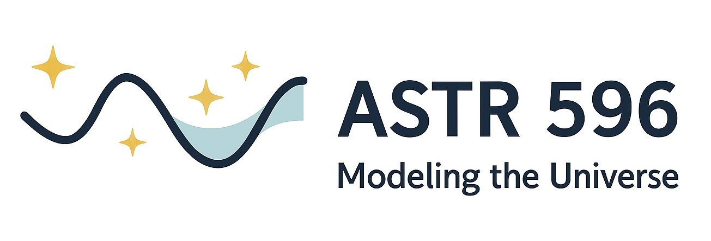

**Welcome to ASTR 596: Modeling the Universe!** This course takes you on a journey from Python fundamentals to neural networks and JAX, building transparent "glass box" models that reveal the physics within astronomical phenomena.

Our projects follow a deliberate progression from **deterministic simulation** → **stochastic methods** → **statistical inference** → **machine learning**, mirroring how computational astrophysics evolved as a field. Each project builds on previous code and concepts, reducing cognitive load through scaffolding.

```{mermaid}
flowchart LR
    A["Act I:<br/>Weeks 1-7"] --> B["Act II:<br/>Weeks 8-13"]
    B --> C["Act III:<br/>Weeks 13-16"]
    
    A1["Building Universes<br/>Direct Simulation"] --> A
    B1["Observing Universes<br/>Inverse Problems"] --> B
    C1["Learning from Universes<br/>Pattern Discovery"] --> C
    
    style A fill:#e3f2fd,stroke:#1976d2
    style B fill:#f3e5f5,stroke:#7b1fa2
    style C fill:#e8f5e9,stroke:#388e3c
```

**Act I:** Deterministic simulation (Python → OOP → N-body dynamics)  
**Act II:** Stochastic methods & statistical inference (Monte Carlo → Bayesian/MCMC)  
**Act III:** Machine learning & autodifferentiation (Gaussian Processes → Neural Networks → JAX)

:::{admonition} Course Philosophy: "Glass Box" Modeling
:class: tip

**Earned Complexity**: We implement fundamental algorithms from first principles before leveraging advanced frameworks. Every line of code serves understanding — no black boxes allowed until you've built the glass box yourself.

**Core Principles**: 
- *"Think first, code second"* - An hour of planning saves a week of debugging
- *"Understanding > Performance"* - Slower code you understand beats fast code you don't
- *"Physics first, Python later"* - Debug with physics intuition, not print statements
- *"Productive struggle is the point"* - Being stuck means you're learning something worth knowing

**Growth Mindset**: Cognitive science shows that working at the edge of your ability — where you're challenged but not overwhelmed — optimizes learning. This is where learning happens. Expect to iterate: professional code is rarely right the first time. When you're confused or stuck, that's not a bug in your learning process, it's a feature.
:::

%```{figure} https://imgs.xkcd.com/comics/astrophysics.png
%:alt: astrophysics
%:align: center

%*Sometimes the universe writes better stories than we could imagine.* ([xkcd](https://xkcd.com))
%```

## Project Timeline & Core Concepts

| Project | Duration | Core Concepts | Key Connection |
|---------|----------|---------------|----------------|
| 🐍 **Project 1:** Stellar Populations | 1.5 weeks | Object-oriented design, vectorization, simple plotting | Builds `Star` & `StellarPopulation` classes |
| 🪐 **Project 2:** N-Body Star Clusters | 2 weeks | Numerical integration, Monte Carlo sampling, realistic stellar dynamics | Uses P1's `StellarPopulation` to simulate actual clusters |
| ☀️ **Project 3:** Monte Carlo Radiative Transfer | 3 weeks | Radiative transfer physics, Monte Carlo methods, photon transport | Builds on stellar physics from earlier projects |
| 🌌 **Project 4:** Cosmological Inference | 3 weeks | Bayesian inference, MCMC, parameter estimation | P2's leapfrog → HMC sampler! |
| 📊 **Project 5:** Gaussian Processes | 3 weeks | Surrogate modeling, kernel methods, uncertainty quantification | Emulates/analyzes P2's N-body simulations |
| 🧠 **Final:** Neural Networks + JAX | 4 weeks | Deep learning, automatic differentiation, GPU acceleration | Learns from N-body dynamics + accelerates everything |

## The Scaffolding Architecture

```{mermaid}
flowchart TD
    P1["Project 1: Stellar Populations<br/>Star/StellarPopulation classes<br/>Vectorization & plotting<br/> "]
    P2["Project 2: N-Body Star Clusters<br/>Reuses StellarPopulation<br/>Leapfrog - Realistic dynamics<br/> "]
    P3["Project 3: Monte Carlo RT<br/>Radiative transfer physics<br/>Photon transport methods<br/> "]
    P4["Project 4: Cosmological Inference<br/>Leapfrog to HMC sampler<br/>Bayesian/MCMC<br/> "]
    P5["Project 5: Gaussian Processes<br/>Kernel methods<br/>Stats to ML bridge<br/> "]
    PF["Final: Neural Networks + JAX<br/>All optimization concepts<br/>Modern frameworks<br/> "]
    
    P1 -->|"StellarPopulation<br/>class"| P2
    P1 -->|"Stellar<br/>physics"| P3
    P2 -->|"Leapfrog<br/>algorithm"| P4
    P2 -->|"Monte Carlo<br/>sampling"| P3
    P2 -->|"N-body data<br/>for ML"| P5
    P2 -->|"Simulation<br/>to accelerate"| PF
    P3 -->|"Stochastic<br/>methods"| P4
    P4 -->|"Optimization"| P5
    P5 -->|"Kernel to NN<br/>connection"| PF
    P1 -->|"OOP design<br/>patterns"| PF
    
    style P1 fill:#e3f2fd
    style P2 fill:#e1f5fe
    style P3 fill:#fff3e0
    style P4 fill:#f3e5f5
    style P5 fill:#e8f5e9
    style PF fill:#fce4ec
```

:::{admonition} The Beauty of Scaffolding
:class: tip
Notice how no code is throwaway! Your `StellarPopulation` class from Week 1 generates the star cluster in Week 2. The leapfrog integrator you write for modeling N-body dynamics becomes the engine for exploring parameter space via Hamiltonian Monte Carlo. Most beautifully: your N-body simulations become the training data for your machine learning projects. You're not just learning algorithms — you're building a complete computational research pipeline.
:::

## Friday Class Structure

Every Friday follows a consistent rhythm designed for active learning:

::::{grid} 1 1 2 2

:::{grid-item-card} 📚 **11:00-11:40 AM**
Interactive Lecture
^^^
- Concept review & clarification
- Q&A on required readings
- Live coding demonstrations
- Project requirement discussion
:::

:::{grid-item-card} 💻 **11:40 AM-1:40 PM**
Hands-On Implementation
^^^
- **Collaborative work time** with project partners
- Discuss approaches and debug together
- Everyone writes their own implementation
- Instructor support rounds
:::

::::

:::{admonition} Collaboration Philosophy: Support Without Copying
:class: info

**How we work together:** You'll have project partners for discussion and debugging, but everyone maintains their own code. Think of it like a research group - you're tackling the same problem, helping each other understand concepts and fix bugs, but each person owns their implementation.

**What this looks like in practice:**
- ✅ "How are you handling the boundary conditions?" 
- ✅ "Can you help me understand why this is diverging?"
- ✅ Looking at each other's code to debug together
- ✅ Sharing conceptual insights and approaches
- ❌ Copying code blocks between implementations
- ❌ One person coding while others watch

This mirrors real computational research - collaborative problem-solving with individual ownership.
:::

## Course Highlights & Features

::::{grid} 1 1 2 3

:::{grid-item-card} 🔬 **Glass Box Methodology**
Build every algorithm from scratch before using libraries
:::

:::{grid-item-card} 👥 **Collaborative Learning**
Project partners for discussion & debugging (individual code)
:::

:::{grid-item-card} 🚀 **Modern Frameworks**
Bridge from NumPy to JAX ecosystem by course end
:::

:::{grid-item-card} 🌟 **Real Astrophysics**
Every project addresses genuine astrophysical problems
:::

:::{grid-item-card} 🤖 **AI Integration**
Strategic three-phase approach that builds authentic AI literacy for modern computational research careers
:::

:::{grid-item-card} 📈 **Growth Mindset**
Progress over perfection, productive struggle as pedagogy
:::

::::

## Responsible AI: Three-Phase Scaffolding

Strategic three-phase approach that builds authentic AI literacy for modern computational research careers:

:::{list-table} **AI as a Learning Partner, Not a Replacement**
:header-rows: 1
:widths: 20 30 50

* - Phase
  - Weeks
  - Permitted Usage
* - **Phase 1**
  - Weeks 1-7
  - Foundation building with limited AI (30-min rule before debugging help)
* - **Phase 2**
  - Weeks 8-13
  - Strategic integration with critical evaluation (refactoring after baseline works)
* - **Phase 3**
  - Weeks 14-16
  - Professional practice (acceleration while maintaining understanding)
:::

:::{important} Why This Matters
AI raises the bar for expertise. LLMs confidently generate plausible-looking code that can be subtly wrong, numerically unstable, or inefficient. Our scaffolding teaches you to understand deeply enough to catch these errors and know *why* they're wrong.
:::

## Quick Navigation

::::{grid} 2 2 2 2

:::{grid-item-card} 📋 **Syllabus**
:link: ./01-course-info/01-astr596-syllabus-fall25
Complete course policies & expectations
:::

:::{grid-item-card} 🎯 **Projects**
:link: ./08-short-projects/index
Six progressive computational projects
:::

:::{grid-item-card} 🤖 **AI Guidelines**
:link: ./01-course-info/03-astr596-ai-policy
Detailed scaffolding framework
:::

:::{grid-item-card} 🛠️ **Setup Guide**
:link: ./02-getting-started/index
Environment setup & tools
:::

::::

## Expected Learning Outcomes

By course end, you will have:

✅ **Built every algorithm from scratch** – No black boxes remain  
✅ **Discovered algorithm generality** – Tools transfer across domains  
✅ **Developed computational intuition** – Know why methods fail/succeed  
✅ **Created a portfolio** – 6 working projects demonstrating progression  
✅ **Mastered modern tools** – JAX, autodiff, GPU acceleration potential  
✅ **Practiced research skills** – Git, testing, documentation, scientific writing

## Getting Started Checklist

:::{admonition} Before First Class (Friday, Aug 29)
:class: warning

1. ✅ Complete [Project 0: Onboarding](./08-short-projects/00-onboarding-assignment.md) on Canvas by **Thursday, Aug 28, 11:59 PM**
2. 📖 Review the [Syllabus](./01-course-info/01-astr596-syllabus-fall25.md) and [AI Guidelines](./01-course-info/03-astr596-ai-policy.md)
3. ⚙️ Set up your [development environment](./02-getting-started/index.md)
4. 👥 Join the course [GitHub Classroom](https://classroom.github.com/classrooms/226159624-astr-596-modeling-the-universe)
5. 💬 Join the course Slack workspace (link on Canvas)
6. 🤖 Bookmark the [Virtual Tutor GPT](https://chatgpt.com/g/g-68aabb9278d08191926feb3f5512686c-astr-596-modeling-the-universe-tutor)
:::

## Instructor & Support

:::{list-table}
:widths: 30 70

* - **Instructor**
  - Dr. Anna Rosen
* - **Office**
  - Physics 239
* - **Email**
  - <alrosen@sdsu.edu>
* - **Student "Hacking" Hours**
  - Wednesdays 1-2 PM (P-239) or by appointment
* - **Course Website**
  - <https://astrobytes-edu.github.io/astr596-modeling-universe/>
* - **Issues & Questions**
  - [GitHub Issues](https://github.com/astrobytes-edu/astr596-modeling-universe/issues)
:::

:::{admonition} Growth Mindset Reminder
:class: note

*"I don't know" means "I don't know **yet**."*

What feels overwhelming in Week 1 will feel manageable by Week 5, and by Week 15 those early challenges will seem trivial. Trust the process, embrace the challenge, and discover that you're capable of doing hard things.
:::

---

✨ *Welcome to a transformative journey from Python basics to the frontiers of computational astrophysics. Together, we'll model the universe, one algorithm at a time.* ✨