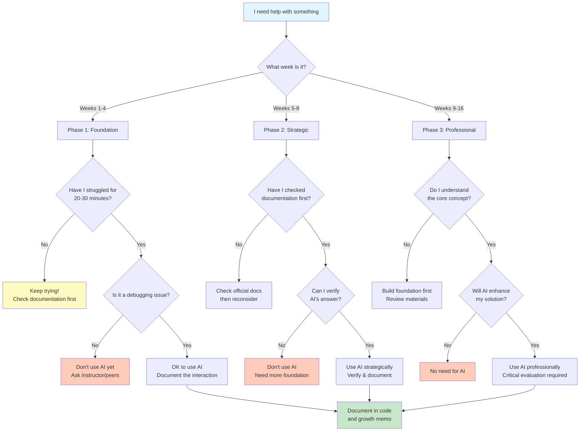

# ASTR 596: Artificial Intelligence Policy and Learning Framework

## Quick Links
- [Course Syllabus](course-info/syllabus)
- [Why This Course is Different](course-info/why-astr596-is-different)
- [Learning Guide](course-info/learning-guide)
- [Project Submission Guide](short-projects/0_project_submission_guide)

## Should I Use AI for This? Decision Flowchart



## Course Philosophy: AI as a Performance Amplifier, Not a Substitute

**The Reality**: AI tools are transforming scientific computing. As future astrophysicists, you will work in an AI-integrated environment where these tools are standard practice.

**The Challenge**: Recent MIT research suggests heavy AI reliance weakens cognitive development. Students who used ChatGPT showed weaker neural connectivity and couldn't remember what they'd just "written."

**Our Approach**: This course treats AI as a **performance amplifier** for competent practitioners, not as a substitute for learning. You must first develop core competencies through productive struggle, then learn to use AI strategically.

**Research Support**: Ting & O'Briain (2025) found that students using structured AI integration with documentation requirements **decreased their AI dependence over time** while developing stronger problem-solving skills.

**Questions About AI Usage?** Ask the instructor anytime—no judgment! This is a learning process for all of us, and open communication helps refine our approach.

## How to Cite AI Usage - Template

### In-Code Documentation Template

```python
# AI-assisted: [Tool name] helped with [specific aspect]
# Verified against: [documentation URL or source]
# Original approach: [what you tried first]
# Why AI suggestion works: [your understanding]
def your_function():
    # Implementation here
    pass
```

### Growth Memo AI Section Template

```markdown
## AI Usage Reflection

**Interaction 1:**
- Problem: [What you were stuck on]
- My attempt: [What you tried for 20-30 min]
- AI query: [What you asked]
- AI response summary: [Key points]
- Verification: [How you confirmed it was correct]
- Learning: [What you understand now]

**Self-Assessment:**
- Phase compliance: [1-5 scale]
- Independence level: [1-5 scale]
- Understanding depth: [1-5 scale]
```

## Scaffolded AI Integration Framework

### Phase 1: Foundation Building (Weeks 1-4)
**Dates: Aug 29 - Sept 19**  
**Rule: Struggle First, AI Second**

- **Primary Learning**: Official documentation and manual implementation
- **The 20-Minute Rule**: Minimum struggle time before AI
- **AI Usage**: Debugging assistance only after genuine effort
- **Documentation**: All AI interactions must include verification sources

**Good Example:**
```python
# Spent 25 min trying to figure out matplotlib subplots
# Checked matplotlib.pyplot.subplots documentation
# AI helped clarify difference between Figure and Axes objects
# Verified with: https://matplotlib.org/stable/api/figure_api.html
fig, axes = plt.subplots(2, 2, figsize=(10, 8))
```

**Bad Example:**
```python
# Asked ChatGPT: "make a 2x2 grid of plots"
# [Copy-pasted response without understanding]
```

### Phase 2: Strategic Integration (Weeks 5-8)
**Dates: Sept 20 - Oct 17**  
**Rule: Documentation-First AI Assistance**

- **Primary Learning**: Continue documentation-first approach
- **AI Enhancement**: For efficiency after demonstrating understanding
- **Verification Requirement**: Cross-reference all AI suggestions
- **Critical Evaluation**: Explain why suggestions work/don't work

### Phase 3: Professional Practice (Weeks 9-16)
**Dates: Oct 18 - Dec 18**  
**Rule: AI as Productivity Tool**

- **Competency Assumption**: Foundation knowledge enables critical evaluation
- **Professional Usage**: Acceleration and complex problem-solving
- **Quality Standard**: AI-assisted work must exceed manual work quality
- **Documentation Standard**: Continue citing all AI usage

## AI Usage Log Template

Keep a running log in your project repository:

```markdown
# AI Usage Log - Project [Number]

## Date: [Date]
**Tool:** ChatGPT/Claude/Copilot
**Purpose:** Debugging/Concept clarification/Optimization
**Phase Compliance:** ✓ Followed phase [1/2/3] guidelines

### Query:
[Exact question you asked]

### Key Insights:
[What you learned]

### Verification:
[How you confirmed accuracy]

### Integration:
[How you used this in your code - line numbers]
```

## Specific Examples: Good vs Bad AI Usage

### Debugging (All Phases - After Struggle)
✅ **GOOD**: "I'm getting IndexError on line 45. I've checked array dimensions, confirmed indices are within bounds, and added print statements. The error happens when i=n. Why might this occur in a loop?"

❌ **BAD**: "Fix this error: [paste entire code and error]"

### Concept Understanding (Phase 2+)
✅ **GOOD**: "I understand Euler integration accumulates error. Can you explain why RK4 has O(h^4) error while Euler has O(h)? I've read that it's related to Taylor series but don't see the connection."

❌ **BAD**: "Explain RK4 integration"

### Optimization (Phase 3)
✅ **GOOD**: "My N-body simulation works but takes 5 minutes for 1000 particles. I'm using nested loops for force calculation. Here's my approach [show code]. What optimization strategies should I consider?"

❌ **BAD**: "Make this code faster"

## Assessment Integration

### Growth Memo Components (1-2 pages total)

Each Growth Memo should include:

1. **Technical Reflection** (½ page)
   - Key challenges and solutions
   - Understanding gained

2. **AI Usage Section** (½ page)
   - 2-3 significant AI interactions
   - Self-assessment scores (1-5):
     - Phase compliance
     - Independence level  
     - Understanding depth

3. **Growth Trajectory** (2-3 sentences)
   - What's improving
   - What needs work

### Understanding Verification

Throughout the course, expect friendly check-ins:
- "Walk me through your approach here"
- "What alternatives did you consider?"
- "How would this change if...?"

These are supportive, not punitive—catching confusion early helps learning!

## The Cognitive Ownership Principle

**Never copy-paste without understanding**

After any AI assistance:
1. **Close the AI chat**
2. **Write the solution from memory**
3. **Explain it to your rubber duck**
4. **Modify it to prove understanding**

## Academic Integrity and AI Misuse

### This Policy is a Privilege

Using AI tools while learning is a privilege that requires responsibility. Questions about appropriate usage? **Ask the instructor—no judgment!** Better to ask than accidentally violate policy.

### Violations and Consequences

**Minor Violations** (misunderstanding policy):
- Discussion with instructor
- Resubmission with 20% reduction
- Learning intervention

**Major Violations** (extensive misuse):
- Zero on assignment
- Report to Student Rights & Responsibilities
- Potential course failure

## Recommended AI Tools and Strategies

### Tools by Purpose
- **Conceptual Understanding**: Claude, ChatGPT (use in browser, NOT in IDE)
- **Documentation Search**: Perplexity (auto-cites sources)
- **Study Guide Creation**: NotebookLM
- **Code Completion**: DISABLED in IDE per syllabus

### Strategic Usage Tips
1. **Ask for understanding, not solutions**
2. **Request Socratic dialogue**: "Don't solve this, but what questions should I ask?"
3. **Verify everything**: Check documentation, test edge cases
4. **Build incrementally**: Use AI for small pieces, not whole projects

## Bottom Line

AI amplifies human capability—it doesn't replace understanding. Master both fundamentals AND strategic AI usage to thrive. Those who substitute AI for learning will fail to meet elevated standards.

**Remember**: The struggle is where learning happens. AI should enhance your journey, not bypass it.

**Questions?** Ask anytime at <alrosen@sdsu.edu> or during office hours. Open communication helps everyone!