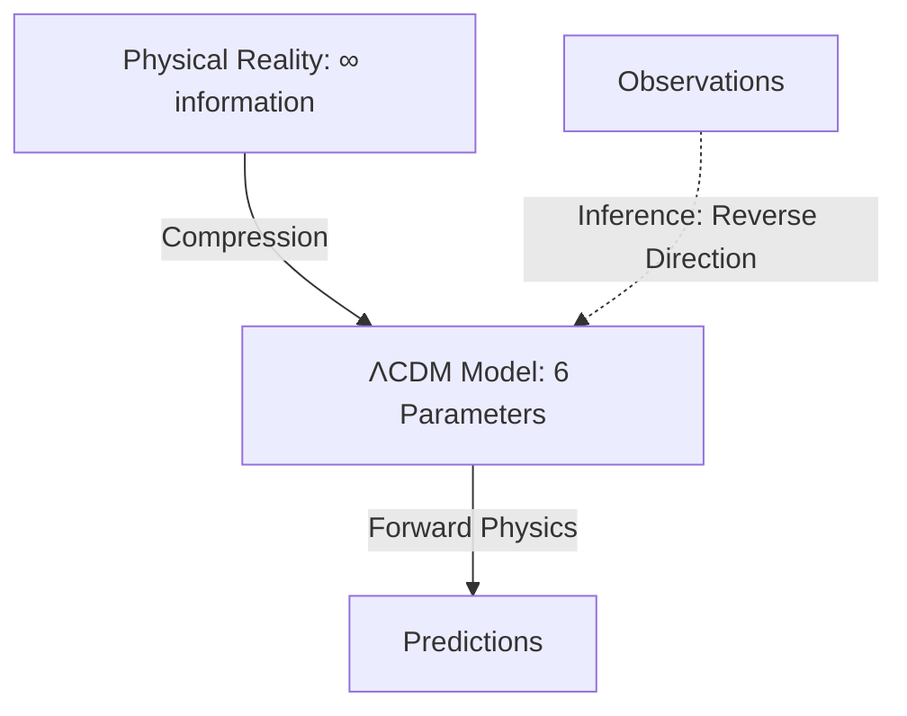

# ASTR 596: Comprehensive Pedagogical Audit
## Modeling the Universe Through Computational Thinking

**Document Purpose**: This comprehensive audit analyzes the pedagogical philosophy, teaching strategies, and structural patterns employed in ASTR 596 to inform future course development, particularly Module 6 (Computing the Universe with JAX).

**Created**: 2025-11-06
**Instructor**: Dr. Anna Rosen
**Course**: ASTR 596 - Modeling the Universe (Fall 2025)

---

## Executive Summary

ASTR 596 represents a paradigm shift in graduate astrophysics education, integrating statistical mechanics, computational methods, Bayesian inference, and machine learning through a unified **glass-box methodology**. The course rejects the traditional "black-box" approach where students use pre-built tools without understanding their foundations, instead requiring students to build every algorithm from first principles.

**Core Innovation**: The course reveals that seemingly disparate topics — stellar structure, N-body dynamics, Monte Carlo methods, MCMC sampling, and neural networks — share the same underlying statistical and computational frameworks. Students don't learn isolated techniques; they learn universal principles that span from quantum mechanics to cosmology.

**Key Metrics**:

- **10 major modules** organized into three thematic acts
- **6 progressive projects** with intentional code reuse and scaffolding
- **3-phase AI policy** balancing productivity with deep understanding
- **Glass-box philosophy**: Every algorithm derived from first principles
- **Real science**: Nobel Prize datasets, authentic research problems

---

## I. Pedagogical Philosophy

### 1.1 The Glass-Box Methodology

**Definition**: Students must understand and implement every algorithm from mathematical foundations to working code. No "magic" functions, no unexplained tools.

**Manifestations**:

- **Project 1**: Students derive stellar structure equations from statistical mechanics before implementing them
- **Project 2**: Leapfrog integrator derived from Hamiltonian mechanics, energy conservation proven mathematically
- **Project 4**: Metropolis-Hastings and HMC algorithms implemented from scratch, detailed balance proven
- **All modules**: Mathematical foundations precede computational implementation

**Pedagogical Rationale**:
> "Understanding WHY enables implementing HOW"

Students who understand symplectic integration (mathematically) can debug when energy conservation fails. Students who understand detailed balance (statistically) can diagnose MCMC convergence issues. Deep understanding enables troubleshooting, innovation, and transfer to new problems.

**Evidence of Success**:

- Project 2 reuses leapfrog integrator in Project 4 (N-body → HMC), demonstrating transfer
- Students recognize that HMC is "just N-body in parameter space"
- Diagnostic tools built for MCMC immediately work for HMC (modular understanding)

### 1.2 Statistics as the Universal Language

**Core Thesis**: Modern astrophysics IS applied statistics and computational science.

**Pedagogical Strategy**: Every physics concept teaches a fundamental statistical principle:

| Physics Concept | Statistical Foundation | First Appears | Returns In |
|----------------|----------------------|--------------|------------|
| **Temperature** | Distribution parameter (variance) | Module 1, Part 1 | Stellar structure, MCMC "temperature" |
| **Pressure** | Ensemble average of momentum transfer | Module 1, Part 1 | Stellar structure, virial theorem |
| **Stellar structure equations** | Moments of Boltzmann equation | Module 2 | Galaxy dynamics (Jeans equations) |
| **Conservation laws** | Constraints from symmetries (Noether) | Module 4 | Energy conservation in integrators |
| **Phase space** | State representation | Module 4 | N-body dynamics, MCMC sampling |
| **Detailed balance** | Time-reversibility, equilibrium | Module 5 | MCMC convergence |
| **Central Limit Theorem** | Why averaging works | Module 1 | MCMC convergence, neural networks |

**Pedagogical Innovation**: Traditional courses teach thermodynamics, stellar physics, and statistics as separate subjects. ASTR 596 reveals they're ONE subject viewed through different lenses. This dramatically reduces cognitive load while deepening understanding.

### 1.3 Narrative-Driven Learning

**Strategy**: Every module opens with a compelling historical discovery story that motivates the mathematics to follow.

**Examples**:

**Module 1 (Statistical Thinking)**:
> "In 1827, botanist Robert Brown peered through his microscope at pollen grains suspended in water. The grains danced chaotically... Einstein's 1905 insight: statistical mechanics predicts collective behavior from billions of random collisions."

**Module 2 (Stellar Structure)**:
> "In 1920, Arthur Eddington faced an impossible challenge: $10^{57}$ particles... yet claimed stellar structure reduces to just four differential equations. His colleagues thought he was mad."

**Module 3 (Stellar Dynamics)**:
> "In 1933, Fritz Zwicky applied the virial theorem to the Coma cluster and discovered it contained 400 times more mass than could be seen. Most astronomers dismissed his result as an error... 40 years later, dark matter was confirmed."

**Module 5 (Bayesian Inference)**:
> "Henrietta Leavitt discovered the Period-Luminosity relation... but transforming this pattern into distance measurements requires navigating the full complexity of astronomical inference."

**Pedagogical Rationale**: Stories provide:

1. **Motivation**: Why does this math matter?
2. **Historical context**: How did we discover this?
3. **Epistemological grounding**: What were the challenges?
4. **Humanization**: Science is done by people who struggled, made mistakes, and persevered

**Structure**: Discovery story → Conceptual foundation → Mathematical formalization → Computational implementation

### 1.4 Multiple Learning Paths and Just-In-Time Learning

**Three-Tier Priority System**:

- 🔴 **Essential** (Fast Track): Core concepts, required for projects
- 🟡 **Important** (Standard Path): Deeper understanding, connections between topics
- 🟢 **Enrichment** (Complete Path): Historical context, proofs, advanced topics

**Implementation**:

```markdown
:::{grid-item-card} 🏃 **Fast Track**
Just starting the course? Read only sections marked with 🔴
- [Linear Algebra Overview](#overview)
- [Vectors Essentials](#part-2-vectors)
:::

:::{grid-item-card} 🚶 **Standard Path**
Preparing for projects? Read 🔴 and 🟡 sections
- Everything in Fast Track, plus:
- [Eigenvalues & Eigenvectors](#part-4-eigenvalues)
:::
```

**Project-Based Navigation**:

Each module includes "Quick Jump to What You Need by Project" sections:

```markdown
**For Project 2 (N-body Dynamics)**:
- Cross products for angular momentum
- Eigenvalues for orbital stability analysis
- Matrix multiplication for transformations
```

**Pedagogical Rationale**:

- **Cognitive load management**: Students can focus on essentials initially
- **Differentiation**: Advanced students can go deeper
- **Return visits**: Modules designed for multiple readings at different depths
- **Just-in-time learning**: Learn concepts when they're needed for projects

### 1.5 Productive Struggle and Growth Mindset

**Philosophy**: Difficulty builds competence. Struggle is essential for learning.

**Manifestations**:

1. **Growth Memos** (all projects): Students reflect on:
   - What they struggled with and why
   - How they overcame challenges
   - What they learned about their learning process
   - How their understanding evolved

2. **Explicit Acknowledgment of Difficulty**:
   > "This is harder but infinitely more powerful. When you understand that pressure is variance and temperature is a distribution parameter, you don't just know the equations—you understand why they must be that way."

3. **3-Phase AI Policy**: Designed to maximize learning while acknowledging AI's role:
   - **Phase 1** (Projects 1-2): Baseline implementation without AI
   - **Phase 2** (Projects 3-4): Strategic AI use after baseline works
   - **Phase 3** (Projects 5-6): Full AI integration with critical evaluation

**Pedagogical Rationale**:

- **Desirable difficulty**: Challenges that feel hard but are achievable build long-term retention
- **Metacognition**: Reflecting on struggle develops self-awareness as learners
- **Authentic science**: Real research involves uncertainty, failure, and iteration
- **AI literacy**: Learning when to use AI vs. when deep understanding requires manual work

---

## II. Structural Pedagogical Patterns

### 2.1 Modular Architecture with Explicit Connections

**Pattern**: Each module is self-contained yet explicitly connected to others.

**Forward Connections** (scaffolding):

```markdown
:::{note} 📅 When You'll Use This
- **First appears in**: Project 2 (N-body dynamics)
- **Critical for**: Understanding phase space throughout the course
- **Returns in**: Every project dealing with multi-particle systems
:::
```

**Backward Connections** (review):

```markdown
:::{admonition} 🔗 Connection to Statistical Thinking Module
Remember from Module 1 that temperature is a distribution parameter, not a particle property. Here we see the same principle: velocity dispersion characterizes the distribution of stellar velocities in a cluster.
:::
```

**Cross-Module Synthesis**:

- **Leapfrog integrator**: Derived in Module 4 → Used in Project 2 (N-body) → Reused in Project 4 (HMC)
- **Statistical mechanics**: Foundation in Module 1 → Stellar structure (Module 2) → Stellar dynamics (Module 3)
- **Bayesian framework**: Module 5 Part 2 → MCMC (Module 5 Part 3-4) → Machine learning (Module 6)

**Pedagogical Benefit**: Reduces cognitive load by highlighting conceptual unity. Students see patterns, not isolated facts.

### 2.2 Conceptual Checkpoints and Metacognitive Scaffolding

**Frequent Understanding Checks**:

```markdown
:::{admonition} 🤔 Check Your Understanding
A small globular cluster has 100,000 stars. How many unique force pair calculations are needed per timestep?

:::{admonition} Solution
:class: tip, dropdown
[Detailed worked solution with explanation]
:::
::::
```

**Conceptual Checkpoints**:

```markdown
:::{admonition} 🎯 Conceptual Checkpoint
Before proceeding, ensure you understand:
- Why can't temperature exist for one particle?
- How does random molecular chaos create steady pressure?
- Why do sums of random variables become Gaussian?
:::
```

**"What We Just Learned" Boxes**:

```markdown
:::{important} 💡 What We Just Learned
**Temperature is a statistical parameter, not a particle property.** It characterizes the width (variance) of the velocity distribution. This teaches us that macroscopic properties emerge from distributions, not individuals.
:::
```

**Pedagogical Rationale**:

- **Active recall**: Testing strengthens memory more than re-reading
- **Metacognition**: Students assess their own understanding
- **Early error detection**: Catch misconceptions before they compound
- **Formative assessment**: Guides students toward key insights

### 2.3 Multi-Representational Approach

**Strategy**: Present concepts through multiple complementary lenses.

**Example: Vectors (Module 4)**

**Physical Perspective**:
> "A vector represents any quantity with both magnitude and direction. The velocity of Earth orbiting the Sun is a vector—it has a speed (30 km/s) and a direction (tangent to the orbit)."

**Geometric Perspective**:
> "A vector is an arrow in space. Crucially, this arrow is free—it doesn't have a fixed starting point. The displacement '3 km north' is the same vector whether you start from your house or from campus."

**Algebraic Perspective**:
> "A vector is an ordered list of numbers—its components in some coordinate system: $\vec{v} = \begin{pmatrix} -15.2 \\ 25.8 \\ 0.0 \end{pmatrix}$ km/s"

**Computational Perspective**:

```python
# NumPy array representation
velocity = np.array([-15.2, 25.8, 0.0])  # km/s
```

**Pedagogical Rationale**:

- Different students prefer different representations
- Deep understanding requires fluency across representations
- Professional scientists fluidly shift between perspectives
- Connections between representations reveal deeper structure

### 2.4 Computational Demonstrations with Immediate Feedback

**Interactive Code Blocks**:

Every major concept includes executable Python code with:

1. **Clear documentation**: What it does and why
2. **Invitation to experiment**: "Try changing N to see..."
3. **Visual output**: Plots that make concepts concrete
4. **Pedagogical commentary**: "Notice how...", "The key insight is..."

**Example Structure**:

```markdown
:::{admonition} 💻 Computational Demo: Watch Chaos Become Gaussian
:class: note

Copy and paste this code to see the Central Limit Theorem in action:

[Complete working code]

**Try it yourself**: Change N to see how temperature becomes meaningful with more particles!
:::
```

**Pedagogical Rationale**:

- **Embodied cognition**: Running code creates deeper understanding than reading
- **Immediate feedback**: Students see results instantly
- **Experimentation**: Changing parameters builds intuition
- **Authenticity**: Professional computational scientists experiment with code

### 2.5 Visual Learning Aids

**Comprehensive Figure Design**:

Every figure includes:

1. **Descriptive caption**: What the figure shows
2. **Pedagogical interpretation**: What to learn from it
3. **Connection to text**: Referenced by name and number
4. **Visual clarity**: Professional scientific plotting standards

**Example Caption** (Module 1):
> "**Temperature emerges as a meaningful statistical concept only with sufficient particles.** This figure demonstrates that temperature is not a property of individual particles, but rather a parameter characterizing the width (variance) of velocity distributions across ensembles. For a single particle (N=1), temperature is undefined. As particle number increases through powers of 10 (N = 10, 10², 10³, 10⁴, 10⁵), the measured temperature converges toward the true value of 300 K, with errors decreasing from ~54% (N=10) to ~0.1% (N=10⁵)."

**Mermaid Diagrams**:

Flowcharts and concept maps make relationships explicit:



**Pedagogical Rationale**:

- **Dual coding**: Text + visuals strengthen memory
- **Cognitive load reduction**: One well-designed figure > 1000 words
- **Accessibility**: Multiple modalities reach more students
- **Professional standards**: Students learn scientific visualization

### 2.6 Incremental Complexity with Scaffolding

**Pattern**: Simple → Concrete → Abstract → General

**Example: Building Pressure from First Principles (Module 1).**

**Step 1: Single collision momentum transfer.**
> When a molecule with velocity $v_x$ hits the wall and bounces back elastically: $\Delta p = 2mv_x$

**Step 2: Collision rate.**
> How many molecules hit the wall per second?

**Step 3: Total momentum transfer per unit time.**
> Force = momentum transfer per unit time

**Step 4: From force to pressure.**
> Pressure is force per unit area: $P = nm\langle v_x^2 \rangle$

**Step 5: Statistical mechanics emerges.**

> For Maxwell-Boltzmann distributed velocities: $P = nk_B T$

**Pedagogical Rationale**:

- **Chunking**: Break complex derivations into manageable steps
- **Scaffolding**: Each step builds on previous understanding
- **Cognitive load management**: Don't overload working memory
- **Mastery**: Students can follow and reproduce the reasoning

---

## III. Course Structure and Progression

### 3.1 Three-Act Narrative Structure

#### Act I: Deterministic Foundations (Modules 1-3)

**Module 1**: Python foundations and computational thinking
**Module 2-3**: Deterministic physics (stellar populations, N-body dynamics)
**Module 4**: Mathematical foundations (linear algebra, differential equations)

**Pedagogical Function**: Establish computational fluency and physical intuition before introducing uncertainty

---

#### Act II: Statistical Thinking (Modules 4-5)

**Module 1 (Statistical)**: How Nature Computes—statistical mechanics from first principles
**Module 2**: From Particles to Stars—stellar structure as statistics
**Module 3**: When Stars Become Particles—stellar dynamics and the virial theorem

**Pedagogical Function**: Reveal that all of physics is secretly statistics in disguise

---

#### Act III: Inference and Intelligence (Module 6)

**Module 1 (Inference)**: Bayesian Statistics and Inference
**Module 2**: Computing the Universe (JAX, automatic differentiation, professional software)
**Module 3**: Machine Learning Foundations

**Pedagogical Function**: Apply statistical thinking to inverse problems and modern ML methods

### 3.2 Project Progression and Code Reuse

**Intentional Scaffolding Through Projects**:

| Project | Core Skills | Reuses From | Prepares For |
|---------|------------|-------------|--------------|
| **P1: Stellar Populations** | Vectorization, OOP, classes | — | Object-oriented thinking |
| **P2: N-body Dynamics** | Leapfrog integrator, conservation laws | P1: Class structure | P4: HMC uses same integrator |
| **P3: Monte Carlo RT** | Sampling, random processes | P1: Vectorization | P4: MCMC sampling |
| **P4: MCMC/HMC** | Bayesian inference, diagnostics | P2: Leapfrog → HMC<br>P3: Sampling theory | P5: GP priors |
| **P5: Gaussian Processes** | Covariance, kernels, inference | P4: Bayesian framework | P6: Neural network priors |
| **P6: Neural Networks** | Optimization, autodiff, ML | P4: Gradients<br>P5: Function approximation | Research |

**The Leapfrog Revelation**:

Students implement leapfrog integration for N-body gravity (Project 2). When they reach HMC (Project 4), the project description states:

> "**Key insight**: HMC is just N-body in parameter space!
> - Particles → Parameters
> - Potential energy → Negative log-posterior
> - Kinetic energy → Momentum (auxiliary variables)"

**Pedagogical Impact**: This is a profound "aha!" moment. Students suddenly see that seemingly different domains (gravity, statistics) use identical mathematical structures. This transfer of learning is the course's ultimate goal.

### 3.3 Real Science with Authentic Data

**Philosophy**: Students do actual science, not toy problems.

**Project 4: Type Ia Supernovae and Dark Energy**:
- **Data**: Joint Lightcurve Analysis (JLA) compilation—actual Nobel Prize data
- **Goal**: Infer cosmological parameters ($\Omega_m$, $h$) from supernova distances
- **Context**: "This is the same analysis that revealed dark energy dominates the cosmos. You're not just practicing methods—you're doing real science with Nobel Prize data."

**Pedagogical Benefits**:
1. **Motivation**: Stakes feel real, not contrived
2. **Authenticity**: Messy real data, not sanitized textbook problems
3. **Complexity**: Covariance matrices, systematic errors, model selection
4. **Pride**: Students can say "I measured dark energy!"

---

## IV. Specific Pedagogical Techniques

### 4.1 Margin Notes and Contextual Definitions

**Strategy**: Define technical terms exactly when they're first needed.

```markdown
:::{margin}
**Parameter**
A variable that characterizes an entire distribution or model. Unlike individual data points, parameters describe global properties. *Examples:* mean (μ), standard deviation (σ), temperature (T).
:::
```

**Pedagogical Rationale**:
- **Just-in-time learning**: No cognitive load from premature definitions
- **Reference**: Students can glance right for reminders
- **Precision**: Technical definitions when needed, intuitive explanations in text

### 4.2 Common Misconceptions and Pitfalls

**Strategy**: Explicitly address known misunderstandings.

```markdown
:::{warning} ⚠️ Common Misconception Alert
Many students think temperature is "average kinetic energy." While not entirely wrong, this is dangerously incomplete. A single fast particle doesn't have temperature any more than a single person has an average height.
:::
```

**Likelihood Pitfalls** (Module 5):
1. Forgetting intrinsic scatter
2. Assuming Gaussian errors
3. Ignoring correlations
4. Confusing likelihood with posterior

**Pedagogical Rationale**:
- **Preemptive correction**: Address errors before they form
- **Metacognition**: Students see where others struggle
- **Diagnostic**: Helps students self-assess understanding

### 4.3 Historical Context and Epistemology

**Strategy**: Show how scientific understanding evolved.

**Newton's Discovery** (Module 5):
> "Before Newton, natural philosophers had two types of knowledge: terrestrial physics and celestial mechanics. These were considered fundamentally different realms... Newton's radical insight: One equation $(F = GMm/r²)$ explains both."

**The Profound Lesson**:
> "Newton's model worked so spectacularly that it became difficult to imagine it could be wrong. For 200 years, any observation that didn't fit was assumed to be an error. It took Einstein's genius to realize the model itself needed revision."

**Pedagogical Rationale**:
- **Epistemic humility**: Our current understanding is provisional
- **Science as process**: Discovery involves false starts and revisions
- **Humanization**: Einstein struggled; it's okay for students to struggle
- **Context**: Why did we develop these particular methods?

### 4.4 Connection to Machine Learning and Modern Methods

**Strategy**: Bridge traditional astrophysics to modern ML/AI methods.

**Examples**:

**Temperature → Softmax Temperature**:
> "Neural networks: 'Temperature' in softmax controls output distribution spread—same statistical principle!"

**Statistical Mechanics → Machine Learning**:
> "That softmax function in neural networks? It's literally the Boltzmann distribution. MCMC sampling? It's statistical mechanics. The Central Limit Theorem that makes pressure stable? It's why stochastic gradient descent converges."

**Maximum Entropy**:
> "The same principle that gives us the Boltzmann distribution in physics also appears in cross-entropy loss for neural networks."

**Pedagogical Rationale**:
- **Relevance**: Connects "old" physics to cutting-edge ML
- **Unity**: Reveals deep connections across domains
- **Career preparation**: Modern astro requires ML literacy
- **Motivation**: Students see immediate applications

---

## V. Assessment Philosophy

### 5.1 Growth Memos as Metacognitive Development

**Required for All Projects**:

Students must write 1-2 page reflections addressing:

1. **What did you struggle with and why?**
2. **How did you overcome challenges?**
3. **What did you learn about your learning process?**
4. **How did your understanding evolve?**
5. **What would you do differently next time?**

**Grading**: Pass/Fail, evaluated on:
- Honesty and depth of reflection
- Evidence of metacognitive awareness
- Growth mindset language
- Specific examples from their work

**Pedagogical Rationale**:
- **Metacognition**: Thinking about thinking improves learning
- **Growth mindset**: Struggle is reframed as essential
- **Self-assessment**: Students learn to evaluate their own understanding
- **Long-term development**: Reflection skills transfer beyond the course

### 5.2 Code Review and Scientific Communication

**Project Rubric Structure** (Example: Project 4):

**Core Functionality (40 points)**:
- MCMC sampler works correctly (20 pts)
- HMC implementation correct (20 pts)

**Code Quality & Design (30 points)**:
- Modular design, clean functions (15 pts)
- Documentation and docstrings (15 pts)

**Scientific Communication (30 points)**:
- Visualization and interpretation (15 pts)
- Research memo quality (15 pts)

**Pedagogical Philosophy**:
- **Equal weight**: Code quality = Scientific communication
- **Professional standards**: Real research requires both
- **Modularity valued**: Reusable code > one-off scripts
- **Communication**: Science isn't done until it's explained clearly

### 5.3 Rigorous Grading with Explicit Rubrics

**From grading instructions** (CLAUDE.md context):

```markdown
**CRITICAL RULE: ALWAYS READ CODE FIRST**
- MUST use Read tool BEFORE any testing or claims
- READ EVERY LINE OF CODE - no skipping, no assumptions
- Document line numbers when identifying issues

**GRADING REQUIREMENTS - NO SHORTCUTS**
- READ EVERY FILE in each submission
- RUN THE ACTUAL CODE to verify functionality
- CHECK ALL PLOTS exist and meet requirements
- BE THOROUGH AND FAST - no half-assing, no lies
```

**Pedagogical Philosophy**:
- **Objective standards**: Rubric makes expectations clear
- **Fairness**: All students evaluated against same criteria
- **Feedback quality**: Specific, evidence-based comments
- **Academic integrity**: Rigorous but fair

---

## VI. Technology Integration

### 6.1 The 3-Phase AI Policy

**Phase 1** (Projects 1-2): **Foundation Building**
- ✅ AI can explain concepts, debug syntax, provide resources
- ❌ No AI-generated core code for required functionality
- **Rationale**: Build baseline competence without AI dependency

**Phase 2** (Projects 3-4): **Strategic AI Use**
- ✅ AI can assist after baseline implementation works
- ✅ Use AI for optimization, refactoring, advanced features
- ❌ Still no AI-generated core algorithms
- **Documentation required**: 3-line header in any AI-assisted file

**Phase 3** (Projects 5-6): **Integrated AI Workflow**
- ✅ Full AI integration with critical evaluation
- ✅ Use AI as professional scientists do
- **Critical thinking required**: "Do you understand what AI wrote?"

**Pedagogical Rationale**:

1. **Competence first**: Can't evaluate AI suggestions without baseline understanding
2. **Strategic use**: Learn when AI helps vs. hinders
3. **Professional preparation**: AI is a tool, not a crutch
4. **Metacognition**: Reflecting on AI use develops judgment
5. **Authenticity**: Professional computational scientists use AI strategically

### 6.2 Modern Computational Tools

**Python Ecosystem**:
- NumPy, SciPy: Numerical computing
- Matplotlib: Visualization
- JAX: Automatic differentiation, JIT compilation (Module 6)
- Object-oriented design: Classes, inheritance, polymorphism

**Version Control**:
- Students submit via GitHub/repositories
- Professional workflow preparation

**Documentation Standards**:
- Docstrings required for all functions
- README files for project structure
- Code comments for complex logic

**Pedagogical Rationale**:
- **Industry standards**: Prepare students for research and industry
- **Reproducibility**: Version control and documentation essential
- **Collaboration**: Professional tools enable teamwork
- **Transferable skills**: These tools used across computational science

---

## VII. Unique Strengths and Innovations

### 7.1 The Statistical Revelation

**Most Innovative Element**: Revealing that all of physics is statistics.

**Traditional Approach**:
- Thermodynamics course → learn $PV = nRT$
- Stellar structure course → learn stellar equations
- Statistics course → learn probability theory
- **Problem**: Students don't see connections

**ASTR 596 Approach**:
- Module 1: "Temperature is a distribution parameter, not a particle property"
- Module 2: "Stellar structure equations are moments of the Boltzmann equation"
- Module 3: "Stellar dynamics is the same statistical mechanics as gases, just with stars"
- **Insight**: These are ONE subject with different labels

**Pedagogical Impact**:
- **Reduced cognitive load**: Learn one framework, apply everywhere
- **Deep understanding**: Why equations must be this way, not memorization
- **Transfer**: Statistical thinking applies to ML, inference, optimization
- **Unification**: Students see the profound unity of physics

### 7.2 Code Reuse as Pedagogical Tool

**Innovation**: Explicit reuse of code modules across projects.

**Example: Leapfrog Integrator Journey**:

1. **Module 4**: Mathematical derivation from Hamiltonian mechanics
2. **Project 2**: Implement for N-body gravity simulation
3. **Project 4**: Reuse identical algorithm for HMC sampling in parameter space

**Pedagogical Benefits**:
1. **Efficiency**: Don't re-implement, reuse and understand
2. **Transfer**: Recognize abstract structure across domains
3. **Modularity**: Learn to write reusable, general code
4. **Insight**: "Wait, they're the SAME algorithm?!" moment

**Professional Preparation**: Research code is modular and reusable

### 7.3 Nobel Prize Science in the Classroom

**Project 4: Type Ia Supernovae**
- **Data**: Joint Lightcurve Analysis compilation (Betoule et al. 2014)
- **Discovery**: Cosmic acceleration (1998 Nobel Prize)
- **Analysis**: Students infer $\Omega_m$ and $h$ using actual data
- **Impact**: "I measured dark energy!" is a genuine accomplishment

**Pedagogical Power**:
- **Authenticity**: Real science, not textbook problems
- **Motivation**: Students see why these methods matter
- **Pride**: Genuine achievement
- **Complexity**: Real data is messy—systematic errors, covariance matrices
- **Historical context**: Understand how major discoveries were made

### 7.4 Multi-Scale Consistency

**Pattern**: Same framework works from quantum to cosmological scales.

**Examples**:

| Scale | System | Statistical Framework |
|-------|--------|----------------------|
| $10^{-8}$ cm | Atoms | Quantum statistical mechanics |
| $10^{10}$ cm | Stars | Classical statistical mechanics → stellar structure |
| $10^{21}$ cm | Star clusters | Collisionless Boltzmann equation, virial theorem |
| $10^{24}$ cm | Galaxies | Jeans equations (moments of Boltzmann) |
| $10^{28}$ cm | Universe | ΛCDM model (6 parameters compress all cosmology) |

**Pedagogical Message**: Nature uses the same playbook at every scale. Master it once, apply everywhere.

---

## VIII. Areas for Continued Development

### 8.1 Module 6: Computing the Universe (JAX)

**Current Status**:
- Comprehensive outline exists (6 parts)
- Part 1 (Why JAX) drafted
- Parts 2-6 need development

**Recommended Development Priorities**:

1. **Maintain pedagogical consistency**: Apply all patterns identified in this audit
2. **Bridge from NumPy**: Show explicit parallels and differences
3. **Build from first principles**: Glass-box approach to autodiff, JIT, vmap
4. **Concrete examples**: Port previous projects to JAX (stellar populations, leapfrog integrator)
5. **Professional workflow**: Git, testing, documentation, modular design
6. **Project integration**: How does this prepare for Projects 5-6?

**Key Questions to Address**:
- How does JAX's functional programming paradigm differ from NumPy's imperative style?
- When should students use JAX vs. NumPy?
- How does automatic differentiation actually work under the hood?
- What are the gotchas and debugging strategies?

### 8.2 Explicit Testing and Debugging Pedagogy

**Current Strength**: Projects include validation against known results

**Opportunity**: Formalize testing methodology:
- Unit tests for individual functions
- Integration tests for complete workflows
- Continuous integration basics
- Test-driven development introduction

**Rationale**: Professional computational scientists write tests; students should learn this skill explicitly.

### 8.3 Collaborative Projects

**Current State**: Projects are individual

**Opportunity**: Consider pair programming or team projects in Phase 3:
- Mirrors professional research collaborations
- Develops communication and version control skills
- Allows tackling more ambitious problems
- Requires careful design to ensure individual accountability

---

## IX. Recommendations for Module 6 Development

### 9.1 Structural Recommendations

**Apply All Pedagogical Patterns Identified**:

1. ✅ **Narrative opening**: Historical story about scientific computing evolution
2. ✅ **Multiple learning paths**: Fast track, Standard, Complete
3. ✅ **Priority system**: 🔴 Essential, 🟡 Important, 🟢 Enrichment
4. ✅ **Project navigation**: "Quick Jump to What You Need"
5. ✅ **Conceptual checkpoints**: Frequent understanding checks
6. ✅ **Computational demos**: Interactive code examples
7. ✅ **Visual aids**: Diagrams, flowcharts, performance comparisons
8. ✅ **Multi-representational**: Functional vs. imperative, abstract vs. concrete
9. ✅ **Common pitfalls**: JAX-specific debugging challenges
10. ✅ **Connections**: Link to previous modules and future projects

### 9.2 Content Recommendations

**Part 1: Why JAX** (exists) ✅
- Motivate need for modern computational tools
- Contrast with NumPy, TensorFlow, PyTorch
- Set expectations for functional programming shift

**Part 2: JAX Fundamentals** (develop)
Suggested outline:
- Pure functions and functional programming
- JAX arrays vs. NumPy arrays
- `jax.numpy` API compatibility and differences
- **Demo**: Port stellar population sampling to JAX

**Part 3: Automatic Differentiation** (develop)
- Mathematical foundations: chain rule, computational graphs
- Forward-mode vs. reverse-mode differentiation
- `jax.grad`, `jax.value_and_grad`, `jax.jacobian`
- **Demo**: Compute gradients for HMC (Project 4 connection)

**Part 4: Transformations** (develop)
- `jax.jit`: Just-in-time compilation
- `jax.vmap`: Vectorization over batch dimensions
- `jax.pmap`: Parallel execution
- **Demo**: Vectorize N-body force calculations

**Part 5: Advanced Topics** (develop)
- Custom derivatives with `jax.custom_vjp`
- Debugging JAX: `jax.debug.print`, tracing issues
- Performance profiling
- When NOT to use JAX

**Part 6: Professional Software Engineering** (develop)
- Modular code design in JAX
- Testing JAX code
- Documentation standards
- Git workflow for collaboration

### 9.3 Pedagogical Techniques to Emphasize

**Bridge from Familiar to New**:

Every JAX concept should start with:
1. "In NumPy, you did..."
2. "In JAX, you instead..."
3. "Why? Because..."

**Example**:
> "In NumPy, you wrote: `x = np.array([1., 2., 3.]); x[0] = 10.0`
> In JAX, arrays are **immutable**: `x = jax.numpy.array([1., 2., 3.]); x.at[0].set(10.0)`
> Why? Immutability enables automatic differentiation and JIT compilation."

**Debugging as Pedagogy**:

Include a "Common JAX Pitfalls" section with:
- "Tracer" errors and what they mean
- When JIT fails and how to fix it
- Debugging strategies for autodiff issues
- Performance gotchas

**Real Performance Comparisons**:

Show concrete speedups with actual timing:
```python
# NumPy version: 2.3 seconds
# JAX (first run): 3.1 seconds (compilation overhead)
# JAX (subsequent): 0.15 seconds (15× speedup!)
```

### 9.4 Integration with Projects

**Explicit Pathways**:

**Project 4 → Module 6 → Project 5**:
- Project 4: Implement HMC with manual gradients
- Module 6 Part 3: Learn `jax.grad` for automatic differentiation
- Project 5: Use JAX for Gaussian Process inference

**Project 2 → Module 6 → Advanced N-body**:
- Project 2: NumPy N-body simulation
- Module 6 Part 4: Learn `jax.vmap` and `jax.jit`
- Optional: Rewrite N-body in JAX for 10-100× speedup

**Backward Compatibility**:
- All previous projects should still work without JAX
- JAX becomes an optimization, not a requirement
- Students choose when to adopt JAX based on problem needs

---

## X. Conclusion

### Key Takeaways for Course Development

1. **Pedagogical Consistency**: All modules follow the same structural patterns—narrative opening, multiple learning paths, conceptual checkpoints, computational demos. Module 6 should maintain this consistency.

2. **Glass-Box Philosophy**: Never use tools without understanding their foundations. JAX autodiff should be demystified, JIT compilation explained from principles, not treated as magic.

3. **Statistical Unity**: Emphasize how JAX's functional programming paradigm aligns with mathematical thinking about functions, composition, and transformations.

4. **Transfer and Reuse**: Show how JAX code from Module 6 can be reused in Projects 5-6, just as leapfrog code transferred from Project 2 → Project 4.

5. **Authentic Challenges**: Include real debugging scenarios, performance profiling, and trade-off discussions. Professional computational scientists optimize strategically, not blindly.

6. **Metacognitive Development**: Include reflection prompts about when JAX helps vs. hinders, when to optimize vs. when "good enough" suffices.

7. **Connection to Modern Science**: Position JAX as the tool powering modern ML in astrophysics—neural networks for galaxy classification, differentiable simulations, simulation-based inference.

### The Ultimate Goal

ASTR 596 aims to produce **computationally fluent astrophysicists** who:

- ✅ Understand algorithms from first principles
- ✅ Write modular, reusable, professional code
- ✅ Think statistically about physics problems
- ✅ Use modern tools (JAX, Git, AI) strategically
- ✅ Communicate science clearly through code and prose
- ✅ Approach problems with growth mindset and metacognitive awareness
- ✅ Transfer skills across domains (stellar physics, ML, inference)

**Module 6 should advance all of these goals**, positioning students to tackle cutting-edge research problems with modern computational tools while maintaining deep understanding of underlying principles.

---

## Appendix: Course Metrics Summary

**Modules**: 10 major teaching modules
**Projects**: 6 progressive computational projects
**Content Files**: 121 markdown/notebook teaching documents
**Total Course Materials**: 6,462 files (including code, data, figures)

**Module Breakdown**:

1. Module 1 (Python/Foundations): 19 files
2. Module 1 (Statistical Thinking): 8 files
3. Module 2 (From Particles to Stars): 4 files
4. Module 3 (When Stars Become Particles): 3 files
5. Module 4 (Mathematical Foundations): 2 files
6. Module 5 (Bayesian Inference): 13 files
7. Module 6 (Computing the Universe): 2 files (in development)
8. Projects: 31 files (descriptions, scientific backgrounds, datasets)

**Pedagogical Features Identified**:

- ✅ Narrative-driven learning with historical context
- ✅ Three-tier priority system (Essential/Important/Enrichment)
- ✅ Multiple learning paths (Fast/Standard/Complete)
- ✅ Project-based navigation ("Quick Jump")
- ✅ Conceptual checkpoints and understanding checks
- ✅ Computational demonstrations with executable code
- ✅ Visual learning aids (figures, diagrams, mermaid charts)
- ✅ Margin notes for just-in-time definitions
- ✅ Common misconceptions explicitly addressed
- ✅ Cross-module connections (forward and backward)
- ✅ Multi-representational approach
- ✅ Growth mindset and metacognitive scaffolding
- ✅ Real science with authentic data
- ✅ Professional software engineering practices
- ✅ Strategic AI integration (3-phase policy)

---

**Document Version**: 1.0
**Last Updated**: 2025-11-06
**Next Review**: After Module 6 development completion
