## Quick Navigation Guide

### 🎯 Choose Your Learning Path

::::{grid} 1 1 3 3
:gutter: 3

:::{grid-item-card} 🏃 **Fast Track**
Essential concepts only

- [Statistical Vocabulary](00-part0-overview.md#statistical-vocabulary)
- [Temperature as a Parameter](01-part1-foundations.md#temperature-lie)
- [Pressure from Statistics](01-part1-foundations.md#pressure-emerges)  
- [Maximum Entropy Basics](01-part1-foundations.md#maximum-entropy)
- [Part 1 Synthesis](01-part2-statistical-tools.md#part-1-synthesis)
:::

:::{grid-item-card} 🚶 **Standard Path**
Full conceptual understanding

- Everything in Fast Track, plus:
- [Central Limit Theorem](01-part1-foundations.md#central-limit)
- [Correlation and Independence](02-part2-statistical-tools.md#correlation)
- [Marginalization](02-part2-statistical-tools.md#marginalization)
- [Moments](03-part3-moments.md#moments)
- [All "What We Just Learned" boxes]
:::

:::{grid-item-card} 🧗 **Complete Path**
Deep dive with all details (2+ hours)

- Complete module including:
- All mathematical derivations
- [Ergodicity](02-part2-statistical-tools.md#ergodicity)
- [Error Propagation](02-part2-statistical-tools.md#error-propagation)
- Thought experiments
- Mathematical Deep Dives
:::
::::

### 🎯 Navigation by Project Needs

:::{admonition} Quick Jump to What You Need by Project
:class: tip, dropdown

**For Project 1 (Stellar Populations)**:

- [Temperature as Parameter](01-part1-foundations.md#temperature-lie) - Understanding distribution parameters
- [Moments](03-part3-moments.md#moments) - Population statistics  
- [Random Sampling](04-part4-sampling.md#random-sampling) - Generating stellar populations

**For Project 2 (N-body Dynamics)**:

- [Section 3: Random Sampling](04-part4-sampling.md#random-sampling) - Complete initial conditions
- [Kroupa IMF Sampling](04-part4-sampling.md#kroupa-imf) - Realistic mass distributions
- [Plummer Sphere](04-part4-sampling.md#plummer-sphere) - Spatial distributions
- [Central Limit Theorem](04-part1-foundations.md#central-limit) - Why cluster properties are stable
- [Error Propagation](02-part2-statistical-tools.md#error-propagation) - Understanding numerical errors

**For Project 3 (Monte Carlo Radiative Transfer)**:

- [Maximum Entropy](01-part1-foundations.md#maximum-entropy) - Why exponentials appear in opacities
- [Marginalization](02-part2-statistical-tools.md#marginalization) - Integrating over photon angles
- [Error Propagation](02-part2-statistical-tools.md#error-propagation) - Monte Carlo convergence rates
- [Inverse Transform](04-part4-sampling.md#inverse-transform) - Sampling path lengths

**For Project 4 (MCMC)**:

- [Ergodicity](02-part2-statistical-tools.md#ergodicity) - Why MCMC works fundamentally
- [Correlation](02-part2-statistical-tools.md#correlation) - Understanding autocorrelation times
- [Central Limit Theorem](01-part1-foundations.md#central-limit) - Chain convergence diagnostics
- [Moments](03-part3-moments.md#moments) - Posterior statistics

**For Project 5 (Gaussian Processes)**:

- [Correlation and Covariance](02-part2-statistical-tools.md#correlation) - Kernel functions are covariance
- [Maximum Entropy](01-part1-foundations.md#maximum-entropy) - GP as max entropy given covariance
- [Marginalization](02-part2-statistical-tools.md#marginalization) - Making predictions from joint distributions
- [Moments](02-part3-moments.md#moments) - Understanding GP mean and variance functions

**For Final Project (Neural Networks)**:

- [Temperature Parameter](01-part1-foundations.md#temperature-lie) - Softmax temperature
- [Maximum Entropy](01-part1-foundations.md#maximum-entropy) - Cross-entropy loss
- [Moments in ML](03-part3-moments.md#moments-ml) - Batch normalization
- [Central Limit Theorem](01-part1-foundations.md#central-limit) - Why batch training works
:::

:::{admonition} 💭 Why This Module Exists: A Personal Note from Your Instructor
:class: note, dropdown

**This module has a secret mission**: teaching you probability and statistics through physical intuition, using statistical mechanics as our vehicle. Traditional statistics courses bombard you with abstract concepts – random variables, distributions, hypothesis tests – without ever explaining why these ideas matter or where they come from. Traditional stat mech is equally painful: memorizing partition functions without understanding what temperature actually means.

**Here's what statistical mechanics actually is**: the profound realization that when you have enough of anything – atoms, stars, photons, neural network parameters – individual chaos becomes collective order. The same mathematical framework that explains why gases have pressure also explains why neural networks can learn, why MCMC converges, and why we can model stars at all.

This module builds your statistical intuition from the ground up using physics you can visualize. By the end, you'll understand not just the formulas but the deep principles: why large numbers create simplicity rather than complexity, why nature uses exponential distributions, and how random sampling becomes a computational superpower. These aren't separate topics – they're all facets of one beautiful framework that spans from quantum mechanics to machine learning.
:::

## The Big Picture: Learning Statistics Through Physics

You're about to learn the statistical thinking that underlies all of modern astrophysics. But instead of abstract probability theory, we'll use physics you can visualize as our vehicle. By the end, you'll realize that physics IS statistics at large scales – and you'll never look at temperature, pressure, or stellar structure the same way again.

This module teaches you statistics disguised as astrophysics. Every physical concept is secretly a statistical principle waiting to be revealed.

### Order from Chaos Through Statistics

Right now, the air around you contains roughly $10^{25}$ molecules per cubic meter, all moving chaotically at hundreds of meters per second, colliding billions of times per second. Yet you experience perfectly steady pressure and temperature. This seeming paradox—perfect order emerging from absolute chaos – reveals the fundamental truth this module explores: **at large scales, physics IS statistics.**

To see why, let's start with a number that should frighten you: the Sun contains approximately $M_\odot/m_p \sim 10^{57}$ particles. To grasp this magnitude, imagine counting these particles at an impossible rate of one trillion per second. You would need $10^{27}$ times the current age of the universe just to count them all.

Yet somehow, we model the Sun's structure with just four differential equations. How is this possible?

The answer lies in a profound principle: when you have enough of anything, individual details become irrelevant and statistical properties dominate. **Individual chaos creates collective order.** This isn't approximation – at these scales, statistics IS reality, more precise than any measurement could ever be.

```mermaid
flowchart TD
    A[<b>The Sun</b>: 10<sup>57</sup> Individual Particles] --> B[Random Collisions - 10<sup>9</sup> per second]
    B --> C[Statistical Averaging]
    C --> D[Emergent Properties]
    D --> E[Temperature <i>T</i>]
    D --> F[Pressure <i>P</i>]
    D --> G[Density <i>ρ</i>]
    E --> H[Just 4 Differential Equations]
    F --> H
    G --> H
    style A fill:#f9f,stroke:#333,stroke-width:2px
    style H fill:#9f9,stroke:#333,stroke-width:2px
```

In this module, you'll discover:

- Why temperature doesn't exist for individual particles but emerges from distributions
- How the Central Limit Theorem makes physics predictable
- Why correlation and independence matter for everything from gas pressure to neural networks
- How entropy connects information theory to thermodynamics
- Why random sampling can solve problems that defeat analytical methods

These aren't just physics concepts – they're the foundation of all quantitative reasoning, from machine learning to financial modeling to understanding the universe itself.

:::{admonition} 📊 Statistical Insight: The Universal Pattern
:class: important

Throughout this module, watch for this recurring pattern:

1. **Many random components** → Statistical distributions emerge
2. **Large numbers** → Central Limit Theorem applies
3. **Constraints + maximum entropy** → Natural distributions appear
4. **Time evolution** → Ergodic behavior emerges
5. **Random sampling** → Computational solutions become possible

This pattern appears in every computational method you'll learn, from Monte Carlo simulations to neural networks to MCMC sampling.
:::

:::{admonition} 📚 Why Physics Examples for Statistics?
:class: note

We could teach variance, correlation, and sampling using coin flips and dice. But you're astrophysicists! By learning statistics through physics:

1. **You see why statistics matters** - not abstract math but how nature actually works
2. **You build correct intuition** - temperature isn't "average energy" but distribution width
3. **You prepare for advanced courses** - Stars and Galaxies courses become applications of statistics you already understand
4. **You think computationally** - sampling distributions isn't just theory but how you'll build simulations

Every subsequent physics course you take will secretly be applied statistics. We're just making the secret visible.
:::

## Learning Objectives

By the end of this module, you will be able to:

- [ ] **Recognize** that macroscopic physics is fundamentally statistical in nature
- [ ] **Explain** why temperature is a statistical parameter, not a physical property
- [ ] **Derive** how pressure emerges statistically from random molecular collisions
%- [ ] **Explain** why temperature doesn't exist for individual particles and identify it as a distribution parameter
%- [ ] **Derive** how macroscopic properties like pressure emerge from statistical averaging of microscopic chaos
- [ ] **Apply** the Central Limit Theorem to predict when and why Gaussian distributions appear in physical systems
- [ ] **Calculate** statistical quantities (moments, correlations, errors) and propagate uncertainties through computations
- [ ] **Implement** random sampling methods to generate realistic astrophysical distributions computationally
- [ ] **Connect** maximum entropy principles to both physical distributions and machine learning algorithms
- [ ] **Design** Monte Carlo simulations with proper error analysis and convergence understanding
- [ ] **Synthesize** statistical mechanics concepts to build complete computational models of stellar systems

---

## Mathematical Foundations

:::{admonition} 📖 Probability Notation: Your Foundation for Bayesian Inference
:class: important

Before we connect physics to statistics, let's establish the probability notation you'll use throughout this course and especially in **Project 4** (MCMC/Bayesian Inference).

### Basic Probability Notation

| Notation | Meaning | Example |
|----------|---------|---------|
| $P(A)$ | Probability of event A | $P(\text{heads}) = 0.5$ |
| $P(A, B)$ or $P(A \cap B)$ | Joint probability of A AND B | $P(\text{hot}, \text{dense})$ |
| $P(A \cup B)$ | Probability of A OR B | $P(\text{heads} \cup \text{tails}) = 1$ |
| $P(A|B)$ | Conditional probability of A given B | $P(\text{fusion}\|\text{high T})$ |
| $P(\neg A)$ or $P(A^c)$ | Probability of NOT A | $P(\neg \text{heads}) = 0.5$ |

### Key Relationships

**Product Rule** (foundation of Bayesian inference):
$P(A, B) = P(A|B) \cdot P(B) = P(B|A) \cdot P(A)$

**Sum Rule** (marginalization):
$P(A) = \sum_i P(A, B_i) = \sum_i P(A|B_i) \cdot P(B_i)$

**Bayes' Theorem** (the heart of Project 4):
$P(A|B) = \frac{P(B|A) \cdot P(A)}{P(B)}$

Or in parameter inference notation:
$P(\theta|\text{data}) = \frac{P(\text{data}|\theta) \cdot P(\theta)}{P(\text{data})}$
$\text{posterior} = \frac{\text{likelihood} \times \text{prior}}{\text{evidence}}$

### Statistical Mechanics Connection

In this module, we use probability to describe particle distributions:

| Physics | Probability Notation | Meaning |
|---------|---------------------|---------|
| $f(v)$ | $P(v)$ or $p(v)$ | Probability density for velocity |
| $\langle A \rangle$ | $E[A]$ or $\mathbb{E}[A]$ | Expectation value/ensemble average |
| $\int f(v) dv = 1$ | $\int P(v) dv = 1$ | Normalization |
| Partition function $Z$ | $P(\text{total}) = 1$ | Normalization constant |

**Why This Matters**: Every physics concept in this module is secretly probability theory. When we say "temperature characterizes the velocity distribution," we mean temperature is a parameter of $P(v)$. When we compute pressure as an ensemble average, we're calculating $E[\text{momentum transfer}]$. Statistical mechanics IS applied probability theory.
:::

:::{admonition} 📖 Statistical Vocabulary: Your Physics-to-Statistics Rosetta Stone
:class: important

Before diving in, let's establish the connection between physics language and statistical language. This module teaches statistical concepts through physics, so understanding these parallels is crucial.

| Physics Term | Statistical Equivalent | What It Means | First Appears |
|-------------|------------------------|---------------|---------------|
| **Temperature** $(T)$ | Distribution parameter | Controls the width/spread of velocity distribution | [Part 1, Section 1.1](02a-part1-foundations.md#temperature-lie) |
| **Pressure** $(P)$ | Ensemble average of momentum transfer | Mean value over all possible microstates | [Part 1, Section 1.2](02a-part1-foundations.md#pressure-emerges) |
| **Thermal equilibrium** | Stationary distribution | Distribution that doesn't change with time | [Part 2, Section 2.3](02a-part2-statistical-tools.md#ergodicity) |
| **Partition function** $(Z)$ | Normalization constant | Ensures probabilities sum to 1 | [Part 1, Section 1.4](02a-part1-foundations.md#maximum-entropy) |
| **Ensemble** | Sample space | Set of all possible microscopic states | [Part 1, Section 1.2](02a-part1-foundations.md#pressure-emerges) |
| **Correlation** | Statistical dependence | How variables relate to each other | [Part 2, Section 2.1](02a-part2-statistical-tools.md#correlation) |
| **Ergodicity** | Time average = ensemble average | Long-time behavior equals average over all states | [Part 2, Section 2.3](02a-part2-statistical-tools.md#ergodicity) |

**Key insight**: Every physics concept teaches a fundamental statistical principle. When we say "temperature doesn't exist for one particle," we're really saying "you can't characterize a distribution with a single sample."
:::

---

## Module Contents

### [Part 1: The Foundation - Statistical Mechanics from First Principles](01-part1-foundations.md)

- Temperature is a Lie (For Single Particles)
- Pressure Emerges from Chaos
- The Central Limit Theorem: Why Everything is Gaussian
- The Maximum Entropy Principle

### [Part 2: Statistical Tools and Concepts](02-part2-statistical-tools.md)

- Correlation and Independence
- Marginalization: The Art of Ignoring
- Ergodicity: When Time Equals Ensemble
- Error Propagation

### [Part 3: Moments - The Statistical Bridge to Physics](03-part3-moments.md)

- What Are Moments?
- Why Moments Matter Statistically
- Example: Moments of Maxwell-Boltzmann
- Moments in Machine Learning

### [Part 4: Random Sampling - From Theory to Computation](04-part4-sampling.md)

- Why Random Sampling Matters
- The CDF and Inverse Transform Method
- Power Law Distributions
- Rejection Sampling

### [Part 5: Module Summary and Synthesis](05-part5-synthesis.md)

- Key Takeaways
- Quick Reference Tables
- Glossary

<!---- ### [Progressive Problems](06-progressive-problems.md)

- Monte Carlo Estimation of π
- Sampling Stellar Populations
- Building a Star Cluster
- Error Analysis Practice
----->

---

## Navigation

[→ Part 1: Foundations](02a-part1-foundations.md)