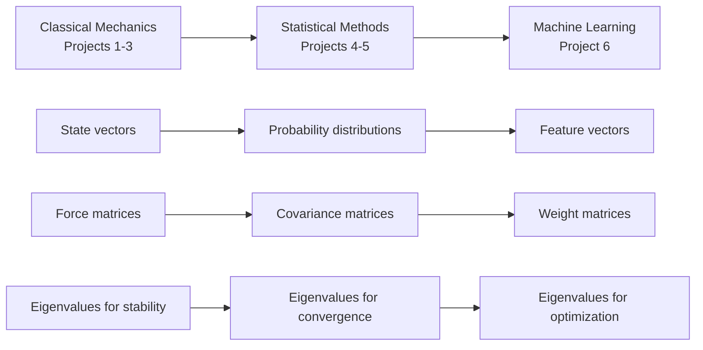

# Module 0: The Linear Algebra Foundation - Building Your Mathematical Telescope

## Learning Objectives

By the end of this module, you will be able to:

- [ ] **Translate** physical problems into vector and matrix representations.
- [ ] **Apply** conservation laws to identify invariant mathematical structures in dynamical systems.
- [ ] **Calculate** eigenvalues and eigenvectors for 2×2 and 3×3 matrices by hand.
- [ ] **Determine** whether a matrix is positive definite using three different methods.
- [ ] **Choose** the appropriate matrix decomposition for solving different computational problems.
- [ ] **Connect** linear algebra concepts to specific applications in all six course projects.

---

## Prerequisites Review

:::{admonition} 📚 Mathematical Prerequisites Check
:class: note

Before diving into the module, let's review essential mathematical concepts. If any of these are unfamiliar, spend extra time on the review sections provided.

**You should be comfortable with:**

- [ ] Basic matrix arithmetic (addition, multiplication)
- [ ] Solving quadratic equations
- [ ] Summation notation ($\sum$)
- [ ] Basic trigonometry (sin, cos, radians)
- [ ] Complex numbers (for eigenvalues)

**Quick Review - Matrix Multiplication by Hand:**

To multiply two matrices, use the row-column rule:
$$C_{ij} = \sum_k A_{ik}B_{kj}$$

Example: Multiply
$$A = \begin{pmatrix} 2 & 1 \\ 3 & 4 \end{pmatrix}, \quad B = \begin{pmatrix} 5 & 6 \\ 7 & 8 \end{pmatrix}$$

For element $C_{11}$: Take row 1 of A, column 1 of B:
$$C_{11} = (2)(5) + (1)(7) = 10 + 7 = 17$$

For element $C_{12}$: Take row 1 of A, column 2 of B:
$$C_{12} = (2)(6) + (1)(8) = 12 + 8 = 20$$

Continue for all elements:
$$C = \begin{pmatrix} 17 & 20 \\ 43 & 50 \end{pmatrix}$$

**Complex Numbers Review:**

A complex number $z = a + bi$ where $i = \sqrt{-1}$.
- Magnitude: $|z| = \sqrt{a^2 + b^2}$
- Complex conjugate: $\bar{z} = a - bi$
- For eigenvalues, complex pairs indicate oscillatory behavior
:::

---

## Module Overview

```{margin}
**linear algebra**
The branch of mathematics concerning vector spaces and linear transformations between them
```

**Linear algebra** is the mathematical foundation that makes computational astrophysics possible. Without it, simulating even three gravitationally interacting stars would be computationally intractable. With it, we can simulate millions. But linear algebra is more than just a computational tool — it reveals deep structures in physical systems that would otherwise remain hidden.

Consider Omega Centauri, the most massive **globular cluster** orbiting our galaxy. It contains approximately 10 million stars, all gravitationally bound, orbiting their common center of mass for the past 12 billion years. To describe this system's state at any moment requires 60 million numbers (3 position and 3 velocity components for each star). Yet this apparent complexity hides elegant simplicity: the cluster's overall shape is described by just three numbers (the **eigenvalues** of its moment of inertia tensor), its stability is determined by eigenvalues of the gravitational potential, and its statistical properties are encoded in **covariance matrices**.

```{margin}
**globular cluster**
A spherical collection of 10⁴ to 10⁶ stars bound by gravity, orbiting as satellites of galaxies
```

This module builds your understanding from first principles, following the same progression your projects will take. We start with **vectors** describing individual stars (Project 1: Stellar Populations), build to **matrices** transforming entire systems (Project 2: N-body Dynamics), explore how these structures handle uncertainty (Projects 3-4: Monte Carlo and MCMC), and preview how they extend to high-dimensional learning (Projects 5-6: Gaussian Processes and Neural Networks).

:::{admonition} 🎯 Why This Module Matters
:class: important

Every computational method you'll implement in this course ultimately reduces to linear algebra:

- **Project 1**: Your `StellarPopulation` class uses matrix operations for vectorized calculations
- **Project 2**: N-body integration operates in 6N-dimensional phase space
- **Project 3**: Monte Carlo photon transport uses transformation matrices for scattering
- **Project 4**: MCMC efficiency depends on proposal covariance matrices
- **Project 5**: Gaussian Processes require positive definite kernel matrices
- **Final Project**: Neural networks are compositions of matrix transformations

Master these foundations, and you master computational astrophysics.
:::

---

## Part 1: The Opening - A Globular Cluster as a Mathematical Universe

### 1.1 The Physical System That Motivates Everything

Let's begin with 47 Tucanae, one of the most spectacular globular clusters visible from Earth. It contains roughly one million stars packed into a sphere just 120 light-years across. At its core, stellar densities reach 1000 stars per cubic parsec—if Earth orbited a star there, our night sky would blaze with thousands of stars brighter than Venus.

```{margin}
**phase space**
The space of all possible states of a system; for N particles in 3D, has 6N dimensions (3 position + 3 velocity per particle)
```

To simulate this cluster, we need to track for each star:
- Position: $\vec{r}_i = (x_i, y_i, z_i)$ measured from the cluster center
- Velocity: $\vec{v}_i = (v_{x,i}, v_{y,i}, v_{z,i})$ relative to the cluster's motion

That's 6 million numbers evolving according to Newton's laws. The gravitational force on star $i$ is:

$$\vec{F}_i = -G m_i \sum_{j \neq i} \frac{m_j (\vec{r}_i - \vec{r}_j)}{|\vec{r}_i - \vec{r}_j|^3}$$

Each star feels forces from all others—that's nearly one trillion force calculations per timestep. Without linear algebra, this would be impossible. With it, we can organize these calculations efficiently, identify conserved quantities, and understand the cluster's long-term evolution.

:::{admonition} 🤔 Check Your Understanding
:class: hint

A small globular cluster has 100,000 stars. How many force calculations are needed per timestep if we compute all pairwise interactions?

:::{admonition} Solution
:class: tip, dropdown

Each star feels forces from all others, so we need:
- Star 1: 99,999 force calculations
- Star 2: 99,999 force calculations (but force from star 1 already computed)
- Total unique pairs: $\binom{100,000}{2} = \frac{100,000 \times 99,999}{2} \approx 5 \times 10^9$

That's 5 billion force calculations per timestep! This is why we need efficient matrix operations and clever algorithms like tree codes.
:::
:::

### 1.2 Conservation Laws: The Hidden Structure

```{margin}
**conservation law**
A physical quantity that remains constant over time due to an underlying symmetry
```

The cluster's apparent chaos hides profound order. Despite the complex individual stellar orbits, certain quantities never change:

**Total Energy**: 
$$E = \sum_i \frac{1}{2} m_i |\vec{v}_i|^2 - G \sum_{i<j} \frac{m_i m_j}{|\vec{r}_i - \vec{r}_j|}$$

**Total Momentum**: 
$$\vec{P} = \sum_i m_i \vec{v}_i$$

**Total Angular Momentum**: 
$$\vec{L} = \sum_i m_i (\vec{r}_i \times \vec{v}_i)$$

These **conservation laws** aren't accidents—they arise from fundamental symmetries of space and time. Emmy Noether proved that every continuous symmetry implies a conservation law:

| Symmetry | Conservation Law | Mathematical Structure |
|----------|-----------------|----------------------|
| Time translation invariance | Energy | Quadratic forms |
| Space translation invariance | Momentum | Vector addition |
| Rotational invariance | Angular momentum | Cross products, orthogonal matrices |

These symmetries manifest mathematically as properties of vectors and matrices. Translation invariance means physics doesn't change when we add the same vector to all positions. Rotational invariance means physics is preserved under **orthogonal transformations**.

:::{note} 💡 Deeper Insight: Noether's Theorem in Action

Noether's theorem tells us that symmetries and conservation laws are two sides of the same coin. In your Project 2, you'll discover that symplectic integrators (which preserve phase space volume) automatically conserve energy over long timescales. This isn't a coincidence — it's Noether's theorem at work! The symplectic structure (preserved determinant) encodes time-translation symmetry, which guarantees energy conservation.
:::

:::{tip} 🌟 The More You Know: Emmy Noether's Revolutionary Theorem
:class: dropdown

Emmy Noether (1882-1935) fundamentally changed physics with her 1915 theorem connecting symmetries to conservation laws. Despite facing discrimination that prevented her from holding a paid position for years, she persisted in her work at the University of Göttingen.

When Einstein's general relativity seemed to violate energy conservation, it was Noether who resolved the paradox. She proved that in general relativity, energy conservation becomes local rather than global—a subtle but profound insight. Einstein wrote to Hilbert: "Yesterday I received from Miss Noether a very interesting paper on invariant forms. I'm impressed that such things can be understood in such a general way" (Einstein to Hilbert, May 24, 1918, *Einstein Papers Project*).

Her theorem now underlies all of modern physics. Every conservation law you use—energy, momentum, angular momentum, electric charge—exists because of an underlying symmetry. When you implement conservation checks in your N-body code, you're using Noether's profound insight that geometry determines physics.

*Source: Osen, L. M. (1974). Women in Mathematics. MIT Press. pp. 141–152.*
:::

### 1.3 The Phase Space Perspective

Here's the profound insight that changes everything: the million-star cluster isn't really moving through 3D space. It's tracing a path through a 6-million-dimensional **phase space** where each axis represents one position or velocity component. The system's entire state is a single point in this vast space, and its time evolution is a trajectory through it.

```{margin}
**trajectory**
The path traced by a system's state through phase space as it evolves in time
```

This perspective reveals hidden simplicities:

- Conservation laws constrain the trajectory to a lower-dimensional surface
- Near equilibrium, motion decomposes into independent oscillation modes (eigenvectors)
- Statistical properties emerge from the geometry of this high-dimensional space

:::{admonition} 🚀 Real-World Application
:class: tip

The Gaia space telescope measures positions and velocities for over 1 billion stars in our galaxy. That's a 6-billion-dimensional phase space! Linear algebra makes it possible to:

- Identify moving groups and stellar streams (eigenanalysis)
- Reconstruct the galaxy's gravitational potential (matrix inversion)
- Find hidden structures like dissolved star clusters (principal components)

Without linear algebra, Gaia's data would be incomprehensible noise.
:::

---

## Part 2: Vectors - The Atoms of Physical Description

### 2.1 What IS a Vector? Building Deep Understanding

```{margin}
**vector**
A mathematical object with both magnitude and direction that transforms according to specific rules
```

A **vector** is simultaneously three complementary things, and masterful computational scientists fluidly shift between these perspectives:

**Physical Perspective**: A vector represents any quantity with both magnitude and direction. The velocity of Earth orbiting the Sun is a vector—it has a speed (30 km/s) and a direction (tangent to the orbit). Forces, electric fields, angular momenta—all are vectors because they have this magnitude-direction character.

**Geometric Perspective**: A vector is an arrow in space. Crucially, this arrow is **free**—it doesn't have a fixed starting point. The displacement "3 km north" is the same vector whether you start from your house or from campus. This freedom is what allows us to add forces acting at different points on a rigid body.

**Algebraic Perspective**: A vector is an ordered list of numbers—its **components** in some coordinate system. Earth's velocity might be written as:

$$\vec{v} = \begin{pmatrix} -15.2 \\ 25.8 \\ 0.0 \end{pmatrix} \text{ km/s (in ecliptic coordinates)}$$

But here's the crucial insight: these numbers are not the vector itself—they're just one representation. The vector exists independently of any coordinate system.

:::{warning} ⚠️ Common Misconception Alert

Students often think a vector IS its components. This is wrong! A vector is a geometric object that exists independently of coordinates. When you rotate your coordinate system, the components change but the vector itself doesn't. Think of it like describing a person's location: "3 blocks north, 2 blocks east" versus "3.6 blocks northeast" — different descriptions, same displacement.
:::

:::{note} 💡 Building Intuition: Vectors as Instructions

Think of a vector as an instruction for movement. The vector $\vec{v} = (3, 4, 0)$ says: "Go 3 units east, 4 units north, stay at the same height." No matter where you start, following this instruction produces the same displacement. This is why we can slide vectors around freely—they're instructions, not fixed objects.

This becomes powerful in physics: a force vector tells you which way to accelerate and how strongly. A velocity vector tells you which way you're moving and how fast. The vector nature captures both pieces of information in one mathematical object.
:::

### 2.2 Vector Spaces: The Mathematical Framework

```{margin}
**vector space**
A set equipped with addition and scalar multiplication operations satisfying eight specific axioms
```

A **vector space** is a set equipped with two operations (vector addition and scalar multiplication) that satisfy eight axioms. These axioms aren't arbitrary mathematical rules—each captures an essential physical property:

| Axiom | Mathematical Statement | Physical Meaning |
|-------|------------------------|------------------|
| **Closure under addition** | $\vec{u} + \vec{v} \in V$ | Adding velocities gives another velocity |
| **Commutativity** | $\vec{u} + \vec{v} = \vec{v} + \vec{u}$ | Order of displacements doesn't matter |
| **Associativity** | $(\vec{u} + \vec{v}) + \vec{w} = \vec{u} + (\vec{v} + \vec{w})$ | Grouping of forces doesn't affect total |
| **Zero vector** | $\exists \vec{0}: \vec{v} + \vec{0} = \vec{v}$ | State of no motion or displacement |
| **Additive inverse** | $\forall \vec{v}, \exists -\vec{v}: \vec{v} + (-\vec{v}) = \vec{0}$ | Every motion has an opposite |
| **Scalar closure** | $c\vec{v} \in V$ | Scaling a force gives another force |
| **Distributivity** | $c(\vec{u} + \vec{v}) = c\vec{u} + c\vec{v}$ | Scaling preserves addition |
| **Identity** | $1 \cdot \vec{v} = \vec{v}$ | Multiplying by 1 changes nothing |

### 2.3 The Dot Product: Projection, Angle, and Energy

```{margin}
**dot product**
Scalar operation on vectors: $\vec{a} \cdot \vec{b} = |\vec{a}||\vec{b}|\cos\theta$
```

The **dot product** is perhaps the most important operation in physics because it answers a fundamental question: "How much does one vector contribute in the direction of another?"

**Definition and Formula**:
$$\vec{a} \cdot \vec{b} = a_x b_x + a_y b_y + a_z b_z = |\vec{a}||\vec{b}|\cos\theta$$

But why are these two formulas equal? Let's derive this connection from first principles.

:::{admonition} 📐 Mathematical Derivation: Dot Product Formula
:class: note

**Starting from the Law of Cosines:**

Consider vectors $\vec{a}$ and $\vec{b}$ with angle $\theta$ between them. The vector from tip of $\vec{a}$ to tip of $\vec{b}$ is $\vec{b} - \vec{a}$.

By the law of cosines:
$$|\vec{b} - \vec{a}|^2 = |\vec{a}|^2 + |\vec{b}|^2 - 2|\vec{a}||\vec{b}|\cos\theta$$

Expanding the left side:
$$|\vec{b} - \vec{a}|^2 = (b_x - a_x)^2 + (b_y - a_y)^2 + (b_z - a_z)^2$$
$$= |\vec{a}|^2 + |\vec{b}|^2 - 2(a_x b_x + a_y b_y + a_z b_z)$$

Comparing both expressions:
$$a_x b_x + a_y b_y + a_z b_z = |\vec{a}||\vec{b}|\cos\theta$$

This proves the component formula equals the geometric formula!
:::

**Physical Applications of the Dot Product**:

<!-- Suggested figure: Visual showing force vector, displacement vector, and the component of force along displacement -->

**Work Done by a Force**:
$$W = \vec{F} \cdot \vec{d} = |\vec{F}||\vec{d}|\cos\theta$$

Only the component of force along the displacement does work. A force perpendicular to motion (like the normal force on a sliding block) does zero work.

**Power from Solar Panels**:
$$P = \vec{S} \cdot \hat{n} = |\vec{S}|\cos\theta$$

where $\vec{S}$ is the solar flux vector and $\hat{n}$ is the panel's normal. Maximum power when facing the sun ($\theta = 0$), zero when edge-on ($\theta = 90°$).

:::{admonition} 🤔 Check Your Understanding
:class: hint

Two stars have velocities $\vec{v}_1 = (200, 100, 50)$ km/s and $\vec{v}_2 = (150, -100, 100)$ km/s.

1. Calculate their relative velocity
2. Are they approaching or receding? (Hint: use the dot product)

:::{admonition} Solution
:class: tip, dropdown

1. Relative velocity: $\vec{v}_{\text{rel}} = \vec{v}_1 - \vec{v}_2 = (50, 200, -50)$ km/s

2. To determine if approaching or receding, we need the dot product of relative velocity with separation vector. If we assume star 2 is at origin and star 1 at position $\vec{r}$:
   - If $\vec{v}_{\text{rel}} \cdot \vec{r} > 0$: receding
   - If $\vec{v}_{\text{rel}} \cdot \vec{r} < 0$: approaching
   - If $\vec{v}_{\text{rel}} \cdot \vec{r} = 0$: constant separation

Without knowing positions, we can't determine if they're approaching or receding — we need both position and velocity information!
:::
:::

### 2.4 The Cross Product: Creating Perpendicularity

```{margin}
**cross product**
Vector operation producing a perpendicular vector: $\vec{a} \times \vec{b}$
```

The **cross product** creates a vector perpendicular to two input vectors:

$$\vec{a} \times \vec{b} = \begin{pmatrix} a_y b_z - a_z b_y \\ a_z b_x - a_x b_z \\ a_x b_y - a_y b_x \end{pmatrix}$$

**Key Properties**:

- **Magnitude**: $|\vec{a} \times \vec{b}| = |\vec{a}||\vec{b}|\sin\theta$ (area of parallelogram)
- **Direction**: Right-hand rule
- **Anti-commutative**: $\vec{a} \times \vec{b} = -\vec{b} \times \vec{a}$

**Physical Meaning - Angular Momentum**:

For a star at position $\vec{r}$ with momentum $\vec{p} = m\vec{v}$:
$$\vec{L} = \vec{r} \times \vec{p}$$

This vector is perpendicular to the orbital plane. Its magnitude equals twice the rate of area swept out—this is Kepler's second law!

### 2.5 Basis Vectors and Coordinate Systems

```{margin}
**basis**
A set of linearly independent vectors that span the entire vector space
```

A **basis** is a set of linearly independent vectors that span the entire space. The familiar Cartesian basis:

$$\hat{x} = \begin{pmatrix} 1 \\ 0 \\ 0 \end{pmatrix}, \quad \hat{y} = \begin{pmatrix} 0 \\ 1 \\ 0 \end{pmatrix}, \quad \hat{z} = \begin{pmatrix} 0 \\ 0 \\ 1 \end{pmatrix}$$

These are **orthonormal**: mutually perpendicular and unit length.

Any vector can be decomposed:
$$\vec{v} = v_x \hat{x} + v_y \hat{y} + v_z \hat{z}$$

The coefficients are found by projection:
$$v_x = \vec{v} \cdot \hat{x}, \quad v_y = \vec{v} \cdot \hat{y}, \quad v_z = \vec{v} \cdot \hat{z}$$

:::{admonition} 💡 Practical Insight: Choosing the Right Coordinates
:class: note

Different problems benefit from different coordinate systems:

| System | Best Coordinates | Why |
|--------|-----------------|-----|
| Binary star orbit | Centered on barycenter | Simplifies equations of motion |
| Spiral galaxy | Cylindrical (R, φ, z) | Matches galaxy symmetry |
| Globular cluster | Spherical (r, θ, φ) | Exploits spherical symmetry |
| Stellar stream | Along stream trajectory | Reveals stream structure |

In Project 2, you'll transform between coordinate systems to simplify your N-body calculations.
:::

:::{admonition} 📝 Worked Example: Gram-Schmidt Orthogonalization
:class: note

The **Gram-Schmidt process** creates an orthonormal basis from any linearly independent set. This is essential for understanding QR decomposition.

**Given vectors**: $\vec{v}_1 = (1, 1, 0)$, $\vec{v}_2 = (1, 0, 1)$, $\vec{v}_3 = (0, 1, 1)$

**Step 1**: Normalize first vector
$$\vec{u}_1 = \frac{\vec{v}_1}{|\vec{v}_1|} = \frac{(1, 1, 0)}{\sqrt{2}} = \left(\frac{1}{\sqrt{2}}, \frac{1}{\sqrt{2}}, 0\right)$$

**Step 2**: Remove $\vec{u}_1$ component from $\vec{v}_2$
$$\vec{w}_2 = \vec{v}_2 - (\vec{v}_2 \cdot \vec{u}_1)\vec{u}_1$$
$$= (1, 0, 1) - \frac{1}{\sqrt{2}} \cdot \left(\frac{1}{\sqrt{2}}, \frac{1}{\sqrt{2}}, 0\right)$$
$$= (1, 0, 1) - \left(\frac{1}{2}, \frac{1}{2}, 0\right) = \left(\frac{1}{2}, -\frac{1}{2}, 1\right)$$

Normalize: $\vec{u}_2 = \vec{w}_2/|\vec{w}_2| = \left(\frac{1}{\sqrt{6}}, -\frac{1}{\sqrt{6}}, \frac{2}{\sqrt{6}}\right)$

**Step 3**: Remove $\vec{u}_1$ and $\vec{u}_2$ components from $\vec{v}_3$
$$\vec{w}_3 = \vec{v}_3 - (\vec{v}_3 \cdot \vec{u}_1)\vec{u}_1 - (\vec{v}_3 \cdot \vec{u}_2)\vec{u}_2$$

After calculation: $\vec{u}_3 = \left(-\frac{1}{\sqrt{3}}, \frac{1}{\sqrt{3}}, \frac{1}{\sqrt{3}}\right)$

The result is an orthonormal basis that spans the same space as the original vectors!
:::

---

## Part 3: Matrices - Transformations That Preserve Structure

### 3.1 Matrices ARE Linear Transformations

```{margin}
**matrix**
A linear transformation represented as a rectangular array of numbers
```

A **matrix** is not just a grid of numbers—it's a rule for transforming vectors. When we multiply matrix $A$ by vector $\vec{v}$, we get a new vector $A\vec{v}$. The crucial property is **linearity**:

$$A(\alpha\vec{u} + \beta\vec{v}) = \alpha A\vec{u} + \beta A\vec{v}$$

:::{admonition} 💡 Building Intuition: Why Row-Times-Column?
:class: note

The strange-looking matrix multiplication rule (row times column) ensures that transformation composition works correctly. Here's why:

When you apply transformation $A$ to vector $\vec{v}$, each component of the output is a linear combination of input components. The first row of $A$ tells you how to compute the first output component:

$$\text{output}_1 = a_{11} v_1 + a_{12} v_2 + a_{13} v_3$$

This is exactly a dot product of row 1 with the vector! Each row defines how one output component depends on all input components. This structure ensures that composing transformations (multiplying matrices) gives the same result as applying them sequentially.
:::

### 3.2 Building Intuition with Concrete Examples

Let's see actual matrices and understand what they do:

**The Identity Matrix** (the "do nothing" transformation):
$$I = \begin{pmatrix} 
\boxed{1} & 0 & 0 \\ 
0 & \boxed{1} & 0 \\ 
0 & 0 & \boxed{1} 
\end{pmatrix}$$

Notice the diagonal of ones! For any vector: $I\vec{v} = \vec{v}$.

**A Rotation Matrix** (30° around z-axis):
$$R_{30°} = \begin{pmatrix} 
0.866 & -0.5 & 0 \\
0.5 & 0.866 & 0 \\
0 & 0 & 1 
\end{pmatrix}$$

The z-component is unchanged (last row is [0, 0, 1]) because we rotate around z.

**A Diagonal Matrix** (scaling transformation):
$$D = \begin{pmatrix}
\boxed{2} & 0 & 0 \\
0 & \boxed{3} & 0 \\
0 & 0 & \boxed{1}
\end{pmatrix}$$

Doubles x, triples y, leaves z unchanged. Only diagonal elements are non-zero!

**A Symmetric Matrix** (moment of inertia):
$$I = \begin{pmatrix}
5 & \boxed{2} & 0 \\
\boxed{2} & 8 & \boxed{1} \\
0 & \boxed{1} & 6
\end{pmatrix}$$

Notice $I_{ij} = I_{ji}$ (boxed elements show symmetry).

:::{admonition} 🤔 Check Your Understanding
:class: hint

What does this matrix do to vectors?
$$M = \begin{pmatrix} 
-1 & 0 & 0 \\
0 & 1 & 0 \\
0 & 0 & 1 
\end{pmatrix}$$

:::{admonition} Solution
:class: tip, dropdown

This matrix flips the x-component while leaving y and z unchanged. It's a reflection through the yz-plane! If you apply it twice, you get back the original vector (since $(-1) \times (-1) = 1$).

Test with $\vec{v} = (3, 4, 5)$:
$$M\vec{v} = \begin{pmatrix} -3 \\ 4 \\ 5 \end{pmatrix}$$

This transformation appears in physics when dealing with parity operations or mirror symmetries.
:::
:::

### 3.3 Matrix Multiplication: Composition of Transformations

```{margin}
**matrix multiplication**
Operation combining two transformations into one: $(AB)\vec{v} = A(B\vec{v})$
```

Matrix multiplication encodes function composition. The element in row $i$, column $j$ of product $AB$ is:

$$(AB)_{ij} = \sum_k A_{ik}B_{kj}$$

This seemingly weird formula ensures that:
$$(AB)\vec{v} = A(B\vec{v})$$

**Why Order Matters**:

Consider rotating 90° around x-axis, then 90° around z-axis, versus the opposite order:

<!-- Suggested figure: Show a cube being rotated in both orders, ending in different orientations -->

Different orders give different results! This is why $AB \neq BA$ in general.

:::{admonition} 📝 Worked Example: 3×3 Matrix Inversion by Hand
:class: note

Let's invert a 3×3 matrix using the cofactor method. Given:
$$A = \begin{pmatrix}
2 & 1 & 0 \\
1 & 2 & 1 \\
0 & 1 & 2
\end{pmatrix}$$

**Step 1**: Calculate the determinant
$$\det(A) = 2\begin{vmatrix}2&1\\1&2\end{vmatrix} - 1\begin{vmatrix}1&1\\0&2\end{vmatrix} + 0$$
$$= 2(4-1) - 1(2-0) = 6 - 2 = 4$$

Since $\det(A) \neq 0$, the matrix is invertible.

**Step 2**: Calculate the matrix of minors
For element $(1,1)$: $M_{11} = \begin{vmatrix}2&1\\1&2\end{vmatrix} = 3$

For element $(1,2)$: $M_{12} = \begin{vmatrix}1&1\\0&2\end{vmatrix} = 2$

Continue for all elements...

**Step 3**: Apply cofactor signs (checkerboard pattern)
$$C = \begin{pmatrix} 
+3 & -2 & +1 \\
-2 & +4 & -2 \\
+1 & -2 & +3 
\end{pmatrix}$$

**Step 4**: Transpose and divide by determinant
$$A^{-1} = \frac{1}{4}C^T = \frac{1}{4}\begin{pmatrix} 
3 & -2 & 1 \\
-2 & 4 & -2 \\
1 & -2 & 3 
\end{pmatrix}$$

**Verify**: $AA^{-1} = I$ ✓
:::

### 3.4 The Determinant: Volume, Orientation, and Information

```{margin}
**determinant**
Scalar value measuring how a transformation scales volumes
```

The **determinant** tells us three crucial things:

| $\det(A)$ | Meaning | Physical Interpretation |
|-----------|---------|------------------------|
| $\|\det(A)\|$ | Volume scaling factor | How much the transformation stretches/shrinks space |
| $\det(A) > 0$ | Preserves orientation | Right-handed stays right-handed |
| $\det(A) < 0$ | Flips orientation | Right-handed becomes left-handed |
| $\det(A) = 0$ | Singular (non-invertible) | Information is lost, dimension collapses |

For a 2×2 matrix:
$$\det\begin{pmatrix} a & b \\ c & d \end{pmatrix} = ad - bc$$

:::{admonition} 🎯 Why This Matters for Your Projects
:class: important

In Project 2, you'll implement the Leapfrog integrator for N-body dynamics. This integrator is **symplectic**—it preserves phase space volume, meaning its transformation matrix has determinant = 1. This is why it conserves energy over millions of orbits while simpler integrators fail after just hundreds!
:::

### 3.5 The Inverse: Undoing Transformations

```{margin}
**matrix inverse**
The transformation that undoes another: $A^{-1}A = I$
```

The **inverse** matrix $A^{-1}$ satisfies:
$$A^{-1}A = AA^{-1} = I$$

For a 2×2 matrix:
$$A = \begin{pmatrix} a & b \\ c & d \end{pmatrix} \implies A^{-1} = \frac{1}{\det(A)}\begin{pmatrix} d & -b \\ -c & a \end{pmatrix}$$

Notice you divide by the determinant—this is why singular matrices (det = 0) have no inverse!

---

## Part 4: Eigenvalues and Eigenvectors - Finding Invariant Structure

### 4.1 The Eigenvalue Equation: Directions That Don't Rotate

```{margin}
**eigenvector**
A vector that is only scaled (not rotated) by a transformation
```

```{margin}
**eigenvalue**
The scaling factor for an eigenvector
```

Some special vectors are only scaled by a transformation:

$$A\vec{v} = \lambda\vec{v}$$

These **eigenvectors** $\vec{v}$ and their **eigenvalues** $\lambda$ reveal fundamental structure.

**Physical Example - Spinning Objects**:

Consider a football. It has three principal axes:
- Long axis (through the points)
- Two short axes (perpendicular to long axis)

Spin it around the long axis → stable rotation
Spin it around a short axis → stable rotation
Spin it at any other angle → it wobbles!

The principal axes are eigenvectors of the moment of inertia tensor.

### 4.2 Finding Eigenvalues: The Characteristic Equation

```{margin}
**characteristic equation**
$\det(A - \lambda I) = 0$, whose roots are eigenvalues
```

To find eigenvalues:

1. Rearrange: $(A - \lambda I)\vec{v} = \vec{0}$
2. For non-trivial solutions: $\det(A - \lambda I) = 0$
3. This gives the **characteristic equation**

:::{admonition} 📝 Worked Example: Complete Eigenvalue and Eigenvector Calculation
:class: note

Find eigenvalues AND eigenvectors of:
$$A = \begin{pmatrix} 3 & 1 \\ 1 & 3 \end{pmatrix}$$

**Step 1**: Set up characteristic equation:
$$\det(A - \lambda I) = \det\begin{pmatrix} 3-\lambda & 1 \\ 1 & 3-\lambda \end{pmatrix} = 0$$

**Step 2**: Calculate determinant:
$$(3-\lambda)^2 - 1 = 0$$
$$\lambda^2 - 6\lambda + 8 = 0$$

**Step 3**: Solve quadratic:
$$\lambda = \frac{6 \pm \sqrt{36-32}}{2} = \frac{6 \pm 2}{2}$$

Therefore: $\lambda_1 = 4$, $\lambda_2 = 2$

**Step 4**: Find eigenvector for $\lambda_1 = 4$:

Solve $(A - 4I)\vec{v} = \vec{0}$:
$$\begin{pmatrix} -1 & 1 \\ 1 & -1 \end{pmatrix}\begin{pmatrix} v_1 \\ v_2 \end{pmatrix} = \begin{pmatrix} 0 \\ 0 \end{pmatrix}$$

This gives: $-v_1 + v_2 = 0$, so $v_1 = v_2$

Eigenvector: $\vec{v}_1 = \begin{pmatrix} 1 \\ 1 \end{pmatrix}$ (or any scalar multiple)

**Step 5**: Find eigenvector for $\lambda_2 = 2$:

Solve $(A - 2I)\vec{v} = \vec{0}$:
$$\begin{pmatrix} 1 & 1 \\ 1 & 1 \end{pmatrix}\begin{pmatrix} v_1 \\ v_2 \end{pmatrix} = \begin{pmatrix} 0 \\ 0 \end{pmatrix}$$

This gives: $v_1 + v_2 = 0$, so $v_1 = -v_2$

Eigenvector: $\vec{v}_2 = \begin{pmatrix} 1 \\ -1 \end{pmatrix}$

**Verification**: Check $A\vec{v}_1 = 4\vec{v}_1$ ✓ and $A\vec{v}_2 = 2\vec{v}_2$ ✓

**Physical Meaning**: This matrix stretches by factor 4 along the diagonal direction $(1,1)$ and by factor 2 along the anti-diagonal $(1,-1)$.
:::

### 4.3 Physical Meaning Throughout Your Projects

Eigenvalues appear in every project:

| Project | Where Eigenvalues Appear | What They Tell You |
|---------|-------------------------|-------------------|
| Project 1 | Covariance matrix of stellar properties | Principal components of variation |
| Project 2 | Linearized dynamics near equilibrium | Orbital stability (stable if all $\lambda < 0$) |
| Project 3 | Scattering matrix | Preferred scattering directions |
| Project 4 | MCMC transition matrix | Convergence rate ($\sim 1/\|1-\lambda_2\|$) |
| Project 5 | GP kernel matrix | Effective degrees of freedom |
| Final Project | Neural network Hessian | Optimization landscape curvature |

:::{admonition} 💡 Deep Connection: Why Symmetric Matrices Are Special
:class: note

**The Spectral Theorem** guarantees that symmetric matrices have:
1. All real eigenvalues
2. Orthogonal eigenvectors

This isn't mathematical coincidence—it's physical necessity! Symmetric matrices represent quantities where direction doesn't matter for the relationship (like forces between particles). If eigenvalues could be complex, we'd have complex energies or distances, which is nonsensical. Mathematics enforces physical reasonableness!
:::

:::{admonition} 🌟 The More You Know: Jacobi's Method Born from Astronomy
:class: tip, dropdown

Carl Gustav Jacob Jacobi (1804-1851) developed his famous eigenvalue algorithm while studying the rotation of celestial bodies. In 1846, he published "Über ein leichtes Verfahren die in der Theorie der Säcularstörungen vorkommenden Gleichungen numerisch aufzulösen" (*On an easy method to numerically solve equations occurring in the theory of secular perturbations*).

The problem arose from calculating planetary perturbations—small gravitational influences planets exert on each other. These perturbations accumulate over centuries (hence "secular") and are described by symmetric matrices whose eigenvalues determine the long-term stability of orbits.

Jacobi's insight was to diagonalize the matrix through a sequence of rotations, each zeroing out one off-diagonal element. Though computers didn't exist, his method was designed for hand calculation—each step is simple enough to do with pencil and paper. Today, variants of Jacobi's method run on every supercomputer simulating galaxy collisions or climate models.

The next time your code calls `numpy.linalg.eigh()`, remember: you're using an algorithm invented to predict whether the solar system is stable over millions of years!

*Source: Jacobi, C.G.J. (1846). Crelle's Journal, 30, pp. 51-94.*
:::

:::{admonition} 📚 Mathematical Deep Dive: Proof that Symmetric Matrices Have Real Eigenvalues
:class: note, dropdown

This proof reveals why physics "prefers" symmetric matrices.

**Theorem**: Every real symmetric matrix has only real eigenvalues.

**Proof**:
Let $A$ be a real symmetric matrix and suppose $\lambda$ is an eigenvalue with eigenvector $\vec{v}$. We'll show $\lambda$ must be real.

Consider the complex conjugate of the eigenvalue equation:
$$A\vec{v} = \lambda\vec{v}$$

Taking complex conjugates:
$$\overline{A\vec{v}} = \overline{\lambda\vec{v}}$$

Since $A$ is real: $A\overline{\vec{v}} = \overline{\lambda}\overline{\vec{v}}$

Now compute $\vec{v}^* A \vec{v}$ in two ways:

Method 1: $\vec{v}^* A \vec{v} = \vec{v}^* (\lambda \vec{v}) = \lambda (\vec{v}^* \vec{v}) = \lambda |\vec{v}|^2$

Method 2: $\vec{v}^* A \vec{v} = (A^T \vec{v})^* \vec{v} = (A\vec{v})^* \vec{v}$ (since $A = A^T$)
         $= (\lambda\vec{v})^* \vec{v} = \overline{\lambda} \vec{v}^* \vec{v} = \overline{\lambda} |\vec{v}|^2$

Therefore: $\lambda |\vec{v}|^2 = \overline{\lambda} |\vec{v}|^2$

Since $|\vec{v}|^2 > 0$ (eigenvector is non-zero):
$$\lambda = \overline{\lambda}$$

This means $\lambda$ is real! ∎

**Physical Interpretation**: Symmetric matrices represent measurements where the order doesn't matter (distance from A to B equals distance from B to A). Complex eigenvalues would imply complex measurements, violating physical reality.
:::

---

## Part 5: Positive Definite Matrices and Statistical Foundations

### 5.1 Quadratic Forms and Energy

```{margin}
**quadratic form**
Expression $Q(\vec{x}) = \vec{x}^T A \vec{x}$ where A is symmetric
```

A **quadratic form** is:
$$Q(\vec{x}) = \vec{x}^T A \vec{x} = \sum_{i,j} A_{ij} x_i x_j$$

These appear as energy expressions throughout physics:

| Type | Formula | Physical Meaning |
|------|---------|------------------|
| Kinetic Energy | $T = \frac{1}{2}\vec{v}^T M \vec{v}$ | M is mass matrix |
| Potential Energy | $V = \frac{1}{2}\vec{x}^T K \vec{x}$ | K is stiffness matrix |
| Statistical Distance | $d^2 = (\vec{x}-\vec{\mu})^T \Sigma^{-1} (\vec{x}-\vec{\mu})$ | Mahalanobis distance |

### 5.2 Positive Definiteness: Ensuring Physical Reality

```{margin}
**positive definite**
Matrix where $\vec{x}^T A \vec{x} > 0$ for all $\vec{x} \neq \vec{0}$
```

A symmetric matrix is **positive definite** if its quadratic form is always positive.

**Four Equivalent Tests**:

1. ✅ All eigenvalues > 0
2. ✅ All leading principal minors > 0
3. ✅ Has Cholesky decomposition $A = LL^T$
4. ✅ Can write as $A = B^T B$ for some invertible B

:::{admonition} ⚠️ Common Bug in Project 5
:class: warning

When implementing Gaussian Processes, your kernel matrix might lose positive definiteness due to numerical errors. Symptoms:
- Cholesky decomposition fails
- Negative variance predictions
- `numpy.linalg.LinAlgError`

**Fix**: Add small "jitter" to diagonal:
```python
K_stable = K + 1e-6 * np.eye(n)
```

This is regularization, not a hack! It accounts for numerical precision limits.
:::

:::{admonition} 💡 Building Intuition: The Bowl Analogy
:class: note

A positive definite matrix creates a bowl-shaped quadratic form. Imagine the function $f(\vec{x}) = \vec{x}^T A \vec{x}$ as a landscape:

- **Positive definite**: Bowl opening upward (unique minimum at origin)
- **Negative definite**: Bowl opening downward (unique maximum at origin)
- **Indefinite**: Saddle shape (some directions go up, others down)
- **Positive semi-definite**: Bowl with flat bottom (minimum not unique)

This is why positive definite matrices guarantee unique solutions in optimization—there's only one bottom of the bowl!
:::

### 5.3 Covariance Matrices: The Bridge to Statistics

```{margin}
**covariance matrix**
Matrix containing all pairwise covariances between random variables
```

The **covariance matrix** for variables $X_1, ..., X_n$:

$$\Sigma_{ij} = \text{Cov}(X_i, X_j) = E[(X_i - \mu_i)(X_j - \mu_j)]$$

**Structure**:
- Diagonal: $\Sigma_{ii} = \text{Var}(X_i)$ (variances)
- Off-diagonal: $\Sigma_{ij}$ (covariances)
- Always symmetric and positive semi-definite

:::{admonition} 📝 Worked Example: Constructing a Covariance Matrix from Data
:class: note

Given stellar measurements for 4 stars (mass and luminosity):

```python
# Data: each row is a star, columns are [mass, luminosity]
data = np.array([
    [1.0, 1.2],   # Star 1
    [1.5, 3.1],   # Star 2
    [0.8, 0.6],   # Star 3
    [1.2, 1.9]    # Star 4
])

# Step 1: Compute means
means = np.mean(data, axis=0)  # [1.125, 1.7]

# Step 2: Center the data
centered = data - means
# [[-0.125, -0.5],
#  [ 0.375,  1.4],
#  [-0.325, -1.1],
#  [ 0.075,  0.2]]

# Step 3: Compute covariance matrix
n = len(data)
cov = (centered.T @ centered) / (n - 1)
# [[0.0892, 0.3242],
#  [0.3242, 1.2867]]

# Interpretation:
# - Var(mass) = 0.0892
# - Var(luminosity) = 1.2867
# - Cov(mass, lum) = 0.3242 (positive correlation!)
```

The positive covariance confirms the mass-luminosity relation!
:::

### 5.4 The Multivariate Gaussian Distribution

```{margin}
**multivariate Gaussian**
Multi-dimensional bell curve defined by mean vector and covariance matrix
```

The **multivariate Gaussian** (crucial for Projects 4-5):

$$p(\vec{x}) = \frac{1}{(2\pi)^{n/2}|\Sigma|^{1/2}} \exp\left(-\frac{1}{2}(\vec{x}-\vec{\mu})^T\Sigma^{-1}(\vec{x}-\vec{\mu})\right)$$

Each term has meaning:
- $(2\pi)^{n/2}|\Sigma|^{1/2}$: Normalization
- $|\Sigma|$: "Volume" of uncertainty ellipsoid
- $(\vec{x}-\vec{\mu})^T\Sigma^{-1}(\vec{x}-\vec{\mu})$: Mahalanobis distance

### 5.5 Cholesky Decomposition: The Matrix Square Root

```{margin}
**Cholesky decomposition**
Factorization $A = LL^T$ where L is lower triangular
```

Every positive definite matrix factors as:
$$A = LL^T$$

**Two Key Applications**:

**1. Solving Linear Systems** (faster than computing inverse):
```python
# Instead of: x = inv(A) @ b
L = np.linalg.cholesky(A)
y = np.linalg.solve(L, b)      # Forward substitution
x = np.linalg.solve(L.T, y)    # Back substitution
```

**2. Generating Correlated Random Variables** (Projects 4-5):
```python
# Generate samples from N(mu, Sigma)
L = np.linalg.cholesky(Sigma)
z = np.random.randn(n)          # Standard normal
x = mu + L @ z                  # Has covariance Sigma
```

---

## Part 6: Advanced Topics for Your Projects

### 6.1 Singular Value Decomposition - The Swiss Army Knife

```{margin}
**SVD**
Universal decomposition $A = U\Sigma V^T$ working for any matrix
```

Every matrix has a **singular value decomposition**:
$$A = U\Sigma V^T$$

The singular values relate to eigenvalues:
- $\sigma_i = \sqrt{\lambda_i(A^T A)}$
- Left singular vectors are eigenvectors of $AA^T$
- Right singular vectors are eigenvectors of $A^T A$

### 6.2 Block Matrices and the Schur Complement

```{margin}
**block matrix**
Matrix partitioned into submatrices
```

Large systems often have block structure:
$$M = \begin{pmatrix} A & B \\ C & D \end{pmatrix}$$

The **Schur complement** enables efficient inversion:
$$M^{-1} = \begin{pmatrix} 
(A - BD^{-1}C)^{-1} & -A^{-1}B(D - CA^{-1}B)^{-1} \\
-D^{-1}C(A - BD^{-1}C)^{-1} & (D - CA^{-1}B)^{-1}
\end{pmatrix}$$

This appears in Project 5 when updating Gaussian Processes with new data.

### 6.3 The Jacobian Matrix

```{margin}
**Jacobian**
Matrix of all first-order partial derivatives
```

For vector function $\vec{f}: \mathbb{R}^n \to \mathbb{R}^m$:
$$J_{ij} = \frac{\partial f_i}{\partial x_j}$$

In Project 2, the Jacobian of your force function determines orbital stability.

### 6.4 Matrix Exponentials and Time Evolution

```{margin}
**matrix exponential**
$e^{At}$ describes time evolution of linear systems
```

The matrix exponential solves linear differential equations:
$$\frac{d\vec{x}}{dt} = A\vec{x} \implies \vec{x}(t) = e^{At}\vec{x}(0)$$

Computed via:
$$e^{At} = I + At + \frac{A^2t^2}{2!} + \frac{A^3t^3}{3!} + ...$$

### 6.5 Numerical Implementation Examples

:::{admonition} 💻 Implementation: Power Method for Largest Eigenvalue
:class: note

The power method finds the dominant eigenvalue and eigenvector:

```python
def power_method(A, num_iterations=100):
    """
    Find largest eigenvalue and corresponding eigenvector.
    Used in PageRank and many other applications.
    """
    n = len(A)
    # Start with random vector
    v = np.random.randn(n)
    v = v / np.linalg.norm(v)
    
    for _ in range(num_iterations):
        # Multiply by A
        Av = A @ v
        
        # Normalize
        v = Av / np.linalg.norm(Av)
        
        # Estimate eigenvalue (Rayleigh quotient)
        lambda_est = v.T @ A @ v
    
    return lambda_est, v

# Test on symmetric matrix
A = np.array([[3, 1], [1, 3]])
lambda_max, v_max = power_method(A)
print(f"Largest eigenvalue: {lambda_max:.4f}")  # Should be ~4
print(f"Eigenvector: {v_max}")
```

The power method converges because repeated multiplication by $A$ amplifies the component along the largest eigenvector!
:::

---

## Part 7: Numerical Reality - When Mathematics Meets Silicon

### 7.1 The Harsh Truth About Floating-Point Arithmetic

```{margin}
**floating-point**
Computer representation of real numbers with finite precision
```

Computers represent numbers as:
$$x = \pm m \times 2^e$$

With 64-bit doubles:
- ~16 decimal digits of precision
- Largest number: ~10^308
- Smallest positive: ~10^-308

**Shocking Example**:
```python
0.1 + 0.2 == 0.3  # False!
# Because 0.1 = 0.00011001100110011... in binary (repeating)
```

### 7.2 Condition Numbers: Measuring Numerical Danger

```{margin}
**condition number**
$\kappa(A) = \sigma_{\max}/\sigma_{\min}$, measures sensitivity to errors
```

The **condition number** measures error amplification:

| $\kappa(A)$ | Interpretation | Digits Lost |
|-------------|---------------|-------------|
| < 10 | Excellent | 0-1 |
| 10-100 | Good | 1-2 |
| 100-1000 | Acceptable | 2-3 |
| > 10^6 | Dangerous | > 6 |
| > 10^10 | Numerically singular | > 10 |

### 7.3 Troubleshooting Guide

:::{admonition} 🔧 Common Linear Algebra Problems and Solutions
:class: important

**Problem**: "Matrix is singular to working precision"
- **Check**: Compute condition number with `np.linalg.cond()`
- **Fix**: Add regularization: `A_reg = A + epsilon * np.eye(n)`

**Problem**: "Eigenvalues should be real but are complex"
- **Check**: Verify symmetry: `np.allclose(A, A.T)`
- **Fix**: Symmetrize: `A_sym = (A + A.T) / 2`

**Problem**: "Cholesky decomposition failed"
- **Check**: Test positive definiteness via eigenvalues
- **Fix**: 
  ```python
  # Method 1: Add jitter
  L = np.linalg.cholesky(A + 1e-6 * np.eye(n))
  
  # Method 2: Use eigenvalue decomposition
  eigvals, eigvecs = np.linalg.eigh(A)
  eigvals = np.maximum(eigvals, 1e-6)
  A_fixed = eigvecs @ np.diag(eigvals) @ eigvecs.T
  ```

**Problem**: "Solution to Ax=b is wrong"
- **Check**: Residual `||Ax - b||` and condition number
- **Fix**: Use SVD for rank-deficient systems:
  ```python
  U, s, Vt = np.linalg.svd(A)
  # Pseudoinverse solution
  s_inv = np.where(s > 1e-10, 1/s, 0)
  x = Vt.T @ np.diag(s_inv) @ U.T @ b
  ```

**Problem**: "Matrix operations are too slow"
- **Check**: Matrix size and sparsity
- **Fix**: 
  - Use `scipy.sparse` for sparse matrices
  - Consider iterative solvers for large systems
  - Exploit structure (symmetric, banded, etc.)
:::

:::{admonition} 🚨 Critical Warning: Never Invert Matrices!
:class: warning

**NEVER do this**:
```python
x = np.linalg.inv(A) @ b  # WRONG! Slow and unstable
```

**ALWAYS do this**:
```python
x = np.linalg.solve(A, b)  # RIGHT! Fast and stable
```

The `solve` function uses LU decomposition, which is ~3× faster and much more accurate. In Project 5, the difference between these approaches can mean the difference between a working Gaussian Process and numerical disaster!
:::

---

## Part 8: The Bridge to Machine Learning and Beyond

### 8.1 From Classical to Statistical to Learning

Linear algebra unifies your entire course journey:



### 8.2 Big Picture: Linear Algebra Across Computational Astrophysics

Linear algebra isn't just for your course projects—it underlies all of computational astrophysics:

**Magnetohydrodynamics (MHD) Simulations**:
MHD combines fluid dynamics with magnetic fields to model stellar atmospheres, accretion disks, and the interstellar medium. The magnetic field evolution involves the **Maxwell stress tensor** (a symmetric matrix), and stability analysis requires eigenvalues of the linearized MHD equations. When eigenvalues have positive real parts, magnetic instabilities grow—this is how solar flares begin!

**Cosmological N-body Simulations**:
Simulating structure formation in the universe requires handling billions of particles. The **tidal tensor** (second derivatives of gravitational potential) is a symmetric matrix whose eigenvalues determine whether matter is collapsing into filaments, sheets, or halos. The Cosmic Web's structure—the largest pattern in the universe—emerges from the eigenvalues of this 3×3 matrix computed at each point in space.

**Gravitational Wave Data Analysis**:
LIGO and Virgo detect spacetime ripples by comparing laser interference patterns. The signal is buried in noise with complex correlations described by a covariance matrix. **Matched filtering**—the technique that found GW150914 (the first detection)—involves computing $(d|h) = d^T C^{-1} h$ where $C$ is the noise covariance matrix. Without efficient matrix operations, we'd never hear the universe's gravitational symphony.

**Adaptive Mesh Refinement (AMR)**:
Modern simulations adapt their resolution to follow interesting physics. The refinement criteria often involve the **Hessian matrix** of key quantities (density, vorticity). Eigenvalues of the Hessian indicate the directions and magnitudes of strongest variation, guiding where to add resolution. This lets us simulate both a galaxy and its central black hole in the same calculation!

**Stellar Oscillations and Asteroseismology**:
Stars ring like bells with characteristic frequencies determined by their internal structure. These oscillation modes are eigenvectors of the stellar structure equations, and the frequencies are related to eigenvalues. By measuring these frequencies in stars like our Sun, we can probe their invisible interiors—using the same mathematics you're learning here!

The takeaway: master linear algebra, and you hold the key to understanding phenomena from quantum scales to the cosmic web. Every major discovery in modern astrophysics—from exoplanets to dark energy—relied on the mathematical foundations in this module.

### 8.3 Preview: Neural Networks as Matrix Compositions

In your final project, a neural network is:

$$\vec{y} = f_L(W_L f_{L-1}(W_{L-1} ... f_1(W_1 \vec{x})...))$$

Where:
- $W_i$ are weight matrices (learned)
- $f_i$ are activation functions (non-linear)
- Learning = optimizing matrices via gradient descent

The same linear algebra you're learning now powers deep learning!

:::{admonition} 🎯 The Big Picture
:class: important

Every major computational achievement in astrophysics relies on linear algebra:
- **Gaia**: Mapping the Milky Way (1 billion stars = huge matrices)
- **LIGO**: Detecting gravitational waves (signal processing = matrix operations)
- **Event Horizon Telescope**: Imaging black holes (interferometry = linear algebra)
- **JWST**: Analyzing spectra (decomposition = eigenanalysis)

Master linear algebra, and you join this tradition of discovery!
:::

:::{admonition} 🌟 The More You Know: How Least Squares Found the First Asteroid
:class: tip, dropdown

On January 1, 1801, Giuseppe Piazzi discovered Ceres—the first asteroid. But after tracking it for only 41 days, it disappeared behind the Sun. Would humanity's first asteroid be lost forever?

Enter Carl Friedrich Gauss, then 24 years old. He developed the method of least squares specifically to solve this problem. With only 41 observations, he needed to fit an elliptical orbit (6 parameters) to noisy data.

Gauss formulated this as minimizing:
$$S = \sum_{i=1}^{41} (\text{observed}_i - \text{predicted}_i)^2$$

This leads to the normal equations:
$$A^T A \vec{x} = A^T \vec{b}$$

where $A$ contains the orbital basis functions and $\vec{x}$ are the orbital elements.

Using hand calculations that took weeks, Gauss predicted where Ceres would reappear. On December 31, 1801—exactly one year after its discovery—astronomer Franz von Zach found Ceres within 0.5° of Gauss's prediction!

This triumph established least squares as fundamental to astronomy. Today, every spacecraft trajectory, every exoplanet orbit, every asteroid's path uses Gauss's method. When you call `scipy.linalg.lstsq()` in Project 1, you're using mathematics born from humanity's desire not to lose our first asteroid.

*Source: Teets, D. A., & Whitehead, K. (1999). "The Discovery of Ceres: How Gauss Became Famous." Mathematics Magazine, 72(2), 83-93.*
:::

---

## Main Takeaways

Linear algebra is the mathematical infrastructure of computational astrophysics. Here are the key insights to remember:

1. **Vectors encode physical quantities** with magnitude and direction, existing independently of coordinate systems

2. **Matrices are transformations**, not just number grids—they preserve linear structure while changing representations

3. **Eigenvalues and eigenvectors reveal invariant properties** that determine stability, convergence, and fundamental modes

4. **Positive definiteness ensures physical reality** in energy, distance, and probability

5. **Numerical precision limits require careful algorithm design**—use decompositions, never compute inverses

6. **Conservation laws manifest as mathematical structures**—symmetries become properties of vectors and matrices

7. **The same mathematics spans classical, statistical, and machine learning domains**—linear algebra unifies all

---

## Essential SciPy Linear Algebra Reference

```{list-table} Quick Function Reference
:header-rows: 1

* - Task
  - Function
  - When to Use
  - Numerical Stability
* - Solve $A\vec{x}=\vec{b}$
  - `scipy.linalg.solve(A, b)`
  - General square systems
  - ⭐⭐⭐⭐
* - Solve positive definite
  - `scipy.linalg.cho_solve()`
  - Covariance matrices
  - ⭐⭐⭐⭐⭐
* - Least squares
  - `scipy.linalg.lstsq()`
  - Overdetermined systems
  - ⭐⭐⭐⭐⭐
* - Eigenvalues (general)
  - `scipy.linalg.eig()`
  - Non-symmetric matrices
  - ⭐⭐⭐
* - Eigenvalues (symmetric)
  - `scipy.linalg.eigh()`
  - Symmetric/Hermitian
  - ⭐⭐⭐⭐⭐
* - SVD
  - `scipy.linalg.svd()`
  - Any matrix, rank
  - ⭐⭐⭐⭐⭐
* - Matrix exponential
  - `scipy.linalg.expm()`
  - Time evolution
  - ⭐⭐⭐⭐
* - Condition number
  - `numpy.linalg.cond()`
  - Check stability
  - N/A
```

---

## Glossary

**basis**: A set of linearly independent vectors that span a vector space; any vector can be uniquely expressed as their linear combination

**block matrix**: A matrix partitioned into submatrices, often exploiting structure for efficient computation

**characteristic equation**: The polynomial equation $\det(A - \lambda I) = 0$ whose roots are the eigenvalues of matrix $A$

**Cholesky decomposition**: Factorization of a positive definite matrix as $A = LL^T$ where $L$ is lower triangular with positive diagonal

**condition number**: The ratio $\kappa(A) = \sigma_{\max}/\sigma_{\min}$ measuring how much a matrix amplifies errors

**conservation law**: A physical quantity that remains constant over time due to an underlying symmetry of the system

**covariance matrix**: Symmetric positive semi-definite matrix containing all pairwise covariances between random variables

**cross product**: Vector operation $\vec{a} \times \vec{b}$ producing a perpendicular vector with magnitude equal to the parallelogram area

**determinant**: Scalar value measuring how a linear transformation scales volumes; zero indicates the transformation is singular

**dot product**: Scalar operation $\vec{a} \cdot \vec{b} = |\vec{a}||\vec{b}|\cos\theta$ measuring projection and alignment between vectors

**eigenvalue**: Scalar $\lambda$ for which there exists a non-zero vector $\vec{v}$ satisfying $A\vec{v} = \lambda\vec{v}$

**eigenvector**: Non-zero vector that is only scaled (not rotated) by a linear transformation

**floating-point**: Computer representation of real numbers using finite precision (typically 64 bits)

**globular cluster**: Spherical collection of 10⁴ to 10⁶ stars gravitationally bound together, orbiting as satellites of galaxies

**Jacobian**: Matrix of all first-order partial derivatives of a vector-valued function

**linear algebra**: Branch of mathematics concerning vector spaces and linear transformations between them

**linear independence**: Vectors are linearly independent if the only linear combination equaling zero has all coefficients zero

**linear transformation**: Function between vector spaces preserving addition and scalar multiplication

**machine epsilon**: Smallest floating-point number ε where 1 + ε ≠ 1 in computer arithmetic (~2.2×10⁻¹⁶ for doubles)

**Mahalanobis distance**: Scale-invariant statistical distance $(\vec{x}-\vec{\mu})^T\Sigma^{-1}(\vec{x}-\vec{\mu})$ accounting for correlations

**matrix**: Rectangular array representing a linear transformation; columns show where basis vectors map

**matrix exponential**: The series $e^A = I + A + A^2/2! + ...$, used for solving linear differential equations

**matrix inverse**: The transformation $A^{-1}$ that undoes $A$: $A^{-1}A = AA^{-1} = I$

**matrix multiplication**: Operation combining transformations: $(AB)\vec{v} = A(B\vec{v})$

**multivariate Gaussian**: Multi-dimensional probability distribution defined by mean vector $\vec{\mu}$ and covariance matrix $\Sigma$

**norm**: Length of a vector: $||\vec{v}|| = \sqrt{\vec{v} \cdot \vec{v}}$

**orthogonal matrix**: Matrix preserving lengths and angles, satisfying $Q^TQ = QQ^T = I$

**phase space**: Space of all possible states; for N particles in 3D, has 6N dimensions (3 position + 3 velocity per particle)

**positive definite**: Symmetric matrix with all positive eigenvalues, ensuring $\vec{x}^TA\vec{x} > 0$ for all $\vec{x} \neq \vec{0}$

**quadratic form**: Expression $\vec{x}^TA\vec{x}$ where $A$ is symmetric, representing energy, distance, or similar quantities

**singular value decomposition (SVD)**: Universal factorization $A = U\Sigma V^T$ revealing geometric structure of any matrix

**spectral theorem**: Theorem guaranteeing that symmetric matrices have real eigenvalues and orthogonal eigenvectors

**symmetric matrix**: Matrix equal to its transpose ($A = A^T$), representing order-independent relationships

**trajectory**: Path traced by a system's state through phase space as it evolves in time

**vector**: Mathematical object with magnitude and direction that transforms according to specific rules

**vector space**: Set equipped with addition and scalar multiplication satisfying eight fundamental axioms

---

## Next Steps

With this mathematical foundation firmly in place, you're ready to tackle the computational challenges of modern astrophysics. In Project 1, you'll immediately apply vector operations and matrix manipulations to handle stellar populations efficiently. In Project 2, you'll see how eigenvalues determine orbital stability. By Project 5, you'll understand why Gaussian Process kernel matrices must be positive definite.

Remember: every algorithm you implement ultimately reduces to linear algebra. When numerical issues arise—and they will—return to these foundations. Check condition numbers, verify positive definiteness, use appropriate decompositions. The mathematics you've learned here isn't separate from computation—it IS computation in its purest form.

Welcome to computational astrophysics. You now speak its language.