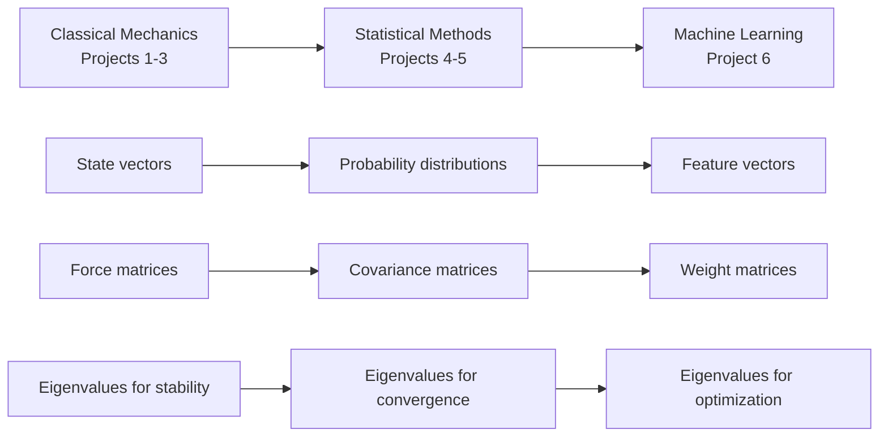

# Module 0: The Linear Algebra Foundation - Building Your Mathematical Telescope

## Quick Navigation Guide

### 📍 Choose Your Learning Path

::::{grid} 1 1 3 3
:gutter: 3

:::{grid-item-card} 🏃 **Fast Track** (2 hours)
Just starting the course? Read only sections marked with 🔴
- [Vectors Essentials](#part-2-vectors)
- [Matrix Fundamentals](#part-3-matrices)
- [Numerical Reality Check](#part-7-numerical-reality)
- [Quick Reference](#essential-scipy-reference)
:::

:::{grid-item-card} 🚶 **Standard Path** (4 hours)
Preparing for projects? Read 🔴 and 🟡 sections
- Everything in Fast Track, plus:
- [Eigenvalues & Eigenvectors](#part-4-eigenvalues)
- [Positive Definite Matrices](#part-5-positive-definite)
- [Implementation Examples](#numerical-implementation)
:::

:::{grid-item-card} 🧗 **Complete Path** (6+ hours)
Want deep understanding? Read all sections including 🟢
- Complete module with:
- Historical contexts
- Mathematical proofs
- Advanced topics
- All worked examples
:::
::::

### 🎯 Navigation by Project Needs

:::{admonition} Quick Jump to What You Need
:class: tip, dropdown

**For Project 1 (Stellar Populations)**
- [Section 2: Vectors](#part-2-vectors) - State representation
- [Section 3.1-3.2: Basic Matrices](#matrices-are-transformations) - Vectorization
- [Section 7.1: Floating Point](#floating-point-truth) - Numerical precision

**For Project 2 (N-body Dynamics)**  
- [Section 2.3-2.4: Cross Products](#cross-product) - Angular momentum
- [Section 4: Eigenvalues](#part-4-eigenvalues) - Stability analysis
- [Section 3.3: Matrix Multiplication](#matrix-multiplication) - Transformations

**For Project 3 (Monte Carlo Radiative Transfer)**
- [Section 3.2: Transformation Matrices](#building-intuition-concrete) - Scattering
- [Section 2.1: Vector Spaces](#vector-spaces) - Photon directions
- [Section 7.2: Condition Numbers](#condition-numbers) - Error propagation

**For Project 4 (MCMC)**
- [Section 5.3: Covariance Matrices](#covariance-matrices) - Proposal distributions
- [Section 4: Eigenvalues](#part-4-eigenvalues) - Convergence rates
- [Section 5.2: Positive Definiteness](#positive-definiteness) - Valid covariances

**For Project 5 (Gaussian Processes)**
- [Section 5: Positive Definite Matrices](#part-5-positive-definite) - Kernel matrices
- [Section 5.5: Cholesky Decomposition](#cholesky-decomposition) - GP implementation
- [Section 6.2: Schur Complement](#block-matrices) - GP updates

**For Final Project (Neural Networks)**
- [Section 3: Matrix Operations](#part-3-matrices) - Layer transformations
- [Section 6.3: Jacobian Matrix](#jacobian-matrix) - Backpropagation
- [Section 4: Eigenvalues](#part-4-eigenvalues) - Optimization landscape
:::

### 📚 Quick Topic Index

| Topic | Section | Priority | First Used |
|-------|---------|----------|------------|
| Vectors & Dot Products | [2.1-2.3](#part-2-vectors) | 🔴 Essential | Project 1 |
| Matrix Multiplication | [3.1-3.3](#part-3-matrices) | 🔴 Essential | Project 1 |
| Eigenvalues/Eigenvectors | [4.1-4.3](#part-4-eigenvalues) | 🟡 Important | Project 2 |
| Covariance Matrices | [5.3](#covariance-matrices) | 🟡 Important | Project 4 |
| Positive Definiteness | [5.1-5.2](#part-5-positive-definite) | 🟡 Important | Project 5 |
| Cholesky Decomposition | [5.5](#cholesky-decomposition) | 🟡 Important | Project 5 |
| SVD | [6.1](#svd-swiss-army) | 🟢 Enrichment | Advanced |
| Matrix Exponentials | [6.4](#matrix-exponentials) | 🟢 Enrichment | Advanced |

---

## Learning Objectives

:::{admonition} 📅 When to Read This Module
:class: dropdown, hint

**Initial Reading**: Before starting Project 1, read sections marked 🔴 (2-3 hours)
**Deep Dive**: Return to 🟡 sections as you start each new project
**Reference**: Use throughout the course as questions arise
**Mastery**: Read 🟢 sections when you want deeper understanding
:::

By the end of this module, you will be able to:

- [ ] **Translate** physical problems into vector and matrix representations 🔴
- [ ] **Apply** conservation laws to identify invariant mathematical structures in dynamical systems 🟡
- [ ] **Calculate** eigenvalues and eigenvectors for 2×2 and 3×3 matrices by hand 🟡
- [ ] **Determine** whether a matrix is positive definite using three different methods 🟡
- [ ] **Choose** the appropriate matrix decomposition for solving different computational problems 🟢
- [ ] **Connect** linear algebra concepts to specific applications in all six course projects 🔴

---

## Prerequisites Review

:::{admonition} 📚 Mathematical Prerequisites Check
:class: note

**Priority: 🔴 Essential** - Review this before starting

Before diving into the module, let's review essential mathematical concepts. If any of these are unfamiliar, spend extra time on the review sections provided.

**You should be comfortable with:**

- [ ] Basic matrix arithmetic (addition, multiplication)
- [ ] Solving quadratic equations
- [ ] Summation notation ($\sum$)
- [ ] Basic trigonometry (sin, cos, radians)
- [ ] Complex numbers (for eigenvalues)

**Quick Review - Matrix Multiplication by Hand:**

To multiply two matrices, use the row-column rule:
$$C_{ij} = \sum_k A_{ik}B_{kj}$$

Example: Multiply
$$A = \begin{pmatrix} 2 & 1 \\ 3 & 4 \end{pmatrix}, \quad B = \begin{pmatrix} 5 & 6 \\ 7 & 8 \end{pmatrix}$$

For element $C_{11}$: Take row 1 of A, column 1 of B:
$$C_{11} = (2)(5) + (1)(7) = 10 + 7 = 17$$

For element $C_{12}$: Take row 1 of A, column 2 of B:
$$C_{12} = (2)(6) + (1)(8) = 12 + 8 = 20$$

Continue for all elements:
$$C = \begin{pmatrix} 17 & 20 \\ 43 & 50 \end{pmatrix}$$

**Complex Numbers Review:**

A complex number $z = a + bi$ where $i = \sqrt{-1}$.
- Magnitude: $|z| = \sqrt{a^2 + b^2}$
- Complex conjugate: $\bar{z} = a - bi$
- For eigenvalues, complex pairs indicate oscillatory behavior
:::

---

## Module Overview

:::{admonition} 🎯 Core Message
:class: important

**Priority: 🔴 Essential**

Linear algebra is the mathematical foundation that makes computational astrophysics possible. Without it, simulating even three gravitationally interacting stars would be computationally intractable. With it, we can simulate millions.
:::

:::{admonition} 🔭 Where We're Going
:class: note

This module takes you on a journey from the simplest mathematical objects (vectors) to the most sophisticated (matrix decompositions). Along the way, you'll discover that the same mathematical structures appear everywhere in physics - from describing stellar positions to encoding the stability of the universe itself. By the end, you'll see linear algebra not as abstract mathematics, but as the natural language for describing physical reality.
:::

```{margin}
**linear algebra**
The branch of mathematics concerning vector spaces and linear transformations between them
```

**Linear algebra** is the mathematical foundation that makes computational astrophysics possible. Without it, simulating even three gravitationally interacting stars would be computationally intractable. With it, we can simulate millions. But linear algebra is more than just a computational tool – it reveals deep structures in physical systems that would otherwise remain hidden.

Consider Omega Centauri, the most massive **globular cluster** orbiting our galaxy. It contains approximately 10 million stars, all gravitationally bound, orbiting their common center of mass for the past 12 billion years. To describe this system's state at any moment requires 60 million numbers (3 position and 3 velocity components for each star). Yet this apparent complexity hides elegant simplicity: the cluster's overall shape is described by just three numbers (the **eigenvalues** of its moment of inertia tensor), its stability is determined by eigenvalues of the gravitational potential, and its statistical properties are encoded in **covariance matrices**.

```{margin}
**globular cluster**
A spherical collection of 10⁴ to 10⁶ stars bound by gravity, orbiting as satellites of galaxies
```

This module builds your understanding from first principles, following the same progression your projects will take. We start with **vectors** describing individual stars (Project 1: Stellar Populations), build to **matrices** transforming entire systems (Project 2: N-body Dynamics), explore how these structures handle uncertainty (Projects 3-4: Monte Carlo and MCMC), and preview how they extend to high-dimensional learning (Projects 5-6: Gaussian Processes and Neural Networks).

:::{admonition} 🎯 Why This Module Matters
:class: important

Every computational method you'll implement in this course ultimately reduces to linear algebra:

- **Project 1**: Your `StellarPopulation` class uses matrix operations for vectorized calculations
- **Project 2**: N-body integration operates in 6N-dimensional phase space
- **Project 3**: Monte Carlo photon transport uses transformation matrices for scattering
- **Project 4**: MCMC efficiency depends on proposal covariance matrices
- **Project 5**: Gaussian Processes require positive definite kernel matrices
- **Final Project**: Neural networks are compositions of matrix transformations

Master these foundations, and you master computational astrophysics.
:::

---

## Part 1: The Opening - A Globular Cluster as a Mathematical Universe

**Priority: 🟡 Important** - Provides physical context for abstract concepts

:::{admonition} 📅 When You'll Use This
:class: dropdown, hint

**First appears in**: Project 2 (N-body dynamics)
**Critical for**: Understanding phase space throughout the course
**Returns in**: Every project dealing with multi-particle systems
:::

### 1.1 The Physical System That Motivates Everything

Let's begin with 47 Tucanae, one of the most spectacular **globular clusters** visible from Earth. It contains roughly one million stars packed into a sphere just 120 light-years across. At its core, stellar densities reach 1000 stars per cubic parsec—if Earth orbited a star there, our night sky would blaze with thousands of stars brighter than Venus.

```{margin}
**phase space**
The space of all possible states of a system; for N particles in 3D, has 6N dimensions (3 position + 3 velocity per particle)
```

To simulate this cluster, we need to track for each star:
- Position: $\vec{r}_i = (x_i, y_i, z_i)$ measured from the cluster center
- Velocity: $\vec{v}_i = (v_{x,i}, v_{y,i}, v_{z,i})$ relative to the cluster's motion

That's 6 million numbers evolving according to Newton's laws. The gravitational force on star $i$ is:

$$\vec{F}_i = -G m_i \sum_{j \neq i} \frac{m_j (\vec{r}_i - \vec{r}_j)}{|\vec{r}_i - \vec{r}_j|^3}$$

Each star feels forces from all others—that's nearly one trillion force calculations per timestep. Without linear algebra, this would be impossible. With it, we can organize these calculations efficiently, identify conserved quantities, and understand the cluster's long-term evolution.

:::{admonition} 🤔 Check Your Understanding
:class: hint

A small globular cluster has 100,000 stars. How many force calculations are needed per timestep if we compute all pairwise interactions?

:::{admonition} Solution
:class: tip, dropdown

Each star feels forces from all others, so we need:
- Star 1: 99,999 force calculations
- Star 2: 99,999 force calculations (but force from star 1 already computed)
- Total unique pairs: $\binom{100,000}{2} = \frac{100,000 \times 99,999}{2} \approx 5 \times 10^9$

That's 5 billion force calculations per timestep! This is why we need efficient matrix operations and clever algorithms like tree codes.
:::
:::

### 1.2 Conservation Laws: The Hidden Structure

**Priority: 🟡 Important** - Fundamental for understanding physical constraints

```{margin}
**conservation law**
A physical quantity that remains constant over time due to an underlying symmetry
```

The cluster's apparent chaos hides profound order. Despite the complex individual stellar orbits, certain quantities never change:

**Total Energy**: 
$$E = \sum_i \frac{1}{2} m_i |\vec{v}_i|^2 - G \sum_{i<j} \frac{m_i m_j}{|\vec{r}_i - \vec{r}_j|}$$

**Total Momentum**: 
$$\vec{P} = \sum_i m_i \vec{v}_i$$

**Total Angular Momentum**: 
$$\vec{L} = \sum_i m_i (\vec{r}_i \times \vec{v}_i)$$

These **conservation laws** aren't accidents—they arise from fundamental symmetries of space and time. Emmy Noether proved that every continuous symmetry implies a conservation law:

| Symmetry | Conservation Law | Mathematical Structure |
|----------|-----------------|----------------------|
| Time translation invariance | Energy | Quadratic forms |
| Space translation invariance | Momentum | Vector addition |
| Rotational invariance | Angular momentum | Cross products, orthogonal matrices |

These symmetries manifest mathematically as properties of vectors and matrices. Translation invariance means physics doesn't change when we add the same vector to all positions. Rotational invariance means physics is preserved under **orthogonal transformations**.

:::{note} 💡 Deeper Insight: Noether's Theorem in Action

**Priority: 🟢 Enrichment**

Noether's theorem tells us that symmetries and conservation laws are two sides of the same coin. In your Project 2, you'll discover that symplectic integrators (which preserve phase space volume) automatically conserve energy over long timescales. This isn't a coincidence – it's Noether's theorem at work! The symplectic structure (preserved determinant) encodes time-translation symmetry, which guarantees energy conservation.
:::

:::{tip} 🌟 The More You Know: Emmy Noether's Revolutionary Theorem
:class: dropdown

**Priority: 🟢 Enrichment**

Emmy Noether (1882-1935) fundamentally changed physics with her 1915 theorem connecting symmetries to conservation laws. Despite facing discrimination that prevented her from holding a paid position for years, she persisted in her work at the University of Göttingen.

When Einstein's general relativity seemed to violate energy conservation, it was Noether who resolved the paradox. She proved that in general relativity, energy conservation becomes local rather than global—a subtle but profound insight. Einstein wrote to Hilbert: "Yesterday I received from Miss Noether a very interesting paper on invariant forms. I'm impressed that such things can be understood in such a general way" (Einstein to Hilbert, May 24, 1918, *Einstein Papers Project*).

Her theorem now underlies all of modern physics. Every conservation law you use—energy, momentum, angular momentum, electric charge—exists because of an underlying symmetry. When you implement conservation checks in your N-body code, you're using Noether's profound insight that geometry determines physics.

*Source: Osen, L. M. (1974). Women in Mathematics. MIT Press. pp. 141–152.*
:::

### 1.3 The Phase Space Perspective

**Priority: 🟡 Important** - Conceptual foundation for Projects 2-6

Here's the profound insight that changes everything: the million-star cluster isn't really moving through 3D space. It's tracing a **trajectory** through a 6-million-dimensional **phase space** where each axis represents one position or velocity component. The system's entire state is a single point in this vast space, and its time evolution is a trajectory through it.

```{margin}
**trajectory**
The path traced by a system's state through phase space as it evolves in time
```

This perspective reveals hidden simplicities:

- Conservation laws constrain the trajectory to a lower-dimensional surface
- Near equilibrium, motion decomposes into independent oscillation modes (eigenvectors)
- Statistical properties emerge from the geometry of this high-dimensional space

:::{admonition} 🚀 Real-World Application
:class: tip

The Gaia space telescope measures positions and velocities for over 1 billion stars in our galaxy. That's a 6-billion-dimensional phase space! Linear algebra makes it possible to:

- Identify moving groups and stellar streams (eigenanalysis)
- Reconstruct the galaxy's gravitational potential (matrix inversion)
- Find hidden structures like dissolved star clusters (principal components)

Without linear algebra, Gaia's data would be incomprehensible noise.
:::

:::{admonition} 📌 Key Takeaway
:class: important

Phase space transforms complexity into geometry. Instead of tracking millions of individual trajectories, we can understand the system through the geometry of its phase space - its conserved surfaces, its stable manifolds, its eigenstructure. This geometric view is what makes the seemingly impossible (simulating millions of stars) actually tractable.
:::

---

## Part 2: Vectors - The Atoms of Physical Description

**Priority: 🔴 Essential** - Foundation for everything that follows

:::{admonition} 📅 When You'll Use This
:class: dropdown, hint

**First appears in**: Project 1 (representing stellar properties)
**Used throughout**: Every single project
**Most critical for**: Understanding state representation and transformations
:::

:::{admonition} 🔭 Where We're Going
:class: note

Vectors are the fundamental building blocks of linear algebra. We'll start with their three complementary interpretations (physical, geometric, algebraic), then explore the operations that let us combine and manipulate them. By the end of this section, you'll see vectors not as lists of numbers but as the natural way to encode any quantity with both magnitude and direction.
:::

### 2.1 What IS a Vector? Building Deep Understanding {#part-2-vectors}

```{margin}
**vector**
A mathematical object with both magnitude and direction that transforms according to specific rules
```

A **vector** is simultaneously three complementary things, and masterful computational scientists fluidly shift between these perspectives:

**Physical Perspective**: A vector represents any quantity with both magnitude and direction. The velocity of Earth orbiting the Sun is a vector—it has a speed (30 km/s) and a direction (tangent to the orbit). Forces, electric fields, angular momenta—all are vectors because they have this magnitude-direction character.

**Geometric Perspective**: A vector is an arrow in space. Crucially, this arrow is **free**—it doesn't have a fixed starting point. The displacement "3 km north" is the same vector whether you start from your house or from campus. This freedom is what allows us to add forces acting at different points on a rigid body.

**Algebraic Perspective**: A vector is an ordered list of numbers—its **components** in some coordinate system. Earth's velocity might be written as:

$$\vec{v} = \begin{pmatrix} -15.2 \\ 25.8 \\ 0.0 \end{pmatrix} \text{ km/s (in ecliptic coordinates)}$$

But here's the crucial insight: these numbers are not the vector itself—they're just one representation. The vector exists independently of any coordinate system.

:::{warning} ⚠️ Common Misconception Alert

Students often think a vector IS its components. This is wrong! A vector is a geometric object that exists independently of coordinates. When you rotate your coordinate system, the components change but the vector itself doesn't. Think of it like describing a person's location: "3 blocks north, 2 blocks east" versus "3.6 blocks northeast" — different descriptions, same displacement.
:::

:::{note} 💡 Building Intuition: Vectors as Instructions

Think of a vector as an instruction for movement. The vector $\vec{v} = (3, 4, 0)$ says: "Go 3 units east, 4 units north, stay at the same height." No matter where you start, following this instruction produces the same displacement. This is why we can slide vectors around freely—they're instructions, not fixed objects.

This becomes powerful in physics: a force vector tells you which way to accelerate and how strongly. A velocity vector tells you which way you're moving and how fast. The vector nature captures both pieces of information in one mathematical object.
:::

:::{admonition} 🧠 Build Your Intuition: Vector Components
:class: note

Without calculating, predict what happens to vector components when you:
1. Rotate the coordinate system 90° clockwise: The x-component becomes the ___ component
2. Double all coordinate axes scales: Components are ___
3. Flip the x-axis direction: The x-component ___

Answers: (1) becomes the y-component, (2) halved, (3) changes sign

This shows components depend on your coordinate choice, but the vector itself doesn't change!
:::

### 2.2 Vector Spaces: The Mathematical Framework {#vector-spaces}

**Priority: 🟡 Important** - Theoretical foundation

```{margin}
**vector space**
A set equipped with addition and scalar multiplication operations satisfying eight specific axioms
```

```{margin}
**linear independence**
Vectors that cannot be written as linear combinations of each other
```

A **vector space** is a set equipped with two operations (vector addition and scalar multiplication) that satisfy eight axioms. These axioms aren't arbitrary mathematical rules—each captures an essential physical property:

| Axiom | Mathematical Statement | Physical Meaning |
|-------|------------------------|------------------|
| **Closure under addition** | $\vec{u} + \vec{v} \in V$ | Adding velocities gives another velocity |
| **Commutativity** | $\vec{u} + \vec{v} = \vec{v} + \vec{u}$ | Order of displacements doesn't matter |
| **Associativity** | $(\vec{u} + \vec{v}) + \vec{w} = \vec{u} + (\vec{v} + \vec{w})$ | Grouping of forces doesn't affect total |
| **Zero vector** | $\exists \vec{0}: \vec{v} + \vec{0} = \vec{v}$ | State of no motion or displacement |
| **Additive inverse** | $\forall \vec{v}, \exists -\vec{v}: \vec{v} + (-\vec{v}) = \vec{0}$ | Every motion has an opposite |
| **Scalar closure** | $c\vec{v} \in V$ | Scaling a force gives another force |
| **Distributivity** | $c(\vec{u} + \vec{v}) = c\vec{u} + c\vec{v}$ | Scaling preserves addition |
| **Identity** | $1 \cdot \vec{v} = \vec{v}$ | Multiplying by 1 changes nothing |

**Linear independence** means vectors cannot be written as combinations of each other - they represent truly independent directions in space.

### From Vectors to Matrices: The Natural Progression

You've mastered vectors - quantities with magnitude and direction. But what happens when you need to transform many vectors simultaneously? This is where matrices emerge naturally. A matrix isn't just a grid of numbers - it's a machine that transforms entire vector spaces. When you multiply a matrix by a vector, you're asking: "Where does this vector go under this transformation?" This perspective transforms matrices from abstract number arrays into concrete geometric operations.

### 2.3 The Dot Product: Projection, Angle, and Energy

**Priority: 🔴 Essential** - Used constantly throughout all projects

```{margin}
**dot product**
Scalar operation on vectors: $\vec{a} \cdot \vec{b} = |\vec{a}||\vec{b}|\cos\theta$
```

The **dot product** is perhaps the most important operation in physics because it answers a fundamental question: "How much does one vector contribute in the direction of another?"

**Definition and Formula**:
$$\vec{a} \cdot \vec{b} = a_x b_x + a_y b_y + a_z b_z = |\vec{a}||\vec{b}|\cos\theta$$

But why are these two formulas equal? Let's derive this connection from first principles.

:::{admonition} 📐 Mathematical Derivation: Dot Product Formula
:class: note, dropdown

**Priority: 🟢 Enrichment**

**Starting from the Law of Cosines:**

Consider vectors $\vec{a}$ and $\vec{b}$ with angle $\theta$ between them. The vector from tip of $\vec{a}$ to tip of $\vec{b}$ is $\vec{b} - \vec{a}$.

By the law of cosines:
$$|\vec{b} - \vec{a}|^2 = |\vec{a}|^2 + |\vec{b}|^2 - 2|\vec{a}||\vec{b}|\cos\theta$$

Expanding the left side:
$$|\vec{b} - \vec{a}|^2 = (b_x - a_x)^2 + (b_y - a_y)^2 + (b_z - a_z)^2$$
$$= |\vec{a}|^2 + |\vec{b}|^2 - 2(a_x b_x + a_y b_y + a_z b_z)$$

Comparing both expressions:
$$a_x b_x + a_y b_y + a_z b_z = |\vec{a}||\vec{b}|\cos\theta$$

This proves the component formula equals the geometric formula!
:::

**Physical Applications of the Dot Product**:

<!-- Suggested figure: Visual showing force vector, displacement vector, and the component of force along displacement -->

**Work Done by a Force**:
$$W = \vec{F} \cdot \vec{d} = |\vec{F}||\vec{d}|\cos\theta$$

Only the component of force along the displacement does work. A force perpendicular to motion (like the normal force on a sliding block) does zero work.

**Power from Solar Panels**:
$$P = \vec{S} \cdot \hat{n} = |\vec{S}|\cos\theta$$

where $\vec{S}$ is the solar flux vector and $\hat{n}$ is the panel's normal. Maximum power when facing the sun ($\theta = 0$), zero when edge-on ($\theta = 90°$).

:::{admonition} 🤔 Check Your Understanding
:class: hint

Two stars have velocities $\vec{v}_1 = (200, 100, 50)$ km/s and $\vec{v}_2 = (150, -100, 100)$ km/s.

1. Calculate their relative velocity
2. Are they approaching or receding? (Hint: use the dot product)

:::{admonition} Solution
:class: tip, dropdown

1. Relative velocity: $\vec{v}_{\text{rel}} = \vec{v}_1 - \vec{v}_2 = (50, 200, -50)$ km/s

2. To determine if approaching or receding, we need the dot product of relative velocity with separation vector. If we assume star 2 is at origin and star 1 at position $\vec{r}$:
   - If $\vec{v}_{\text{rel}} \cdot \vec{r} > 0$: receding
   - If $\vec{v}_{\text{rel}} \cdot \vec{r} < 0$: approaching
   - If $\vec{v}_{\text{rel}} \cdot \vec{r} = 0$: constant separation

Without knowing positions, we can't determine if they're approaching or receding — we need both position and velocity information!
:::
:::

### 2.4 The Cross Product: Creating Perpendicularity {#cross-product}

**Priority: 🔴 Essential** - Critical for angular momentum in Project 2

```{margin}
**cross product**
Vector operation producing a perpendicular vector: $\vec{a} \times \vec{b}$
```

The **cross product** creates a vector perpendicular to two input vectors:

$$\vec{a} \times \vec{b} = \begin{pmatrix} a_y b_z - a_z b_y \\ a_z b_x - a_x b_z \\ a_x b_y - a_y b_x \end{pmatrix}$$

**Geometric Intuition**: To find the direction of $\vec{a} \times \vec{b}$, use the right-hand rule: curl your right hand's fingers from the first vector $\vec{a}$ toward the second vector $\vec{b}$ through the smaller angle. Your thumb points in the direction of the cross product. This isn't arbitrary - it ensures consistency with our choice of right-handed coordinate systems.

**Key Properties**:

- **Magnitude**: $|\vec{a} \times \vec{b}| = |\vec{a}||\vec{b}|\sin\theta$ (area of parallelogram)
- **Direction**: Right-hand rule
- **Anti-commutative**: $\vec{a} \times \vec{b} = -\vec{b} \times \vec{a}$

**Physical Meaning - Angular Momentum**:

For a star at position $\vec{r}$ with momentum $\vec{p} = m\vec{v}$:
$$\vec{L} = \vec{r} \times \vec{p}$$

This vector is perpendicular to the orbital plane. Its magnitude equals twice the rate of area swept out—this is Kepler's second law!

:::{warning} ⚠️ Common Pitfall: Cross Product Order
:class: warning

Students often forget that cross product order matters! 
$\vec{a} \times \vec{b} = -\vec{b} \times \vec{a}$ (they point in opposite directions)

This is crucial in physics: 
- Torque: $\vec{\tau} = \vec{r} \times \vec{F}$ (position THEN force)
- Angular momentum: $\vec{L} = \vec{r} \times \vec{p}$ (position THEN momentum)

Getting the order wrong flips the direction - your planet orbits backward!
:::

### 2.5 Orthogonality: When Vectors Don't Talk

**Priority: 🟡 Important** - Essential for understanding basis vectors

```{margin}
**orthogonal**
Perpendicular; vectors with zero dot product
```

Two vectors are **orthogonal** (perpendicular) when their dot product is zero: $\vec{a} \cdot \vec{b} = 0$. This isn't just a geometric curiosity - orthogonality is why we can decompose complex systems into independent components.

**Why Orthogonal Bases Are Special**:

When basis vectors are orthogonal, calculations become dramatically simpler:
- **Projections are independent**: The component along one axis doesn't affect others
- **Pythagoras works**: $|\vec{v}|^2 = v_x^2 + v_y^2 + v_z^2$
- **Rotations preserve dot products**: Orthogonal transformations preserve angles and lengths

**Physical Example**: In quantum mechanics, energy eigenstates are orthogonal. This means measuring one energy level doesn't affect the probability of finding the system in another level. The orthogonality of spherical harmonics is why we can decompose the cosmic microwave background into independent multipole moments! 

**Astrophysical Application**: When tracking stellar proper motions, observations often come in non-orthogonal coordinate systems (right ascension, declination, radial velocity). Orthogonalization creates independent velocity components where each represents truly independent motion - essential for understanding 3D stellar kinematics and discovering moving groups in the solar neighborhood.

:::{admonition} 💻 Computational Reality Check: Vectorization
:class: tip

Orthogonal decomposition isn't just mathematically elegant - it's computationally essential:

```python
# Computing forces between N stars

# Slow nested loops (DON'T DO THIS):
forces = np.zeros((N, 3))
for i in range(N):
    for j in range(N):
        if i != j:
            r_ij = positions[j] - positions[i]
            forces[i] += G * masses[j] * r_ij / np.linalg.norm(r_ij)**3
# Time for N=1000: ~2 seconds

# Fast vectorized version (DO THIS):
# Compute all pairwise differences at once
dr = positions[:, np.newaxis, :] - positions[np.newaxis, :, :]  # Shape: (N, N, 3)
distances = np.linalg.norm(dr, axis=2)  # Shape: (N, N)
np.fill_diagonal(distances, np.inf)  # Avoid self-interaction
forces = G * np.sum(masses[np.newaxis, :, np.newaxis] * dr / distances[:, :, np.newaxis]**3, axis=1)
# Time for N=1000: ~0.02 seconds (100x faster!)

# The speedup comes from:
# 1. NumPy operations run in optimized C code
# 2. CPU vector instructions process multiple values simultaneously
# 3. Better cache usage from processing contiguous memory
```
:::

### 2.6 Basis Vectors and Coordinate Systems

**Priority: 🟡 Important** - Needed when changing coordinate systems

```{margin}
**basis**
A set of linearly independent vectors that span the entire vector space
```

A **basis** is a set of linearly independent vectors that span the entire space. The familiar Cartesian basis:

$$\hat{x} = \begin{pmatrix} 1 \\ 0 \\ 0 \end{pmatrix}, \quad \hat{y} = \begin{pmatrix} 0 \\ 1 \\ 0 \end{pmatrix}, \quad \hat{z} = \begin{pmatrix} 0 \\ 0 \\ 1 \end{pmatrix}$$

These are **orthonormal**: mutually perpendicular and unit length.

Any vector can be decomposed:
$$\vec{v} = v_x \hat{x} + v_y \hat{y} + v_z \hat{z}$$

The coefficients are found by projection:
$$v_x = \vec{v} \cdot \hat{x}, \quad v_y = \vec{v} \cdot \hat{y}, \quad v_z = \vec{v} \cdot \hat{z}$$

:::{admonition} 💡 Practical Insight: Choosing the Right Coordinates
:class: note

**Priority: 🟡 Important for Project 2**

Different problems benefit from different coordinate systems:

| System | Best Coordinates | Why |
|--------|-----------------|-----|
| Binary star orbit | Centered on barycenter | Simplifies equations of motion |
| Spiral galaxy | Cylindrical (R, φ, z) | Matches galaxy symmetry |
| Globular cluster | Spherical (r, θ, φ) | Exploits spherical symmetry |
| Stellar stream | Along stream trajectory | Reveals stream structure |

In Project 2, you'll transform between coordinate systems to simplify your N-body calculations.
:::

:::{admonition} 📐 Worked Example: Gram-Schmidt Orthogonalization
:class: note, dropdown

**Priority: 🟢 Enrichment** - Helps understand QR decomposition

**Physical Motivation**: You're observing a galaxy and measure velocities in a skewed coordinate system. Gram-Schmidt creates an orthonormal basis where velocity components are independent - essential for understanding the true motion patterns!

The **Gram-Schmidt process** creates an orthonormal basis from any linearly independent set. This is essential for understanding QR decomposition.

**Given vectors**: $\vec{v}_1 = (1, 1, 0)$, $\vec{v}_2 = (1, 0, 1)$, $\vec{v}_3 = (0, 1, 1)$

**Step 1**: Normalize first vector
$$\vec{u}_1 = \frac{\vec{v}_1}{|\vec{v}_1|} = \frac{(1, 1, 0)}{\sqrt{2}} = \left(\frac{1}{\sqrt{2}}, \frac{1}{\sqrt{2}}, 0\right)$$

**Step 2**: Remove $\vec{u}_1$ component from $\vec{v}_2$
$$\vec{w}_2 = \vec{v}_2 - (\vec{v}_2 \cdot \vec{u}_1)\vec{u}_1$$
$$= (1, 0, 1) - \frac{1}{\sqrt{2}} \cdot \left(\frac{1}{\sqrt{2}}, \frac{1}{\sqrt{2}}, 0\right)$$
$$= (1, 0, 1) - \left(\frac{1}{2}, \frac{1}{2}, 0\right) = \left(\frac{1}{2}, -\frac{1}{2}, 1\right)$$

Normalize: $\vec{u}_2 = \vec{w}_2/|\vec{w}_2| = \left(\frac{1}{\sqrt{6}}, -\frac{1}{\sqrt{6}}, \frac{2}{\sqrt{6}}\right)$

**Step 3**: Remove $\vec{u}_1$ and $\vec{u}_2$ components from $\vec{v}_3$
$$\vec{w}_3 = \vec{v}_3 - (\vec{v}_3 \cdot \vec{u}_1)\vec{u}_1 - (\vec{v}_3 \cdot \vec{u}_2)\vec{u}_2$$

After calculation: $\vec{u}_3 = \left(-\frac{1}{\sqrt{3}}, \frac{1}{\sqrt{3}}, \frac{1}{\sqrt{3}}\right)$

The result is an orthonormal basis that spans the same space as the original vectors!
:::

:::{admonition} ✅ Test Your Understanding: Vectors
:class: hint

Before moving on, can you answer these conceptual questions?

1. Why can we slide vectors around freely in space?
2. What does it mean physically when two vectors are orthogonal?
3. Why does the dot product give us work done by a force?
4. What information does the cross product magnitude tell us?

Think about these before checking the answers!

:::{admonition} Answers
:class: tip, dropdown

1. Vectors represent displacements/instructions, not fixed positions. The instruction "go 3 km north" is the same regardless of starting point.

2. The vectors represent independent directions - no component of one lies along the other. Physically: perpendicular forces, independent measurements.

3. Work is energy transferred along the direction of motion. The dot product extracts exactly the component of force along displacement.

4. The area of the parallelogram formed by the vectors. In physics: angular momentum magnitude, torque strength, rate of area swept in orbit.
:::
:::

### Progressive Problems: Vectors

:::{admonition} 📝 Practice Problems
:class: note

**Level 1 (Conceptual)**: Verify that the vectors $\vec{a} = (1, 0, 0)$ and $\vec{b} = (0, 1, 0)$ are orthogonal.

**Level 2 (Computational)**: Find a unit vector perpendicular to both $\vec{a} = (1, 2, 3)$ and $\vec{b} = (4, 5, 6)$.

**Level 3 (Theoretical)**: Prove that for any vectors $\vec{a}$, $\vec{b}$, $\vec{c}$: $\vec{a} \cdot (\vec{b} \times \vec{c}) = \vec{b} \cdot (\vec{c} \times \vec{a}) = \vec{c} \cdot (\vec{a} \times \vec{b})$ (the scalar triple product is cyclic).

:::{admonition} Solutions
:class: tip, dropdown

**Level 1**: $\vec{a} \cdot \vec{b} = (1)(0) + (0)(1) + (0)(0) = 0$ ✓ They're orthogonal.

**Level 2**: 
- $\vec{a} \times \vec{b} = (2·6-3·5, 3·4-1·6, 1·5-2·4) = (-3, 6, -3)$
- Magnitude: $|\vec{a} \times \vec{b}| = \sqrt{9+36+9} = \sqrt{54} = 3\sqrt{6}$
- Unit vector: $\hat{n} = \frac{1}{3\sqrt{6}}(-3, 6, -3) = \frac{1}{\sqrt{6}}(-1, 2, -1)$

**Level 3**: The scalar triple product represents the volume of the parallelepiped formed by the three vectors. Since volume doesn't depend on which face you consider as the base, the product is cyclic. Algebraically, this follows from the determinant representation of the triple product.
:::
:::

:::{admonition} 📌 Key Takeaway
:class: important

Vectors are not just arrows or lists of numbers - they're the natural language for any quantity with magnitude and direction. Master the dot product (projection/angle), cross product (perpendicularity/rotation), and basis decomposition, and you can describe any physical system from stellar velocities to electromagnetic fields.
:::

---

## Part 3: Matrices - Transformations That Preserve Structure

**Priority: 🔴 Essential** - Core to all computational methods

:::{admonition} 📅 When You'll Use This
:class: dropdown, hint

**First appears in**: Project 1 (vectorization with matrices)
**Critical for**: All projects, especially neural networks
**Most important**: Understanding matrices as transformations, not just number grids
:::

:::{admonition} 🔭 Where We're Going
:class: note

Matrices are where linear algebra becomes powerful. We'll discover that matrices aren't just rectangular arrays of numbers - they're transformations that reshape space while preserving its linear structure. You'll learn to read a matrix and immediately understand what it does geometrically, setting the foundation for everything from N-body dynamics to neural networks.
:::

:::{admonition} 📚 Prerequisites Check
:class: hint

Before proceeding, can you:
- [ ] Multiply two 2×2 matrices by hand?
- [ ] Explain why matrix multiplication order matters?
- [ ] Calculate the determinant of a 2×2 matrix?

If not, review the Prerequisites section before continuing.
:::

### 3.1 Matrices ARE Linear Transformations {#part-3-matrices}

```{margin}
**matrix**
A linear transformation represented as a rectangular array of numbers
```

A **matrix** is not just a grid of numbers—it's a rule for transforming vectors. When we multiply matrix $A$ by vector $\vec{v}$, we get a new vector $A\vec{v}$. The crucial property is **linearity**:

$$A(\alpha\vec{u} + \beta\vec{v}) = \alpha A\vec{u} + \beta A\vec{v}$$

:::{admonition} 💡 Building Intuition: Why Row-Times-Column?
:class: note

The strange-looking matrix multiplication rule (row times column) ensures that transformation composition works correctly. Here's why:

When you apply transformation $A$ to vector $\vec{v}$, each component of the output is a linear combination of input components. The first row of $A$ tells you how to compute the first output component:

$$\text{output}_1 = a_{11} v_1 + a_{12} v_2 + a_{13} v_3$$

This is exactly a dot product of row 1 with the vector! Each row defines how one output component depends on all input components. This structure ensures that composing transformations (multiplying matrices) gives the same result as applying them sequentially.
:::

### 3.2 Building Intuition with Concrete Examples {#building-intuition-concrete}

**Priority: 🔴 Essential** - Recognize these patterns in your code

Let's see actual matrices and understand what they do:

**The Identity Matrix** (the "do nothing" transformation):
$$I = \begin{pmatrix} 
\boxed{1} & 0 & 0 \\ 
0 & \boxed{1} & 0 \\ 
0 & 0 & \boxed{1} 
\end{pmatrix}$$

Notice the diagonal of ones! For any vector: $I\vec{v} = \vec{v}$. Visually, this leaves all vectors exactly where they are - no rotation, no scaling, no shearing.

**A Rotation Matrix** (30° around z-axis):
$$R_{30°} = \begin{pmatrix} 
0.866 & -0.5 & 0 \\
0.5 & 0.866 & 0 \\
0 & 0 & 1 
\end{pmatrix}$$

The z-component is unchanged (last row is [0, 0, 1]) because we rotate around z. Imagine looking down the z-axis: this matrix spins everything counterclockwise by 30° like a record player, preserving all lengths.

**A Diagonal Matrix** (scaling transformation):
$$D = \begin{pmatrix}
\boxed{2} & 0 & 0 \\
0 & \boxed{3} & 0 \\
0 & 0 & \boxed{1}
\end{pmatrix}$$

Doubles x, triples y, leaves z unchanged. Only diagonal elements are non-zero! This stretches space non-uniformly - imagine stretching a rubber sheet more in one direction than another.

**A Symmetric Matrix** (moment of inertia):
$$I = \begin{pmatrix}
5 & \boxed{2} & 0 \\
\boxed{2} & 8 & \boxed{1} \\
0 & \boxed{1} & 6
\end{pmatrix}$$

Notice $I_{ij} = I_{ji}$ (boxed elements show symmetry). Symmetric matrices represent reciprocal relationships - if x affects y, then y affects x equally.

:::{admonition} 🤔 Check Your Understanding
:class: hint

What does this matrix do to vectors?
$$M = \begin{pmatrix} 
-1 & 0 & 0 \\
0 & 1 & 0 \\
0 & 0 & 1 
\end{pmatrix}$$

:::{admonition} Solution
:class: tip, dropdown

This matrix flips the x-component while leaving y and z unchanged. It's a reflection through the yz-plane! If you apply it twice, you get back the original vector (since $(-1) \times (-1) = 1$).

Test with $\vec{v} = (3, 4, 5)$:
$$M\vec{v} = \begin{pmatrix} -3 \\ 4 \\ 5 \end{pmatrix}$$

This transformation appears in physics when dealing with parity operations or mirror symmetries.
:::
:::

### 3.3 Matrix Multiplication: Composition of Transformations {#matrix-multiplication}

**Priority: 🔴 Essential** - Fundamental operation

```{margin}
**matrix multiplication**
Operation combining two transformations into one: $(AB)\vec{v} = A(B\vec{v})$
```

Matrix multiplication encodes function composition. The element in row $i$, column $j$ of product $AB$ is:

$$(AB)_{ij} = \sum_k A_{ik}B_{kj}$$

This seemingly weird formula ensures that:
$$(AB)\vec{v} = A(B\vec{v})$$

**Why Order Matters**:

Consider rotating 90° around x-axis, then 90° around z-axis, versus the opposite order:

<!-- Suggested figure: Show a cube being rotated in both orders, ending in different orientations -->

Different orders give different results! This is why $AB \neq BA$ in general.

:::{warning} ⚠️ Common Pitfall: Matrix Multiplication Order
:class: warning

Students often try: $A \cdot B \cdot C = A \cdot C \cdot B$ (wrong!)

Matrix multiplication is NOT commutative. Order matters because each matrix is a transformation applied in sequence. Rotating then scaling gives different results than scaling then rotating!

Remember: When you see $ABC\vec{v}$, read it right-to-left: "First apply C, then B, then A to vector v."
:::

**Understanding Determinants - Three Levels**:

Level 1 (Concrete): Det = 0 means "information is lost"
- Example: Projecting 3D onto 2D loses depth information

Level 2 (Geometric): Det measures volume scaling
- Example: det=2 means volumes double under transformation

Level 3 (Abstract): Det is the product of eigenvalues
- This connects spectrum to geometry to invertibility!

:::{admonition} 📐 Worked Example: 3×3 Matrix Inversion by Hand
:class: note, dropdown

**Priority: 🟢 Enrichment** - Useful for understanding numerical methods

Let's invert a 3×3 matrix using the cofactor method. Given:
$$A = \begin{pmatrix} 
2 & 1 & 0 \\
1 & 2 & 1 \\
0 & 1 & 2 
\end{pmatrix}$$

**Step 1**: Calculate the determinant
$$\det(A) = 2\begin{vmatrix}2&1\\1&2\end{vmatrix} - 1\begin{vmatrix}1&1\\0&2\end{vmatrix} + 0$$
$$= 2(4-1) - 1(2-0) = 6 - 2 = 4$$

Since $\det(A) \neq 0$, the matrix is invertible.

**Step 2**: Calculate the matrix of minors
For element $(1,1)$: $M_{11} = \begin{vmatrix}2&1\\1&2\end{vmatrix} = 3$

For element $(1,2)$: $M_{12} = \begin{vmatrix}1&1\\0&2\end{vmatrix} = 2$

Continue for all elements...

**Step 3**: Apply cofactor signs (checkerboard pattern)
$$C = \begin{pmatrix} 
+3 & -2 & +1 \\
-2 & +4 & -2 \\
+1 & -2 & +3 
\end{pmatrix}$$

**Step 4**: Transpose and divide by determinant
$$A^{-1} = \frac{1}{4}C^T = \frac{1}{4}\begin{pmatrix} 
3 & -2 & 1 \\
-2 & 4 & -2 \\
1 & -2 & 3 
\end{pmatrix}$$

**Verify**: $AA^{-1} = I$ ✓
:::

### 3.4 The Determinant: Volume, Orientation, and Information

**Priority: 🟡 Important** - Helps understand singularity and numerical stability

```{margin}
**determinant**
Scalar value measuring how a linear transformation scales volumes
```

```{margin}
**symplectic**
Transformation preserving phase space volume (determinant = 1)
```

The **determinant** tells us three crucial things:

| $\det(A)$ | Meaning | Physical Interpretation |
|-----------|---------|------------------------|
| $\|\det(A)\|$ | Volume scaling factor | How much the transformation stretches/shrinks space |
| $\det(A) > 0$ | Preserves orientation | Right-handed stays right-handed |
| $\det(A) < 0$ | Flips orientation | Right-handed becomes left-handed |
| $\det(A) = 0$ | Singular (non-invertible) | Information is lost, dimension collapses |

For a 2×2 matrix:
$$\det\begin{pmatrix} a & b \\ c & d \end{pmatrix} = ad - bc$$

:::{admonition} 🎯 Why This Matters for Your Projects
:class: important

In Project 2, you'll implement the Leapfrog integrator for N-body dynamics. This integrator is **symplectic**—it preserves phase space volume, meaning its transformation matrix has determinant = 1. This is why it conserves energy over millions of orbits while simpler integrators fail after just hundreds!
:::

### 3.5 The Inverse: Undoing Transformations

**Priority: 🟡 Important** - Critical for solving systems

```{margin}
**matrix inverse**
The transformation that undoes another: $A^{-1}A = I$
```

The **inverse** matrix $A^{-1}$ satisfies:
$$A^{-1}A = AA^{-1} = I$$

For a 2×2 matrix:
$$A = \begin{pmatrix} a & b \\ c & d \end{pmatrix} \implies A^{-1} = \frac{1}{\det(A)}\begin{pmatrix} d & -b \\ -c & a \end{pmatrix}$$

Notice you divide by the determinant—this is why singular matrices (det = 0) have no inverse!

### Progressive Problems: Matrices

:::{admonition} 📝 Practice Problems
:class: note

**Level 1**: Show that rotation matrices preserve lengths (hint: check that $|R\vec{v}| = |\vec{v}|$).

**Level 2**: Prove that the determinant of a product equals the product of determinants: $\det(AB) = \det(A)\det(B)$.

**Level 3**: Find conditions on matrix $A$ such that $A^2 = I$ (such matrices are called involutions).

:::{admonition} Solutions
:class: tip, dropdown

**Level 1**: For rotation matrix $R$, we have $R^TR = I$ (orthogonal property). Then:
$|R\vec{v}|^2 = (R\vec{v})^T(R\vec{v}) = \vec{v}^TR^TR\vec{v} = \vec{v}^T\vec{v} = |\vec{v}|^2$ ✓

**Level 2**: This follows from the multiplicative property of determinants. Geometrically: if $A$ scales volumes by factor $\det(A)$ and $B$ by $\det(B)$, then $AB$ scales by $\det(A) \cdot \det(B)$.

**Level 3**: $A^2 = I$ means $A = A^{-1}$. This requires eigenvalues to be ±1 (since if $A\vec{v} = \lambda\vec{v}$, then $A^2\vec{v} = \lambda^2\vec{v} = \vec{v}$, so $\lambda^2 = 1$). Examples: reflections, 180° rotations.
:::
:::

:::{admonition} 📌 Key Takeaway
:class: important

Matrices are transformations, not just number grids. Every matrix tells a geometric story: rotations preserve lengths, scalings stretch space, projections collapse dimensions. When you multiply matrices, you're composing transformations. This geometric view transforms abstract calculations into visual understanding.
:::

---

## Part 4: Eigenvalues and Eigenvectors - Finding Invariant Structure

**Priority: 🟡 Important** - Critical for stability analysis and convergence

:::{admonition} 📅 When You'll Use This
:class: dropdown, hint

**First appears in**: Project 2 (orbital stability)
**Critical for**: Projects 4-5 (convergence, optimization)
**Returns in**: Final Project (neural network training dynamics)

Skip on first reading if time-constrained, return when starting Project 2.
:::

:::{admonition} 🔭 Where We're Going
:class: note

Eigenvalues and eigenvectors reveal the hidden skeleton of a transformation. We'll discover special directions that don't rotate (only stretch or shrink), and see how these invariant directions determine everything from system stability to convergence rates. This is where linear algebra reveals the deep structure of physical systems.
:::

:::{admonition} 📚 Prerequisites Check
:class: hint

Before this section, ensure you can:
- [ ] Explain why matrix multiplication is not commutative
- [ ] Identify when a matrix is singular by its determinant
- [ ] Calculate determinants of 2×2 and 3×3 matrices

Review Section 3 if needed.
:::

### 4.1 The Eigenvalue Equation: Directions That Don't Rotate {#part-4-eigenvalues}

```{margin}
**eigenvector**
A vector that is only scaled (not rotated) by a transformation
```

```{margin}
**eigenvalue**
The scaling factor for an eigenvector
```

Some special vectors are only scaled by a transformation:

$$A\vec{v} = \lambda\vec{v}$$

These **eigenvectors** $\vec{v}$ and their **eigenvalues** $\lambda$ reveal fundamental structure.

**Geometric Intuition**: Imagine stretching a rubber sheet. Most directions get rotated as the sheet deforms, but along eigenvector directions, points only move closer to or farther from the origin without changing direction. These are the "natural axes" of the transformation.

**Physical Example - Spinning Objects**:

Consider a football. It has three principal axes:
- Long axis (through the points)
- Two short axes (perpendicular to long axis)

Spin it around the long axis → stable rotation
Spin it around a short axis → stable rotation
Spin it at any other angle → it wobbles!

The principal axes are eigenvectors of the moment of inertia tensor.

:::{admonition} 🧠 Build Your Intuition: Eigenvalues
:class: note

Without calculating, predict the eigenvalues:
1. Identity matrix I → eigenvalues are all ___?
2. Matrix 2I (doubles all vectors) → eigenvalues are all ___?
3. Rotation matrix (90°) → eigenvalues are ___? (Hint: what length is preserved?)

Answers: (1) all 1, (2) all 2, (3) complex with |λ|=1 (rotation preserves length but has no real invariant directions except in 3D where the rotation axis is an eigenvector)
:::

### 4.2 Finding Eigenvalues: The Characteristic Equation

```{margin}
**characteristic equation**
$\det(A - \lambda I) = 0$, whose roots are eigenvalues
```

```{margin}
**trace**
Sum of diagonal elements, equals sum of eigenvalues
```

To find eigenvalues:

1. Rearrange: $(A - \lambda I)\vec{v} = \vec{0}$
2. For non-trivial solutions: $\det(A - \lambda I) = 0$
3. This gives the **characteristic equation**

For an n×n matrix, the characteristic polynomial has degree n, potentially yielding n eigenvalues (counting multiplicity) in the complex numbers. The **trace** (sum of diagonal elements) equals the sum of eigenvalues.

:::{admonition} 📐 Worked Example: Complete Eigenvalue and Eigenvector Calculation
:class: note

**Priority: 🟡 Important** - You'll do this for stability analysis

Find eigenvalues AND eigenvectors of:
$$A = \begin{pmatrix} 3 & 1 \\ 1 & 3 \end{pmatrix}$$

**Step 1**: Set up characteristic equation:
$$\det(A - \lambda I) = \det\begin{pmatrix} 3-\lambda & 1 \\ 1 & 3-\lambda \end{pmatrix} = 0$$

**Step 2**: Calculate determinant:
$$(3-\lambda)^2 - 1 = 0$$
$$\lambda^2 - 6\lambda + 8 = 0$$

**Step 3**: Solve quadratic:
$$\lambda = \frac{6 \pm \sqrt{36-32}}{2} = \frac{6 \pm 2}{2}$$

Therefore: $\lambda_1 = 4$, $\lambda_2 = 2$

**Step 4**: Find eigenvector for $\lambda_1 = 4$:

Solve $(A - 4I)\vec{v} = \vec{0}$:
$$\begin{pmatrix} -1 & 1 \\ 1 & -1 \end{pmatrix}\begin{pmatrix} v_1 \\ v_2 \end{pmatrix} = \begin{pmatrix} 0 \\ 0 \end{pmatrix}$$

This gives: $-v_1 + v_2 = 0$, so $v_1 = v_2$

Eigenvector: $\vec{v}_1 = \begin{pmatrix} 1 \\ 1 \end{pmatrix}$ (or any scalar multiple)

**Step 5**: Find eigenvector for $\lambda_2 = 2$:

Solve $(A - 2I)\vec{v} = \vec{0}$:
$$\begin{pmatrix} 1 & 1 \\ 1 & 1 \end{pmatrix}\begin{pmatrix} v_1 \\ v_2 \end{pmatrix} = \begin{pmatrix} 0 \\ 0 \end{pmatrix}$$

This gives: $v_1 + v_2 = 0$, so $v_1 = -v_2$

Eigenvector: $\vec{v}_2 = \begin{pmatrix} 1 \\ -1 \end{pmatrix}$

**Verification**: Check $A\vec{v}_1 = 4\vec{v}_1$ ✓ and $A\vec{v}_2 = 2\vec{v}_2$ ✓

**Physical Meaning**: This matrix stretches by factor 4 along the diagonal direction $(1,1)$ and by factor 2 along the anti-diagonal $(1,-1)$.
:::

### 4.3 Physical Meaning Throughout Your Projects

**Physical Intuition: Why eigenvalues determine stability**

Consider a star cluster near equilibrium. Small perturbations evolve as:
$$\delta x(t) = e^{\lambda t} v$$

- If $\lambda < 0$: perturbation decays → stable (like a ball in a valley)
- If $\lambda > 0$: perturbation grows → unstable (like a ball on a hill)  
- If $\lambda$ is complex: oscillation with growth/decay (spiral behavior)

The largest eigenvalue determines the fate: even one positive eigenvalue means the system will eventually fly apart!

Eigenvalues appear in every project:

| Project | Where Eigenvalues Appear | What They Tell You |
|---------|-------------------------|-------------------|
| Project 1 | Covariance matrix of stellar properties | Principal components of variation |
| Project 2 | Linearized dynamics near equilibrium | Orbital stability (stable if all $\lambda < 0$) |
| Project 3 | Scattering matrix | Preferred scattering directions |
| Project 4 | MCMC transition matrix | Convergence rate ($\sim 1/\|1-\lambda_2\|$) |
| Project 5 | GP kernel matrix | Effective degrees of freedom |
| Final Project | Neural network Hessian | Optimization landscape curvature |

:::{admonition} 💡 Deep Connection: Why Symmetric Matrices Are Special
:class: note

**Priority: 🟡 Important for Projects 4-5**

**The Spectral Theorem** guarantees that symmetric matrices have:
1. All real eigenvalues
2. Orthogonal eigenvectors

This isn't mathematical coincidence—it's physical necessity! Symmetric matrices represent quantities where direction doesn't matter for the relationship (like forces between particles). If eigenvalues could be complex, we'd have complex energies or distances, which is nonsensical. Mathematics enforces physical reasonableness!
:::

:::{tip} 🌟 The More You Know: Jacobi's Method Born from Astronomy
:class: dropdown

**Priority: 🟢 Enrichment**

Carl Gustav Jacob Jacobi (1804-1851) developed his famous eigenvalue algorithm while studying the rotation of celestial bodies. In 1846, he published "Über ein leichtes Verfahren die in der Theorie der Säcularstörungen vorkommenden Gleichungen numerisch aufzulösen" (*On an easy method to numerically solve equations occurring in the theory of secular perturbations*).

The problem arose from calculating planetary perturbations—small gravitational influences planets exert on each other. These perturbations accumulate over centuries (hence "secular") and are described by symmetric matrices whose eigenvalues determine the long-term stability of orbits.

Jacobi's insight was to diagonalize the matrix through a sequence of rotations, each zeroing out one off-diagonal element. Though computers didn't exist, his method was designed for hand calculation—each step is simple enough to do with pencil and paper. Today, variants of Jacobi's method run on every supercomputer simulating galaxy collisions or climate models.

The next time your code calls `numpy.linalg.eigh()`, remember: you're using an algorithm invented to predict whether the solar system is stable over millions of years!

*Source: Jacobi, C.G.J. (1846). Crelle's Journal, 30, pp. 51-94.*
:::

:::{admonition} 📚 Mathematical Deep Dive: Proof that Symmetric Matrices Have Real Eigenvalues
:class: note, dropdown

**Priority: 🟢 Enrichment**

This proof reveals why physics "prefers" symmetric matrices.

**Theorem**: Every real symmetric matrix has only real eigenvalues.

**Proof**:
Let $A$ be a real symmetric matrix and suppose $\lambda$ is an eigenvalue with eigenvector $\vec{v}$. We'll show $\lambda$ must be real.

Consider the complex conjugate of the eigenvalue equation:
$$A\vec{v} = \lambda\vec{v}$$

Taking complex conjugates:
$$\overline{A\vec{v}} = \overline{\lambda\vec{v}}$$

Since $A$ is real: $A\overline{\vec{v}} = \overline{\lambda}\overline{\vec{v}}$

Now compute $\vec{v}^* A \vec{v}$ in two ways:

Method 1: $\vec{v}^* A \vec{v} = \vec{v}^* (\lambda \vec{v}) = \lambda (\vec{v}^* \vec{v}) = \lambda |\vec{v}|^2$

Method 2: $\vec{v}^* A \vec{v} = (A^T \vec{v})^* \vec{v} = (A\vec{v})^* \vec{v}$ (since $A = A^T$)
         $= (\lambda\vec{v})^* \vec{v} = \overline{\lambda} \vec{v}^* \vec{v} = \overline{\lambda} |\vec{v}|^2$

Therefore: $\lambda |\vec{v}|^2 = \overline{\lambda} |\vec{v}|^2$

Since $|\vec{v}|^2 > 0$ (eigenvector is non-zero):
$$\lambda = \overline{\lambda}$$

This means $\lambda$ is real! ∎

**Physical Interpretation**: Symmetric matrices represent measurements where the order doesn't matter (distance from A to B equals distance from B to A). Complex eigenvalues would imply complex measurements, violating physical reality.
:::

### Progressive Problems: Eigenvalues

:::{admonition} 📝 Practice Problems
:class: note

**Level 1**: Find the eigenvalues of $\begin{pmatrix} 2 & 0 \\ 0 & 3 \end{pmatrix}$ by inspection.

**Level 2**: Prove that if $\lambda$ is an eigenvalue of $A$, then $\lambda^2$ is an eigenvalue of $A^2$.

**Level 3**: Show that positive definite matrices have all positive eigenvalues.

:::{admonition} Solutions
:class: tip, dropdown

**Level 1**: For diagonal matrices, eigenvalues are the diagonal elements: $\lambda_1 = 2$, $\lambda_2 = 3$. The eigenvectors are the standard basis vectors.

**Level 2**: If $A\vec{v} = \lambda\vec{v}$, then $A^2\vec{v} = A(A\vec{v}) = A(\lambda\vec{v}) = \lambda(A\vec{v}) = \lambda(\lambda\vec{v}) = \lambda^2\vec{v}$. Thus $\lambda^2$ is an eigenvalue of $A^2$ with the same eigenvector.

**Level 3**: For positive definite $A$, we have $\vec{v}^TA\vec{v} > 0$ for all $\vec{v} \neq 0$. For eigenvector $\vec{v}$ with eigenvalue $\lambda$: $\vec{v}^TA\vec{v} = \vec{v}^T(\lambda\vec{v}) = \lambda|\vec{v}|^2 > 0$. Since $|\vec{v}|^2 > 0$, we must have $\lambda > 0$.
:::
:::

:::{admonition} 📌 Key Takeaway
:class: important

Eigenvalues and eigenvectors are the DNA of a matrix. They reveal invariant directions (eigenvectors) and scaling factors (eigenvalues) that determine stability, convergence, and long-term behavior. When all eigenvalues are negative, systems are stable. When they're positive, systems grow. When they're complex, systems oscillate. Master this concept and you can predict the fate of any linear system.
:::

---

## Part 5: Positive Definite Matrices and Statistical Foundations

**Priority: 🟡 Important** - Essential for Projects 4-5

:::{admonition} 📅 When You'll Use This
:class: dropdown, hint

**First appears in**: Project 4 (MCMC covariance matrices)
**Critical for**: Project 5 (Gaussian Process kernels)
**Why it matters**: Ensures physical validity of statistical methods

Can skip initially, but must understand before Project 4.
:::

:::{admonition} 🔭 Where We're Going
:class: note

Positive definite matrices are where linear algebra meets statistics and optimization. We'll see why these special matrices guarantee that energies are positive, distances make sense, and probability distributions are valid. This section bridges deterministic physics with statistical methods, preparing you for MCMC and Gaussian Processes.
:::

### 5.1 Quadratic Forms and Energy {#part-5-positive-definite}

```{margin}
**quadratic form**
Expression $Q(\vec{x}) = \vec{x}^T A \vec{x}$ where A is symmetric
```

A **quadratic form** is:
$$Q(\vec{x}) = \vec{x}^T A \vec{x} = \sum_{i,j} A_{ij} x_i x_j$$

These appear as energy expressions throughout physics:

| Type | Formula | Physical Meaning |
|------|---------|------------------|
| Kinetic Energy | $T = \frac{1}{2}\vec{v}^T M \vec{v}$ | M is mass matrix |
| Potential Energy | $V = \frac{1}{2}\vec{x}^T K \vec{x}$ | K is stiffness matrix |
| Statistical Distance | $d^2 = (\vec{x}-\vec{\mu})^T \Sigma^{-1} (\vec{x}-\vec{\mu})$ | Mahalanobis distance |

**Physical Example: The kinetic energy of a rotating rigid body**
$$T = \frac{1}{2}\vec{\omega}^T I \vec{\omega}$$
where $\vec{\omega}$ is angular velocity and $I$ is the moment of inertia tensor. This quadratic form is always positive (energy can't be negative), making $I$ positive definite. The eigenvectors of $I$ are the principal axes - spin around these and the object doesn't wobble!

### 5.2 Positive Definiteness: Ensuring Physical Reality {#positive-definiteness}

```{margin}
**positive definite**
Matrix where $\vec{x}^T A \vec{x} > 0$ for all $\vec{x} \neq \vec{0}$
```

A symmetric matrix is **positive definite** if its quadratic form is always positive. Note that **strict** positive definiteness (all eigenvalues > 0) is required for Cholesky decomposition, while positive semi-definite matrices (eigenvalues ≥ 0) may not have a Cholesky decomposition without modification.

**Four Equivalent Tests**:

1. ✅ All eigenvalues > 0
2. ✅ All leading principal minors > 0
3. ✅ Has Cholesky decomposition $A = LL^T$ (requires strict positive definiteness)
4. ✅ Can write as $A = B^T B$ for some invertible B

:::{admonition} ⚠️ Common Bug in Project 5
:class: warning

When implementing Gaussian Processes, your kernel matrix might lose positive definiteness due to numerical errors. Symptoms:
- Cholesky decomposition fails
- Negative variance predictions
- `numpy.linalg.LinAlgError`

**Fix**: Add small "jitter" to diagonal:
```python
K_stable = K + 1e-6 * np.eye(n)
```

This is regularization, not a hack! It accounts for numerical precision limits.
:::

:::{admonition} 💡 Building Intuition: The Bowl Analogy
:class: note

A positive definite matrix creates a bowl-shaped quadratic form. Imagine the function $f(\vec{x}) = \vec{x}^T A \vec{x}$ as a landscape:

- **Positive definite**: Bowl opening upward (unique minimum at origin)
- **Negative definite**: Bowl opening downward (unique maximum at origin)
- **Indefinite**: Saddle shape (some directions go up, others down)
- **Positive semi-definite**: Bowl with flat bottom (minimum not unique)

This is why positive definite matrices guarantee unique solutions in optimization—there's only one bottom of the bowl!
:::

### 5.3 Covariance Matrices: The Bridge to Statistics {#covariance-matrices}

**Priority: 🟡 Important** - Foundation for Projects 4-5

```{margin}
**covariance matrix**
Matrix containing all pairwise covariances between random variables
```

The **covariance matrix** for variables $X_1, ..., X_n$:

$$\Sigma_{ij} = \text{Cov}(X_i, X_j) = E[(X_i - \mu_i)(X_j - \mu_j)]$$

**Structure**:
- Diagonal: $\Sigma_{ii} = \text{Var}(X_i)$ (variances)
- Off-diagonal: $\Sigma_{ij}$ (covariances)
- Always symmetric and positive semi-definite

Note: Positive definite matrices always have positive diagonal elements (proof: for standard basis vector $\vec{e}_i$, we have $\vec{e}_i^T A \vec{e}_i = A_{ii} > 0$).

:::{admonition} 📐 Worked Example: Constructing a Covariance Matrix from Data
:class: note

**Priority: 🟡 Important for Project 4**

Given stellar measurements for 4 stars (mass and luminosity):

```python
# Data: each row is a star, columns are [mass, luminosity]
data = np.array([
    [1.0, 1.2],   # Star 1
    [1.5, 3.1],   # Star 2
    [0.8, 0.6],   # Star 3
    [1.2, 1.9]    # Star 4
])

# Step 1: Compute means
means = np.mean(data, axis=0)  # [1.125, 1.7]

# Step 2: Center the data
centered = data - means
# [[-0.125, -0.5],
#  [ 0.375,  1.4],
#  [-0.325, -1.1],
#  [ 0.075,  0.2]]

# Step 3: Compute covariance matrix
n = len(data)
cov = (centered.T @ centered) / (n - 1)
# [[0.0892, 0.3242],
#  [0.3242, 1.2867]]

# Interpretation:
# - Var(mass) = 0.0892
# - Var(luminosity) = 1.2867
# - Cov(mass, lum) = 0.3242 (positive correlation!)
```

The positive covariance confirms the mass-luminosity relation!
:::

### 5.4 The Multivariate Gaussian Distribution

**Priority: 🟡 Important** - Core of Projects 4-5

```{margin}
**multivariate Gaussian**
Multi-dimensional bell curve defined by mean vector and covariance matrix
```

The **multivariate Gaussian** (crucial for Projects 4-5):

$$p(\vec{x}) = \frac{1}{(2\pi)^{n/2}|\Sigma|^{1/2}} \exp\left(-\frac{1}{2}(\vec{x}-\vec{\mu})^T\Sigma^{-1}(\vec{x}-\vec{\mu})\right)$$

Each term has meaning:
- $(2\pi)^{n/2}|\Sigma|^{1/2}$: Normalization
- $|\Sigma|$: "Volume" of uncertainty ellipsoid
- $(\vec{x}-\vec{\mu})^T\Sigma^{-1}(\vec{x}-\vec{\mu})$: Mahalanobis distance

### 5.5 Cholesky Decomposition: The Matrix Square Root {#cholesky-decomposition}

**Priority: 🟡 Important** - Essential for Project 5

```{margin}
**Cholesky decomposition**
Factorization $A = LL^T$ where L is lower triangular
```

Every positive definite matrix factors as:
$$A = LL^T$$

**Two Key Applications**:

**1. Solving Linear Systems** (faster than computing inverse):
```python
# Instead of: x = inv(A) @ b
L = np.linalg.cholesky(A)
y = np.linalg.solve(L, b)      # Forward substitution
x = np.linalg.solve(L.T, y)    # Back substitution
```

**2. Generating Correlated Random Variables** (Projects 4-5):
```python
# Generate samples from N(mu, Sigma)
L = np.linalg.cholesky(Sigma)
z = np.random.randn(n)          # Standard normal
x = mu + L @ z                  # Has covariance Sigma
```

### Progressive Problems: Positive Definiteness

:::{admonition} 📝 Practice Problems
:class: note

**Level 1**: Verify that the identity matrix is positive definite.

**Level 2**: Prove that if $A$ is positive definite, then $A^{-1}$ is also positive definite.

**Level 3**: Show that the sum of two positive definite matrices is positive definite.

:::{admonition} Solutions
:class: tip, dropdown

**Level 1**: For identity matrix $I$ and any $\vec{x} \neq 0$: $\vec{x}^T I \vec{x} = |\vec{x}|^2 > 0$ ✓

**Level 2**: Let $\vec{y} = A^{-1}\vec{x}$ where $\vec{x} \neq 0$. Then $\vec{x} = A\vec{y}$ and $\vec{y} \neq 0$. We have: $\vec{x}^T A^{-1} \vec{x} = \vec{y}^T A \vec{y} > 0$ (since $A$ is positive definite).

**Level 3**: For positive definite $A$ and $B$: $\vec{x}^T(A+B)\vec{x} = \vec{x}^T A\vec{x} + \vec{x}^T B\vec{x} > 0 + 0 = 0$ for all $\vec{x} \neq 0$.
:::
:::

:::{admonition} 📌 Key Takeaway
:class: important

Positive definite matrices guarantee physical validity. They ensure energies are positive, distances are non-negative, and probability distributions integrate to 1. When you see a positive definite matrix, think "this represents something that must be positive in the real world." Master Cholesky decomposition - it's your Swiss Army knife for efficient computation with these matrices.
:::

---

## Part 6: Advanced Topics for Your Projects

**Priority: 🟢 Enrichment** - Read as needed for specific projects

:::{admonition} 📅 When You'll Use This
:class: dropdown, hint

These advanced topics appear in later projects or when optimizing code. Read as needed rather than all at once.
:::

### 6.1 Singular Value Decomposition - The Swiss Army Knife {#svd-swiss-army}

```{margin}
**SVD**
Universal decomposition $A = U\Sigma V^T$ working for any matrix
```

```{margin}
**rank**
Number of linearly independent rows or columns
```

Every matrix has a **singular value decomposition**:
$$A = U\Sigma V^T$$

The **rank** of a matrix is the number of non-zero singular values.

**The SVD-Eigenvalue Connection**: SVD is eigendecomposition for non-square matrices. While eigendecomposition only works for square matrices, SVD works for any matrix shape. The singular values relate to eigenvalues:
- $\sigma_i = \sqrt{\lambda_i(A^T A)}$
- Left singular vectors are eigenvectors of $AA^T$
- Right singular vectors are eigenvectors of $A^T A$

**Principal Component Analysis (PCA)** is specifically the SVD of the centered data matrix. The principal components are the right singular vectors, and the singular values squared give the variance explained by each component. This is how astronomers decompose the cosmic microwave background into multipoles or find stellar populations in color-magnitude diagrams.

**Mind-Blowing Application**: When you decompose galaxy spectra to find stellar populations, you're using SVD. Each singular vector represents a characteristic spectral pattern, and the singular values tell you how important each pattern is in explaining the observed variation.

### 6.2 Block Matrices and the Schur Complement {#block-matrices}

```{margin}
**block matrix**
Matrix partitioned into submatrices
```

Large systems often have block structure:
$$M = \begin{pmatrix} A & B \\ C & D \end{pmatrix}$$

**Astrophysical Example: Coupled star-planet systems**

The dynamics matrix has block structure:
$$\begin{pmatrix}
\text{Star-Star} & \text{Star-Planet} \\
\text{Planet-Star} & \text{Planet-Planet}
\end{pmatrix}$$

Each block represents different interaction types, making calculations more efficient when blocks have special properties (e.g., planet-planet interactions might be negligible).

The **Schur complement** enables efficient inversion:
$$M^{-1} = \begin{pmatrix} 
(A - BD^{-1}C)^{-1} & -A^{-1}B(D - CA^{-1}B)^{-1} \\
-D^{-1}C(A - BD^{-1}C)^{-1} & (D - CA^{-1}B)^{-1}
\end{pmatrix}$$

This appears in Project 5 when updating Gaussian Processes with new data.

### 6.3 The Jacobian Matrix {#jacobian-matrix}

```{margin}
**Jacobian**
Matrix of all first-order partial derivatives
```

For vector function $\vec{f}: \mathbb{R}^n \to \mathbb{R}^m$:
$$J_{ij} = \frac{\partial f_i}{\partial x_j}$$

In Project 2, the Jacobian of your force function determines orbital stability. When you linearize around equilibrium points, the eigenvalues of the Jacobian determine whether perturbations grow or decay.

### 6.4 Matrix Exponentials and Time Evolution {#matrix-exponentials}

```{margin}
**matrix exponential**
$e^{At}$ describes time evolution of linear systems
```

The matrix exponential solves linear differential equations:
$$\frac{d\vec{x}}{dt} = A\vec{x} \implies \vec{x}(t) = e^{At}\vec{x}(0)$$

Computed via:
$$e^{At} = I + At + \frac{A^2t^2}{2!} + \frac{A^3t^3}{3!} + ...$$

**Connection to Your N-body Code**: When you linearize around equilibrium points in Project 2, small perturbations $\delta\vec{x}$ evolve as $\delta\vec{x}(t) = e^{At}\delta\vec{x}(0)$, where $A$ is the Jacobian of your force field. This connects directly to stability analysis - if the real parts of eigenvalues of $A$ are negative, the equilibrium is stable.

### 6.5 Matrix Norms: Measuring Size

**Priority: 🟢 Enrichment** - Useful for error analysis

```{margin}
**Frobenius norm**
Matrix norm $||A||_F = \sqrt{\sum_{i,j} |a_{ij}|^2}$
```

```{margin}
**spectral norm**
Largest singular value: $||A||_2 = \sigma_{\max}$
```

Matrix norms measure "size" in different ways:

**Frobenius Norm** (like vector 2-norm):
$$||A||_F = \sqrt{\sum_{i,j} |a_{ij}|^2}$$

**Spectral Norm** (largest singular value):
$$||A||_2 = \max_{\vec{x} \neq 0} \frac{||A\vec{x}||}{||\vec{x}||} = \sigma_{\max}$$

These norms help understand error propagation and convergence. In neural networks, the spectral norm determines how quickly gradients explode or vanish - crucial for understanding why deep networks are hard to train.

### 6.6 Numerical Implementation Examples {#numerical-implementation}

:::{admonition} 💻 Implementation: Power Method for Largest Eigenvalue
:class: note

**Priority: 🟢 Enrichment** - Useful for understanding iterative methods

The power method finds the dominant eigenvalue and eigenvector:

```python
def power_method(A, num_iterations=100):
    """
    Find largest eigenvalue and corresponding eigenvector.
    Used in PageRank and many other applications.
    """
    n = len(A)
    # Start with random vector
    v = np.random.randn(n)
    v = v / np.linalg.norm(v)
    
    for _ in range(num_iterations):
        # Multiply by A
        Av = A @ v
        
        # Normalize
        v = Av / np.linalg.norm(Av)
        
        # Estimate eigenvalue (Rayleigh quotient)
        lambda_est = v.T @ A @ v
    
    return lambda_est, v

# Test on symmetric matrix
A = np.array([[3, 1], [1, 3]])
lambda_max, v_max = power_method(A)
print(f"Largest eigenvalue: {lambda_max:.4f}")  # Should be ~4
print(f"Eigenvector: {v_max}")
```

The power method converges because repeated multiplication by $A$ amplifies the component along the largest eigenvector!
:::

---

## Part 7: Numerical Reality - When Mathematics Meets Silicon

**Priority: 🔴 Essential** - Critical for debugging all projects

:::{admonition} 📅 When You'll Use This
:class: dropdown, hint

**Needed from**: Day 1 of coding
**Most critical for**: Debugging numerical errors
**Returns in**: Every project when things go wrong

Read this section early and refer back when debugging.
:::

:::{admonition} 🔭 Where We're Going
:class: note

Pure mathematics assumes infinite precision, but computers work with finite bits. This section reveals the harsh realities of floating-point arithmetic and teaches you to recognize and fix numerical disasters before they ruin your simulations. These aren't edge cases - you WILL encounter these issues in your projects.
:::

### 7.1 The Harsh Truth About Floating-Point Arithmetic {#floating-point-truth}

```{margin}
**floating-point**
Computer representation of real numbers with finite precision
```

```{margin}
**machine epsilon**
Smallest distinguishable floating-point increment (~2.2×10⁻¹⁶ for float64)
```

Computers represent numbers as:
$$x = \pm m \times 2^e$$

With 64-bit doubles:
- ~16 decimal digits of precision
- Largest number: ~10^308
- Smallest positive: ~10^-308
- **Machine epsilon**: ~2.2×10^-16

**Shocking Example**:
```python
0.1 + 0.2 == 0.3  # False!
# Because 0.1 = 0.00011001100110011... in binary (repeating)
```

**Concrete Example of Catastrophic Cancellation**:

Computing stellar parallax for distant stars:
```python
# Star at 1000 parsecs (very distant)
d = 1000  # parsecs
parallax = 1/d  # = 0.001 arcseconds

# Earth's orbit creates baseline
baseline = 1  # AU
observed_angle1 = 89.9999995  # degrees in January
observed_angle2 = 90.0000005  # degrees in July

# Catastrophic cancellation here!
angle_diff = observed_angle2 - observed_angle1  # Should be 0.000001
# But might be 0 due to rounding!

# Better approach: work with differences directly
# Never subtract nearly equal large numbers
```

### 7.2 Condition Numbers: Measuring Numerical Danger {#condition-numbers}

```{margin}
**condition number**
$\kappa(A) = \sigma_{\max}/\sigma_{\min}$, measures sensitivity to errors
```

The **condition number** measures error amplification:

| $\kappa(A)$ | Interpretation | Digits Lost |
|-------------|---------------|-------------|
| < 10 | Excellent | 0-1 |
| 10-100 | Good | 1-2 |
| 100-1000 | Acceptable | 2-3 |
| > 10^6 | Dangerous | > 6 |
| > 10^10 | Numerically singular | > 10 |

### 7.3 When Linear Algebra Fails

Understanding failure modes helps you recognize and fix problems:

**What happens when you invert a singular matrix?**
```python
A = np.array([[1, 2], [2, 4]])  # Rows are multiples
try:
    A_inv = np.linalg.inv(A)
except np.linalg.LinAlgError as e:
    print(f"Error: {e}")  # "Singular matrix"
    
# The matrix maps 2D to a line - information is lost!
```

**How eigenvalue algorithms fail on nearly-defective matrices:**
```python
# Nearly defective matrix (eigenvalues almost equal)
A = np.array([[1, 1000], [0, 1.0001]])
eigvals = np.linalg.eig(A)[0]
# Large condition number means eigenvectors are nearly parallel
# Small perturbations cause large changes in eigenvectors
```

**Why positive definiteness is lost through rounding:**
```python
# Start with positive definite matrix
A = np.array([[1e-8, 0], [0, 1]])  # Small but positive eigenvalues

# After many operations...
A_computed = A - 1e-8 * np.eye(2)  # Rounding error
# Now smallest eigenvalue is ~0 or negative!
# Cholesky will fail
```

### 7.4 Computational Timing Comparisons

:::{admonition} 💻 Never Invert - See The Proof!
:class: warning

```python
import numpy as np
import time

# Create a 1000×1000 matrix and vector
np.random.seed(42)
A = np.random.randn(1000, 1000)
A = A.T @ A  # Make positive definite
b = np.random.randn(1000)

# Method 1: Inversion (NEVER DO THIS)
start = time.time()
x_inv = np.linalg.inv(A) @ b
time_inv = time.time() - start

# Method 2: Solve (ALWAYS DO THIS)
start = time.time()
x_solve = np.linalg.solve(A, b)
time_solve = time.time() - start

# Compare accuracy
residual_inv = np.linalg.norm(A @ x_inv - b)
residual_solve = np.linalg.norm(A @ x_solve - b)

print(f"Inversion method: {time_inv:.3f}s, error: {residual_inv:.2e}")
print(f"Solve method: {time_solve:.3f}s, error: {residual_solve:.2e}")
# Typical output:
# Inversion method: 0.52s, error: 1.3e-08
# Solve method: 0.18s, error: 5.1e-12

# Solve is 3× faster and 1000× more accurate!
```
:::

### 7.5 Troubleshooting Guide

:::{admonition} 🔧 Common Linear Algebra Problems and Solutions
:class: important

**Problem**: "Matrix is singular to working precision"
- **Check**: Compute condition number with `np.linalg.cond()`
- **Fix**: Add regularization: `A_reg = A + epsilon * np.eye(n)`

**Problem**: "Eigenvalues should be real but are complex"
- **Check**: Verify symmetry: `np.allclose(A, A.T)`
- **Fix**: Symmetrize: `A_sym = (A + A.T) / 2`

**Problem**: "Cholesky decomposition failed"
- **Check**: Test positive definiteness via eigenvalues
- **Fix**: 
  ```python
  # Method 1: Add jitter
  L = np.linalg.cholesky(A + 1e-6 * np.eye(n))
  
  # Method 2: Use eigenvalue decomposition
  eigvals, eigvecs = np.linalg.eigh(A)
  eigvals = np.maximum(eigvals, 1e-6)
  A_fixed = eigvecs @ np.diag(eigvals) @ eigvecs.T
  ```

**Problem**: "Solution to Ax=b is wrong"
- **Check**: Residual `||Ax - b||` and condition number
- **Fix**: Use SVD for rank-deficient systems:
  ```python
  U, s, Vt = np.linalg.svd(A)
  # Pseudoinverse solution
  s_inv = np.where(s > 1e-10, 1/s, 0)
  x = Vt.T @ np.diag(s_inv) @ U.T @ b
  ```

**Problem**: "Matrix operations are too slow"
- **Check**: Matrix size and sparsity
- **Fix**: 
  - Use `scipy.sparse` for sparse matrices
  - Consider iterative solvers for large systems
  - Exploit structure (symmetric, banded, etc.)
:::

:::{admonition} 🚨 Critical Warning: Never Invert Matrices!
:class: warning

**NEVER do this**:
```python
x = np.linalg.inv(A) @ b  # WRONG! Slow and unstable
```

**ALWAYS do this**:
```python
x = np.linalg.solve(A, b)  # RIGHT! Fast and stable
```

The `solve` function uses LU decomposition, which is ~3× faster and much more accurate. In Project 5, the difference between these approaches can mean the difference between a working Gaussian Process and numerical disaster!
:::

:::{admonition} 📌 Key Takeaway
:class: important

Numerical precision is finite. Every operation loses a tiny bit of accuracy, and these errors compound. Check condition numbers, avoid subtracting nearly-equal numbers, never compute explicit inverses, and always add small regularization when matrices are near-singular. These aren't theoretical concerns - they're practical necessities for working code.
:::

---

## Part 8: The Bridge to Machine Learning and Beyond

**Priority: 🟡 Important** - Helps see the big picture

:::{admonition} 📅 When You'll Use This
:class: dropdown, hint

Read this section when transitioning between course phases to understand connections.
:::

### 8.1 From Classical to Statistical to Learning

Linear algebra unifies your entire course journey:



### 8.2 Linear Algebra in Modern Astronomy

Modern astronomical discoveries rely heavily on sophisticated linear algebra:

**LIGO's Gravitational Wave Detection**: LIGO uses SVD for noise reduction, separating gravitational wave signals from instrumental noise. The matched filtering technique that found GW150914 involves computing $(d|h) = d^T C^{-1} h$ where $C$ is the noise covariance matrix - without efficient matrix operations, we'd never detect spacetime ripples.

**Machine Learning for Transient Detection**: The Vera Rubin Observatory will detect millions of transients per night. Classification algorithms use eigendecomposition to find optimal feature spaces, transforming raw photometry into spaces where supernovae, variable stars, and asteroids separate cleanly.

**Compressed Sensing in Radio Astronomy**: Modern radio telescopes like ALMA use compressed sensing - exploiting sparsity in transformed bases - to reconstruct images from incomplete data. The key insight: most astronomical images are sparse in wavelet bases, allowing perfect reconstruction from far fewer measurements than traditional Nyquist sampling requires.

### 8.3 Big Picture: Linear Algebra Across Computational Astrophysics

Linear algebra isn't just for your course projects—it underlies all of computational astrophysics:

**Magnetohydrodynamics (MHD) Simulations**:
MHD combines fluid dynamics with magnetic fields to model stellar atmospheres, accretion disks, and the interstellar medium. The magnetic field evolution involves the **Maxwell stress tensor** (a symmetric matrix), and stability analysis requires eigenvalues of the linearized MHD equations. When eigenvalues have positive real parts, magnetic instabilities grow—this is how solar flares begin!

**Cosmological N-body Simulations**:
Simulating structure formation in the universe requires handling billions of particles. The **tidal tensor** (second derivatives of gravitational potential) is a symmetric matrix whose eigenvalues determine whether matter is collapsing into filaments, sheets, or halos. The Cosmic Web's structure—the largest pattern in the universe—emerges from the eigenvalues of this 3×3 matrix computed at each point in space.

**Adaptive Mesh Refinement (AMR)**:
Modern simulations adapt their resolution to follow interesting physics. The refinement criteria often involve the **Hessian matrix** of key quantities (density, vorticity). Eigenvalues of the Hessian indicate the directions and magnitudes of strongest variation, guiding where to add resolution. This lets us simulate both a galaxy and its central black hole in the same calculation!

**Stellar Oscillations and Asteroseismology**:
Stars ring like bells with characteristic frequencies determined by their internal structure. These oscillation modes are eigenvectors of the stellar structure equations, and the frequencies are related to eigenvalues. By measuring these frequencies in stars like our Sun, we can probe their invisible interiors—using the same mathematics you're learning here!

The takeaway: master linear algebra, and you hold the key to understanding phenomena from quantum scales to the cosmic web. Every major discovery in modern astrophysics—from exoplanets to dark energy—relied on the mathematical foundations in this module.

### 8.4 Preview: Neural Networks as Matrix Compositions

In your final project, a neural network is:

$$\vec{y} = f_L(W_L f_{L-1}(W_{L-1} ... f_1(W_1 \vec{x})...))$$

Where:
- $W_i$ are weight matrices (learned)
- $f_i$ are activation functions (non-linear)
- Learning = optimizing matrices via gradient descent

The same linear algebra you're learning now powers deep learning!

:::{admonition} 🎯 The Big Picture
:class: important

Every major computational achievement in astrophysics relies on linear algebra:
- **Gaia**: Mapping the Milky Way (1 billion stars = huge matrices)
- **LIGO**: Detecting gravitational waves (signal processing = matrix operations)
- **Event Horizon Telescope**: Imaging black holes (interferometry = linear algebra)
- **JWST**: Analyzing spectra (decomposition = eigenanalysis)

Master linear algebra, and you join this tradition of discovery!
:::

:::{tip} 🌟 The More You Know: How Least Squares Found the First Asteroid
:class: dropdown

**Priority: 🟢 Enrichment**

On January 1, 1801, Giuseppe Piazzi discovered Ceres—the first asteroid. But after tracking it for only 41 days, it disappeared behind the Sun. Would humanity's first asteroid be lost forever?

Enter Carl Friedrich Gauss, then 24 years old. He developed the method of least squares specifically to solve this problem. With only 41 observations, he needed to fit an elliptical orbit (6 parameters) to noisy data.

Gauss formulated this as minimizing:
$$S = \sum_{i=1}^{41} (\text{observed}_i - \text{predicted}_i)^2$$

This leads to the normal equations:
$$A^T A \vec{x} = A^T \vec{b}$$

where $A$ contains the orbital basis functions and $\vec{x}$ are the orbital elements.

Using hand calculations that took weeks, Gauss predicted where Ceres would reappear. On December 31, 1801—exactly one year after its discovery—astronomer Franz von Zach found Ceres within 0.5° of Gauss's prediction!

This triumph established least squares as fundamental to astronomy. Today, every spacecraft trajectory, every exoplanet orbit, every asteroid's path uses Gauss's method. When you call `scipy.linalg.lstsq()` in Project 1, you're using mathematics born from humanity's desire not to lose our first asteroid.

*Source: Teets, D. A., & Whitehead, K. (1999). "The Discovery of Ceres: How Gauss Became Famous." Mathematics Magazine, 72(2), 83-93.*
:::

:::{admonition} ✅ Test Your Understanding: The Complete Picture
:class: hint

Can you answer these synthesis questions?

1. How do conservation laws connect to matrix properties?
2. Why must covariance matrices be positive semi-definite?
3. How do eigenvalues determine both physical stability and algorithm convergence?
4. Why does the same math describe classical orbits and neural network training?

:::{admonition} Answers
:class: tip, dropdown

1. Conservation laws arise from symmetries (Noether's theorem). These symmetries manifest as matrix properties: energy conservation → symplectic structure (det=1), angular momentum → orthogonal transformations.

2. Covariance represents squared deviations from the mean. Since squares are non-negative, the quadratic form $\vec{x}^T\Sigma\vec{x}$ (which gives variance along direction $\vec{x}$) must be ≥ 0.

3. Eigenvalues determine growth/decay rates. In physics: positive → instability, negative → stability. In algorithms: second eigenvalue determines convergence rate. Same exponential growth/decay mathematics!

4. Both involve optimizing quadratic forms. Orbits minimize action (quadratic in velocity), neural networks minimize loss (quadratic near minima). The optimization landscape's eigenvalues determine behavior in both cases.
:::
:::

:::{admonition} 📌 Key Takeaway
:class: important

Linear algebra is the universal language of computational science. From simulating star clusters to detecting gravitational waves to training neural networks, the same mathematical structures appear everywhere. Master these foundations, and you're prepared not just for this course, but for the frontiers of computational astrophysics.
:::

---

## Main Takeaways

:::{admonition} 🎯 Essential Points to Remember
:class: important

Linear algebra is the mathematical infrastructure of computational astrophysics. Here are the key insights to remember:

1. **Vectors encode physical quantities** with magnitude and direction, existing independently of coordinate systems

2. **Matrices are transformations**, not just number grids—they preserve linear structure while changing representations

3. **Eigenvalues and eigenvectors reveal invariant properties** that determine stability, convergence, and fundamental modes

4. **Positive definiteness ensures physical reality** in energy, distance, and probability

5. **Numerical precision limits require careful algorithm design**—use decompositions, never compute inverses

6. **Conservation laws manifest as mathematical structures**—symmetries become properties of vectors and matrices

7. **The same mathematics spans classical, statistical, and machine learning domains**—linear algebra unifies all
:::

---

## Essential SciPy Linear Algebra Reference {#essential-scipy-reference}

**Priority: 🔴 Essential** - Keep this open while coding

```{list-table} Quick Function Reference
:header-rows: 1

* - Task
  - Function
  - When to Use
  - Numerical Stability
* - Solve $A\vec{x}=\vec{b}$
  - `scipy.linalg.solve(A, b)`
  - General square systems
  - ⭐⭐⭐⭐
* - Solve positive definite
  - `scipy.linalg.cho_solve()`
  - Covariance matrices
  - ⭐⭐⭐⭐⭐
* - Least squares
  - `scipy.linalg.lstsq()`
  - Overdetermined systems
  - ⭐⭐⭐⭐⭐
* - Eigenvalues (general)
  - `scipy.linalg.eig()`
  - Non-symmetric matrices
  - ⭐⭐⭐
* - Eigenvalues (symmetric)
  - `scipy.linalg.eigh()`
  - Symmetric/Hermitian
  - ⭐⭐⭐⭐⭐
* - SVD
  - `scipy.linalg.svd()`
  - Any matrix, rank
  - ⭐⭐⭐⭐⭐
* - Matrix exponential
  - `scipy.linalg.expm()`
  - Time evolution
  - ⭐⭐⭐⭐
* - Condition number
  - `numpy.linalg.cond()`
  - Check stability
  - N/A
```

---

## One-Page Cheat Sheet

:::{admonition} 📋 Linear Algebra Quick Reference
:class: tip

### Essential Formulas

**Vector Operations**
- Dot product: $\vec{a} \cdot \vec{b} = \sum_i a_i b_i = |\vec{a}||\vec{b}|\cos\theta$
- Cross product magnitude: $|\vec{a} \times \vec{b}| = |\vec{a}||\vec{b}|\sin\theta$
- Vector norm: $|\vec{v}| = \sqrt{\vec{v} \cdot \vec{v}}$

**Matrix Operations**
- Matrix multiplication: $(AB)_{ij} = \sum_k A_{ik}B_{kj}$
- Transpose: $(A^T)_{ij} = A_{ji}$
- Inverse (2×2): $\begin{pmatrix}a&b\\c&d\end{pmatrix}^{-1} = \frac{1}{ad-bc}\begin{pmatrix}d&-b\\-c&a\end{pmatrix}$
- Determinant (2×2): $\det\begin{pmatrix}a&b\\c&d\end{pmatrix} = ad-bc$

**Eigenvalues & Eigenvectors**
- Definition: $A\vec{v} = \lambda\vec{v}$
- Characteristic equation: $\det(A - \lambda I) = 0$
- For symmetric matrices: real eigenvalues, orthogonal eigenvectors

**Positive Definite Tests**
1. All eigenvalues > 0
2. All leading principal minors > 0
3. Has Cholesky decomposition $A = LL^T$
4. Quadratic form $\vec{x}^T A \vec{x} > 0$ for all $\vec{x} \neq \vec{0}$

### Critical NumPy/SciPy Commands

| Task | Command | When to Use |
|------|---------|-------------|
| Solve $A\vec{x}=\vec{b}$ | `np.linalg.solve(A, b)` | Linear systems |
| Eigenvalues (symmetric) | `np.linalg.eigh(A)` | Covariance, kernels |
| Cholesky | `np.linalg.cholesky(A)` | Positive definite matrices |
| Condition number | `np.linalg.cond(A)` | Check numerical stability |
| Pseudoinverse | `np.linalg.pinv(A)` | Rank-deficient systems |

### Numerical Stability Rules

1. **Never invert matrices**: Use `solve()` not `inv()`
2. **Check condition numbers**: κ > 10^6 means trouble
3. **Add jitter for stability**: `A_stable = A + 1e-6 * I`
4. **Symmetrize when needed**: `A_sym = (A + A.T) / 2`
5. **Use appropriate precision**: float64 for science, float32 for ML

### Physical Interpretations

| Mathematical Object | Physical Meaning |
|-------------------|------------------|
| Dot product | Work done, projection |
| Cross product | Angular momentum, torque |
| Eigenvalues | Natural frequencies, stability |
| Eigenvectors | Principal axes, normal modes |
| Determinant | Volume scaling, invertibility |
| Symmetric matrix | Reciprocal relationships |
| Positive definite | Valid energy/distance/probability |
| Orthogonal matrix | Rotation, preserves lengths |

### Key Insights by Project

**Project 1**: Vectorization = matrix operations on entire arrays  
**Project 2**: Conservation laws = preserved matrix properties  
**Project 3**: Scattering = transformation matrices  
**Project 4**: MCMC convergence = second eigenvalue  
**Project 5**: GP kernels must be positive definite  
**Final Project**: Neural networks = composed matrix transformations  

### Emergency Debugging

```python
# Matrix is singular or near-singular
if np.linalg.cond(A) > 1e10:
    A = A + 1e-6 * np.eye(len(A))  # Add regularization

# Eigenvalues should be real but aren't
if not np.allclose(A, A.T):
    A = (A + A.T) / 2  # Force symmetry

# Cholesky fails on "positive definite" matrix
try:
    L = np.linalg.cholesky(K)
except np.linalg.LinAlgError:
    # Fix eigenvalues
    eigvals, eigvecs = np.linalg.eigh(K)
    eigvals = np.maximum(eigvals, 1e-6)
    K = eigvecs @ np.diag(eigvals) @ eigvecs.T
```
:::

---

## Glossary

**basis**: A set of linearly independent vectors that span a vector space; any vector can be uniquely expressed as their linear combination

**block matrix**: A matrix partitioned into submatrices, often exploiting structure for efficient computation

**characteristic equation**: The polynomial equation $\det(A - \lambda I) = 0$ whose roots are the eigenvalues of matrix $A$

**Cholesky decomposition**: Factorization of a positive definite matrix as $A = LL^T$ where $L$ is lower triangular with positive diagonal

**condition number**: The ratio $\kappa(A) = \sigma_{\max}/\sigma_{\min}$ measuring how much a matrix amplifies errors

**conservation law**: A physical quantity that remains constant over time due to an underlying symmetry of the system

**covariance matrix**: Symmetric positive semi-definite matrix containing all pairwise covariances between random variables

**cross product**: Vector operation $\vec{a} \times \vec{b}$ producing a perpendicular vector with magnitude equal to the parallelogram area

**determinant**: Scalar value measuring how a linear transformation scales volumes; zero indicates the transformation is singular

**dot product**: Scalar operation $\vec{a} \cdot \vec{b} = |\vec{a}||\vec{b}|\cos\theta$ measuring projection and alignment between vectors

**eigenvalue**: Scalar $\lambda$ for which there exists a non-zero vector $\vec{v}$ satisfying $A\vec{v} = \lambda\vec{v}$

**eigenvector**: Non-zero vector that is only scaled (not rotated) by a linear transformation

**floating-point**: Computer representation of real numbers using finite precision (typically 64 bits)

**Frobenius norm**: Matrix norm $||A||_F = \sqrt{\sum_{i,j} |a_{ij}|^2}$ analogous to vector 2-norm

**globular cluster**: Spherical collection of 10⁴ to 10⁶ stars gravitationally bound together, orbiting as satellites of galaxies

**Hermitian**: Complex analog of symmetric matrices; satisfies $A = A^*$ (conjugate transpose)

**Jacobian**: Matrix of all first-order partial derivatives of a vector-valued function

**linear algebra**: Branch of mathematics concerning vector spaces and linear transformations between them

**linear independence**: Vectors are linearly independent if the only linear combination equaling zero has all coefficients zero

**linear transformation**: Function between vector spaces preserving addition and scalar multiplication

**machine epsilon**: Smallest floating-point number ε where 1 + ε ≠ 1 in computer arithmetic (~2.2×10⁻¹⁶ for doubles)

**Mahalanobis distance**: Scale-invariant statistical distance $(\vec{x}-\vec{\mu})^T\Sigma^{-1}(\vec{x}-\vec{\mu})$ accounting for correlations

**matrix**: Rectangular array representing a linear transformation; columns show where basis vectors map

**matrix exponential**: The series $e^A = I + A + A^2/2! + ...$, used for solving linear differential equations

**matrix inverse**: The transformation $A^{-1}$ that undoes $A$: $A^{-1}A = AA^{-1} = I$

**matrix multiplication**: Operation combining transformations: $(AB)\vec{v} = A(B\vec{v})$

**multivariate Gaussian**: Multi-dimensional probability distribution defined by mean vector $\vec{\mu}$ and covariance matrix $\Sigma$

**norm**: Length of a vector: $||\vec{v}|| = \sqrt{\vec{v} \cdot \vec{v}}$

**orthogonal**: Perpendicular; vectors with zero dot product

**orthogonal matrix**: Matrix preserving lengths and angles, satisfying $Q^TQ = QQ^T = I$

**phase space**: Space of all possible states; for N particles in 3D, has 6N dimensions (3 position + 3 velocity per particle)

**positive definite**: Symmetric matrix with all positive eigenvalues, ensuring $\vec{x}^TA\vec{x} > 0$ for all $\vec{x} \neq \vec{0}$

**quadratic form**: Expression $\vec{x}^TA\vec{x}$ where $A$ is symmetric, representing energy, distance, or similar quantities

**rank**: Number of linearly independent rows or columns in a matrix

**regularization**: Adding small values to improve numerical stability, often to matrix diagonals

**singular value decomposition (SVD)**: Universal factorization $A = U\Sigma V^T$ revealing geometric structure of any matrix

**spectral norm**: Matrix norm $||A||_2 = \sigma_{\max}$, the largest singular value

**spectral theorem**: Theorem guaranteeing that symmetric matrices have real eigenvalues and orthogonal eigenvectors

**symmetric matrix**: Matrix equal to its transpose ($A = A^T$), representing order-independent relationships

**symplectic**: Transformation preserving phase space volume; has determinant = 1

**trace**: Sum of diagonal elements of a matrix; equals sum of eigenvalues

**trajectory**: Path traced by a system's state through phase space as it evolves in time

**unitary**: Complex analog of orthogonal matrices; satisfies $U^*U = UU^* = I$

**vector**: Mathematical object with magnitude and direction that transforms according to specific rules

**vector space**: Set equipped with addition and scalar multiplication satisfying eight fundamental axioms

---

## Next Steps

With this mathematical foundation firmly in place, you're ready to tackle the computational challenges of modern astrophysics. In Project 1, you'll immediately apply vector operations and matrix manipulations to handle stellar populations efficiently. In Project 2, you'll see how eigenvalues determine orbital stability. By Project 5, you'll understand why Gaussian Process kernel matrices must be positive definite.

Remember: every algorithm you implement ultimately reduces to linear algebra. When numerical issues arise—and they will—return to these foundations. Check condition numbers, verify positive definiteness, use appropriate decompositions. The mathematics you've learned here isn't separate from computation—it IS computation in its purest form.

Welcome to computational astrophysics. You now speak its language.